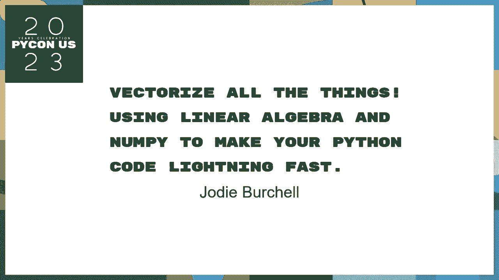
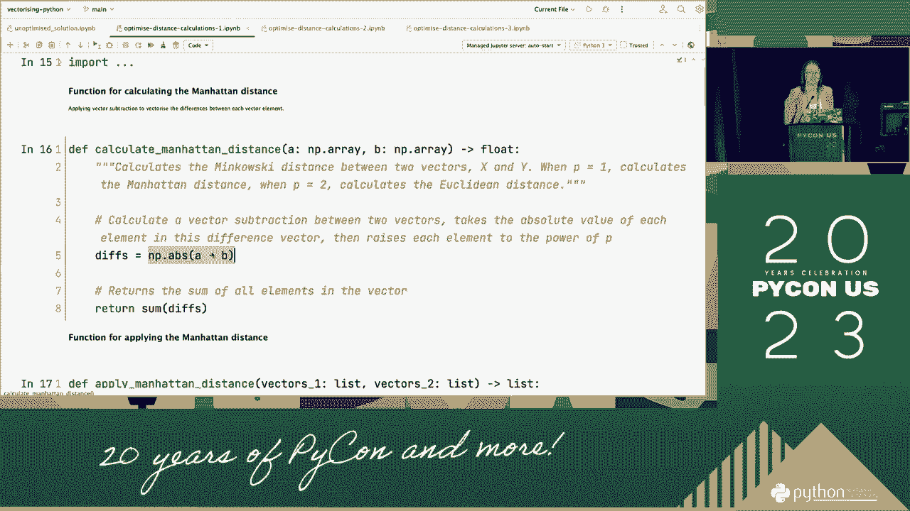

# P40：Talks - Jodie Burchell_ Vectorize using linear algebra and NumPy to make your Py - VikingDen7 - BV1114y1o7c5

下午好，每个人，下一位是乔迪·赫歇尔，谁会讨论向量化和所有使用线性代数的东西，为了让你的蟒蛇。

哇塞，观众，嗯，非常感谢你来听我的演讲，所以说，在今天的谈话中，我要教你一些方法，其中汽化蟒蛇可以帮助你改善你的家，以及爆炸一点点，那么我为什么决定，我是个自学成才的程序员，来自非技术背景，有几个。她实际上质量很好，我自学的第一门语言是Python，喜欢的东西，呃，在我第一次开始使用Python的时候，我真的很喜欢学校，所以我的面包和黄油，但我很快就明白了，不幸的是，我明白了艰难的道路是。当你击中那个击中并用数据缩放，我们变得非常非常强大，事实上，我真的不明白这个交易，我四处走动，这对我来说没有任何意义，但后来我做了一个布局，我意识到这会给我，那么我们要在这里面涵盖什么呢，我想做的是。概述几种可以使用的方法，我们要做的是，一种数据科学机器学习算法的迭代改进，所以我选择这个算法部分是因为我不是科学家，但也因为我认为这是一个很好的展示，你在衣服上打圈会卡住的方式。

可能是最明显的最好的方法，此外，如何用其他操作替换这些循环是驱动，所以我们将从复习，我将很快地介绍一下这是如何工作的，我会试着确定基线需要多长时间，然后在剩下的谈话中，我会通过邻居，我们在每个阶段。我们要把这里面的东西换成别的东西，每个州都将解释这些背后的数学原理，所以让我们从头开始，所以线性代数最基本的单元，所以你可以在这里看到三个不同的向量的例子，它们基本上是顺序的，嗯对不起，嗯。什么是值序列，因此，在机器学习的上下文中，向量被用来表示数据，我们可以看到在右手边，我有一个数据集的摘录，我们将使用，在整个分析过程中，它描述了图片的物理特征，一个相当奇怪的数据集。它有一些很好的特性来展示我想在这次演讲中展示的东西，所以你能看到的，下面是初学者集上的两列，三只蜜蜂，设置的三行，我希望你能看到每个矢量是否真的代表了，每个向量中的第一个元素是主访问长度列。

第二个是那个小调，那么这些向量用线性代数表示什么呢，为了这次谈话的目的，我们可以把向量看作n维空间中的坐标，那没什么帮助，所以让我试试，让我们从这里开始，用光束的散点图来对比它们对未成年人的价值。并使访问，这个情节说明了一个二维的，访问线的计算机代表第一维度，和代表SpeDimensions的次要访问线，你可以看到我们在最后一张幻灯片中看到的，表示为坐标，所以我们将要研究的光束起动器。总共有16个专题专栏，我可以代表每一个光束，存在于16维中的16元素向量，所以显然无法想象，很难想象，但我想强调的是，我们可以应用于二维向量空间的原理更容易理解，扩展到任何长度的大小。既然我们已经讨论了向量，矩阵很容易理解，在同一个向量空间里有一组向量，所以你可以看到这里有我们之前看过的三个向量，我可以把它们都放在同一个里，矩阵，在同一，然后如果我们把它带回数据集概念。

矩阵在概念上是等价的，所以我们类型中的Numpy矩阵和向量叫做Numpy数组，不幸的是，有不同的维度集，它不同于我们刚才讨论的，我想到了数字数组中的维度，因为数组可以改变的方向数量很低。所以让我更详细地说明一下，不出所料，表示为一维数组，是因为呃，向量或一维数组只能改变大小，在元素数量上，所以数组也有一个属性部分，形状是元组，它告诉你每个维度的大小，所以一维数组显然只有一个。矩阵不出所料地用二维数组表示，因为它们根据向量的数量和，最后，Numpy数组有一个更复杂的概念，叫做n维数组，这些基本上是你把一维或二维数组，你重塑他们，所以它们位于更高的维度，所以大家可以看到。我在这里用这个二维数组做了这个，现在重塑了它，所以它是一个三维数组，现在表示矩阵的数量，二是数字，所以我们可以用这个概念，和维度数组，就像这样，让我们去，所以向量空间的一个非常有用的性质是。

彼此接近的向量往往相似，而那些遥远的，所以你可以在这里看到，同类型的豆子，这些是不同类型的将远离，所以有很多很多不同的方法来测量距离和更好的空间，但其中最简单的是曼哈顿距离，这就是我们要看的。所以我喜欢把曼哈顿的距离想象成，我想象我在一个二维向量空间里，我只能在两点和y轴之间移动，所以我们可以在这里看到，如果我想在这一点之间旅行，B指向A，你沿着x轴旅行到单位，另外两个沿着y轴。把这些加在一起得到一个总数，我们不想每次都手动操作，所以如果我们计算一下，我们只要取x和y值的绝对差值，把它们加在一起，我们总共得到了，然后我们把它扩展到曼哈顿区表格，这告诉我们。我们把所有这些绝对差异的总和，第二个中的第一个，所以再一次，我想强调的是，我已经向你们展示了两个维度，如何计算距离，但我们可以这样做，因为这是任意数量的元素的维度，最后让我们开始，可以这样吗。

K近邻是一种机器学习算法，帮助您查找未知数据集的标签，基于标签和数据集，或者我们需要从数据集开始，所以我们要做的是把它分成一组训练好的，有正常标签的，以及测试数据集，它没有，我们在当时考点的一个训练点。所以用这个点来表示，我们测量它到每一个训练点的距离，所以在计算上有点贵，之后你已经可以看到了，然后我们所做的，我们取蛋糕取算法的名字，我们找出标签是什么，所以我们可以在这里看到，阿里是最常。所以我们要做的是把它分配给测试点，这就是我们如何得到每一个标签，为了完成这个测试，我们遍历了这个测试集，所以在计算上，我们现在有掩护了，我们可以看看如何简单地实现这个游戏，看看要花多长时间。所以你首先可以看到一个函数，去计算两对人之间的曼哈顿距离，我把他们中的每一个都表示为一个列表，因此，为了计算猫王的差异，我在那个地方盘旋，一次一个地做，把这些距离的绝对值加起来，就像我在。

但他们需要将这一点应用到每一个测试和训练点，每一种的组合，所以我通过这些现在的火车集作为名单，用这个绝对可怕的，哦，不，绝对可怕，嵌套用于循环，为了得到每一个测试点的排列，接下来我需要找到每一个。我走过我的距离，每个火车站都有一张清单和标签，然后把它们分开，我认为他们是根据交易到最佳点的距离，然后我提取标签并保留它们，最后我需要做的是重复每一个，所以我遍历了每一个训练点，这就完成了。那么让我们看看我们将要用来测试这个的数据，那我就用，这组豆子启动器有大约27000个观察，我所做的是，我实际上已经分成了三个不同的广泛，我有一个小数据集，有三个特色专栏和大约4000个观察。一个中等数据集，具有相同的三个特征列和27000个观察，然后我有一个大的数据集，只有四个点，我这么做的原因是，因为我想向你展示的是增加功能数量的效果，以及对循环成本的观察次数，我们如何改进这一点。

所以让我们来看看，这是一个小数据集，我们已经有15秒了，这是中点恢复到12分钟，对于近40分钟后的大数据集，而且是的，我确实坐着和时间，所有这些，让我们来看看我们如何才能。我们有一个问题是我们在做顺序计算，在大数据集中花这么长时间的原因之一，与中等数据集相比是因为我们在向量中有更多的元素，所以我们要做的第一个改进是，很明显试着摆脱这个循环，我们只需要把更多的理论。你使用向量减法的第一件事，当你有两个相同大小的向量或比特，你可以在他们之间做一个保护，很简单，基本上每个元素都排成一行，你得到了一个相同大小的向量或矩阵，包含这些差异，我们可以用向量做的另一件好事。我们可以把函数应用到向量矩阵中的每个元素，所以你可以看到我已经做到了，这里我在这个矩阵中传递了一个绝对值，然后将绝对值函数应用于这些元素中的每一个，作为回报，我得到了一个矩阵向量。

它包含了另一个中每一个的绝对值，原来如此，这就是你需要理解的所有理论，以摆脱这种循环，让我们看看我们将如何，所以如果我们去看第二本笔记本，你可以看到改进，我做的是第一个，而不是将每个向量表示为列表。现在将它们表示为一维Numpy基，我现在可以做这个绝对优雅的减法符号，这样我就可以摆脱连续的过程，那一定会，然后我可以将Numpy的绝对值函数应用到向量，然后一些，就这样。所以让我们来看看做得很好的区别，所以对于一个小的数据集，我们不会花大约8秒的时间，我们只剩下七分钟了，不可思议的是，我们只有大约九分钟的时间来处理一个大型数据集，所以如果你把它看作是基线时间的函数。对于中小型数据集，我们的速度快了大约一点八倍，在大数据集中速度快四倍左右，游戏对中小企业来说没那么好，那么我们在这里能做好什么呢，下一个我们可以去掉的洞，可怕的嵌套循环，我给你看的。

你需要做的所有顺序计算的数量的问题，作为函数增长，列表1长度的乘积，列表二的长度基本上是在计算，它们之间的排列，如果我们在一个小数据集中查看我们正在处理的数据集。我们已经为媒体进行了多达三百万次的顺序计算，而一个大数据集的结尾，把一亿一千四百万的顺序，这是机器学习标准的一个微小数据集，通常你有几十万，可能有数百万次观测为循环而争论不休。很快成为一个非常昂贵的选择，那么我们在这里能做什么呢，我们要把这个球处理掉，只是打个电话，但为了知道我们要怎么做，我们需要扩展一点关于减法的理论，我们要用，看一些你帮不了我们的把戏，所以首先。让我们想象一下我们有这三个向量，为什么会这样我们想找出它们之间的成对差异，我们一直在为接下来的四个人做这件事，所以让我们想一些方法来解决这个问题，我们可以把x，Y和Z都在同一个矩阵中。

因为我们知道它们来自同一个向量空间，我们还可以做的是，我们实际上可以将x因子复制三次，并在同一个矩阵中检查，所以现在我们必须把米设置在相同的大小，明智，所以我们可以做减法，所以这几天，但你可能想得很好。我们还被困在至少一个循环中，因为我们需要对y和z向量重复这个练习，会是这样，如果我们只能使用二维数组，但我们知道那个数字，我可以处理三维和更高的数组，所以让我们看看如何利用这一点，假设我们从包含。我们把它表示为一个二维，然后我们把它重塑，所以现在是一个三维的家伙，一个三四个，一份那个矩阵的副本，我们不复制它，把那些副本一起洗，所以我们有一个三乘三乘四的，三维。我们可以用包含三个副本的矩阵做类似的事情，我们重塑它，所以它现在是一个三维数组，我们和Y做同样的事情，一起看他们，我们还有三乘三的，但是当我有两个相同大小的物体时，他们在每个维度上都排成一行。

所以我们可以做一个简单的减法，我们现在限制的消除了计算效率低下，我们不再受顺序处理的约束，不幸的是，我们在内存效率方面又创造了一个低效率，因为我们已经明确地复制了我们的数据，我们现在需要抓住它。所以幸运的是麻木帮了我们，用一种叫做广播的把戏，广播本质上是一种记忆，Numpy做这种操作的有效方法，我们不需要在数组中进行显式复制，所以它的工作方式是，如果我们想用两个数组做一个操作。Numpy会首先比较它们，检查它们是否有相同的，如果没有，那太好了，不需要做任何事，你可以直接做一个减法运算，就像我们在上一张幻灯片中所做的那样，但如果不是，它会检查其中一个尺寸是否是另一个尺寸的大小。它要做的是在引擎盖下，隐式复制两个较小的数组，所以它现在的大小在那个维度上是相同的，这是一个有点奇怪的概念，所以让我们来看看，所以如果我们举一个小例子，我们可以做的是。

我们可以从包含一个副本的两个D数组重新开始，在第一部分我们可以重塑它，对不起在上面，对呀，所以再一次，我们有一份那个矩阵的副本，它位于三维的第一维度，我们可以从这里下去再把它改造一下。这次我们把它改造一下，所以我们有一个矩阵的副本，在二维空间提到，当我们做向量减法的时候，Numpy要做的是比较每个第三维度的大小，大小一样，第二个维度是它必须从，所以在第一射线的第一维度中。你想把它伸展到3号，在第二个数组的第二维度中，现在将把它拉伸到大小，所以它可以做这个减法，我们最终得到了另一个三乘三乘四的回报，包含四种不同颜色的三维彩色，这就是现在的理论，让我们跳过练习。我们做了很多改变，而不是用两个独立的函数来计算成对曼哈顿距离，然后应用到每一对火车上，我们现在把它组合成一个非常优雅的，所以我们所做的是我们现在通过所有的火车观察，作为二维裁判阵列的测试观察。

我们能做的就是广播减法，我们用这个滑动符号将这个二维种族重塑为三维，没有我们想要的尺寸，那么我们在最后一个维度中得到的是相同的大小，第二层的大小和一个的大小，第一年我们现在可以做广播减法。我们要做的是一个三维数组包含了所有的差异，再次，我们只要用绝对值函数对它们求和，我们最终得到了包含所有这些距离计算的二维数组，就这样了，所以让我们来看看区别，我们在此时此地，这个小数据步骤缩短到1。5秒，一分钟的数据集和三分钟，所以现在已经破坏了惊喜，我们现在的速度快了10到13倍，只是几个简单的改变，我们在这里还有很多工作要做，我们只是乱搞了一下距离的矢量化计算。我们仍然可以和邻居一起做这些工作，就时间生命而言，谁是最大的两个罪魁祸首，我们可以很好地瞄准这两条线，这里，一种是我们对所有的距离进行排序，在测试点和每个索赔点之间，第二个，我们基本上提取与最近的，呃。

培训点，然后你知道这样做的理解，那么为什么这些会有问题呢，嗯，让我们从排序排序列表开始，在Python中被锁定为单个排序算法，这叫做排序，相比之下，麻木的思想和艺术的思想都有更多的灵活性，所以说，例如。不选择排序方法时，Numpy将默认为更快的排序记录，Numpy的另一个优点是每个元素都是相同的数据类型，使用的算法numpy可以优化数组的特定数据类型，然后第二个问题是最，在这种情况下，他们是如此。他们可以是阻挡者，因为本质上你必须遵循顺序过程，那么让我们来看看我们如何做期末考试，第二个功能是什么，你知道的，只是第三个功能，我们所做的不是在远处传递，和标签作为李传递手段作为一维非营利。我们可以做的是使用这个V堆栈方法，为了把它们转换成二维的，这条线是所有魔法发生的地方，我们所做的，所以我们认为专栏，或者包含我们提取的所有计算的向量，然后我们用这个漂亮的切片和符号来剪掉。

或者包含标签的向量，而不需要遍历所有内容，所以让我们看看这是什么游戏，所以对于小数据集，我们现在将大数据集的时间缩短到13毫秒，我们只剩下15秒了，对不起，媒介，然后我们现在要做的大数据集。所以如果我们把它看作是基线的函数，对于十五到一次以上的大数据设置，小的快一千倍，这些似乎是相当极端的改进和速度，但环顾四周，我看到大多数人都能得到，你知道非常相似的数字，因此，对代码进行一些小的更改。我很肯定你能复制这些结果，就是这样，嗯，以下是我在Twitter和Mastodon上的联系方式，我有一个数据科学博客，我已经跑了大约，我已经很多年了，显示页面，上面有很多话题。但我确实有一个关于这个主题的系列，你想说得更详细一点，这个二维码会直接带你到O，使用相同的代码书演示文稿，所以非常感谢你，如果你有几分钟的时间问一些简单的问题，如果有人，你介不介意去麦克风那儿，只是。

所以我的最后一站，所以理解还是，所以本质上，而不是这样，公约的来源是我们最初所做的，我们创建了一个列表，所以我们把包含标签的列表和包含距离的列表放在一起，所以结构现在是一个列表列表。所以为了在最后把这些标签拿出来，我反复检查了，列表的组成部分之一，取出第一个元素或第二个元素，不管是什么，然后只留下那个，所以为了消除这种情况，我们现在所做的是Numpy数组，本质上得到包含。就像组合一样，几乎就像带列的数据帧，所以与其像每行一样循环，我所做的是，我只是附上一个专栏，所以你排除了，就是说，你可以直接说，我只是想让我的评论作为子集，取而代之的是，没问题，下一个男人。我自己也一直在努力快速优化，就像我最近得到了一些，从心脏到心脏的优化矢量化的数字代码，我明白了，是啊，是啊，如果或建议呢，你知道的，让这更容易，这是一个具体的点，我本来想说，好啦，让我们选第一个例子。

在第一个地方，回去吧，我用了这个减法，这也是跟踪方法，就像我在想的那样的小变化，你知道从，如果你的团队同意，你觉得这更明确吗，还是觉得这个减法，但我也想说的是，我不明白这些东西，直到我理解了线性代数。但我想我希望你们能看到，我没教你多少代数，真的真的很简单，因此，您可以做的可能只是在注释中显式地，可能是文档的一部分，你可以说我们在这里做的是矢量化运算，它表示两个向量的减法，是件小事吧。这是一种有点笨拙的方式，如果其他人有什么建议，请随时加入，嗯，但是是的，当然从我的角度来看，我真的需要了解他们之前，我可以实施同样的分手，所以真的，我想在，我听到你说的了，如果有人看到报价。这到底是做什么的，然后是这个，你知道的，谁的责任问题，是不是第一次读代码就明白了，还是你写代码是为了让它尽可能容易，但是当你分解它的时候，马克不是做的，是呀，是呀，告诉我与Max教科书的许多遭遇。

我想我们可能没时间了，你进入卡尔文时间，但之后请一定来找我，接下来的几天我也会陪着你，这次冲刺，所以我很想聊聊这个话题，谢谢你。

