# P44：Talks - Juliana Karoline de Sousa_ Create interactive games using MicroPython an - VikingDen7 - BV1114y1o7c5

下一位是朱莉安娜，谁会呃关于如何创建互动游戏使用电子设备和麦克风，把它拿走。
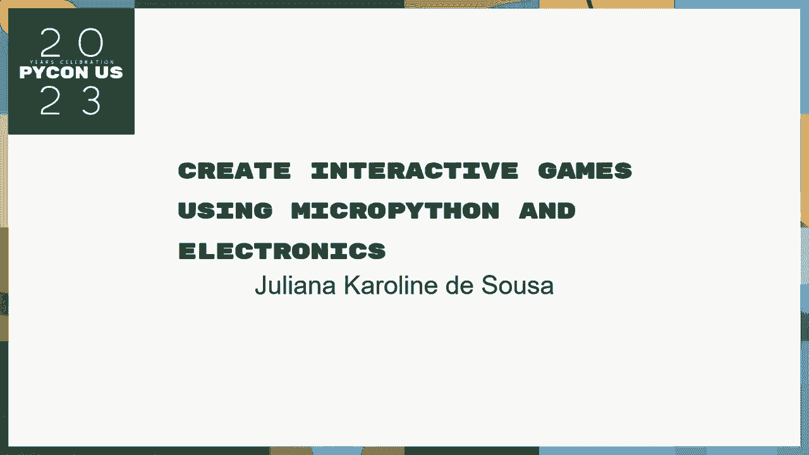

你好，你好，呃，我叫朱莉安娜，呃，我来自巴西，呃，我住在圣卡洛斯，哪一个城市，某个政策日，呃，我搬到了哈士顿南部，我有一个联邦大学的计算机科学学士学位，在一些卡洛斯，我们有很多技术社区。所以在2014年我找到了石头卡洛斯这个角色，它是巴西最古老的记录之一，呃，所以我们也有本地的每个用户组五个人，按银行家称为组，我们是一个叫庞的小组，我是这两个项目的共同创办人。我们的运河软件工程师很经济，在我甜蜜的时候，我喜欢玩机器人作为一个乐队，我也喜欢我的猫。
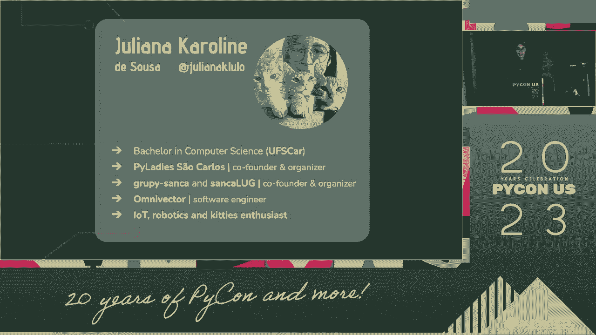

这些是我多年来开发的一些项目，所以第一个叫做顺时针方向，你用智能闹钟，这让你通过瞄准天气预报来工作，你的呃，我们谷歌日历中的事件，我还有两个专为比赛而生的强盗，因为一个是在爪牙里，另一个是超级英雄。我也有一些机器人，所以我有一个，有避免的障碍，我也有一个机器人摄像头，所以这里的机器人和最后一个机器人，他们都用微蟒，所以最后一个是我最新的一个，使用你手机上的地图，你可以控制IG的颜色。转动机器人的头部，让它四处移动，呃，这两个都是用Micropython，这就是我今天要做的演示，这里有游戏机吗？所以我今天要用演示的这一部分，所以这就是我要说的，我还概述了游戏手柄，它是如何工作的。为了了解它是如何工作的，我得深入了解你的细节，我有别针，你把一个输出，之后呢，我将展示如何用micropy编程，我将展示三个活跃游戏的例子，你可以用这个游戏来做，所以呃。

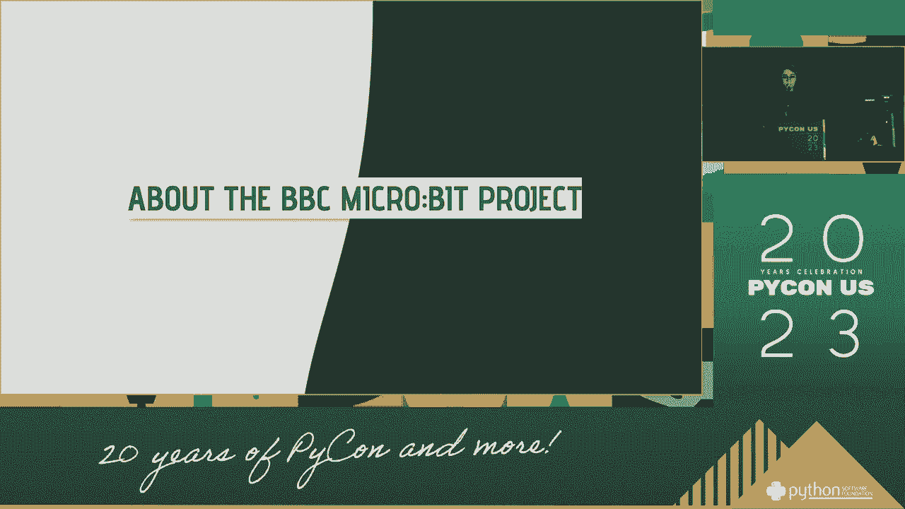

所以它真的很小，它是信用卡大小的部分，这是一个由，没看到在，呃，英国，他们的目标是把这种竞争设备给学校的孩子们，所以他们可以进入计算机科学和编程，这个设备是免费给孩子们的，公立学校。他们能够得到这个在学校和家里都使用，所以我们的想法是让他们有，因为我觉得那很酷，所以这两者，呃，教授们和他们也应该免费分娩，是给孩子们的，所以它很友好，他做过开源项目，也不开放水电项目。这是我们的一些规格，所以这块板上有一个宏处理器，它控制引导堆栈和板上的所有组件，呃，它也有，嗯嗯，恩瑟在这里，也适用于紧凑型，我们有一个扬声器，你可以用，呃，你也可以用电池给它供电。所以你不必使用任何USB电缆，在棒的背面，我们有这个矩阵，您还可以显示图像和滚动文本，这里的徽标是经过测试的顶级徽标，所以它也可以作为一个按钮，我们还有一个麦克风，所以你可以做，呃。

用扬声器上的麦克风发声，我们这里也有，但你也可以把那些，在板的底部我们有一个边缘连接器，所以连接器有20个VI打开，把它们藏在这里，你可以吃三个，呃，使用导航工具包，或者您可以使用扩展器来解释所有这些。那么那些GPI开口是什么呢，所以对于那些以前用过其他板的人来说，就像家里的馅饼或多利诺，我们有像浆果派那样的别针，它是一只雄性，为了阿杜诺，这是一件熟悉的事情，我们这里有一个边缘连接器，所以这是故意的。因为这是我为孩子们发现的地方，呃，它没有锋利的东西会伤害孩子的手，所以它是，呃，两边的边都是大头针，它是为此而生的，因为它是，呃，想着孩子，那么我们如何利用这些东西呢，所以CPIO是用的。当你与某些设备没有通信标准时，所以呃，当你需要在发生器上使用某种传感器时，它没有像mgmi那样的接口，I或B使用GPI，P呃，控制数字和模拟信号，所以距离信号是当你只关心它是开还是关的时候。

你只关心这两个值，但你知道我们叫，我们关心这里的社区，所以你想知道它离你有多近，是五伏特，或者零伏或者两点三伏，取决于您正在使用的条，所以我们有这两种数字或模拟信号，我们可以把它们都用在PIO计划上。所以我们有一些特定于模拟输入和输出的东西，在某个地方进行数字输入和输出，所以你可以用果汁来读写这些值，使用GPI开放。
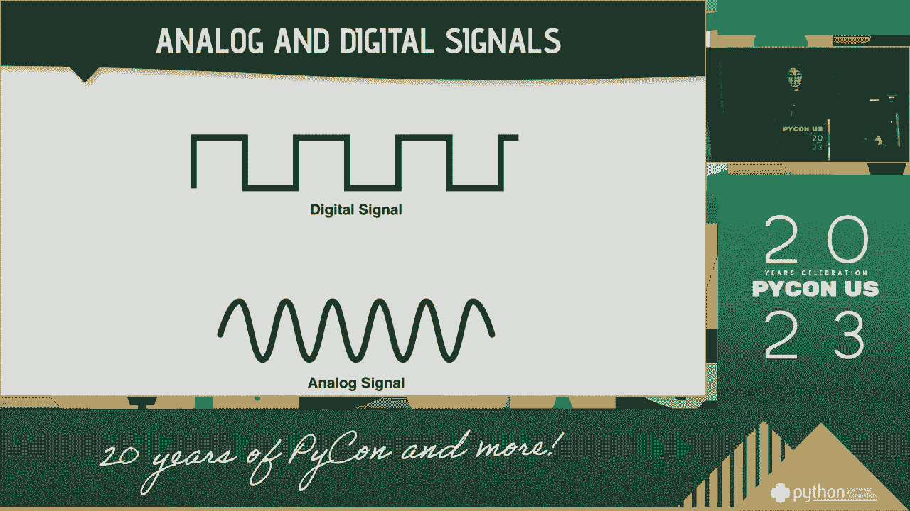

呃，我要谈谈游戏手柄，所以这边这个。
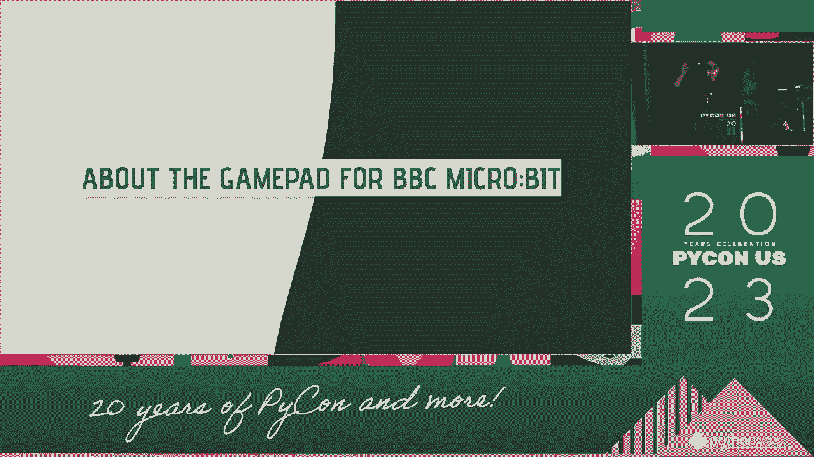

所以游戏卡，呃，我从快递公司买的，好像是15美元，很便宜的是我找到的第一个，所以我对这个没有任何实际的东西，你可以找其他任何一个，但这个和这个一样有很多功能，呃，所以它包括的价格，呃，边缘连接器。所以你可以检查微型位并使用它，而不必插入，它还有什么，呃一个渠道干棒，所以你可以把它作为游戏的输入，呃，它有一个车载电池充电器的秘密，所以你可以把电池放在这里，如果你愿意。你也可以用这里的充电秘密给电池充电，董事会有更好的文件，所以你可以看到你以前有多好，呃那边的压碎瓶，你也可以用来装食物的彩色瓶子，在顶部我们有两个侧边按钮，与黑板上的按钮相连，我之前提到的底部。所以不用这两个，你可以在游戏上做，它还有一个蜂鸣器来播放声音，所以如果你有，呃，我带来了运行在以前版本的迈克尔B，我没有扬声器。

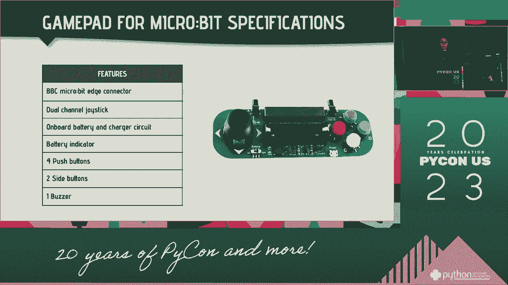

你也可以从游戏手柄上使用这个扬声器，下面是游戏垫与微型位的连接方式，所以我们有22个I O隐藏在边缘连接器中，所以当你把栅栏连接到游戏板上，游戏板上的每个功能都连接到酒吧里的一个大头针上。在游戏的背面我们有一张桌子，每个部件都连接到电路板上，所以这里我们有所有按钮的别针，干棒和粉色挡板的别针，所以你可以在课程中使用这个来了解，呃，您正在处理什么样的组件，呃每个队。所以我们在吧台上的一个例子，有数字和模拟输入和输出，所以为了推动我们，我们有，呃，数字输入，所以我们只有表达与否，所以这只是两个值，但对于模拟来说，呃，为了激烈的，它是模拟输入。因为我们想知道时间在多大程度上，所以你想知道用户在多大程度上按下方向，所以它是一个模拟输入，在这里展示，我们可以有数字和模拟输出，因为我们要用这个，呃，向玩家显示信息，所以你可以用它作为输出。

如果你只打开或关闭，所以这两个值，但你也可以用它作为模拟输出，如果更改像素的亮度，所以你可以用它来制作，你可能只是，呃，更明亮，所以呃，我将向你展示如何编程微型位。
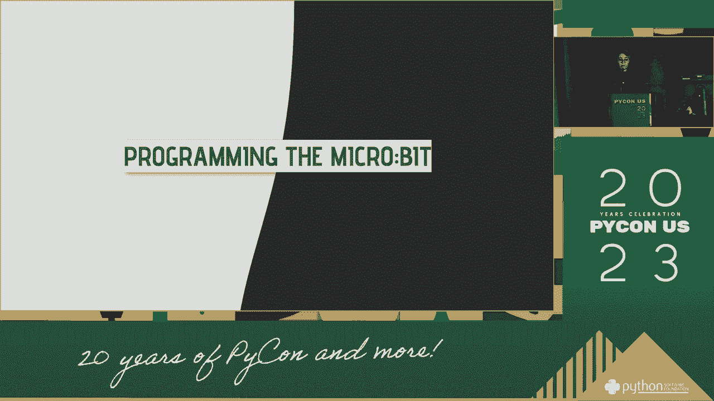

所以微比特是微Caron我们的，所以当你得到微小的比特，您可以在没有，必须撞毁任何东西，它已经附带了这个绿色的塔尔，所以呃，呃，微蟒，它是Python免费的实现。所以它是为微控制器和低计算量的设备制造的，呃，功率和低功耗，所以它是这些设备的舞台，会有宏就是其中之一，所以这就是为什么你可以用电池给它供电，因为它的功率很低，以下是如何防止微小比特，所以呃。如果你去微b点组织，在MicroB中有两种编程选项，其中之一是使用块编辑器，哪个对还不知道如何编码的孩子更容易，所以你读一下那块比较容易，但是如果你有一些编程知识，您可以使用Python文本ED。所以在上面你有，呃，一个非常好的纹理，有自动完成已经突出显示，效果真的很好，嗯，我们有TE，所以如果你想了解我们为你提供的任何公司，你可以在，如果你呃，核对资料，您希望将代码块拖动到编辑代码的位置。

你也可以那样做，在这里你可以把这个块拖过来，它会为你复制它，这边还有模拟器，所以如果你没有酒吧，但是你想用微蟒，您可以使用浏览器上的模拟器，而且效果也很好，所以你可以把输入发送到这里，您可以使用，呃。这些按钮，如果你愿意，你也可以使用这里的终端，你有回购，呃，编辑器内部也是，当您完成代码编辑后，你可以点击这里的微生物，它会下载一堆十六进制的火，你可以把这堆东西保存在吧台上，就像拇指驱动器一样。所以我们把那边的文件包起来，它会让你的代码崩溃，并尝试在没有配置任何其他内容的情况下运行代码，所以呃，我要给你们看一些例子，你可以在微波炉里用，第一个是显示示例，所以今天我们可以展示一个图像。我们已经看到了最后的图像，它们已经为你准备好了，所以在这种情况下，我表现出快乐的脸，呃，您还可以设置一个特定像素的亮度，所以你传递像素的坐标，你传递了光明，它为你改变了它。

如果你不想用一个非常明确的图像，你可以创建我们自己的图像，呃，串联字符串，然后在这里传递每个像素的亮度，呃，还可以滚动文本，所以你最好，并将为您展示，如果你需要你，也能听到他们，所以呃。我讲述了我们的例子，所以我们在黑板上有两个可能的按钮，这些按钮已经被抽象出来了，所以它们被称为底A和底B，您不需要为那些配置PIN，我们可以旋转它，呃，底部此刻存在，如果它存在于过去。在我们上次使用这种方法时，它被测试了多少次，呃，关于这个例子，这里，呃，如果你点击底部，左边会显示一个错误，这是我们有的图像文件之一，如果我们点击右边，你可以看到另一个箭头，所以如果你有一个旧的微波炉。没有，呃，演讲者，但你可以插电，呃，蜂鸣器，把它插在这里，如果你这样做了，并使用音乐库，你可以，呃，播放一些预定义的音乐，所以它附带了一些已经准备好使用的，你可以通过一个经常考试和另一个考试来做呃。

一条鱼，或者你可以创作自己的音乐，模糊音符和每个音符的持续时间，呃，至于测速仪，你可以得到三轴的加速度，X，Y和b，所以呃，你只需要在打开的时候做一个模拟，每个轴的美丽，但这里有一个非常抽象的。所以我们可以用get，我GB和你可以得到信息，我们也有一些p的手势，所以如果你想看看黑板是否被拿走了，如果它是朝上朝下的，如果它有花粉，你有各种各样的气体，我们已经，所以呃，一个gpo示例。所以正如我提到的，我们将使用这个圆周率与游戏手柄接口，所以对于那些需要这样做的人来说，你得知道，呃，你要读的是什么，所以在这个例子中，我用的是十十五，就是游戏垫的白底，对于这个，读数是颠倒的。所以如果按下按钮，它将返回零，如果底部没有创建，马上二十一点了，所以在这里，呃，通常可以传递到引脚上的值，呃，一个非常床单的例子，所以使用analbecause，它是一个模拟，呃，投入，所以呃。

你可以阅读，呃，然后用模拟的，你可以看到，呃，区域，呃，在地球上，在这里，你左边有不到四百个追求者，右边有六百多人，如果它在，因为它转向任何方向，我们可以得到同样的x-y轴。所以你可以看到如果你把它打开，好吧好吧。
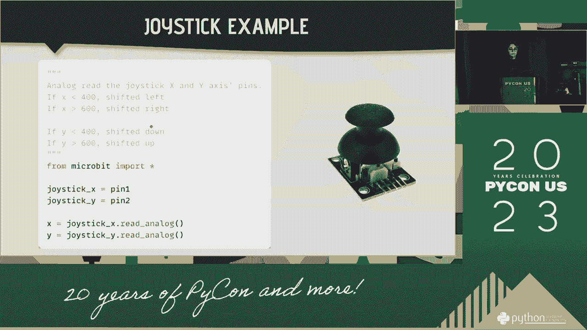

我们将在数据中使用这一点，所以让我们来看看游戏示例，所以我准备了三个不同的例子，今天在这里展示，呃，其中一个叫天才，另一个叫追狗，另一个叫呃，车祸，所以我要向他们每个人展示，呃首先这个读书计划。显示逻辑是如何工作的，然后一个视频，然后继续第一个代码的某些部分。
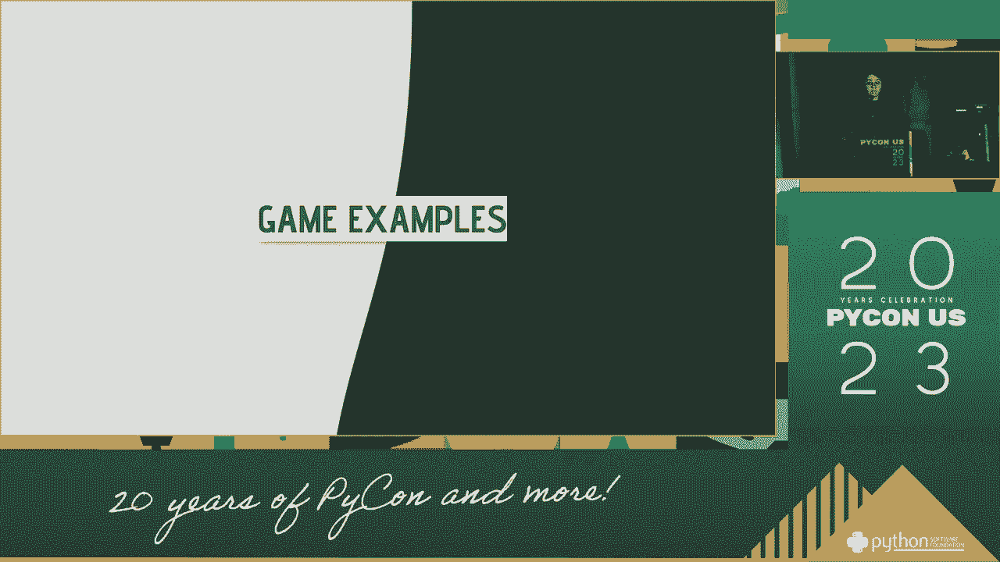

所以第一场比赛，在巴西，这个游戏叫天才，我觉得美国叫道，我不知道别的地方怎么叫，但我保留了天才，因为这样你才知道去巴西，所以这里的想法是，我们将画一个随机的方向，所以我们在这里没有权力。所以我将用箭头来指示方向，所以我们画我们实际的，然后我们把它添加到序列中，并向用户显示序列，呃，然后我们读取输入，如果输入正确，我们要画另一个方向，添加到序列并将信息保存在序列中，直到用户做错了。如果你弄错了，我们结束游戏，然后你重新开始游戏，所以下一个玩家也可以使用酒吧，所以游戏可以在酒吧里循环播放，是啊，是啊，所以呃，怎么样呃，我怎么得到这个游戏，所以呃，三人再出发。我们将等待用户表明他们已经准备好玩了，所以我们要等他们按下上面的两个按钮，同时表明他们已经准备好了，呃，当你按盒子的时候，在我们开始倒计时的同时，然后我们再次发起，在游戏中我们有一个序列。

所以对于这个序列，我们有四个方向，北方，带S的南方，我们将展示，呃，图像表示的方向，我们将播放一个与这个方向相关的频率的披萨，这样用户就知道，他们如何将方向与声音联系起来，它使它更容易，并将输入，呃。序列的运动，所以我们展示了，序列中的所有动作，之后，我们点亮显示器，表明它已经准备好了，使用来自用户的输入，然后读取输入，所以我们在这里有一堂课来分散按钮的注意力，因为我们没有那些按钮。在新比特的Micropython应用程序中，因为我们只有A和B瓶，呃抽象，所以其他这些，我们需要用两个故事，所以在这里我有一个尝试，我们需要，呃，按了哪个按钮，然后重播同样的大时间，展示同样的图像。把城市还给用户，他们呃，屏幕上显示的方向，然后我们需要验证用户输入，所以我们想一个时刻一个时刻地做，因为如果你，呃，让用户拥有所有的动作，他们把第一个弄错了，我们不想让他们继续玩，直到我读到序列的长度。

所以在这里，呃，我们将成为，呃，逐个掌握动作并检查，如果到目前为止的动作和那些，然后当用户弄错了，我们正在播放播放配乐，呃，我们展示了这辆车是序列中的一辆，减去一个，因为它把最后一个弄错了。然后我们把一切都清理干净，我们重新开始，然后在这里再次奔跑，这个的逻辑是中心，所以我们只要显示答案是正确的序列，我们再次创建序列，它不在游戏上，现在我将展示第二个游戏示例，它被称为桌点。所以这个想法是你在屏幕上有一个盒子，我得去后面追，所以你用呃，舞蹈适合改变黑暗，你也可以用测速仪，如果你按下一个按钮，然后你可以感觉到这个时候移动人行道的栅栏，那么这个呢，我们将使用户更难获得点。所以如果过了一秒钟，玩家还没有得到点，你要把点放在随机的或再次，所以你得不停地在屏幕上追逐它，如果比赛开始后已经过了25秒，你将会结束这场比赛，所以我们有25秒的时间来得到尽可能多的点，如果你得到了狗。

你得一分，然后我们就说呃，表示你得到了狗的盒子。
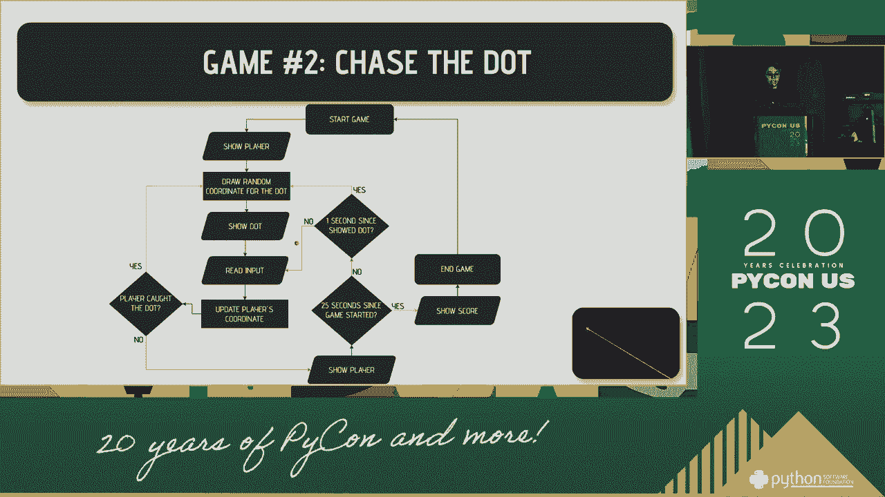

你在第一部分，我在用警戒线，所以你可以看到酒吧，你可以把那个，我觉得使用JavaScript，好啦，那么这个呢，我们有一个坐标点，我们在显示的约束之间生成的，当你得到点，你要撞车了。它表明用户得到了正确的方向，然后呃，当我们把这个点，我们开始点显示的时间，所以我们可以让它在一秒钟后移动，读取输入，我们将在这里有一个谈话按钮，所以如果按下按钮，我们将使用计数器，如果它没有裂开。你要用干抽水马桶，然后移动玩家，我们将成为，呃，读取输入，然后我们计算一下，呃，如果它在动，呃，它应该向哪个方向移动，然后我们只需再次更新显示约束之间的坐标，然后检查碰撞情况。我们只要检查点和玩家的坐标是否相同，然后这里，呃，渲染游戏的逻辑比前一个稍微复杂一点，那么这个呢，我们需要从游戏开始的时间开始，所以呃，我们可以看看这个，已经过了25秒，我们还需要知道，呃，好吧。

展示一下，呃，一秒钟，所以已经过了一秒钟，我们需要更新坐标，如果没有，我们只有坐标，当用户与，做。
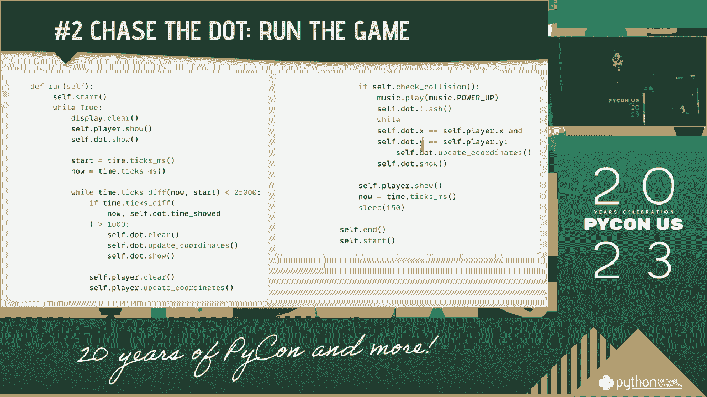

最后一个例子叫做车祸，所以它类似于那些旧的赛车游戏，所以你有障碍下来，你必须避免成本，所以我们要用这个，呃，呃，屏幕刷新率，所以用户可以移动汽车，呃，注射边境的口粮和向下移动的障碍，所以我们这里有，呃。这本书，我们不断读取玩家的输入并激活汽车，直到我们达到正确的刷新率迭代，当你读到更新的迭代，我们现在要把所有东西都搬走，所以我们检查障碍物是否已经在屏幕底部，因为如果是的话，我们需要检查球员是否碰撞。但如果不是，我们只要把所有东西都移到边境和障碍物上，如果玩家的部分障碍，我们在顶部制造一个新的障碍，我们加速银行，呃，我们提高了游戏的速度，所以它得到了，呃，更快更难玩，当然还有，如果玩家与障碍物相撞。我们结束比赛，我们展示他们的得分。

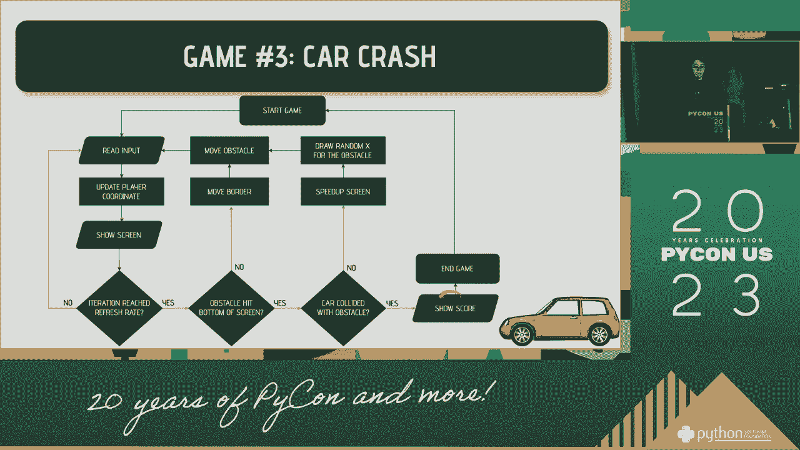

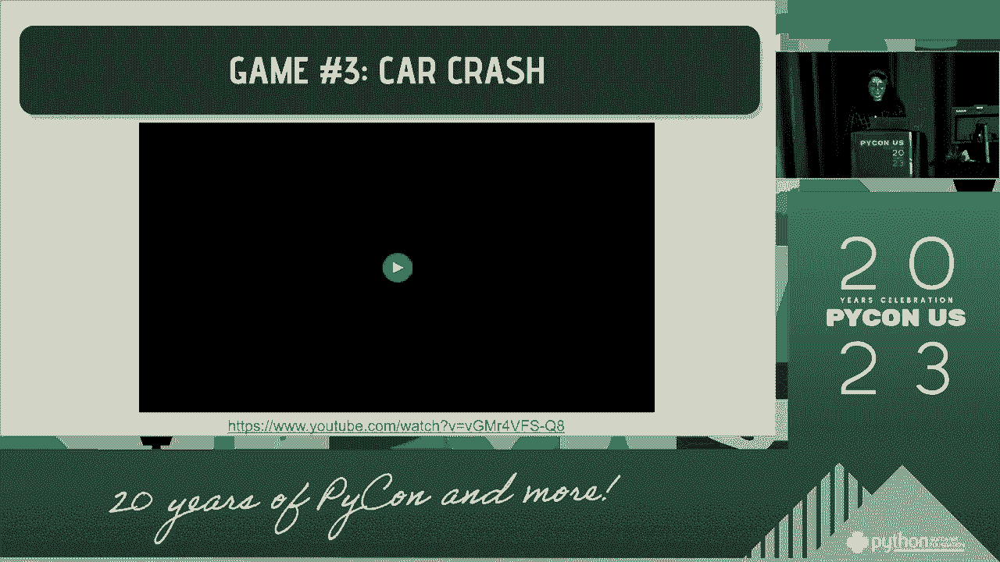

所以呃，为了这个，我们有选手在障碍中，所以玩家只会在x轴上移动，在屏幕底部，障碍物将沿y轴移动，所以呃，我们生成屏幕顶部的点，并不断向下移动，直到它到达屏幕底部，在那里我们生成了，又在上面。所以为了给人运动的感觉，我们有边界，所以边界一直在移动，呃，一直到呃，把障碍物放下，边界上升到，呃，给人运动的感觉，在屏幕上我们有黄油的概念，所以我们想展示边界，玩家，和障碍同时，因此。生成自定义图像并一次显示它更容易，而不仅仅是播放每个像素，所以我们有公共汽车的第一个派对，屏幕，我们还有刷新率，呃快点，所以当我们，我们避开障碍，我们让刷新率，呃，所以他们加速，呃在增加。下面是缓冲区的工作原理，所以对于边界，我们有左边的像素，右边的像素在向上移动，另一部分沿着这个最直角向下移动，在这里，玩家总是在底部，所以要创建一个缓冲区，我们所做的，呃，我们先得到障碍空间。

然后我们把障碍物的亮度放在，那个呃，障碍应该是，我们还得到了边界，所以这里的边框是一个列表，然后我们反转列表，使其在边界中，所以我们要越过缓冲器，把它放在屏幕的左右，我们把这个边框，在那里会有障碍。所以你只是不切断y轴上的障碍物，障碍应该在哪里，所以这里的一个矩形，之后我们要把玩家放在底部，但是把玩家，我们可以用同样的方法把边界，呃，最后一行的播放器空间，因为如果最后一排的障碍物，你会覆盖，呃。到目前为止的障碍是我们得到的球员，呃，在我们把球员放倒之前，然后我们得到我们所拥有的，在那之后，我们把所有的东西连接起来，把它带到屏幕上，在这里再次奔跑，我们有迭代，所以在我们到达迭代之前。玩家将移动牌，一旦我们读到迭代，我们检查它是否碰撞，如果没有，我们只是增加，1。这辆车又加速了。呃，不断移动周围的障碍物。

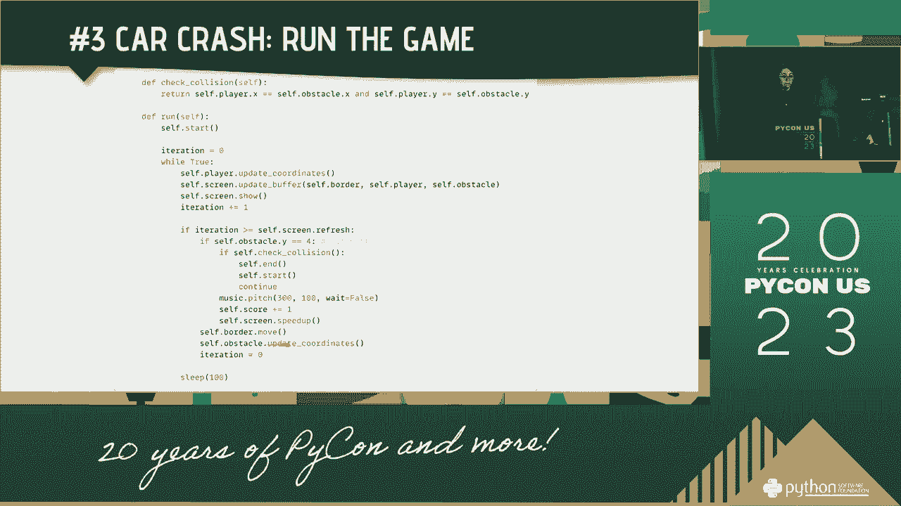

所以我今天的结论是，微网格和微蟒蛇是放克的结合，呃，我喜欢这个部分的很多工作，我发现玩真的很有趣，所以我希望你也能觉得它很有趣，谢谢你的关注。
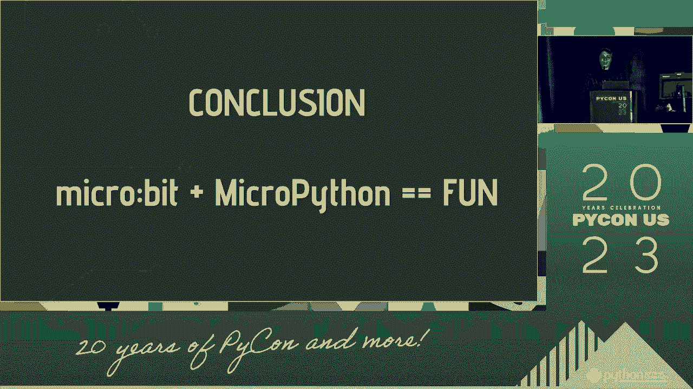

所以说。
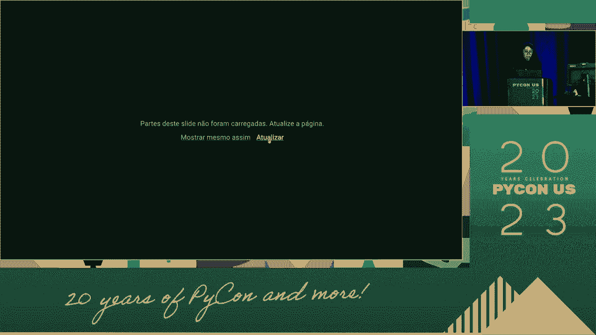

所以这里是稀疏代码，为了，运动会，在我的GitHub上，呃，如果找到我的人，你可以找到我用我的手柄，你几乎到处都能找到我，使用手柄，所以你可以在衬里和GitHub找到我，呃，这里是完整的第一个。今天我们将有一个关于嵌入式Python的开放空间，所以是下午5点51分，所以我要把游戏带回来，所以如果你想玩游戏，呃，我们去那儿聊聊天吧。
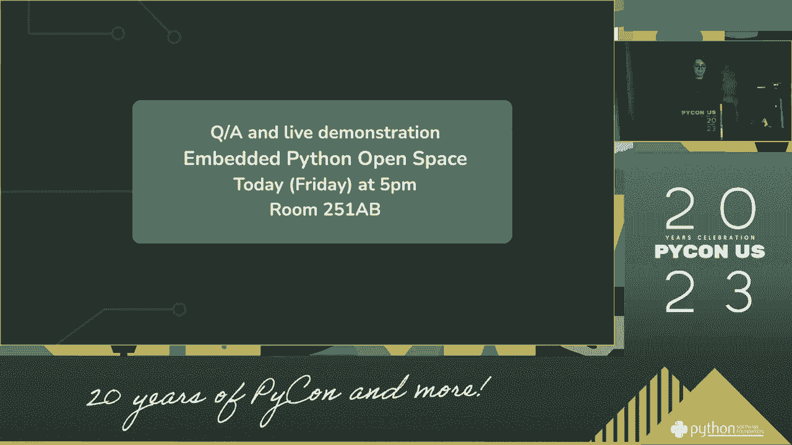