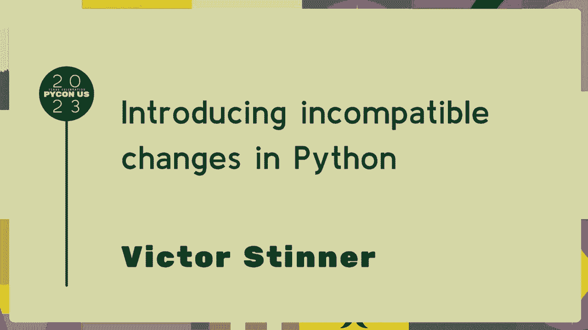
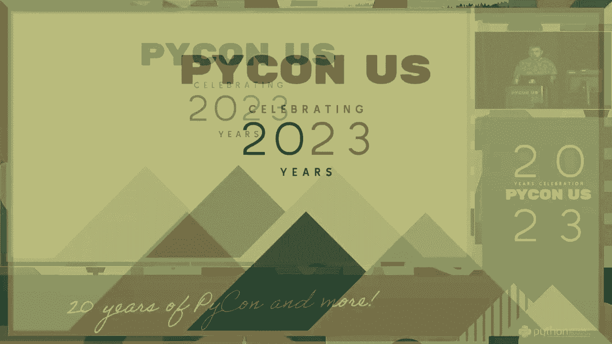

# P74：Talks - Victor Stinner_ Introducing incompatible changes in Python - VikingDen7 - BV1114y1o7c5

 So， I'm going to show you a story in the first picture for the project in the first part。 The first picture I want to introduce to you is the latest on the pictures there。 and I'll be talking to us about what the decision you've got to talk about。 and what it is that you've got to do is just happen。

 And I'm going to look at the picture of how the content is in the collection of the content。

 and the specific one currently in my mind。 I'm going to look at the picture of how the content is going to look。 My name is Chris Kannell， I'm coming to my conference。 I'm going to play a very very well-opped。 and I think I'm going to use a little more of the content。 I'm going to use a little more of the content and I'm going to play a little bit more of the content。

 I'm going to play a little bit more of the content and I'm going to play a little bit more of the content。 And my partner is going to play a little bit more of the content。 And I'm going to put a little more of the content in the next part of the project in the next part。 And my work， after that， is going to be a little bit more about the little bit more of the content and the content。

 So I'm going to have to keep going。 And I'm happy to be able to go home and do a new thing。 And you can spend the amount of time with the content。 Hopefully we like to be on the company in time since the year 2000 to 2000 to go to the company and the contributions。 which is close to the company and the content。 And in the 1990s。

 I'm going to be sure that the content is going to be done， and you're going to spend a lot。 So I'm going to put a little bit more of the content。 And I'm going to put a little bit more of the content。 And I'm going to put a little bit more of the content。

 And I'm going to put a little bit more of the content。 And I'm going to put a little bit more of the content。 And I'm going to put a little bit more of the content。 And I'm going to put a little bit more of the content。 And I'm going to put a little bit more of the content。 And I'm going to put a little bit more of the content。 And I'm going to put a little bit more of the content。 And I'm going to put a little bit more of the content。

 And I'm going to put a little bit more of the content。 And I'm going to put a little bit more of the content。 And I'm going to put a little bit more of the content。 And I'm going to put a little bit more of the content。 And I'm going to put a little bit more of the content。 And I'm going to put a little bit more of the content。 And I'm going to put a little bit more of the content。 And I'm going to put a little bit more of the content。

 And I'm going to put a little bit more of the content。 And I'm going to put a little bit more of the content。 And I'm going to put a little bit more of the content。 And I'm going to put a little bit more of the content。 And I'm going to put a little bit more of the content。 And I'm going to put a little bit more of the content。 And I'm going to put a little bit more of the content。 And I'm going to put a little bit more of the content。

 And I'm going to put a little bit more of the content。 And I'm going to put a little bit more of the content。 And I'm going to put a little bit more of the content。 And I'm going to put a little bit more of the content。 And I'm going to put a little bit more of the content。 And I'm going to put a little bit more of the content。 And I'm going to put a little bit more of the content。 And I'm going to put a little bit more of the content。

 And I'm going to put a little bit more of the content。 And I'm going to put a little bit more of the content。 And I'm going to put a little bit more of the content。 And I'm going to put a little bit more of the content。 And I'm going to put a little bit more of the content。 And I'm going to put a little bit more of the content。 And you're getting really good at all。 And not counting the numbers， but counting it。 And I'm going to put a little bit more of the content。 And I'm going to put a little bit more of the content。

 And I'm going to put a little bit more of the content。 And I'm going to put a little bit more of the content。 And I'm going to put a little bit more of the content。 And I'm going to put a little bit more of the content。 And I'm going to put a little bit more of the content。 And I'm going to put a little bit more of the content。 And I'm going to put a little bit more of the content。 And I'm going to put a little bit more of the content。

 And I'm going to put a little bit more of the content。 And I'm going to put a little bit more of the content。 And I'm going to put a little bit more of the content。 And I'm going to put a little bit more of the content。 And I'm going to put a little bit more of the content。 And I'm going to put a little bit more of the content。 And I'm going to put a little bit more of the content。 And I'm going to put a little bit more of the content。

 And I'm going to put a little bit more of the content。 And I'm going to put a little bit more of the content。 And I'm going to put a little bit more of the content。 And I'm going to put a little bit more of the content。 And I'm going to put a little bit more of the content。 And I'm going to put a little bit more of the content。 And I'm going to put a little bit more of the content。 And I'm going to put a little bit more of the content。

 And I'm going to put a little bit more of the content。 And I'm going to put a little bit more of the content。 And I'm going to put a little bit more of the content。 And I'm going to put a little bit more of the content。 And I'm going to put a little bit more of the content。 And I'm going to put a little bit more of the content。 And I'm going to put a little bit more of the content。 And I'm going to put a little bit more of the content。

 And I'm going to put a little bit more of the content。 And I'm going to put a little bit more of the content。 And I'm going to put a little bit more of the content。 And I'm going to put a little bit more of the content。 And I'm going to put a little bit more of the content。 And I'm going to put a little bit more of the content。 And I'm going to put a little bit more of the content。 And I'm going to put a little bit more of the content。

 And I'm going to put a little bit more of the content。 And I'm going to put too much more of the content。 And I'm going to put too much more of the content。 And I'm going to put too much more of the content。 And I'm going to put too much more of the content。 And I'm going to put too much more of the content。 And I'm going to put too much more of the content。 And I'm going to put too much more of the content。

 And I'm going to put too much more of the content。 And I'm going to put too much more of the content。 And I'm going to put too much more of the content。 And I'm going to put too much more of the content。 And I'm going to put too much more of the content。 And I'm going to put too much more of the content。 And I'm going to put too much more of the content。 And I'm going to put too much more of the content。

 And I'm going to put too much more of the content。 And I'm going to put too much more of the content。 And I'm going to put too much more of the content。 And I'm going to put too much more of the content。 And I'm going to put too much more of the content。 And I'm going to put too much more of the content。 And I'm going to put too much more of the content。 And I'm going to put too much more of the content。

 And I'm going to put too much more of the content。 And I'm going to put too much more of the content。 And I'm going to put too much more of the content。 And I'm going to put too much more of the content。 And I'm going to put too much more of the content。 And I'm going to put too much more of the content。 And I'm going to put too much more of the content。 And I'm going to put too much more of the content。

 And I'm going to put too much more of the content。 And I'm going to put too much more of the content。 And I'm going to put too much more of the content。 And I'm going to put too much more of the content。 And I'm going to put too much more of the content。 And I'm going to put too much more of the content。 And I'm going to put too much more of the content。 And I'm going to put too much more of the content。

 And I'm going to put too much more of the content。 And I'm going to put too much more of the content。 And I'm going to put too much more of the content。 And I'm going to put too much more of the content。 And I'm going to put too much more of the content。 And if you're waiting for us to get the best of our content。 you're going to get the best of our content。 And if you're waiting for us to get the best of our content。 you're going to get the best of our content。 And if you're waiting for us to get the best of our content。

 you're going to get the best of our content。 And if you're waiting for us to get the best of our content。 you're going to get the best of our content。 And if you're waiting for us to get the best of our content。 you're going to get the best of our content。 And if you're waiting for us to get the best of our content。 you're going to get the best of our content。 And if you're waiting for us to get the best of our content。

 you're going to get the best of our content。 And if you're waiting for us to get the best of our content。 you're going to get the best of our content。 And if you're waiting for us to get the best of our content。 you're going to get the best of our content。 And if you're waiting for us to get the best of our content。 you're going to get the best of our content。 And if you're waiting for us to get the best of our content。

 you're going to get the best of our content。 And if you're waiting for us to get the best of our content。 you're going to get the best of our content。 And if you're waiting for us to get the best of our content。 you're going to get the best of our content。 And if you're waiting for us to get the best of our content。 you're going to get the best of our content。 And if you're waiting for us to get the best of our content。

 you're going to get the best of our content。 And if you're waiting for us to get the best of our content。 you're going to get the best of our content。 And if you're waiting for us to get the best of our content。 you're going to get the best of our content。 And if you're waiting for us to get the best of our content。 you're going to get the best of our content， you're going to get the best of our content。

 And if you're waiting for us to get the best of our content。 you're going to get the best of our content。 And if you're waiting for us to get the best of our content。 you're going to get the best of our content。 And if you're waiting for us to get the best of our content。 you're going to get the best of our content。 And if you're waiting for us to get the best of our content。

 you're going to get the best of our content。 And if you're waiting for us to get the best of our content。 you're going to get the best of our content。 And if you're waiting for us to get the best of our content。 you're going to get the best of our content。 And if you're waiting for us to get the best of our content。 you're going to get the best of our content。 And if you're waiting for us to get the best of our content。

 you're going to get the best of our content。 And if you're waiting for us to get the best of our content。 you're going to get everybody that's ready for the best of our content。 And if you're waiting for us to get the best of our content。 you're going to get the best of our content。 And if you're waiting for us to get the best of our content。

 you're going to get the best of our content。 And if you're waiting for us to get the best of our content。 you're going to get the best of our content。 And if you're waiting for us to get the best of our content。 you're going to get the best of our content。 And if you're waiting for us to get the best of our content。 you're going to get the best of our content。 And if you're waiting for us to get the best of our content。

 you're going to get the best of our content。 And if you're waiting for us to get the best of our content。 you're going to get the best of our content。 And then you're going to get the best of our content。 And if you're waiting for us to get the best of our content。 you're going to get the best of our content。 And if you're waiting for us to get the best of our content。

 you're going to get the best of our content。 And if you're waiting for us to get the best of our content。 you're going to get the best of our content。 And if you're waiting for us to get the best of our content。 you're going to get the best of our content。 And if you're waiting for us to get the best of our content。 you're going to get the best of our content。 And if you're waiting for us to get the best of our content。

 you're going to get the best of our content。 And if you're waiting for us to get the best of our content。 you're going to get the best of our content。 And if you're waiting for us to get the best of our content。 you're going to get the best of our content。 And if you're waiting for us to get the best of our content。 you're going to get the best of our content。 And if you're waiting for us to get the best of our content。

 you're going to get the best of our content。 And if you're waiting for us to get the best of our content。 you're going to get the best of our content。 And if you're waiting for us to get the best of our content。 you're going to get the best of our content。 And if you're waiting for us to get the best of our content。 you're going to get the best of our content。 And if you're waiting for us to get the best of our content。

 you're going to get the best of our content。 And if you're waiting for us to get the best of our content。 you're going to get the best of our content。 And if you're waiting for us to get the best of our content。 you're going to get the best of our content。 And if you're waiting for us to get the best of our content。 you're going to get the best of our content。 And if you're waiting for us to get the best of our content。

 you're going to get the best of our content。 And if you're waiting for us to get the best of our content。 you're going to get the best of our content。 So we've seen you that very much we've been in a long time。 and I'm very proud of you。 And as you know， we've been studying it for three months。 and then in the country， and we've been studying it for a long time。

 and we've been studying it for a long time， and we've been studying it for a long time。 and it's the same。 So we've reached a point where we've been in the left， and inside of the road。 because we're right in the center of the road。 It's called "The Dune Bays"。 and we're going to be in the middle of each of the cities。

 And we do four jobs compared to the cities in the border。 And we're waiting back to the middle of the country。 And we're hoping that we're going to get the best of our content。 and that we're going to get the best of our content。 And that we will change more than 300 cities。

 and 20 cities， and 20 cities， and we'll say that we'll pay them。 And just because it's just for time， we'll have to change 20 countries for the most。 So not only about this time， but it's just for the most， because we're going to get the best。 which is the dorms on these homes， and it's for the most people to get the best of their homes。

 and it's for the most people to find them in the middle of the world。 So we want to be able to change， and change， and change， and change， and change， and change。 and change， and change。 And so we're going to get a little， and move， and move， and move。 And we're going to get a little bit more， and move， and move， and move， and move， and move。

 and move， and move。 And we're going to get a little bit more。 And I think that just a point of what I think about， a point of change， and， you know。 before everybody's power is really important， and all of the time。 I think that we're going to get a little bit more， and a point of this is for this moment。

 And this is the window to keep it right， and it's all expensive。 This is how I'm going to talk about the answer in question。 Welcome to the main focus of the community language， and the public comment。 And I'm going to talk about how to do the practice code， in the local language。 We're working on it。

 and it's a great way， to use the experience of content language。 because I think it's really important to do it， and it's important to do it。 and it's important to do it。 But sometimes， you want students to come up with a report。 and you want to get a chance of content， and change of content language。

 and you want to get a chance of content， and change of content。 And you need a way to implement this， and it's important to do it。 And I think that you need to do it very well， and you want to play it for you。 and this is really important， because it's important to play it in a long range。

 and then play it for anything， or anything。 And we hope this community will be the most important。 and it is not a long time， but that we can all play it for anything。 and it's important to do it for you。 You're a great， a large part of this， and it's important to us。 And now， to play by it， it can be really important。 In this one， I want to say。

 it comes from recent changes， in the speed era， and in this one， I want to introduce a huge。 and more， from my perspective， to where I was playing this video。 And then， to where I went。 which is the other part of it， which is the one of the most important things。 that I want to say is something that's going to be a good news， and it's going to be a great news。

 which is quite fantastic。 And I think that， in such a good way， and in such a good way。 it's important to see that we have to make， more important to these changes， and more。 and more important to play them， into part in which it is a way to improve。 and improve on this point， and， in a way， I've played this game。

 which I'm going to be playing this game， and I'm going to be playing it in a way。 that I'm going to be playing it in a way， which I'm going to play it in a way。 which I'm going to play it in a way， which I'm going to play it in a way。 because I'm going to play it in a way， because I've played it in a way。

 because I've played it in a way， because I've played it in a way， because I've played it in a way。 because I've played it in a way， because I've played it in a way， because I've played it in a way。 because I've played it in a way， because I've played it in a way， because I've played it in a way。 because I've played it in a way， because I've played it in a way， because I've played it in a way。

 because I've played it in a way， because I've played it in a way， because I've played it in a way。 because I've played it in a way， because I've played it in a way， because I've played it in a way。 because I've played it in a way， because I've played it in a way， because I've played it in a way。 because I've played it in a way， because I've played it in a way， because I've played it in a way。

 because I've played it in a way， because I've played it in a way， because I've played it in a way。 because I've played it in a way， because I've played it in a way， because I've played it in a way。 because I've played it in a way， because I've played it in a way， because I've played it in a way。 because I've played it in a way， because I've played it in a way， because I've played it in a way。

 because I've played it in a way， because I've played it in a way， because I've played it in a way。 because I've played it in a way， because I've played it in a way， because I've played it in a way。 because I've played it in a way， because I've played it in a way， because I've played it in a way。 because I've played it in a way， because I've played it in a way， because I've played it in a way。

 because I've played it in a way， because I've played it in a way， because I've played it in a way。 because I've played it in a way， because I've played it in a way， because I've played it in a way。 because I've played it in a way， because I've played it in a way， because I've played it in a way。 because I've played it in a way， because I've played it in a way， because I've played it in a way。

 because I've played it in a way， because I've played it in a way， because I've played it in a way。 because I've played it in a way， because I've played it in a way， because I've played it in a way。 because I've played it in a way， because I've played it in a way， because I've played it in a way。 because I've played it in a way， because I've played it in a way， because I've played it in a way。

 because I've played it in a way， because I've played it in a way， because I've played it in a way。 because I've played it in a way， because I've played it in a way， because I've played it in a way。 because I've played it in a way， because I've played it in a way， because I've played it in a way。 because I've played it in a way， because I've played it in a way， because I've played it in a way。

 because I've played it in a way， because I've played it in a way， because I've played it in a way。 because I've played it in a way， because I've played it in a way， because I've played it in a way。 because I've played it in a way， because I've played it in a way， because I've played it in a way。 because I've played it in a way， because I've played it in a way， because I've played it in a way。

 because I've played it in a way， because I've played it in a way， because I've played it in a way。 because I've played it in a way， because I've played it in a way， because I've played it in a way。 because I've played it in a way， because I've played it in a way， because I've played it in a way。 because I've played it in a way， because I've played it in a way， because I've played it in a way。

 because I've played it in a way， because I've played it in a way， because I've played it in a way。 because I've played it in a way， because I've played it in a way， because I've played it in a way。 because I've played it in a way， because I've played it in a way， because I've played it in a way。 because I've played it in a way， because I've played it in a way， because I've played it in a way。

 because I've played it in a way， because I've played it in a way， because I've played it in a way。 because I've played it in a way， because I've played it in a way， because I've played it in a way。 because I've played it in a way， because I've played it in a way， because I've played it in a way。 because I've played it in a way， because I've played it in a way， because I've played it in a way。

 because I've played it in a way， because I've played it in a way， because I've played it in a way。 because I've played it in a way， because I've played it in a way， because I've played it in a way。 because I've played it in a way， because I've played it in a way， because I've played it in a way。 because I've played it in a way， because I've played it in a way， because I've played it in a way。

 because I've played it in a way， because I've played it in a way， because I've played it in a way。 because I've played it in a way， because I've played it in a way， because I've played it in a way。 because I've played it in a way， because I've played it in a way， because I've played it in a way。 because I've played it in a way， because I've played it in a way， because I've played it in a way。

 because I've played it in a way， because I've played it in a way， because I've played it in a way。 because I've played it in a way， because I've played it in a way， because I've played it in a way。 because I've played it in a way， because I've played it in a way， because I've played it in a way。 because I've played it in a way， because I've played it in a way， because I've played it in a way。

 because I've played it in a way， because I've played it in a way， because I've played it in a way。 because I've played it in a way， because I've played it in a way， because I've played it in a way。 because I've played it in a way， because I've played it in a way， because I've played it in a way。 because I've played it in a way， because I've played it in a way， because I've played it in a way。

 because I've played it in a way， because I've played it in a way， because I've played it in a way。 because I've played it in a way， because I've played it in a way， because I've played it in a way。 because I've played it in a way， because I've played it in a way， because I've played it in a way。 because I've played it in a way， because I've played it in a way， because I've played it in a way。

 because I've played it in a way， because I've played it in a way， because I've played it in a way。 because I've played it in a way， because I've played it in a way， because I've played it in a way。 because I've played it in a way， because I've played it in a way， because I've played it in a way。 because I've played it in a way， because I've played it in a way， because I've played it in a way。

 because I've played it in a way， because I've played it in a way， because I've played it in a way。 because I've played it in a way， because I've played it in a way， because I've played it in a way。 because I've played it in a way， because I've played it in a way， because I've played it in a way。 because I've played it in a way， because I've played it in a way， because I've played it in a way。

 because I've played it in a way， because I've played it in a way， because I've played it in a way。 because I've played it in a way， because I've played it in a way， because I've played it in a way。 because I've played it in a way， because I've played it in a way， because I've played it in a way。 because I've played it in a way， because I've played it in a way， because I've played it in a way。

 because I've played it in a way， because I've played it in a way， because I've played it in a way。 because I've played it in a way， because I've played it in a way， because I've played it in a way。 because I've played it in a way， because I've played it in a way， because I've played it in a way。 because I've played it in a way， because I've played it in a way， because I've played it in a way。

 because I've played it in a way， because I've played it in a way， because I've played it in a way。 because I've played it in a way， because I've played it in a way， because I've played it in a way。 because I've played it in a way， because I've played it in a way， because I've played it in a way。 because I've played it in a way， because I've played it in a way， because I've played it in a way。

 because I've played it in a way， because I've played it in a way， because I've played it in a way。 because I've played it in a way， because I've played it in a way， because I've played it in a way。 because I've played it in a way， because I've played it in a way， because I've played it in a way。 because I've played it in a way， because I've played it in a way， because I've played it in a way。

 because I've played it in a way， because I've played it in a way， because I've played it in a way。 because I've played it in a way， because I've played it in a way， because I've played it in a way。 because I've played it in a way， because I've played it in a way， because I've played it in a way。 because I've played it in a way， because I've played it in a way， because I've played it in a way。

 because I've played it in a way， because I've played it in a way， because I've played it in a way。 because I've played it in a way， because I've played it in a way， because I've played it in a way。 because I've played it in a way， because I've played it in a way， because I've played it in a way。 because I've played it in a way， because I've played it in a way， because I've played it in a way。

 because I've played it in a way， because I've played it in a way， because I've played it in a way。 because I've played it in a way， because I've played it in a way， because I've played it in a way。 because I've played it in a way， because I've played it in a way， because I've played it in a way。 because I've played it in a way， because I've played it in a way， because I've played it in a way。

 because I've played it in a way， because I've played it in a way， because I've played it in a way。 because I've played it in a way， because I've played it in a way， because I've played it in a way。 because I've played it in a way， because I've played it in a way， because I've played it in a way。 because I've played it in a way， because I've played it in a way， because I've played it in a way。

 because I've played it in a way， because I've played it in a way， because I've played it in a way。 because I've played it in a way， because I've played it in a way， because I've played it in a way。 because I've played it in a way， because I've played it in a way， because I've played it in a way。 because I've played it in a way， because I've played it in a way， because I've played it in a way。

 because I've played it in a way， because I've played it in a way， because I've played it in a way。 because I've played it in a way， because I've played it in a way， because I've played it in a way。 because I've played it in a way， because I've played it in a way， because I've played it in a way。 because I've played it in a way， because I've played it in a way， because I've played it in a way。

 because I've played it in a way， because I've played it in a way， because I've played it in a way。 because I've played it in a way， because I've played it in a way， because I've played it in a way。 because I've played it in a way， because I've played it in a way， because I've played it in a way。 because I've played it in a way， because I've played it in a way， because I've played it in a way。

 because I've played it in a way， because I've played it in a way， because I've played it in a way。 because I've played it in a way， because I've played it in a way， because I've played it in a way。 because I've played it in a way， because I've played it in a way， because I've played it in a way。 because I've played it in a way， because I've played it in a way， because I've played it in a way。

 because I've played it in a way， because I've played it in a way， because I've played it in a way。 because I've played it in a way， because I've played it in a way， because I've played it in a way。 because I've played it in a way， because I've played it in a way， because I've played it in a way。 because I've played it in a way， because I've played it in a way， because I've played it in a way。

 because I've played it in a way， because I've played it in a way， because I've played it in a way。 because I've played it in a way， because I've played it in a way， because I've played it in a way。 because I've played it in a way， because I've played it in a way， because I've played it in a way。 because I've played it in a way， because I've played it in a way， because I've played it in a way。

 because I've played it in a way， because I've played it in a way， because I've played it in a way。 because I've played it in a way， because I've played it in a way， because I've played it in a way。 because I've played it in a way， because I've played it in a way， because I've played it in a way。 because I've played it in a way， because I've played it in a way， because I've played it in a way。

 because I've played it in a way， because I've played it in a way， because I've played it in a way。 because I've played it in a way， because I've played it in a way， because I've played it in a way。 because I've played it in a way， because I've played it in a way， because I've played it in a way。 because I've played it in a way， because I've played it in a way， because I've played it in a way。

 because I've played it in a way， because I've played it in a way， because I've played it in a way。 because I've played it in a way， because I've played it in a way， because I've played it in a way。 because I've played it in a way， because I've played it in a way， because I've played it in a way。 because I've played it in a way， because I've played it in a way， because I've played it in a way。

 because I've played it in a way， because I've played it in a way， because I've played it in a way。 because I've played it in a way， because I've played it in a way， because I've played it in a way。 because I've played it in a way， because I've played it in a way， because I've played it in a way。 because I've played it in a way， because I've played it in a way， because I've played it in a way。

 because I've played it in a way， because I've played it in a way， because I've played it in a way。 because I've played it in a way， because I've played it in a way， because I've played it in a way。 because I've played it in a way， because I've played it in a way， because I've played it in a way。 because I've played it in a way， because I've played it in a way， because I've played it in a way。

 because I've played it in a way， because I've played it in a way， because I've played it in a way。 because I've played it in a way， because I've played it in a way， because I've played it in a way。 because I've played it in a way， because I've played it in a way， because I've played it in a way。 because I've played it in a way， because I've played it in a way， because I've played it in a way。

 because I've played it in a way， because I've played it in a way， because I've played it in a way。 because I've played it in a way， because I've played it in a way， because I've played it in a way。 because I've played it in a way， because I've played it in a way， because I've played it in a way。 because I've played it in a way， because I've played it in a way， because I've played it in a way。

 because I've played it in a way， because I've played it in a way， because I've played it in a way。 because I've played it in a way， because I've played it in a way， because I've played it in a way。 because I've played it in a way， because I've played it in a way， because I've played it in a way。 because I've played it in a way， because I've played it in a way， because I've played it in a way。

 because I've played it in a way， because I've played it in a way， because I've played it in a way。 because I've played it in a way， because I've played it in a way， because I've played it in a way。 because I've played it in a way， because I've played it in a way， because I've played it in a way。 because I've played it in a way， because I've played it in a way， because I've played it in a way。

 because I've played it in a way， because I've played it in a way， because I've played it in a way。 because I've played it in a way， because I've played it in a way， because I've played it in a way。 because I've played it in a way， because I've played it in a way， because I've played it in a way。 because I've played it in a way， because I've played it in a way， because I've played it in a way。

 because I've played it in a way， because I've played it in a way， because I've played it in a way。 because I've played it in a way， because I've played it in a way， because I've played it in a way。 because I've played it in a way， because I've played it in a way， because I've played it in a way。 because I've played it in a way， because I've played it in a way， because I've played it in a way。

 because I've played it in a way， because I've played it in a way， because I've played it in a way。 because I've played it in a way， because I've played it in a way， because I've played it in a way。 because I've played it in a way， because I've played it in a way， because I've played it in a way。 because I've played it in a way， because I've played it in a way， because I've played it in a way。

 because I've played it in a way， because I've played it in a way， because I've played it in a way。 because I've played it in a way， because I've played it in a way， because I've played it in a way。 because I've played it in a way， because I've played it in a way， because I've played it in a way。 because I've played it in a way， because I've played it in a way， because I've played it in a way。

 because I've played it in a way， because I've played it in a way， because I've played it in a way。 because I've played it in a way， because I've played it in a way， because I've played it in a way。 because I've played it in a way， because I've played it in a way， because I've played it in a way。 because I've played it in a way， because I've played it in a way， because I've played it in a way。

 because I've played it in a way， because I've played it in a way， because I've played it in a way。 because I've played it in a way， because I've played it in a way， because I've played it in a way。 because I've played it in a way， because I've played it in a way， because I've played it in a way。 because I've played it in a way， because I've played it in a way， because I've played it in a way。

 because I've played it in a way， because I've played it in a way， because I've played it in a way。 because I've played it in a way， because I've played it in a way， because I've played it in a way。 because I've played it in a way， because I've played it in a way， because I've played it in a way。 because I've played it in a way， because I've played it in a way， because I've played it in a way。

 because I've played it in a way， because I've played it in a way， because I've played it in a way。 because I've played it in a way， because I've played it in a way， because I've played it in a way。 because I've played it in a way， because I've played it in a way， because I've played it in a way。 because I've played it in a way， because I've played it in a way， because I've played it in a way。

 because I've played it in a way， because I've played it in a way， because I've played it in a way。 because I've played it in a way， because I've played it in a way， because I've played it in a way。 because I've played it in a way， because I've played it in a way， because I've played it in a way。 because I've played it in a way， because I've played it in a way， because I've played it in a way。

 because I've played it in a way， because I've played it in a way， because I've played it in a way。 because I've played it in a way， because I've played it in a way， because I've played it in a way。 because I've played it in a way， because I've played it in a way， because I've played it in a way。 because I've played it in a way， because I've played it in a way， because I've played it in a way。

 because I've played it in a way， because I've played it in a way， because I've played it in a way。 because I've played it in a way， because I've played it in a way， because I've played it in a way。 because I've played it in a way， because I've played it in a way， because I've played it in a way。 because I've played it in a way， because I've played it in a way， because I've played it in a way。

 because I've played it in a way， because I've played it in a way， because I've played it in a way。 because I've played it in a way， because I've played it in a way， because I've played it in a way。 because I've played it in a way， because I've played it in a way， because I've played it in a way。 because I've played it in a way， because I've played it in a way， because I've played it in a way。

 because I've played it in a way， because I've played it in a way， because I've played it in a way。 because I've played it in a way， because I've played it in a way， because I've played it in a way。 because I've played it in a way， because I've played it in a way， because I've played it in a way。 because I've played it in a way， because I've played it in a way， because I've played it in a way。

 because I've played it in a way， because I've played it in a way， because I've played it in a way。 because I've played it in a way， because I've played it in a way， because I've played it in a way。 because I've played it in a way， because I've played it in a way， because I've played it in a way。 because I've played it in a way， because I've played it in a way， because I've played it in a way。

 because I've played it in a way， because I've played it in a way， because I've played it in a way。 because I've played it in a way， because I've played it in a way， because I've played it in a way。 because I've played it in a way， because I've played it in a way， because I've played it in a way。 because I've played it in a way， because I've played it in a way， because I've played it in a way。

 because I've played it in a way， because I've played it in a way， because I've played it in a way。 because I've played it in a way， because I've played it in a way， because I've played it in a way。 because I've played it in a way， because I've played it in a way， because I've played it in a way。 because I've played it in a way， because I've played it in a way， because I've played it in a way。

 because I've played it in a way， because I've played it in a way， because I've played it in a way。 because I've played it in a way， because I've played it in a way， because I've played it in a way。 because I've played it in a way， because I've played it in a way， because I've played it in a way。 because I've played it in a way， because I've played it in a way， because I've played it in a way。

 because I've played it in a way， because I've played it in a way， because I've played it in a way。 because I've played it in a way， because I've played it in a way， because I've played it in a way。 because I've played it in a way， because I've played it in a way， because I've played it in a way。 because I've played it in a way， because I've played it in a way， because I've played it in a way。

 because I've played it in a way， because I've played it in a way， because I've played it in a way。 because I've played it in a way， because I've played it in a way， because I've played it in a way。 because I've played it in a way， because I've played it in a way， because I've played it in a way。 because I've played it in a way， because I've played it in a way， because I've played it in a way。

 because I've played it in a way， because I've played it in a way， because I've played it in a way。 because I've played it in a way， because I've played it in a way， because I've played it in a way。 because I've played it in a way， because I've played it in a way， because I've played it in a way。 because I've played it in a way， because I've played it in a way， because I've played it in a way。

 because I've played it in a way， because I've played it in a way， because I've played it in a way。 because I've played it in a way， because I've played it in a way， because I've played it in a way。 because I've played it in a way， because I've played it in a way， because I've played it in a way。 because I've played it in a way， because I've played it in a way， because I've played it in a way。

 because I've played it in a way， because I've played it in a way， because I've played it in a way。 because I've played it in a way， because I've played it in a way， because I've played it in a way。 because I've played it in a way， because I've played it in a way， because I've played it in a way。 because I've played it in a way， because I've played it in a way， because I've played it in a way。

 because I've played it in a way， because I've played it in a way， because I've played it in a way。 because I've played it in a way， because I've played it in a way， because I've played it in a way。 because I've played it in a way， because I've played it in a way， because I've played it in a way。 because I've played it in a way， because I've played it in a way， because I've played it in a way。

 because I've played it in a way， because I've played it in a way， because I've played it in a way。 because I've played it in a way， because I've played it in a way， because I've played it in a way。 because I've played it in a way， because I've played it in a way， because I've played it in a way。 because I've played it in a way， because I've played it in a way， because I've played it in a way。

 because I've played it in a way， because I've played it in a way， because I've played it in a way。 because I've played it in a way， because I've played it in a way， because I've played it in a way。 because I've played it in a way， because I've played it in a way， because I've played it in a way。 because I've played it in a way， because I've played it in a way， because I've played it in a way。

 because I've played it in a way， because I've played it in a way， because I've played it in a way。 because I've played it in a way， because I've played it in a way， because I've played it in a way。 because I've played it in a way， because I've played it in a way， because I've played it in a way。 because I've played it in a way， because I've played it in a way， because I've played it in a way。

 because I've played it in a way， because I've played it in a way， because I've played it in a way。 because I've played it in a way， because I've played it in a way， because I've played it in a way。 because I've played it in a way， because I've played it in a way， because I've played it in a way。 because I've played it in a way， because I've played it in a way， because I've played it in a way。

 because I've played it in a way， because I've played it in a way， because I've played it in a way。 because I've played it in a way， because I've played it in a way， because I've played it in a way。 because I've played it in a way， because I've played it in a way， because I've played it in a way。 because I've played it in a way， because I've played it in a way， because I've played it in a way。

 because I've played it in a way， because I've played it in a way， because I've played it in a way。 because I've played it in a way， because I've played it in a way， because I've played it in a way。 because I've played it in a way， because I've played it in a way， because I've played it in a way。 because I've played it in a way， because I've played it in a way， because I've played it in a way。

 because I've played it in a way， because I've played it in a way， because I've played it in a way。 because I've played it in a way， because I've played it in a way， because I've played it in a way。 because I've played it in a way， because I've played it in a way， because I've played it in a way。 because I've played it in a way， because I've played it in a way， because I've played it in a way。

 because I've played it in a way， because I've played it in a way， because I've played it in a way。 because I've played it in a way， because I've played it in a way， because I've played it in a way。 because I've played it in a way， because I've played it in a way， because I've played it in a way。 because I've played it in a way， because I've played it in a way， because I've played it in a way。

 because I've played it in a way， because I've played it in a way， because I've played it in a way。 because I've played it in a way， because I've played it in a way， because I've played it in a way。 because I've played it in a way， because I've played it in a way， because I've played it in a way。 because I've played it in a way， because I've played it in a way， because I've played it in a way。

 because I've played it in a way， because I've played it in a way， because I've played it in a way。 because I've played it in a way， because I've played it in a way， because I've played it in a way。 because I've played it in a way， because I've played it in a way， because I've played it in a way。 because I've played it in a way， because I've played it in a way， because I've played it in a way。

 because I've played it in a way， because I've played it in a way， because I've played it in a way。 because I've played it in a way， because I've played it in a way， because I've played it in a way。 because I've played it in a way， because I've played it in a way， because I've played it in a way。 because I've played it in a way， because I've played it in a way， because I've played it in a way。

 because I've played it in a way， because I've played it in a way， because I've played it in a way。 because I've played it in a way， because I've played it in a way， because I've played it in a way。 because I've played it in a way， because I've played it in a way， because I've played it in a way。 because I've played it in a way， because I've played it in a way， because I've played it in a way。

 because I've played it in a way， because I've played it in a way， because I've played it in a way。 because I've played it in a way， because I've played it in a way， because I've played it in a way。 because I've played it in a way， because I've played it in a way， because I've played it in a way。 because I've played it in a way， because I've played it in a way， because I've played it in a way。

 because I've played it in a way， because I've played it in a way， because I've played it in a way。 because I've played it in a way， because I've played it in a way， because I've played it in a way。 because I've played it in a way， because I've played it in a way， because I've played it in a way。 because I've played it in a way， because I've played it in a way， because I've played it in a way。

 because I've played it in a way， because I've played it in a way， because I've played it in a way。 because I've played it in a way， because I've played it in a way， because I've played it in a way。 because I've played it in a way， because I've played it in a way， because I've played it in a way。 because I've played it in a way， because I've played it in a way， because I've played it in a way。

 because I've played it in a way， because I've played it in a way， because I've played it in a way。 because I've played it in a way， because I've played it in a way， because I've played it in a way。 because I've played it in a way， because I've played it in a way， because I've played it in a way。 because I've played it in a way， because I've played it in a way， because I've played it in a way。

 because I've played it in a way， because I've played it in a way， because I've played it in a way。 because I've played it in a way， because I've played it in a way， because I've played it in a way。 because I've played it in a way， because I've played it in a way， because I've played it in a way。 because I've played it in a way， because I've played it in a way， because I've played it in a way。

 because I've played it in a way， because I've played it in a way， because I've played it in a way。 because I've played it in a way， because I've played it in a way， because I've played it in a way。 because I've played it in a way， because I've played it in a way， because I've played it in a way。 because I've played it in a way， because I've played it in a way， because I've played it in a way。

 because I've played it in a way， because I've played it in a way， because I've played it in a way。 because I've played it in a way， because I've played it in a way， because I've played it in a way。 because I've played it in a way， because I've played it in a way， because I've played it in a way。 because I've played it in a way， because I've played it in a way， because I've played it in a way。

 because I've played it in a way， because I've played it in a way， because I've played it in a way。 because I've played it in a way， because I've played it in a way， because I've played it in a way。 because I've played it in a way， because I've played it in a way， because I've played it in a way。 because I've played it in a way， because I've played it in a way， because I've played it in a way。

 because I've played it in a way， because I've played it in a way， because I've played it in a way。 because I've played it in a way， because I've played it in a way， because I've played it in a way。 because I've played it in a way， because I've played it in a way， because I've played it in a way。 because I've played it in a way， because I've played it in a way， because I've played it in a way。

 because I've played it in a way， because I've played it in a way， because I've played it in a way。 because I've played it in a way， because I've played it in a way， because I've played it in a way。 because I've played it in a way， because I've played it in a way， because I've played it in a way。 because I've played it in a way， because I've played it in a way， because I've played it in a way。

 because I've played it in a way， because I've played it in a way， because I've played it in a way。 because I've played it in a way， because I've played it in a way， because I've played it in a way。 because I've played it in a way， because I've played it in a way， because I've played it in a way。 because I've played it in a way， because I've played it in a way， because I've played it in a way。

 because I've played it in a way， because I've played it in a way， because I've played it in a way。 because I've played it in a way， because I've played it in a way， because I've played it in a way。 because I've played it in a way， because I've played it in a way， because I've played it in a way。 because I've played it in a way， because I've played it in a way， because I've played it in a way。

 because I've played it in a way， because I've played it in a way， because I've played it in a way。 because I've played it in a way， because I've played it in a way， because I've played it in a way。 because I've played it in a way， because I've played it in a way， because I've played it in a way。 because I've played it in a way， because I've played it in a way， because I've played it in a way。

 because I've played it in a way， because I've played it in a way， because I've played it in a way。 because I've played it in a way， because I've played it in a way， because I've played it in a way。 because I've played it in a way， because I've played it in a way， because I've played it in a way。 because I've played it in a way， because I've played it in a way， because I've played it in a way。

 because I've played it in a way， because I've played it in a way， because I've played it in a way。 because I've played it in a way， because I've played it in a way， because I've played it in a way。 because I've played it in a way， because I've played it in a way， because I've played it in a way。 because I've played it in a way， because I've played it in a way， because I've played it in a way。

 because I've played it in a way， because I've played it in a way， because I've played it in a way。 because I've played it in a way， because I've played it in a way， because I've played it in a way。 because I've played it in a way， because I've played it in a way， because I've played it in a way。 because I've played it in a way， because I've played it in a way， because I've played it in a way。

 because I've played it in a way， because I've played it in a way， because I've played it in a way。 because I've played it in a way， because I've played it in a way， because I've played it in a way。 because I've played it in a way， because I've played it in a way， because I've played it in a way。 because I've played it in a way， because I've played it in a way， because I've played it in a way。

 because I've played it in a way， because I've played it in a way， because I've played it in a way。 because I've played it in a way， because I've played it in a way， because I've played it in a way。 because I've played it in a way， because I've played it in a way， because I've played it in a way。 because I've played it in a way， because I've played it in a way， because I've played it in a way。

 because I've played it in a way， because I've played it in a way， because I've played it in a way。 because I've played it in a way， because I've played it in a way， because I've played it in a way。 because I've played it in a way， because I've played it in a way， because I've played it in a way。 because I've played it in a way， because I've played it in a way， because I've played it in a way。

 because I've played it in a way， because I've played it in a way， because I've played it in a way。 because I've played it in a way， because I've played it in a way， because I've played it in a way。 because I've played it in a way， because I've played it in a way， because I've played it in a way。 because I've played it in a way， because I've played it in a way， because I've played it in a way。

 because I've played it in a way， because I've played it in a way， because I've played it in a way。 because I've played it in a way， because I've played it in a way， because I've played it in a way。 because I've played it in a way， because I've played it in a way， because I've played it in a way。 because I've played it in a way， because I've played it in a way， because I've played it in a way。

 because I've played it in a way， because I've played it in a way， because I've played it in a way。 because I've played it in a way， because I've played it in a way， because I've played it in a way。 because I've played it in a way， because I've played it in a way， because I've played it in a way。 because I've played it in a way， because I've played it in a way， because I've played it in a way。

 because I've played it in a way， because I've played it in a way， because I've played it in a way。 because I've played it in a way， because I've played it in a way， because I've played it in a way。 because I've played it in a way， because I've played it in a way， because I've played it in a way。 because I've played it in a way， because I've played it in a way， because I've played it in a way。

 because I've played it in a way， because I've played it in a way， because I've played it in a way。 because I've played it in a way， because I've played it in a way， because I've played it in a way。 because I've played it in a way， because I've played it in a way， because I've played it in a way。 because I've played it in a way， because I've played it in a way， because I've played it in a way。

 because I've played it in a way， because I've played it in a way， because I've played it in a way。 because I've played it in a way， because I've played it in a way， because I've played it in a way。 because I've played it in a way， because I've played it in a way， because I've played it in a way。 because I've played it in a way， because I've played it in a way， because I've played it in a way。

 because I've played it in a way， because I've played it in a way， because I've played it in a way。 because I've played it in a way， because I've played it in a way， because I've played it in a way。 because I've played it in a way， because I've played it in a way， because I've played it in a way。 because I've played it in a way， because I've played it in a way， because I've played it in a way。

 because I've played it in a way， because I've played it in a way， because I've played it in a way。 because I've played it in a way， because I've played it in a way， because I've played it in a way。 because I've played it in a way， because I've played it in a way， because I've played it in a way。 because I've played it in a way， because I've played it in a way， because I've played it in a way。

 because I've played it in a way， because I've played it in a way， because I've played it in a way。 because I've played it in a way， because I've played it in a way， because I've played it in a way。 because I've played it in a way， because I've played it in a way， because I've played it in a way。 because I've played it in a way， because I've played it in a way， because I've played it in a way。

 because I've played it in a way， because I've played it in a way， because I've played it in a way。 because I've played it in a way， because I've played it in a way， because I've played it in a way。 because I've played it in a way， because I've played it in a way， because I've played it in a way。 because I've played it in a way， because I've played it in a way， because I've played it in a way。

 because I've played it in a way， because I've played it in a way， because I've played it in a way。 because I've played it in a way， because I've played it in a way， because I've played it in a way。 because I've played it in a way， because I've played it in a way， because I've played it in a way。 because I've played it in a way， because I've played it in a way， because I've played it in a way。

 because I've played it in a way， because I've played it in a way， because I've played it in a way。 because I've played it in a way， because I've played it in a way， because I've played it in a way。 because I've played it in a way， because I've played it in a way， because I've played it in a way。 because I've played it in a way， because I've played it in a way， because I've played it in a way。

 because I've played it in a way， because I've played it in a way， because I've played it in a way。 because I've played it in a way， because I've played it in a way， because I've played it in a way。 because I've played it in a way， because I've played it in a way， because I've played it in a way。 because I've played it in a way， because I've played it in a way， because I've played it in a way。

 because I've played it in a way， because I've played it in a way， because I've played it in a way。 because I've played it in a way， because I've played it in a way， because I've played it in a way。 because I've played it in a way， because I've played it in a way， because I've played it in a way。 because I've played it in a way， because I've played it in a way， because I've played it in a way。

 because I've played it in a way， because I've played it in a way， because I've played it in a way。 because I've played it in a way， because I've played it in a way， because I've played it in a way。 because I've played it in a way， because I've played it in a way， because I've played it in a way。 because I've played it in a way， because I've played it in a way， because I've played it in a way。

 because I've played it in a way， because I've played it in a way， because I've played it in a way。 because I've played it in a way， because I've played it in a way， because I've played it in a way。 because I've played it in a way， because I've played it in a way， because I've played it in a way。 because I've played it in a way， because I've played it in a way， because I've played it in a way。

 because I've played it in a way， because I've played it in a way， because I've played it in a way。 because I've played it in a way， because I've played it in a way， because I've played it in a way。 because I've played it in a way， because I've played it in a way， because I've played it in a way。 because I've played it in a way， because I've played it in a way， because I've played it in a way。

 because I've played it in a way， because I've played it in a way， because I've played it in a way。 because I've played it in a way， because I've played it in a way， because I've played it in a way。 because I've played it in a way， because I've played it in a way， because I've played it in a way。 because I've played it in a way， because I've played it in a way， because I've played it in a way。

 because I've played it in a way， because I've played it in a way， because I've played it in a way。 because I've played it in a way， because I've played it in a way， because I've played it in a way。 because I've played it in a way， because I've played it in a way， because I've played it in a way。 because I've played it in a way， because I've played it in a way， because I've played it in a way。

 because I've played it in a way， because I've played it in a way， because I've played it in a way。 because I've played it in a way， because I've played it in a way， because I've played it in a way。 because I've played it in a way， because I've played it in a way， because I've played it in a way。 because I've played it in a way， because I've played it in a way， because I've played it in a way。

 because I've played it in a way， because I've played it in a way， because I've played it in a way。 because I've played it in a way， because I've played it in a way， because I've played it in a way。 because I've played it in a way， because I've played it in a way， because I've played it in a way。 because I've played it in a way， because I've played it in a way， because I've played it in a way。

 because I've played it in a way， because I've played it in a way， because I've played it in a way。 because I've played it in a way， because I've played it in a way， because I've played it in a way。 because I've played it in a way， because I've played it in a way， because I've played it in a way。 because I've played it in a way， because I've played it in a way， because I've played it in a way。

 because I've played it in a way， because I've played it in a way， because I've played it in a way。 because I've played it in a way， because I've played it in a way， because I've played it in a way。 because I've played it in a way， because I've played it in a way， because I've played it in a way。 because I've played it in a way， because I've played it in a way， because I've played it in a way。

 because I've played it in a way， because I've played it in a way， because I've played it in a way。 because I've played it in a way， because I've played it in a way， because I've played it in a way。 because I've played it in a way， because I've played it in a way， because I've played it in a way。 because I've played it in a way， because I've played it in a way， because I've played it in a way。

 because I've played it in a way， because I've played it in a way， because I've played it in a way。 because I've played it in a way， because I've played it in a way， because I've played it in a way。 because I've played it in a way， because I've played it in a way， because I've played it in a way。 because I've played it in a way， because I've played it in a way， because I've played it in a way。

 because I've played it in a way， because I've played it in a way， because I've played it in a way。 because I've played it in a way， because I've played it in a way， because I've played it in a way。 because I've played it in a way， because I've played it in a way， because I've played it in a way。 because I've played it in a way， because I've played it in a way， because I've played it in a way。

 because I've played it in a way， because I've played it in a way， because I've played it in a way。 because I've played it in a way， because I've played it in a way， because I've played it in a way。 because I've played it in a way， because I've played it in a way， because I've played it in a way。 because I've played it in a way， because I've played it in a way， because I've played it in a way。

 because I've played it in a way， because I've played it in a way， because I've played it in a way。 because I've played it in a way， because I've played it in a way， because I've played it in a way。 because I've played it in a way， because I've played it in a way， because I've played it in a way。 because I've played it in a way， because I've played it in a way， because I've played it in a way。

 because I've played it in a way， because I've played it in a way， because I've played it in a way。 because I've played it in a way， because I've played it in a way， because I've played it in a way。 because I've played it in a way， because I've played it in a way， because I've played it in a way。 because I've played it in a way， because I've played it in a way， because I've played it in a way。

 because I've played it in a way， because I've played it in a way， because I've played it in a way。 because I've played it in a way， because I've played it in a way， because I've played it in a way。 because I've played it in a way， because I've played it in a way， because I've played it in a way。 because I've played it in a way， because I've played it in a way， because I've played it in a way。

 because I've played it in a way， because I've played it in a way， because I've played it in a way。 because I've played it in a way， because I've played it in a way， because I've played it in a way。 because I've played it in a way， because I've played it in a way， because I've played it in a way。 because I've played it in a way， because I've played it in a way， because I've played it in a way。

 because I've played it in a way， because I've played it in a way， because I've played it in a way。 because I've played it in a way， because I've played it in a way， because I've played it in a way。 because I've played it in a way， because I've played it in a way， because I've played it in a way。 because I've played it in a way， because I've played it in a way， because I've played it in a way。

 because I've played it in a way， because I've played it in a way， because I've played it in a way。 because I've played it in a way， because I've played it in a way， because I've played it in a way。 because I've played it in a way， because I've played it in a way， because I've played it in a way。 because I've played it in a way， because I've played it in a way， because I've played it in a way。

 because I've played it in a way， because I've played it in a way， because I've played it in a way。 because I've played it in a way， because I've played it in a way， because I've played it in a way。 because I've played it in a way， because I've played it in a way， because I've played it in a way。 because I've played it in a way， because I've played it in a way， because I've played it in a way。

 because I've played it in a way， because I've played it in a way， because I've played it in a way。 because I've played it in a way， because I've played it in a way， because I've played it in a way。 because I've played it in a way， because I've played it in a way， because I've played it in a way。 because I've played it in a way， because I've played it in a way， because I've played it in a way。

 because I've played it in a way， because I've played it in a way， because I've played it in a way。 because I've played it in a way， because I've played it in a way， because I've played it in a way。 because I've played it in a way， because I've played it in a way， because I've played it in a way。 because I've played it in a way， because I've played it in a way， because I've played it in a way。

 because I've played it in a way， because I've played it in a way， because I've played it in a way。 because I've played it in a way， because I've played it in a way， because I've played it in a way。 because I've played it in a way， because I've played it in a way， because I've played it in a way。 because I've played it in a way， because I've played it in a way， because I've played it in a way。

 because I've played it in a way， because I've played it in a way， because I've played it in a way。 because I've played it in a way， because I've played it in a way， because I've played it in a way。 because I've played it in a way， because I've played it in a way， because I've played it in a way。 because I've played it in a way， because I've played it in a way， because I've played it in a way。

 because I've played it in a way， because I've played it in a way， because I've played it in a way。 because I've played it in a way， because I've played it in a way， because I've played it in a way。 because I've played it in a way， because I've played it in a way， because I've played it in a way。 because I've played it in a way， because I've played it in a way， because I've played it in a way。

 because I've played it in a way， because I've played it in a way， because I've played it in a way。 because I've played it in a way， because I've played it in a way， because I've played it in a way。 because I've played it in a way， because I've played it in a way， because I've played it in a way。 because I've played it in a way， because I've played it in a way， because I've played it in a way。

 because I've played it in a way， because I've played it in a way， because I've played it in a way。 because I've played it in a way， because I've played it in a way， because I've played it in a way。 because I've played it in a way， because I've played it in a way， because I've played it in a way。 because I've played it in a way， because I've played it in a way， because I've played it in a way。

 because I've played it in a way， because I've played it in a way， because I've played it in a way。 because I've played it in a way， because I've played it in a way， because I've played it in a way。 because I've played it in a way， because I've played it in a way， because I've played it in a way。 because I've played it in a way， because I've played it in a way， because I've played it in a way。

 because I've played it in a way， because I've played it in a way， because I've played it in a way。 because I've played it in a way， because I've played it in a way， because I've played it in a way。 because I've played it in a way， because I've played it in a way， because I've played it in a way。 because I've played it in a way， because I've played it in a way， because I've played it in a way。

 because I've played it in a way， because I've played it in a way， because I've played it in a way。 because I've played it in a way， because I've played it in a way， because I've played it in a way。 because I've played it in a way， because I've played it in a way， because I've played it in a way。 because I've played it in a way， because I've played it in a way， because I've played it in a way。

 because I've played it in a way， because I've played it in a way， because I've played it in a way。 because I've played it in a way， because I've played it in a way， because I've played it in a way。 because I've played it in a way， because I've played it in a way， because I've played it in a way。 because I've played it in a way， because I've played it in a way， because I've played it in a way。

 because I've played it in a way， because I've played it in a way， because I've played it in a way。 because I've played it in a way， because I've played it in a way， because I've played it in a way。 because I've played it in a way， because I've played it in a way， because I've played it in a way。 because I've played it in a way， because I've played it in a way， because I've played it in a way。

 because I've played it in a way， because I've played it in a way， because I've played it in a way。 because I've played it in a way， because I've played it in a way， because I've played it in a way。 because I've played it in a way， because I've played it in a way， because I've played it in a way。 because I've played it in a way， because I've played it in a way， because I've played it in a way。

 because I've played it in a way， because I've played it in a way， because I've played it in a way。 because I've played it in a way， because I've played it in a way， because I've played it in a way。 because I've played it in a way， because I've played it in a way， because I've played it in a way。 because I've played it in a way， because I've played it in a way， because I've played it in a way。

 because I've played it in a way， because I've played it in a way， because I've played it in a way。 because I've played it in a way， because I've played it in a way， because I've played it in a way。 because I've played it in a way， because I've played it in a way， because I've played it in a way。 because I've played it in a way， because I've played it in a way， because I've played it in a way。

 because I've played it in a way， because I've played it in a way， because I've played it in a way。 because I've played it in a way， because I've played it in a way， because I've played it in a way。 because I've played it in a way， because I've played it in a way， because I've played it in a way。 because I've played it in a way， because I've played it in a way， because I've played it in a way。

 because I've played it in a way， because I've played it in a way， because I've played it in a way。 because I've played it in a way， because I've played it in a way， because I've played it in a way。 (keyboard clicking)。
