# P8：Talks - A. Jesse Jiryu Davis_ Consistency and isolation for Python programmers - VikingDen7 - BV1114y1o7c5

 Hello everyone。
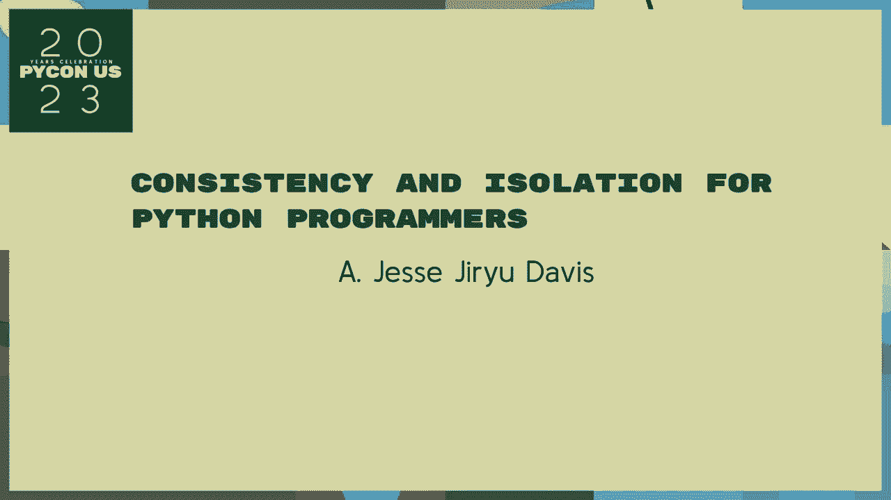

 I will also discuss the question I simply will talk about consistency in isolation for identity damage。

 Let us all welcome， just to do this。
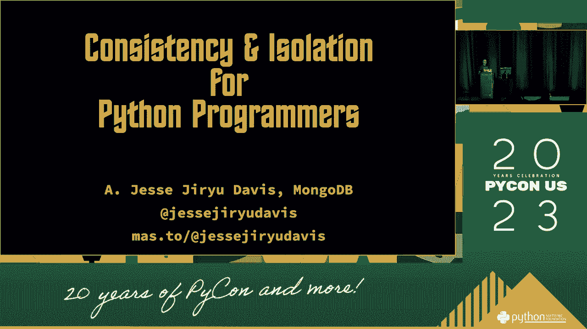

 Will do it if you need to kill them。 They need to kill the other side。 They better kill them。 Well。 instead of losing their own vision， we have to get involved with that。 So they can use the community to put them on their own。 And then we do it on our own。 I'm confused。 Because if this is before， the pathway can exist in order。 So any ones about。

 well that doesn't contain。 And then that is where this place can be。 And then we can't get it off。 And then we can't get it off。 And then we can't get it off。
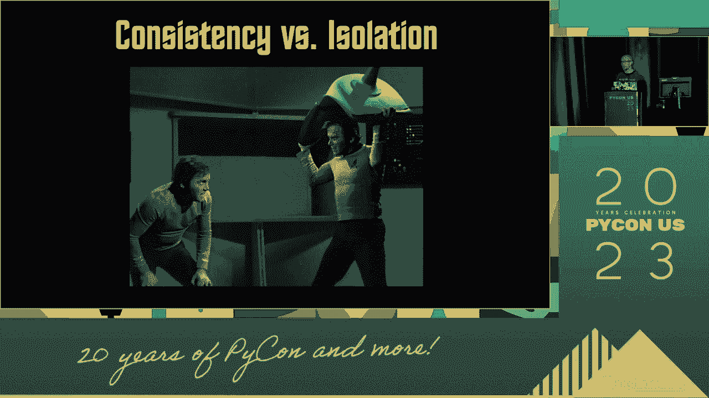

 And then all of them can do something to support them。 So it's one of the most difficult things to do。 But it's important for us because it's because。 we have to follow the way to the other side。 I mean more， I mean more。 I think it's all important for us。 When you start buying a bunch of stuff， it's the best part。

 I think it's a lot of people。 So what's the problem？ I just start off with a bunch of people。 And then all of them are。 And then there are two different options。 One machine， one person。 one machine。 And we are one of them。 And then of course。 we're still going to see if the number of people， is not on the floor or if it's just a different experience。

 And they're almost locked in。 And they're real right in that。 And they're not on the floor。 And they need to be locked in the main way。 They need to be different。 And they need to be locked in the main way。 They need to be locked in the main way。 They need to be locked in the main way。 And then all of them are on the floor。

 And then all of them are on the floor。 And then all of them are on the floor。 And then they need to be locked in the main way。 And then they need to be locked in the main way。 And then they need to be locked in the main way。 And then they need to be locked in the main way。 And then they need to be locked in the main way。 And then they need to be locked in the main way。

 And then they need to be locked in the main way。 And then they need to be locked in the main way。 And then they need to be locked in the main way。 And then they need to be locked in the main way。 And then they need to be locked in the main way。 And then they need to be locked in the main way。 And then they need to be locked in the main way。 And then they need to be locked in the main way。

 And then they need to be locked in the main way。 And then they need to be locked in the main way。 And then they need to be locked in the main way。 And then they need to be locked in the main way。 And then they need to be locked in the main way。 And then they need to be locked in the main way。 And then they need to be locked in the main way。 And then they need to be locked in the main way。

 And then they need to be locked in the main way。 And then they need to be locked in the main way。 And then they need to be locked in the main way。 And then they need to be locked in the main way。 And then they need to be locked in the main way。 And then they need to be locked in the main way。 And then they need to be locked in the main way。 And then they need to be locked in the main way。

 And then they need to be locked in the main way。 And then they need to be locked in the main way。 And then they need to be locked in the main way。 And then they need to be locked in the main way。 And then they need to be locked in the main way。 And then they need to be locked in the main way。 And then they need to be locked in the main way。 And then they need to be locked in the main way。

 And then they need to be locked in the main way。 And then they need to be locked in the main way。 And then they need to be locked in the main way。 And then they need to be locked in the main way。 And then they need to be locked in the main way。 And then they need to be locked in the main way。 And then they need to be locked in the main way。 And then they need to be locked in the main way。

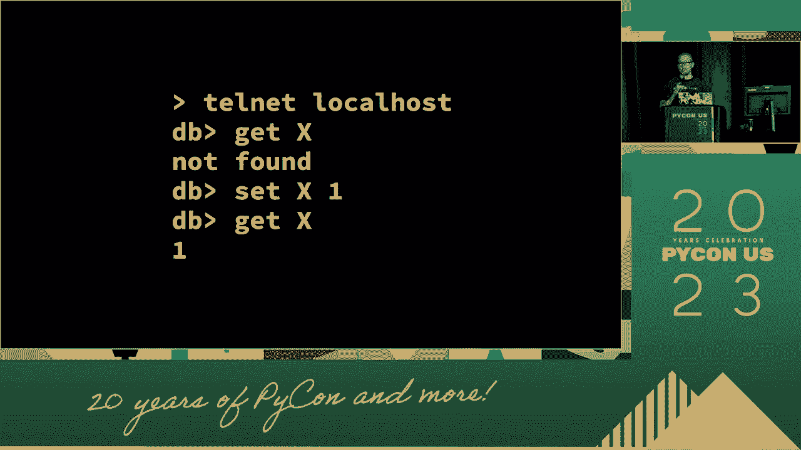

 And then they need to be locked in the main way。 And then they need to be locked in the main way。
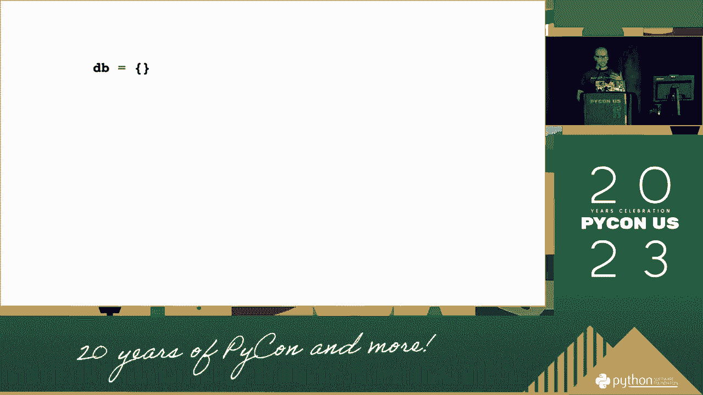

 And then they need to be locked in the main way。 And then they need to be locked in the main way。 And then they need to be locked in the main way。 And then they need to be locked in the main way。 And then they need to be locked in the main way。 And then they need to be locked in the main way。 And then they need to be locked in the main way。 And then they need to be locked in the main way。

 And then they need to be locked in the main way。 And then they need to be locked in the main way。 And then they need to be locked in the main way。 And then they need to be locked in the main way。 And then they need to be locked in the main way。 And then they need to be locked in the main way。 And then they need to be locked in the main way。 And then they need to be locked in the main way。

 And then they need to be locked in the main way。 And then they need to be locked in the main way。 And then they need to be locked in the main way。 And then they need to be locked in the main way。 And then they need to be locked in the main way。 And then they need to be locked in the main way。 And then they need to be locked in the main way。 And then they need to be locked in the main way。

 And then they need to be locked in the main way。 And then they need to be locked in the main way。 And then they need to be locked in the main way。 And then they need to be locked in the main way。 And then they need to be locked in the main way。
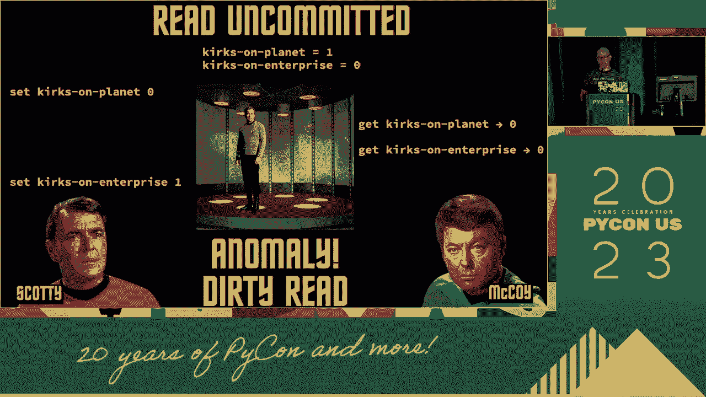

 And then they need to be locked in the main way。 And then they need to be locked in the main way。
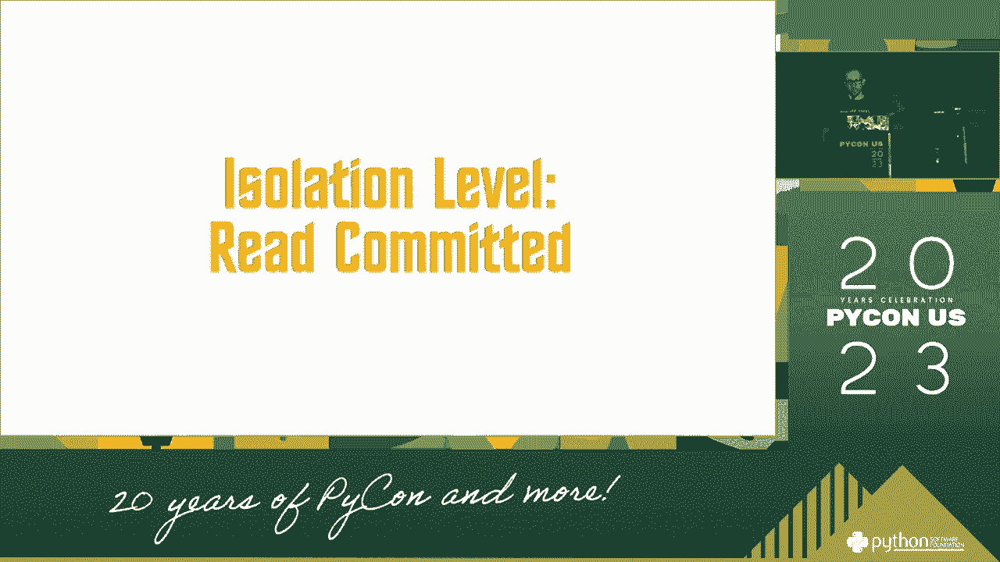

 And then they need to be locked in the main way。 And then they need to be locked in the main way。 And then they need to be locked in the main way。 And then they need to be locked in the main way。 And then they need to be locked in the main way。 And then they need to be locked in the main way。 And then they need to be locked in the main way。 And then they need to be locked in the main way。

 And then they need to be locked in the main way。 And then they need to be locked in the main way。 And then they need to be locked in the main way。 And then they need to be locked in the main way。 So let's run this story again with me。 It's about this phase。 It's about the action。 The employee gets closer to the point of the main way。 Because the client is still in the wrong way。

 And then they need to be locked in the main way。 And the client is locked。 And then the client is locked in the main way。 And then they need to be locked in the main way。 And then they need to be locked in the main way。 And then they need to be locked in the main way。 And then they need to be locked in the main way。 And then they need to be locked in the main way。

 And then they need to be locked in the main way。 And then they need to be locked in the main way。 And then they need to be locked in the main way。 And then they need to be locked in the main way。
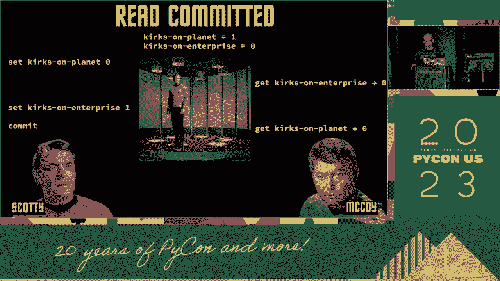

 And once again it's in the normal place。 The client is still in the usual way。 And then before you get locked in the main way。 And then you need to be locked in the main way。 So let's get into it。 And then the stronger it is， the more it's going to be。 And so it's going to be。 And then the more it's going to be。 And then the stronger it is。

 the more it's going to be。 And then the stronger it is， the more it's going to be。 And then the stronger it is， the more it's going to be。 And then the stronger it is， the more it is。 And then the stronger it is， the more it's going to be。 And then the stronger it is。 the more it's going to be。 And then the stronger it is， the more it's going to be。

 And then the stronger it is， the more it's going to be。 And then the stronger it is。 the more it's going to be。 And then the stronger it is， the more it's going to be。 And then the stronger it is， the more it's going to be。 And then the stronger it is。 the more it's going to be。 And then the more it's going to be。 And then the stronger it is。

 the more it's going to be。 And then we expect the stronger it is， the more it's going to be。
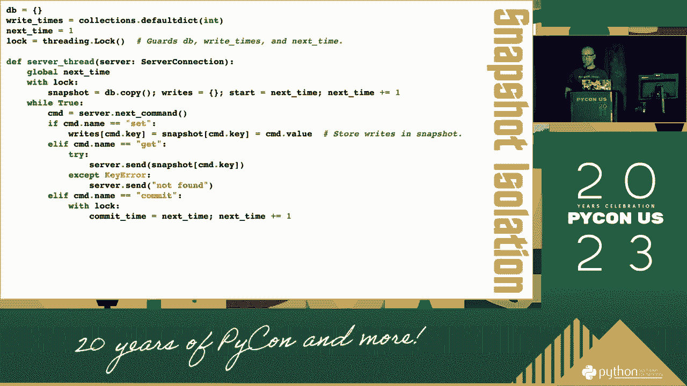

 And then we expect the stronger it is， the more it's going to be。 And now this is the stronger it is， the stronger it is， the more it's going to be。 And then the stronger it is， the more it's going to be。 And then the stronger it is。 the more it's going to be。 And then the stronger it is， the more it's going to be。

 And then the stronger it is， the more it's going to be。 And then the stronger it is。 the more it's going to be。 And then the stronger it is， the more it's going to be。 And then the more it's going to be， the more it's going to be。 And then the stronger it is。 the more it's going to be。 And then we don't need to worry about it。 We're here for a second。

 We're going to talk about it for a second。 And then we'll talk about it for a second。 And then we'll talk about it for a second。 And then we'll talk about it for a second。 And then we'll talk about it for a second。 And then we'll talk about it for a second。 And then we'll talk about it for a second。 And then we'll talk about it for a second。

 And then we'll talk about it for a second。 And then we'll talk about it for a second。 And then we'll talk about it for a second。 And then we'll talk about it for a second。 And then we'll talk about it for a second。 And then we'll talk about it for a second。 And then we'll talk about it for a second。 And then we'll talk about it for a second。

 And then we'll talk about it for a second。 And then we'll talk about it for a second。 And then we'll talk about it for a second。 And then we'll talk about it for a second。 And then we'll talk about it for a second。 And then we'll talk about it for a second。 And then we'll talk about it for a second。 And then we'll talk about it for a second。

 And then we'll talk about it for a second。 And then we'll talk about it for a second。 And then we'll talk about it for a second。 And then we'll talk about it for a second。
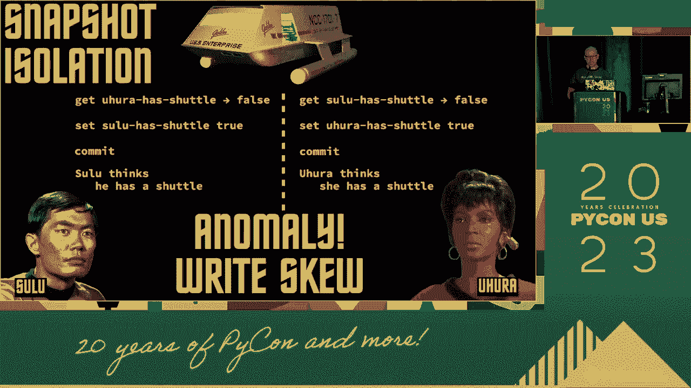

 And then we'll talk about it for a second。 And then we'll talk about it for a second。 And then we'll talk about it for a second。 And then we'll talk about it for a second。 And then we'll talk about it for a second。 And then we'll talk about it for a second。 And then we'll talk about it for a second。 And then we'll talk about it for a second。

 And then we'll talk about it for a second。 And then we'll talk about it for a second。 And then we'll talk about it for a second。 And then we'll talk about it for a second。 And then we'll talk about it for a second。 And then we'll talk about it for a second。 And then we'll talk about it for a second。 And then we'll talk about it for a second。

 And then we'll talk about it for a second。 And then we'll talk about it for a second。 And then we'll talk about it for a second。 And then we'll talk about it for a second。 And then we'll talk about it for a second。 And then we'll talk about it for a second。 And then we'll talk about it for a second。 And then we'll talk about it for a second。

 And then we'll talk about it for a second。 And then we'll talk about it for a second。

 And then we'll talk about it for a second。 And then we'll talk about it for a second。 And then we'll talk about it for a second。 And then we'll talk about it for a second。 And then we'll talk about it for a second。 And then we'll talk about it for a second。 And then we'll talk about it for a second。 And then we'll talk about it for a second。

 And then we'll talk about it for a second。 And then we'll talk about it for a second。 And then we'll talk about it for a second。 And then we'll talk about it for a second。 And then we'll talk about it for a second。 And then we'll talk about it for a second。 And then we'll talk about it for a second。 And then we'll talk about it for a second。

 And then we'll talk about it for a second。 And then we'll talk about it for a second。 And then we'll talk about it for a second。 And then we'll talk about it for a second。 And then we'll talk about it for a second。 And then we'll talk about it for a second。 And then we'll talk about it for a second。 And then we'll talk about it for a second。

 And then we'll talk about it for a second。 And then we'll talk about it for a second。 And then we'll talk about it for a second。 And then we'll talk about it for a second。 And then we'll talk about it for a second。 And then we'll talk about it for a second。 And then we'll talk about it for a second。 And then we'll talk about it for a second。

 And then we'll talk about it for a second。 Despite the data of the situation。 you see what I said before。 And then we'll talk about it for a second。 And then we'll talk about it for a second。 And then we'll talk about it for a second。 And then we'll talk about it for a second。 And then we'll talk about it for a second。

 And then we'll talk about it for a second。 And then we'll talk about it for a second。 And then we'll talk about it for a second。 And then we'll talk about it for a second。 And then we'll talk about it for a second。 And then we'll talk about it for a second。 And then we'll talk about it for a second。 And then we'll talk about it for a second。

 And then we'll talk about it for a second。 And then we'll talk about it for a second。 And then we'll talk about it for a second。 And then we'll talk about it for a second。 And then we'll talk about it for a second。 And then we'll talk about it for a second。 And then we'll talk about it for a second。 And then we'll talk about it for a second。

 And then we'll talk about it for a second。 And then we'll talk about it for a second。 And then we'll talk about it for a second。 And then we'll talk about it for a second。 And then we'll talk about it for a second。 And then we'll talk about it for a second。 And then we'll talk about it for a second。 And then we'll talk about it for a second。

 And then we'll talk about it for a second。 And then we'll talk about it for a second。 And then we'll talk about it for a second。 And then we'll talk about it for a second。 And then we'll talk about it for a second。 And then we'll talk about it for a second。 And then we'll talk about it for a second。 And then we'll talk about it for a second。

 And then we'll talk about it for a second。 And then we'll talk about it for a second。 And then we'll talk about it for a second。 And then we'll talk about it for a second。 And then we'll talk about it for a second。 And then we'll talk about it for a second。 And then we'll talk about it for a second。 And then we'll talk about it for a second。

 And then we'll talk about it for a second。 And then we'll talk about it for a second。 And then we'll talk about it for a second。 And then we'll talk about it for a second。 And then we'll talk about it for a second。 And then we'll talk about it for a second。 And then we'll talk about it for a second。 And then we'll talk about it for a second。

 And then we'll talk about it for a second。 And then we'll talk about it for a second。 And then we'll talk about it for a second。 And then we'll talk about it for a second。 And then we'll talk about it for a second。 And then we'll talk about it for a second。 And then we'll talk about it for a second。 And then we'll talk about it for a second。

 And then we'll talk about it for a second。 And then we'll talk about it for a second。 And then we'll talk about it for a second。 And then we'll talk about it for a second。 And then we'll talk about it for a second。 And then we'll talk about it for a second。 And then we'll talk about it for a second。 And then we'll talk about it for a second。

 And then we'll talk about it for a second。 And then we'll talk about it for a second。 And then we'll talk about it for a second。 And then we'll talk about it for a second。 And then we'll talk about it for a second。 And then we'll talk about it for a second。 And then we'll talk about it for a second。 And then we'll talk about it for a second。

 And then we'll talk about it for a second。 And then we'll talk about it for a second。 And then we'll talk about it for a second。 And then we'll talk about it for a second。 And then we'll talk about it for a second。 And then we'll talk about it for a second。 And then we'll talk about it for a second。 And then we'll talk about it for a second。

 And then we'll talk about it for a second。 And then we'll talk about it for a second。 And then we'll talk about it for a second。 And then we'll talk about it for a second。
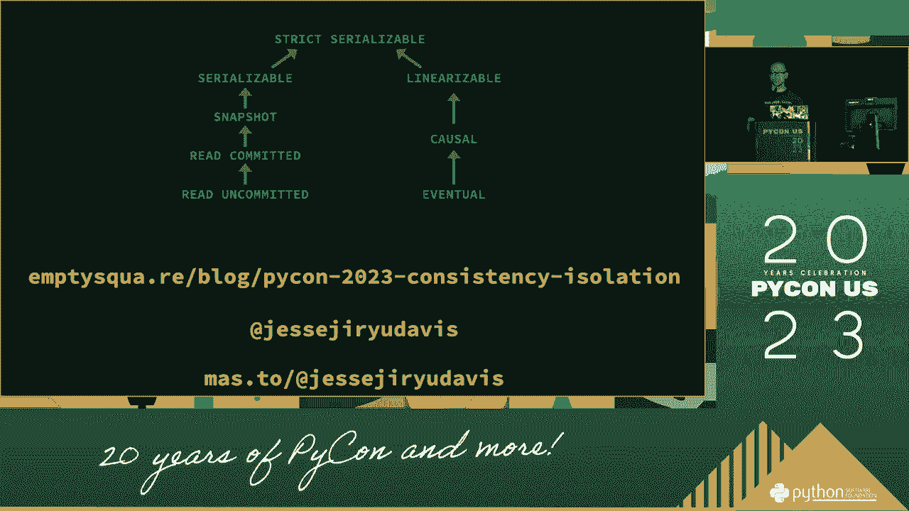

