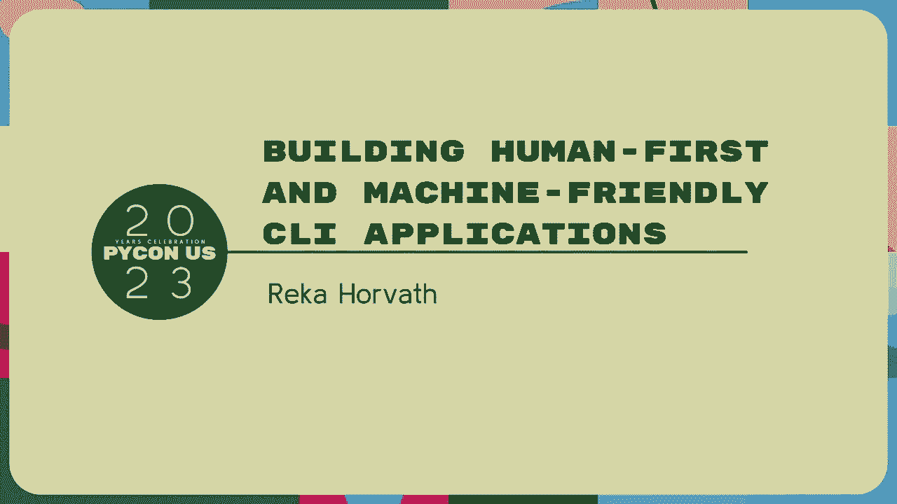
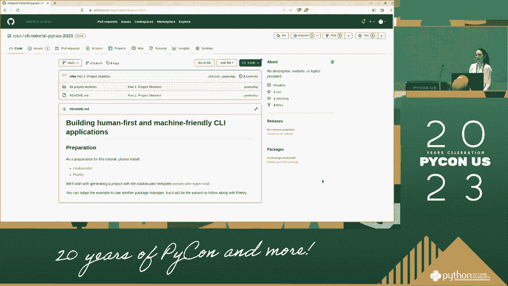
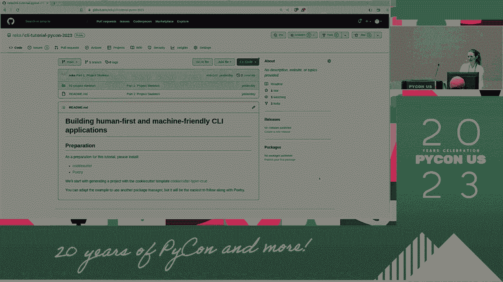
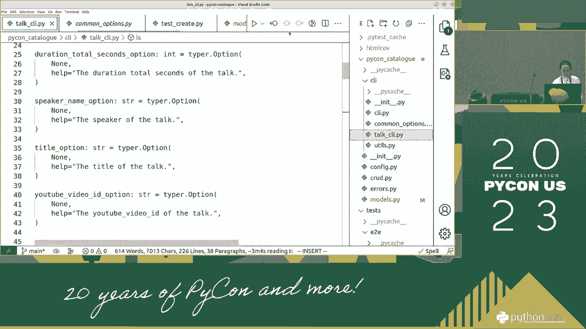

# P82：Tutorials - Reka Horvath_ Building human-first and machine-friendly CLI applicat - VikingDen7 - BV1114y1o7c5

所以早上好，我希望你们都喝过咖啡了，所以欢迎来到教程。

构建以人为本和机器友好的CLI应用程序，所以我叫雷亚，我为巫术工作，关于各种代码质量和重构工具，也在ID中，也在命令行中，我已经使用命令行应用程序很长时间了，当我第一次开始从侧面开发它们时。在之前的Fintech工作中，我们创建了各种内部工具，这也是我了解命令行界面指南的地方，这将是今天讨论的要点之一，我想请你首先安装两个工具，我们将在今天的例子中使用，一个是饼干切割器，其次是诗歌。所以那将是如此，所以这些是必要的，然后我想提到的第一件事是，作为人类第一的头衔，这也意味着任何时候任何评论。

建议的想法很受欢迎。

因为这应该是我们讨论的事情，什么进入它的事件，但是呃，嗯，所以第一步，如果你问了第一个问题，我想问的是谁熟悉饼干切割器，然后让我们从一个快速介绍饼干切割器本身开始。所以cookie cutter基本上是创建项目模板的工具，这正是我们在我们的第一步要做的，在准备的第一步，所以网址，你在这里看到的，这个饼干切割器，这只是一个GitHub存储库，这里。它包含的是一个饼干切割器JSON文件，它定义了各种项目属性，然后它的另一个主要部分是这个名为目录的饼干切割器项目，这是生姜语法，当我们运行这个饼干切割器时，然后它将为我们生成一个遵循该模板的项目。第一个，从省略这个开始，用于重播的此参数，重播文件，看看如果我只是运行会发生什么，所以所以饼干切割器，然后是包含饼干切割器的存储库的URL，所以这可以是一个URL，也可以是本地目录，然后发生了什么。

它开始要求我，属性，例如，那是我项目的名字，如果我把它设置成Python目录，然后对于下一个属性，它已经只是一个基于此的名字，我们可以交互式地填充各种字段，所以如果你看到JSON文件，有十个不同的领域。我们可以填满它们，创建一个项目，所以这是基本用法，你大部分时间是如何使用饼干切割器的，我想请你做的是，相反，现在是运行这个命令，就在这里，在这里，我们将这个重播文件选项传递给cookie cutter。我应该听从我自己的建议，看看这个饼干切割器托尔森，所以这是这是在这里，在项目骨架骨架目录中，所以请传递，所以这是这个项目框架目录中的一个文件，所以如果你在其他地方运行，然后请把它的部分调整一下。那么现在发生了什么，请告诉我这对你是否也有效，现在我们只是在此基础上生成一个项目，基于该模板，现在，如果我们导航到这个Python目录，这里的目录，我们已经可以看到我们现在有一条蟒蛇。

所以我们在这里生成了一个诗歌命令行项目，所以作为第一步，你明白了吗？第一个问题，所以这是一个很好的观点，所以命令在这里，我想，所以我想建议首先克隆这个存储库，这个图标二十三，因为这是最简单的方法。所以存储库是GitHub dot com rea cli教程，派翁二十三，在这里，重要的是你有这个千篇一律的谈话JSON文件，这是，这是我们应该运行的命令，不要犯我在跑步时犯的同样的错误。所以调整这个谈话的路径JSON，求求你了，图标目录看起来有点不同，它看起来像后，我运行切割器可以找到诗歌，它找不到诗，是呀，“那么你有诗歌装置吗？”，好啦，这是个好问题，为什么。如果您像这样导航到目录会发生什么，你能在这里运行诗歌外壳吗，公司的笔记本电脑设置得有点奇怪，我不能在全球范围内运行它，有没有办法，我可以手动运行它来做同样的事情，是呀，所以剧本没有做太多。

所以所有的诗人都是这样吗，它只是做了一个诗歌安装，所以说，这实际上也是一个很好的观点，哪个，我们刚刚听说，我的错，所以在这种情况下，在这种情况下，这意味着您已经生成了项目，但它不跑。是但是但是但是它有它不能运行，对吗？所以如果你有蟒蛇三九，然后我想请你去生成项目中的这个射弹，所以在，在11号线，我们正在设置Python的最小版本，而这正是应该改变的，求求你了，如果不是很抱歉。那是我的错，这三次可能有点太高了，不能设定这个，所以不管是哪种Python版本，哦好吧，设置的其他问题是什么，超越习俗，对不起，你什么意思，我不得不承认，我也不知道，好的，好的。我的建议是继续做一些演示，然后在第一次休息时，我们也许可以解决一些安装问题，对不起，如果事情比我想象的要复杂，我想展示的是这个，我们刚刚在这个应用程序中生成的，所以这里我们有，CLI类型，所以我会激活。

诗歌应该首先这样做，如果您已经设法设置了，请跟随，然后我们可以看到的第一件事是这条蟒蛇，有这个蟒蛇目录，我们已经做到了，在帮助下，我们可以看到什么样的子评论，既然我们在这里，我们有一个子命令，这是一个。我们可以安装，然后看看这里，在生成的项目中，所以说，所以在片场，在，在这个脚本的集合中，这是第一个重要的设置，或者在这里我们定义这个Python目录，这应该运行，在CLI应用程序模块中定义的此应用程序。代码可以在这里找到，我只需要，是个翻译，在这里我们可以看到各种各样的，呃，但是，所以这里我们只能看到这个版本注释我们看到的，然后应用程序的真正大部分可以在这里找到，在Talk CLI模块中，首先。在这里，我们将有各种命令来创建，更新，删除会谈，然后呢，接下来我想展示的是这个命令行界面指南，这是一个叫做ci g f的网站，我真的很推荐，我真的推荐它阅读，但这是一个相当，我想说，很多，有很多材料。

首先，我想问问你对，你做什么，你觉得怎么样，能有什么，关于这些哲学和原则，上面提到，所以说，以人为本的设计，对于命令行应用程序来说，这意味着什么，它必须是直观的，是呀，对不起，有据可查，是呀，是呀。那是一个，这是一个很好的观点，一致性是什么，那么一致性从何而来，做事的一种方式，是呀，那很有趣，好吧，一致性确实是他们使用哪个维度的要点之一，有什么用法，通常是命令行应用程序的，那么在哪些设置中。好吧这是用过的吗，熟悉计算机的人，是呀，这实际上是一个非常有趣的观点，因为我想，有一点可以证明，这些应用程序中的许多都是超级直观的，如果你已经熟悉这个，在我们的马马虎虎中，对于一个大的来说。就不那么平易近人了，是呀，那正是，其中一点，我想跳到这个，所以整个指南的结构是这样的，让我们说，他们说的四件事应该永远遵循，然后还有其他额外的，他们说好吧，跟着那些真好。

但这些都是我们应该永远保持的基础，这里使用命令行参数解析库，您可以在其中，这正是我们在示例中所做的，所以如果，所以我们在这里使用的是在我们的项目中的打字机，这就是我很抱歉的一个原因。所以CG建议我们使用Typer这样的工具的主要原因，或者任何图书馆，所有的时间都是因为这样很多其他的建议，他们所拥有的将自动出现在那里，实际上，这也是我建议不要只使用点击和键入的原因。我真的都是很好的工具，但也要用饼干切割器，因为通过这种方式，很多这些东西已经在某种程度上预先生成了，对我们来说很实用，我们不需要，所以我们不，我们不需要为许多人添加相同的元素，很多。我在您使用命令行解析库之后看到了这一点，那是我真正喜欢的东西，即使是最小最小的项目，我也非常推荐，所以现在我想再次回到我们的，这里简要探索，所以我们看了帮助，然后我们还可以看看talk命令的帮助。

有一件事我想指出，我们这里的代码实际上并不包含任何用于所有这些的基础结构，所以所有的帮助文本，例如，您可以看到的是来自这些文档字符串，也就是说，这一切都是由打字者创建的，所以这就是为什么，我说。我认为用这样一个，这样的图书馆，因为这些东西都不需要任何额外的设置或其他什么，然后我只想进一步探索，那个，例如，我们也可以看看这个命令的帮助，我们可以看到，好啦，您可以创建许多，您可以创建一个新的谈话。这些是它得到的参数，如果V，再看一遍，如果你看看，编辑编辑，它也有非常相似的参数，我们就在那里，可能这个一致性点进入了，出现在画面中，这些东西看起来应该很相似，我说作为下一个点，A我想请你。我得把你们交给所有已经设法安排好这件事的人，尝试为此工具安装shell补全，我们已经有了，所以说，假设我们有，我们有三分钟时间，因此，如果您已经设置并安装了这个，请尝试找出如何为此安装shell补全。

你可以随意讨论，对不起，我怎么去那里，我用饼干切割器生成了这个项目，文件夹，或者它的主要A，它是从哪里来的？这是个好问题，所以如果一切都按计划进行，那这个应该是饼干切割器，所以，在这个下一代测试版中。重新创建Git存储库，如果出了什么问题，也许是诗歌部分运行正确，所以给你的诗歌装置，对不起，我是这么想的你也是这么想的，好啦，因此，如果您在Python目录目录中，因此，如果您在Python目录目录中。你能看到所有的帮助和这些东西吗，好啦，我只是出于好奇，它是一个GitHub存储库吗，你也知道吗，如果运行，为了这次完成，好啦，问得好，所以在其中一个帮助中，所以理论上，但是根命令的帮助。由KON目录本身，是呀，好啦，所以我认为，是时候讨论这个了，所以如果我们看Python目录，破折号破折号帮助，除了我们看到的代码版本之外，这里和这个版本，这是一个，这是我们代码中定义的选项。

但这里还有另外两个选择，安装完成并显示完成，如果一切按计划进行，那么这个安装完成，这个，这应该安装shell补全，当你跟着做一些，做一些围绕这个玩，你会得到所有的完成，这正是来自Typer的。所以这就是为什么我们甚至没有呼吁它，只是为了，好问题，精彩之处在于，这是警告，此安装完成在大多数情况下都能正常工作，比如我用这个外壳，在那里，它并没有真正，所以说，这不是开箱即用的，但我能做的是。还有演出完成，如果我，把它加到我的我说的H C上，那么它实际上对，这就是为什么它对我有效，所以有这些是所以少校，安装shell完成的默认方式是使用破折号安装完成，如果这不起作用。您知道您使用的是自定义shell，那么这是第二种方法如何尝试这个节目完成，然后通过将其追加到，它成功了吗，好啦，酷，然后我想更多地探索这个项目，我想再次展示这个帮助文本，我们已经看过了，创建集线器。

有一个编辑选项卡，我不知道你是否注意到，但我在那里犯了错误，这里有这么多不同的文本，这个容器下划线可能不太好，所以我想请你，所以下一个练习是，请在代码中找到配置此功能的位置，并适应服务台。所有这些不同选项的帮助文本，所以五分钟，这么说吧，我只想登顶，我你是，是呀，听起来是个不错的候选人，所以在此期间，如果你对设置有任何问题或任何静止的事情，那就拜托你了，请让我知道我们可以看看它。使用逗号，我在安装完成时一直收到这个，哦，男人不适合，嗯，我想我正试图在线排除故障，但你以前见过吗，知道它和，我不知道，但相反，如果您知道您的配置文件类似于ZH LC，我曾经拥有过。我不知道在正常情况下你是否有这样的东西，因为相反，这是一个完成，试着，呃呃，在显示完成时调用它，我不太确定该怎么做，对不起，我不太确定你在这里做什么，但你在结尾处说的，取而代之的是，你说。

讨厌的表演完成，哦好吧，嗯是的，同样的我试过同样的，呃，哎呦，好啦，如果你在目录上运行其他东西会有所帮助，会发生什么，呃，那很好，好啦，对不起，我不太熟悉，但如果不是那么重要，如果你不需要，这很方便。你设法更新了这些吗，这些名字，有什么想法吗，去哪里找，以及如何调整这些，呃，是呀，的哈布文本，在二十行，我们定义了这个短名称选项，如果我用一个，这里，很好，这里，也许这样更好，即使那样。所以如果我现在再运行一次，那当然是调整过了，所以谢谢你，那正是正确的答案，在这里我想指出一件事，所以我展示这个练习的主要原因是，如果我们看看谈话中的这句话，我们没有真正编辑命令。所以我们没有对add或edit命令做任何操作，取而代之的是，我们在这里使用的技巧是，我们定义了一个选项，在这个演讲I模块的空间里，然后我们可以看到这个短名称选项实际上是我们引用的，在创建和编辑命令中。

当我展示这个的时候，C I G和询问询问嘿，什么，应用程序的A有哪些好的属性，有人提到了一个很好的观点一致性，我很想指出，我会从这个功能，打字员的这种可能性，超选项是否在圆周率下。它们是Python对象，你可以定义它们，重用它们，然后说好吧，我必须编辑和创建，他们的关系非常密切，所以他们可能应该使用相同的选项，关于这一点的一个很好的观点是，它是，当然更少的代码重复。但这也使应用程序立即更加一致，任何想法，这是最大的优势，这么大，所以除了有很好的一致的帮助短信，什么是什么是另一个，所以，但我，我很抱歉，也许这个问题的措辞不对，但是我们刚刚看到的是。因为我们分享了这个选择，所以我们在这里定义了短名称选项，然后创建，它只是引用它，这帮助了我们的帮助文本，它是好的和一致的，而且只需要编辑一次，我的观点是，HAB文本是较小的好处，还有一个更大的，对不起。

再大声一点，一个地方做一个，非常感谢你说得很好，所以是的，正好有一个中心位置进行编辑，而不需要更新多个东西，非常容易，很容易监督他们，不幸的是，我想指出的是，这是真的，不仅是为了我们刚刚编辑的帮助文本。但选项名称本身也是如此，所以如果我只是定义，定义选项，在命令本身中，然后它随时可能发生，一旦在一个地方，我说，让我们说简短的名字，在另一个我把它写成一个词，然后下一个就叫名字什么的，所以它可以。即使它可以，如果我们把它们分开定义，这很容易发生，即使是选项名也不一致，在一个地方定义它们，这就是这就是，所以这是一个很好的制作它们的技术，我的下一个问题是还有其他一些，所以在文件的开头。我只定义了短名称和短名称持续时间，所以这些属性与不同的领域有关，我想，但是如果我们看看帮助，还有一些其他的选择，所以我们要玩的这架飞机和JSON，然后在下一次会议上，这些是从哪里来的？

那么create命令从哪里获得最后三个选项呢，对于此应用程序，这是一个小小的矫枉过正，因为我们的大部分逻辑都在这个谈话中，但总的来说，我认为这是一个，这是一个很好的模式说，好啦，在我们有共同的共同选择。其中包含了，实际上是这些选项，您可以在任何类型的命令行应用程序中，它没有，它不是针对任何东西的，然后在谈话CLI中，我们定义了真正特定于谈话的选项，比如演讲的持续时间和YouTube，视频。身份证之类的东西，所以说，现在，实际上这也是我开始使用Icatur的原因之一，一件事是，我真的推荐这个，所以这个，如果这可能是，这应该是这次研讨会的主要教训之一，这种一致性是一个非常可变的。一个很好的工具来实现，它是用像饼干切割器一样的模板，第二件事是我们可以很好地观察到，我想如果我们使用这样的模板，我们这里的很多东西实际上是非常非常常见的，并可用于许多不同的领域，然后是会谈的具体内容。

这个应用程序这样我们就可以更多地关注它们，如果我们用一个像饼干切割器这样的模板，所以说，所以是的，这就是所有选择的来源，所以其中一些在公共选项中定义，一些和谈话细节，在谈话中，在休息之前。我想建议一件事，在我们开始向这个应用程序添加数据之前，我们现在所做的，因此，应用程序将使用SQLite数据库作为存储，和，我们应该建立我们的开发环境或单独的开发数据库，所以再一次，这是一个练习。所以请在接下来的两个，两个，三分钟在那个项目中环顾四周，试图找出如何建立，如何为该练习配置开发数据库，不是一般的，是啊，是啊，所以这应该在，在项目的内部文件中，应该是一个考验，一位观众提到的直觉部分。多少钱，它在多大程度上满足了这一要求，是呀，所以配置PI是，所以有一个很好的评论，配置PI确实与此非常相关，所以有一个问题，为开发数据库定义第二个数据库是否是一个好方法，这有一些缺点。

因为我们想用这个通行证和数据库，在开发和生产环境中也是如此，但它需要与另一个数据库对话，这就是我们想要实现的目标，然后还有第三种环境，我们也许应该记住，这是测试，以及我推荐的方法。在自述文件中描述的这里，如果我们查看这个配置，它被Dantic使用，所以说，它使用pedantic中的settings类定义，定义此数据库的路径，而且已经，此设置可以引用具有m可选参数的环境变量。所以我是建立，发展数据库，我推荐，我建议改变这个环境变量的值，Python目录，分贝通行证，这也是在这个生成的自述文件中描述的，在我们，在我们添加和操作任何数据之前，像这样的车间，做这件事并不那么重要。因为否则我们会写入这个默认数据库，好啦，没有，不是什么大问题，这一步是，我认为很重要，如果您正在开发供自己使用的命令行应用程序，就像，假设你也有类似的事情，但不是为了蟒蛇说话，但是为了你的书。

在第一个版本中，也许你开发了一些东西，并有一种工作版本，你开始每天使用，然后你开始添加新的功能，实验，然后很容易把它混在一起，那没关系，在这一点上，区分发展和，所以说生产环境。所以这就是为什么我推荐这个，我想是的作为下一步的额外工作，然后如果考虑有第一个，还有第三个，非常重要的环境，这是测试环境，当然，当我在这里运行这20个测试时，我不想。我不想让他们把任何数据输入我的真实数据库，为此，我们可以使用按文本固定，谁熟悉文字夹具，好啦，所以我不打算长篇大论地讨论这个问题，但对于这种Qalyte存储，这可能是最简单的，拥有固定装置的最简单方法。我们不知道，我们不知道如何使用，然后我们设置了测试环境，现在我们有了一个，我们在应用程序中看到了一些，属性提交更改，然后我会，我建议在我们添加一些数据和玩这个之前，让我们休息十五分钟。

如果你有任何关于设置或其他问题，那就拜托你了，请在休息时间来找我，我们会试着弄清楚的，你已经经历了这么多，我认为到目前为止，我们主要只是环顾四周，所以如果你想赶上重要的，如果你被困在某个地方。重要的一步是生成项目，第二件事，我建议是，我将上传，存储库，就像现在在我的环境中一样，然后如果你在饼干切割器或其他设置上有困难，您可以直接克隆存储库，然后使用它而不是试图生成它，我能让它运转起来。但我必须，好吧，这些变化是什么，给大家看一下，是啊，是啊，是啊，是啊，好啦，就像这个，好啦，所以我们休息一下，我们十点继续，求求你了，就像一对夫妇，所以我们应该继续，所以非常感谢你在休息时提出的好问题。所以在这里您可以找到这个包含当前代码的存储库，我这边，如果你是，如果代码生成速度更快，不管是什么原因都不能正常工作，那么这是一种方法，这是一种调用此存储库的可能性，并继续使用该版本。

然后还有一个关于这些的很好的问题，我们在这里讨论过的资源，CLI G方面我也添加了一个链接，但我想我们接下来要做的是，稍微探索一下这个create命令，我们有，我想，所以第一个练习是添加一些，见。所以发现，添加这个的各种可能性是什么，所以就像，这么说吧，花三分钟，尝试使用create命令，添加一些对话和，好问题一个不是这样的问题是它是否应该是Python目录创建好，我建议对每一个创建是，我只是。所以让我们看看这里，如果我们看到这一点，所以希望，会发现，然后呢，问题，加井的各种加法有哪些，但是我们能用这个命令做什么呢，完全正确，这是一个伟大的，这是一个很好的总结方式，你可以在旗子里通过，例如。让我们只是这样，如果我什么都不做，让我们从那个开始用那个方法，如果我什么都不做，我只是按原样调用命令，然后它会问我一些输入，我想指出的是，我们甚至可以跳过一些像视频ID这样的东西，我会从。

从时间表时间表，我看到的都是短名字，假设它是python语法，扬声器名称为，标题是，我们不知道要花多长时间，因为这个谈话只有在星期六，啊，然后呢，这就是它所做的，我们创造了，我们现在创造了。以及如何以及到底如何，啊，谢谢你，你指出来的，另一种创建对话的方法是，而不是交互式地传递，我们可以把选项传递进来，然后说，例如，星期六还有一个香椿，在国际上被称为Python，一条巨蟒，如果我放弃了。通过这个，它还为我们创造了一个创造了一个谈话，为什么它，为什么说得通，那么是什么原因呢？为什么我们，为什么我们要为这两种可能性选择这个设置，是呀，你可以自动化这是一个非常，非常重要的一点，这实际上是。所以说，如果我，如果我用更理论化的方式来组织这个研讨会，这可能是我指出的第一件事，这也在这本书的标题中，在本届会议上，人类友好和，和机器友好的应用，这种交互性是主要的模式之一。

我希望你能从中得到一个外卖，呃，从本届会议开始，而且它是一个，其实又是，我回到这个命令行界面指南，我想指出的是，这是一个所以这已经，这是一个开源指南，它是由一个社区写的，所以我一直在引用它。因为我觉得这很棒，但事实并非如此，它通常是一个很好的资源，而不是本研讨会的特定资源，在这里，谈话作为规范有各种各样的原则，例如，即使缺少一些必需的参数，提示一下是个好主意，假设使用它是人道的。还有这个互动点，这正是我们现在要在代码中发现的，我的问题是，在代码中可以找到这个相关部分的任何想法，所以如果我们看看这个谈话CLI，例如，两者都用于创建，为了，然后对于其他几个命令。我们还在这个交互式标志中定义了一个选项A，它也来自那些来自那些常见选项的，我们已经讨论过了，所以从这个，默认情况下是真的，这规定了这是否，此类提示是否显示为，例如，如果我现在回来，所以如果我说创造。

然后我会被提示各种，对于各种属性，取而代之的是，如果我说不创建输入，然后突然我得到一个错误，或者如果我说不创建交互式，所以在这里我们可以看到这些是如此，这也是一个很好的类型功能。我们可以为一个选项定义多个同义词，这有助于一致性，从某种意义上说，不幸的是，有几件事没有真正的标准术语，很多人可能会发现其他直觉，所以这是一个，这是提供多种选择和，这背后的重要想法是。我们可以有多种方式来调用这些脚本，所以一个非常明显的方法是让一些人坐在那里打字，然后还有一种可能性，我们想把它用在，在脚本字符串中，在这种情况下，当然我们不提供，我们不想提供提示，相反。我们希望依赖于传递的选项和所有自动工作，这是一个为那个，一个非常常见的用例，持续集成系统，例如，哪里嗯，在此之上，对不起，所以是的，是啊，是啊，所以这来自Python标准库，C标准输入是一个。

不管是终端，如果是，呃，如果不是，然后我们甚至不看互动标志，我们只是假设，好啦，我们不能指望人类提供投入，我想回到这个create命令的代码，一些进入标准输入的东西，那就是为了我们。所以如果你从脚本调用它，我建议加上，你不想得到提示，然后我添加无交互或无输入标志，如果我们现在看看代码，有一点，然后我们可以先看到，我们试图弄清楚一开始是否提供了任何字段，所以我们用这个，再一次。我想指出Typer的一个非常重要的特性，这就是这个上下文，呃所以，如果我们，回那边去，你可以看到第一个，此创建函数的参数是一种CIS类型，是一种语境，这包含了，除其他外，已经传递了所有的参数和选项。这就是我们在这个中使用的--得到字段值--金属，我们看着，所以我们从上下文中得到选项，这里有一个重要的区别，如果我们不处于互动模式，然后我们就带着一个错误退出，如果不是这样，如果我们在。

如果我们在互动模式下，然后呢，我们要求用户提供进一步的字段，为了做到这一点，我们使用这个提示来自this is from the library rich，然后呢。这为我们提供了一种方便的方法来存储所提供的所有各种字段名，然后呢，下一个问题是，我会在这里，这里我们得到了一些错误，区分错误与成功的重要方法是什么，那么我们如何才能看到一个命令是否成功，对不起。我没听说道具的颜色，是呀，这是一个很好的观点，出口代码，是呀，那也是，标准误差，是呀，完全正确，但这些正是我一直在寻找的答案，我想回到这些基本的，哪里，上次我们提到，我们已经遵循了第一个基本准则。使用Typer，然后这些是，另一个所谓的基础，我们真的应该跟进，即使在非常小的、不常用的命令行脚本中，就是这两件事，所以首先是归零，成功退出代码，故障不为零，第二个是区分不同类型的输出。

所以标准误差和标准误差，也许，也许最重要的故障模式的非零出口代码，是呀，那是个好主意，在我的记忆中，指南没有包含进一步的建议，我不得不承认在这方面，我们正在工作的这个饼干切割器也有点懒。因为任何时候有错误，或者我想它会返回一个，但我会说，所以再次它，这取决于用例，但是最基本的原则，我们可以说，对于任何类型的命令行应用程序，不管轴上的那个零，零成功，任何类型的故障都不为零。然后是什么样的，存在哪些类型的故障，以及如何将它们分组，对他们来说，什么是有意义的编码，给出一些一般性的建议是比较困难的，因为这在很大程度上取决于您的应用程序在做什么。我想在这里指出这是如何在代码中发生的，例如，如果我们没有收到任何输入，我们处于非交互模式，然后我们把这个出口叫做，这是带错误函数的出口吗，这里，这里，还有另外两点，感谢提到的另外两个人。

一个是我们写到标准误差，然后第二个是我们用这个红色，当然是可选的，但我认为这是一个很好的功能，从富人和通常我们，马马虎虎，但是我们用丰富的界面打印的东西，我们总是可以提供一些造型，我是。我通常对它很小心，但要注意的是，尤其是当应用程序面向许多用户时，他们可能使用许多不同的终端和不同的设置，但是这个有一些红色，例如错误，这是一个很好的标准，所以说，然后一个，我们还返回每个出口的类型。默认情况下，代码有一个重要的部分，德尔，所以值1而不是0，这是一回事，我不得不承认有一段时间，我很难记得，好啦，什么是成功，什么是公平，但什么是，但是为什么，排序如此如此像零，像什么都没有。对它来说意义重大，有一段时间对我来说有点不直观，然后是的，记住要成功只有一个办法，那正是，就在那时我想起了它，填充物，我们有，这是怎么发生的谈论成功和失败，接下来我要检查的是我们的测试，这里，例如。

对于离散命令，我们有，所以我们只提供简短的名称，然后我们检查两个重要的事情，以检查退出代码为零，我们只检查标准中有什么东西，是的，是呀，这是个好问题，我我不知道，现在我们已经尝试过了，我尝试了多个。所以说，有没有人看到什么奇怪的东西，而不是创建谈话后的表情符号，所以我的意思是这当然不是一个没有代表性的简单，我同意你的观点，这是一个，这在很大程度上取决于该工具的预期受众，是否要编辑。我觉得经常这样很好，通常这是解释某事的更简洁的方式，那只是个装饰，但是，例如，如果某件事成功了，然后有一个对勾，表情符号经常是，添加类似的内容或任何文本，所以你可以看得更清楚，但我绝对同意。并不总是一个好主意，我的下一个问题是，如果我们再看看Create的输出，我只是把这个向上滚动一点，以获得一个成功的创建，其实我们可以看到，所以现在我们可以看到有一个新的谈话创造了，然后一些其他的东西。

创建的这个新点在标准误差中，其他的都是标准的，我的问题是为什么，我只是回头看看，记录消息的确切措辞，错误，然后呃，这个呃，这些东西应该去标准误差，这些不应该被输入到下一个命令中，再一次。我想回到我们的两种不同类型的用户，人类和各种工具，某种输出，这有点像成功的信息，甚至放一条失败信息，这对一个坐在那里想看看会发生什么的人来说是非常有价值的，但我们当然不想把它交给指挥部。对于这种标准输入标准输出标准误差的区分是非常好的，很好的工具，我只想回到这个细节上，并表明在将标准误差设置为真的情况下，这就是我们如何创建标准错误控制台的方法，然后到了那里，有一件事让我很惊讶。我想展示它，因为这个原因，在测试中，我们使用这个CLI转轮，也是由打字机提供的，在这里默认情况下，标准输出和标准误差混在一起，如果我们希望在标准输出和标准错误的测试中有单独的断言。

然后你必须提供这个混合的stdr false，创建cli runner实例时，我认为这更符合逻辑，所以要分别测试这两件事，但是但是是的，这就是它的工作原理，我还想指出的一点是，在测试中，在测试中。我们再次看到这种非交互的可能性是非常有价值的，因为测试提示要复杂得多，如果你只是想快速验证一下，好啦，我们有没有创造出一些东西，有了这些选择，你在那里有更多的灵活性。下一个练习是请添加一些更多的测试用例，所以这个create命令的更多测试用例，想出一些主意，还有什么值得测试的，所以让我们说，让我们有五分钟的时间，那么你想出了什么样的测试用例，然后呢，它对着你尖叫。好啦，它失败了，好啦，其他几点，所以这是两个非常好的，非常好的想法，我想有一件事可能经常被监督，添加更多的测试用例可能是有意义的，所以如果我们看这里，已经是参数化测试了，但它只有一个，呃。

所以取而代之的是，所以我会，呃，我们现在测试的唯一测试用例是我们提供了一个简短的名称，这是唯一必填的字段，没有其他，这是伟大的，但是提供一些更有效的数据可能是绝对有意义的，试着弄清楚，试着检查，好的。好的，例如，如果我同时提供标题和，简短的名字是，这也是可能的，所以说，如果我下去，我这里少了一个逗号，我在这里大约高，请不要等，哎呦，我想是的，我做错了参数化，你说得太对了，非常感谢，我不太确定。我想是的，所以这是正确的语法，对于测试用例，这应该是元组，然后INO的参数应该进入列表，关于援引，我想指出一个有趣的行为，例如，如果我们看看这个测试，所以这是对review命令的一个测试用例。如果我们创造了我们不存在的东西，简称，所以不要制造对不起，所以如果我们用，如果查看具有现有ID的内容，这就是我所看到的，那么在这里，在ID之前有这个STER是非常重要的，因为订单所以订单嗯。

在提供给此调用的所有参数中，都需要字符串，所以如果它，如果我只提供ID作为整数，然后它就会失败，即使呃，它本身就是一个有效的命令，所以是的，但这就是，这是这本书让我惊讶的事情之一，我想提一下。我想知道你是否有其他的建议，关于，关于此命令行测试模块，然后我想回到我们的创建测试，上面提到的两点都是非常非常好的观点，所以有一件事是，如果我们尝试用相同的ID创建一些东西。我们刚刚创造的同一个简短的名字，然后它就抱怨，另一个是没关系，如果在这段时间里我们不应该输入文本，应该是一个数字，我对这两个问题的下一个问题是，为什么它被配置在哪里，所以我们在这个代码中不能在测试中。但是这些东西是在生产代码中的什么地方配置的呢，在模型中，是呀，这是一个很好的观点，所以我们提到了一秒钟的持续时间，而且是的，这里只配置了具有数据类型的，所以没什么特别的，所以可以这么说，这个配置在哪里。

我们不能用一个已经存在的短名字创作或交谈的节目，所以我们有一个，我们有这个函数来初始化数据库，在这里，我们还为短名称创建了一个唯一的索引，这就引出了我们的下一个话题，这个简短的名字，这有什么作用。为什么我们会有，因为是的，标题和期限，这些都是谈话的真正性质，演讲通常有一个标题，是呀，是呀，所以如果我们，如果我们去，至少用这个列出唉，然后我们只看到简短的名称a，函数，那么为什么它比标题好呢。或者更好，所以很明显这不是更好，但是，如果我们有标题，为什么我们有它，希望我们不会有太多的同一个题目的谈话，是呀，对不起，我没听说它是人类可读的标识符，这意味着我们也可以用它来自动化，但是。对人类来说比一个人好，两个，三个，四，是呀，所以我想总结一下，请纠正我，所以它是人类可读的，这是它的一个很大的优势，而且是，但它也可以被工具使用，也因为这个公约，我们在里面用高高的栅栏。

它对人类来说可能更容易阅读，不仅仅是一个数字标识符，它接受了是，所以没有对它进行验证，那是一个，说得好，所以如果我们看看模型，它只是说长度，但这个标识符的确切目的是，就像你说的，它是人，可读。但你也可以，由我们处理，如果我们现在，我只想证明不仅仅是使用它的人，但是当我们尝试这个观点时，A让我们先看看帮手，上面写的，所以这里我们需要为视图提供一个标识符，这个标识符可以是ID或短名称。所以如果我说一个，或者如果我说，它有完全相同的结果，这应该有这样的优势，而不是现在在这个例子中，这有点好笑，因为是的，我们需要1和2这样的数字，显然我们可以，所以更容易记住它们。但如果你有像我这样大得多的，更大的数字和更复杂的词，很高兴有，人类，可读，可读，另外，以及提到它们的方法和快速方法，这可能比使用世界冠军更方便，我的下一个问题是关于这个视图命令，正如我们所看到的。

它既有论据，也有选择，你觉得这个设计怎么样，对于创作，我们只有选择，你对此有什么看法，我们什么时候应该使用参数，我们什么时候应该使用期权，是呀，争论是强制性的，这里的选项用于控制，这个命令的选项。它们都是用来控制输出的，我完全同意，如果我们看另一个在这里创建，我们也选择有输入选项，哪个，是其中一个，所以我不是说，必须一直这样，但事实就是如此，此设置的原因，或者一般更好，所以有一个选择。什么时候更喜欢一个论点，只有一件事，就是这样，很不错，打字少了，是呀，是呀，那是我认为文档的类型，即使争论通常是强制性的，Typer中有一种方法可以定义可选参数。我想说你必须有一个非常强烈的理由去做这件事，因为这真的违背了所有争吵的惯例，玛纳斯是可选的，然后另一个，哦对不起，所以另一件事是有了选项，它们通常是可选的，但举个例子，在这种情况下，使用创建。

我决定用简短的名字，也作为选项有两个原因，一是与其他领域保持一致，因为这可能会让人有点困惑，如果你进入家庭和其他人，在另一个方面，第二件事是它是，不得不这么说，也键入选项名称，更明显了，但确实如此。还有第三个原因与此相关，这与这个非常小的例子无关，但与此相关的是，让我们假设它不是，这是一个更复杂的模型，有三个强制字符串字段，那样的话，我肯定会选择三个选项而不是争论。因为这三个强制参数可能没有直观的顺序，所以说，所以我的，呃，呃，一般来说，我会说我会在这一点上是的，如果我们只有，呃很容易，嗯，我想很容易得到，所以我们说直觉，有人用这个词，这东西可能是什么。作为一个论点可能没问题，如果我们有更多的东西，尤其是更多类似规则的东西，造物主的权利，那最好去选择，我很好奇你对标识符的设置有什么看法，因此，对于同时接受数字ID和另一个短名称的视图，那么什么是。

这种设计的利弊是什么，空间，然后庇护所就变得困难了，可以想象，你知道的，说到你有多个，标识符四，七，三个，你会向他们所有人展示，这是一个例子，有道理，所以在我看来，据说你得把它放在引号里，是呀。它有一个，如果它有空间，你得用引号，另一个想法是添加一个验证，我们只允许这个短名称的某些特定格式，我是说，如果你有个短名字，那是，的名称，四二，视频的名字是号码，是呀，我是说，尤其是在这种情况下。短名字是我们构造的东西，我们可以在理论上添加，添加另一个验证可能真的很有意义，它不应该只是一个整数，因为这真的会导致混乱，这是一个很好的观点，我还没想过，而且是的，那个有多个参数的东西，啊，有可能。所以打字，绝对的，呃，我会是，我不知道，我把你和一个，但可能只是这样，我对此没有强烈的意见，所以说，嗯，所以我想现在是时候再休息一下了，如果你，很酷，非常感谢伟大的，但我的计划是看看命令。

我们还没讨论过，至少到目前为止还没有深入，这个是ls命令，第一个问题是肯定的，可能是，后来会出现在议程上的一个很棒的问题，不过，我们现在讨论一下，那么你是怎么做的，你觉得怎么样，什么是。所以现在我们也在屏幕上看到所有这些不同的名字，你觉得这个名字怎么样，现在，没有，我想可以加上，那是一个，这是一个很好的观点，用别名来表达更有表现力的东西，是一个，众所周知，我觉得如果有人用CLI。他们可能知道什么是，那那是很好的，关于惯例和其他什么的非常非常好的观点，所以我以为，这是众所周知的，让我们试试，我挑的，但这是个好问题，它是多么广为人知，还有一个问题是，具体应用和推进的受众是谁。它还在多个地方提到，尤其是如果是这样的话，所以说，尤其是如果一个工具是为那些可能不是，那不是合理使用，其他命令行工具，选择更长、更有表现力的选项可能是有意义的，所以说，也不排除，这是一个很好的观点。

我们总是可以有一个酸，不一样，还有一个，你还举起双手，我觉得，展示想法，这实际上也是一个很好的观点，它不是关于命名，但是关于输出是什么，这将是我们下一个话题，所以如果我们看看，例如。创建它有所有不同的字段作为变化的选项，有道理，但我还是以类似的方式，我们也可以有选择，所以就像提供每一个领域，然后有一个，然后显示所有的细节，在这里提供，我想提一下这有点危险，根据您的应用程序。因为即使我想即使有那种，呃这样这样这样的模型，如果我真的显示了所有的字段，并假设它们被填满了，当然啦，但如果我真的把他们都展示出来，可能有点太长了，我可能会呆得太久，但实际上我想让你们做的下一个练习。比展示所有不同的领域，使其可配置，但只是将标题添加到输出中，那么进展如何？第一件事，也许是为了指出这一点，嗯，是呀，那是，中环，但首先我想指出的是，所以这个命令也有一些选项，哦对不起。

所以要以哪种格式显示，以及JSON是如何实现的，它已经显示了一切，但在违约的情况下，为了飞机，为了飞机的方式，我们不得不如此如此，这就是我们想在标题中添加的地方，好啦，所以让我们从简单的开始，哪一个是。如果你两样都做就越容易，对不起，第二个还可以，为什么，那么怎么，你是怎么做到的，正是这样，这个标题上还增加了一栏，然后在行中添加项标题，我们准备好了，这其实是图书馆的两大优势，它提供了这个表。顺便说一句，还有降价，我们在view命令中看到，所以这是两个很大的优势，其中之一是它看起来很漂亮，第二个是它相对容易添加，因为我们只要再加一栏，到最后，一切都是，它计算出了空间周围的一切，与。与飞机的另一部分，我已经听说了一些关于康夫的事，所以是的，所以在这一行中，我们定义了我们猜测的，因为这或多或少是一种猜测，这些东西会持续多久，呃，好了，所以我们这样做了，有一个新的专栏，所以不是。

不抱歉，不是新列，但只是一个新的一点，然后当我们在这里打印结果时，我们不得不添加新的A，塔米亚的另一个项目，所以每一行，并试图遵循同样的模式，至于短名字，我想知道为什么，为什么。或者为什么这个或空字符串，必要的，是呀，因为它是可选的，如果我们把它加到，未作任何调整，这是错误，因此，这也是内置表组件的内容，相当直截了当，所以有了桥台组件，一切都很简单，它用我们的，因此。这样我们就需要提供一个提供给你自己，我的问题是，如果创建上面的输出是如此容易和好，我为什么要费心创造这个丑陋的东西，低于，对不起，不是我干的，所以你开始告诉你什么时候，哈哈哈哈哈哈，这更容易，是呀。两个答案我都喜欢，虽然我不是这样，所以是的，我同意对于这部分的工具来说，这是一个很酷的工具，但是少校，原因是这是一个更容易解析的，例如，这将被管道输送到像aw这样的命令中，K什么的，然后得到一些。

然后进一步解析这个输出，它增加了上升模式，我们更喜欢哪一个和哪一个作为用户，甚至作为，我们其实不一定要选择，这就是为什么这些选择很棒，我们可以说，好吧，默认情况下，我们选择这个。然后我们还提供了一些不那么复杂的东西，我也想提一下，是桌子少了，但越复杂越好，默认输出得到，越说越有道理，也提供一些飞机因为，例如，我有一次用工具，输出Yaml，有一个非常好的语法高亮显示。以及默认输出的所有内容，但不幸的是，它取决于终端的颜色设置，清醒也好，清醒也罢，对于这种用例，提供一个简单的选择真的很好，如果事情没有按计划进行，用户总是有机会呃，用破折号输出，飞机和。我的下一个练习也将与这个主题有关，我想请你用一些，数数数字，所以这张桌子上的谈话，所以我们的目标是以某种方式在最后输出两个，可能是因为这个，我们也将以某种身份使用平面选项，假设五分钟内保证总是一个整数。

是呀，所以如果我们看看，在两者中，在模特和人群中，它是定义的，所以现在我很想知道你想出了哪些方法，把他们两个搬上银幕，是呀，好啦，太酷了，让我们也展示一下，所以说，所以说，我只是重复它在我的所以。他以为，这是一个很好的观点，因为，因为报头是按标准误差打印的，其余的是按标准误差打印的，我们可以使用，我们可以用这个词，数一数贝壳，它计算线条，我们得到两个，正如你所指出的。这是因为标头和分隔符在标准上，我不明白那个错误，两个选项之间还有什么，所以这个结果，第一个去读所有的条目，这就是结果，对象，啊好吧，好啦，所以您将代码修改为打印机，好的，那是一个也一个也好。一个很好的方法，嗯，还有什么，所以我想出的是完全相同的字数解决方案，我只想证明如果我们，如果我们只执行字数，减去它有六行，因为为了构造这张漂亮的桌子，很多其他的东西也印出来了，所以出于这个原因。

这个可以用来做管道，然后第二件很重要的事，你指出为了制造一架飞机，所以一个与这个字数兼容的，我们还得做一个，做点小把戏，为了这个目的，我们说过我们会，我们要把我们，所以我们说。我们将打印一个标题行到这个标准错误控制台，然后其他一切都符合标准，到标准出来，所以我只想回到帕姆，我们今天看了很多次，这不是巧合，是呀，所以这里正好是这个命令行界面，准则，这种规则的基础，就像。所以这一个非常清楚该把什么放在标准上，标准误差是什么，这可能看起来有点平淡无奇，有时候有时候有点太严格了，但如果我们是，我们跟着这个，它可能，它使我们能够，是呀，设计决定不与，管道，你可以。你不能强迫头去，现在，完全正确，这是一个很好的观点，你将如何减轻它，也因为它看起来像，脱颖而出也意味着你要担心，标准输出总是，你在添加，我想我要遵循最不出其不意的原则，再看看这个，呃，呵呵，是呀。

这是一个很好的观点，我只想说一件事，我可以想象减轻，就是要，呃，再次提供选项，所以这是另一种方式，甚至说标题是可选的，在这种情况下，如果它是编辑的，然后把它加到标准出来，如果没有添加。然后我们可以用字数，所以这可能是一个更好的，我同意更一致的方式比，如此如此如此抱歉，如果我明白了，你说我们也可以在外壳中进行mod计算，得到标准差和标准差，我同意的一切，我同意你的观点。这是最小意外的原则，如果是一个，所以说，如果我需要那样操纵它，那么这可能不是一个好主意，我是说，在这方面，我们绝对可以，呃，我们当然也可以讨论如何说另一个设计决策的优点，我们这里有。此标题行和分隔符行仅在标准输出中打印，是一个终端，这就是我们如何做到这一点，例如，当我去So So，当我在这里打印，所以所以打印平面，然后把它输送到字数中，那我们就根本看不到头了。

所以我同意这也可能令人惊讶，它甚至看到它取决于行为，可能在那个特定的情况下，一个更好的设计决定是说，好啦，标头是可选的，如果你想数数，例如，然后省略标题，接下来我想简单展示的是，因为我们还有一个。这里还有一个JSON输出，但这是呃，这是，这真的只是一件非常非常简单的事情，所以说，和简短的代码，再一次，那就是，在这里我想指出一个不同之处，这是这个控制台，所以这个，控制台从呃。大多数时候都是富人提供的，不管你印的是什么，它使用打印方法，所以所以例如，我们在这里说它打印了一张桌子，呃或者它也可以打印，只是些简单的信息，但也像当我们有降价的时候，它是这样印刷的。唯一可以说是例外的通风口，当你想打印杰森，然后我会，然后就打印出来了，然后它然后它被打印出来，因为那时我们需要提供print json，但那只是一个很好的，那只是一个小小的区别，关于杰森。

我想有另一个讨论点，有问题什么的，这是我们已经讨论过的，我们有格式选项，它来自公共选项模块，我们我们定义它是一个银行到灰chisyntax，这不叫杰森，但杰森肯定会猜到，但那是什么原因呢？是呀。一般般一般般，这个想法是模块名称，是啊，是啊，是呀，完全正确完全正确，那是，这就是重点，所以在Python标准库中也有j对不起，所以还有一个JSON模块，通常我的意思是你不一定需要使用它。因为你可以你可以看到一点，所以没有任何转换或任何必要的东西，但即使在这种情况下，我也不会，我不会像调用标准变量模块那样调用函数参数，因为虽然技术上是允许的，只会导致各种混乱，说到这里。我想简单地回顾一下另一个问题，那就是这是否应该叫李，在那个不，否，所以完全有可能的是，这里我们有，我们保留这个名字，另外，当我们定义类型或命令时，然后我们说它应该有名单，以那种方式，所以如果你喜欢。

如果您喜欢这种命名约定，这是一种方法，两个名字，我不知道，我需要查一下，我想不知何故，是呀，另一种方式，你肯定可以定义第二个函数，并引用第一个函数，但我想有一个，有一个更快的方法，我想简单地。我想简单地，返回此视图输出，让我们快速看看现在情况如何，好啦，这里，我们甚至没有太多的数据，我们所拥有的，只显示了一些字段，例如，如果我们有一个YouTube视频ID，将其显示为输出中的a将是很酷的。指向YouTube视频链接的链接，而不仅仅是ID，因为ID本身可能不是一个有用的信息，所以这将是下一个练习，呃，让我们花十分钟想出一个展示的方法，显示指向YouTube视频的链接，而不仅仅是提供ID。如果我也只是加上，与真正在身份证上的谈话，然后就是，所以目标是在这里而不是，或者除了你喜欢的视频ID之外，我们也想要，我们也想看到一个链接，在那里你可以真正观看这个视频，那么有什么解决办法吗，想法。

所以这个是在修改get平面函数，然后呃玩，然后在那里构造你，好啦，U，再次抱歉，所以我把属性添加到，获取连接URL的所有逻辑，Com，斜线ID，如果有YouTube ID，否则什么都不回。然后我修改了它，让它被撞倒，或者让飞机用它，所以是的，所以第二个解决方案是在模型中添加一个新的属性，然后再修改，然后用它来获得降价和获得平面，我展示了第三个非常相似的选项，而不是添加新属性。这个只加了一个，向，到这个模型中，然后类似地，我们可以将其添加到，呃，对模特那样，我想指出的是，如果我们把它加到降价里，然后我们也可以使用标记语法和一些Madown链接语法，我们实际上可以得到一个。所以我认为这是Rich的典型特征之一，它对人类来说是超级实用的，当然，为了与工具一起工作，有一些其他的是很实际的，还有其他选择，所以下一个练习，所以我会，我想让你跳过它，因为我们快到午餐时间了。

但我只想问问，如果我们想添加更多的功能来打开这个并观看视频，你会如何处理，或者它的重量是多少，的，是呀，因此，我们可以将输出添加到最后一个命令中，这是true，我想知道的是一种可能是写一个全新的命令。例如，然后打开浏览器，它或者不是写一个全新的命令，另一个选择是使用view命令并在那里添加一个选项，这是，例如，所以我做这个练习的原因，因为我觉得，但这是典型的事情，没有更好或更坏的解决方案。两者至少都发现添加一个新命令是完全好的，或向现有命令老板添加选项，在我们结束本届会议之前，我想问一下，所以说，首先我问，我要感谢大家的到来和参与，所以我学到了很多，得到这个很酷，很多各种各样的答案。总结一下，我想请你收集一些主题，一次又一次地竖起来，无论我们试图添加或修复什么不同的功能和东西，什么是，今天早上反复出现的话题是什么，嗯，CLI指南本身，这是一个很好的观点，CLI指南的哪些部分。

我们一次又一次地回来，就是这样，I，所以说，但如果是，很可能是，对不起，再大声一点，求求你了，是呀，我说了，我们已经谈了很多关于如何，寄到哪里，中情局的应用程序，这样人类就可以看到它们。并处理外群的含义，也是工具什么，所以我们提到了将输出发送到哪里是Ambic主题，所以标准是一个标准误差，在这种形式下是第二个，如果我愿意，我想总结五个要点，第一个是如何开始，这就是基础之一。指导方针建议您交换框架，除了框架，我也非常推荐饼干切割器，因为正如我们所看到的，有很多事情在许多应用程序中重复发生，到目前为止如何开始，有一个饼干切割器，也许而且肯定有一个命令行框架，然后这个呃。有一个非常明确的输出，有一种非常明确的信号方式，某件事是否成功，这件事使我经常感到意外，超出了我的预料，使用Barrios调试和错误或搜索，哦耶，刚才有三个命令，因此，主要的方法是退出代码。

然后另外标准出来，你用的是标准误差，是呀，是啊，是啊，是啊，是啊，就像主，完成，所以如果你不需要，在那里我可以，我不知道在哪里禁用它，那是我到目前为止还没有尝试过的东西，但是是的，所以对于这两个问题。第一个问题是我如何比较这三个库，第二个人说是的，类型基于单击，所以我个人喜欢打字，但这当然也是一个品味的问题，而且是的，打字是以点击为基础的，这是真的，即使点击是它的主要依赖，做一些。所以它增加了完成度，此外，它还添加了类型提示和基于Python的类型，在出租车上给我打一点提示，所以这么说，单击您还需要将所有各种选项定义为注释，用打字机你可以，呃，把它们定义为函数参数就足够了。然后它就会自动，呃，基于它创建选项，我得承认我从来没有尝试过这种常见的选择，在各种命令之间重复选项，我从来没有试过这个东西，单击i，如果让我猜，我猜，我想它是有效的，但这是非常实用的东西。

对于打字员来说，它只是一个函数参数，你可以编辑，我可以用，这就是你看到的地方，很简单，那是为了端到端的测试，在那里我不允许安装任何额外的依赖项，这就是为什么我选择了Python标准库中构建的内容，否则。我几乎总是选择一些框架，我想说打字和点击是如何设置的，尤其是如果你找到一个饼干切割器，所以有一个我们用的是一个非常专门的，所以说，因为目标是为这种作物提供大量的东西，但是有很多人更喜欢波旁饼干切割器。但它们仍然包含命令行的基本基础设施，所以我会我会同意，但我很好奇，其他的想法是什么，威尼斯威尼斯艺术，例如，更合适的，用例是什么，是呀，它是，又是一个，我正要去看，还有，这肯定也有很多个人偏好的问题。我再次认为人们经常选择简单到更简单的工具的一个原因，然后可能会坚持太久，当应用程序的寿命比预期的要长时，是因为原始设置感觉更容易，这也是我喜欢饼干切割器的原因之一，因为它完全消除了最初设置的负担。

很好的观点，所以所以是的，所以要，啊，我想在饼干切割器上，不是在主侧，但在GitHub回购上，有一些列出了，有一个，肯定有一些板球运动员储藏室的名单，我会在，所以是的，但我想再次指出，这是不是一种。所以我们发送输出的地方，我们以这种格式发送什么，这是两件事，关于，那里有一些，所以说规则，关于这一点，但我真的很喜欢这个主意，从这个促进，提供这种灵活性，那个，选项，如果你想要一个漂亮的人类现在的输出。然后我真的推荐丰富库的各种功能，还有一个话题，我们也更详细地看了一下，那就是交互性，在这里，这个带有交互式标志的模式，我认为这在许多不同的命令行用例中非常有用，还有一件事这个人工智能没有讨论。因为它不是关于CLI设计的，更多的是开发工作是测试，这也是为什么，为什么我认为从模板开始很好，因为这已经为你生成了20个测试，然后，想出额外的测试用例就容易得多了，所以我认为你们都有很好的想法，好啦。

我们还应该用create命令测试什么，如果你盯着一个空白，你不会想出这个的，你会想出第一个基本测试来代替，如果基本测试生成，纠正起来容易多了，我会说是的，所以我为了考试，我又去考试了。我只想重复一遍同样的指导方针。

呃，申请那里和另一个抑郁症可以节省几乎总是测试，所以一定要测试退出代码，它肯定扩展到标准输出和标准误差的测试，通常只测试一下，那里是否有任何东西，或者是否或只是输出的一部分。但是有某种验证是因为它非常实用，所以再次感谢你的订单，呃，或者非常伟大的投入和讨论，我希望你发现这一点或其中的一部分是有用的，如果你，我会发送一些更新到，因此，在会议期间稍后更新GitHub存储库。我们在这里讨论过的，如果你有任何问题，那就拜托你了。