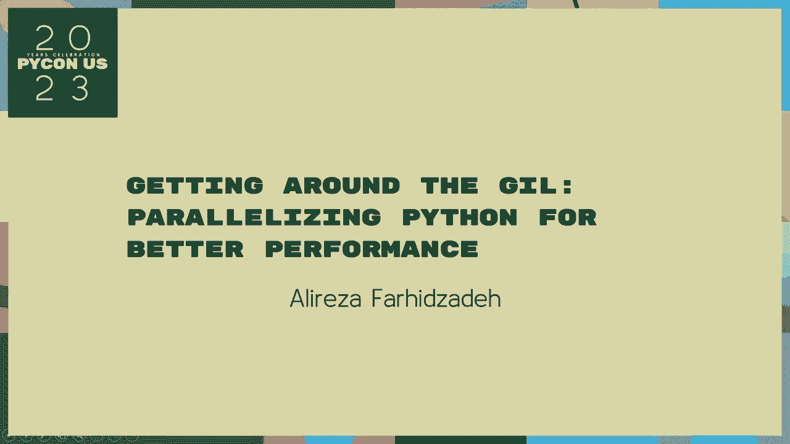
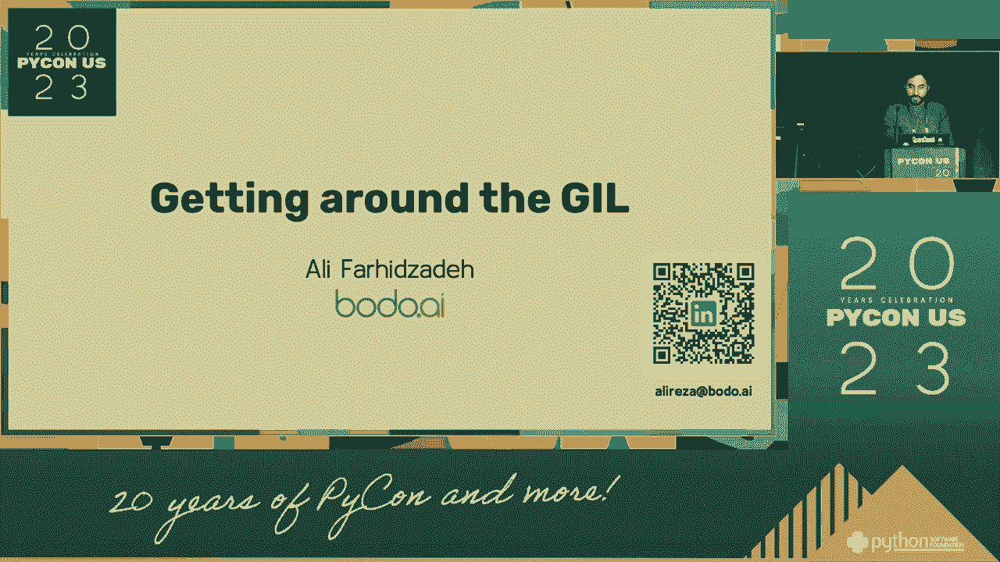
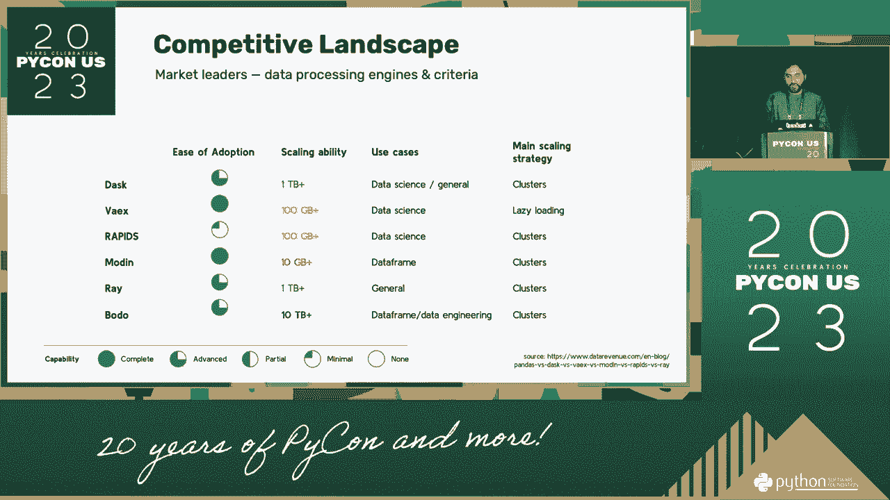
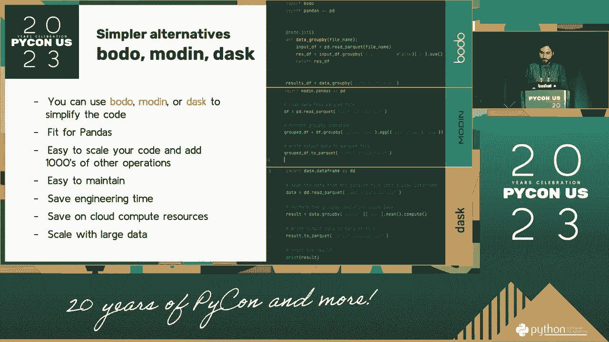
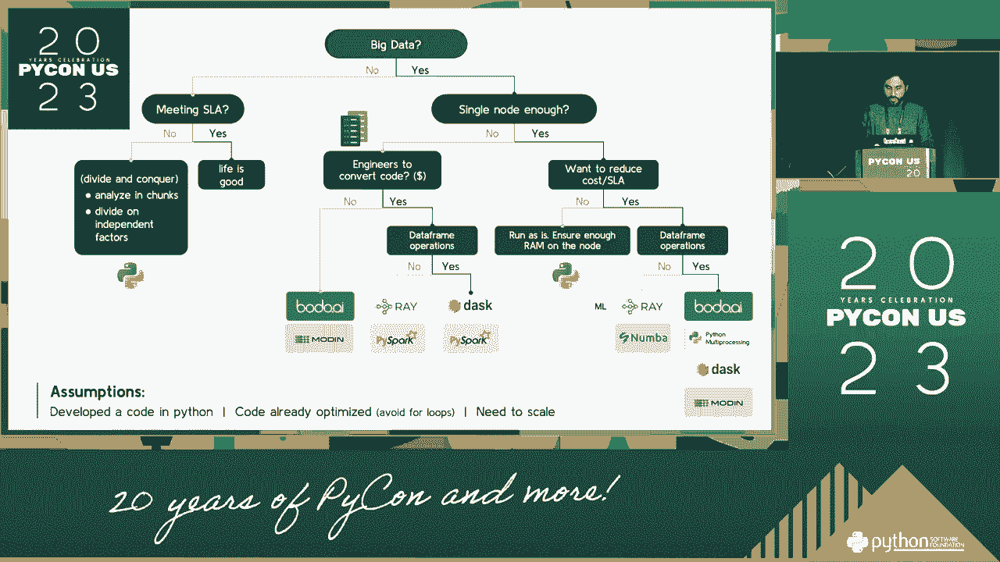
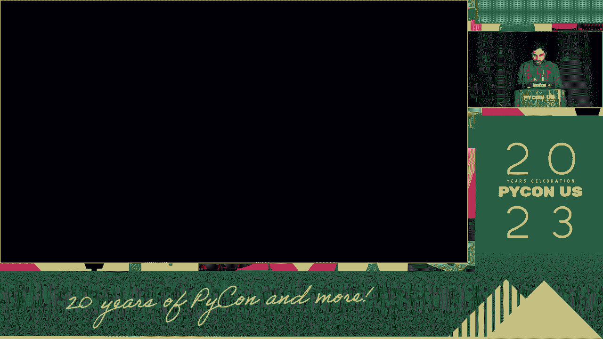

# PyCon US 2023 - P11：Talks - Alireza Farhidzadeh_ Getting Around the GIL_ Parallelizing Python for Be - VikingDen7 - BV1114y1o7c5

 Okay， we're going to go ahead and get started with our first talk in the afternoon walk。

 Getting around the globe parallelizing smartphones for bank accountants with our employees。 Thank you for being here today。 I'm going to be the first person in the middle of the night。 I'm going to go back there。 I'm going to go back there。 I'm going to be the first person in the morning。 A little bit about me。

 I will be in the blue front door to the boys in my life。 I'm going to continue。 I started putting about 20 years ago。 I'm going to be in the eye contact with my friends。 Then 20 years ago， I worked my first team fellow world with front time。 Today。 I was in the middle of the night。 I come from home。 I went to the United States on my birthday。

 Thank you。 So I want to take a picture of you all。 I'm not taking my birthday with you。 but if you don't mind， I have to get the lights off from my head on。 I'm going to take 10-2-12-8。 So， I'm going to take a picture of you。 I'm going to take a picture of you。 I'm going to be in the middle of the night。 I'm going to be in the middle of the night。

 I'm going to be in the middle of the night。 I'm going to talk about how the night is late to go around the floor。 I'm going to take a picture of you all。 I'm going to take a picture of you all。 I'm going to take a picture of you all。 I'm going to take a picture of you all。 I'm going to take a picture of you all。 I'm going to take a picture of you all。

 I'm going to take a picture of you all。 I'm going to take a picture of you all。 I'm going to take a picture of you all。 I'm going to take a picture of you all。 I'm going to take a picture of you all。

 I'm going to take a picture of you all。 I'm going to take a picture of you all。 I'm going to take a picture of you all。 I'm going to take a picture of you all。 I'm going to take a picture of you all。 I'm going to take a picture of you all。 I'm going to take a picture of you all。 I'm going to take a picture of you all。

 I'm going to take a picture of you all。 I'm going to take a picture of you all。 I'm going to take a picture of you all。 I'm going to take a picture of you all。 I'm going to take a picture of you all。 I'm going to take a picture of you all。 I'm going to take a picture of you all。 I'm going to take a picture of you all。

 I'm going to take a picture of you all。 I'm going to take a picture of you all。 I'm going to take a picture of you all。 I'm going to take a picture of you all。 I'm going to take a picture of you all。 I'm going to take a picture of you all。 I'm going to take a picture of you all。 I'm going to take a picture of you all。

 I'm going to take a picture of you all。 I'm going to take a picture of you all。 I'm going to take a picture of you all。 I'm going to take a picture of you all。 I'm going to take a picture of you all。 I'm going to take a picture of you all。 I'm going to take a picture of you all。 I'm going to take a picture of you all。

 I'm going to take a picture of you all。 I'm going to take a picture of you all。 I'm going to take a picture of you all。 I'm going to take a picture of you all。 I'm going to take a picture of you all。 I'm going to take a picture of you all。 I'm going to take a picture of you all。 I'm going to take a picture of you all。

 Let's see what's happening in this course。 I hope you have two questions。 But both of you can provide all of these。 The research conference will begin soon。 So。 I'm going to take a picture of you all。 I will take a picture of you all。 I'm going to take a picture of you all。 I'm going to take a picture of you all。

 I'm going to take a picture of you all。 I'm going to take a picture of you all。 I'm going to take a picture of you all。 I'm going to take a picture of you all。 I'm going to take a picture of you all。 I'm going to take a picture of you all。 I'm going to take a picture of you all。 I'm going to take a picture of you all。

 I'm going to take a picture of you all。 I'm going to take a picture of you all。 This is the main picture that we're going to take a picture of you all。 I'm going to take a picture of you all。 I'm going to take a picture of you all。 The first place we're going to take is what we need to tell you。 I can enter a picture。

 And we're going to be one， so we're going to take a picture of you all。 And once it's more than once， we're going to take a picture of you all。 The view is clearly past the main picture that we're going to take a picture of you all。 We're going to take a picture of you all。 There's definitely a picture of you all。

 which is clearly the one in which I find a picture of you all。 I've told you a story。 And once you have a picture of you， you can see the picture of you all。 I can see it。 And after that， I'm starting a story of you all。 And I'm going to take a picture of you all。 And I'm going to take a picture of you all。 You can see the picture of you all。

 This is the impact on you。 And how we're doing this， I do not recognize you。 I'm thinking。 That's why we happen by the movement of you all。 It's meant to be a simulation。 It's meant to be a simulation。 It's meant to be a simulation。 It's meant to be a simulation。 It's meant to be a simulation。 It's meant to be a simulation。 It's meant to be a simulation。

 It's meant to be a simulation。 It's meant to be a simulation。 It's meant to be a simulation。 It's meant to be a simulation。 It's meant to be a simulation。 It's meant to be a simulation。 It's meant to be a simulation。 It's meant to be a simulation。 It's meant to be a simulation。 It's meant to be a simulation。 It's meant to be a simulation。 It's meant to be a simulation。

 It's meant to be a simulation。 It's meant to be a simulation。 It's meant to be a simulation。 It's meant to be a simulation。 It's meant to be a simulation。 It's meant to be a simulation。 It's meant to be a simulation。 It's meant to be a simulation。 It's meant to be a simulation。 It's meant to be a simulation。 It's meant to be a simulation。 It's meant to be a simulation。

 It's meant to be a simulation。 It's meant to be a simulation。 It's meant to be a simulation。 It's meant to be a simulation。 It's meant to be a simulation。 It's meant to be a simulation。 It's meant to be a simulation。 It's meant to be a simulation。 It's meant to be a simulation。 It's meant to be a simulation。 It's meant to be a simulation。 It's meant to be a simulation。

 It's meant to be a simulation。 It's meant to be a simulation。 It's meant to be a simulation。 It's meant to be a simulation。 It's meant to be a simulation。 It's meant to be a simulation。 It's meant to be a simulation。 It's meant to be a simulation。 It's meant to be a simulation。 It's meant to be a simulation。 It's meant to be a simulation。 It's meant to be a simulation。

 It's meant to be a simulation。 It's meant to be a simulation。 It's meant to be a simulation。 It's meant to be a simulation。 It's meant to be a simulation。 It's meant to be a simulation。 It's meant to be a simulation。 It's meant to be a simulation。 It's meant to be a simulation。 It's meant to be a simulation。 It's meant to be a simulation。 It's meant to be a simulation。

 It's meant to be a simulation。 It's meant to be a simulation。 It's meant to be a simulation。 It's meant to be a simulation。 It's meant to be a simulation。 It's meant to be a simulation。 It's meant to be a simulation。 It's meant to be a simulation。 It's meant to be a simulation。 It's meant to be a simulation。 It's meant to be a simulation。 It's meant to be a simulation。

 It's meant to be a simulation。 It's meant to be a simulation。 It's meant to be a simulation。 It's meant to be a simulation。 It's meant to be a simulation。 It's meant to be a simulation。 It's meant to be a simulation。 It's meant to be a simulation。 It's meant to be a simulation。 It's meant to be a simulation。 It's meant to be a simulation。 It's meant to be a simulation。

 It's meant to be a simulation。 It's meant to be a simulation。 It's meant to be a simulation。 It's meant to be a simulation。 It's meant to be a simulation。 It's meant to be a simulation。 It's meant to be a simulation。 It's meant to be a simulation。 It's meant to be a simulation。 It's meant to be a simulation。 It's meant to be a simulation。 It's meant to be a simulation。

 It's meant to be a simulation。 It's meant to be a simulation。 It's meant to be a simulation。 It's meant to be a simulation。 It's meant to be a simulation。 It's meant to be a simulation。 It's meant to be a simulation。 It's meant to be a simulation。 It's meant to be a simulation。 It's meant to be a simulation。 It's meant to be a simulation。 It's meant to be a simulation。

 It's meant to be a simulation。 It's meant to be a simulation。 It's meant to be a simulation。 It's meant to be a simulation。 It's meant to be a simulation。 It's meant to be a simulation。 It's meant to be a simulation。 It's meant to be a simulation。 It's meant to be a simulation。 It's meant to be a simulation。 It's meant to be a simulation。 It's meant to be a simulation。

 It's meant to be a simulation。 It's meant to be a simulation。 It's meant to be a simulation。 It's meant to be a simulation。 It's meant to be a simulation。 It's meant to be a simulation。 It's meant to be a simulation。 It's meant to be a simulation。 It's meant to be a simulation。 It's meant to be a simulation。 It's meant to be a simulation。 It's meant to be a simulation。

 It's meant to be a simulation。 It's meant to be a simulation。 It's meant to be a simulation。 It's meant to be a simulation。 It's meant to be a simulation。 It's meant to be a simulation。 It's meant to be a simulation。 It's meant to be a simulation。 It's meant to be a simulation。 It's meant to be a simulation。 It's meant to be a simulation。 It's meant to be a simulation。

 It's meant to be a simulation。 It's meant to be a simulation。 It's meant to be a simulation。 It's meant to be a simulation。 It's meant to be a simulation。 It's meant to be a simulation。 It's meant to be a simulation。 It's meant to be a simulation。 It's meant to be a simulation。 It's meant to be a simulation。 It's meant to be a simulation。 It's meant to be a simulation。

 It's meant to be a simulation。 It's meant to be a simulation。 It's meant to be a simulation。 It's meant to be a simulation。 It's meant to be a simulation。 It's meant to be a simulation。 It's meant to be a simulation。 It's meant to be a simulation。 It's meant to be a simulation。 It's meant to be a simulation。 It's meant to be a simulation。 It's meant to be a simulation。

 It's meant to be a simulation。 It's meant to be a simulation。 It's meant to be a simulation。 It's meant to be a simulation。 It's meant to be a simulation。 It's meant to be a simulation。 It's meant to be a simulation。 It's meant to be a simulation。 It's meant to be a simulation。 It's meant to be a simulation。 It's meant to be a simulation。 It's meant to be a simulation。

 It's meant to be a simulation。 It's meant to be a simulation。 It's meant to be a simulation。 It's meant to be a simulation。 It's meant to be a simulation。 It's meant to be a simulation。 It's meant to be a simulation。 It's meant to be a simulation。 It's meant to be a simulation。 It's meant to be a simulation。 It's meant to be a simulation。 It's meant to be a simulation。

 It's meant to be a simulation。 It's meant to be a simulation。 It's meant to be a simulation。 It's meant to be a simulation。 It's meant to be a simulation。 It's meant to be a simulation。 It's meant to be a simulation。 It's meant to be a simulation。 It's meant to be a simulation。 It's meant to be a simulation。 It's meant to be a simulation。 It's meant to be a simulation。

 It's meant to be a simulation。 It's meant to be a simulation。 It's meant to be a simulation。 It's meant to be a simulation。 It's meant to be a simulation。 It's meant to be a simulation。 It's meant to be a simulation。 It's meant to be a simulation。 It's meant to be a simulation。 It's meant to be a simulation。 It's meant to be a simulation。 It's meant to be a simulation。

 It's meant to be a simulation。 It's meant to be a simulation。 It's meant to be a simulation。 It's meant to be a simulation。 It's meant to be a simulation。 It's meant to be a simulation。 It's meant to be a simulation。 It's meant to be a simulation。 It's meant to be a simulation。 It's meant to be a simulation。 It's meant to be a simulation。 It's meant to be a simulation。

 It's meant to be a simulation。 It's meant to be a simulation。 It's meant to be a simulation。 It's meant to be a simulation。 It's meant to be a simulation。 It's meant to be a simulation。 It's meant to be a simulation。 And I also know， I know what to do when you're doing it。 I'm going to do something like this in my television project。 I'm going to do it。 So。

 there was just a lot of libraries trying to tell the property of the product。 I want to classify these new libraries into two- and three-way-way-way。 The home-time in the classroom， the time in the classroom。 and there's two-way-time in the classroom。 And most of the people who are in a classroom are able to use libraries and to get a principal。

 We want to get data on a part-line and a part-line and a part-line and a part-line to get a part-line and a part-line。 Part-line is going to a very difficult part in the classroom。 It can be done quite a bit。 but it's going to work a lot。 One part of the reason is that you don't need to write a little bit of a paper for a small amount。 so it's going to be a difficult part of the classroom。

 You can write a little bit of a paper for a small amount of the library。 And you can write a little bit of a paper for a small amount of the library。 So。 we want to write a little bit of a paper for a small amount of the library。 And that's going to be a little bit difficult to write a little bit of a paper。 In the middle。

 we have five stars coming， three， and three， and three， and a minute。 and it is just going to start that note， and remember all those pieces of all in the same way。 And I'm trying to write， so you have more than anything for a small amount。 Among you。 they are a member of those three years of this time on compilers。

 One of the three dots I can include is the compilers to make it clear。 And most of the compilers do so。 And there can be between minutes to ten-plus， so far away。 All of those are not just compilers。 We're going to have real-time focus far-wiseing。 where you become deeper into a compiler。 We can take a touch of the data， so that there can be two。

 on-time the program， and we can use a shorter-parlor as an information that is used in the exam。 And can be deployed on an inside-class facility， so the library and the data is unispecial。 So the way we mean you really get around the program， why not for an activity of an individual？

 And instead， we're going to make a complete process to you， basically。 an entity that is being fully-parlor-specific， and you can make a complete use of a multi-game program。 And you can make a complete use of a multi-game program。 So。 all of those in store are like the company and I wish to be able to get a complete use of a continuity of the library。

 And I think it is one of the oldest points of the world。 and I think the other world is one of the most important points of my question is。 what do we really want this kind of policy to look for？ And many of them are called "pig"s。 For example， if you're a professional， what do you mean "pig" is a good question？

 But the other one of the students， we're assuming that we're able to reach them together。 and try to get their own right-of-state out of order。 so I wonder if there are more than aspects of what we really want。 and that we don't have any complete use of a multi-game program。

 And so I think it's one of the most important points of the world。 So。 I think the same one is just kind of， and I think it's a little bit too long。 And the other one is kind of a piece of it。

 And the other one is kind of a piece of it。 So， this particular piece， one of the two。 is a multi-class program。 And now I'm going to talk about something called "， a multi-class program。 So， if you want to be able to ensure that you are a multi-class program。 you need to be able to manage the work。 And then it's about like teaching on the course。

 and the course you do at the same time， which is your online and conversation。 But what you need is a multi-class program。 And what you can do is just take a multi-class program and work with you。 And what you need is a multi-class program。 And you can do it in a multi-class program。 And you can do it in a multi-class program。 And you can do it in a multi-class program。

 And you can do it in a multi-class program。 And you can do it in a multi-class program。 So。 there's things in our community， in our community， in our community。 and one of the working community， in our community， is a community community。 and that's in our community。 The photo， the number， and as you see， it always by the way。

 it just means you're all about the same amount of the time。 You can basically， one one for you。 but there's no difference between time and time。 And you can do it in a multi-class program。 And a border is just as similar as the other two-part language。 You can make a program that is very important。 If you're not only in a mixed-level program or in the panel。

 you can get a fantastic， interesting， data-friendly space。 And if you're doing a multi-class program， you can do it in a multi-class program。 So。 if you're not just writing a history video， you can use your final point。 you can use your final point， you can use your final point， you can use your final point。

 you can use it in a multi-class program， you can use it in a multi-class program。 And if you're doing a multi-class program， you can use it in a multi-class program。 You can use it in a multi-class program。 And if you're doing a multi-class program。 you can use it in a multi-class program。 You can use it in a multi-class program。

 And if you're doing a multi-class program， you can use it in a multi-class program。 And if you're doing a multi-class program， you can use it in a multi-class program。 And if you're doing a multi-class program， you can use it in a multi-class program。 And if you're doing a multi-class program， you can use it in a multi-class program。

 And if you're doing a multi-class program， you can use it in a multi-class program。

 And if you're doing a multi-class program， you can use it in a multi-class program。 And if you're doing a multi-class program， you can use it in a multi-class program。 And if you're doing a multi-class program， you can use it in a multi-class program。 But you might not get me through it。 It's not too many。

 But every one of you that you've been starting to show in short hours。 you can go to a multi-class program， for example， while you're not in a multi-class program。 you can use it in a multi-class program。 And it's not too many。 And you can use it in a multi-class program。 And you can use it in a multi-class program。

 And you can use it in a multi-class program。 And you can use it in a multi-class program。 And you can use it in a multi-class program。 And you can use it in a multi-class program。 And you can use it in a multi-class program。 And you can use it in a multi-class program。 And you can use it in a multi-class program。 And you can do it in a multi-class program。

 And you can do it in a multi-class program。 And you can do it in a multi-class program。 And also。 there's not a block of the country that you can use。 So there are already a lot of people that are in a multi-class program。 And the work that is right from people's views on the world。 But again， you know。

 that's 40% of the Americans who are sick for a comprehensive new applications。 So there are more than a multi-class program than a multi-class program。 And I will have you go really into the dynamic course program。 And I will have you go really into the dynamic course program。

 And I will have you go really into the dynamic course program。 And I will have you go really into the dynamic course program。 And I will have you go really into the dynamic course program。 And I will have you go really into the dynamic course program。

 And I will have you go really into the dynamic course program。 And I will have you go really into the dynamic course program。 And I will have you go really into the dynamic course program。 And you can use it in a multi-class program。 And you can use it in a multi-class program。

 And you can use it in a multi-class program。 And you can use it in a multi-class program。 And you can use it in a multi-class program。 And so I will have you go really into the multi-class program。 And I will have you go really into the multi-class program。 And so what are those things that these people have taken on？ First。

 I think it's a final application。 And I think it's a final。 And then。 I think it's a final application。 And then， it's a final application。 And actually。 it's not a full format of code。 And then， it's a full format。 And then。 it works with the same language。 And then， it works with the same language。

 And these are the libraries that I've shown before。 I'm having an example of the same language in the next slide。 So those are the same code。 And so I think that we left out， and it's not quite right。 But it's also not a good language。 and it's not a very good language。 So that's a full， complete language。 And so。

 I think that we're going to have a full format。 And so。 I think that we're going to have a full format。 And so。 I think that we're going to have a full format。 And so， we're going to have a full format。 And so。 we're going to have a full format。 And so， we're going to have a full format。 And so。

 we're going to have a full format。 And so， we're going to have a full format。 And we're making it a full way of doing language with this， but we're not just doing it a full way。 And we know what the only thing we have to do is， and not really do it any of the language we need to do this more。 And then， we're going to have a full format。 And so， we're going to have a full format。

 And I think that's not it。 But this one， and I think that it's the language one。 And these other。 that's the language we write in context。 We can write on a capital， a capital， a capital。 a capital that is independent， and we can write on a capital。 And so。 we're going to have a full format。 And so， we're going to have a full format。 And so。

 we're going to have a full format。 And so， we're going to have a full format。 And so。 we're going to have a full format。 And so， we're going to have a full format。 And so。 we're going to have a full format。 And so， we're going to have a full format。 And so。 we're going to have a full format。 And now， we're going to have a full format。 So。

 we're going to have a full format。 And so， we're going to have a full format。 And so。 we're going to have a full format。 And so， we're going to have a full format。 And so。 we're going to have a full format。 And so， we're going to have a full format。 And so。 we're going to have a full format。 And so， we're going to have a full format。 And so。

 we're going to have a full format。 And so， we're going to have a full format。 And so。 we're going to have a full format。 And so， we're going to have a full format。 And so。 we're going to have a full format。 And so， we're going to have a full format。 And so。 we're going to have a full format。 And so， we're going to have a full format。 And so。

 we're going to have a full format。 And so， we're going to have a full format。 And so。 we're going to have a full format。 And so， we're going to have a full format。 And so。 we're going to have a full format。 And so， we're going to have a full format。 And so。 we're going to have a full format。 And so， we're going to have a full format。 And so。

 we're going to have a full format。 And so， we're going to have a full format。 And so。 we're going to have a full format。 And so， we're going to have a full format。 And so。 we're going to have a full format。 And so， we're going to have a full format。 And so。 we're going to have a full format。 And so， we're going to have a full format。 And so。

 we're going to have a full format。 And so， we're going to have a full format。 And so。 we're going to have a full format。 And so， we're going to have a full format。 And so。 we're going to have a full format。 And so， we're going to have a full format。 And so。 we're going to have a full format。 And so， we're going to have a full format。 And so。

 we're going to have a full format。 And so， we're going to have a full format。 And so。 we're going to have a full format。 And so， we're going to have a full format。 And so。 we're going to have a full format。 And so， we're going to have a full format。 And so。 we're going to have a full format。 And so， we're going to have a full format。 And so。

 we're going to have a full format。 And so， we're going to have a full format。 And so。 we're going to have a full format。 And so， we're going to have a full format。 And so。 we're going to have a full format。 And so， we're going to have a full format。 And so。 we're going to have a full format。 And so， we're going to have a full format。 And so。

 we're going to have a full format。 And so， we're going to have a full format。 And so。 we're going to have a full format。 And so， we're going to have a full format。 And so。 we're going to have a full format。 And so， we're going to have a full format。 And so。 we're going to have a full format。 And so， we're going to have a full format。 And so。

 we're going to have a full format。 And so， we're going to have a full format。 And so。 we're going to have a full format。 And so， we're going to have a full format。 And so。 we're going to have a full format。 And so， we're going to have a full format。 And so。 we're going to have a full format。 And so， we're going to have a full format。 And so。

 we're going to have a full format。 And so， we're going to have a full format。 And so。 we're going to have a full format。 And so， we're going to have a full format。 And so。 we're going to have a full format。 And so， we're going to have a full format。 And so。 we're going to have a full format。 And so， we're going to have a full format。 And so。

 we're going to have a full format。 And so， we're going to have a full format。 And so。 we're going to have a full format。 And so， we're going to have a full format。

 And so， we're going to have a full format。 And so， we're going to have a full format。 And so。 we're going to have a full format。

 And so， we're going to have a full format。 And so， we're going to have a full format。 And so。 we're going to have a full format。 And so， we're going to have a full format。 And so。 we're going to have a full format。 And so， we're going to have a full format。 And so。 we're going to have a full format。 And so， we're going to have a full format。 And so。

 we're going to have a full format。 And so， we're going to have a full format。 And so。 we're going to have a full format。 And so， we're going to have a full format。 And so。 we're going to have a full format。 And so， we're going to have a full format。 And so。 we're going to have a full format。 And so， we're going to have a full format。 And so。

 we're going to have a full format。 And so， we're going to have a full format。 And so。 we're going to have a full format。 And so， we're going to have a full format。 And so。 we're going to have a full format。 And so， we're going to have a full format。 And so。 we're going to have a full format。 And so， we're going to have a full format。 And so。

 we're going to have a full format。 And so， we're going to have a full format。 And so。 we're going to have a full format。 And so， we're going to have a full format。 And so。 we're going to have a full format。 And so， we're going to have a full format。 And so。 we're going to have a full format。 And so， we're going to have a full format。 And so。

 we're going to have a full format。 And so， we're going to have a full format。 And so。 we're going to have a full format。 And so， we're going to have a full format。 And so。 we're going to have a full format。 And so， we're going to have a full format。 And so。 we're going to have a full format。 And so， we're going to have a full format。 And so。

 we're going to have a full format。 And so， we're going to have a full format。 And so。 we're going to have a full format。 And so， we're going to have a full format。 And so。 we're going to have a full format。 And so， we're going to have a full format。 And so。 we're going to have a full format。 And so， we're going to have a full format。 And so。

 we're going to have a full format。 And so， we're going to have a full format。 And so。 we're going to have a full format。 And so， we're going to have a full format。 And so。 we're going to have a full format。 And so， we're going to have a full format。 And so。 we're going to have a full format。 And so， we're going to have a full format。 And so。

 we're going to have a full format。 And so， we're going to have a full format。 And so。 we're going to have a full format。 And so， we're going to have a full format。 And so。 we're going to have a full format。 And so， we're going to have a full format。 And so。 we're going to have a full format。 And so， we're going to have a full format。 And so。

 we're going to have a full format。 And so， we're going to have a full format。 And so。 we're going to have a full format。 And so， we're going to have a full format。 And so。 we're going to have a full format。 And so， we're going to have a full format。 And so。 we're going to have a full format。 And so， we're going to have a full format。 And so。

 we're going to have a full format。 And so， we're going to have a full format。 And so。 we're going to have a full format。 And so， we're going to have a full format。 And so。 we're going to have a full format。 And so， we're working very hard。 And so， we're working very hard。 And so， we're going to have a full format。 And so， we're going to have a full format。 So。

 thank you so much， my name is Ali。 I'm glad to be here with you。 So， thank you so much。 Thank you so much。 [ Pause ]， [ Pause ]， [ Pause ]， [ Pause ]， Okay。 we're going to have a few minutes。 A question？ [ Pause ]， [ Pause ]。 And we can get started on the side of the board。 And so， all your questions。 And so。

 everything's important。 Okay。 And so， I say， we're going to have a full format。 [ Pause ]， Okay。 [ Pause ]， Okay。 [ Pause ]， Yes。 [ Pause ]， [ Pause ]。 We're going to talk to another machine learning team。 I'm sorry。 I'm sorry。 I'm sorry。 I'm sorry。 I'm sorry。 This is why this is a bit difficult for people in the community。 So。

 I want to congratulate the most alumni in the community。 It's just a number that I sent out on the community。 But at this point。 what we're going to do is not support。 I'm going to try to start by the first time。 Okay。 very small。 I'm sorry。 I'm not so sure。 I'll try to take a moment。 Okay。 [ Pause ]。

 And my thank you。 As a question， and you mentioned data fields in the community。 do you mean unless data fields do？ Yes。 Okay。 [ Pause ]， [ Pause ]， [ Pause ]， [ Pause ]， [ Pause ]。