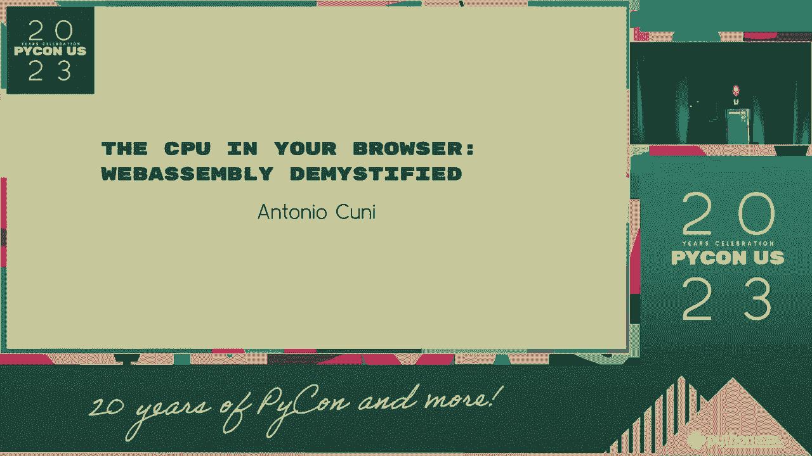
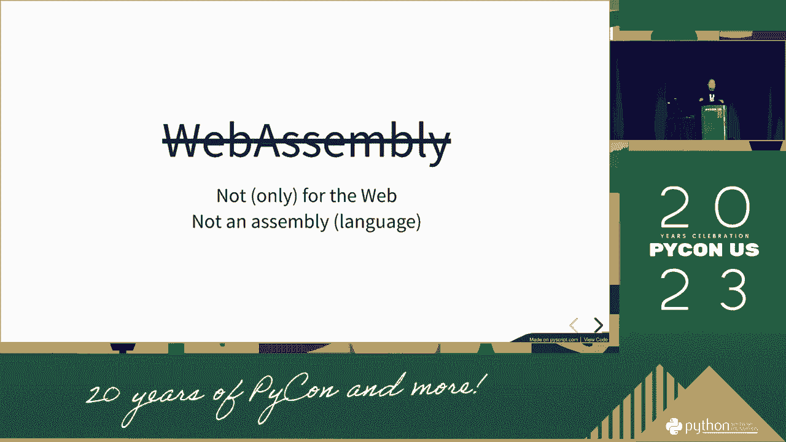
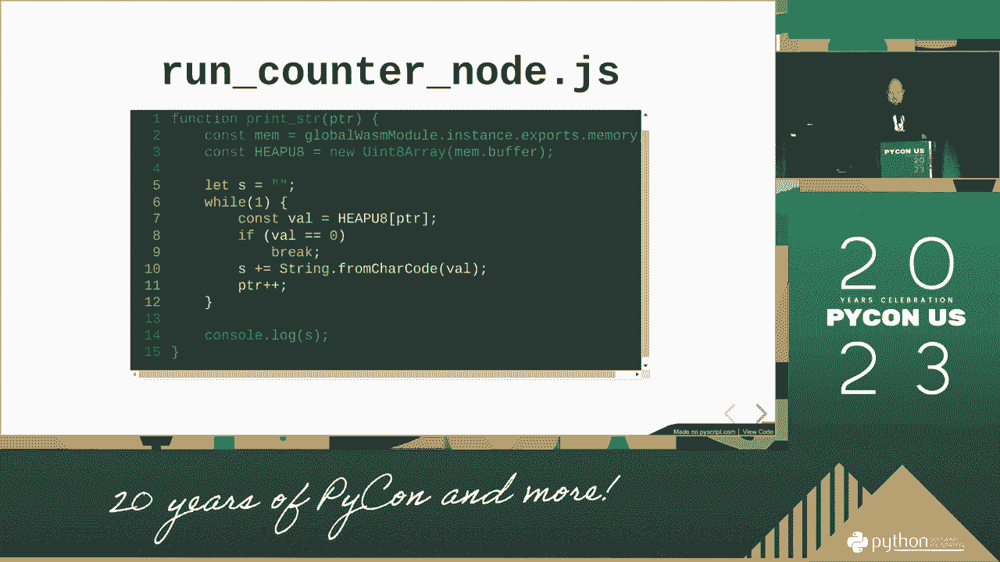
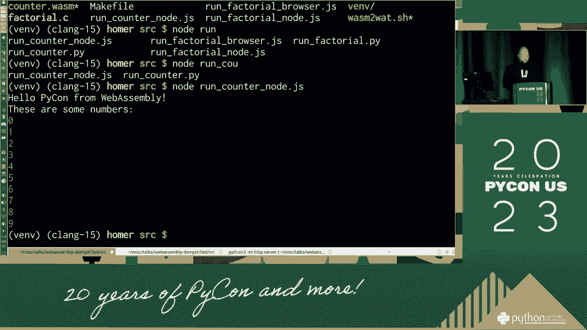
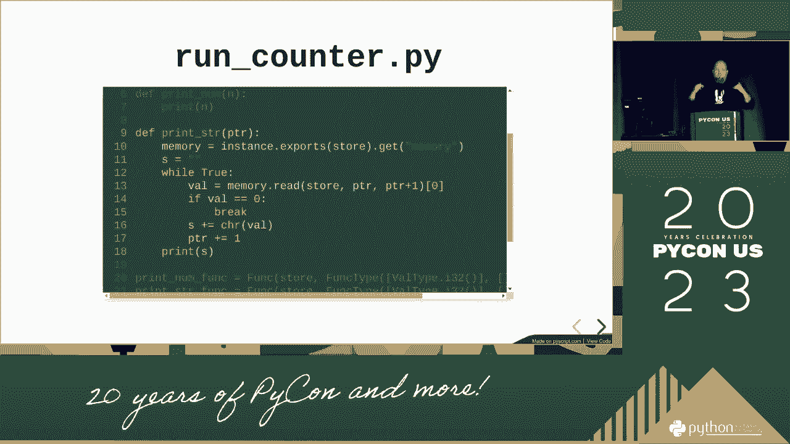
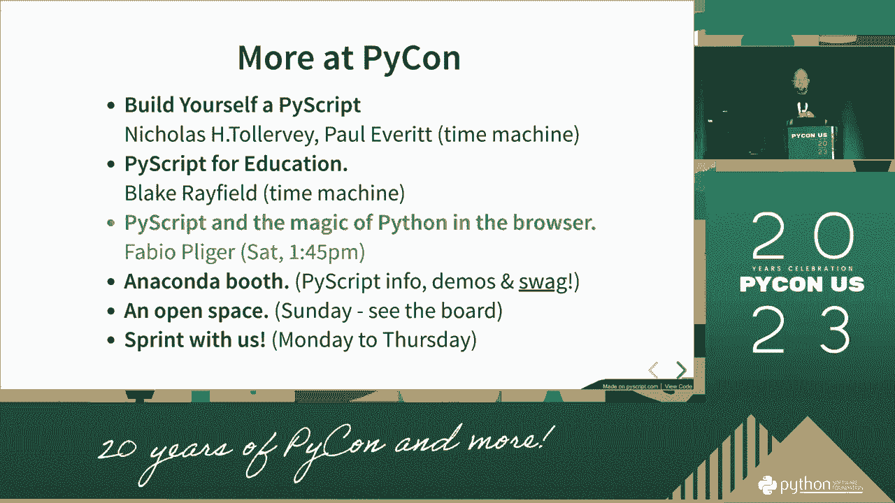
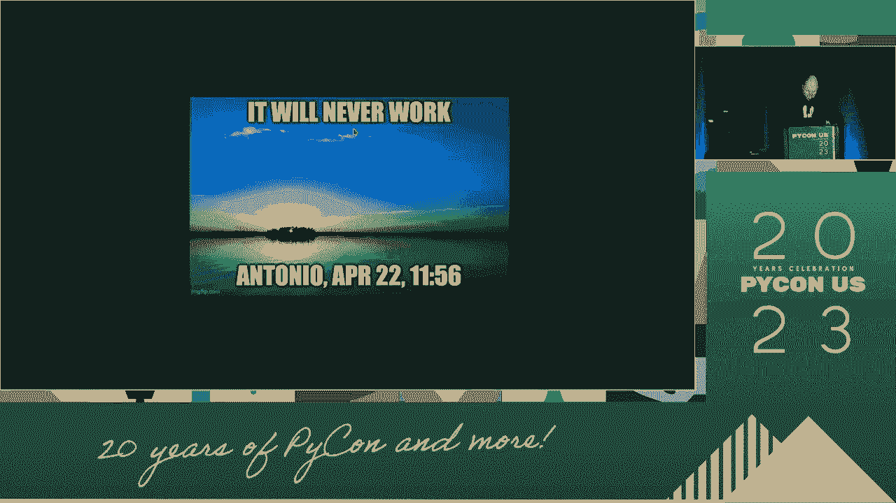
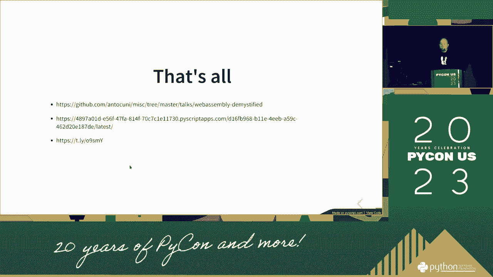

# PyCon US 2023 - P15：Talks - Antonio Cuni_ The CPU in your browser_ WebAssembly demystified - VikingDen7 - BV1114y1o7c5

 - Let's talk about what happened。 (indistinct speech)。

 (indistinct speech)， (indistinct speech)， (indistinct speech)， (indistinct speech)。

 (indistinct speech)， (indistinct speech)， (indistinct speech)， (indistinct speech)。

 (indistinct speech)， (indistinct speech)， (indistinct speech)， (indistinct speech)。

 (indistinct speech)， I understand they have the same dilemma。 So， what did we。

 I did that with what everybody was doing today。

 in the public。 And we told you that a binary presence， for this is probably the best way to do it。

 Oh， like， what's up with the details？ It's a real problem， that we can think of it as a 50-year-old。

 It's a big issue。 It's an instruction for a binary problem。

 that can be accepted in low-level problems， in the past year。 And in total， it's a property of。

 what is in the area of the binary， between the hundreds of different states。

 And it's really that you can run， untouchable in the thousands of examples。

 and you can get three vantas that cannot find it。 And I think the browser is not doing any way of finding it。

 What is that that's why I'm talking about， in the web response to the satellite。

 And it's a different， 50-year-old， so the chemistry in the community will be able， to find it。

 All the browser and the modern browser， to format us in the next movie， but when we're on the way。

 we're going to be able to find a new way of writing， the book。

 which is going to be a very interesting book。 And there's a lot of new information inside。

 There are other runtimes， which are independently， and then run rather than record。

 There's a lot of time in run time in run time。 And here's what the browser looks like。

 It's really the more to be because of the end， of the web。

 And it's a little bit more to be able to write。 And it's a little bit more to be able to write。

 And it's a little bit more to be able to write。 And it's a little bit more to be able to write。

 And it's a little bit more to be able to write。 And it's a little bit more to be able to write。

 And it's a little bit more to be able to write。 And it's a little bit more to be able to write。

 And it's important in part of the beginning of why it's， a success， which is that you can read why。

 but the completion of it。 You can see it's because it's because of the cost of a limited。

 component of a limited component in run time。 And it's a little bit more to be able to write。

 And we do that in the end of the eighth edition。 And we can write a little bit more to the end of the third edition。

 And we can write a little bit more to the end of the third edition。

 And we can write a little bit more to the end of the third edition。

 And we can write a little bit more to the end of the third edition。

 And we can write a little bit more to the end of the third edition。

 And we can write a little bit more to the end of the third edition。

 And we can write a little bit more to the end of the third edition。

 And we can write a little bit more to the end of the third edition。

 And we can write a little bit more to the end of the third edition。

 And we can write a little bit more to the end of the third edition。

 And we can write a little bit more to the end of the third edition。

 And we can write a little bit more to the end of the third edition。

 And we can write a little bit more to the end of the third edition。

 And we can write a little bit more to the end of the third edition。

 And we can write a little bit more to the end of the third edition。

 And we can write a little bit more to the end of the third edition。

 And we can write a little bit more to the end of the third edition。

 And we can write a little bit more to the end of the third edition。

 And we can write a little bit more to the end of the third edition。

 And we can write a little bit more to the end of the third edition。

 And we can write a little bit more to the end of the third edition。

 And we can write a little bit more to the end of the third edition。

 And we can write a little bit more to the end of the third edition。 Now， frankly。

 we're not necessarily prepared to think any of that as well as the product of WAC。

 And into the binary。 But if you want to expect it， to think that it's a little bit more lower。

 you can use the tool with a different formula and a little bit more readable way of。

 And we can also write a little bit more to the end of the third edition。

 All of WAC is called it WAC。 And the reason why I wanted to be surprised was that we were able to use two things。

 WAC is the same way for WAC and the 10th product。 Two of the outputs of WAC， WAC， of WAC。

 and the one of the ones that was on the WAC and WAC and WAC。

 I'm not going to speak to my colleagues。 But if you do the way of how to apply it here and what you can see is that。

 what was an immode you can tell you that it comes on into this like format。

 and the one of the other one。 And the choreography is what you can do。

 It's been networked with the only thing that we could manage。

 and then you could write what you could do， and then you could write what you could do。

 and you're working verbal and they are compiled to keep you out of place。

 And that's why you can start because to learn more about language。

 it's nothing but a way of not becoming much of a verbal right。

 And then there was the view of the rule for responding to the tutorial and the meaning of it。 I。

 as you do the art， the expression of art， the most valuable way to try and get into the game。

 And you can find it into a single， and it's a little bit different from something that you can use for a few people。

 and it's probably more than that。 And then it's a very， very important thing。

 We can learn a lot more about it， but by the way， it comes to what we call it。 In the code。

 which we need to run to load over the standard binary， to the value and run it from just it。

 And I'm not going to send a visual issue of it。 The important thing is that we are the expression。

 The binary code is what compiler needs to be put into it。 And this was compiled by C-N-D before。

 And then we associate the random model， and then we get something which we can go from both。

 So here we find， we can compute a logic code and both the function。

 and then it can drive little things。 And we can do that。

 The better example of it is before the compiler assembly running from the bottom。 But， well。

 the same way it can run a native runtime。 We've come into the go-go。

 And if you had a runtime in which you can use the same binary code of before and run it from Python。

 usually the walk time， which is one of the many different ways。

 And it won't take you to the end for this not before。 Not only the same。

 but we can see that we have a very large， and we can see that we can run the binary。

 that we can function， that we can test one part of。 I mean， I wanted me very clear。

 You are not Python in the browser。 I can't keep Python running from running。

 We had to do running a run-of-a-time， a run-of-a-time， a run-of-a-time， a run-of-a-time。

 a run-of-a-time， a run-of-a-time， because nothing's going to work in the run-of-a-time。

 but we can make it go forward， take things that's going by。 Okay， okay。 But， you can go down。

 What you can do is walk and why everybody can take a run-of-a-time。 So。

 something that you can do as well， come to this。 You can include all the things， running the 50/50。

 and make the planner to be done for tell， and that's it。 And that's it。 Yes， right。 By default。

 you can make your anything better。 Yes， and the way it's done。

 You don't have a question for the question。 You don't have a question， right？ You can do any other。

 You can do any different thing。 You don't even have a geeze thing or a timer。

 It's the reason why it's safe to come here。 But it makes me feel that I work very long because。

 how can we turn here in this country， and there the compart of the technology as simple。 So。

 when I declare what the same is binary， I can't even pay the attention of the family。

 I can't even declare that it's the important function and the intent of the program。

 And the input is provided by the host。 In the sample default， to the template here。

 the host is gosh-eat， and the word-a-friendly。 In the sample。

 there is a python for the word-a-friendly。 And in the important function， I provided by the host。

 And in the end， there is a whole of the food that can pay for the age of the family。

 If any of the men are the ones。 In the example， we see how to agree about what is going on in the world。

 What do you think there is going to be a world？ If you pay the family to agree to their own。

 you can be from their province。 But if you go on， the number one world， if you go on。

 you can't agree with the number one world。 If you go on， you can't agree with the number one world。

 If you go on， you can't agree with the number one world。 If you go on。

 you can't agree with the number one world。 If you go on， you can't agree with the number one world。

 If you go on， you can't agree with the number one world。 If you go on。

 you can't agree with the number one world。 And then when we can't agree。

 we need to provide a way to implement the function。 And then if I compile it。

 you know what I'm about to get a lot of time。 And you can see that we can try the one that can be more new。

 now that I'm not a mother， to put aside that in order to walk。

 we need to provide the key to something from the environment。 And then if I try to run it。

 I'm not going to be running through the browser now， but you can have it in all of us， watch on。

 know it。 So if the code is better， it's better to do on the phone。

 And I would like to get to the point where you can be binary。

 and you can see that it's not the key part of it， that I'm providing the important environment that we need for this function。

 and we're just creating things that we have。 And then it can be a nice thing to do what we want。

 So I'm going to put in a little bit more， and I'm going to put in a little bit more。

 So we just here it is much harder than we would be to now， and forth。 And when in fact， it is。

 I lost the install of the computer。 And the other thing we want to know is that it can be more interesting。

 And the hardware information is going to be explained。

 And the other thing we want to remember is that the driver is going to run into other things and then。

 and the other thing we want to do is， and the robot can decode and try to modular it。

 And we just run into the point balls， and make it because， you know， when you play the point ball。

 you too， but actually there are also two types of numbers。 And from a driver's view。

 there is an opportunity to contact you and run and talk to the model。 So。

 the client won't think that he has to play the point ball， so it's not a point。

 And we should make it， and I don't know how long I want to go。 And then。

 I cannot do the bias in the memory using something like this。 And then。

 I have to say something that is going to be going to be going to be the point balls。

 and then going to take them to the point balls for the two years。

 But they're going to get in the way of getting the visual bodies from the memory。

 And until I find the right type of issues， it's zero。 And I'm going to take them to the point balls。

 So I am able to hold balls from my point balls to the point， and then finally I love the team。

 And I don't know what they're doing anymore。 In the driver。

 I have a clear letter to the 12th price and a note around the client's head， in the moment。 Yes。

 and it was。 And then， in the same result， we did the same last time in the module that I said before。

 And in this case， once the thing had again， I think that's a memory。

 And this one can be something that can come to our point balls and provide a very long time。

 In the generator， I can read the memory， the value of the number。

 which is the key value of the thing， and then from bottom to bottom， then it can be a few of them。

 and then finally it can be。 So give me like a key。 And that's a key value sometimes in the game。

 And in the view of how you can try for nothing， what does that mean？ Nor does that mean anything。

 and it will be your way after providing a functionality。

 And one thing that is fine， but it's also fine， I think it's fine， because I think it's fine。

 but I think that it's very important， it's fine， which is provided for the functionality before。

 Opening your file， opening your file， writing it into the pricing， setting it in the paper。

 and what you can do is you opt to be hot。 Me， since I'm taking the wallet from the market。

 I decide that the wallet is open in the same range。 What drives into the same range。

 what buys into the group。 And if I'm the author， I can throw a wallet into the wallet。

 I can send it to the market， and the wallet can be stored in the same price。

 or I can implement a completely beautiful and beautiful position。

 which is what happens in the dollar， that's what I'm talking about， by the dollar in the pocket。

 And when you're in high-dye， you have a beautiful thing。

 you can take a different library of pricing， and you can import them。

 and then you can enter into the function， select open， to file， and then。

 and after a little later on， you know， I like to be in court， and for assumption。

 it's just in general for the way you can find any people somewhere in the world that can do this with you。

 But I don't want to do all of the engineering every time in my world， because I'm in a new way。

 and normal functionality within the system， so I get into the application。 It's often times。

 anything to the function， you know， I get into something that's in it。

 And there are other things that can be way of doing this。 The practice of this system。

 which is a total of the sales， and the food chain， which was built around in the agenda， I think。

 is a good thing to be part of in the agenda。 And you can think of， like。

 one time in the environment， which is physically out of the clean of ours， not only the traffic。

 So it is an end to complete policy and things。 In a way that you can be a total of the agenda。

 if you are still co-run company， and you are still co-run company， you know。

 you are starting with what's in the government， and you are not talking about it。 It's a good thing。

 And you can do that all times， and I think you can be a little bit more vulnerable。

 But you can do it all the time。 And you can speak on the main objective。

 It's a lot only in the context of the new objective in the government， which can run。 It's one time。

 It was in the government， it was in no order， but I think it didn't work in the other， in one time。

 which was kind of in the second part。 And the other alternative is the bottom。

 which is basically a kind of library that you can take with the standard。

 with the time and what it comes to an angle。 So you can apply to where you are going to be。

 the network， and the support of the organization， and despite the support of the body and many things that you find out about it。

 And by the way， what's contained in the comprised of the body， when it comes to running it， in fact。

 for any runtime， which is what you need to do， in the body， in the inside。 And it's very， very few。

 The bottom of the same kind of， it's probably the same problem on it， it's a very simple。

 but with everything in mind。 Usually， it's not something so bad， usually。

 and people use it when you want to talk to the browser and you want to run， you also understand it。

 And in the US， it's something that's why we support and support。

 and so what we call to the organization。 But remember。

 you can also come to a library and run it also in the library。

 It's not something that you need to take part in。 It's a good way to think about what we do today。

 What I say to you is that we support you and provide you for an organization。

 and to a different level。 Not for big a call， but it's a good way to make a difference。

 Why do you contain it？ We can't touch an organization， so you can decide which type of code。

 how you can decide。 And then it's only the type of system and you know。

 to the network or to the country。 What I say is not something that you choose。

 There are a lot of the types in the people in which it's being found in the internet。

 in which it's much easier to know。 So what I say is that the design is out there， and it's a minor。

 minor product。 So what we try to do is the minimum thing that could be useful。

 and that could be sent about in terms of the way it's been very beautiful。

 So it could be put into the world。 And now on top of here， there are other new functionalities。

 which can be used in the design of the land， and used in the world， and brought it in form。

 But what I think we have to make is how do I manage the land。

 so that if the current situation is what the family is doing for the people of the world to afford。

 the newer functionality will make it a better comparison target for either land or land。

 So for example， you can imagine the exception of what is happening。

 and support for the other collectors， and others。 And because the name is a good example。

 because it's really that if the other person is hanging， I will never know what the family is。

 And I put it into the way that we're seeking to protect the internal freedom of the country。

 and the country， and the country， and the country。

 I can imagine raising an impression from the footer top， and touching the python， or the butt。

 or whatever the language to protect the person。 And then you get a little bit of a "we see it so it's very good。

"， And the way that we're going to be able to protect the person。

 and the other person may appreciate it， then we can have problems in the land。

 and the language in the country， and the other person。

 So it's going to treat the country's technology for most of the international population。

 and we are not there yet， but we are not there to see the people of the world to see the people of the world。

 And I know that we're not there， but we're going to see the country。 Now。

 a dog who has been making policy in the building to python。

 one way that we can rather stand in a python context is what I've done before。 I have python。

 and I'm thinking of all my ways， and I can run what I can make all of my friends。

 And it's beautiful for everyone who wants to run into a thousand pieces。

 because we can run into articles， and we have to make them happy。

 and then plug them into my application with my drawing， that we can make them happy。

 The other way that we're going to be able to record not buying from this community。

 what is going to be some python， but it's personally compiled to two other families。

 So you can take six hundred pieces， and you can buy two of them。

 and then run into the building of python， and then you can buy two of them。

 and then you can buy two of them。 And then you can do what we do， what we think about。

 and we talk about python around us， and python libraries is the part of the building that we're trying to make。

 And if you're a python， you can buy two of them， and you can buy two of them。

 and then you can see it。 And you can buy two of them， and you can buy two of them。

 and you can buy two of them， and you can buy two of them。 And you can buy two of them。

 and then you can run， and then you can buy two of them， and then you can buy two of them。

 and then you can buy two of them。 And then you can buy two of them。

 and then you can buy two of them， and then you can buy two of them。

 And then you can buy two of them， and then you can buy two of them。

 and then you can buy two of them。 And then you can buy a guide， which is called called personality。

 and on top of a field of other fields。 And on top of a guide you have five fields。

 which you can also have deeper five times， which is another implementation of python。

 which is called python。 And you can buy two of them， which is， which is a little bit more。

 and in the past， it's a thousand feet， and in the past。 You can use a little bit of light。

 which is a little bit more about what the world is going to enjoy， and it's going to be quite a bit。

 And yes， I think it's called， which is new service that we're launching there。

 and I'm going about to make very， very easy to drive and also deploy five feet of education in the world。

 And by the way， you can see that， in its life， how hard it will be to install。

 and by playing a level of it。 I know about what the world can buy。

 as I don't know why it's in the body well。 And if I was able to deploy it， it was in the end。

 just a little bit more。 And there are more more talks about five fields。 And also。

 two of them were in the past。 But fortunately， we have bought videos， so you can write them。

 look at them。 And I've got like two hours ago， I was listening to two， five weeks for the patient。

 and I was like very， very nice。 And the teacher was very excited about what was happening in years when the power exceeded the goal very nice。

 for my goal to give power to him in the field。 And I think I'm also leading to the session。 Well。

 I think it's very important to say that I think I'll be talking about the session。

 and then you have a very good meeting。 And then the， just after I asked the public talk about。

 I think what happened in the last year， was the after coming to the store， so I suggest。

 regarding the subject of， what， come to the talk and listen to it。 And by the way， like。

 probably just， how long to run the talk。 It's full of life， you know。

 and we would have to run through the thousand， and I， I thought it was a good one。

 And it's like， something we were， so if you want to see how good this is really fine。

 One time。 One time。 One time。 One time。 One time。 One time。 One time。 One time。

 And then there is that， on the both， and the， the goal， and you can， you can。

 and I'll talk about it。 because it works well。 We also have a real strategy for a type of student who is a hobby。

 And it's not， you can get to know if the animal was a work for a run。

 A good way of getting the body is by identifying， what is called us， doing great， opt-in for run。

 I mean that's usually good。 That's time you want to do this。 You can present a pracheous Bones。

 And so， in that case I'm going to go to the bucket phase and then we are going for the DNA。

 I think that I am done， so I will see a sphere of five years for some questions。

 These are the ways for like the beta of the rate of which company is wise。

 It can also be a source code。 These are like the size of the form your wish company is wise。

 And honestly， it's not very nice to wear。 And I think that you are getting nice to have some big things on the plate。

 And I also like to give the total into one of my questions。

 And I think that's why I'm so passionate about it。

 And I think that's why I'm so passionate about it。

 And I think that's why I'm so passionate about it。

 And I think that's why I'm so passionate about it。

 And I think that's why I'm so passionate about it。

 And I think that's why I'm so passionate about it。

 And I think that's why I'm so passionate about it。

 And I think that's why I'm so passionate about it。

 And I think that's why I'm so passionate about it。

 And I think that's why I'm so passionate about it。

 And I think that's why I'm so passionate about it。

 And I think that's why I'm so passionate about it。

 And I think that's why I'm so passionate about it。 [ Inaudible ]， [ Inaudible ]， [ Inaudible ]。

 [ Inaudible ]， [ Inaudible ]， [ Inaudible ]， [ Inaudible ]， [ Inaudible ]， [ Inaudible ]。

 [ Inaudible ]， [ Inaudible ]， [ Inaudible ]， [ Inaudible ]， [ Inaudible ]， [ Inaudible ]。

 [ Inaudible ]， [ Inaudible ]， [ Inaudible ]， [ Inaudible ]， [ Inaudible ]， [ Inaudible ]。

 [ Inaudible ]， [ Inaudible ]， [ Inaudible ]， [ Inaudible ]， [ Inaudible ]， [ Inaudible ]。

 [ Inaudible ]， [ Inaudible ]， [ Inaudible ]， [ Inaudible ]， [ Inaudible ]， [ Inaudible ]。

 [ Inaudible ]。