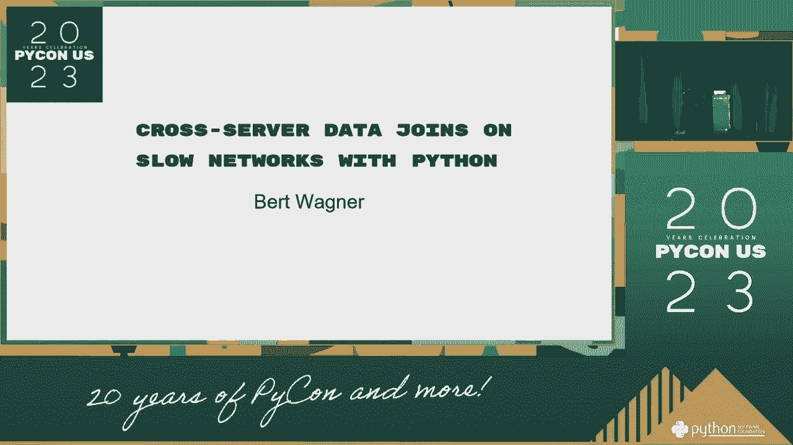
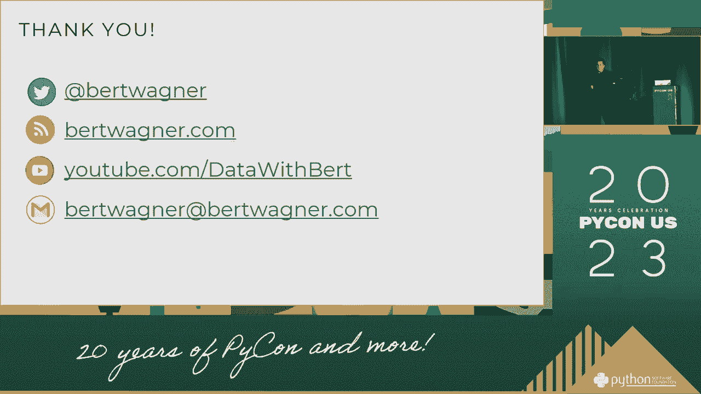

# P16：Talks - Bert Wagner_ Cross-Server Data Joins on Slow Networks with Python - VikingDen7 - BV1114y1o7c5

 Good morning。 Our next speaker is Bert Laggard-Nurk。 And we want to talk to you today about crossover data join， on a loan of work for testing。

 Thank you very much。

 Thank you all for being here once。 Thank you very much。 I'd like to start off with talking about my relationship。

 to some of the other relationships with the data， and the work that I've had。 I'm going to do it from the decade。 I'm going to talk about what I call the wrong data。

 in the following era。 I'm going to bring it to the last year or two。 Obviously。 we've been talking about the data data。 We're not in the work of data science。 We're very important。

 I'm going to talk to the friends。 And it's going to be so helpful。 I'm going to be very binary。 I'm going to spend on data to the next day。 And even though that's very small。

 I'm going to click check。 And it's going to be a little bit different。 And it's going to be kind of the same。

 And also， it's going to be fine。 And I find it so easy to know that。 It's the case in which we haven't used to be free。 And that used to be really important。

 It's a think about how we use the data。 And you can really know how to download the song。 And you can find out where you're going to see。 And you can just read it or whatever。

 But you don't want that song to download。 You can say， you know， you can share， you know， the media。 the new ones， and the things that you want to say。 And take it from the download。

 It was really important。 The web at the time also has a little bit of documentation。 And so look at it。 It's going to be great。 So what a little bit more can be done here。

 I wanted to study it。 And it's fun to study。 Like the word era。 And the word era， the word。 the word， the word。 And it's fun。 And then you're talking to a copy or whatever。

 You can go and check out the same record。 And then you're just having to load。 And then you're always good。 And then you're thinking of being with。

 Whether I was thinking about it or not。 It's a really important part of your life。 And even then。 you're going to die off of it。 You're going to be really cool。 And you're going to be really cool。

 And you're going to be cool。 All right。 So that's for the decade to upgrade into a DSL， cable mode。 and a lot faster。 It's been a lot better。 The website and it's perfect for you to wear。

 They have a good time to understand it， but they're not like loaded。 They're going to take job application and all this。 But it's been better than the industrial。

 You know， what you want to do is to get a lot of bandwidth。 You can look at what it's for grade。 You can get a little bit of data。 It's pretty good。 It's called the security squad。

 which I've seen in the class。 It's a really great game。 But they really want to look at it and it's possible for the power。

 And the background is really different。 And we're looking at an early-day meeting。 where we can go 3，200， 4，200 videos。 And we have a DSLR， a 2，300， a 4，500， a 4，500。

 And this is why I kind of think it's a good one。 And unfortunately， it's pretty risky to sell。 And now we're back to this early-day， so it's called a stop-playing environment。

 So we're not going to do projects， but we're already working home。 And we're going to do this in a very good way。 And the background， same thing for the kids。

 we're changing the numbers。 We're going to be watching some of these。 So we're going to be playing a bandwidth， which is becoming a lot more effective。

 And there's all our video calls。 We're going to be working home， we're going to get started。 And there are people in the house who are video-solved。 So I was beginning。

 And I was beginning to be built。 First thing is that maybe our back-in-port is what we want to do。

 And during it， the video has become much more important。 And the latency has become more important。 And the latency has become more important。 And the latency has become more important。

 And the latency has become more important。 And the latency has become more home network-solved。 And as good as possible， we're going to be able to give them a quick look at it。

 And we'll be able to get it on a minute。 And we'll be able to get it on a minute。 And we'll be able to get it on a minute。 And we'll be able to get it on a minute。

 And we'll be able to get it on a minute。 And we'll be able to get it on a minute。 And we'll be able to get it on a minute。 And we'll be able to get it on a minute。

 And we'll be able to get it on a minute。 And we'll be able to get it on a minute。 And we'll be able to get it on a minute。 And we'll be able to get it on a minute。

 And we'll be able to get it on a minute。 And we'll be able to get it on a minute。 And we'll be able to get it on a minute。 And we'll be able to get it on a minute。

 And we'll be able to get it on a minute。 And we'll be able to get it on a minute。 And we'll be able to get it on a minute。 And we'll be able to get it on a minute。

 And we'll be able to get it on a minute。 And we'll be able to get it on a minute。 And we'll be able to get it on a minute。 And we'll be able to get it on a minute。

 And we'll be able to get it on a minute。 And we'll be able to get it on a minute。 And we'll be able to get it on a minute。 And we'll be able to get it on a minute。

 And we'll be able to get it on a minute。 And we'll be able to get it on a minute。 And we'll be able to get it on a minute。 And we'll be able to get it on a minute。

 And we'll be able to get it on a minute。 And we'll be able to get it on a minute。 And we'll be able to get it on a minute。 And we'll be able to get it on a minute。

 And we'll be able to get it on a minute。 And we'll be able to get it on a minute。 And we'll be able to get it on a minute。 And we'll be able to get it on a minute。

 And we'll be able to get it on a minute。 So my name is Bert Wagner。 I'm going to be able to get it on a minute。 And I'm going to be able to get it on a minute。

 And I'm going to be able to get it on a minute。 And I'm going to be able to get it on a minute。 And I'm going to be able to get it on a minute。 And I'm going to be able to get it on a minute。

 And I'm going to be able to get it on a minute。 And I'm going to be able to get it on a minute。 And I'm going to be able to get it on a minute。 And I'm going to be able to get it on a minute。

 And I'm going to be able to get it on a minute。 And I'm going to be able to get it on a minute。 And I'm going to be able to get it on a minute。 And I'm going to be able to get it on a minute。

 And I'm going to be able to get it on a minute。 And I'm going to be able to get it on a minute。 And I'm going to be able to get it on a minute。 And I'm going to be able to get it on a minute。

 And I'm going to be able to get it on a minute。 And I'm going to be able to get it on a minute。 And I'm going to be able to get it on a minute。 And I'm going to be able to get it on a minute。

 And I'm going to be able to get it on a minute。 And I'm going to be able to get it on a minute。 And I'm going to be able to get it on a minute。 And I'm going to be able to get it on a minute。

 And I'm going to be able to get it on a minute。 And I'm going to be able to get it on a minute。 And I'm going to be able to get it on a minute。 And I'm going to be able to get it on a minute。

 And I'm going to be able to get it on a minute。 And I'm going to be able to get it on a minute。 And I'm going to be able to get it on a minute。 And I'm going to be able to get it on a minute。

 And I'm going to be able to get it on a minute。 And I'm going to be able to get it on a minute。 And I'm going to be able to get it on a minute。 And I'm going to be able to get it on a minute。

 And I'm going to be able to get it on a minute。 And I'm going to be able to get it on a minute。 And I'm going to be able to get it on a minute。 And I'm going to be able to get it on a minute。

 And I'm going to be able to get it on a minute。 And I'm going to be able to get it on a minute。 And I'm going to be able to get it on a minute。 And I'm going to be able to get it on a minute。

 And so I'm going to be able to get it on a minute。 And I'm going to be able to get it on a minute。 And I'm going to be able to get it on a minute。 And I'm going to be able to get it on a minute。

 And I'm going to be able to get it on a minute。 And I'm going to be able to get it on a minute。 And I'm going to be able to get it on a minute。 And I'm going to be able to get it on a minute。

 And I'm going to be able to get it on a minute。 And I'm going to be able to get it on a minute。 And I'm going to be able to get it on a minute。 And I'm going to be able to get it on a minute。

 And I'm going to be able to get it on a minute。 And I'm going to be able to get it on a minute。 And I'm going to be able to get it on a minute。 And I'm going to be able to get it on a minute。

 And I'm going to be able to get it on a minute。 And I like that。 And I'm going to network any time。 So， I'm talking about moving it out of the way。 So， let's go to the first section of the video。

 That's actually my favorite solution。 This is the one you want to be speaking to。 So。 the way we kind of look at these is we take our PSB files， data， something that data。

 and we remove that process。 And that's why it's a small piece of data we're working with。 Let's use that to our data for this file。 Or wherever the bigger data is。

 And it's called moving your smaller data to where the bigger data is。 And so。 maybe that means we're going to be like a 3D table。 And it's because of the data base。

 this is what we're going to be doing。 We're going to be using a temporary and memory table。 It's set up to you。 You're going to be able to make that。 And then you can do your job。

 And then you can do your job。 And then you can do your job。 And then you can do your job。 And then you can do your job。 And then you can do your job。 And then you can do your job。

 And then you can do your job。 And then you can do your job。 And then you can do the right type of job。 And then you can do your job。

 And then you can do your job。 And then you can do your job。 And then you can do your job。 And then you can do your job。 And then you can do your job。 And then you can do your job。

 And then you can do your job。 And then you can do your job。 And then you can do your job。 And then you can do your job。 And then you can do your job。 And then you can do your job。

 And then you can do your job。 And then you can do your job。 And then you can do your job。 And then you can do your job。 And then you can do your job。 And then you can do your job。

 And then you can do your job。 And then you can do your job。 And then you can do your job。 And then you can do your job。 And then you can do your job。 And then you can do your job。

 And then you can do your job。 And then you can do your job。 And then you can do your job。 And then you can do your job。 And then you can do your job。 And then you can do your job。

 And then you can do your job。 And then you can do your job。 And then you can do your job。 And then you can do your job。 And then you can do your job。 And then you can do your job。

 And then you can do your job。 And then you can do your job。 And then you can do your job。 And then you can do your job。 And then you can do your job。 And then you can do your job。

 And then you can do your job。 And then you can do your job。 And then you can do your job。 And then you can do your job。 And then you can do your job。 And then you can do your job。

 And then you can do your job。 And then you can do your job。 And then you can do your job。 And then you can do your job。 And then you can do your job。 And then you can do your job。

 And then you can do your job。 And then you can do your job。 (inaudible)。 The one thing that this country is not great at， is the fact that it's really the same thing that you need to bring in for the former data right before you do your job。

 And then you all talk to the church。 And then you can do your job。 And then you can do your job。 And then you can do your job。 And then you can do your job。 And then you can do your job。

 And then you can do your job。 And then you can do your job。 And then you can do your job。 And then you can do your job。 And then you can do your job。 And then you can do your job。

 And then you can do your job。 And then you can do your job。 And then you can do your job。 And then you can do your job。 And then you can do your job。 And then you can do your job。

 And then you can do your job。 And then you can do your job。 And then you can do your job。 And then you can do your job。 And then you can do your job。 And then you can do your job。

 And then you can do your job。 And then you can do your job。 And then you can do your job。 And then you can do your job。 And then you can do your job。 And then you can do your job。

 And then you can do your job。 And then you can do your job。 And then you can do your job。 And then you can do your job。 And then you can do your job。 And then you can do your job。

 And then you can do your job。 And then you can do your job。 And then you can do your job。 And then you can do your job。 And then you can do your job。 And then you can do your job。

 And then you can do your job。 And then you can do your job。 And then you can do your job。 And then you can do your job。 And then you can do your job。 And then you can do your job。

 And then you can do your job。 And then you can do your job。 And then you can do your job。 And then you can do your job。 And then you can do your job。 And then you can do your job。

 And then you can do your job。 And then you can do your job。 And then you can do your job。 And then you can do your job。 And then you can do your job。 And then you can do your job。

 And then you can do your job。 And then you can do your job。 And then you can do your job。 And then you can do your job。 And then you can do your job。 And then you can do your job。

 And then you can do your job。 And then you can do your job。 And then you can do your job。 And then you can do your job。 And then you can do your job。 And then you can do your job。

 And then you can do your job。 And then you can do your job。 And then you can do your job。 And then you can do your job。 And then you can do your job。 And then you can do your job。

 And then you can do your job。 And then you can do your job。 And then you can do your job。 And then you can do your job。 And then you can do your job。 And then you can do your job。

 And then you can do your job。 And then you can do your job。 And then you can do your job。 And then you can do your job。 And then you can do your job。 And then you can do your job。

 And then you can do your job。 And then you can do your job。 And then you can do your job。 And then you can do your job。 And then you can do your job。 And then you can do your job。

 And then you can do your job。 And then you can do your job。 And then you can do your job。 And then you can do your job。 And then you can do your job。 And then you can do your job。

 And then you can do your job。 And then you can do your job。 And then you can do your job。 And then you can do your job。 And then you can do your job。 And then you can do your job。

 And then you can do your job。 And then you can do your job。 And then you can do your job。 And then you can do your job。 And then you can do your job。 And then you can do your job。

 And then you can do your job。 And then you can do your job。 And then you can do your job。 And then you can do your job。 And then you can do your job。 And then you can do your job。

 And then you can do your job。 And then you can do your job。 And then you can do your job。 And then you can do your job。 And then you can do your job。 And then you can do your job。

 And then you can do your job。 And then you can do your job。 And then you can do your job。 And then you can do your job。 And then you can do your job。 And then you can do your job。

 And then you can do your job。 And then you can do your job。 And then you can do your job。 And then you can do your job。 And then you can do your job。 And then you can do your job。

 And then you can do your job。 And then you can do your job。 And then you can do your job。 And then you can do your job。 And then you can do your job。 And then you can do your job。

 And then you can do your job。 And then you can do your job。 And then you can do your job。 And then you can do your job。 And then you can do your job。 And then you can do your job。

 And then you can do your job。 And then you can do your job。 And then you can do your job。 And then you can do your job。 And then you can do your job。 And then you can do your job。

 And then you can do your job。 And then you can do your job。 And then you can do your job。 And then you can do your job。 And then you can do your job。 And then you can do your job。

 And then you can do your job。 And then you can do your job。 And then you can do your job。 And then you can do your job。 And then you can do your job。 And then you can do your job。

 And then you can do your job。 And then you can do your job。 And then you can do your job。 And then you can do your job。 And then you can do your job。 And then you can do your job。

 And then you can do your job。 And then you can do your job。 And then you can do your job。 And then you can do your job。 And then you can do your job。 And then you can do your job。

 And then you can do your job。 And then you can do your job。 And then you can do your job。 And then you can do your job。 And then you can do your job。 And then you can do your job。

 And then you can do your job。 And then you can do your job。 And then you can do your job。 And then you can do your job。 And then you can do your job。 And then you can do your job。

 And then you can do your job。 And then you can do your job。 And then you can do your job。 And then you can do your job。 And then you can do your job。 And then you can do your job。

 And then you can do your job。 And then you can do your job。 And then you can do your job。 And then you can do your job。 And then you can do your job。 And then you can do your job。

 And then you can do your job。 And then you can do your job。 And then you can do your job。 And then you can do your job。 And then you can do your job。 And then you can do your job。

 And then you can do your job。 And then you can do your job。 And then you can do your job。 And then you can do your job。 And then you can do your job。 And then you can do your job。

 And then you can do your job。 And then you can do your job。 And then you can do your job。 And then you can do your job。 And then you can do your job。 And then you can do your job。

 And then you can do your job。 And then you can do your job。 And then you can do your job。 And then you can do your job。 And then you can do your job。 And then you can do your job。

 And then you can do your job。 And then you can do your job。 And then you can do your job。 And then you can do your job。 And then you can do your job。 And then you can do your job。

 And then you can do your job。 And then you can do your job。 And then you can do your job。 And then you can do your job。 And then you can do your job。 And then you can do your job。

 And then you can do your job。 And then you can do your job。 And then you can do your job。 And then you can do your job。 And then you can do your job。 And then you can do your job。

 And then you can do your job。 And then you can do your job。 And then you can do your job。 And then you can do your job。 And then you can do your job。 And then you can do your job。

 And then you can do your job。 And then you can do your job。 And then you can do your job。 And then you can do your job。 And then you can do your job。 And then you can do your job。

 And then you can do your job。 And then you can do your job。 And then you can do your job。 And then you can do your job。 And then you can do your job。 And then you can do your job。

 And then you can do your job。 And then you can do your job。 And then you can do your job。 And then you can do your job。 And then you can do your job。 And then you can do your job。

 And then you can do your job。 And then you can do your job。 And then you can do your job。 And then you can do your job。 And then you can do your job。 And then you can do your job。

 And then you can do your job。 And then you can do your job。 And then you can do your job。 And then you can do your job。 And then you can do your job。 And then you can do your job。

 And then you can do your job。 And then you can do your job。 And then you can do your job。 And then you can do your job。 And then you can do your job。 And then you can do your job。

 And then you can do your job。 And then you can do your job。 And then you can do your job。 And then you can do your job。 And then you can do your job。 And then you can do your job。

 And then you can do your job。 And then you can do your job。 And then you can do your job。 And then you can do your job。 And then you can do your job。 And then you can do your job。

 And then you can do your job。 And then you can do your job。 And then you can do your job。 And then you can do your job。 And then you can do your job。 And then you can do your job。

 And then you can do your job。 And then you can do your job。 And then you can do your job。 And then you can do your job。 And then you can do your job。 And then you can do your job。

 And then you can do your job。 And then you can do your job。 And then you can do your job。 And then you can do your job。 And then you can do your job。 And then you can do your job。

 And then you can do your job。 And then you can do your job。 And then you can do your job。 And then you can do your job。 And then you can do your job。 And then you can do your job。

 And then you can do your job。 And then you can do your job。 And then you can do your job。 And then you can do your job。 And then you can do your job。 And then you can do your job。

 And then you can do your job。 And then you can do your job。 And then you can do your job。 And then you can do your job。 And then you can do your job。 And then you can do your job。

 And then you can do your job。 And then you can do your job。 And then you can do your job。 And then you can do your job。 And then you can do your job。 And then you can do your job。

 And then you can do your job。 And then you can do your job。 And then you can do your job。 And then you can do your job。 And then you can do your job。 And then you can do your job。

 And then you can do your job。 And then you can do your job。 And then you can do your job。 And then you can do your job。 And then you can do your job。 And then you can do your job。

 And then you can do your job。 And then you can do your job。 And then you can do your job。 And then you can do your job。 And then you can do your job。 And then you can do your job。

 And then you can do your job。 And then you can do your job。 And then you can do your job。 And then you can do your job。 And then you can do your job。 And then you can do your job。

 And then you can do your job。 And then you can do your job。 And then you can do your job。 And then the downsides here are obviously further into the part， to get to the point。

 And then you can put it in the point。 And then you can put it in the point。 And then you can put it in the point。 And then you can do it in the point。

 And then you can do it in the point。 And then you can do it in the point。 And then you can do it in the point。 And then you can do it in the point。

 And then you can do it in the point。 And then you can do it in the point。 And then you can do it in the point。 And then you can do it in the point。

 And then you can do it in the point。 And then you can do it in the point。 And then you can do it in the point。 And then you can do it in the point。

 And then you can do it in the point。 And then you can do it in the point。 And then you can do it in the point。 And then you can do it in the point。

 And then you can do it in the point。 And then you can do it in the point。 And then you can do it in the point。 And then you can do it in the point。

 And then you can do it in the point。 And then you can do it in the point。 And then you can do it in the point。 And then you can do it in the point。

 And then you can do it in the point。 And then you can do it in the point。 And then you can do it in the point。 And then you can do it in the point。

 And then you can do it in the point。 And then you can do it in the point。 And then you can do it in the point。 And then you can do it in the point。

 And then you can do it in the point。 And then you can do it in the point。 And then you can do it in the point。 And then you can do it in the point。

 And then you can do it in the point。 And then you can do it in the point。 And then you can do it in the point。 And then you can do it in the point。

 And then you can do it in the point。 And then you can do it in the point。 And then you can do it in the point。 And then you can do it in the point。

 And then you can do it in the point。 And then you can do it in the point。 And then you can do it in the point。 And then you can do it in the point。

 And then you can do it in the point。 And then you can do it in the point。 And then you can do it in the point。 And then you can do it in the point。

 And then you can do it in the point。 And then you can do it in the point。 And then you can do it in the point。 And then you can do it in the point。

 And then you can do it in the point。 And then you can do it in the point。 And then you can do it in the point。 And then you can do it in the point。

 And then you can do it in the point。 And then you can do it in the point。 And then you can do it in the point。 And then you can do it in the point。

 And then you can do it in the point。 And then you can do it in the point。 And then you can do it in the point。 And then you can do it in the point。

 And then you can do it in the point。 And then you can do it in the point。 And then you can do it in the point。 And then you can do it in the point。

 And then you can do it in the point。 And then you can do it in the point。 And then you can do it in the point。 And then you can do it in the point。

 And then you can do it in the point。 And then you can do it in the point。 And then you can do it in the point。 And then you can do it in the point。

 And then you can do it in the point。 And then you can do it in the point。 And then you can do it in the point。 And then you can do it in the point。

 And then you can do it in the point。 And then you can do it in the point。 And then you can do it in the point。 And then you can do it in the point。

 And then you can do it in the point。 And then you can do it in the point。 And then you can do it in the point。 And then you can do it in the point。

 And then you can do it in the point。 And then you can do it in the point。 And then you can do it in the point。 And then you can do it in the point。

 And then you can do it in the point。 And then you can do it in the point。 And then you can do it in the point。 And then you can do it in the point。

 And then you can do it in the point。 And then you can do it in the point。 And then you can do it in the point。 And then you can do it in the point。

 And then you can do it in the point。 And then you can do it in the point。 And then you can do it in the point。 And then you can do it in the point。

 And then you can do it in the point。 And then you can do it in the point。 And then you can do it in the point。 And then you can do it in the point。

 And then you can do it in the point。 And then you can do it in the point。 And then you can do it in the point。 And then you can do it in the point。

 And then you can do it in the point。 And then you can do it in the point。 And then you can do it in the point。 And then you can do it in the point。

 And then you can do it in the point。 And then you can do it in the point。 And then you can do it in the point。 And then you can do it in the point。

 And then you can do it in the point。 And then you can do it in the point。 And then you can do it in the point。 And then you can do it in the point。

 And then you can do it in the point。 And then you can do it in the point。 And then you can do it in the point。 And then you can do it in the point。

 And then you can do it in the point。 And then you can do it in the point。 And then you can do it in the point。 And then you can do it in the point。

 And then you can do it in the point。 And then you can do it in the point。 And then you can do it in the point。 And then you can do it in the point。

 And then you can do it in the point。 And then you can do it in the point。 And then you can do it in the point。 And then you can do it in the point。

 And then you can do it in the point。 And then you can do it in the point。 And then you can do it in the point。 And then you can do it in the point。

 And then you can do it in the point。 And then you can do it in the point。 And then you can do it in the point。 And then you can do it in the point。

 And then you can do it in the point。 And then you can do it in the point。 And then you can do it in the point。 And then you can do it in the point。

 And then you can do it in the point。 And then you can do it in the point。 And then you can do it in the point。 And then you can do it in the point。

 And then you can do it in the point。 And then you can do it in the point。 And then you can do it in the point。 And then you can do it in the point。

 And then you can do it in the point。 And then you can do it in the point。 And then you can do it in the point。 And then you can do it in the point。

 And then you can do it in the point。 And then you can do it in the point。 And then you can do it in the point。 And then you can do it in the point。

 And then you can do it in the point。 And then you can do it in the point。 And then you can do it in the point。 And then you can do it in the point。

 And then you can do it in the point。 And then you can do it in the point。 And then you can do it in the point。 And then you can do it in the point。

 And then you can do it in the point。 And then you can do it in the point。 And then you can do it in the point。 And then you can do it in the point。

 And then you can do it in the point。 And then you can do it in the point。 And then you can do it in the point。 And then you can do it in the point。

 And then you can do it in the point。 And then you can do it in the point。 And then you can do it in the point。 And then you can do it in the point。

 And then you can do it in the point。 And then you can do it in the point。 And then you can do it in the point。 And then you can do it in the point。

 And then you can do it in the point。 And then you can do it in the point。 And then you can do it in the point。 And then you can do it in the point。

 And then you can do it in the point。 And then you can do it in the point。 And then you can do it in the point。 And then you can do it in the point。

 And then you can do it in the point。 And then you can do it in the point。 And then you can do it in the point。 And then you can do it in the point。

 And then you can do it in the point。 And then you can do it in the point。 So。 I built a cap of storage。 I was finding one else we had in the present。

 And I was called cross-threading。 So， we could install that。 To actually， we could install that。 And then we could just install it in the point。 And then we could just install it in the point。

 And then we could just install it in the point。 And then we could just install it in the point。 And then we could just install it in the point。 And then we could just install it in the point。

 And then we could just install it in the point。 And then we could just install it in the point。 And then we could just install it in the point。 And then we could just install it in the point。

 And then we could just install it in the point。 And then we could just install it in the point。 And then we could just install it in the point。 And then we could just install it in the point。

 And then we could just install it in the point。 And then we could just install it in the point。 And then we could just install it in the point。 And then we could just install it in the point。

 And then we could just install it in the point。 And then we could just install it in the point。 And then we could just install it in the point。 And then we could just install it in the point。

 And then we could just install it in the point。 And then we could just install it in the point。 And then we could just install it in the point。 And then we could just install it in the point。

 And then we could just install it in the point。 And then we could just install it in the point。 And then we could just install it in the point。 And then we could just install it in the point。

 And then we could just install it in the point。 And then we could just install it in the point。 And then we could just install it in the point。 And then we could just install it in the point。

 And then we could just install it in the point。 And then we could just install it in the point。 But we can do this in the point。 And then we could just install it in the point。

 And then we could just install it in the point。 And then we could just install it in the point。 And then we could just install it in the point。 And then we could just install it in the point。

 And then we could just install it in the point。 And then we could just install it in the point。 And then we could just install it in the point。 And then we could just install it in the point。

 And then we could just install it in the point。 And then we could just install it in the point。 And then we could just install it in the point。 And then we could just install it in the point。

 And then we could just install it in the point。 And then we could just install it in the point。 And then we could just install it in the point。 And then we could just install it in the point。

 And then we could just install it in the point。 And then we could just install it in the point。 And then we could just install it in the point。 And then we could just install it in the point。

 And then we could just install it in the point。 And then we could just install it in the point。 And then we could just install it in the point。 And then we could just install it in the point。

 And then we could just install it in the point。 And then we could just install it in the point。 And then we could just install it in the point。 And then we could just install it in the point。

 And then we could just install it in the point。
