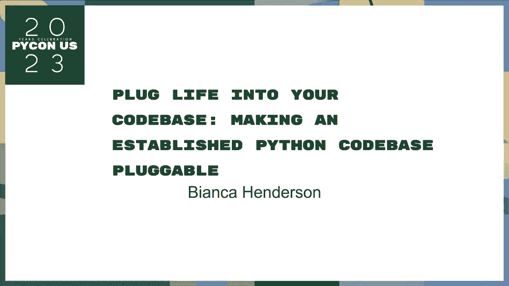
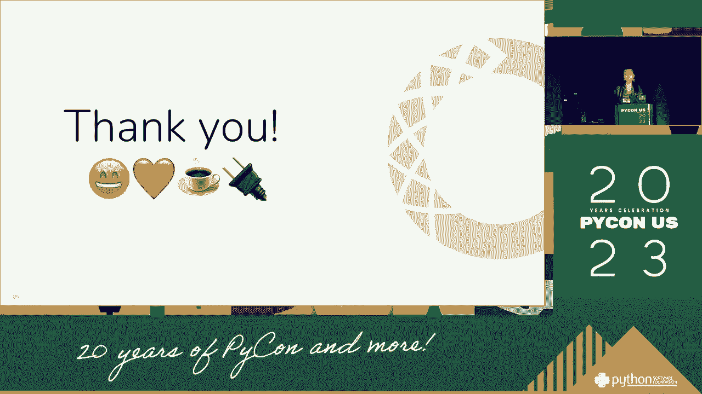
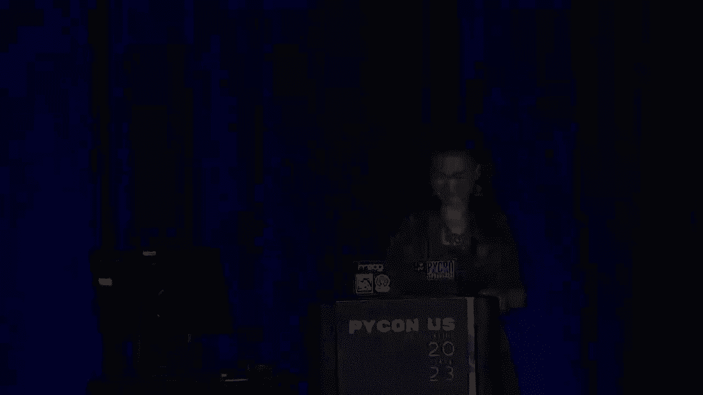

# PyCon US 2023 - P17：Talks - Bianca Henderson_ Plug life into your codebase_ Making established Pytho - VikingDen7 - BV1114y1o7c5

 My name is Daniel Thagnusman and this is my third title "Hulk"。 I only hear the word "is there"。

 I'm only here to get loose。 I'm not an English but I'm only here because it's probably more than this。

 In this place we're going to do photos of our employees people。

 A top to be about the third of the place on the former。

 We're going into a real world example of talking into the division or its final and schedule。

 I'll cover different reasons for implementing tables and you'll get the one that's going to be。

 considered as。 Next presentation is you don't have a mix of technical and non-technical tables。

 Hopefully it's accessible for everyone， no matter what your level of expectations for teachers or technical development in general。

 I'm just going to post my point on the point of view。 That's where I'm going。

 We can evaluate for now the main token and the 23 report which contains this token。

 It will be located where I'm going to cover。 Anyway， before I start。

 I work as a developer and I want to implement the token line and the tool line on the instance in the lower screen for openpoints for both the people。

 I am 100% of thought。 I work on answering from the one on the instance。 I have one for myself。

 Maybe even 20。 So if you're going to find the right points and you're going to get all the other support I've disabled。

 please cancel the line。 I don't have to put this criteria to give knowledge from this presentation。

 The family's team， the practice for it。 I don't want to know more about the audience members。

 Anyone who wants to learn about payment， not or pay view。

 And folks who maintain a token of support here and folks who are exploring their implications for quality。

 So for my own curiosity， I'm wondering， what is your name that you've written in public？

 Who here has developed software that supports programs？ I'm not learning anything。

 How many of you have to hear about specific credit ideas that you want to implement？ All right。

 so that's it。 What are common？ First， there's a quote that's you've just said before。

 It is the first number of users of an， online。 That's right。 So， how is it related to that？ Well。

 the reality of software is whenever anything changes， sometimes people。

 but these are portion of the users。 This is what always was talking about。

 The data is helping them to write a program and then， because it's more difficult to use it。

 Before we get into some more technical books， I'd like to explain what programs are and what they use in an analogy。

 What's going on in the next class？ I'm learning a lot of the things。 There's a variety of them。

 and a fully-ambuted panel， that's also livable， and it's very simple to use。

 What is the resonant of this pipeline， but how do you go all the way out to a coffee shop？

 The problem is， this is all of this。 Well， the wrong way to get things out。

 you would be able to build a formula to a coffee shop。

 That provided electricity and plumbing for food， for our solution。

 and it still applies to coffee grains out。 However。

 we're talking about how to implement and make it easier for us to use them。

 So what if we started with a protein and over-powered coffee-making program。

 we just record the whole， which is in your coffee。

 into what the resonant can plug in and coffee-making。 And so。

 now we're able to build a coffee without leaving it to step out of the house。

 and the resonant can be vaccinated to a health content。

 but that maybe it can stop the phone or the phone to the network。

 Hopefully you all enjoyed this video。 So in this analogy， it houses the cold days。

 The need for coffee is a missing feature， provided by users of our co-bays。

 while the electrical outlet for the company is full-on。

 and the coffee-making balance is the actual cabinet stock。

 The coffee-making or the complicated coffee-making is the equivalent of performing or users' specific needs。

 but recently the form you think of it， like for our kind of expensive and innocent family。

 Following the problems of our programs is a much more sustainable and reasonable solution than we can tell the two-on。

 table。 According to the software labels， the use of different documents can take for upgrades to better ones。

 All around the software， the more affordable way to keep the table in-world with a primary-tech coffee。

 compared to a passionate permanent industrial coffee-making function。 So。

 let's recap what programs are for our daily work。 The build-house noises from our computer sometimes called "expendations"。

 We can be split to the part of our co-bays that they want us to be。

 We can be plugged into the online room， and distributed。 In。

 we take the poster of the comment you know about the most programs。

 because the program is probably more than the one that we ever created from。

 One of the journal that here is that most programs can operate in the co-bays to programs。

 but programs don't easily operate separately in the co-bays。 It's almost very easy。

 but you can solve any of the programs that are， important for example， for example。

 for your daily life。 And then， for the college， I work for the families， I work for the board。

 and you play with us for more。 Now， what probably recognizes these workers is that the ones that are very much co-b。

 are out and users that they pass against the tools can't get significant things。

 We also enforce the cooperation of the program。 What I mean now is that each component of the first program can become more marginalized。

 in that it can increase freedom to improve our code and then demonstrate forward to many people。

 Our government is not only the collaboration of our co-bays。

 but it's also called as "proposable people"， where we can also not go。

 We can also use the tools that are used in such as all specific functions。 And then， in general。

 we can improve the user's plans for the whole program。

 There are few people in particular in that fundamental concept for all of the government in the future。

 Discovery， the small writing application can find out what the programs are doing。

 To discover a program， the software needs to look in specific places and know what they look for。

 Registration is how a program is also for those programs to hold and available to do work。

 Holdings can attack themselves for the whole program that the institution has made。

 There's no cost in its own， but it wants to know what the program is and to participate in a program that's used in the program。

 Online， exposure to the program that I've made to the program is the way that any available program can make themselves available to that person。

 We're going to get into a general overview of all of these files with specific plugin framework for funding。

 so that we can see how the available space is implemented in such a specific program。 First。

 the plugin is a plugin framework， and the report can be used in this program。

 It provides a system that the most prevalent in the music plays with the program。

 so if you're caught， it allows you to apply exposure in the previous slide。

 It allows you to apply a project like Pultra， which will be on in this program。

 and to the few programs over in the past four， it's a very popular library， so it's a chain program。

 It's also got a code， and you can straightforward， but it's not a code。

 Let's cover the basics of how to use the plugin。 The part is a post-program。

 That's the Python code base that you want to make sure that it works。 Then， you have a plugin。

 which is an executable program that you want to enable to be a source program。

 So you can select this， and by using the specific version。

 to define all spin-in quotes provided by the host program， in other words。

 49-29-9-9-9-9-9-9-9-9-9-9-9-9。 Along with HOPE_CTULAN's easement provided by the host of HOPE_CTULAN。

 with HOPE_CTULAN's plugin to that plugin。 To quote directly connected with HOPE_CTULAN。

 it goes on to the plugin to be created on the host's database。 So。

 what are some reasons why this plugin is wrong？ A little more typically。

 the library is going to modify the video code on libraries and programs。

 which will involve the library and the library on my content。 It can become problematic。

 and several pages might be participated in a variety of ways that you can make your program。

 And instead， the plugin is a much more useful to our users' work。

 to create a post-programming and its plugin。 If you have a good one to go to before。

 and programming， it's also more likely to decrease the knowledge that one container comes to the middle。

 Now， we speak up of systems in a full-time range， and one component of the software is distinct to a 15-inch list of performance of another component of the building and the model of them。

 This post-programming is on to the developers' presentation。

 performing the progress against each other。 Also， 20-inch for the main building with the domain is successfully published in the design area of the building。

 There has to be really intense knowledge about which one of those which really misses the rate in the hope of the implementation。

 In the case of this， the plugin can be listed as your framework for how to customize the post-programming and the world's site。

 regarding the site of functional projects for work load。 On the post-programming。

 implementation of plugins for your plugin and the post-programming is possible。

 or customize the post-programming and any context of specific needs for the post-programming and the input program。

 I'm just going to take a few walkie-brained examples， which is called a plugin。

 This example is called a plugin that is in the name of the plugin。

 This example is called a plugin that is in the name of the plugin。

 This is called a plugin that is in the name of the plugin。

 The plugin that is in the name of the plugin is called a plugin that is in the plugin。 Here。

 we define a particular feature。 In other words， a raw feature。 I'm going to give you my song。 So。

 for every plugin that is in the title， it's a quick question。 It's a very different plugin。

 It's nearly defined by a specific feature。 In other words， a raw feature。

 We also create a look in the context of the content and taste themes of the plugin we defined。

 This is called a name of the plugin。 The post-programming and post-programming are also called a name of the plugin。

 This is a name of the project's name of the plugin in the name of the plugin。 In this case。

 the name is the name of the plugin for the plugin， and the post-programming of the plugin。

 You're only going to see that a post-programming is defined as a name of the plugin。 In this case。

 it is also called a name of the plugin。 You can see that there are no one in the name of the plugin。

 Now， I'm moving along to the plugin and the plugin for the plugin to apply for the plugin。 Here。

 we see that what people can do， and they use to like the implementation of the example of a name of the plugin。

 Now， with the post-programming and post-programming。

 we must have the same name as the post-programming that created by the corresponding click to the application。

 This is what I'm doing here。 This is what is my work in my plugin。 This is my underscore-hook。

 and I'm always going to my work。 I'm not going to my work in my work。

 I'm going to make it a bit more confusing。 This is a long list。

 but how do I actually utilize this plugin？ We need to register for the plugin management。

 The plugin management is coming from six functions， but it's better to find out how to use it。

 This allows for multiple plugin managers to multiple tools that decide what's going on in each other。

 It's very often a place where there's plenty of this flow。 The hook， the helper， and hook。

 implement it for a bug in a file's nickname of the title。 The title is identical to a plugin。 So。

 that's what we're specifically doing here。 So， this is where I'm going to go。

 I'm going to take a moment。 And the hookbox， here， we are registering in this plugin， my plugin。

 that was defined in this plugin， or I'll make it a plugin。

 I'm going to go into my plugin function to continue to improve the plugin。

 And then I'm going to go into my work。 When we run this example file to our plugin。

 we're going to be just cool with this。 We're going to go into our plugin on the replay。

 And get to test the link， and then you can set the output of what the plugin is doing。

 which is adding the tools to our plugin。 And then we're going to show you where that was located。

 So， once it's done， you're going to get to the link， which is to go。

 And now we're going to go over a real life example。 That's where my plugin is going。

 which is pretty expensive。 And before we go into the detail， I'm going to go about coming in。

 And if you don't know， I'm going to be talking about an environment management discipline。

 It's an environment that only goes into my work。 It's also a workforce。 I'm going to install， run。

 to offer， and support services and a dependencies。

 It also creates loads of services between environments and a local computer。

 It's pretty familiar with the platform program， but it's actually a language address。

 It's really interesting to see how it works。 It's really interesting to see how it works。

 It's really interesting to see how it works。 It's really interesting to see how it works。

 And it's really interesting to see how it works。 And it's really interesting to see how it works。

 And it's really interesting to see how it works。 And it's really interesting to see how it works。

 And it's really interesting to see how it works。 And it's really interesting to see how it works。

 And it's really interesting to see how it works。 And it's really interesting to see how it works。

 And it's really interesting to see how it works。 And it's really interesting to see how it works。

 And it's really interesting to see how it works。 And it's really interesting to see how it works。

 And it's really interesting to see how it works。 And it's really interesting to see how it works。

 And it's really interesting to see how it works。 And it's really interesting to see how it works。

 And it's really interesting to see how it works。 And it's really interesting to see how it works。

 And it's really important to see how it works。 It's really important to see how it works。

 It's really important to see how it works。 It's really important to see how it works。

 It's really important to see how it works。 It's really important to see how it works。

 It's really important to see how it works。 It's really important to see how it works。

 It's really important to see how it works。 And it's really important to see how it works。

 And it's really important to see how it works。 And it's really important to see how it works。

 And it's really important to see how it works。 And it's really important to see how it works。

 And it's really important to see how it works。 And it's really important to see how it works。

 And it's really important to see how it works。 And it's really important to see how it works。

 And it's really important to see how it works。 And it's really important to see how it works。

 And it's really important to see how it works。 And it's really important to see how it works。

 And it's really important to see how it works。 And it's really important to see how it works。

 And it's really important to see how it works。 And it's really important to see how it works。

 And it's really important to see how it works。 And it's really important to see how it works。

 And it's really important to see how it works。 And it's really important to see how it works。

 And it's really important to see how it works。 And it's really important to see how it works。

 And it's really important to see how it works。 And it's really important to see how it works。

 And it's really important to see how it works。 And it's really important to see how it works。

 And it's really important to see how it works。 And it's really important to see how it works。

 And it's really important to see how it works。 And it's really important to see how it works。

 And it's really important to see how it works。 And it's really important to see how it works。

 And it's really important to see how it works。 And it's really important to see how it works。

 And it's really important to see how it works。 And it's really important to see how it works。

 And it's really important to see how it works。 And it's really important to see how it works。

 And it's really important to see how it works。 And it's really important to see how it works。

 And it's really important to see how it works。 And it's really important to see how it works。

 And it's really important to see how it works。 And it's really important to see how it works。

 And it's really important to see how it works。 And it's really important to see how it works。

 And it's really important to see how it works。 And it's really important to see how it works。

 And it's really important to see how it works。 And it's really important to see how it works。

 And it's really important to see how it works。 And it's really important to see how it works。

 And it's really important to see how it works。 And it's really important to see how it works。

 And it's really important to see how it works。 And it's really important to see how it works。

 And it's really important to see how it works。 And it's really important to see how it works。

 And it's really important to see how it works。 And it's really important to see how it works。

 And it's really important to see how it works。 And it's really important to see how it works。

 And it's really important to see how it works。 And it's really important to see how it works。

 And it's really important to see how it works。 And it's really important to see how it works。

 And it's really important to see how it works。 And it's really important to see how it works。

 And it's really important to see how it works。 And it's really important to see how it works。

 And it's really important to see how it works。 And it's really important to see how it works。

 And it's really important to see how it works。 And it's really important to see how it works。

 And it's really important to see how it works。 And it's really important to see how it works。

 And it's really important to see how it works。 And it's really important to see how it works。

 And it's really important to see how it works。 And it's really important to see how it works。

 And it's really important to see how it works。 And it's really important to see how it works。

 And it's really important to see how it works。 And it's really important to see how it works。

 And it's really important to see how it works。 And it's really important to see how it works。

 And it's really important to see how it works。 And it's really important to see how it works。

 And it's really important to see how it works。 And it's really important to see how it works。

 And it's really important to see how it works。 And it's really important to see how it works。

 And it's really important to see how it works。 And it's really important to see how it works。

 And it's really important to see how it works。 And it's really important to see how it works。

 And it's really important to see how it works。 And it's really important to see how it works。

 And it's really important to see how it works。 And it's really important to see how it works。

 And it's really important to see how it works。 And it's really important to see how it works。

 And it's really important to see how it works。 And it's really important to see how it works。

 And it's really important to see how it works。 And it's really important to see how it works。

 And it's really important to see how it works。 And it's really important to see how it works。

 And it's really important to see how it works。 And it's really important to see how it works。

 And it's really important to see how it works。 And it's really important to see how it works。

 And it's really important to see how it works。 And it's really important to see how it works。

 And it's really important to see how it works。 And it's really important to see how it works。

 And it's really important to see how it works。 And it's really important to see how it works。

 And it's really important to see how it works。 And it's really important to see how it works。

 And it's really important to see how it works。 And it's really important to see how it works。

 And it's really important to see how it works。 And it's really important to see how it works。

 And it's really important to see how it works。 And it's really important to see how it works。

 And it's really important to see how it works。 And it's really important to see how it works。

 And it's really important to see how it works。 And it's really important to see how it works。

 And it's really important to see how it works。 And it's really important to see how it works。

 And it's really important to see how it works。 And it's really important to see how it works。

 And it's really important to see how it works。 And it's really important to see how it works。

 And it's really important to see how it works。 And it's really important to see how it works。

 And it's really important to see how it works。 And it's really important to see how it works。

 And it's really important to see how it works。 And it's really important to see how it works。

 And it's really important to see how it works。 And it's really important to see how it works。

 And it's really important to see how it works。 And it's really important to see how it works。

 And it's really important to see how it works。 And it's really important to see how it works。

 And it's really important to see how it works。 And it's really important to see how it works。

 And it's really important to see how it works。 And it's really important to see how it works。

 And it's really important to see how it works。 And it's really important to see how it works。

 And it's really important to see how it works。 And it's really important to see how it works。

 And it's really important to see how it works。 And it's really important to see how it works。

 And it's really important to see how it works。 And it's really important to see how it works。

 And it's really important to see how it works。 And it's really important to see how it works。

 And it's really important to see how it works。 And it's really important to see how it works。

 And it's really important to see how it works。 And it's really important to see how it works。

 And it's really important to see how it works。 And it's really important to see how it works。

 And it's really important to see how it works。 And it's really important to see how it works。

 And it's really important to see how it works。 And it's really important to see how it works。

 And it's really important to see how it works。 And it's really important to see how it works。

 And it's really important to see how it works。 And it's really important to see how it works。

 And it's really important to see how it works。 And it's really important to see how it works。

 And it's really important to see how it works。 And it's really important to see how it works。

 And it's really important to see how it works。 And it's really important to see how it works。

 And it's really important to see how it works。 And it's really important to see how it works。

 And it's really important to see how it works。 And it's really important to see how it works。

 And it's really important to see how it works。 And it's really important to see how it works。

 And it's really important to see how it works。 And it's really important to see how it works。

 And it's really important to see how it works。 And it's really important to see how it works。

 And it's really important to see how it works。 And it's really important to see how it works。

 And it's really important to see how it works。 And it's really important to see how it works。

 And it's really important to see how it works。 And it's really important to see how it works。

 And it's really important to see how it works。 And it's really important to see how it works。

 And it's really important to see how it works。 And it's really important to see how it works。

 And it's really important to see how it works。 And it's really important to see how it works。

 And it's really important to see how it works。 And it's really important to see how it works。

 And it's really important to see how it works。 And it's really important to see how it works。

 And it's really important to see how it works。 And it's really important to see how it works。

 And it's really important to see how it works。 And it's really important to see how it works。

 And it's really important to see how it works。 And it's really important to see how it works。

 And it's really important to see how it works。 And it's really important to see how it works。

 And it's really important to see how it works。 And it's really important to see how it works。

 And it's really important to see how it works。 And it's really important to see how it works。

 And it's really important to see how it works。 And it's really important to see how it works。

 And it's really important to see how it works。 And it's really important to see how it works。

 And it's really important to see how it works。 And it's really important to see how it works。

 And it's really important to see how it works。 And it's really important to see how it works。

 And it's really important to see how it works。 And it's really important to see how it works。

 And it's really important to see how it works。 And it's really important to see how it works。

 And it's really important to see how it works。 And it's really important to see how it works。

 And it's really important to see how it works。 And it's really important to see how it works。

 And it's really important to see how it works。 And it's really important to see how it works。

 And it's really important to see how it works。 And it's really important to see how it works。

 And it's really important to see how it works。 And it's really important to see how it works。

 And it's really important to see how it works。 And it's really important to see how it works。

 And it's really important to see how it works。 And it's really important to see how it works。

 And it's really important to see how it works。 And it's really important to see how it works。

 And it's really important to see how it works。 And it's really important to see how it works。

 And it's really important to see how it works。 And it's really important to see how it works。

 And it's really important to see how it works。 And it's really important to see how it works。

 And it's really important to see how it works。 And it's really important to see how it works。

 And it's really important to see how it works。 And it's really important to see how it works。

 And it's really important to see how it works。 And it's really important to see how it works。

 And it's really important to see how it works。 And it's really important to see how it works。

 And it's really important to see how it works。 And it's really important to see how it works。

 And it's really important to see how it works。 And it's really important to see how it works。

 And it's really important to see how it works。 And it's really important to see how it works。

 And it's really important to see how it works。 And it's really important to see how it works。

 And it's really important to see how it works。 And it's really important to see how it works。

 And it's really important to see how it works。

 And it's really important to see how it works。 And it's really important to see how it works。

 And it's really important to see how it works。 And it's really important to see how it works。

 And it's really important to see how it works。 And it's really important to see how it works。

 And it's really important to see how it works。

