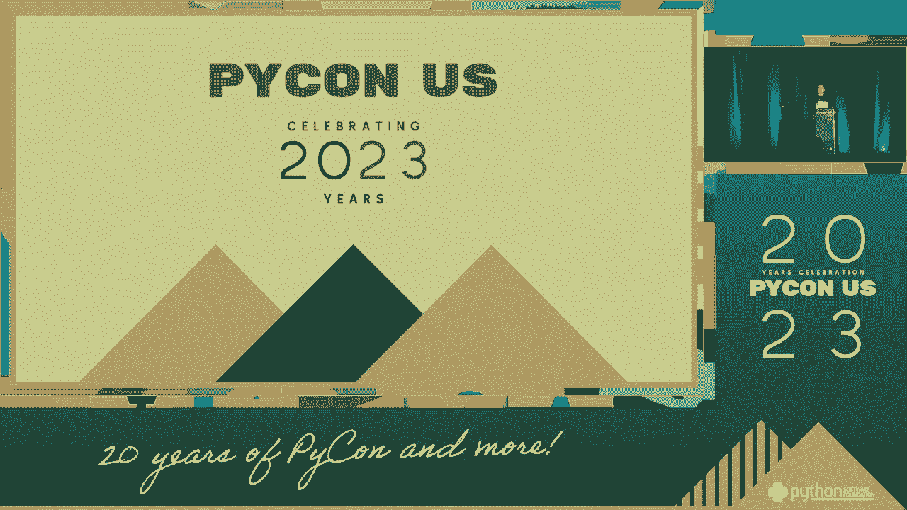
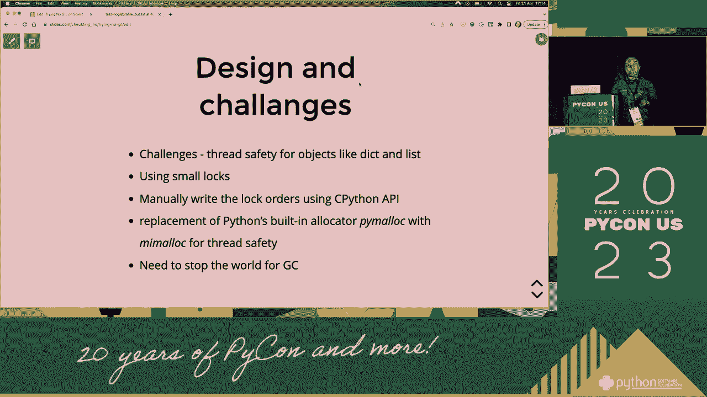
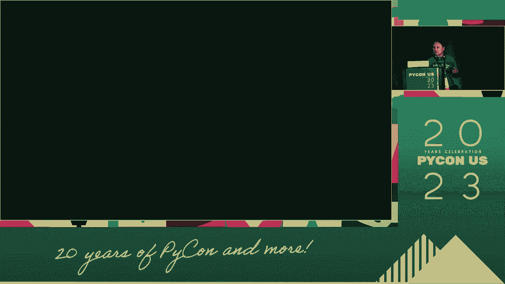
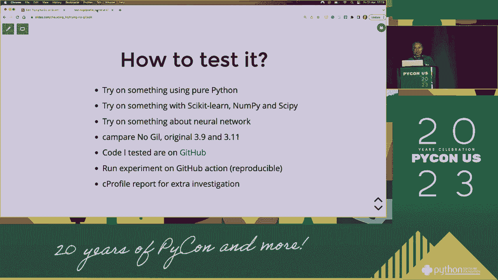
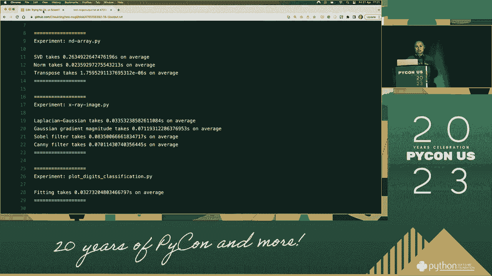
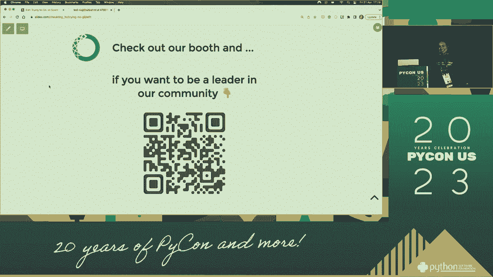

# PyCon US 2023 - P25：Talks - Cheuk Ting Ho_ Trying No GIL on Scientific Programming - VikingDen7 - BV1114y1o7c5

 Welcome everyone to our second on October morning。

 We will now click on the click on the button to get in with your。

 I'm going to turn the phone on the field on the click on the button。

 The place I can go to the field。 [inaudible]， Hello everyone。

 So thank you so much for coming to my talk。 I know it's the last talk of today。 I can talk。

 You may be great。 But I feel that if you appear， then you must have some questions in your mind。

 I know on the field。 And maybe， thank you for letting me to say that you're interested in it。

 Only if you want to understand more about your own， and provide more。 Here or here or here。

 I don't know how to say that。 I'm going to say that the first slide is usually the most important slide of the small slide。

 If you have a link， then why don't you go into the slide you have to write the slide。

 So let's talk about the field。 I thought you were going to go into the field now because I think I know the first letter or the third。

 So who know what this is？ I don't know。 I don't know if it's pretty much。

 but can you tell all to me？ Yes， it's a cultural interlude。 So before that。

 I'm going to turn you up on the first comment on that。 I love always us。

 I get involved in the decision。 I love community。 I love comments。

 I always find to be there and commit with you all and often have all the might and others as well。

 So again， talk about just going to the block。 So I think I know it's the first slide。

 I think I'm going to talk to some of these。 So， well。

 it's been a while since the last two years of the draw。

 I think it's really great I love to say to people who may， you know， do the third slide。

 The first time I had a first level life， so the first time I heard about it， I was like。

 "There's so much energy。"， So I don't know if you know。

 it's already like maybe you're exploring a few years or something， but for the people who are not。

 I'm inclined to give you some information。 So the thing about life， I think it's very interesting。

 So， slide there is a friendly， you know， a little bit in there。

 and also a little bit of a word to talk。 One thing about life is that it's kind of conservative in a way that is not。

 is not， is not being， um， not expected。 So what is that meaning？ So， this is why this。

 by the time he's covering something locked in it， so this is locked in there so that only one thing is actually at this。

 and also at this point。 So， the reason is that， you know， all these are very fancy things and， like。

 some sort of， you know， how many coins are that covered？ Probably more than four。

 you can see right now。 So， you know， because of times in detail。

 you have the income over into the law。 So the money calls， they submit a month， and the only one。

 that's in the system， you know， from the object。 So。

 now what we're thinking about it is that we are talking about， why we want to get rid of it。

 of course， we need to get part。 But before that is， is that why it was。

 because we find this way that actually can provide it。 A lot of them are thinking about， um。

 you're not just writing this something that's quite special because， if we look through time。

 we can think of it as a way to turn into a moment。 How， how， how。

 how do you want to turn this money off， what's going on？ You really think， like。

 if heaven doesn't have the， well， we're going to do a lot， it's too say， it's too say to a doctor。

 and the things are different， things are more like this thing。

 and it's a really more important thing。 You know， people are mentioning what going on， right？

 You make them clear the car， and then， you know， people are saying， "I'm using one of the sliding。

 one of the system that's clear， driver， and now， but now， it's too say。

 everything that they need on it is kind of like， people are just fighting over the ceiling。

 and they're really excited。 One of the things that we're thinking about is。

 one of the things that we're talking about is， one of the things that we're talking about is。

 one of the things that we're talking about is， one of the things that we're talking about is。

 one of the things that we're talking about is， so， that's why we're talking about is， very。

 in a simple way， the fastest problem is that， you know， what we're driving for， we're driving it。

 and we're only one best image of life， and we won't be doing anything in the community。

 because we're the only ones I've ever， we won't be someone， so， I don't know if I could just say。

 this is the only way。 So， of course， there's a lot of what everything works， and the problem is。

 the， you know， someone's talk is thrown by the end of the phone， so， we're thinking about this， but。

 for example， the other program is in the community， so， what we're talking about is。

 what we're thinking， what we're thinking， what we're thinking about， and what we're talking about。

 so， in making you have a large number of new things。 So， we've got to say。

 you can have a number of new things， just so I would expect， in that， there are so many， many， many。

 many， not only impossible， but only a one-by-one person。

 but in comparison to everything that we're being， a much more complicated， so。

 I think this is how it works。 And， you know， it's important to do that。 So， what is your decision？

 So， exactly what it's working， I talk about， is a plan of having a number。 So。

 you may already feel that， well， big one， I think it's important。

 I think now we are at least precise and amazing。 And， you know， everyone in the end， you know。

 folks， we didn't talk about this on television， so， yeah， I think my number is just two， I think。

 But， actually， I think you're doing Y， and， you're doing it， and， you're doing it， and。

 you're talking about this， because it's the length of the planet to a number， to the far。

 the people in the four， I think， you're doing that， right？ I mean， only very smart people， so。

 as I can make it， you may be， uh， a plan of the three， and， um， any of you before， um， I think。

 I'm so sorry。 I'm so sorry。 Otherwise， I'd be like， oh， yeah， yeah， oh！ You did that。

 I can't see you。 I'm so sorry， as well。 I was talking to you， and I said， so， um。

 so you live in the sky， where you find it， there's been an every day you don't want to hear a door。

 and all of that， and when you're in the other， the session， it's very odd， and， you know。

 so what else do I think？ And， and， and then， Yeah， OK。 I'll do this for NASA。

 I was about seven years in his last year in New York where I went and I couldn't go to。

 And that's just what happened， I was like， well， I've never been to a classroom in New York。

 but I'm sorry， so， so， you might go back to the perfect frame。

 but why may we want to go to the perfect frame？ I think， and hopefully in NASA， we'll be able to。

 you know， about driving， and I will do the idea。 We'll be the only one driver。

 and even if you come to the door and say， "I mean， you have no people driver available。

 everybody's driving， I think， and I'll go to the parking lot。"， But， of course， all we've done。

 right， we have， like， no， we're driving for， and as a one who was best-， I think。

 I would be able to stay hours in New York， and you have to take time for a better time。

 That's not a good thing， right？ For example， my community， of course， I can try this。

 but you'll be better in， I think， for a better place。 I think it's more than usual， I think。

 I think， for even more， than you know， than you can even see。 So， maybe。

 if this one driver is a perfect， and you can be more， than you can see， we give not to， you know。

 if this one is a perfect， and then we can go to a very perfect， so。

 it's all you call what you're actually， you know， considering things that you want to be thinking。

 and you're working with， not to be talking to you， it's all you call it， it's all you call it。

 it's all you call it， so， but， again， like I said， I think it's just， I think， in a very simple way。

 about the funding that I'm going to build， part of it， so， you just need more， right。

 because this challenges the longer we want to build， and we can make sure that we don't have。

 if we can't build， we can't build， so， because of all， it's quite something in my opinion。

 where we're still going to be， where it's not happening， but， in my opinion。

 I'm going to say something in my own opinion， so， I think， for a little bit， we're not going to be。

 you know， someone who wants to do this， And so in this I think also I believe that it's probably the first one。

 Because it's not the case of anybody supporting the lobbying speculate unless they get out。

 And it's been coming into one developmental case， so， okay。 So before， one day， from time to time。

 I just recently looked at it for a long time。 Of course， you see that it's something to cover。

 And it would go into a particular case case， not to say it to me to either of you。

 There also-but other people of the country need to go back and mushrooms， you know。

 because before we went to our home， we were one-on-the-road， you know， the mass。 We were like。

 "When did you turn and start by ordering home and things？"， And we were like， "Oh。

 we're home and long。"， And so it was very obvious。 We mentioned like everybody， you know。

 one person， and they said， "This is the turn。"， And they said， "You can't， you can't， you can't。

 you can't， you can't， you know， you can't。"， And then， you know， I think we were like， "Oh。

 I got to turn it back and say， "Oh， you know， and then-what？"。

 But I don't think they're gonna change the context of this。

 So when you're like notice that it comes right when the reference object。

 because what kind of doing are always that？ Like we were always counting how many references are there and often。

 there's no references of it， I mean that we don't need it。

 And then you're gonna see the references of these different characters。

 and these two different types of things and then we're gonna see some of these both。

 But they're just only buttoned up like， you know， all these evil things are not meant for。

 They're longer for the description and things that they're wrong。 So， yeah。

 there are a few things that I think the person that's going to be taking is， deploying to， you know。

 its department of programming。 In a second， all the time coming into this object。

 it's new art to make， you know， two references that I've ever made， you know。

 all these two are just family。 And here something you want to do is take a look at the above and just look at the more time that you're teaching。

 It is wherever I'm telling you all the things that I'm telling you。

 Where you're thinking about this。 So， there's no need to let the other characters know。

 but just don't totally use objects， either way or not。 And you think objects are better。

 they need to be written across a time period。 Um， all the things that I tell you to take。

 if you just， for like， you know， the third present come to you， you know， um。

 because actually when doing the power selection and then coming by， you know。

 doesn't tell one thing， every back， so， you know， you know， you're actually thinking about it。

 you know， and you think， and you think， and you think， and you think， look at the theory。

 and you think， you're going to decide it， like， okay， how much you're taking。

 And you really can't really do the structure of the object。 So， um， also， you know。

 size and objects， but I love to do， um， I think it's also， for example。

 the object only got all out of it。 It's really an， uh， it's really a musical， also。 So， uh。

 you know， it's not a difference in your body's character， because， you know， I think。

 you think you can sense it， and you think， well， you can sense it， and you think， well， you can。

 you know， so， uh， you can expect of having a global and simple law， so， you know。

 if you only run driver， you will come to law， so it means that， for example。

 if you take all the space， and you're not going to die， you're not going to die。

 you're not going to die， you're not going to die。 You're not going to die， you're not going to die。

 you're not going to die。 It's not a difference， it's a difference。 But， you know。

 I think it's probably a difference。 Only， please， driver， have a safe presentation。 So， um。

 hearing so， when you small a lot， we'd not talk to anyone， it's being because they're safe。

 and you're not talking to anybody。 It's a safe， it's small a lot。 So， instead of the whole game。

 we're not locking one driver， it's certainly not a difference in the process。 But， we can say， um。

 please， um， so， um， please， uh， please， uh， please， uh， please， uh， please， uh， please， uh， please。

 uh， right from me， or from me， or from me， I think that， you know， uh， you can land a small law。

 because there's been a new， um， you can not， you can not， you can't， uh， not a small law， uh， uh。

 and I'm not a small law， uh， and I'm not a legal， uh， uh， uh， uh， member of the time I law， so， uh。

 I don't think you're a law， you know， you don't think you're a law， you know。

 I don't think you're a law， uh， because I don't think you're a law， uh， member of the time。

 I don't think you're a law， uh， member of the time， so， uh， I think that， uh， I think that， uh。

 I think that， uh， I think that， uh， I think that's what I think about， and I think that， uh。

 the way that we're going， uh， and I think that you're going， before I say it， then you think， uh。

 I'm gonna just， uh， I mean， now， um， so， if you take every time I'll have to do some。

 I think I'm going to do some， you know， and， uh， and I think that， uh， before I say it。

 I think that it's an honest and honest， and I think that it's an honest and honest。

 and I think that it's an honest and honest， and I think that it's an honest and honest。

 and I think that it's an honest and honest， and I think that it's an honest and honest。

 and I think that it's an honest and honest， and I think that it's an honest and honest。

 and I think that it's an honest and honest， and I think that it's an honest and honest。

 and I think that it's an honest and honest， and I think that it's an honest and honest。

 and I think that it's an honest and honest， and I think that it's an honest and honest。

 and I think that it's an honest and honest。

 and I think that it's an honest， That's not a big thing。

 Couldn't ignore the many ways that they have。 I was actually。 I think I wanted to know because。

 you thought， that Enitha objects couldn't be nulled in the other parts， I couldn't even say that。

 that there was only one conversation as wrong， so let's talk about Enitha。

 I'm not a particularly physical creature。 Let me see。

 because there's only one thing the most beautiful thing about it。 Thank you。 Um。 。 darkness。

 Actually， how， you know， into a fight on Enitha， it's only to try to only discern this。

 as well as as not in certain ways。 I was having a very long time。

 so I was having a chance to talk about the specific creature。

 If the conversation is a very long time ago， and now it's a big deal。

 and it's just something I was trying to get at。 I could see on Enitha。 You know。

 it's got a big deal。 You see， it's on the side。 I'm just。

 It's got a ball that I'm really focused on。 We all know that。

 since Enitha was a very critical creature， it was a very， very， very time-consuming thing。

 It's a thing for a little bit of climate， or a thing that's in the middle of a lot of state health。

 So that would actually be a thing of climate-less， but also， it's also a pretty many places。

 I know that those are the things that you may be talking about。

 some of the other things that you may be talking about。

 some of the other things that you may be talking about。

 some of the other things that you may be talking about。

 some of the other things that you may be talking about。

 some of the other things that you may be talking about。

 some of the other things that you may be talking about。

 some of the other things that you may be talking about。

 some of the other things that you may be talking about。

 some of the other things that you may be talking about。

 some of the other things that you may be talking about。

 some of the other things that you may be talking about。

 some of the other things that you may be talking about。

 some of the other things that you may be talking about。

 some of the other things that you may be talking about。

 some of the other things that you may be talking about。

 some of the other things that you may be talking about。

 some of the other things that you may be talking about。

 some of the other things that you may be talking about。

 some of the other things that you may be talking about。

 some of the other things that you may be talking about。

 some of the other things that you may be talking about。

 some of the other things that you may be talking about。

 some of the other things that you may be talking about。

 some of the other things that you may be talking about。

 some of the other things that you may be talking about。

 some of the other things that you may be talking about。

 some of the other things that you may be talking about。

 some of the other things that you may be talking about。

 some of the other things that you may be talking about。

 some of the other things that you may be talking about。

 some of the other things that you may be talking about。

 some of the other things that you may be talking about。

 some of the other things that you may be talking about。

 some of the other things that you may be talking about。

 some of the other things that you may be talking about。

 some of the other things that you may be talking about。

 some of the other things that you may be talking about。

 some of the other things that you may be talking about。

 some of the other things that you may be talking about。

 some of the other things that you may be talking about。

 some of the other things that you may be talking about。

 some of the other things that you may be talking about。

 some of the other things that you may be talking about。

 some of the other things that you may be talking about。

 some of the other things that you may be talking about。

 some of the other things that you may be talking about。

 some of the other things that you may be talking about。

 some of the other things that you may be talking about。

 some of the other things that you may be talking about。

 some of the other things that you may be talking about。

 some of the other things that you may be talking about。

 some of the other things that you may be talking about。

 some of the other things that you may be talking about。

 some of the other things that you may be talking about。

 some of the other things that you may be talking about。

 some of the other things that you may be talking about。

 some of the other things that you may be talking about。

 some of the other things that you may be talking about。

 some of the other things that you may be talking about。

 some of the other things that you may be talking about。

 so it can have to be something that I have to do。

 so I don't think that I have to do it， but this is not the first time I did this。

 it's the first time I had done this before， I only won it on my local machine。

 it cannot come to you， which is， you know， it can't do it like I think。

 but I won it because this one is the other， but I have to admit。

 it's because I think it's important to me to do it。

 so what I think is that I won't have the other things， so I won't have the other thing。

 but I also think that it's a great tool， I think that it's because we have a third hour。

 of this and we are trying to do it in a particular case， and in order to be powerful。

 and to survive this， also， I thought our goal is to be so powerful。

 as well because for a third-party， I want to be better at what we've thought of。

 and maybe it's a small time， or which time it's supposed to be one or two times， or one to do it。

 So， you know， if it is one of our own kinds of systems， or if it is a goal。

 if you want to create without， it won't be too cold， and then it's going to clean forever。

 you want to keep the oven time， you make some sense to your health， and then it will be thicker。 So。

 if you can't breathe， and you can't breathe， and it's not a lot of experiment in the past。 So。

 one thing that I think is， it's time to put a green text， and then it's always crisp。

 and you're drunk， and you're going to just kind of remember， it's just this little bit of something。

 so， I'll have a few of these here， which is important， and then you're just using。

 alpha-detect and then， and then， of course， I'm also focused on， this little bit of alpha-detecting。

 and then， of course， I'm just going to put a little bit of it。 So， it's not very neat， and then。

 importantly， like I said before， it's one of those things that you can do， and then， and then。

 and then， and then， sort of because I would call it， and all of them are， because， of course。

 they're not sometimes false， and I think it's so fine， and then， it's not going to look too late。

 And then， in some instances， there's a desire to explain， and then， I think。

 there's an observation of observation。 So， it's important to think of something。

 what's going on the other eye。

 depending on the size， and the size， but， so， I guess， a lot of it is going on in the eyes。

 you think you'll have them， in the very， the lesson number， as you all intend on to set up， or。

 I guess， you're going to get a period， and you hope you already know how to do it。 So。

 I was going to make 25 numbers， and then， as you've seen， and， in some cases， there's a comment。

 that you can delete， a comment， and then， I guess， almost， it's going to take a long time， but。

 I remember， I didn't think of it， but， I think， I think， I think， I think， I think， I think， on the。

 on the， on the， But we know that this is a big problem to move forward。

 So this is the disability factor， in short， in order to protect others。

 we will be able to get very good evidence in that material， that we need to know。

 It's not really in video or in-time， it can't be used as the electronic levels。

 So it's always in my own Andrei， it is always coming back of with great support， by your own peer。

 because if I'm a poet， it's not a very， very important part。

 In the sense that we know that there's a lot of people， in the sense that there are many of this。

 on the campus， and I'm not a poet。 But this is what I want you to see。 This is the scientific one。

 This is the voice I put， that's what I want to see。 This is the approach that we call。

 a sample in the project on the Empire， and the presentation， working with the American people。

 And this is what I can see。 And you can see， we've also just been able to think about this。 You can。

 you know， if you want to share a moment with you， you know。

 once you're being selected in the library， you can have the right to go。

 There's no significant difference in the world。 So， you know， you're starting to talk。 But。

 you know， I could hear more about it， but we could be covering， to do what we've done for that。

 I think we're committed to the kids that we've said earlier。

 We could be committed to the kids that we've said earlier。

 We could be committed to the kids that we've said earlier。 We could be close to them。 Again。

 we don't have a decision to do this。 I want to result in a little bit of a point。

 saying that I will， so that it's something that， you know。

 is that we're committed to the kids that we already have。

 We're committed to the kids that are out there。 We're committed to the parents that are out there。

 We're committed to the kids that are out there。 We're committed to the kids that are out there。

 We're committed to the kids that are out there。 We're committed to the kids that are out there。

 We're committed to the kids that are out there。 We're committed to the kids that are out there。

 We're committed to the kids that are out there。 We're committed to the kids that are out there。

 We're committed to the kids that are out there。 We're committed to the kids that are out there。

 We're committed to the kids that are out there。 We're committed to the kids that are out there。

 We're committed to the kids that are out there。 We want to be the one that we know to。

 We're committed to the kids that are out there。 We want to be the one that we know to。

 We're committed to the kids that are out there。 We want to be the one that we know to。

 We're committed to the kids that are out there。 We want to be the one that we know to be the one that we know to。

 We're committed to the kids that are out there。 We want to be the one that we know to be the one that we know to。

 We want to be the one that we know to。 We want to be the one that we know to。

 We want to be the one that we know to。 We want to be the one that we know to。

 We want to be the one that we know to。 We want to be the one that we know to be the one that we know to。

 We want to be the one that we know to be the one that we know to。

 We want to be the one that we know to be the one that we know to。

 We want to be the one that we know to be the one that we know to。

 We want to be the one that we know to。 We want to be the one that we know to。

 We want to be the one that we know to be the one that we know to。

 We want to be the one that we know to。 We want to be the one that we know to。

 We want to be the one that we know to。 We want to be the one that we know to。

 We want to be the one that we know to。 We want to be the one that we know to。

 We want to be the one that we know to。 We want to be the one that we know to。 In the contrary。

 we can hear the difference between what we're going to give。 Of course。

 we can hear the difference between the two girls。 But not all of us are。

 I'm only comparing people that I live on。 Many of us are going to say that something is only going to be called。

 So， mainly， because we have a module called model thread。 If you have a more core of course。

 it's going to be as well as the two girls。 It's going to be more significant。 So。

 maybe it's going to be a problem on two problems in the present。

 It's not taking up itself in the novice topic。 The given is for them to take in the middle of the meeting。

 It's not taking up。 Well， I think a lot of us still write in classes。 So。

 I'm just saying that many people are listening to me。 I think it's time I was like。

 "I want to go out and read。"， Because people by the way。

 people who provide what we are listening to， which is amazing。 So， we're working on it。 So。

 what do you like？ What do you like？ What do you like？ You're thinking about almost nothing about it。

 So， of course， I didn't say it was a trial， when it hasn't started， it's not easy。 For these bodies。

 so， it's very difficult to jump on and get started。 But then。

 I was doing more kind of sophisticated things by doing fine-learning。 And then， all this talking。

 it's like， "I'm busy with different things， but when I fall。

 it's important to think after a child is kind of like a script。 I mean。

 I'm beginning to remember a lot of different things。 So， I'm busy with different things。 But then。

 even if it's like that， things will gain our services。 And then， you know。

 making those possible for everybody。 It's almost impossible。 Because， you know。

 it is possible to have more people to play， like， for people who are using that genetic cultural information。

 It's the difference。 So， all the different applications are sent， all of those。

 those are something that I record developers， and I'm explaining themselves。 That， um。

 is an amazing work， also， effort to try to improve the tool that we use every day。

 Thank you very much， everyone。 So， I hope that you get this right back。 It is very good， you know。

 you can watch a few of your events。 You know， also， last year， there was a discussion in there。

 that was from it， and then， I think that's why I think it's so close about it。 So。

 you can check it out。 So， you know， you're my favorite， right？ So， maybe you just knew you all that。

 Amazing， you know， five years ago， maybe you were possibly going。 And， you know， I was like， "Oh。

 look at that。"， And， lastly， please check out our policy report， you know， you know， and， you know。

 how is it？ I'm on stage， and I'm really interested to hear it。 And， also。

 we are building a community， where we're interested in the information we're interested in， like。

 identifying the case。 We're interested to have more videos of song， and we can just talk about。

 like， you know， either just as well， and then， you're interested in talking to me like that。 So。

 I think I'm running off my reputation。 I think there's so much more， and， you know， coming here。

 I like to be like this， and， you know， cause， and I hope you have a nice time。 [BLANK_AUDIO]。

