# P26：Talks - Christopher Ariza_ Building NumPy Arrays from CSV Files, Faster than Pan - VikingDen7 - BV1114y1o7c5

 Good afternoon everyone。 Thank you so much for joining me today's show。
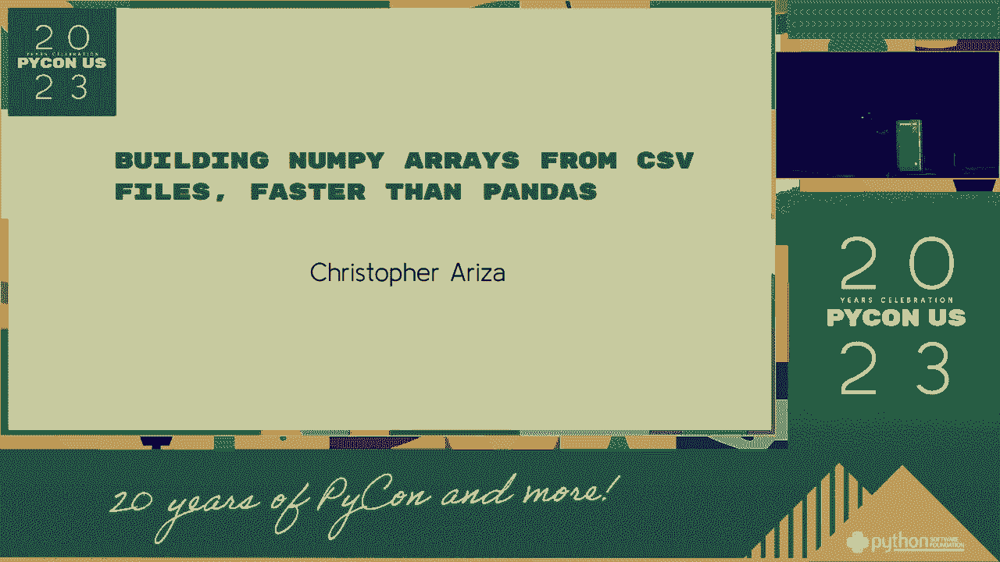

 So a little bit about the need to show the good started。 I am Chief Technology Officer at。 RUSCA-CADER， Finance Plan， where I created an important health under。 I've been partnering。

 Python since 2000 and back then I was working my team team in the coffee museum in the middle。 of the audience， a professor of music technology。 I don't think I'm going to work at the。

 time for algorithmic composition and competition in musicology。 In 2012 however， I've been。 meeting the Python to build financial systems and that worked for me to build a site of training。

 a pretty good site in the library built on an immutable data model。 So we're all here。 this week to build in 20 years of playcom， right？ Well I'm still building something。

 slightly different。 20 years of students in the parking and Python， all of you are， there as well。 right？ Well it turned out in 2000， 20 years ago， Python 2。3 was reading。

 which included the very first time the student-led computer in the standard library and in that。 was a function called the student-in-。

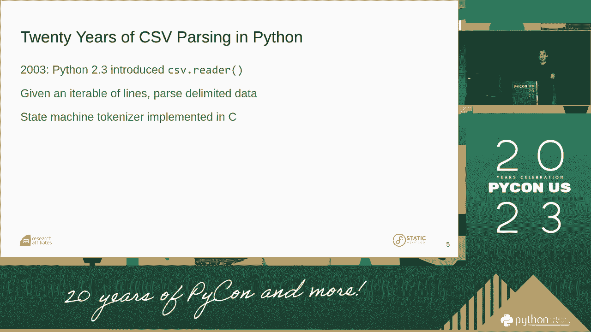

 code right here。 And this is that core student-in-the- token I did。 the function called part-process star and then it's small。 And what this function。

 does is process one character at a time with a giant switch that we've been controlling， the state。 We all know we're seeing a rise behind giant switch screen。 But the student-in-the-。

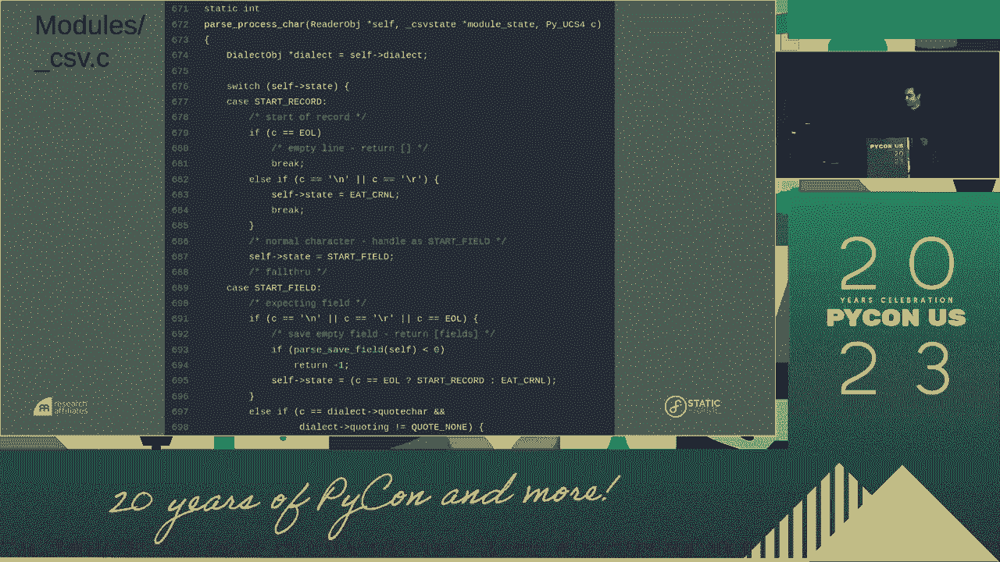

 code is very efficient because it is too poor and it's configurable for a wide range of。 conditions in data。 So a basic reason you can take a scenario wrapping up screen that is。

 representing the online and you can see that's good。 There is no good back-end reader in。 it and we can do that through the list and we can get as nicely parked out as well from。

 the building。 Now really the speaker of this new video is a highly conceivable。 So here。 I did it across the internet， across in a state character， across the whole character。

 and I always knew it possible to be an anarchist as expected。 Now this new video didn't do everything。 It returns across the road， not common。

 and it's a real and convenient column of data， by column。 So this new video doesn't help us with the detection of the present per column。

 which is something useful， nor do we continue to follow their collections already。 Since， 2018。 the middle of the last 10 years， 10 years and no time to teach a little bit of it have。

 offered from a planter。 Now panders and Indian peers and youth does automatic take to take。 the government per column。 It has full support for CSU readers， die-electrics and disability。

 And it has been a very good performance。 I often think that the early growth of panders。 will be a large part of the unit and the effort to form it with CSU readers。 However， not all。

 the types of support that provide their school。 There's no support for unit programs。 All。 strings are broad and as high objects and non-high objects are raised。 And there's no。

 support for big time， big time， big time， big time。 No time has a full range of big time。 54 units to allow you to specify the unit of big time。 But panders really less to bring。

 everything in as an action。 Now non-high office and offices， non-high- high- high- high- high。 functions and road tech and wellness and tech doesn't seem to have been。 We can support。

 all of the high-time types and high-time systems for units。 And entry road tech， for example。 works well but doesn't look to support if it takes to make and doesn't do any automatic。

 type of service。 And entry road tech does do automatic type of service。 So we have a。 mixture of functions here。 Genflow tech also doesn't make a specific performance at scale。

 And I show example of that right now。 So in trying to come up with a solution to this。 and start it by， which I stuck together keeping between some kind of a model。 So I need to。

 be a leader for handling code of the state characters and that gave me an iterative that。 I've been setting to gain some text to do my type of discovery and every creation。 And， this。

 as you might expect， has fairly poor performance as well。 And this is what needs。 to create a new recommendation called derivative to the grades。

 We support full-dylist configuration， from the community leader to support all non-high-time types and can use optional type discovery。 for columns with performance largely better than time to increase CSEs。 And we'll continue。

 to get rid of them。 So today we're going to talk about some of the challenges building。 the columnar array from CSEs， who work in depth as a implementation of the data to， the grades。

 And even with the performance playing， we can talk about CSEs and things。 Now。 for these presentations， I'm going to give a lot of diagrams and flow charts to try。

 to show you what's going on in these underlines in terms of the necessary results。 And it's。 very verbal and it won't sit on the slide here at all。 So we're not going to do a lot of， diagrams。

 In this diagram， I'm going to try to isolate the purest genotype and genes from。 those that involve pie objects。 And you call pie objects。 And this is pie objects。 So we're。

 going to think about this。 Now， you'll have to understand this right now。 We're going to。 come back to this。 But everyone even noticed the purple and the white boxes。 The purple。

 boxes were interesting in the pie objects。 The white boxes were really only with purest， genotype。 And they were doing this seriously type and get the best performance。 And you can， see right here。

 this little group all from type sets， all from this performance。 And in， fact。 you can even not hear the deal on the things like that。 Okay。 So all of them probably。

 dealt with this and filed at one point。 And they really are still a necessary result。 They are doing a little bit of grading and they're widely re-instant for it。 But they're almost。

 always growers and binaries that might such a parcalian or an incision in a many others。 There is no standard way of encoding a meditate or a gene that he has a gene， which means it's。

 going to be very difficult to work with。 So when we're trying to build a way in front of， the gene。 we cannot know the number of columns or rows in advance。 If we can't have a file。

 we can't know this in advance。 The test per column， further， is not encoding in the file。 There is no idea what a gene is filed。 So in general， it takes two full iterations and。

 get everything into the way。 First， we have to load the unicorn data into some sort of。 a dynamic array per column。 And we can also discover the type of the gene that。 And we。

 want to know the size and type so we can keep first the skills to value and load the。 manner of the gene。 And it's very hard to do。 All right。 So the moment of the program is。

 a key to taking into the interval of the test。 You can find it on GitHub。 And we have this。 E-type on and done by CVI。 And also I want to call out a hypothesis for helping you do。

 extensive proper intelligence in teaching functions when dealing with arbitrary and。 superficial ways to help you get to a good solid implementation。 So I need heavy。

 use of the solution to read on this implementation。 So I took that， and I think we've seen it。 in a tokenizer code and re-purplered。 By doing so， I was able to keep all of the。

 dialects and figurations often that are present in the standard library。 Now。 I mentioned that instead of the Python performance， there are people which wire， not using client。

 we can put a few of them for the client that would get saved by client， for the client。 But if you want to be accepted in that， you need to deal with C-type。 Now。

 client objects incur overhead， even when you're working in C。 You have to be typed。 in air-setting and you have to manage our resting plan。 So there is overheads， only。

 deal with client objects that you don't have when you deal with C-type。 But you're a portion of this。 I'm just going to tell you how not to do it。

 because you can kind of avoid it。 And you can take the GIS window and create client objects。 and then you can see how the C-type is changed。 You can convert those things to client objects down。

 you can expose them into， the GIS window to create a client。 And you can copy those clients into。 non-pilot arrays。 Now， you can do this in a word， but it's been telling you to。

 under-care into the year in client objects and those become a shanker。 Furthermore， if not。 really what we want to do。 We don't have to raise our arrays in place。

 What we want to do is we want to， install the GIS code to the C-type and get all of these clients。
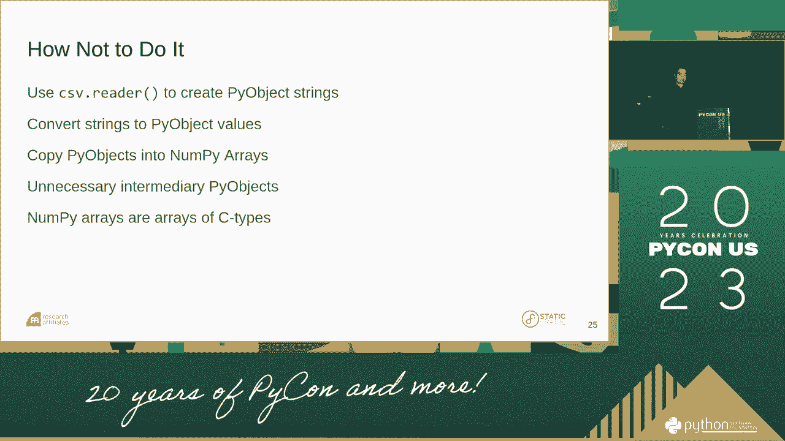

 So we go back to the thing that you can do as a general understanding library。 As I do。 I have to sign up for this ad and figure out how to send work and share this， a while。 And so。

 I can notice that these two key functions that are being called， as a process into character。 One function is part and add part。 It is starting through the first thing in the very state of the German。

 yes， it's the character we could keep。 And then there's part to the team。 We just want to continue to continue。 We're done。 We want to close the team。

 and we're ready to move on。 So that's the inside of the GIS。 We can continue to function very well with rises， allowing them to extend。

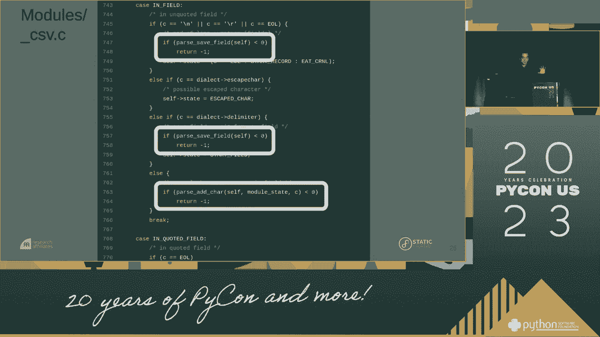

 a new purpose as to what I need to do。 So this is how to do it。 We need to have to continue to continue to continue to continue to move on。

 And we will change those two functions with different functions that will allow us。 to attend the point and attend an offset and then also find out a little bit。

 We store characters per column， now by run now， per column， into dynamic communities。 And then we convert both columns to GIS and C-type。 And then in this end， into the non-tyre range。

 it's a buffer。 It can be all without involving an entire object。 Another thing to make me a new entire object is that you have to create an experience。

 into a directory from a new code to a new color and color。 So， keep it to function。 And you can use it if you are very confused。 So give it an iterator of lines and return a list of one new non-tyre range。

 All the arguments for dialects and figurations are inherited from the C-a-g。 and we can also argue that for per column， definition， and a case of an assumption。

 that it solves and problems in writing and doing it with the second thing。 For example。 to specify G-type， you can consider it in type 4， but if you want to specify G-type。

 you can give it a function that's within a solution which determines the entire object in the driver's name。 Similarly， if you want to specify a solution that's within a solution。

 you can tell it's in type in the driver's name。 Similarly。 if you want to specify a solution that's function， you can call it a solution。

 and you can give a function to the line for that parameter which is given a column。 to the standard of the function。 So， look at the data you can use as a result of this function。

 which is a very simple case。 I'm giving it a list of names representing record of lines。 which is using an open file or any other iterator of records。 And we start off with two records。

 and we see that the div back three arrays， one-point column。 are the integers and the arrays in a row of names and a array of one-character of new codes。

 We see the types have been marked and determined for us， which is very nice。 A slightly more involved example was the more configuration。

 Here we provide a custom divinitor and provide a function to make sure that everything that's in the first column comes in as a sign。 and then we provide a second function for lines that's just between the third column。

 And we see now we get back two arrays， and we see that our booleans are not converted to boolean。 but that's what this is written。 This is what this is written in the name。 Okay。

 I wrote this piece of the predicate， and it's perfectly useful on their own。 It can be called a new code for a non-type。 But instead of friends。

 all the constructors just call this one the new， so some divinitor， the function is new。 the function is new， still call this one the new code， still the non-pyro-based domain。

 and then package that into the new code for a new code。 And then we have a configuration that stands within static random， actually opening the file。

 so I don't put that into limited ways， and you can do that in static。 And it's perfectly in different columns。 All of that is encapsulated within static random constructors。

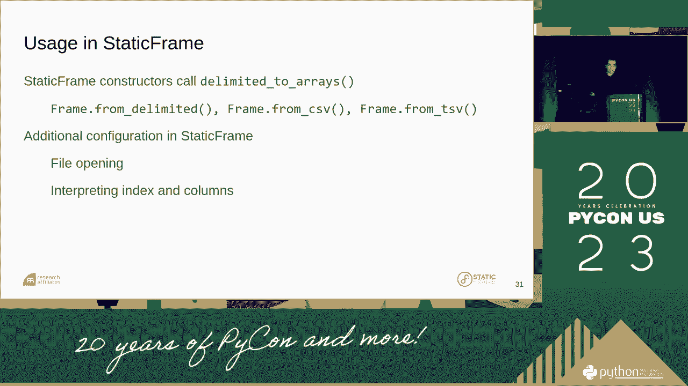

 Okay， let's begin to the implementation。
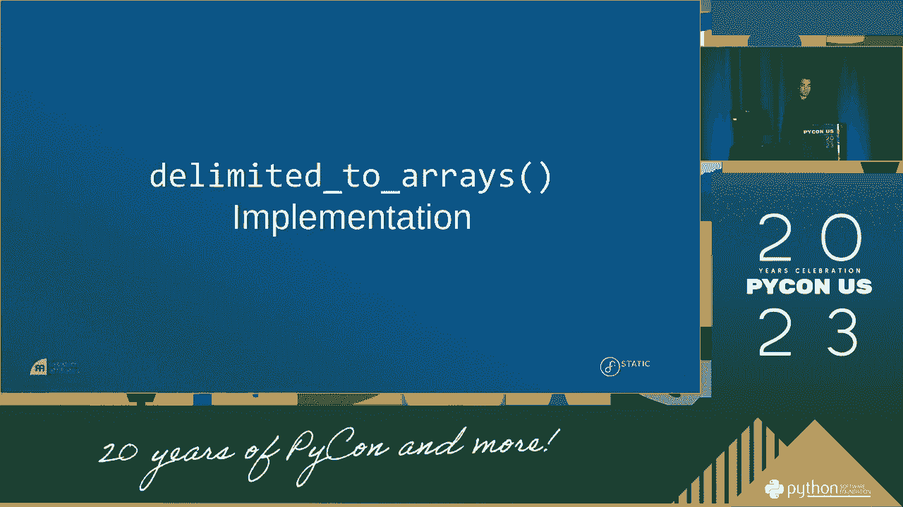

 So the three things we see three things in the first。 but underline how this framework is what the divinitor's rendered， what I call a code point run。

 and what I call a code point grid。 Now， I'll refer to this sometimes in CPT。 Now。 I need to turn code points into a refers to the unified unit code character。

 which is called a character， which is called in CPT。 In CPT I'm using the type using the four type coordinates， which is a four byte unit code character。

 In particular， this is not a type object。 This is a simple CPT。 but it has a convenient area in the CPT line of CPT。 So we'll start with the individual。

 The divinitor is a dependent parameter to the content of the CPT。 And it just iterates over the reference frame。 It calls the CPT type on CPT， which is a type on CPT。

 which is a type on CPT， which is a type on CPT。 And it shows that once per record。 And then it costs the field per record， which costs a CPT character one of the times。

 calling them same functions for adding characters and completing CPT。 All the while to cut field。 column， and row conditions， so we always have the context of where we are in the file。 Now。

 the code point line scores unit or data per column。 This is what we're going to use to collect our characters as we're moving into the file。

 And it's basically on the area of screen array data structure。 So we have to dynamically allocate a view array to each side of the structure。 One of them。

 you call it buffer， is just a few array of new character characters。 And it's going to store continuous characters without no container。

 So it's going to be maximum in the content。 Now the second array also contains the information from there。 This stores the offset or the size of the field。 And separated the thing into two arrays。

 Once the field is fully loaded， you can then go to the field per offset。 and convert those fields to a control。 If you dive in there with a little traumatic。

 you've got to help you understand what the code points are going to be。 These two characters will write three horizontal blocks。

 It will represent the tension of a dynamically allocated array。 And we think we have one array of a buffer and another array of offset。

 And we can unpack this by looking at the offset。 We've seen the first field is three characters that's read。 The second field is five characters that's read。 And the third field is four characters that's read。

 And the code point is really where the third， size。 and intensity between the limited reader and the student。 First。

 dynamically created a copy of the NCO， that's really the public entity。 And it exposes you to functions that we call a game that's seen in total。

 We're attending either a point or we're attending an offset。 And again。 the limited reader knows where we are in the file。

 so we know which column which NCO to copy those as we move through the file。 So the return is a game dive in， which is a code point where it surrounds and contains one or more code point welcome。

 All right， so let's go to the next slide。 We'll just go ahead and ask these copies of these changes。 How do we need to learn how they can get to a final result？ So we first， use our input。

 Our input is simply an iterator of records。 It can be a file， it can be an array of experiments。 Next， we initialize the limited reader and the code point break。 Now we're ready to。

 in our first iteration， use the NCO to file a load up our code point welcome。 So in this short part。 I'll start over to discuss how that works。 So we start a couple of boxes here， a pie on this。

 an iterator of code， we need that to get the underlying UCO to array。 and we can v-set our code right through a number， and we're ready to iterate through an array of code points。

 So as you iterate through code points， that's just fine with the bottom there。 But as you see。 iterate through code points， we say， is it a good number or not？ If it's not a good number。

 then we need to iterate through a point， and if you can prevent this new number。 If you iterate through the middle， then you know we're done with the field。 We can attend an offset。

 and we can implement this new number in a new state。 This new number。 Then when we're done with that character， we go on， and say， we'll give you have more characters。

 and we'll use the field， until we're done with this record。 Now again。 notice that the field here has no file， but really capable of getting the performance sizes。

 Finally， we are done with the delegate record， and going and working with the record count。 and you can see if we have any more records， and then we go back and we need to keep the whole process again。

 We've completed our first iteration， two of the elements of what we're trying to represent here。 Now we're ready to essentially go to the middle again， but we know all the middle records。

 we know all the middle to the middle of the middle。 Now everything is loaded in our code point line。 and we're ready to convert those two arrays to the middle of our final output。

 which is going to be a little bit of a super rate。 So this whole。 the different part shows that special iteration is going to be done。

 We're going to start with the CCL。 We're going to walk into the code point line。 and then the next step is we need to complete our NumPy array。

 that we're going to ultimately deliver back to the power。 To do that。 you can see all the size and the type。 We know the size， because the CCL is already loaded。

 and the text might come from the type processor， or it might come from the G-Brings provided by the argument。 Once we have that， we can complete our NumPy array。

 and it would be a complete array of some kind of array， in which we can pull off the other line。 and do the buffer。 And so we're done with purple boxes。 We have no after this step。

 we can put aside our high objects， and we can focus on just doing the secure C-type。 Now in this case， we're going to grab the next offset。

 We're going to use an offset to bring the sum of our unit code code points。 so we can convert those two into the type， and we're going to insert that C-type directly into our NumPy array。

 And then we can continue to do that in every unit。 and we can do that all without any interaction with the high objects。 Finally， already done。

 we need to attend that array to a list， and then we can interact with the high objects。 and we go on and consider here more C-to-do-l as the process。

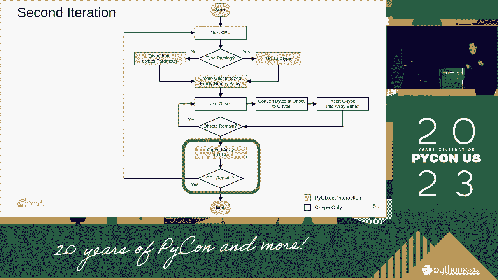

 and we can take the type of data。 So as the addition performance， we just need a critical。
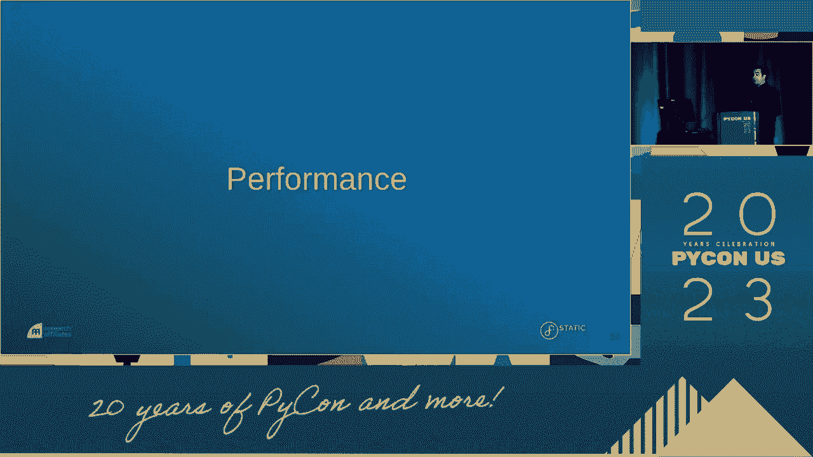

 and that is the main goal of the C-to-do-l as we said we have completed。 So we're going to get a number of questions。 Now the way I've seen benchmarks is on fairly large numbers of elements。

 which we are making at 10 million elements， and we're going to use a tremendous。 random generated value in the high objects called playing 16。

 And we're going to get a super-incinary array for interpreting columns。 in both types and in templates。 So one scenario is type to cover。

 You can get in the C-to-do-l as you know any of the types。 It's going to figure out the types for you。 The second scenario is just go to the C-to-do-l as well。

 I don't care what the types are， just send me off to any of these。 And the third scenario is I know all my types， so can type to cover。

 and just go to the C-to-do-l as you know that I'm going to go。 So we're going to come back to this。 So right now I want you to focus on the legend of the hero and the right。

 which shows those three scenarios。 First， the static frame， type to the screen， type to the given。 and second， type to the standard， type to the end， and type to the end。

 So we're going to come back to this。 Now， I think it's really important when you're getting to films and albums。 for data frames that we need to explore different things and can type better data。

 I've been far too often I see performance as better as the data frame operation。 where you just compare one table to the other。 And you can get quite different results by having different versions。

 eight to table， and type to the other table。 So we're going to look at three things， one， two。 three， three， three， and type to the other table。 So we're going to look at three types of different types of images。

 whether we have a different type for columns， whether we have the nips。 or we have a chunk of new content together， or whether it's uniform， it's just all one type。

 So we're going to create our grid。 We're going to have the state and talk for a wide of columns。 and we're going to have a wide range of data frames。

 And we're going to have a wide range of data frames。 And we're going to have a wide range of data frames。

 and we're going to have a wide range of data frames。 And we're going to have a wide range of data frames。

 And we're going to have a wide range of data frames。 And we're going to have a wide range of data frames。

 And we're going to have a wide range of data frames。 And we're going to have a wide range of data frames。

 And we're going to have a wide range of data frames。 And we're going to have a wide range of data frames。 So in general。

 certain alcohols can be handled in a lot of these cases， specifically。 can't get out of the 20-centre areas that are， in alcohols and those。

 The one case that we don't is right there in the uniformed。 call scenario where the type part in these new things， will render the data a little bit better。

 Other than that， there are certain elements of alcohols， and those are all of these scenarios。 Another other thing that is that the word standard converts， strings to non-high obviously ways。

 And since the branch is high object， that's very expensive。 So if you look here。 you see the candles， what do you do， at the screen？ And that's that orange bar。

 You see that almost every piece that that orange bar is， taking the most time。 So that is an expensive concept and a solution for that first。 So finally。

 you notice that we just knew the excellent performance。 for a permanent fill rate and started playing with wide， data findings。 Whereas when we did call。

 our performance was then， consistent with the label。 And I think that might continue to be using the previous side， of the Unicode type， which was four。

 that made me look， into a call performance there。 So you can hear in the wide result。 we can see the， outcomes of static playing in many of these files in order of， magnitude。

 better than pandas。 But as we go to more call， we can get a community。 that is made in just about twice a thousand nights。 We'll change it to a bit， I think。

 a different page。 I'm missing the timeline from tech。 This 15 is important。 which is what I use for many years。 It is the only one time we see that supports micro-submarine。

 but as I mentioned at the beginning， it doesn't really meet， my needs。 So here I've added an un-type data from tech to these， performance studies。

 And we can see for call and swear， people， it performs much， much slower than by static playing。 And I'm happy to see you on wide data playing。 It's a very important benefit。

 which pandas and effect， performs a little bit better than pandas and places。 All right。 so hopefully I could be seeing the， community's range offering the fast， full-featured tools。

 for Canadian non-type arrays from CSUN。 If you're working with non-type。 you can use it in isolation。 If you want to use it within a full-featured data playing， library。

 it's going to start at time， what everything you can do。 So instead of where else do you want to go with this， I have to consider a parallelization。

 If you're aware of anything， you can parallelize some of these， operations。 Now。 when we're reading the file and we're loading the details。

 I don't think we can serialize that kind of history。 But once all of our teams know they're fully loaded， we can convert those to non-type arrays。

 And that is， in fact， an embarrassing and parallel problem， that we're going to have to do。 So。 the more-type-subtitling string， the more-type-subtitling。

 we can type on that our cost platforms are in use。 And if we're going to write to the other side。 we'll have to have a significant use that， in possibly a half-game batch。 Now。

 we're going to get a bit of a parallelized miss-reward。 and provide it to us by the polarist data-subtling library。 As many of you probably know。

 polarism implemented in Rust， based on the arrow array definitions。 and it offers what we call the release。 This gives advantage of multi- and multi-threaded implementation。

 And this is really how third it can be， because it does not support the following。 of dialogue/diolex considerations， and it's built around arrows。

 where it does not really support all non-type details。 But thank you for your question。 So。 as we add four new performance test values in the other bar， this is where we will work forward。

 But as we get where and more columnar， we should set a frame using a little bit of such a TV in one thread。 and I'll perform the four multi-threaded implementation， at least for wide data summaries。 So。

 some more work to do potentially there， but this is very， very good。 All right， in conclusion。 we can go back to the piece of code。

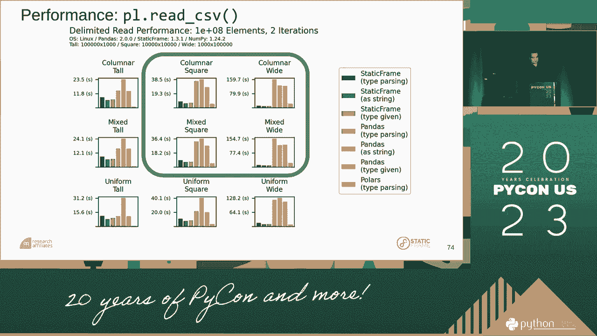

 I think all of us write code hoping that it might be useful， for a month or a year or maybe maybe。 So， to have a piece of code that's been around for 20 years， it continues to be useful。

 but in the standard library， and useful for people like me to take this。 and build it into something else， which is really exciting in this particular way。

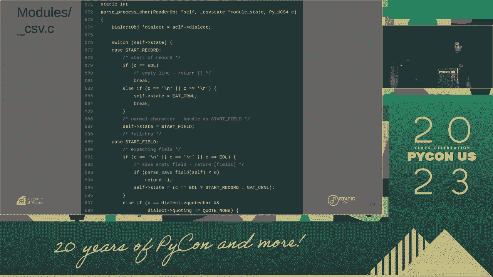

 And it's something that's relevant in the other part of that。 All right。 thank you for your attention。 It seems like you'll learn more about set of thing。

 or other related tools。 You can build it with URL。 And， since there are 10。000 things throughout the conference， I'll be around， happy to take these questions now， or later on。

 thank you for your attention。 [ Pause ]。
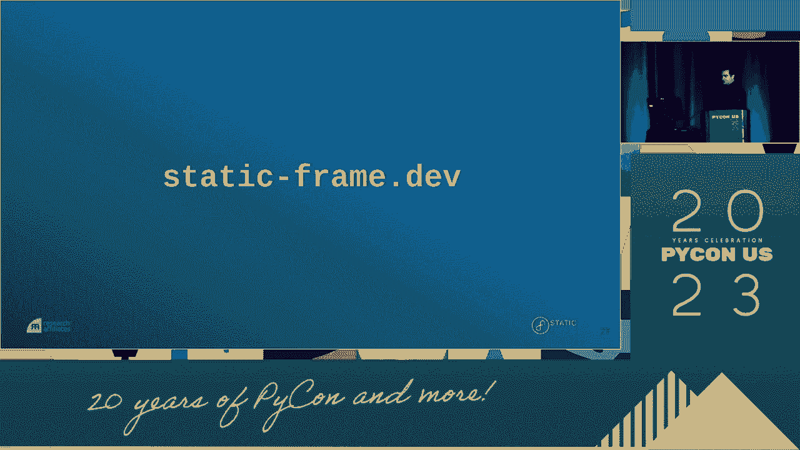

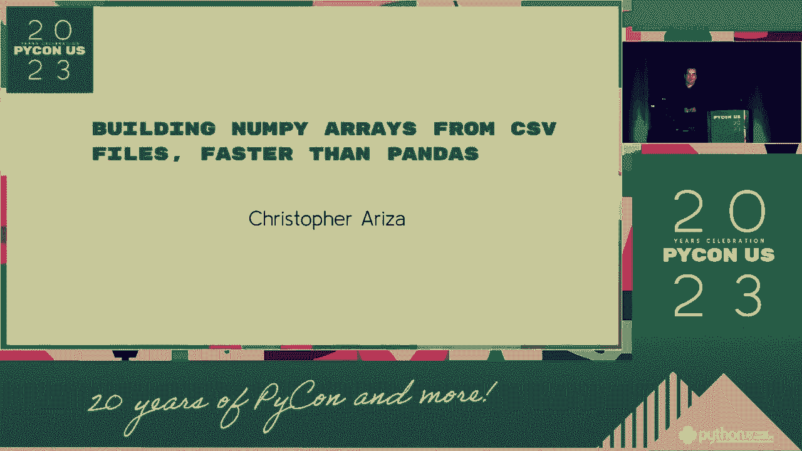