# P38：Talks - Iván Pulido_ Reproducible molecular simulations with Python - VikingDen7 - BV1114y1o7c5

 [ Pause ]。
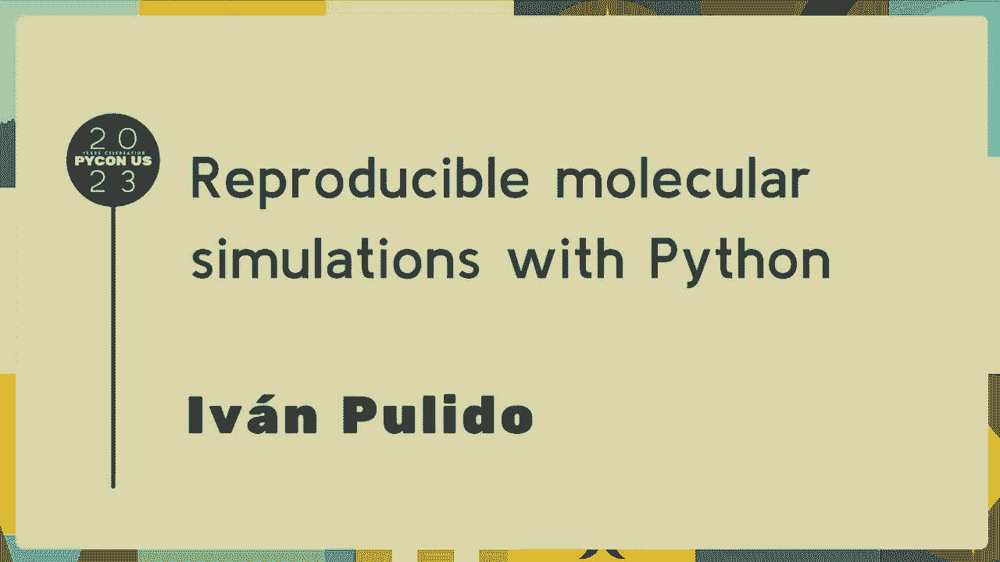

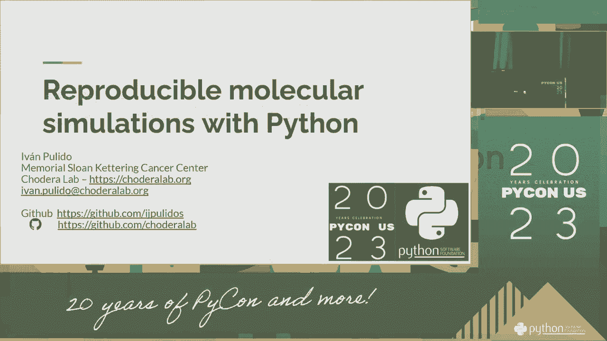

 [ Pause ]， [ Pause ]。
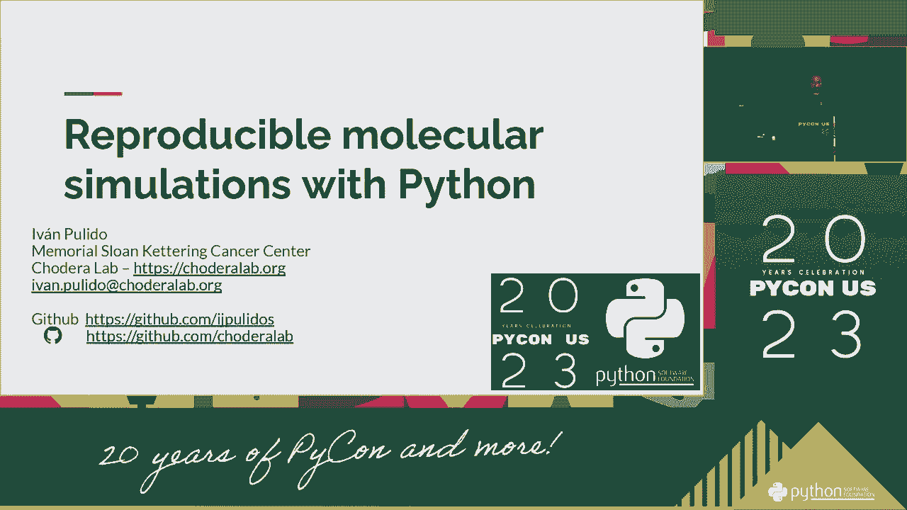

 [ Pause ]， [ Pause ]， [ Pause ]， [ Pause ]， [ Pause ]， [ Pause ]， [ Pause ]， [ Pause ]， [ Pause ]。 [ Pause ]， [ Pause ]， [ Pause ]， [ Pause ]， [ Pause ]， [ Pause ]， [ Pause ]， [ Pause ]， [ Pause ]。

 [ Pause ]。
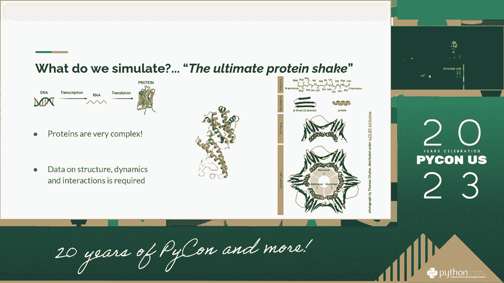

 [ Pause ]， [ Pause ]， [ Pause ]， [ Pause ]， [ Pause ]， [ Pause ]， [ Pause ]， [ Pause ]。
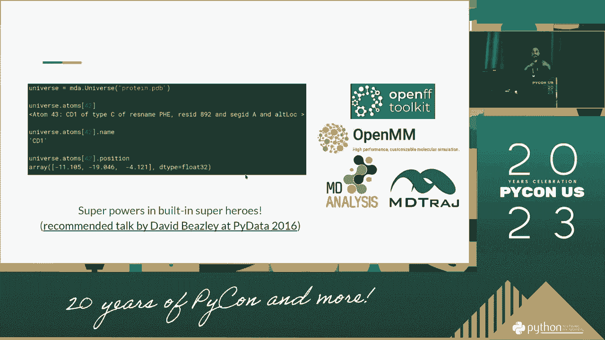

 [ Pause ]， [ Pause ]， [ Pause ]， [ Pause ]， [ Pause ]， [ Pause ]， [ Pause ]， [ Pause ]。
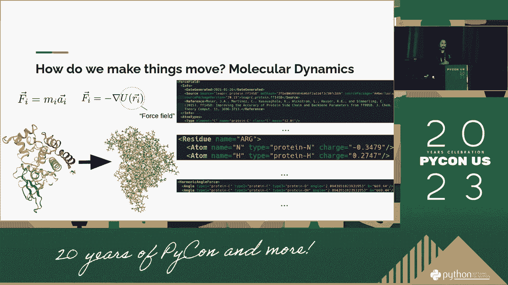

 [ Pause ]， [ Pause ]， [ Pause ]， [ Pause ]， [ Pause ]。
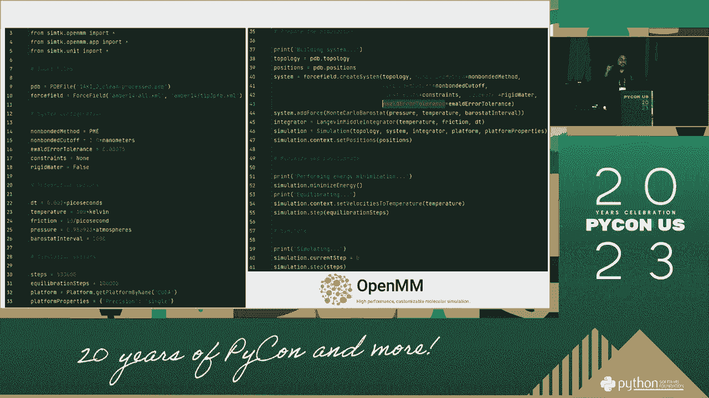

 [ Pause ]， [ Pause ]， [ Pause ]。
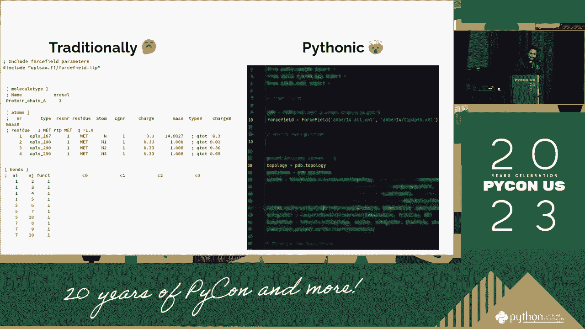

 [ Pause ]， [ Pause ]， [ Pause ]， [ Pause ]， [ Pause ]， [ Pause ]， [ Pause ]， [ Pause ]。
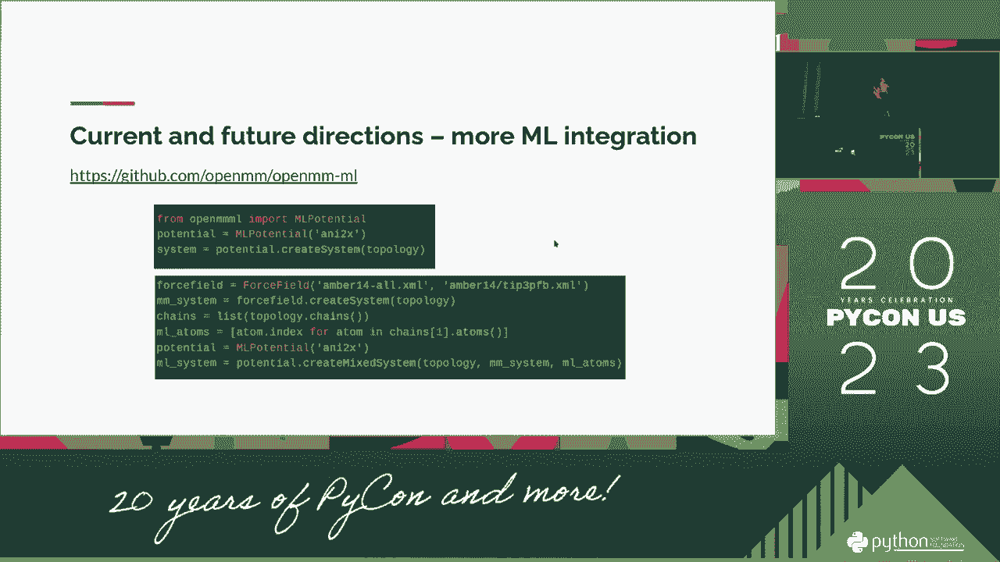

 [ Pause ]。
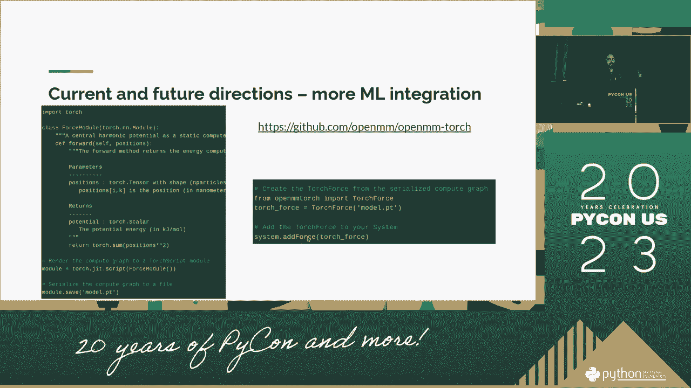

 [ Pause ]， [ Pause ]， [ Pause ]。
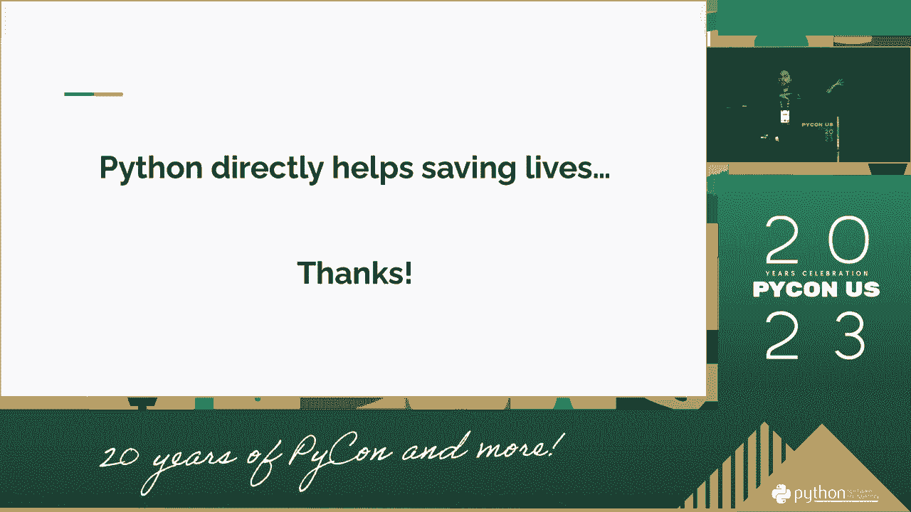

 [ Pause ]。
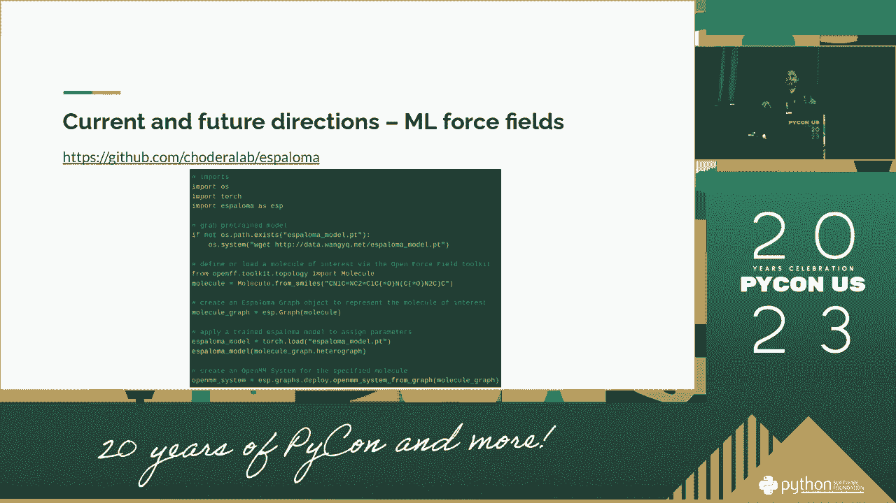

 [ Pause ]， [ Pause ]， [ Pause ]， [ Pause ]， [ Pause ]。
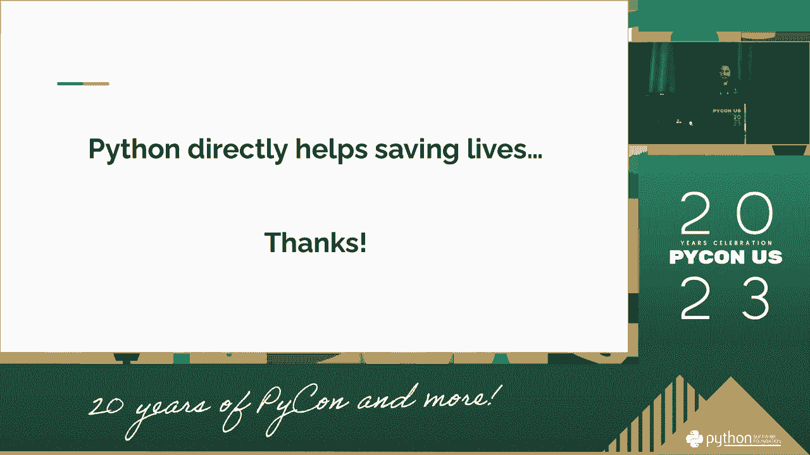