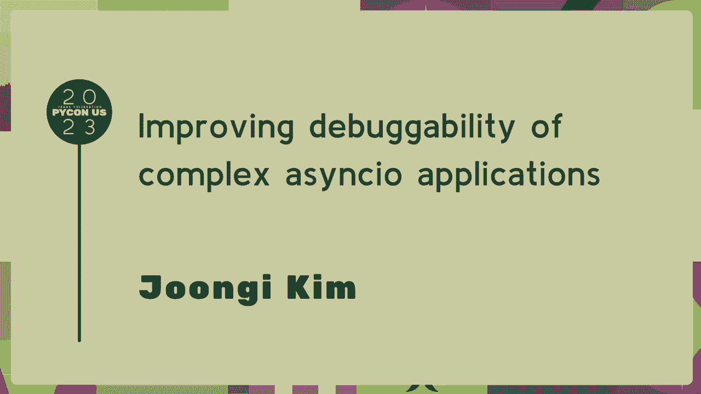
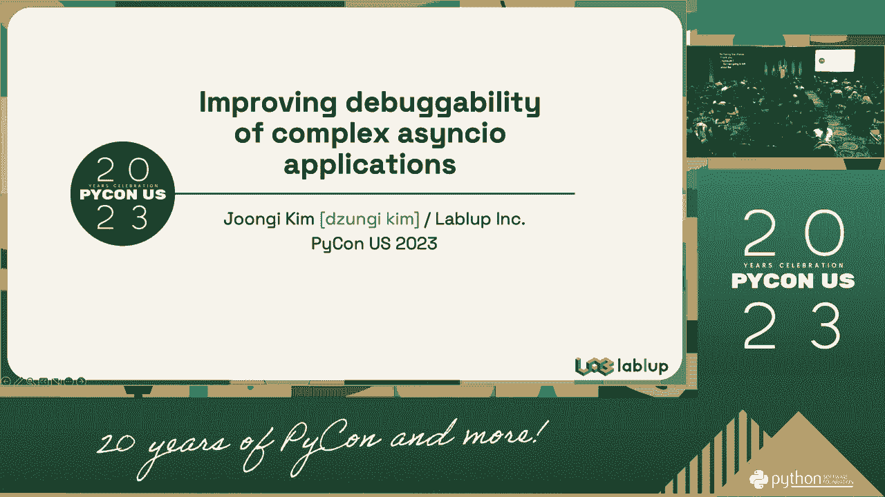
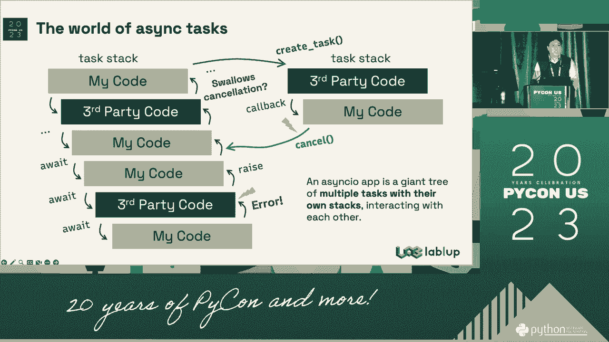
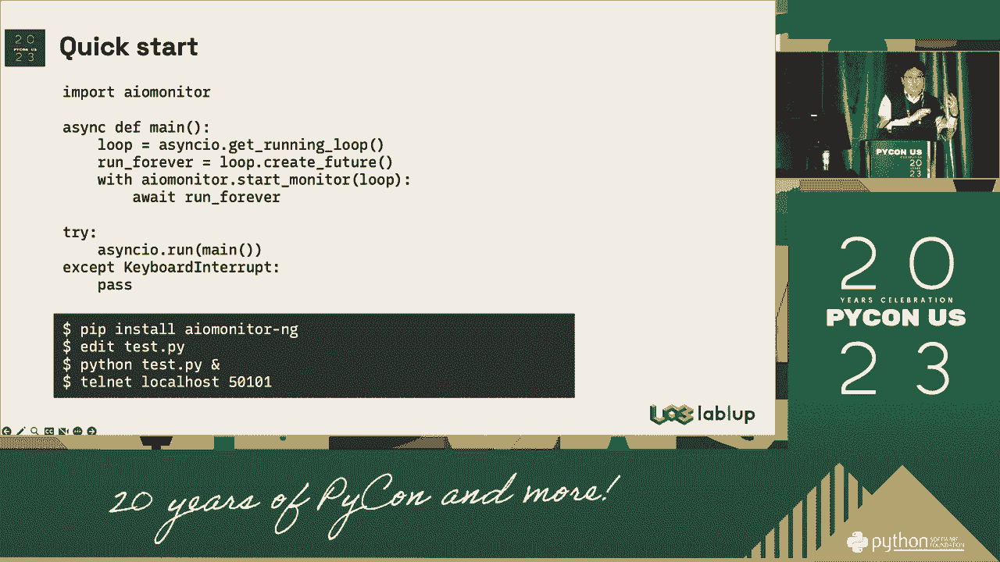
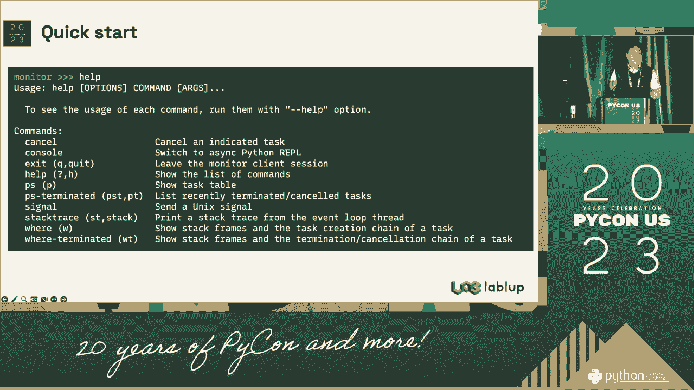
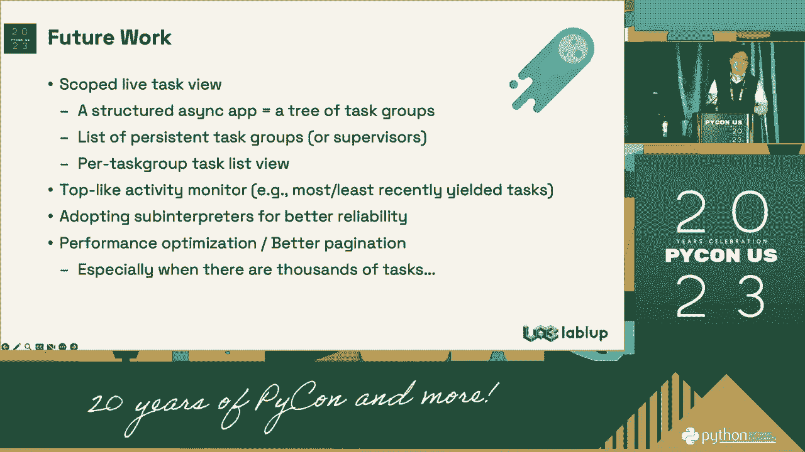
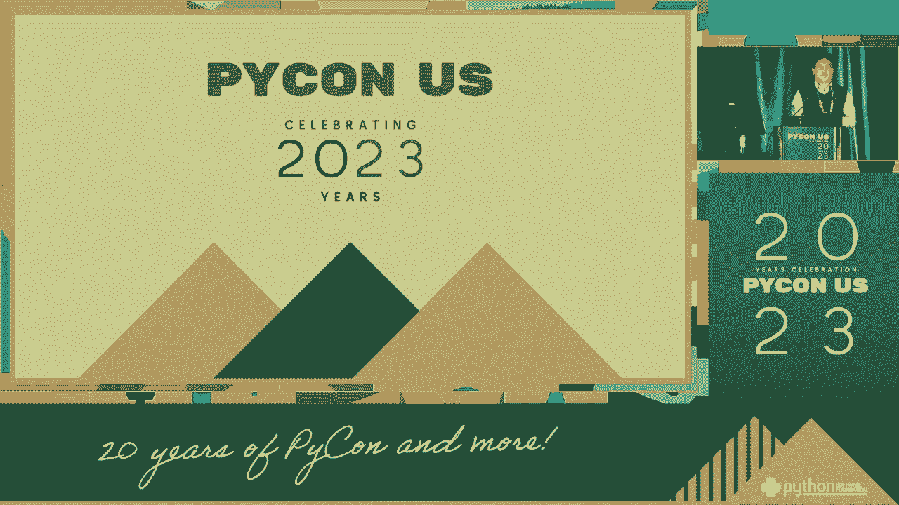

# PyCon US 2023 - P42：Talks - Joongi Kim_ Improving debuggability of complex asyncio applications - VikingDen7 - BV1114y1o7c5

 [ Pause ]。

 [ Pause ]， [ Pause ]。

 [ Pause ]， [ Pause ]， [ Pause ]， [ Pause ]， [ Pause ]， [ Pause ]， [ Pause ]， [ Pause ]， [ Pause ]。

 [ Pause ]， [ Pause ]， [ Pause ]， [ Pause ]， [ Pause ]， [ Pause ]， [ Pause ]， [ Pause ]， [ Pause ]。

 [ Pause ]， [ Pause ]。

 [ Pause ]。

 [ Pause ]， [ Pause ]。

 [ Pause ]， [ Pause ]， [ Pause ]， [ Pause ]， [ Pause ]， [ Pause ]， [ Pause ]， [ Pause ]， [ Pause ]。

 [ Pause ]， [ Pause ]， [ Pause ]， [ Pause ]， [ Pause ]， [ Pause ]， [ Pause ]， [ Pause ]， [ Pause ]。

 [ Pause ]， [ Pause ]， [ Pause ]， [ Pause ]， [ Pause ]， [ Pause ]， [ Pause ]， [ Pause ]， [ Pause ]。

 [ Pause ]， [ Pause ]， [ Pause ]， [ Pause ]， [ Pause ]， [ Pause ]， [ Pause ]， [ Pause ]， [ Pause ]。

 [ Pause ]。

