# PyCon US 2023 - P43：Talks - Josh Weissbock, Sheila Flood_ Using Python to Help the Unhoused - VikingDen7 - BV1114y1o7c5

 Welcome to the final talk of Python。

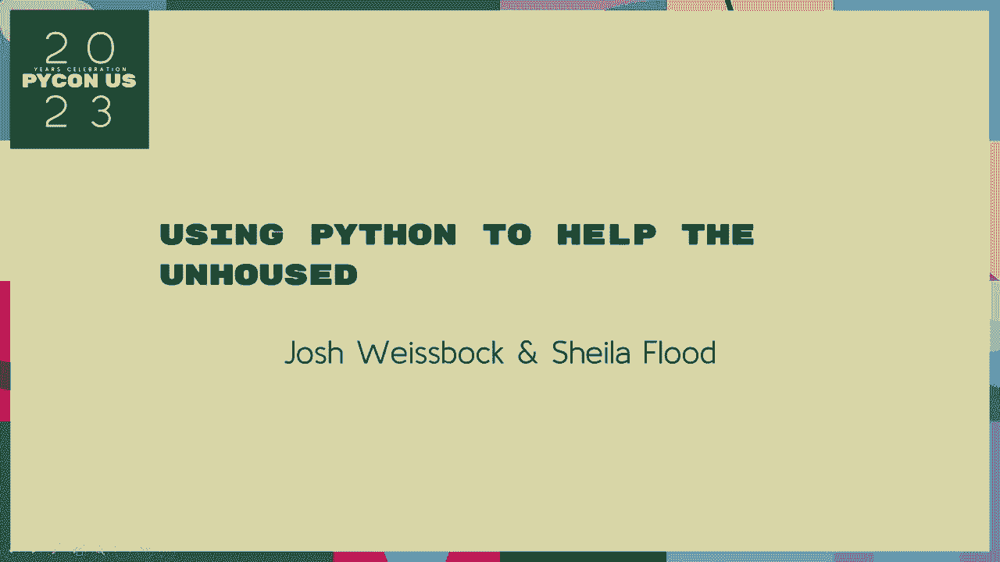

 which is kind of three。 You have the language。 You can see it。 Let's have a round of applause。 Okay。

 So our final presentation today will be using Python to help。

 be held by Josh Leinbach and Stuart Leinbach。 They have asked that we do a few minutes to wait。

 Again， after discussing， we kept an alpine on the hallway。

 This is going to run pretty close to the end of the time here。 Well， will you further again， please？

 We're going to be around the call source。 Please， please， please。 The final talk for Python， please。

 [APPLAUSE]， All right。 Good afternoon。 Thanks for joining us for the last talk here。

 I'm coming to the panelist today。 I'm going to be able to talk to you about having these。

 I'm going to be following you。 I'm going to be able to give you a hug and a hug and a hug。

 And to give you a hug。 To give you a hug and a hug and a hug and a hug。

 I'm going to be talking about Python。 I'm going to be talking about Python。

 It's going to be a lot of our experience。 I'm actually from Victoria。 I'm from the city of London。

 Please， please。 I'm going to bring you my work to attend your community。

 I'm going to be in the inside。 I'm going to be talking about the history of the college。

 college degree。 I'm going to be in the middle of the school。

 I'm going to be in the middle of the school。 I'm going to be in the middle of the school。

 I'm going to be in the middle of the school。 I'm going to be in the middle of the school。

 I'm going to be in the middle of the school。 I'm going to be in the middle of the school。

 I'm going to be in the middle of the school。 I'm going to be in the middle of the school。

 I'm going to be in the middle of the school。 I'm going to be in the middle of the school。

 I'm going to be in the middle of the school。

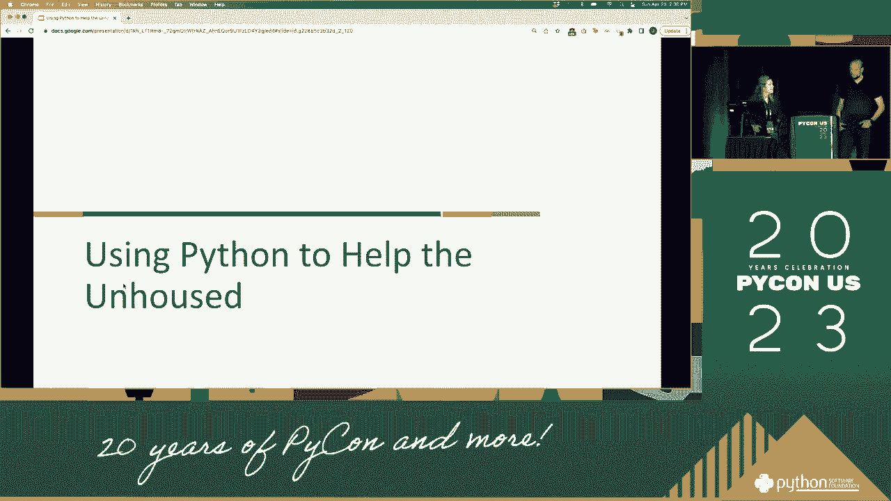

 I'm going to be in the middle of the school。 I'm going to be in the middle of the school。

 I'm going to be in the middle of the school。 I'm going to be in the middle of the school。

 I'm going to be in the middle of the school。 I'm going to be in the middle of the school。

 I'm going to be in the middle of the school。 I'm going to be in the middle of the school。

 I'm going to be in the middle of the school。 I'm going to be in the middle of the school。

 I'm going to be in the middle of the school。 I'm going to be in the middle of the school。

 I'm going to be in the middle of the school。 I'm going to be in the middle of the school。

 I'm going to be in the middle of the school。 I'm going to be in the middle of the school。

 I'm going to be in the middle of the school。

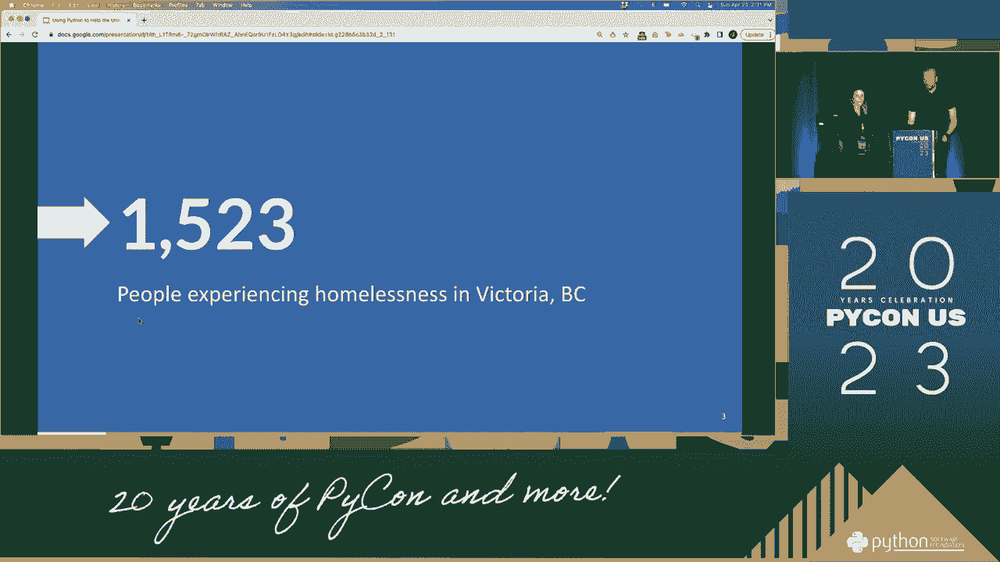

 I'm going to be in the middle of the school。 I'm going to be in the middle of the school。

 I'm going to be in the middle of the school。 I'm going to be in the middle of the school。

 I'm going to be in the middle of the school。 I'm going to be in the middle of the school。

 I'm going to be in the middle of the school。 We try to help one of the people who has been in the school。

 In the age of old times， we need to grow into political issues。

 We see what they know in terms of the program。 They actually have to grow into political issues。

 I want to be in the middle of the school。 I want to be in the middle of the school。

 We have to be in the middle of the school。 We have to be in the middle of the school。

 We try to help one of the schools。 We have to be in the middle of the school。

 We have to be in the middle of the school。 We have to be in the middle of the school。

 We have to be in the middle of the school。 We have to be in the middle of the school。

 We have to be in the middle of the school。 We have to be in the middle of the school。

 We have to be in the middle of the school。 We have to be in the middle of the school。

 We have to be in the middle of the school。 We have to be in the middle of the school。

 We have to be in the middle of the school。 We have to be in the middle of the school。

 We have to be in the middle of the school。 We have to be in the middle of the school。

 We have to be in the middle of the school。 We have to be in the middle of the school。

 We have to be in the middle of the school。 We have to be in the middle of the school。

 We have to be in the middle of the school。 We have to be in the middle of the school。

 We have to be in the middle of the school。 We have to be in the middle of the school。

 We have to be in the middle of the school。 We have to be in the middle of the school。

 We have to be in the middle of the school。 We have to be in the middle of the school。

 We have to be in the middle of the school。 We have to be in the middle of the school。

 We have to be in the middle of the school。 We have to be in the middle of the school。

 We have to be in the middle of the school。 We have to be in the middle of the school。

 We have to be in the middle of the school。 We have to be in the middle of the school。

 We have to be in the middle of the school。 We have to be in the middle of the school。

 We have to be in the middle of the school。 We have to be in the middle of the school。

 We have to be in the middle of the school。 We have to be in the middle of the school。

 We have to be in the middle of the school。 We have to be in the middle of the school。

 We have to be in the middle of the school。 We have to be in the middle of the school。

 We have to be in the middle of the school。 We have to be in the middle of the school。

 We have to be in the middle of the school。 We have to be in the middle of the school。

 We have to be in the middle of the school。 We have to be in the middle of the school。

 We have to be in the middle of the school。 We have to be in the middle of the school。

 We have to be in the middle of the school。 We have to be in the middle of the school。

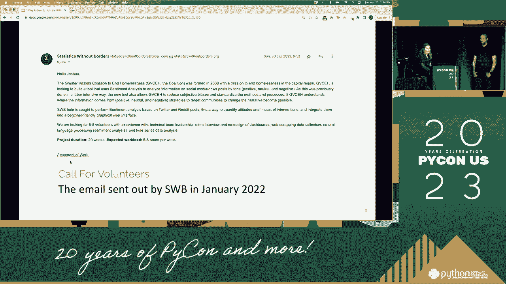

 We have to be in the middle of the school。 We have to be in the middle of the school。

 We also know that there is no hope for the whole school。

 We also know that there is no hope for the whole school。

 We also know that there is no hope for the whole school。

 We also know that there is no hope for the whole school。

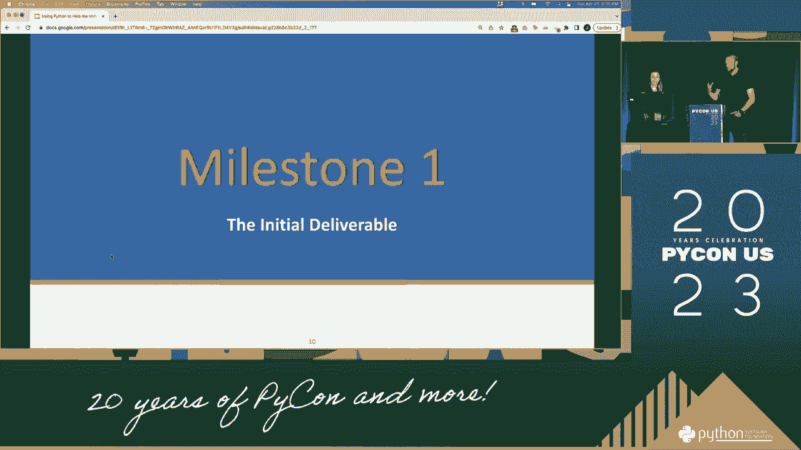

 We have to be in the middle of the school。 We have to be in the middle of the school。

 We have to be in the middle of the school。 We have to be in the middle of the school。

 We have to be in the middle of the school。 We have to be in the middle of the school。

 We have to be in the middle of the school。 We have to be in the middle of the school。

 We have to be in the middle of the school。 We have to be in the middle of the school。

 We have to be in the middle of the school。 We have to be in the middle of the school。

 We have to be in the middle of the school。 We have to be in the middle of the school。

 We have to be in the middle of the school。 We have to be in the middle of the school。

 We have to be in the middle of the school。 We have to be in the middle of the school。

 We have to be in the middle of the school。 We have to be in the middle of the school。

 We have to be in the middle of the school。 We have to be in the middle of the school。

 We have to be in the middle of the school。 We have to be in the middle of the school。

 The second part was words related to evidence of people not to find things that could hold the police。

 We heard the police say that they are the police。 We have to be in the middle of the school。

 We have to be in the middle of the school。 We have to be in the middle of the school。 As a paper。

 it wasn't difficult on the same level。 We have to be in the middle of the school。

 We have to be in the middle of the school。 We have to be in the middle of the school。

 We are also even trying to help people out of the middle of the school。

 We have to be in the middle of the school。 We have to be in the middle of the school。

 We have to be in the middle of the school。 We have to be in the middle of the school。

 We have to be in the middle of the school。 We have to be in the middle of the school。

 We have to be in the middle of the school。 We have to be in the middle of the school。

 We have to be in the middle of the school。 We have to be in the middle of the school。

 We have to be in the middle of the school。 We have to be in the middle of the school。

 We have to be in the middle of the school。 We have to be in the middle of the school。

 We have to be in the middle of the school。 We have to be in the middle of the school。

 We have to be in the middle of the school。 We have to be in the middle of the school。

 We have to be in the middle of the school。 We have to be in the middle of the school。

 We have to be in the middle of the school。 We have to be in the middle of the school。

 We have to be in the middle of the school。 We have to be in the middle of the school。

 We have to be in the middle of the school。 We have to be in the middle of the school。

 We have to be in the middle of the school。 We have to be in the middle of the school。

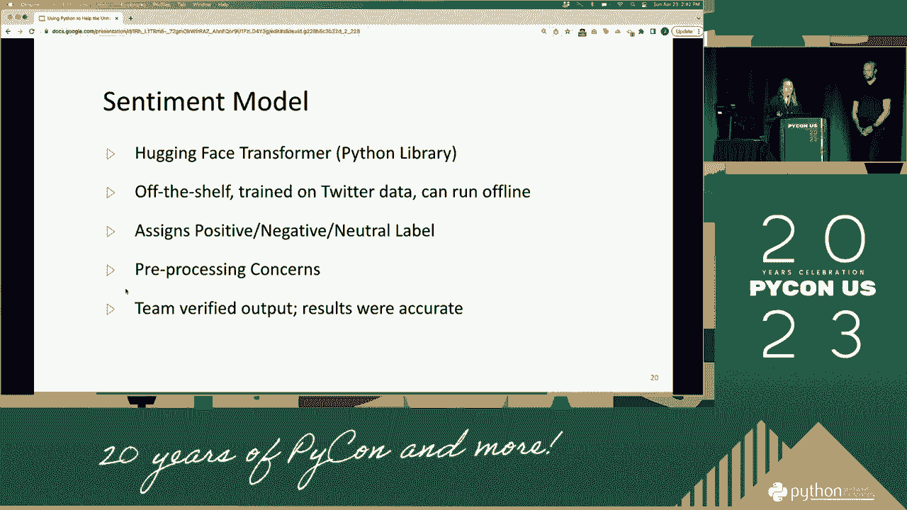

 We have to be in the middle of the school。

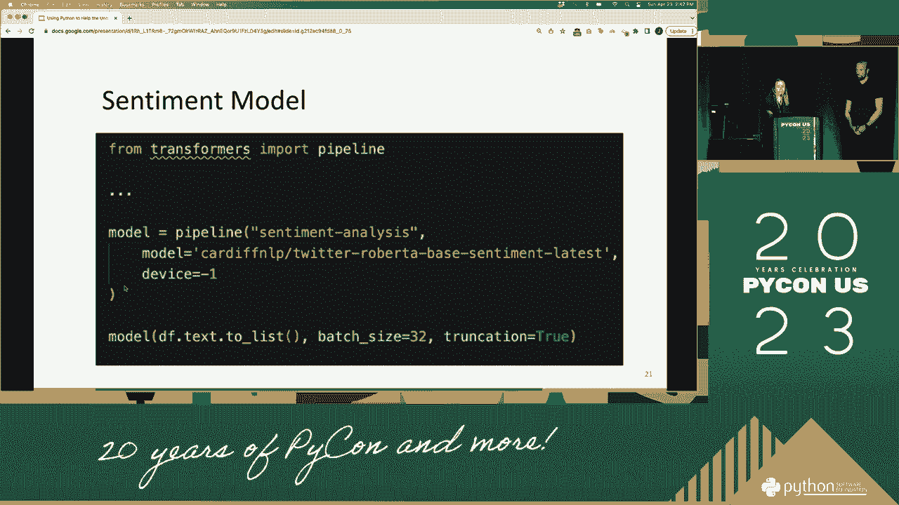

 We have to be in the middle of the school。 We have to be in the middle of the school。

 We have to be in the middle of the school。 We have to be in the middle of the school。

 We have to be in the middle of the school。 We have to be in the middle of the school。

 We have to be in the middle of the school。 We have to be in the middle of the school。

 We have to be in the middle of the school。 We have to be in the middle of the school。

 We have to be in the middle of the school。 We have to be in the middle of the school。

 We have to be in the middle of the school。 We have to be in the middle of the school。

 We have to be in the middle of the school。 We have to be in the middle of the school。

 We have to be in the middle of the school。 We have to be in the middle of the school。

 We have to be in the middle of the school。 We have to be in the middle of the school。

 We have to be in the middle of the school。 We have to be in the middle of the school。

 We have to be in the middle of the school。 We have to be in the middle of the school。

 We have to be in the middle of the school。 We have to be in the middle of the school。

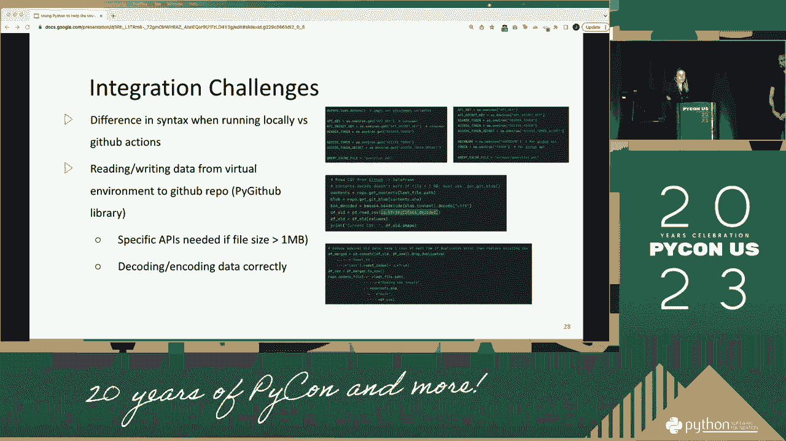

 We have to be in the middle of the school。 We have to be in the middle of the school。

 We have to be in the middle of the school。

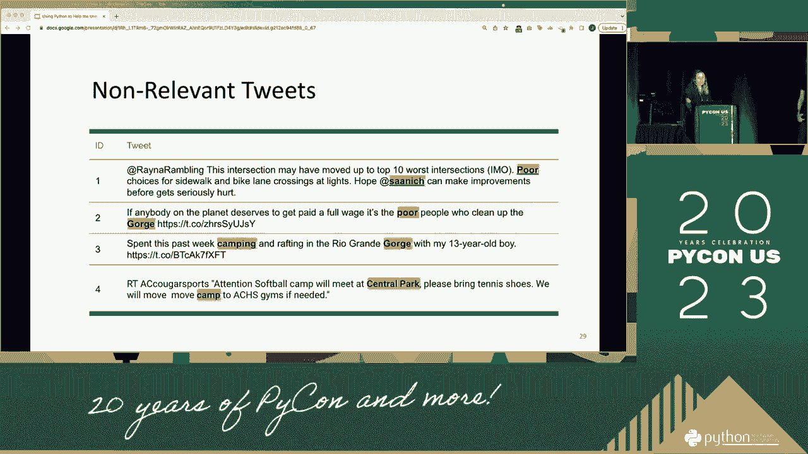

 We have to be in the middle of the school。

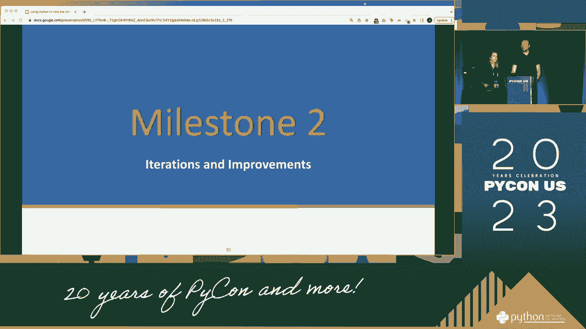

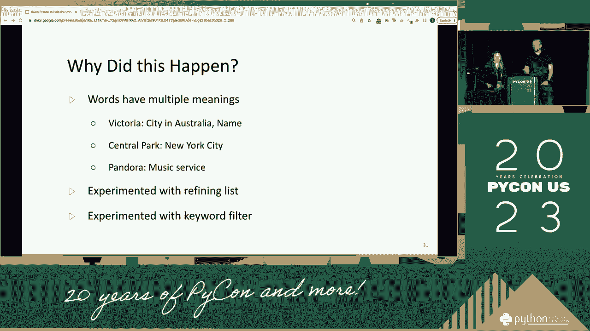

 of your correspondence to campus。