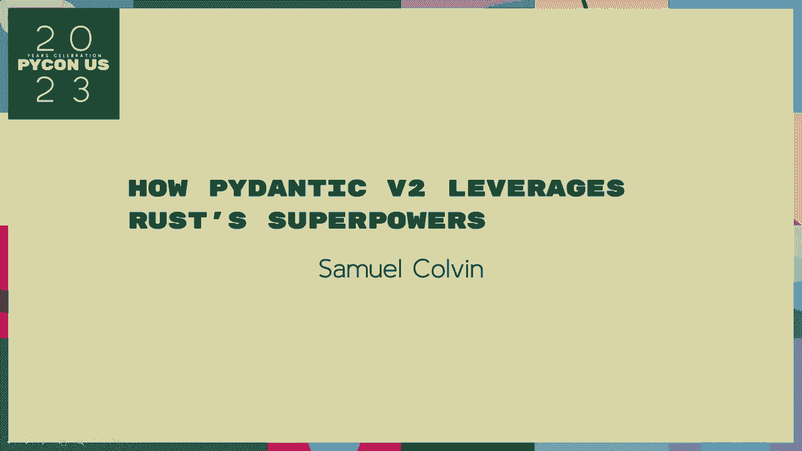
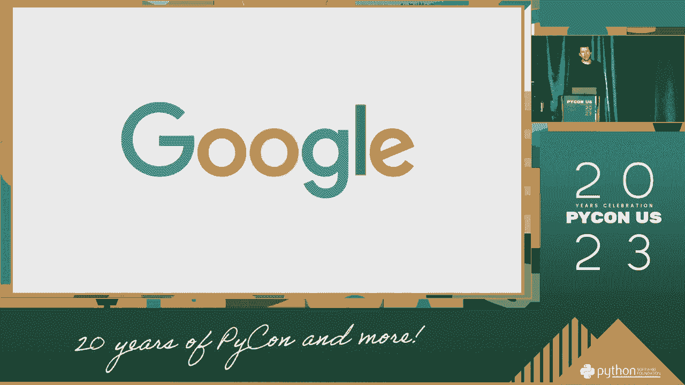

# P53：Talks - Samuel Colvin_ How Pydantic V2 leverages Rust's Superpowers - VikingDen7 - BV1114y1o7c5

 [ Pause ]。

 [ Pause ]。

 [ Pause ]， [ Pause ]， [ Pause ]， [ Pause ]， [ Pause ]， [ Pause ]， [ Pause ]， [ Pause ]， [ Pause ]。 [ Pause ]， [ Pause ]， [ Pause ]， [ Pause ]， [ Pause ]， [ Pause ]， [ Pause ]， [ Pause ]， [ Pause ]。 [ Pause ]， [ Pause ]， [ Pause ]， [ Pause ]， [ Pause ]， [ Pause ]， [ Pause ]， [ Pause ]， [ Pause ]。 [ Pause ]， [ Pause ]， [ Pause ]， [ Pause ]， [ Pause ]， [ Pause ]， [ Pause ]， [ Pause ]， [ Pause ]。

 [ Pause ]， [ Pause ]， [ Pause ]， [ Pause ]， [ Pause ]， [ Pause ]， [ Pause ]， [ Pause ]， [ Pause ]。 [ Pause ]， [ Pause ]， [ Pause ]， [ Pause ]， [ Pause ]， [ Pause ]， [ Pause ]， [ Pause ]， [ Pause ]。 [ Pause ]， [ Pause ]， [ Pause ]， [ Pause ]， [ Pause ]， [ Pause ]， [ Pause ]， [ Pause ]， [ Pause ]。 [ Pause ]， [ Pause ]， [ Pause ]， [ Pause ]， [ Pause ]， [ Pause ]， [ Pause ]， [ Pause ]， [ Pause ]。

 [ Pause ]， [ Pause ]， [ Pause ]， [ Pause ]， [ Pause ]， [ Pause ]， [ Pause ]， [ Pause ]， [ Pause ]。 [ Pause ]， [ Pause ]， [ Pause ]， [ Pause ]， [ Pause ]， [ Pause ]， [ Pause ]， [ Pause ]， [ Pause ]。 [ Pause ]， [ Pause ]， [ Pause ]， [ Pause ]， [ Pause ]。