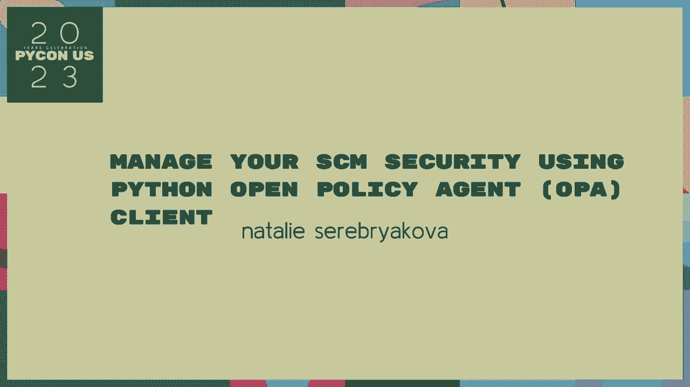
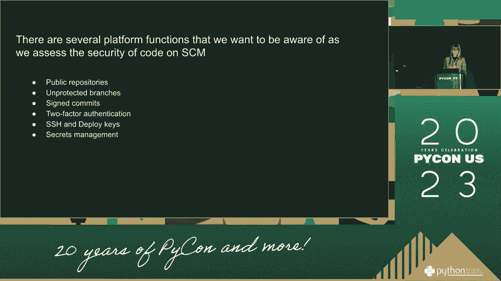
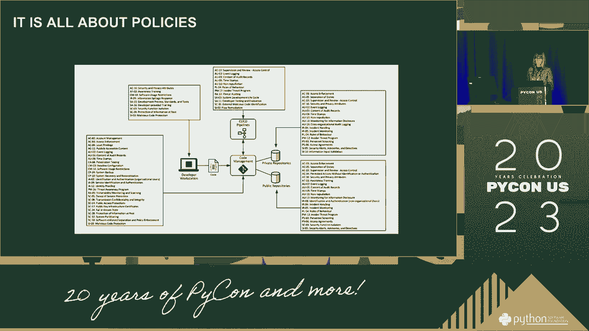
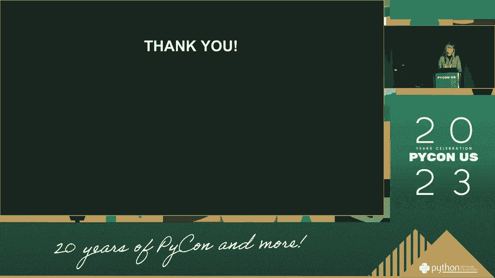

# PyCon US 2023 - P54：Talks - natalie serebryakova_ Manage your SCM security using Python Open Policy - VikingDen7 - BV1114y1o7c5

 >> Good morning everyone and welcome again to Python。

 I met people with NUTO and we were talking about those who are managing and improving the Python wasn't positive again。

 To ensure governments aren't achieving NUTO。 Please welcome our teachers。 [inaudible]， [inaudible]。

 [inaudible]， [inaudible]， [inaudible]， [inaudible]， [inaudible]， [inaudible]， [inaudible]。

 [inaudible]， [inaudible]， [inaudible]， [inaudible]， [inaudible]， [inaudible]， [inaudible]。

 [inaudible]， [inaudible]， [inaudible]， [inaudible]， [inaudible]， [inaudible]， [inaudible]。

 [inaudible]， [inaudible]， [inaudible]， [inaudible]， [inaudible]。

 [inaudible]， [inaudible]， [inaudible]， [inaudible]。

 [inaudible]， [inaudible]， [inaudible]， [inaudible]， [inaudible]， [inaudible]， [inaudible]。

 [inaudible]， [inaudible]， [inaudible]， [inaudible]， [inaudible]， [inaudible]， [inaudible]。

 [inaudible]， [inaudible]， [inaudible]， [inaudible]， [inaudible]， [inaudible]， [inaudible]。

 [inaudible]， [inaudible]， [inaudible]， [inaudible]， [inaudible]， [inaudible]， [inaudible]。

 [inaudible]， [inaudible]， [inaudible]， [inaudible]， [inaudible]， [inaudible]， [inaudible]。

 [inaudible]， [inaudible]， [inaudible]， [inaudible]， [inaudible]， [inaudible]， [inaudible]。

 [inaudible]， [inaudible]， [inaudible]， [inaudible]， [inaudible]， [inaudible]， [inaudible]。

 [inaudible]。

 [BLANK_AUDIO]。