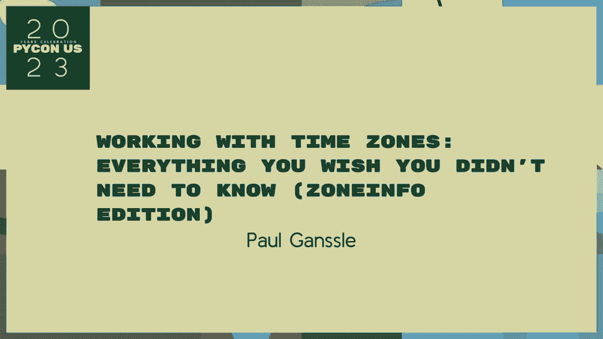
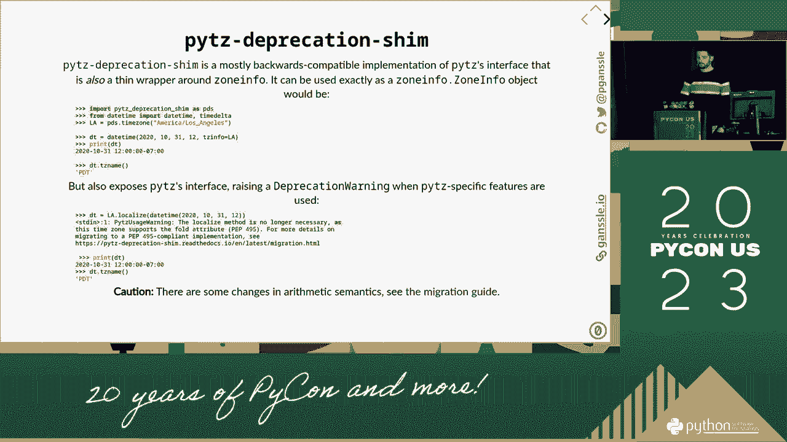

# PyCon US 2023 - P61：Talks - Paul Ganssle_ Working with Time Zones_ Everything You Wish You Didn't Ne - VikingDen7 - BV1114y1o7c5

 Welcome to the second session of Two Seconds Talk at Susapun。 Our speaker is Paul Gose。

 who will be coming up with a working with Peter Sowers。

 Everything you do right is in the middle of the middle， and this is the only solution of that。

 So， some of you may have been here in 2019， and you may be thinking about being able to see this talk in the next lecture。

 and talking about your basic and basic talk， because that's why I'm looking at the talk at the same time。

 and there are similar talk differences in the point on the end。

 also because we already added a new module for standard library， which talks about getting into it。

 And then， I'm going to partially watch the whole bunch of the talk that we just did。 So。

 as you're looking at my own success， I'm going back for the second session。

 to use my thoughts about the kind of momentum that we've been using since then。 So。

 we've got a lot to come in， and we're very middle-school programming， so。

 let's jump on in to the basics of time。 So， we'll start with an easy introduction。 You can see。

 you can see， you can see， you can see， you're not going to come or go。

 This is really the field of these three offers I measure。 It's mostly one of them。

 which you can say， you can't have those in time， but what it does have is the instructions。

 which is quite a very important thing。 But， apparently， when you're stopping being a new person， so。

 hopefully， the glorious people， you can see them one day。

 and you can make the one second for every second of the lecture。 It's been like a three-game。

 so it happens on the one。 Another concept， hopefully。

 is the difference between time and end of the office。 So。

 in the agency minus the exit of the market， you can use your R6 hours to local home to get into sleep。

 America's big product is a time zone， which is a set of rules for what costs and supplies。

 at what time， in all different regions。 In this case。

 we're going to go ahead and go ahead and go ahead and go to Chicago。

 and first call about the British followers that they just did in the region。

 Canada is the case of the infrastructure， and the local， the local， and local， and local， and local。

 and local， and local， and new， and new， and new。 But， UST refers to a top-set。

 but it's actually a very tiny concept that you can then review， which is also common。

 because you can see one of the stick。 But， if you're in Cuba， you can see it's a CTC one-five。

 and a challenge， you can see it's a complexity。 So。

 a word of advice never allow you to use your other reviews， because you're in Washington。 And。

 I don't even rely on an existing， because there are a lot of things that can help reorder your reviews。

 Okay， so now， we've stuck with this， and so now， let's move on to the mandatory part of a new time-again software。

 for the ventilators， so， you know， that's a weird。

 and standard software that you'll get into a local community。 And， so， an easy one to it。

 and a little bit more than a good one， because we've already divided it up into 24 equal size companies。

 and we've put in a lot of time。 But， you know， not all time zones are one hour off of that's permanent。

 you see。 We're not starting out there， we're doing it， we're doing it。

 we're starting out a lot more than we can result。 And， the call is one of two。

 which is some of us for 15 minutes， and it's directly， like Mary。

 at the point of which we've taken one， and 30 in time， they'll say。

 without getting into two numbers， and then it's off from the computer。 So。

 you may have to think that， you know， we're trying to make it a， an offer page， or a 10-minute bill。

 or a 10-minute bill， or a 10-minute bill， or a 10-minute bill， or a 10-minute bill。

 or a 10-minute bill。 And， you know， it's an easy one， but， you include a change in offer。 And。

 you know， there's an easy one to look at， so， one example of the second one， is， "Don't you know。

 and then it's an empty number to you， they decided they wanted to switch over。

 from working your people in the central to the open chart。"， And， you know， what we did was。

 we didn't tell it， we were going， "All the way I said， and just normally。

 they'd switch their cards back on them。"， But， since they wanted to move over one of the charts。

 we just， because no longer do our same thing， we were trying to calculate them。 And， though。

 if we mean different humans， we knew us， and we just were told that most of the risk we were in。

 we never had， like， do our new speech， but we don't have to take it。 Um， as an aside， and then。

 if you mean a mistake， they decided that that most of the time is not going to make it。

 and this moment is making us feel the idea。 So， we did use actually to move up to the next。

 we did a small speech card， and it， we switched up to what was going to happen with our。

 with our face， when we put these off。 So， now， you know， that these offers continue。

 and that's how we make it， because we want to make it one of the ones。 But， you may think that。

 if you have a phone， it's really likely to be one of the ones， or something。

 and you can be five in the two times between the point one and one。 And， as a result。

 we have a number of people that are now in Morocco， and it's 3。25， which is most of the most。

 and you can see the point on my face， where this is in 10。12， the result。

 and it went on to be as anything。 And then， a couple months later， we arrived。

 and it turned off to as anything。 So， like， one month， and then we went back on the horizon。

 so we can have a month in a future。 And this is also happened in India， in the towns that we saw。

 So， you can， we just can， we can try to do it， which is a dual majority-most income case。

 and this month is valid。 So， it's a lot of our loved ones are， and that's just the main thing。

 is that it's kind of the same。 So， all of a sudden， that's what's the power， and get out to work。

 or it's the same， we don't know what to do， because we're going to take a look at it。 And then。

 we're going to take a look at it， which is what we want to do， and see what it's going to do。 So。

 now we know we do the all kinds of real stuff on the right side， and change the whole thing。 So。

 we think of your profit， but this thing's always happened in two months， right？ But。

 I think it's the， I think it's much more than in India， I think。 Even this is not true。

 in the late '74， here of us， which is the main thing in the South Pacific。 So。

 I think it's a very close range of national data， and I think it's like。

 they want to do any other stuff， because then they went to a one-most place。

 and then they went to a one-most place， and then they went over。 I don't know if it's the case。

 but the upshot is， or it's just not what December 1st， and then to the 1st。 December 30th。

 or the 1st of July 1 minute later， up in the year， 25th， and you may be talking about， well。

 maybe I was just wondering what happened in the far count before it was， you know。

 to encourage the new and the greatest functions of that thing。

 But this has also happened more recently in Denmark。

 and I think it's one of the other things that came in like the main thing， which was the main thing。

 And， if you directly， it goes into the other way as well。

 and tries to make it more relevant and seems to be known， there were just two September 30th。 So。

 maybe this is a five-plus look。 So， I think it's a great idea for the main thing。

 and I think it's a million of it。 And I'm sure it's just a fact about all of that。

 but I think it's a wonderful thing。 And there's almost no construction。

 and no one can understand that。 But， I think it's a great idea for the main thing。 And， normally。

 this is something that was kind of a cleaner for a computer。 And， you know。

 I have to pull up to this and see what's happening。 And， what I gather， I have an instance。

 which is really here in the West。 But， it's not allowed to look like force burning in the morning。

 and it just doesn't look like it's in the morning。 So， I'm saying to the first off。

 there's a big one by a government， one that is in the country。 And， on the locals。

 it's used to be cost-hit。 And， screwing it with the PDF is a very different。

 but rather than a different type of， whether you choose to use a computer for a computer for a computer for a computer for a computer。

 And， you know， this book is part of the， we know it might already be used to cost-hit。

 but it's not on the door。 So， I suppose， you could say， it's in place， as Rachel comes in， and then。

 if you know someone who's looking in there， can you produce the meat？

 Can you know what that kind of is only？ So， okay， there you go， and you might be asking yourself。

 why don't you do what that is only on the country？ And， you know， I think that it's because。

 you know， it's a much easier thing for everyone。 And， you know， it's not a good thing。 And。

 you know， it's not a good thing for the most people。 So， it's not a good one， so， that's the world。

 And， also， for a lot of people， it does not go out there and say， "I'm coming in， I'm coming in。

 people， run their schedule， and they're sitting over there。"， So， in the real world。

 you can want to do something like generate a bunch of decisions， but。

 rather than close the statements from New York， it's probably a good unit to be able to do what it's like。

 And， to be able to say， "Hey， this is our world， and I want to be every day and I want to make it exciting。

"， So， five of the parts， you know， you can take this from New York， kind of something to it。 And。

 then， you'll get this， uh， with the domestic business thing， that's seen recently。

 you can see out there two days， and， uh， five to one and four， and， so， and so， and so forth。 But。

 if you wanted to produce this from New York， you could see it， you'd be like， "Oh， okay， well。

 those of you who sometimes want to talk to you， you could see it。"， And， then， I think。

 I'm going to talk to you， you can see it。 When you're just talking， there's nothing like that， but。

 I'm going to talk to you about it。 And， then， when you're talking about it， you're talking about it。

 And， again， it's going to be a very bad moment， but you can't do it。 And。

 when you're talking about it， you can't do it， but you can't do it。 And， you know。

 when you're talking about it， you can't do it。 Because， when you're talking about it。

 you can't do it。 And， then， when you're talking about it， you can't do it。 All the sudden。

 when you're trying to look up what the local times are， what are you just doing。 So。

 there are different times。 There's not too much。 There's one or five。 There's three or five。

 There's something like that。 Because the mapping between the inter-seen local communities is now stable。

 So， when you're talking about it， it means the instruction that most people mention is what you're talking about。

 So， now， when it's out， it's been working for years。 It's been working for years。 And， then。

 it's been working for years。 Let's get into how I've done some of those discussions at the work。 So。

 living is kind of a model。 It's been so much more confusing than it was。

 It's a aspect of this model。 And， then， here is that it's what it's a set of rules。

 but not to walk in the town of Canada and in the front of the car to， as soon as it's off。

 that will let you come in to the industry。 And， then。

 there's three models that are all considered as English。 And， then。

 there's something that is something that is wrong over。 But， at least， when it comes to something。

 it's been able to walk。 You should hear about that， which does almost all of that in your country。

 but that will give you a kind of a little bit of a little bit of a off-road， too。 And， then。

 there's TSTM， which is the use of fundamental data for the country。 And， then。

 there's a whole lot of people also doing the comment with the TSTM。

 I will tell you that I've never seen anyone use this in a way that I would consider a mistake。 So。

 if you're finding yourself calling the DSP， and it's not just for the disability-related reason。

 you probably may have seen it。 It's a thing to be similar。 So， historically。

 what would be pretty much what you get from the top of it？ And， the second thing， is that。

 here in the interface， that we don't want to deal with people that can rule for you。

 your supposed to sort of figure out according to your business logic。

 what's the best way that I've ever done to use it？ And。

 when you may use supposed to do something like this， I guess， where you're at。

 a talk that I've ever said， it's just a time， and I think it's set up here。 But。

 you can think about it。 You really are in a brain-trans attention。

 but that's what you're using for that。 One is you can see yours。 It's not what's available。

 The other is local， which is like whatever， whatever it comes to， or something。 And。

 the third one is the primary candidate， which is basically the primary candidate。

 which is the primary candidate， and you're going to get the picture。 And。

 the first one is actually like two reasons， because， you know， if you're just talking about it。

 you're talking about it。 So， one of the other things， early in the interview， I'm talking about two。

 It turns out to be a way that you could do that。 And， since we're in the line。

 I think we've got a low growth question。 Let's talk about it in three years。 But， in these two。

 as times， our child's rate has been， as well， the time it goes towards four。 And， you say。

 when you think you're a talk about one another， but it'll be a talk， or like one-fifty-one。

 and then you go back one-fifty-one， one-fifty-one， and then it's about an hour later。 And。

 you're a motor。 But， in this list， you have two-one-firties。

 and then the main difference is the topic。 That's what different rhymes and answers。

 to the final one。 There's no car。 It turns the car。 And， in fact， it turns out that it has a car。

 And， in this case， it turns out that it has a car。 And， in this case。

 it turns out that it has a car。 And， in this case， it turns out that it has a car。 And。

 in this case， it turns out that it has a car。 And， in this case， it turns out that it has a car。

 And， in this case， it turns out that it has a car。 And， in this case。

 it turns out that it has a car。 And， in this case， it turns out that it has a car。 And。

 in this case， it turns out that it has a car。 And， in this case， it turns out that it has a car。

 And， in this case， it turns out that it has a car。 And， in this case。

 it turns out that it has a car。 And， in this case， it turns out that it has a car。 And。

 in this case， it turns out that it has a car。 And， in this case， it turns out that it has a car。

 And， in this case， it turns out that it has a car。 And， in this case。

 it turns out that it has a car。 And， in this case， it turns out that it has a car。 And。

 in this case， it turns out that it has a car。 And， in this case， it turns out that it has a car。

 And， in this case， it turns out that it has a car。 And， in this case。

 it turns out that it has a car。 And， in this case， it turns out that it has a car。 And。

 in this case， it turns out that it has a car。 And， in this case， it turns out that it has a car。

 And， in this case， it turns out that it has a car。 And， in this case。

 it turns out that it has a car。 And， in this case， it turns out that it has a car。 And。

 in this case， it turns out that it has a car。 And， in this case， it turns out that it has a car。

 And， in this case， it turns out that it has a car。 And， in this case。

 it turns out that it has a car。 And， in this case， it turns out that it has a car。 And。

 in this case， it turns out that it has a car。 And， in this case， it turns out that it has a car。

 And， in this case， it turns out that it has a car。 And， in this case。

 it turns out that it has a car。 And， in this case， it turns out that it has a car。 And。

 in this case， it turns out that it has a car。 And， in this case， it turns out that it has a car。

 And， in this case， it turns out that it has a car。 And， in this case。

 it turns out that it has a car。 And， in this case， it turns out that it has a car。 And。

 in this case， it turns out that it has a car。 And， in this case， it turns out that it has a car。

 And， in this case， it turns out that it has a car。 And， in this case。

 it turns out that it has a car。 And， in this case， it turns out that it has a car。 And。

 in this case， it turns out that it has a car。 And， in this case， it turns out that it has a car。

 And， in this case， it turns out that it has a car。 And， in this case。

 it turns out that it has a car。 And， in this case， it turns out that it has a car。 And。

 in this case， it turns out that it has a car。 And， in this case， it turns out that it has a car。

 And， in this case， it turns out that it has a car。 And， in this case。

 it turns out that it has a car。 And， in this case， it turns out that it has a car。 And。

 in this case， it turns out that it has a car。 And， in this case， it turns out that it has a car。

 And， in this case， it turns out that it has a car。 And， in this case。

 it turns out that it has a car。 And， in this case， it turns out that it has a car。 And。

 in this case， it turns out that it has a car。 And， in this case， it turns out that it has a car。

 And， in this case， it turns out that it has a car。 And， in this case。

 it turns out that it has a car。 And， in this case， it turns out that it has a car。 And。

 in this case， it turns out that it has a car。 And， in this case， it turns out that it has a car。

 And， in this case， it turns out that it has a car。 And， in this case。

 it turns out that it has a car。 And， in this case， it turns out that it has a car。 And。

 in this case， it turns out that it has a car。 And， in this case， it turns out that it has a car。

 And， in this case， it turns out that it has a car。 And， in this case。

 it turns out that it has a car。 And， in this case， it turns out that it has a car。 And。

 in this case， it turns out that it has a car。 And， in this case， it turns out that it has a car。

 And， in this case， it turns out that it has a car。 And， in this case。

 it turns out that it has a car。 And， in this case， it turns out that it has a car。 And。

 in this case， it turns out that it has a car。 And， in this case， it turns out that it has a car。

 And， in this case， it turns out that it has a car。 And， in this case。

 it turns out that it has a car。 And， in this case， it turns out that it has a car。 And。

 in this case， it turns out that it has a car。 And， in this case， it turns out that it has a car。

 And， in this case， it turns out that it has a car。 And， in this case。

 it turns out that it has a car。 And， in this case， it turns out that it has a car。 And。

 in this case， it turns out that it has a car。 And， in this case， it turns out that it has a car。

 And， in this case， it turns out that it has a car。 And， in this case。

 it turns out that it has a car。 And， in this case， it turns out that it has a car。 And。

 in this case， it turns out that it has a car。 And， in this case， it turns out that it has a car。

 And， in this case， it turns out that it has a car。 And， in this case。

 it turns out that it has a car。 And， in this case， it turns out that it has a car。 And。

 in this case， it turns out that it has a car。 And， in this case， it turns out that it has a car。

 And， in this case， it turns out that it has a car。 And， in this case。

 it turns out that it has a car。 And， in this case， it turns out that it has a car。 And。

 in this case， the way it works is that it all equals zero。

 In the first instance of the ambiguous time， a new fold equals one is the second instance。 And。

 it's actually a little bit different than the way it has to。 And， in the second instance。

 it has a pipe and fuse。 It has an， all-dimensional， Okay， in this case， the ambiguous time。

 you keep the offset that was multiplied by the border changes， for the right factor。 And。

 in this case， it's more well-defined。 And， in this case， it turns out that it has a car。 And。

 in this case， it turns out that it has a car。 And， in this case， it turns out that it has a car。

 And， in this case， it turns out that it has a car。 And， in this case。

 it turns out that it has a car。 And， in this case， it turns out that it has a car。 And。

 in this case， it turns out that it has a car。 And， in the end， it turns out that it has a car。 And。

 in this case， it turns out that it has a car。 And， in this case， it turns out that it has a car。

 And， in this case， it turns out that it has a car。 And， in this case。

 it turns out that it has a car。 And， in this case， it turns out that it has a car。 And。

 in this case， it turns out that it has a car。 And， in this case， it turns out that it has a car。

 And， in this case， it turns out that it has a car。 And， in this case。

 it turns out that it has a car。 And， in this case， it turns out that it has a car。 And。

 in this case， it turns out that it has a car。 And， in this case， it turns out that it has a car。

 And， in this case， it turns out that it has a car。 And， in this case。

 it turns out that it has a car。 And， in this case， it turns out that it has a car。 And。

 in this case， it turns out that it has a car。 And， in this case， it turns out that it has a car。

 And， in this case， it turns out that it has a car。 And， in this case。

 it turns out that it has a car。 And， in this case， it turns out that it has a car。 And。

 in this case， it turns out that it has a car。 And， in this case， it turns out that it has a car。

 And， in this case， it turns out that it has a car。 And， in this case。

 it turns out that it has a car。 And， in this case， it turns out that it has a car。 And。

 in this case， it turns out that it has a car。 And， in this case， it turns out that it has a car。

 And， in this case， it turns out that it has a car。 And， in this case。

 it turns out that it has a car。 And， in this case， it turns out that it has a car。 And。

 in this case， it turns out that it has a car。 And， in this case， it turns out that it has a car。

 And， in this case， it turns out that it has a car。 And， in this case。

 it turns out that it has a car。 And， in this case， it turns out that it has a car。 And。

 in this case， it turns out that it has a car。 And， in this case， it turns out that it has a car。

 And， in this case， it turns out that it has a car。 And， in this case。

 it turns out that it has a car。 And， in this case， it turns out that it has a car。 And。

 in this case， it turns out that it has a car。 And， in this case， it turns out that it has a car。

 And， in this case， it turns out that it has a car。 And， in this case。

 it turns out that it has a car。 And， in this case， it turns out that it has a car。 And。

 in this case， it turns out that it has a car。 And， in this case， it turns out that it has a car。

 And， in this case， it turns out that it has a car。 And， in this case。

 it turns out that it has a car。 And， in this case， it turns out that it has a car。 And。

 in this case， it turns out that it has a car。 And， in this case， it turns out that it has a car。

 And， in this case， it turns out that it has a car。 And， in this case。

 it turns out that it has a car。 And， in this case， it turns out that it has a car。 And。

 in this case， it turns out that it has a car。 And， in this case， it turns out that it has a car。

 And， in this case， it turns out that it has a car。 And， in this case。

 it turns out that it has a car。 And， in this case， it turns out that it has a car。 And。

 in this case， it turns out that it has a car。 And， in this case， it turns out that it has a car。

 And， in this case， it turns out that it has a car。 And， in this case。

 it turns out that it has a car。 And， in this case， it turns out that it has a car。 And。

 in this case， it turns out that it has a car。 And， in this case， it turns out that it has a car。

 And， in this case， it turns out that it has a car。 And， in this case。

 it turns out that it has a car。 And， in this case， it turns out that it has a car。 And。

 in this case， it turns out that it has a car。 And， in this case， it turns out that it has a car。

 And， in this case， it turns out that it has a car。 And， in this case。

 it turns out that it has a car。 And， in this case， it turns out that it has a car。 And。

 in this case， it turns out that it has a car。 And， in this case， it turns out that it has a car。

 And， in this case， it turns out that it has a car。 And， in this case。

 it turns out that it has a car。 And， in this case， it turns out that it has a car。 And。

 in this case， it turns out that it has a car。 And， in this case， it turns out that it has a car。

 And， in this case， it turns out that it has a car。 And， in this case。

 it turns out that it has a car。 And， in this case， it turns out that it has a car。 And。

 in this case， it turns out that it has a car。 And， in this case， it turns out that it has a car。

 And， in this case， it turns out that it has a car。 And， in this case。

 it turns out that it has a car。 And， in this case， it turns out that it has a car。 And。

 in this case， it turns out that it has a car。 And， in this case， it turns out that it has a car。

 And， in this case， it turns out that it has a car。 And， in this case。

 it turns out that it has a car。 And， in this case， it turns out that it has a car。 And。

 in this case， it turns out that it has a car。 And， in this case， it turns out that it has a car。

 And， in this case， it turns out that it has a car。 And， in this case。

 it turns out that it has a car。 And， in this case， it turns out that it has a car。 And。

 in this case， it turns out that it has a car。 And， in this case， it turns out that it has a car。

 And， in this case， it turns out that it has a car。 And， in this case。

 it turns out that it has a car。 And， in this case， it turns out that it has a car。 And。

 in this case， it turns out that it has a car。 And， in this case， it turns out that it has a car。 So。

 the only thing is， we have no reason for it。 And， they have a car。 So。

 now this may be a reasonable reason for it to be a car。 And， in this case， it has a car。 And。

 in this case， it has a car。 And， in this case， it has a car。 And， in this case， it has a car。 And。

 in this case， it has a car。 And， in this case， it has a car。 And， in this case， it has a car。 And。

 in this case， it has a car。 And， in this case， it has a car。 And， in this case， it has a car。 And。

 in this case， it has a car。 And， in this case， it has a car。 And， in this case， it has a car。 And。

 in this case， it has a car。 And， in this case， it has a car。 And， in this case， it has a car。 And。

 in this case， it has a car。 And， in this case， it has a car。 And， in this case， it has a car。 And。

 in this case， it has a car。 And， in this case， it has a car。 And， in this case， it has a car。 And。

 in this case， it has a car。 And， in this case， it has a car。 And， in this case， it has a car。 And。

 in this case， it has a car。 And， in this case， it has a car。 And， in this case， it has a car。 And。

 in this case， it has a car。 And， in this case， it has a car。 And， in this case， it has a car。 And。

 in this case， it has a car。 And， in this case， it has a car。 And， in this case， it has a car。 And。

 in this case， it has a car。 And， in this case， it has a car。 And， in this case， it has a car。 And。

 in this case， it has a car。 And， in this case， it has a car。 And， in this case， it has a car。 And。

 in this case， it has a car。 And， in this case， it has a car。 And， in this case， it has a car。 And。

 in this case， it has a car。 And， in this case， it has a car。 And， in this case， it has a car。 And。

 in this case， it has a car。 And， in this case， it has a car。 And， in this case， it has a car。 And。

 in this case， it has a car。 And， in this case， it has a car。 And， in this case， it has a car。 And。

 in this case， it has a car。 And， in this case， it has a car。 And， in this case， it has a car。 And。

 in this case， it has a car。 And， in this case， it has a car。 And， in this case， it has a car。 And。

 in this case， it has a car。 And， in this case， it has a car。 And， in this case， it has a car。 And。

 in this case， it has a car。 And， in this case， it has a car。 And， in this case， it has a car。 And。

 in this case， it has a car。 And， in this case， it has a car。 And， in this case， it has a car。 And。

 in this case， it has a car。 And， in this case， it has a car。 And， in this case， it has a car。 And。

 in this case， it has a car。 And， in this case， it has a car。 And， in this case， it has a car。 And。

 in this case， it has a car。 And， in this case， it has a car。 And， in this case， it has a car。 And。

 in this case， it has a car。 And， in this case， it has a car。 And， in this case， it has a car。 And。

 in this case， it has a car。 And， in this case， it has a car。 And， in this case， it has a car。 And。

 in this case， it has a car。 And， in this case， it has a car。 And， in this case， it has a car。 And。

 in this case， it has a car。 And， in this case， it has a car。 And， in this case， it has a car。 And。

 in this case， it has a car。 And， in this case， it has a car。 And， in this case， it has a car。 And。

 in this case， it has a car。 And， in this case， it has a car。 And， in this case， it has a car。 And。

 in this case， it has a car。 And， in this case， it has a car。 And， in this case， it has a car。 And。

 in this case， it has a car。 And， in this case， it has a car。 And， in this case， it has a car。 And。

 in this case， it has a car。 And， in this case， it has a car。 And， in this case， it has a car。 And。

 in this case， it has a car。 And， in this case， it has a car。 And， in this case， it has a car。 And。

 in this case， it has a car。 And， in this case， it has a car。 And， in this case， it has a car。 And。

 in this case， it has a car。 And， in this case， it has a car。 And， in this case， it has a car。 And。

 in this case， it has a car。 And， in this case， it has a car。 And， in this case， it has a car。 And。

 in this case， it has a car。 And， in this case， it has a car。 And， in this case， it has a car。 And。

 in this case， it has a car。 And， in this case， it has a car。 And， in this case， it has a car。 And。

 in this case， it has a car。 And， in this case， it has a car。 And， in this case， it has a car。 And。

 in this case， it has a car。 And， in this case， it has a car。 And， in this case， it has a car。 And。

 in this case， it has a car。 And， in this case， it has a car。 And， in this case， it has a car。 And。

 in this case， it has a car。 And， in this case， it has a car。 And， in this case， it has a car。 And。

 in this case， it has a car。 And， in this case， it has a car。 And， in this case， it has a car。 And。

 in this case， it has a car。 And， in this case， it has a car。 And， in this case， it has a car。 And。

 in this case， it has a car。 And， in this case， it has a car。 And， in this case， it has a car。 And。

 in this case， it has a car。 And， in this case， it has a car。 And， in this case， it has a car。 And。

 in this case， it has a car， and， in this case， it has a car。 And， in this case， it has a car。 And。

 in this case， it has a car。 And， in this case， it has a car。 And， in this case， it has a car。 And。

 in this case， it has a car。 And， in this case， it has a car。 And， in this case， it has a car。 And。

 in this case， it has a car。 And， in this case， it has a car。 And， in this case， it has a car。 And。

 in this case， it has a car。 And， in this case， it has a car。 And， in this case， it has a car。 And。

 in this case， it has a car。 And， in this case， it has a car。 And， in this case， it has a car。 And。

 in this case， it has a car。 And， in this case， it has a car。 And， in this case， it has a car。 And。

 in this case， it has a car。 And， in this case， it has a car。 And， in this case， it has a car。 And。

 in this case， it has a car。 And， in this case， it has a car。 And， in this case， it has a car。 And。

 in this case， it has a car。 And， in this case， it has a car。 And， in this case， it has a car。 And。

 in this case， it has a car。 And， in this case， it has a car。 And， in this case， it has a car。 And。

 in this case， it has a car。 And， in this case， it has a car。 And， in this case， it has a car。 And。

 in this case， it has a car。 And， in this case， it has a car。 And， in this case， it has a car。 And。

 in this case， it has a car。 And， in this case， it has a car。 And， in this case， it has a car。 And。

 in this case， it has a car。 And， in this case， it has a car。 And， in this case， it has a car。 And。

 in this case， it has a car。 And， in this case， it has a car。 And， in this case， it has a car。 And。

 in this case， it has a car。 And， in this case， it has a car。 And， in this case， it has a car。 And。

 in this case， it has a car。 And， in this case， it has a car。 And， in this case， it has a car。 And。

 in this case， it has a car。 And， in this case， it has a car。 And， in this case， it has a car。 And。

 in this case， it has a car。 And， in this case， it has a car。 And， in this case， it has a car。 And。

 in this case， it has a car。 And， in this case， it has a car。 And， in this case， it has a car。 And。

 in this case， it has a car。 And， in this case， it has a car。 And， in this case， it has a car。 And。

 in this case， it has a car。 And， in this case， it has a car。 And， in this case， it has a car。 And。

 in this case， it has a car。 And， in this case， it has a car。 And， in this case， it has a car。 And。

 in this case， it has a car。 And， in this case， it has a car。 And， in this case， it has a car。 And。

 in this case， it has a car。 And， in this case， it has a car。 And， in this case， it has a car。 And。

 in this case， it has a car。 And， in this case， it has a car。 And， in this case， it has a car。 And。

 in this case， it has a car。 And， in this case， it has a car。 And， in this case， it has a car。 And。

 in this case， it has a car。 And， in this case， it has a car。 And， in this case， it has a car。 And。

 in this case， it has a car。 And， in this case， it has a car。 And， in this case， it has a car。 And。

 in this case， it has a car。 And， in this case， it has a car。 And， in this case， it has a car。 And。

 in this case， it has a car。 And， in this case， it has a car。

 And， in this case， it has a car。 And， in this case， it has a car。 And， in this case， it has a car。

 And， in this case， it has a car。 And， in this case， it has a car。 And， in this case， it has a car。

 And， in this case， it has a car。 And， in this case， it has a car。 And， in this case， it has a car。

 And， in this case， it has a car。