# P62：Talks - Pradeep Kumar Srinivasan_ Catching Tensor Shape Errors without Running Y - VikingDen7 - BV1114y1o7c5

 (music)， ( [inaudible]。
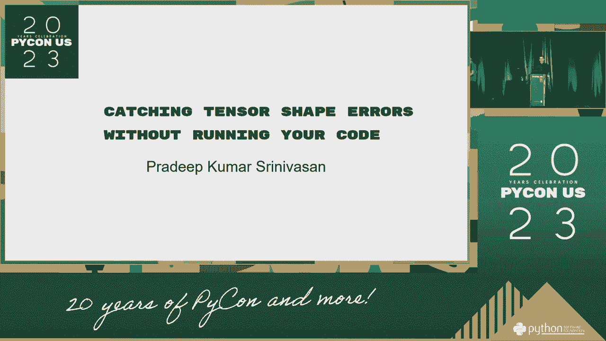

 (inaudible)， (inaudible)， (inaudible)， (inaudible)。
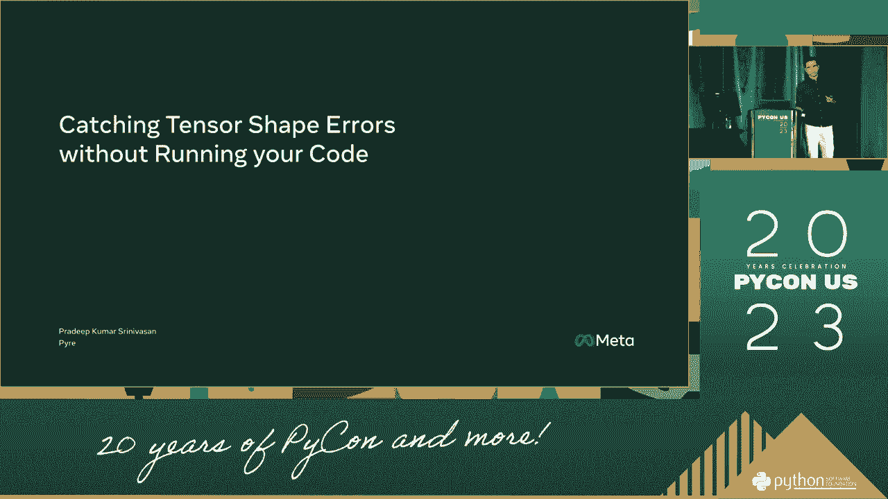

 (inaudible)， (inaudible)， (inaudible)， (inaudible)， (inaudible)。
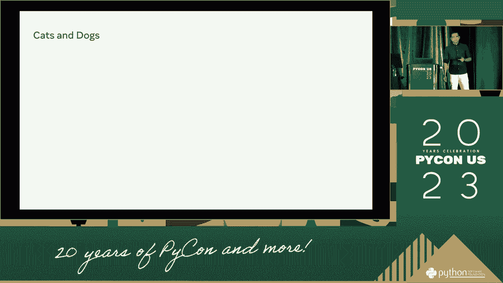

 (inaudible)， (inaudible)， (inaudible)， (inaudible)， (inaudible)， (inaudible)， (inaudible)。
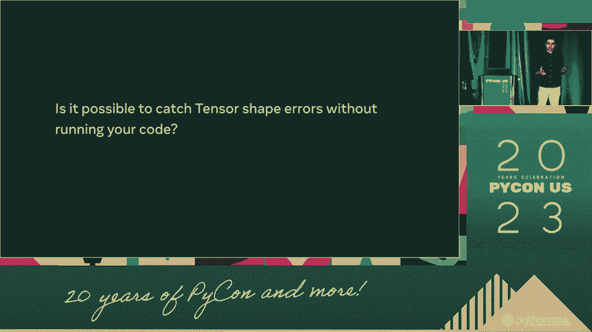

 (inaudible)， (inaudible)， (inaudible)， (inaudible)， (inaudible)， (inaudible)， (inaudible)。 (inaudible)， (inaudible)。

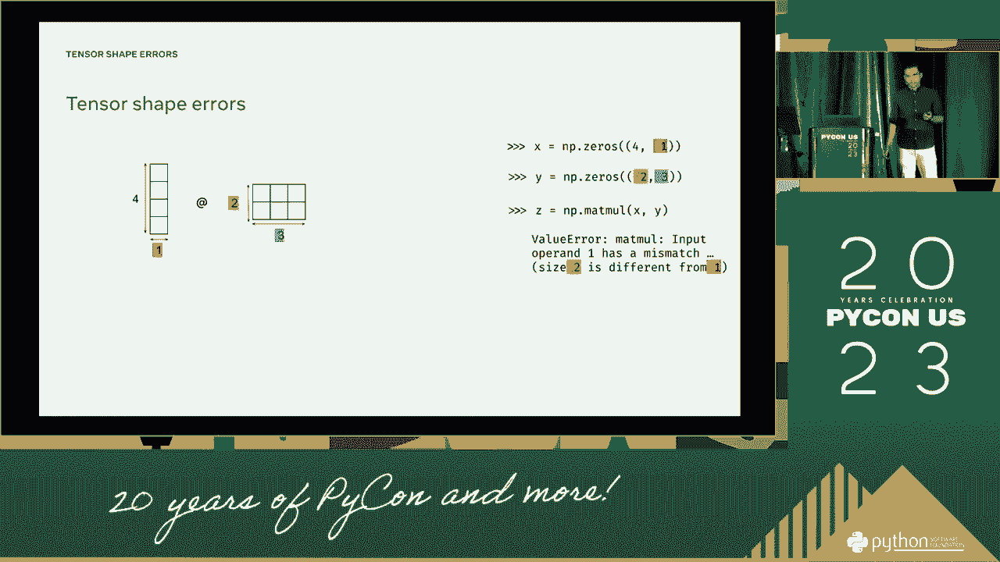

 (inaudible)， (inaudible)。
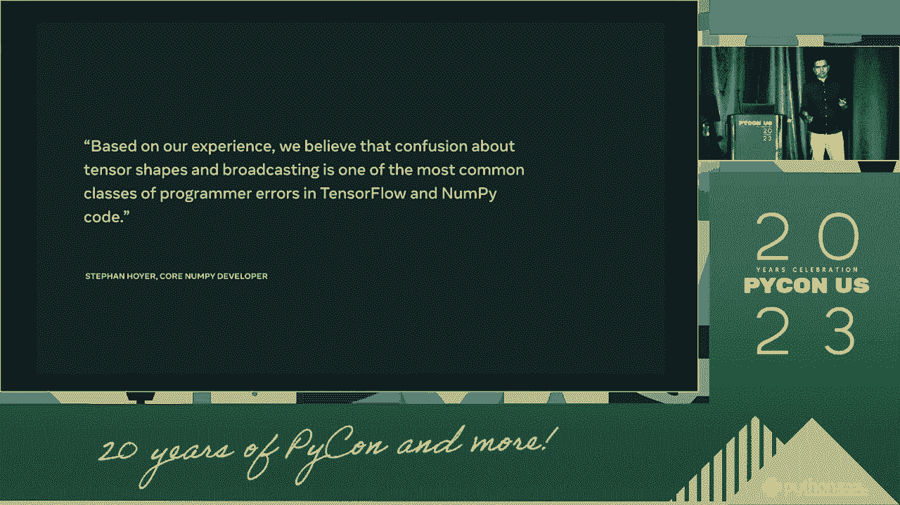

 (inaudible)， (inaudible)， (inaudible)， (inaudible)， (inaudible)， (inaudible)， (inaudible)。 (inaudible)， (inaudible)， (inaudible)， (inaudible)。

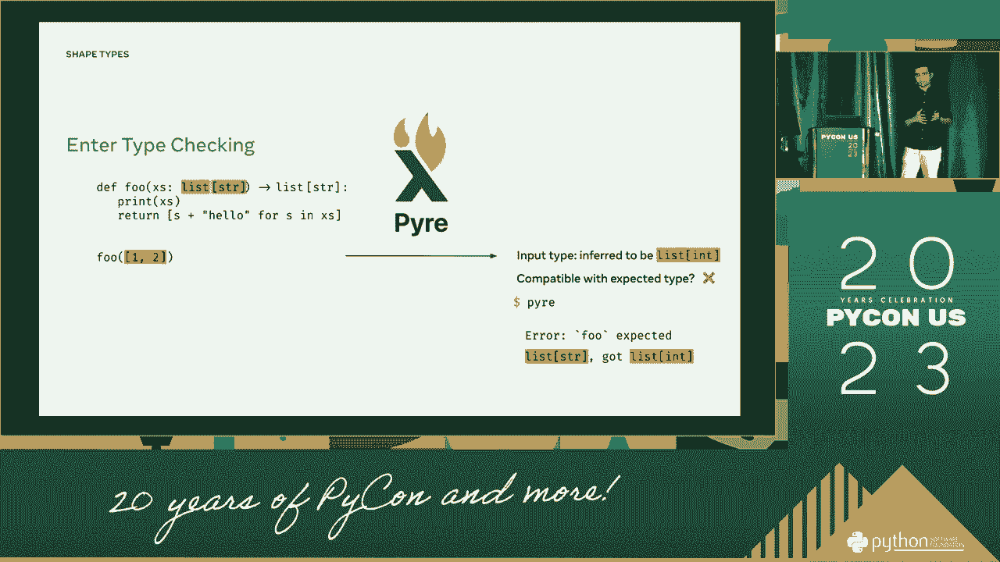

 (inaudible)。
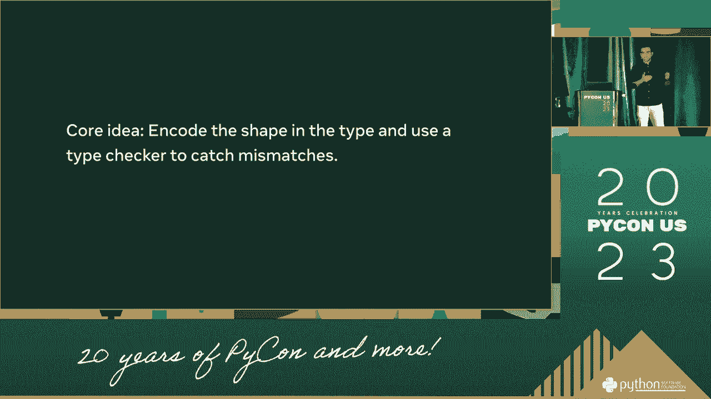

 (inaudible)， (inaudible)， (inaudible)， (inaudible)， (inaudible)， (inaudible)， (inaudible)。 (inaudible)， (inaudible)， (inaudible)， (inaudible)， (inaudible)， (inaudible)， (inaudible)。

 (inaudible)， (inaudible)， (inaudible)， (inaudible)， (inaudible)， (inaudible)， (inaudible)。 (inaudible)， (inaudible)， (inaudible)， (inaudible)， (inaudible)， (inaudible)， (inaudible)。

 (inaudible)， (inaudible)， (inaudible)， (inaudible)。
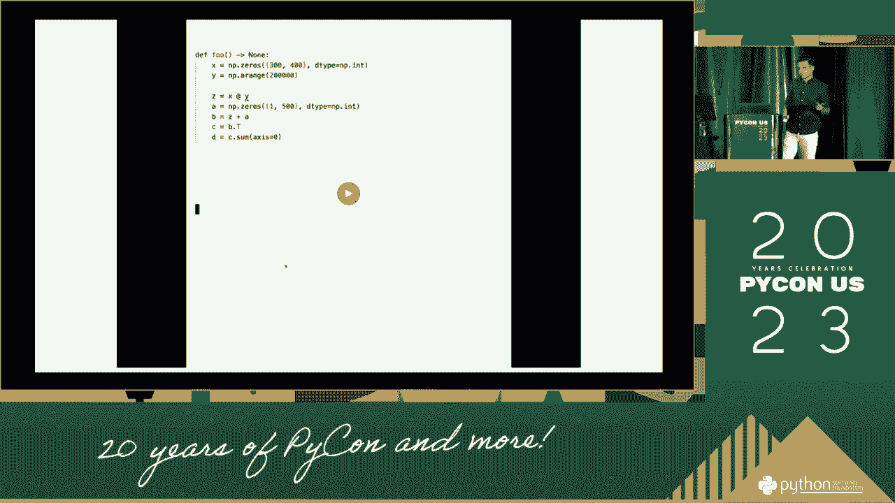

 (inaudible)， (inaudible)， (inaudible)， (inaudible)， (inaudible)， (inaudible)， (inaudible)。 (inaudible)。

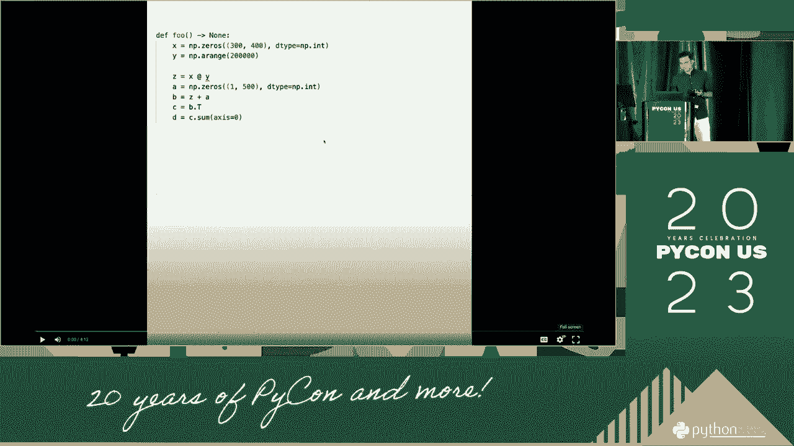

 (inaudible)， (inaudible)， (inaudible)， (inaudible)， (inaudible)， (inaudible)， (inaudible)。

 (inaudible)， (inaudible)， (inaudible)， (inaudible)， (inaudible)， (inaudible)， (inaudible)。 (inaudible)， (inaudible)。

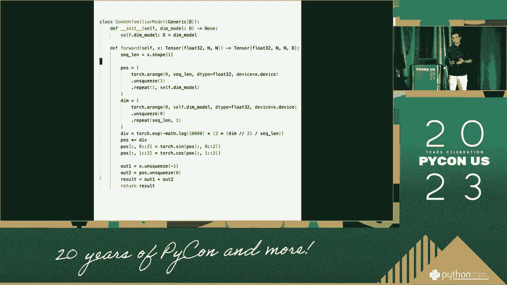

 (inaudible)， (inaudible)， (inaudible)， (inaudible)， (inaudible)， (inaudible)， (inaudible)。 (inaudible)， (inaudible)。

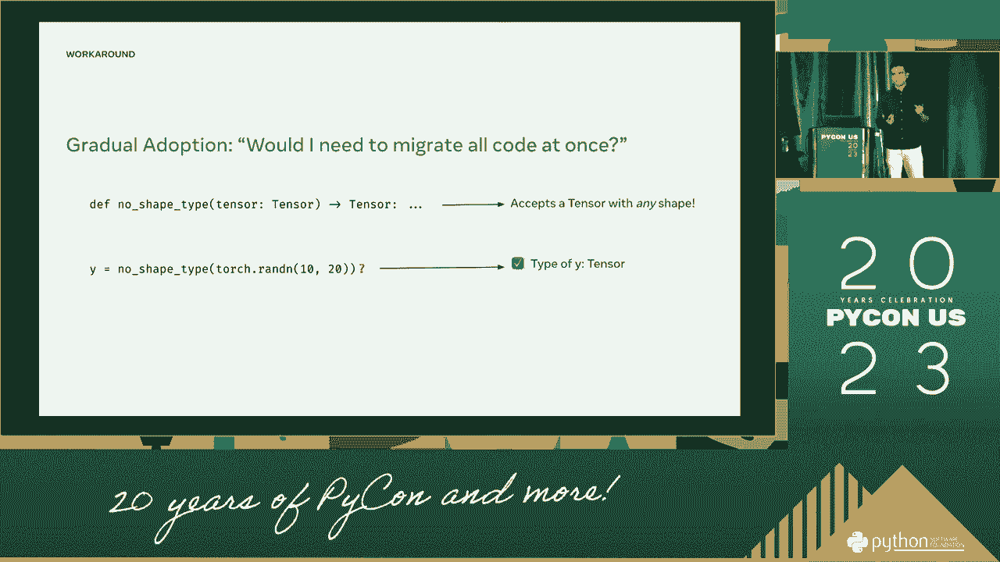

 (inaudible)， (inaudible)， (inaudible)， (inaudible)。
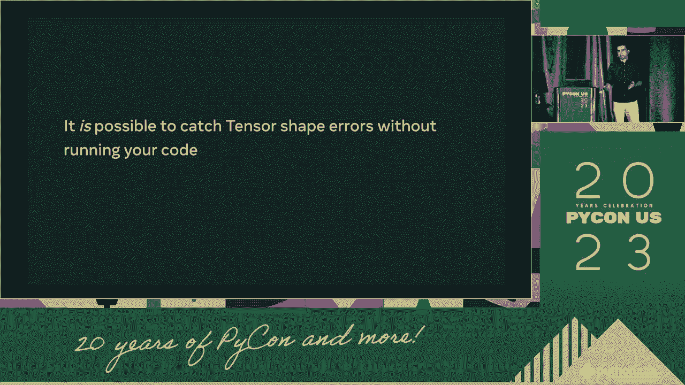

 (inaudible)， (inaudible)， (inaudible)， (inaudible)。
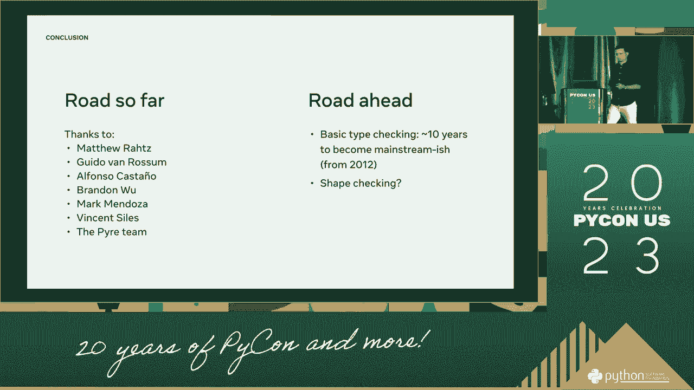

 (inaudible)。