# P64：Talks - Rob de Wit_ Transforming a Jupyter Notebook into a reproducible pipeline - VikingDen7 - BV1114y1o7c5

 All right， good afternoon everyone。 Right on the dot。
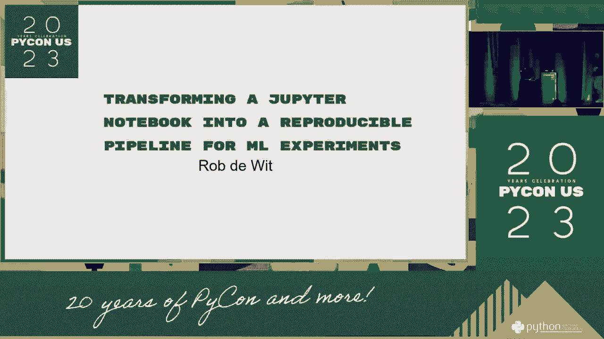

 Thank you all for coming to my presentation。 Today I've launched a new interview talking about our technical talk about the。
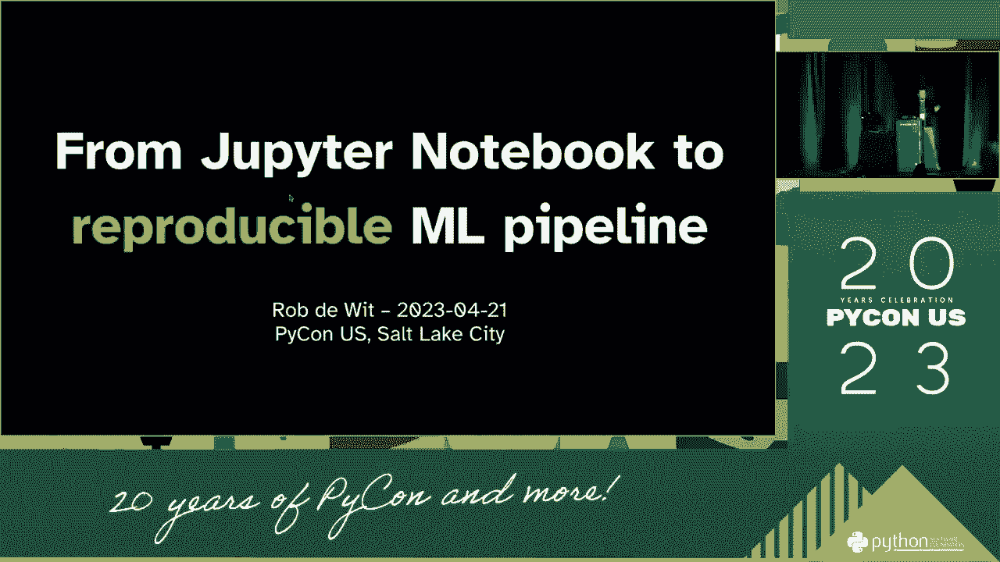

 technology test on the screen of the interview。

 We're going to be talking about the work that we're doing。
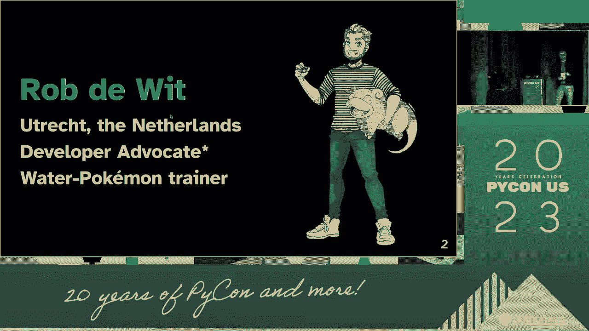

 We're going to be talking about the work that we're doing。 We're going to be talking about the work that we're doing。

 We're going to be talking about the work that we're doing。 We're going to be talking about the work that we're doing。

 We're going to be talking about the work that we're doing。 We're going to be talking about the work that we're doing。

 We're going to be talking about the work that we're doing。 We're going to be talking about the work that we're doing。

 We're going to be talking about the work that we're doing。
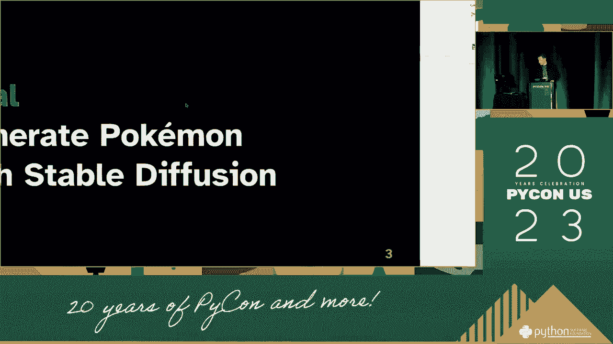

 We're going to be talking about the work that we're doing。 We're going to be talking about the work that we're doing。

 We're going to be talking about the work that we're doing。

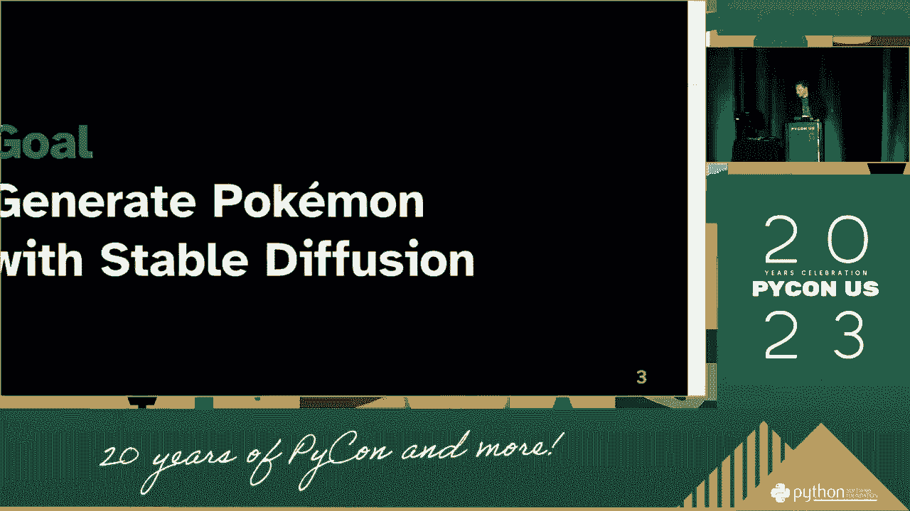

 We're going to be talking about the work that we're doing。
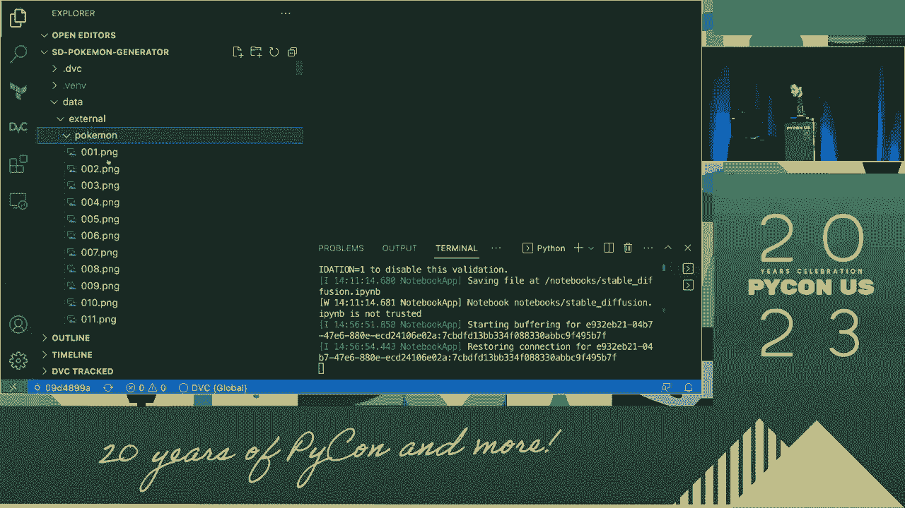

 We're going to be talking about the work that we're doing。 We're going to be talking about the work that we're doing。

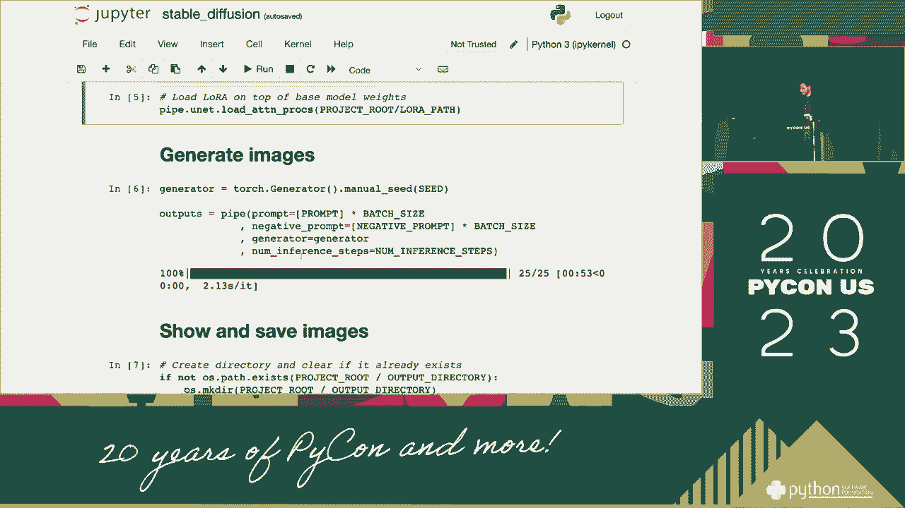

 We're going to be talking about the work that we're doing。 We're going to be talking about the work that we're doing。

 We're going to be talking about the work that we're doing。 We're going to be talking about the work that we're doing。

 We're going to be talking about the work that we're doing。 We're going to be talking about the work that we're doing。

 We're going to be talking about the work that we're doing。 We're going to be talking about the work that we're doing。

 We're going to be talking about the work that we're doing。 We're going to be talking about the work that we're doing。

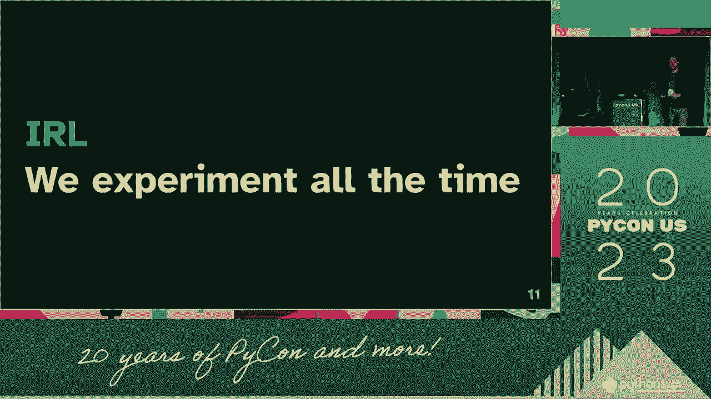

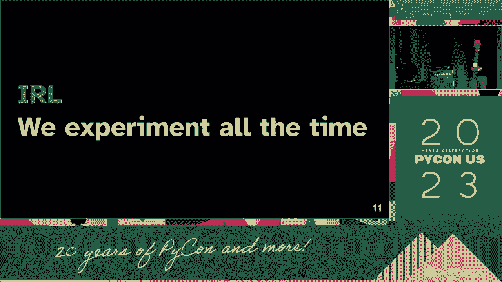

 We're going to be talking about the work that we're doing。 We're going to be talking about the work that we're doing。

 We're going to be talking about the work that we're doing。 We're going to be talking about the work that we're doing。

 We're going to be talking about the work that we're doing。 We're going to be talking about the work that we're doing。

 We're going to be talking about the work that we're doing。 We're going to be talking about the work that we're doing。

 We're going to be talking about the work that we're doing。 We're going to be talking about the work that we're doing。

 We're going to be talking about the work that we're doing。 We're going to be talking about the work that we're doing。

 We're going to be talking about the work that we're doing。 We're going to be talking about the work that we're doing。

 We're going to be talking about the work that we're doing。 We're going to be talking about the work that we're doing。

 We're going to be talking about the work that we're doing。
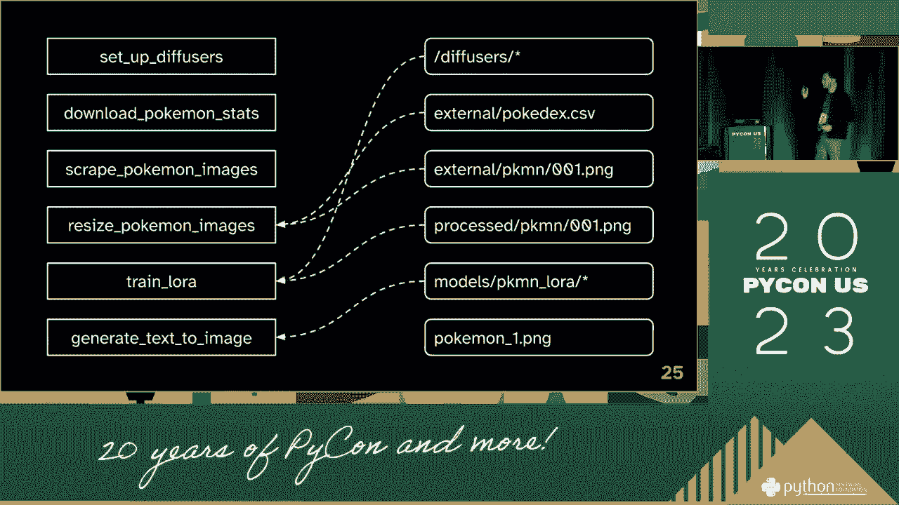

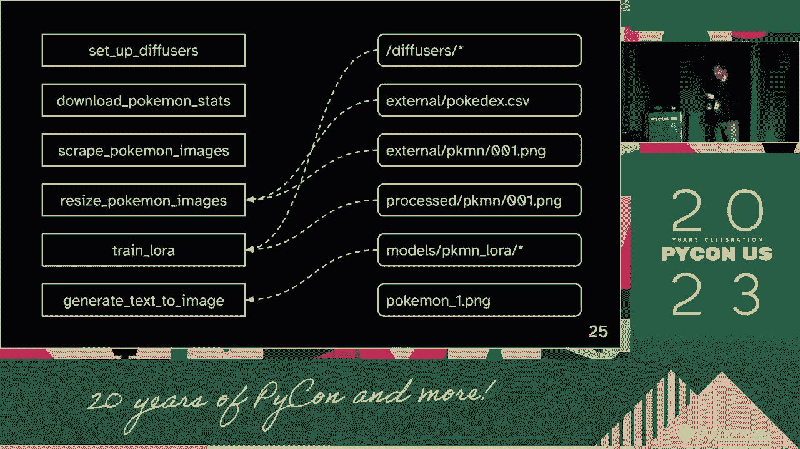

 We're going to be talking about the work that we're doing。
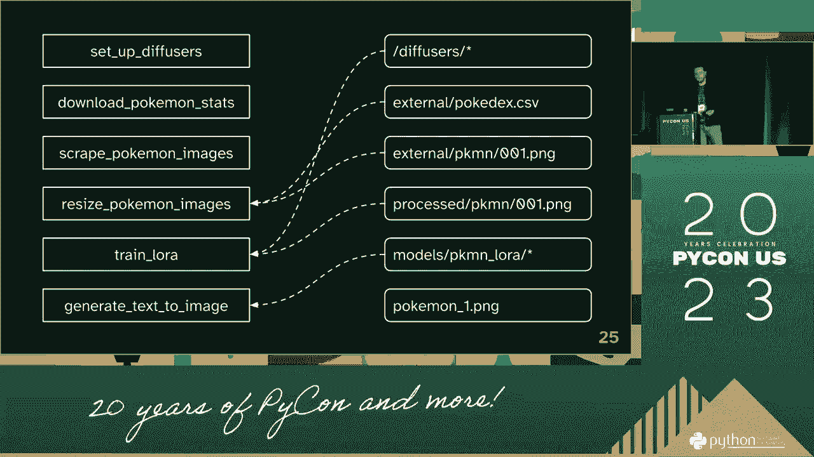

 We're going to be talking about the work that we're doing。 We're going to be talking about the work that we're doing。

 We're going to be talking about the work that we're doing。 We're going to be talking about the work that we're doing。

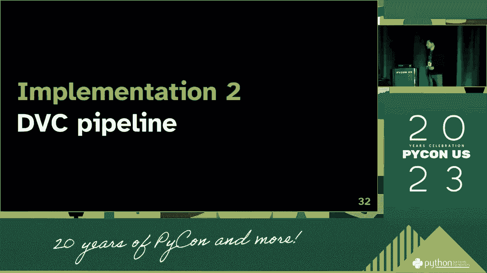

 We're going to be talking about the work that we're doing。 We're going to be talking about the work that we're doing。

 We're going to be talking about the work that we're doing。 We're going to be talking about the work that we're doing。

 We're going to be talking about the work that we're doing。 We're going to be talking about the work that we're doing。

 We're going to be talking about the work that we're doing。 We're going to be talking about the work that we're doing。

 We're going to be talking about the work that we're doing。 We're going to be talking about the work that we're doing。

 We're going to be talking about the work that we're doing。 We're going to be talking about the work that we're doing。

 We're going to be talking about the work that we're doing。 We're going to be talking about the work that we're doing。

 We're going to be talking about the work that we're doing。 We're going to be talking about the work that we're doing。

 We're going to be talking about the work that we're doing。 We're going to be talking about the work that we're doing。

 We're going to be talking about the work that we're doing。 We're going to be talking about the work that we're doing。

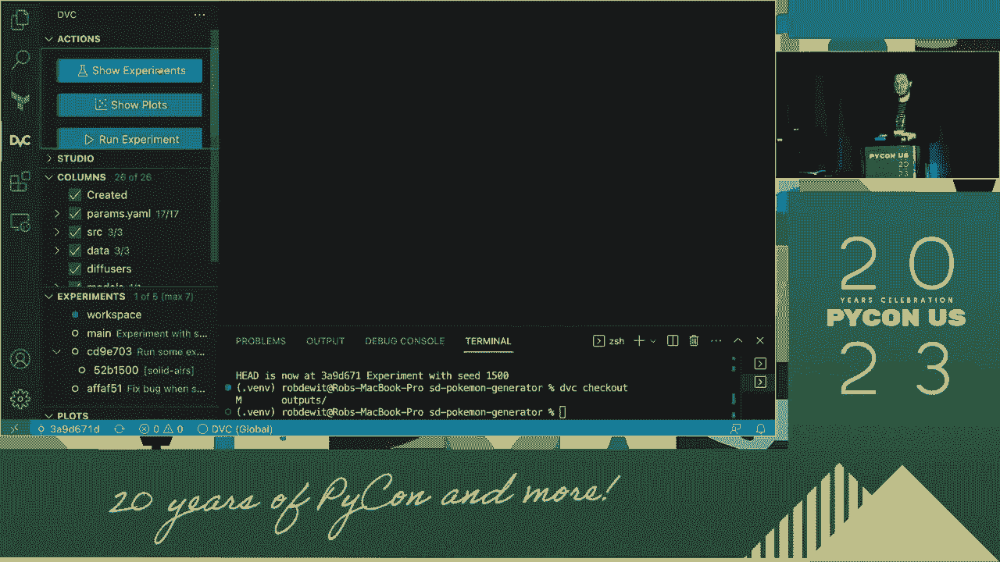

 We're going to be talking about the work that we're doing。 We're going to be talking about the work that we're doing。

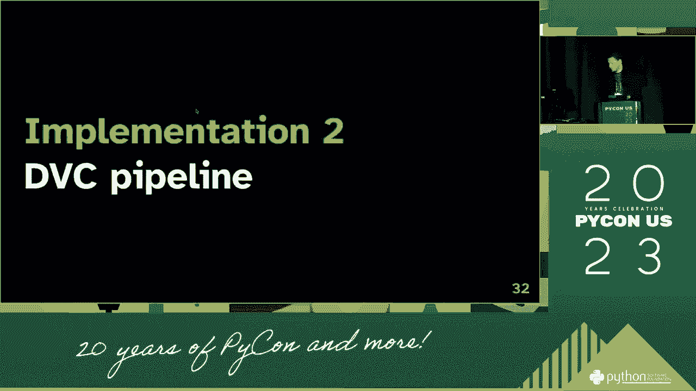

 We're going to be talking about the work that we're doing。 We're going to be talking about the work that we're doing。

 We're going to be talking about the work that we're doing。 We're going to be talking about the work that we're doing。

 We're going to be talking about the work that we're doing。 We're going to be talking about the work that we're doing。

 We're going to be talking about the work that we're doing。
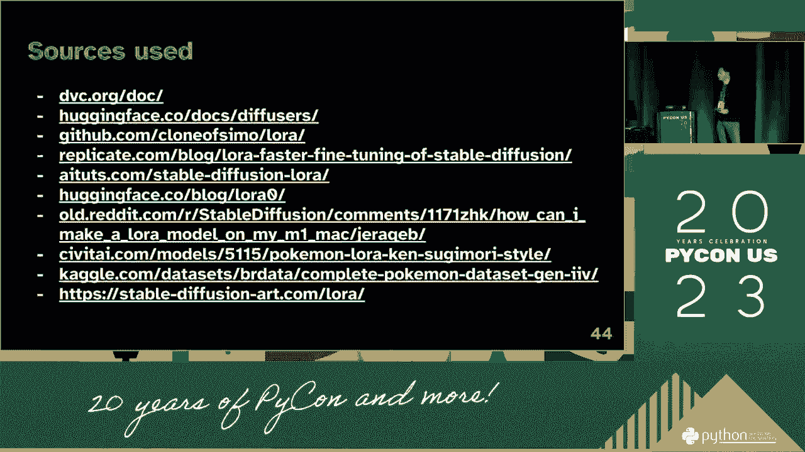

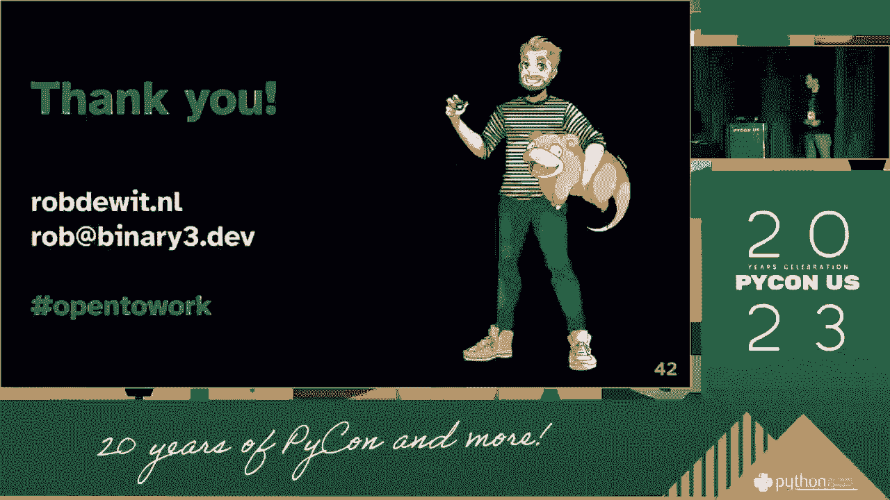