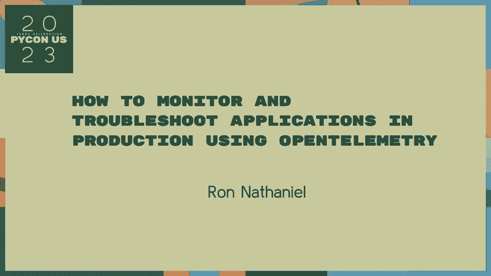
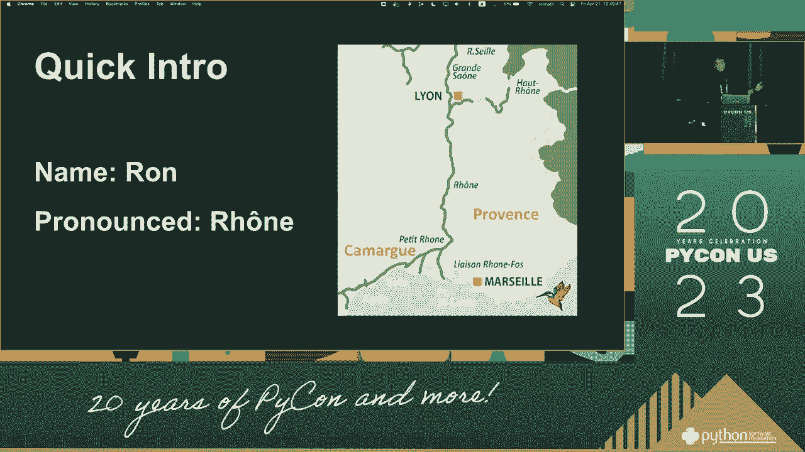
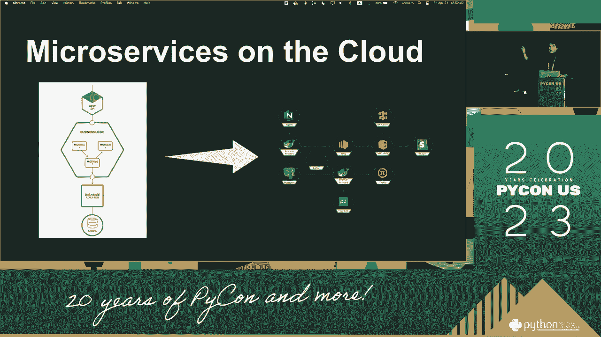
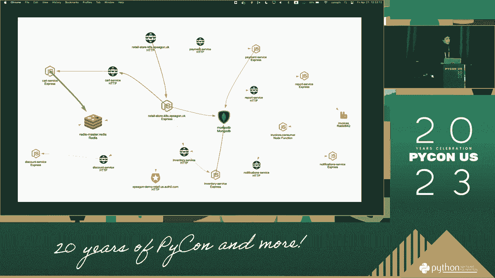
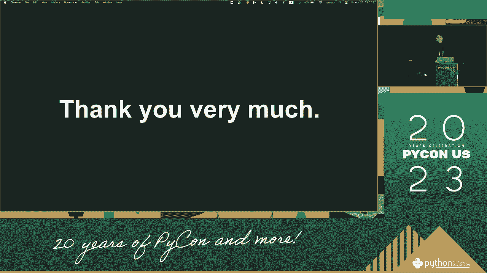
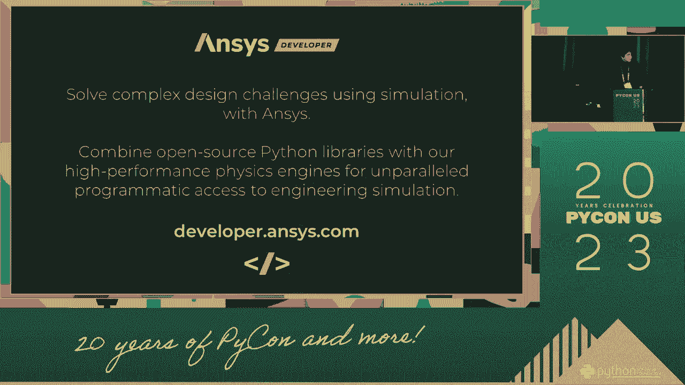
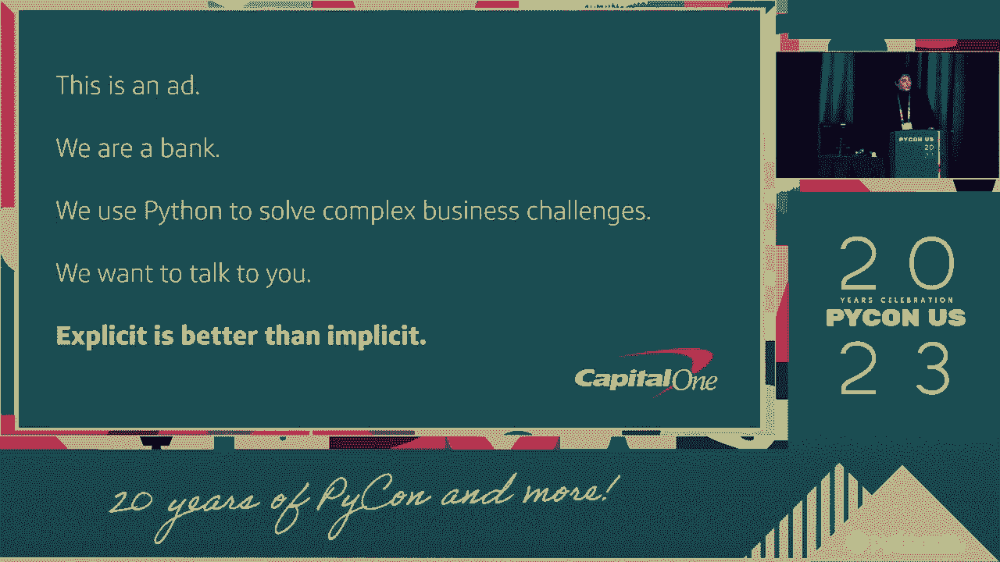
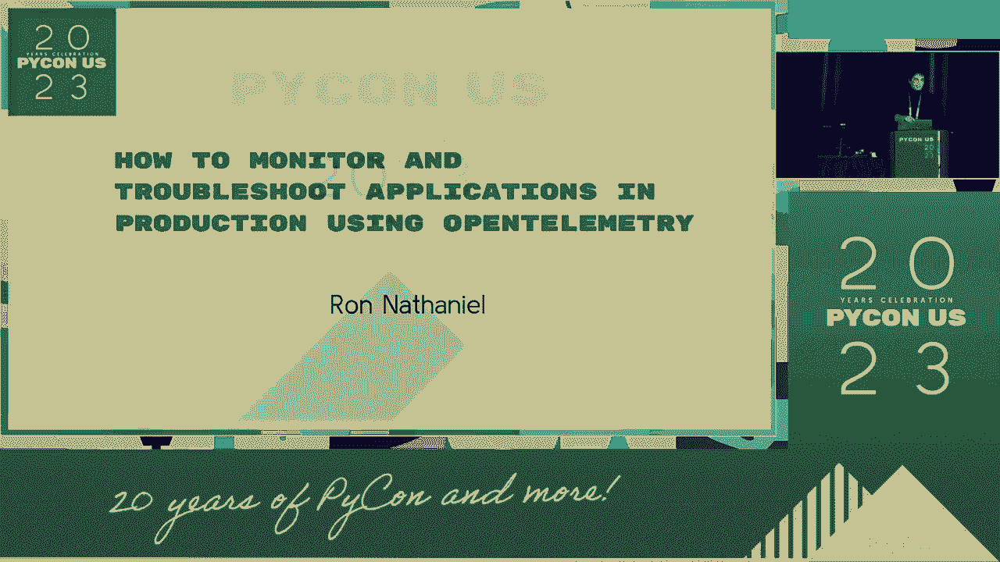

# PyCon US 2023 - P65：Talks - Ron Nathaniel_ How To Monitor and Troubleshoot Applications using OpenTe - VikingDen7 - BV1114y1o7c5

 [inaudible]。

 [inaudible]， [inaudible]， [inaudible]， [inaudible]， [inaudible]。

 [inaudible]， [inaudible]， [inaudible]， [inaudible]， [inaudible]， [inaudible]， [inaudible]。

 [inaudible]， [inaudible]， [inaudible]， [inaudible]， [inaudible]， [inaudible]， [inaudible]。

 [inaudible]， [inaudible]， [inaudible]。

 [inaudible]， [inaudible]。

 [inaudible]， [inaudible]， [inaudible]， [inaudible]， [inaudible]， [inaudible]， [inaudible]。

 [inaudible]， [inaudible]， [inaudible]， [inaudible]， [inaudible]， [inaudible]， [inaudible]。

 [inaudible]， [inaudible]， [inaudible]， [inaudible]， [inaudible]， [inaudible]， [inaudible]。

 [inaudible]， [inaudible]， [inaudible]， [inaudible]， [inaudible]， [inaudible]， [inaudible]。

 [inaudible]， [inaudible]， [inaudible]， [inaudible]， [inaudible]， [inaudible]， [inaudible]。

 [inaudible]， [inaudible]， [inaudible]， [inaudible]， [inaudible]， [inaudible]， [inaudible]。

 [inaudible]， [inaudible]， [inaudible]， [inaudible]， [inaudible]， [inaudible]， [inaudible]。

 [inaudible]， [inaudible]， [inaudible]， [inaudible]， [inaudible]， [inaudible]， [inaudible]。

 [inaudible]。

 [inaudible]， [inaudible]。

 [inaudible]。

 [inaudible]， [inaudible]， [inaudible]， [inaudible]， [inaudible]， [inaudible]， [inaudible]。

 [inaudible]， [inaudible]， [inaudible]， [inaudible]， [inaudible]， [inaudible]， [inaudible]。

 [inaudible]， [inaudible]， [inaudible]。

