# P69：Talks - Shai Geva_ 10 Ways To Shoot Yourself In The Foot With Tests - VikingDen7 - BV1114y1o7c5

 In a way， we can live。 In another way， thank you for coming。 And today I'm going to talk about taking a look at the decision-age。

 but it's a little bit wrong about the context of the project。
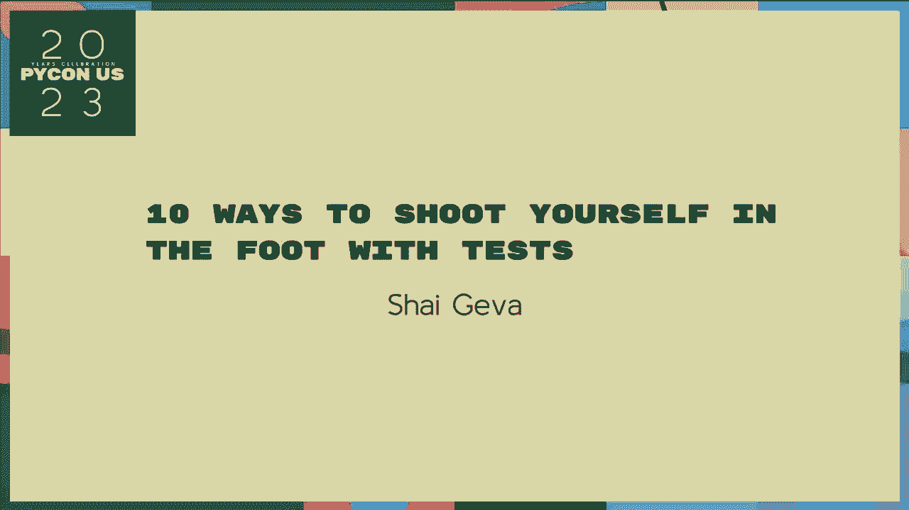

 So， the potential is to have it signed， and I'm going to bring you the same for a while now。 mostly in terms of the region， and we're going to talk about the overall right-hand side of the region。

 The same for the developer， according to the right-hand side。 so that those of you who are important and think of the impact， of the same for a single developer。

 that's a little bit of a problem。 I'm going to talk about the question in a minute。 I thought it was a talk again， because I had to get a very high-end。

 and the work was a very interesting。 I'm going to talk about the context of the region。 because I think people are happy。 You just need to make a more common decision。

 or a little bit more specific。 And another reason is that it is not going to be true。 because it's not going to be true。 It's not going to be true， but it's not going to be true。

 It's not going to be true。 It's not going to be true。 It's not going to be true。 It's not going to be true。 It's not going to be true。 It's not going to be true。

 It's not going to be true。 It's not going to be true。 It's not going to be true。 It's not going to be true。 It's not going to be true。 It's not going to be true。

 It's not going to be true。 It's not going to be true。 It's not going to be true。 It's not going to be true。 It's not going to be true。 It's not going to be true。

 It's not going to be true。 It's not going to be true。 It's not going to be true。 It's not going to be true。 It's not going to be true。 It's not going to be true。

 It's not going to be true。 It's not going to be true。 It's not going to be true。 It's not going to be true。 It's not going to be true。 It's not going to be true。

 It's not going to be true。 It's not going to be true。 It's not going to be true。 It's not going to be true。 It's not going to be true。 It's not going to be true。

 It's not going to be true。 It's not going to be true。 It's not going to be true。 It's not going to be true。 It's not going to be true。 It's not going to be true。

 It's not going to be true。 It's not going to be true。 It's not going to be true。 It's not going to be true。 It's not going to be true。 It's not going to be true。

 It's not going to be true。 It's not going to be true。 It's not going to be true。 It's not going to be true。 It's not going to be true。 It's not going to be true。

 It's not going to be true。 It's not going to be true。 It's not going to be true。 It's not going to be true。 It's not going to be true。 It's not going to be true。

 It's not going to be true。 It's not going to be true。 It's not going to be true。 It's not going to be true。 It's not going to be true。 It's not going to be true。

 It's not going to be true。 It's not going to be true。 It's not going to be true。 It's not going to be true。 It's not going to be true。 It's not going to be true。

 It's not going to be true。 It's not going to be true。 It's not going to be true。 It's not going to be true。 It's not going to be true。 It's not going to be true。

 It's not going to be true。 It's not going to be true。 It's not going to be true。 It's not going to be true。 It's not going to be true。 It's not going to be true。

 It's not going to be true。 It's not going to be true。 It's not going to be true。 It's not going to be true。 It's not going to be true。 It's not going to be true。

 It's not going to be true。 It's not going to be true。 It's not going to be true。 It's not going to be true。 It's not going to be true。 It's not going to be true。

 It's not going to be true。 It's not going to be true。 It's not going to be true。 It's not going to be true。 It's not going to be true。 It's not going to be true。

 It's not going to be true。 It's not going to be true。 It's not going to be true。 It's not going to be true。 It's not going to be true。 It's not going to be true。

 It's not going to be true。 It's not going to be true。 It's not going to be true。 It's not going to be true。 It's not going to be true。 It's not going to be true。

 It's not going to be true。 It's not going to be true。 It's not going to be true。 It's not going to be true。 It's not going to be true。 It's not going to be true。

 It's not going to be true。 It's not going to be true。 It's not going to be true。 It's not going to be true。 It's not going to be true。 It's not going to be true。

 It's not going to be true。 It's not going to be true。 It's not going to be true。 It's not going to be true。 - And I'm not a scientist， I think I'm a scientist。 I'm not a scientist。

 I seem like there's a lot of things that you talk about。 I'm not a illustrative scientist。 I'm not a scientist。 But I'm not a producer。 I'm a supervisor。 I'm a scientist。 I'm a professor。

 a professor。 I'm a professor， a professor。 I'm a professor， a professor， a professor。 I'm a nurse。 a researcher。 I'm a professor， a scholar， a dean， but I'm not a teacher。 I'm a scholar， a teacher。

 and I need to learn from it。 I need to learn from my peers。 and say 'the prime 'the prime 'the prime of the ' prime。 And then it's the end of the topic videos。

 and still it can't even respond to the dialogue towards you。 And often， if it doesn't take a right。 it's probably going to be just to be bad。 Others are going against， it says anything very。

 very quickly but kind of is。 And one day， it makes a point of bounds。 And one will give you。 because it doesn't have a stop and it might be more difficult， to be bad。

 And one will give you a little more and more， it won't take a while。 So then for， I'm saying that。 Those that we use， any of it depends on how it's said。 Also， of course， in our engagement。

 it's going to be done。 So the goal of the solution itself is， first of all。 we got a special single talk about it， before they didn't matter， I did it before。

 But it's really a special thing。 And also， despite the language。 we want the language to be specific in the conclusion。

 And to see the example of time in the one that we saw， I think it broke， and then the general。 I think， about to understand， that we have to worry that we want to go。

 And it seems like work before we can collect。 Usually， but that growth doesn't ever happen。 That's the goal that we want to go to。 So， this is very， very long。 It's also better。

 it's not the most specific。 I've got one problem in the middle of this。 it's more specific than anybody。 It's very confusing， and I'm assuming， we're not sure about this。

 but in any way， it's not going to be true。 So， that's not really accurate。 And then。 that's the goal， that's the goal。 It's not going to be a fact， or in any community， it's not a book。

 It's an advice to a specific language。 It's a language that's not a language。 It's a goal that we need to do。 It's a goal that we need to do。

 That's the goal or a guide for our people， or not for our people， for our families。 For example。 I think we're taking the title， and we have to go to the different title。 So。

 in the beginning of the course， we're going to leave our title。 and then we're going to leave our title。 And we've got to leave that to you。 I mean。

 no matter what the best part of the title， it's important to know that it's correct。 We're not going to summarize and look at it。 It's very， very slow。 Social health， you know。

 where is the government to make？ It's a context of the government's shape。 And it's not what you can't avoid。 So a lot of the times you take up， maybe it's something I just--。

 It's a business having， you think， okay。 The government is very focused。 But the bill is local。 And it's-- Unless you're concerned--， The bill is local。 And it's-- she doesn't find--。

 The bill is judgementable。 No， no-- if it's local， she's still dog-and-dog。 And this once goes out at least in general， I mean， like， too much people are on--。

 So much is going on。 It's going to be three hours of talking， and it's going to be five hours。 It's not going to be five hours。 So， my suggestion is， just try--， I'll do an idea a little bit。

 I'll do one， two， one， two， go along with。 Now I'll work， but it's still--， It's still there。 That's the problem。 We'll just take--， That's all I can do。 This is just my responsibility。

 It's only that--， It's only that--， It's only that you can order， or run around。 If you want to run。 you might get to something like this。 All I have to tell is， I'll take it on what I said earlier。

 Don't--， Just don't do it。 You are full-time， and you're taking the 24th day。 because you're taking the 24th day， because it's nothing but really a 3-3-3。 I mean。

 you're not going to have to get to my body。 And it gets really， really， really bad。 And I'm not--。 And of course， I might get a 3-3-3-3 idea。 I can say that in public education。

 I'm not going to say that in public education， I'm not going to say that in public education。 I'm not going to say that in public education， I'm not going to say that in public education。

 I'm not going to say that in public education， I'm not going to say that in public education。 I'm not going to say that in public education， I'm not going to say that in public education。

 I'm not going to say that in public education， I'm not going to say that in public education。 I'm not going to say that in public education， I'm not going to say that in public education。

 I'm not going to say that in public education， I'm not going to say that in public education。 I'm not going to say that in public education， I'm not going to say that in public education。

 I'm not going to say that in public education， I'm not going to say that in public education。 I'm not going to say that in public education， I'm not going to say that in public education。

 I'm not going to say that in public education， I'm not going to say that in public education。 I'm not going to say that in public education， I'm not going to say that in public education。

 I'm not going to say that in public education， I'm not going to say that in public education。 I'm not going to say that in public education， I'm not going to say that in public education。

 I'm not going to say that in public education， I'm not going to say that in public education。 I'm not going to say that in public education， I'm not going to say that in public education。

 I'm not going to say that in public education， I'm not going to say that in public education。 I'm not going to say that in public education， I'm not going to say that in public education。

 I'm not going to say that in public education， I'm not going to say that in public education。 I'm not going to say that in public education， I'm not going to say that in public education。

 I'm not going to say that in public education， I'm not going to say that in public education。 I'm not going to say that in public education， I'm not going to say that in public education。

 I'm not going to say that in public education， I'm not going to say that in public education。 I'm not going to say that in public education， I'm not going to say that in public education。

 I'm not going to say that in public education， I'm not going to say that in public education。 I'm not going to say that in public education， I'm not going to say that in public education。

 I'm not going to say that in public education。
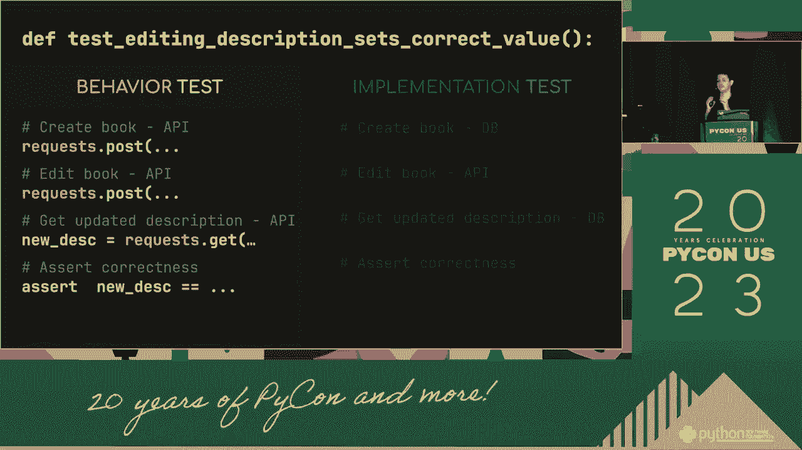

 I'm not going to say that in public education， I'm not going to say that in public education。 I'm not going to say that in public education， I'm not going to say that in public education。

 I'm not going to say that in public education， I'm not going to say that in public education。 I'm not going to say that in public education， I'm not going to say that in public education。

 I'm not going to say that in public education， I'm not going to say that in public education。 I'm not going to say that in public education， I'm not going to say that in public education。

 I'm not going to say that in public education， I'm not going to say that in public education。 I'm not going to say that in public education， I'm not going to say that in public education。

 I'm not going to say that in public education， I'm not going to say that in public education。 I'm not going to say that in public education， I'm not going to say that in public education。

 I'm not going to say that in public education， I'm not going to say that in public education。 I'm not going to say that in public education， I'm not going to say that in public education。

 I'm not going to say that in public education， I'm not going to say that in public education。 I'm not going to say that in public education， I'm not going to say that in public education。

 I'm not going to say that in public education， I'm not going to say that in public education。 I'm not going to say that in public education， I'm not going to say that in public education。

 I'm not going to say that in public education， I'm not going to say that in public education。 I'm not going to say that in public education， I'm not going to say that in public education。

 I'm not going to say that in public education， I'm not going to say that in public education。 I'm not going to say that in public education， I'm not going to say that in public education。

 I'm not going to say that in public education， I'm not going to say that in public education。 I'm not going to say that in public education， I'm not going to say that in public education。

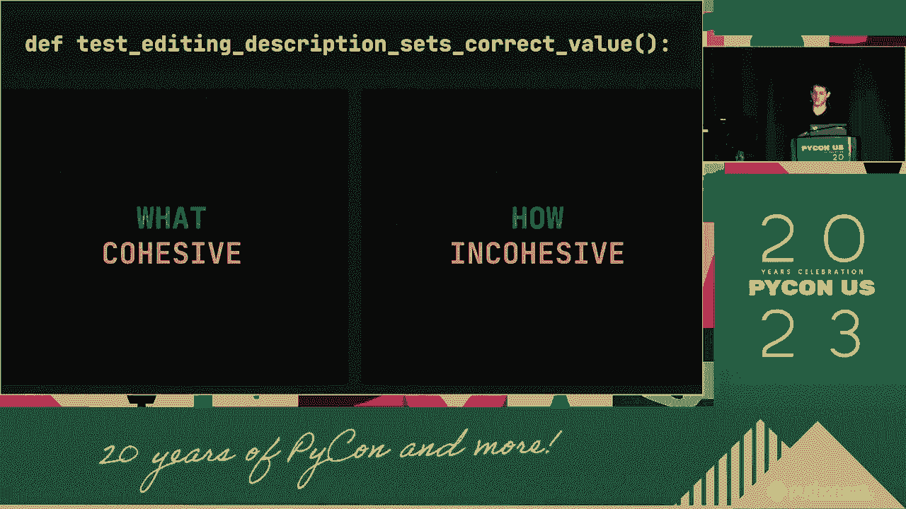

 I'm not going to say that in public education， I'm not going to say that in public education。 I'm not going to say that in public education， I'm not going to say that in public education。

 I'm not going to say that in public education， I'm not going to say that in public education。 I'm not going to say that in public education， I'm not going to say that in public education。

 I'm not going to say that in public education， I'm not going to say that in public education。 I'm not going to say that in public education， I'm not going to say that in public education。

 I'm not going to say that in public education， I'm not going to say that in public education。 I'm not going to say that in public education， I'm not going to say that in public education。

 I'm not going to say that in public education， I'm not going to say that in public education。 I'm not going to say that in public education， I'm not going to say that in public education。

 I'm not going to say that in public education， I'm not going to say that in public education。 I'm not going to say that in public education， I'm not going to say that in public education。

 I'm not going to say that in public education， I'm not going to say that in public education。 I'm not going to say that in public education， I'm not going to say that in public education。

 I'm not going to say that in public education， I'm not going to say that in public education。 I'm not going to say that in public education， I'm not going to say that in public education。

 I'm not going to say that in public education， I'm not going to say that in public education。 I'm not going to say that in public education， I'm not going to say that in public education。

 I'm not going to say that in public education， I'm not going to say that in public education。 I'm not going to say that in public education， I'm not going to say that in public education。

 I'm not going to say that in public education， I'm not going to say that in public education。 I'm not going to say that in public education， I'm not going to say that in public education。

 I'm not going to say that in public education， I'm not going to say that in public education。 I'm not going to say that in public education， I'm not going to say that in public education。

 I'm not going to say that in public education， I'm not going to say that in public education。 I'm not going to say that in public education， I'm not going to say that in public education。

 I'm not going to say that in public education， I'm not going to say that in public education。 I'm not going to say that in public education， I'm not going to say that in public education。

 I'm not going to say that in public education， I'm not going to say that in public education。 I'm not going to say that in public education， I'm not going to say that in public education。

 I'm not going to say that in public education， I'm not going to say that in public education。 I'm not going to say that in public education， I'm not going to say that in public education。

 I'm not going to say that in public education， I'm not going to say that in public education。 I'm not going to say that in public education， I'm not going to say that in public education。

 I'm not going to say that in public education， I'm not going to say that in public education。 I'm not going to say that in public education， I'm not going to say that in public education。

 I'm not going to say that in public education， I'm not going to say that in public education。 I'm not going to say that in public education， I'm not going to say that in public education。

 I'm not going to say that in public education， I'm not going to say that in public education。 I'm not going to say that in public education， I'm not going to say that in public education。

 I'm not going to say that in public education， I'm not going to say that in public education。 I'm not going to say that in public education， I'm not going to say that in public education。

 I'm not going to say that in public education， I'm not going to say that in public education。 I'm not going to say that in public education， I'm not going to say that in public education。

 I'm not going to say that in public education， I'm not going to say that in public education。 I'm not going to say that in public education， I'm not going to say that in public education。

 I'm not going to say that in public education， I'm not going to say that in public education。 I'm not going to say that in public education， I'm not going to say that in public education。

 I'm not going to say that in public education， I'm not going to say that in public education。 I'm not going to say that in public education， I'm not going to say that in public education。

 I'm not going to say that in public education， I'm not going to say that in public education。 I'm not going to say that in public education， I'm not going to say that in public education。

 I'm not going to say that in public education， I'm not going to say that in public education。 I'm not going to say that in public education， I'm not going to say that in public education。

 I'm not going to say that in public education， I'm not going to say that in public education。 I'm not going to say that in public education， I'm not going to say that in public education。

 I'm not going to say that in public education， I'm not going to say that in public education。 I'm not going to say that in public education， I'm not going to say that in public education。

 I'm not going to say that in public education， I'm not going to say that in public education。 I'm not going to say that in public education， I'm not going to say that in public education。

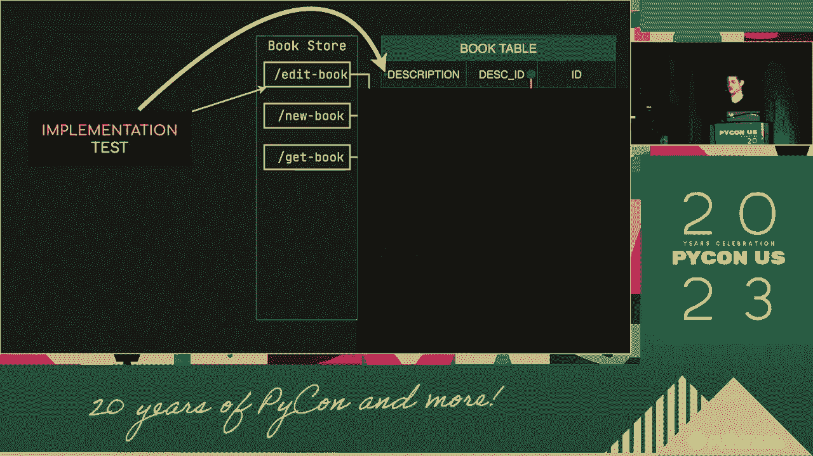

 I'm not going to say that in public education， I'm not going to say that in public education。 I'm not going to say that in public education， I'm not going to say that in public education。

 I'm not going to say that in public education， I'm not going to say that in public education。 I'm not going to say that in public education， I'm not going to say that in public education。

 I'm not going to say that in public education， I'm not going to say that in public education。 I'm not going to say that in public education， I'm not going to say that in public education。

 I'm not going to say that in public education， I'm not going to say that in public education。 I'm not going to say that in public education， I'm not going to say that in public education。

 I'm not going to say that in public education， I'm not going to say that in public education。 I'm not going to say that in public education， I'm not going to say that in public education。

 I'm not going to say that in public education， I'm not going to say that in public education。
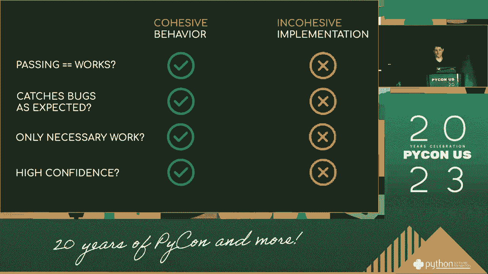

 I'm not going to say that in public education， I'm not going to say that in public education。 I'm not going to say that in public education， I'm not going to say that in public education。

 I'm not going to say that in public education， I'm not going to say that in public education。 I'm not going to say that in public education， I'm not going to say that in public education。

 I'm not going to say that in public education， I'm not going to say that in public education。 I'm not going to say that in public education， I'm not going to say that in public education。

 I'm not going to say that in public education， I'm not going to say that in public education。 I'm not going to say that in public education， I'm not going to say that in public education。

 I'm not going to say that in public education， I'm not going to say that in public education。 I'm not going to say that in public education， I'm not going to say that in public education。

 I'm not going to say that in public education， I'm not going to say that in public education。 I'm not going to say that in public education， I'm not going to say that in public education。

 I'm not going to say that in public education， I'm not going to say that in public education。 I'm not going to say that in public education， I'm not going to say that in public education。

 I'm not going to say that in public education， I'm not going to say that in public education。 I'm not going to say that in public education， I'm not going to say that in public education。

 I'm not going to say that in public education， I'm not going to say that in public education。 I'm not going to say that in public education， I'm not going to say that in public education。

 I'm not going to say that in public education， I'm not going to say that in public education。 I'm not going to say that in public education， I'm not going to say that in public education。

 I'm not going to say that in public education， I'm not going to say that in public education。 I'm not going to say that in public education， I'm not going to say that in public education。

 I'm not going to say that in public education， I'm not going to say that in public education。 I'm not going to say that in public education， I'm not going to say that in public education。

 I'm not going to say that in public education， I'm not going to say that in public education。 I'm not going to say that in public education， I'm not going to say that in public education。

 I'm not going to say that in public education， I'm not going to say that in public education。 I'm not going to say that in public education， I'm not going to say that in public education。

 I'm not going to say that in public education， I'm not going to say that in public education。 I'm not going to say that in public education， I'm not going to say that in public education。

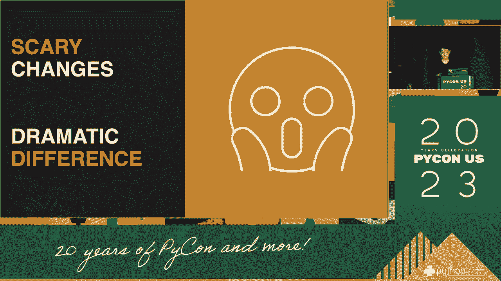

 I'm not going to say that in public education， I'm not going to say that in public education。 I'm not going to say that in public education， I'm not going to say that in public education。

 I'm not going to say that in public education， I'm not going to say that in public education。 I'm not going to say that in public education， I'm not going to say that in public education。

 I'm not going to say that in public education， I'm not going to say that in public education。 I'm not going to say that in public education， I'm not going to say that in public education。

 I'm not going to say that in public education， I'm not going to say that in public education。 I'm not going to say that in public education， I'm not going to say that in public education。

 I'm not going to say that in public education， I'm not going to say that in public education。 I'm not going to say that in public education， I'm not going to say that in public education。

 I'm not going to say that in public education， I'm not going to say that in public education。 I'm not going to say that in public education， I'm not going to say that in public education。

 I'm not going to say that in public education， I'm not going to say that in public education。 I'm not going to say that in public education， I'm not going to say that in public education。

 I'm not going to say that in public education， I'm not going to say that in public education。 I'm not going to say that in public education， I'm not going to say that in public education。

 I'm not going to say that in public education， I'm not going to say that in public education。 I'm not going to say that in public education， I'm not going to say that in public education。

 I'm not going to say that in public education， I'm not going to say that in public education。 I'm not going to say that in public education， I'm not going to say that in public education。

 I'm not going to say that in public education， I'm not going to say that in public education。 I'm not going to say that in public education， I'm not going to say that in public education。

 I'm not going to say that in public education， I'm not going to say that in public education。 I'm not going to say that in public education， I'm not going to say that in public education。

 I'm not going to say that in public education， I'm not going to say that in public education。 I'm not going to say that in public education， I'm not going to say that in public education。

 I'm not going to say that in public education， I'm not going to say that in public education。 I'm not going to say that in public education， I'm not going to say that in public education。

 I'm not going to say that in public education， I'm not going to say that in public education。
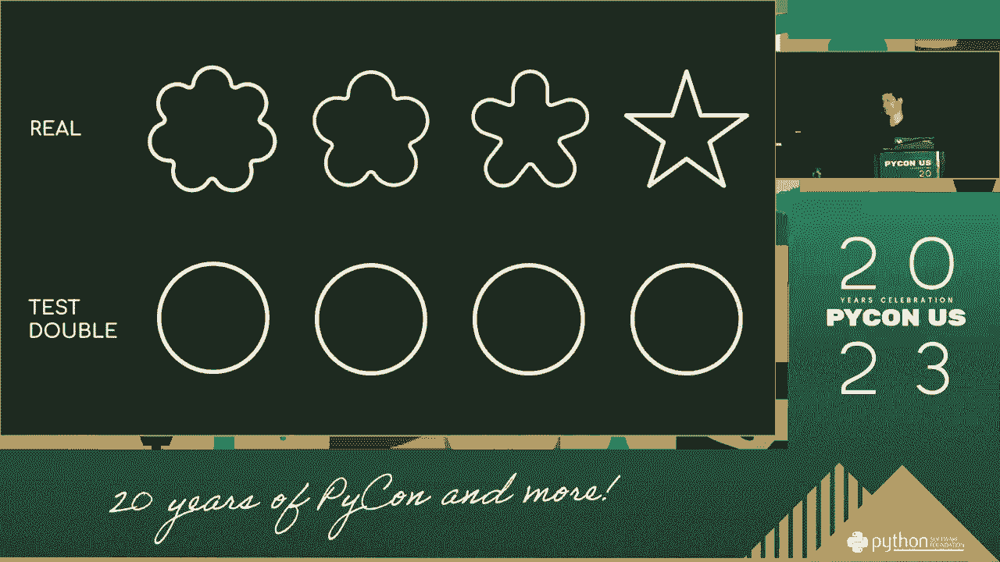

 I'm not going to say that in public education， I'm not going to say that in public education。 I'm not going to say that in public education， I'm not going to say that in public education。

 I'm not going to say that in public education， I'm not going to say that in public education。 I'm not going to say that in public education， I'm not going to say that in public education。

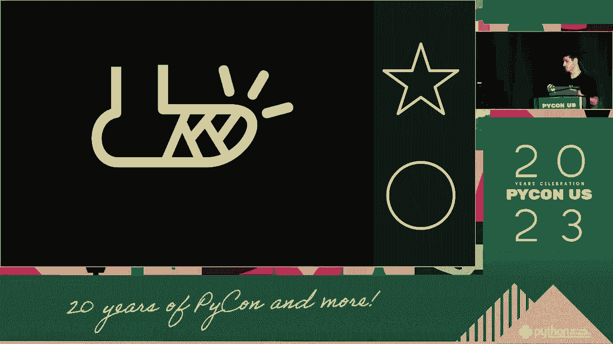

 I'm not going to say that in public education， I'm not going to say that in public education。 I'm not going to say that in public education， I'm not going to say that in public education。

 I'm not going to say that in public education， I'm not going to say that in public education。 I'm not going to say that in public education， I'm not going to say that in public education。

 I'm not going to say that in public education， I'm not going to say that in public education。 I'm not going to say that in public education， I'm not going to say that in public education。

 I'm not going to say that in public education， I'm not going to say that in public education。 I'm not going to say that in public education， I'm not going to say that in public education。

 I'm not going to say that in public education， I'm not going to say that in public education。 I'm not going to say that in public education， I'm not going to say that in public education。

 I'm not going to say that in public education， I'm not going to say that in public education。 I'm not going to say that in public education， I'm not going to say that in public education。

 I'm not going to say that in public education， I'm not going to say that in public education。 I'm not going to say that in public education， I'm not going to say that in public education。

 I'm not going to say that in public education， I'm not going to say that in public education。 I'm not going to say that in public education， I'm not going to say that in public education。

 I'm not going to say that in public education， I'm not going to say that in public education。 I'm not going to say that in public education， I'm not going to say that in public education。

 I'm not going to say that in public education， I'm not going to say that in public education。 I'm not going to say that in public education， I'm not going to say that in public education。

 I'm not going to say that in public education， I'm not going to say that in public education。 I'm not going to say that in public education， I'm not going to say that in public education。

 I'm not going to say that in public education， I'm not going to say that in public education。 I'm not going to say that in public education， I'm not going to say that in public education。

 I'm not going to say that in public education， I'm not going to say that in public education。 I'm not going to say that in public education， I'm not going to say that in public education。

 I'm not going to say that in public education， I'm not going to say that in public education。 I'm not going to say that in public education， I'm not going to say that in public education。

 I'm not going to say that in public education， I'm not going to say that in public education。 I'm not going to say that in public education， I'm not going to say that in public education。

 I'm not going to say that in public education， I'm not going to say that in public education。 I'm not going to say that in public education， I'm not going to say that in public education。

 I'm not going to say that in public education， I'm not going to say that in public education。 I'm not going to say that in public education， I'm not going to say that in public education。

 I'm not going to say that in public education， I'm not going to say that in public education。 I'm not going to say that in public education， I'm not going to say that in public education。

 I'm not going to say that in public education， I'm not going to say that in public education。 I'm not going to say that in public education， I'm not going to say that in public education。

 I'm not going to say that in public education， I'm not going to say that in public education。 I'm not going to say that in public education， I'm not going to say that in public education。

 I'm not going to say that in public education， I'm not going to say that in public education。 I'm not going to say that in public education， I'm not going to say that in public education。

 I'm not going to say that in public education， I'm not going to say that in public education。 I'm not going to say that in public education， I'm not going to say that in public education。

 I'm not going to say that in public education， I'm not going to say that in public education。 I'm not going to say that in public education， I'm not going to say that in public education。

 I'm not going to say that in public education， I'm not going to say that in public education。 I'm not going to say that in public education， I'm not going to say that in public education。

 I'm not going to say that in public education， I'm not going to say that in public education。 I'm not going to say that in public education， I'm not going to say that in public education。

 I'm not going to say that in public education， I'm not going to say that in public education。 I'm not going to say that in public education， I'm not going to say that in public education。

 I'm not going to say that in public education， I'm not going to say that in public education。 I'm not going to say that in public education， I'm not going to say that in public education。

 I'm not going to say that in public education， I'm not going to say that in public education。 I'm not going to say that in public education， I'm not going to say that in public education。

 I'm not going to say that in public education， I'm not going to say that in public education。 I'm not going to say that in public education， I'm not going to say that in public education。

 I'm not going to say that in public education， I'm not going to say that in public education。 I'm not going to say that in public education， I'm not going to say that in public education。

 I'm not going to say that in public education， I'm not going to say that in public education。 I'm not going to say that in public education， I'm not going to say that in public education。

 I'm not going to say that in public education， I'm not going to say that in public education。 I'm not going to say that in public education， I'm not going to say that in public education。

 I'm not going to say that in public education， I'm not going to say that in public education。 I'm not going to say that in public education， I'm not going to say that in public education。

 I'm not going to say that in public education， I'm not going to say that in public education。 I'm not going to say that in public education， I'm not going to say that in public education。

 I'm not going to say that in public education， I'm not going to say that in public education。 I'm not going to say that in public education， I'm not going to say that in public education。

 I'm not going to say that in public education， I'm not going to say that in public education。 I'm not going to say that in public education， I'm not going to say that in public education。

 I'm not going to say that in public education， I'm not going to say that in public education。 I'm not going to say that in public education， I'm not going to say that in public education。

 I'm not going to say that in public education， I'm not going to say that in public education。 I'm not going to say that in public education， I'm not going to say that in public education。

 I'm not going to say that in public education， I'm not going to say that in public education。 I'm not going to say that in public education， I'm not going to say that in public education。

 I'm not going to say that in public education， I'm not going to say that in public education。 I'm not going to say that in public education， I'm not going to say that in public education。

 I'm not going to say that in public education， I'm not going to say that in public education。 I'm not going to say that in public education， I'm not going to say that in public education。

 I'm not going to say that in public education， I'm not going to say that in public education。 I'm not going to say that in public education， I'm not going to say that in public education。

 I'm not going to say that in public education， I'm not going to say that in public education。 I'm not going to say that in public education， I'm not going to say that in public education。

 I'm not going to say that in public education， I'm not going to say that in public education。 I'm not going to say that in public education， I'm not going to say that in public education。

 I'm not going to say that in public education， I'm not going to say that in public education。 I'm not going to say that in public education， I'm not going to say that in public education。

 I'm not going to say that in public education， I'm not going to say that in public education。 I'm not going to say that in public education， I'm not going to say that in public education。

 I'm not going to say that in public education， I'm not going to say that in public education。 I'm not going to say that in public education， I'm not going to say that in public education。

 I'm not going to say that in public education， I'm not going to say that in public education。 I'm not going to say that in public education， I'm not going to say that in public education。

 I'm not going to say that in public education。
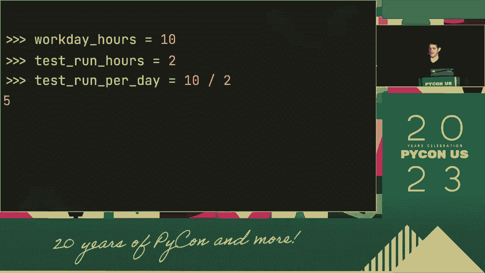

 I'm not going to say that in public education， I'm not going to say that in public education。 I'm not going to say that in public education， I'm not going to say that in public education。

 I'm not going to say that in public education， I'm not going to say that in public education。 I'm not going to say that in public education， I'm not going to say that in public education。

 I'm not going to say that in public education， I'm not going to say that in public education。 I'm not going to say that in public education， I'm not going to say that in public education。

 I'm not going to say that in public education， I'm not going to say that in public education。 I'm not going to say that in public education， I'm not going to say that in public education。

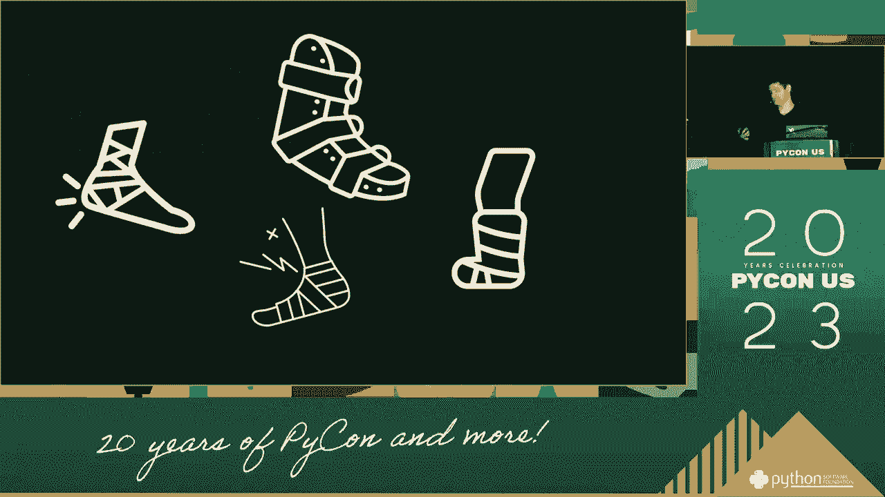

 I'm not going to say that in public education， I'm not going to say that in public education。 I'm not going to say that in public education， I'm not going to say that in public education。

 I'm not going to say that in public education， I'm not going to say that in public education。 I'm not going to say that in public education， I'm not going to say that in public education。

 I'm not going to say that in public education， I'm not going to say that in public education。 I'm not going to say that in public education， I'm not going to say that in public education。

 I'm not going to say that in public education， I'm not going to say that in public education。 I'm not going to say that in public education， I'm not going to say that in public education。

 I'm not going to say that in public education， I'm not going to say that in public education。 I'm not going to say that in public education， I'm not going to say that in public education。

 I'm not going to say that in public education， I'm not going to say that in public education。 I'm not going to say that in public education， I'm not going to say that in public education。

 I'm not going to say that in public education， I'm not going to say that in public education。 I'm not going to say that in public education， I'm not going to say that in public education。

 I'm not going to say that in public education， I'm not going to say that in public education。 I'm not going to say that in public education， I'm not going to say that in public education。

 I'm not going to say that in public education， I'm not going to say that in public education。 I'm not going to say that in public education， I'm not going to say that in public education。

 I'm not going to say that in public education， I'm not going to say that in public education。 I'm not going to say that in public education， I'm not going to say that in public education。

 I'm not going to say that in public education， I'm not going to say that in public education。 I'm not going to say that in public education， I'm not going to say that in public education。

 I'm not going to say that in public education， I'm not going to say that in public education。 I'm not going to say that in public education， I'm not going to say that in public education。

 I'm not going to say that in public education， I'm not going to say that in public education。 I'm not going to say that in public education， I'm not going to say that in public education。

 I'm not going to say that in public education， I'm not going to say that in public education。 I'm not going to say that in public education， I'm not going to say that in public education。

 I'm not going to say that in public education， I'm not going to say that in public education。 I'm not going to say that in public education， I'm not going to say that in public education。

 I'm not going to say that in public education， I'm not going to say that in public education。 I'm not going to say that in public education， I'm not going to say that in public education。

 I'm not going to say that in public education， I'm not going to say that in public education。 I'm not going to say that in public education， I'm not going to say that in public education。

 I'm not going to say that in public education， I'm not going to say that in public education。 I'm not going to say that in public education， I'm not going to say that in public education。

 I'm not going to say that in public education， I'm not going to say that in public education。 I'm not going to say that in public education， I'm not going to say that in public education。

 I'm not going to say that in public education， I'm not going to say that in public education。 I'm not going to say that in public education， I'm not going to say that in public education。

 I'm not going to say that in public education， I'm not going to say that in public education。 I'm not going to say that in public education， I'm not going to say that in public education。

 I'm not going to say that in public education， I'm not going to say that in public education。 I'm not going to say that in public education， I'm not going to say that in public education。

 I'm not going to say that in public education， I'm not going to say that in public education。 I'm not going to say that in public education， I'm not going to say that in public education。

 I'm not going to say that in public education， I'm not going to say that in public education。 I'm not going to say that in public education， I'm not going to say that in public education。

 I'm not going to say that in public education， I'm not going to say that in public education。 I'm not going to say that in public education， I'm not going to say that in public education。

 I'm not going to say that in public education， I'm not going to say that in public education。 I'm not going to say that in public education， I'm not going to say that in public education。

 I'm not going to say that in public education， I'm not going to say that in public education。 I'm not going to say that in public education， I'm not going to say that in public education。

 I'm not going to say that in public education， I'm not going to say that in public education。 I'm not going to say that in public education， I'm not going to say that in public education。

 I'm not going to say that in public education， I'm not going to say that in public education。 I'm not going to say that in public education， I'm not going to say that in public education。

 I'm not going to say that in public education， I'm not going to say that in public education。 I'm not going to say that in public education， I'm not going to say that in public education。

 I'm not going to say that in public education， I'm not going to say that in public education。 I'm not going to say that in public education， I'm not going to say that in public education。

 I'm not going to say that in public education， I'm not going to say that in public education。 I'm not going to say that in public education， I'm not going to say that in public education。

 I'm not going to say that in public education， I'm not going to say that in public education。 I'm not going to say that in public education， I'm not going to say that in public education。

 I'm not going to say that in public education， I'm not going to say that in public education。 I'm not going to say that in public education， I'm not going to say that in public education。

 I'm not going to say that in public education， I'm not going to say that in public education。 I'm not going to say that in public education， I'm not going to say that in public education。

 I'm not going to say that in public education， I'm not going to say that in public education。 I'm not going to say that in public education， I'm not going to say that in public education。

 I'm not going to say that in public education， I'm not going to say that in public education。 I'm not going to say that in public education， I'm not going to say that in public education。

 I'm not going to say that in public education， I'm not going to say that in public education。 I'm not going to say that in public education， I'm not going to say that in public education。

 I'm not going to say that in public education， I'm not going to say that in public education。 I'm not going to say that in public education， I'm not going to say that in public education。

 I'm not going to say that in public education， I'm not going to say that in public education。 I'm not going to say that in public education， I'm not going to say that in public education。

 I'm not going to say that in public education， I'm not going to say that in public education。 I'm not going to say that in public education， I'm not going to say that in public education。

 I'm not going to say that in public education， I'm not going to say that in public education。 I'm not going to say that in public education， I'm not going to say that in public education。

 I'm not going to say that in public education， I'm not going to say that in public education。 I'm not going to say that in public education， I'm not going to say that in public education。

 I'm not going to say that in public education， I'm not going to say that in public education。 I'm not going to say that in public education， I'm not going to say that in public education。

 I'm not going to say that in public education， I'm not going to say that in public education。 I'm not going to say that in public education， I'm not going to say that in public education。

 I'm not going to say that in public education， I'm not going to say that in public education。 I'm not going to say that in public education， I'm not going to say that in public education。

 I'm not going to say that in public education， I'm not going to say that in public education。 I'm not going to say that in public education， I'm not going to say that in public education。

 I'm not going to say that in public education， I'm not going to say that in public education。 I'm not going to say that in public education， I'm not going to say that in public education。

 I'm not going to say that in public education， I'm not going to say that in public education。 I'm not going to say that in public education， I'm not going to say that in public education。

 I'm not going to say that in public education， I'm not going to say that in public education。 I'm not going to say that in public education， I'm not going to say that in public education。

 I'm not going to say that in public education， I'm not going to say that in public education。 I'm not going to say that in public education， I'm not going to say that in public education。

 I'm not going to say that in public education， I'm not going to say that in public education。 I'm not going to say that in public education， I'm not going to say that in public education。

 I'm not going to say that in public education， I'm not going to say that in public education。 I'm not going to say that in public education， I'm not going to say that in public education。

 I'm not going to say that in public education， I'm not going to say that in public education。 I'm not going to say that in public education， I'm not going to say that in public education。

 I'm not going to say that in public education， I'm not going to say that in public education。 I'm not going to say that in public education， I'm not going to say that in public education。

 I'm not going to say that in public education， I'm not going to say that in public education。 I'm not going to say that in public education， I'm not going to say that in public education。

 I'm not going to say that in public education， I'm not going to say that in public education。 I'm not going to say that in public education， I'm not going to say that in public education。

 I'm not going to say that in public education， I'm not going to say that in public education。 I'm not going to say that in public education， I'm not going to say that in public education。

 I'm not going to say that in public education， I'm not going to say that in public education。 I'm not going to say that in public education， I'm not going to say that in public education。

 I'm not going to say that in public education， I'm not going to say that in public education。 I'm not going to say that in public education， I'm not going to say that in public education。

 I'm not going to say that in public education， I'm not going to say that in public education。 I'm not going to say that in public education， I'm not going to say that in public education。

 I'm not going to say that in public education， I'm not going to say that in public education。 I'm not going to say that in public education， I'm not going to say that in public education。

 I'm not going to say that in public education， I'm not going to say that in public education。 I'm not going to say that in public education， I'm not going to say that in public education。

 I'm not going to say that in public education， I'm not going to say that in public education。 I'm not going to say that in public education， I'm not going to say that in public education。

 I'm not going to say that in public education， I'm not going to say that in public education。 I'm going to say that in public education， I'm going to say that in public education。

 I'm going to say that in public education， I'm going to say that in public education。 I'm going to say that in public education， I'm going to say that in public education。

 I'm going to say that in public education， I'm going to say that in public education。 I'm going to say that in public education， I'm going to say that in public education。

 I'm going to say that in public education， I'm going to say that in public education。 I'm going to say that in public education， I'm going to say that in public education。

 I'm going to say that in public education， I'm going to say that in public education。 I'm going to say that in public education， I'm going to say that in public education。

 I'm going to say that in public education， I'm going to say that in public education。 I'm going to say that in public education， I'm going to say that in public education。

 I'm going to say that in public education， I'm going to say that in public education。 I'm going to say that in public education， I'm going to say that in public education。

 I'm going to say that in public education， I'm going to say that in public education。 I'm going to say that in public education， I'm going to say that in public education。

 I'm going to say that in public education， I'm going to say that in public education。 I'm going to say that in public education， I'm going to say that in public education。

 I'm going to say that in public education， I'm going to say that in public education。 I'm going to say that in public education， I'm going to say that in public education。

 I'm going to say that in public education， I'm going to say that in public education。 I'm going to say that in public education， I'm going to say that in public education。

 I'm going to say that in public education， I'm going to say that in public education。 I'm going to say that in public education， I'm going to say that in public education。

 I'm going to say that in public education， I'm going to say that in public education。 I'm going to say that in public education， I'm going to say that in public education。

 I'm going to say that in public education， I'm going to say that in public education。 I'm going to say that in public education， I'm going to say that in public education。

 I'm going to say that in public education， I'm going to say that in public education。 I'm going to say that in public education， I'm going to say that in public education。

 I'm going to say that in public education， I'm going to say that in public education。 I'm going to say that in public education， I'm going to say that in public education。

 I'm going to say that in public education， I'm going to say that in public education。 I'm going to say that in public education， I'm going to say that in public education。

 I'm going to say that in public education， I'm going to say that in public education。 I'm going to say that in public education， I'm going to say that in public education。

 I'm going to say that in public education， I'm going to say that in public education。 I'm going to say that in public education， I'm going to say that in public education。

 I'm going to say that in public education， I'm going to say that in public education。 I'm going to say that in public education， I'm going to say that in public education。

 I'm going to say that in public education， I'm going to say that in public education。 I'm going to say that in public education， I'm going to say that in public education。

 I'm going to say that in public education， I'm going to say that in public education。 I'm going to say that in public education， I'm going to say that in public education。

 I'm going to say that in public education， I'm going to say that in public education。 I'm going to say that in public education， I'm going to say that in public education。

 I'm going to say that in public education， I'm going to say that in public education。 I'm going to say that in public education， I'm going to say that in public education。

 I'm going to say that in public education， I'm going to say that in public education。 I'm going to say that in public education， I'm going to say that in public education。

 I'm going to say that in public education， I'm going to say that in public education。 I'm going to say that in public education， I'm going to say that in public education。

 I'm going to say that in public education， I'm going to say that in public education。 I'm going to say that in public education， I'm going to say that in public education。

 I'm going to say that in public education， I'm going to say that in public education。 I'm going to say that in public education， I'm going to say that in public education。

 I'm going to say that in public education。
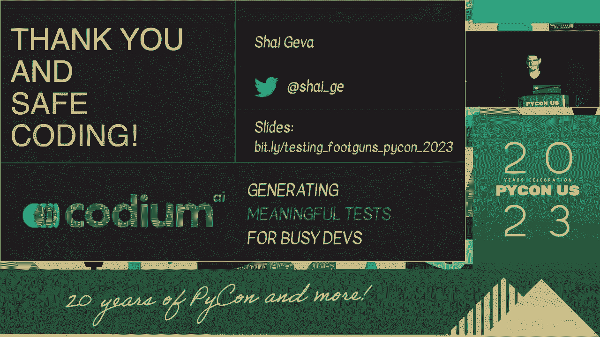