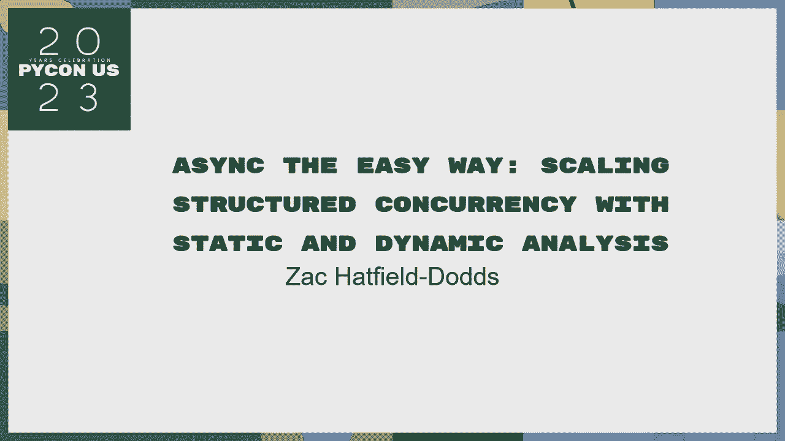
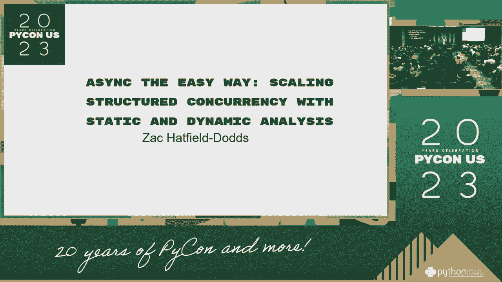
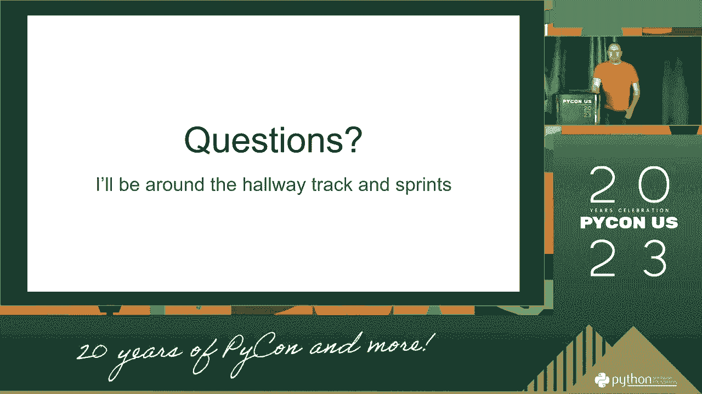

# PyCon US 2023 - P76：Talks - Zac Hatfield-Dodds_ Async_ scaling structured concurrency with static an - VikingDen7 - BV1114y1o7c5

 [ Inaudible ]。

 [ Inaudible ]， [ Inaudible ]， [ Inaudible ]， [ Inaudible ]， [ Inaudible ]， [ Inaudible ]。

 [ Inaudible ]， [ Inaudible ]， [ Inaudible ]， [ Inaudible ]， [ Inaudible ]， [ Inaudible ]。

 [ Inaudible ]， [ Inaudible ]， [ Inaudible ]， [ Inaudible ]， [ Inaudible ]， [ Inaudible ]。

 [ Inaudible ]， [ Inaudible ]， [ Inaudible ]， [ Inaudible ]， [ Inaudible ]， [ Inaudible ]。

 [ Inaudible ]， [ Inaudible ]， [ Inaudible ]， [ Inaudible ]， [ Inaudible ]， [ Inaudible ]。

 [ Inaudible ]， [ Inaudible ]， [ Inaudible ]， [ Inaudible ]， [ Inaudible ]， [ Inaudible ]。

 [ Inaudible ]， [ Inaudible ]， [ Inaudible ]， [ Inaudible ]， [ Inaudible ]， [ Inaudible ]。

 [ Inaudible ]， [ Inaudible ]。

 [ Silence ]。