# PyCon US 2023 - P78：Tutorials - Geir Arne Hjelle_ Introduction to Decorators_ Power Up Your Python C - VikingDen7 - BV1114y1o7c5

好啦。

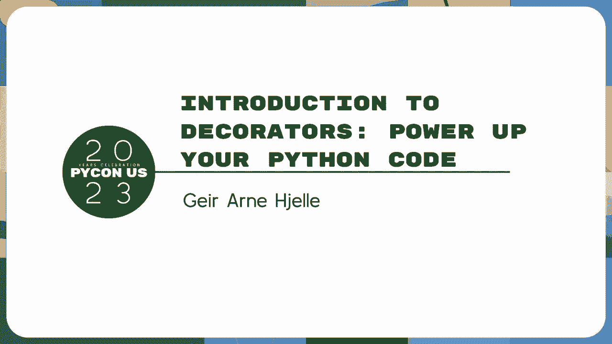

嘿嘿，我有一个完美的声音，嗨，大家好，我是加达尼埃拉，这是一个关于德格拉的教程，所以首先感谢大家的到来，在这里见到这么多人真是太好了，我只想告诉你们一点今天的计划，我想是那口井，我们会讨论创作者和。

第一部分我会有点摇摇欲坠，站在这里给你们举几个例子，然后我们很快就会进入更多的互动环节，在那里你会做一些练习，然后你得和他们玩一会儿，之后我们会讨论一些解决方案，并进行不同的练习，所以在我开始之前。

获取概述，你们中有多少人以前写过自己的装饰师，所以你们中的一些人，你们中有多少人有意识地，你们中有多少人不知道什么是完美的装饰，然后我们就有了一个很好的，很高兴听到你反对，我相信在这一切结束时。

你们都会自己写装潢书，并希望对如何使用它们有一些好的想法，看起来我有幻灯片，但这些只是练习，剩下的一切都会发生，现场直播，之后我会把一切都放在我的GitHub上，所以我会和你分享GitHub链接。

所以你可以找到我之后写的所有代码，但这有点，这个想法是你也要自己打字，所以说，然后让我看看能不能把这些东西弄得像样点。

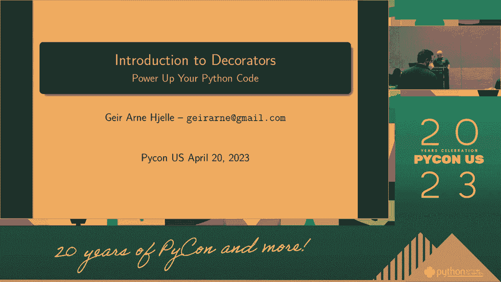

所以我们基本上有，我将使用一个编辑器在上面显示一些代码，然后我也想有，让我们看看我们是否能做到这一点，到那边去，有点像这样的屏幕，在右手边，我只是我在运行ipython，让我们看看我们是否能做到这一点。

我在运行ipython，它是一个交互式Python Repl，如果您没有安装ipython，请随意键入Python并使用您在那里的repl，Ipython带来了一些细节，比如，更容易找到你的历史。

四处走动，诸如此类的事情，但我们要做的都是非常基本的Python，所以我们可以像这样用我们的Repl，在颜色方面，我想我会试着让一切，假设我们不需要那个背景，所以为了确保所有内容都是可读的。

我想我也可以。

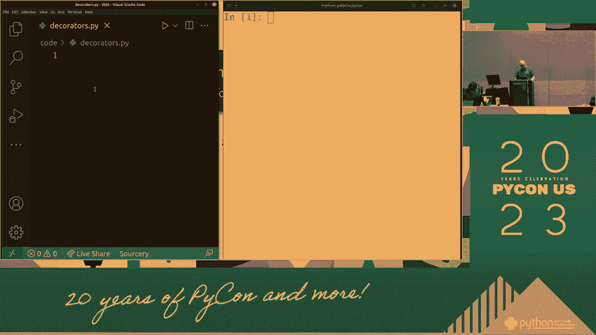

让我们切换这个，字体够大吗，你能从后面看到他们吗？完美的是的，凯蒂，好东西，我们应该差不多准备好了，至少，所以首先，我只是想给你们一个简短的概述，什么是装修师，然后我们会稍微看一下。

它实际上是关于如何调用和定义函数，所以我们会稍微讨论一下什么是函数，如何处理Python中的函数，所以这只是一个小的，像这样的概述，然后就像我后来说的，我们会调查一下，你自己是如何定义这些东西的，等等。

所以首先让我给你们看一些例子，装修工在外面，我走了，至少一开始我们会用到很多玩具的例子，所以看起来装饰师是用来做愚蠢的例子的，但它们实际上相当强大，你也可以用它们来做真正的东西，是啊，是啊。

请允许我在开头介绍一些玩具的例子，我想我选择它们更多的是因为它们的可解释性，可以这么说，那么它们的用处，至少第一个，好的好的，所以我要开始了，只需导入时间库，也许主要是因为我只是想炫耀一些慢的东西。

而不是创建一个需要很长时间运行的函数，我们只做，做简单的事情，在我们的功能中睡一段时间，然后这个呢，我只想定义一个函数，我称之为慢方块，所以它会接收一个数字，然后它就会平方这个数字。

但它会非常缓慢地这样做，所以不一定很有用，但它可以向我们展示一些我们将使用的东西，所以让我们看看，我们开始吧，至少通过说我们将睡给定的秒数，所以是的，只是想说清楚，这是一个f弦，让我看看。

我现在要把这个稍微宽一点吗？然后我们再把它放回去，所以只是为了让人们知道一些事情正在发生，然后让我们真的睡觉，所以我就睡一小会儿，然后我们实际上会做，做好数字平方的工作，所以这个慢平方函数。

它只是平方一个数字，但非常缓慢，例如，我们可以做，我们可以把数字3平方，三秒钟后，我们就把9号拿出来，我真的不想走正路，非常大的数字，因为那需要很长时间，但你可以看到每次我叫这个的时候，需要一些时间。

现在把这更多地想象成你在做一些手术，你在做一些功能，出于正常原因，这实际上需要时间，所以你可能想避免一遍又一遍地做那个操作，Python附带了一个标准库，称为缓存的装饰器，所以这个可以用来缓存结果。

也就是说我们已经计算过了，所以只要回想一下之前的结果，我们可以使用的一种方法是，我现在可以使用，我可以定义一个缓存的正方形，就是这样，我定义一下，通过将这个装饰函数应用到我的慢平方函数中。

所以现在我们还不知道这个缓存在做什么，除非我们去读文件或类似的东西，因此，可能不清楚这个缓存是否可以应用于这样的函数，但现在让我们相信这行得通，所以你可以在这里看到，实际发生了什么，这不是增加了慢方块。

或者我把现金应用到慢方，看看这个的结果，所以如果我们现在用三个调用缓存方块，然后我们可以注意到它又睡了三秒钟，所以这又需要一点时间，但现在如果我叫它第二次，你可以看到我得到了立竿见影的结果。

它根本没有打印出三秒钟的睡眠，所以它实际上所做的完全被跳过了，我函数的第二次调用，因为它知道返回值是9，当它这样叫它的时候，如果我改变这里的参数，所以我还是看二的正方形吧，我们会再看到的。

它又回去睡觉了，因为现在我有不同的参数发送进来，然后睡两秒钟，然后我们拿回四个，但现在这个也被缓存了，所以如果我打电话给Square，我马上就明白了，它有一些记忆，所以如果我回去，调用缓存方块三。

那也是立竿见影的，所以这一切，最后一件事不是关于装潢师的，装修的部分只是现金，是个装修工，那么装修师能做什么呢，它们可以从外部改变功能，所以就在这里我没有，我没有对我的慢平方函数做任何事情。

但我改变了慢平方函数的工作方式，而不是每次打电话都慢吞吞的，现在它突然缓存结果，我可以做到这一点，而不需要进去改变功能本身，所以这就是我们通常使用装饰器的目的。

我们可以将一些行为或某些东西应用于不同的函数，所以这方面的不同例子是，例如，如果你建立了一些网站，你可以说你要去的一些路线，您需要登录，有些你不知道，你可以把日志放在装饰器中。

所以很容易说这些是私人页面，这些是公共页面，例如，或者您需要对某些功能进行计时，你可以有一个计时器，可以定时的装饰师，我们稍后会举一个例子，也许你有一些功能有时会失败，所以你只想重试。

所以你可以重试直到成功，所以你可以用不同的方式在外面添加一些行为，一个非常强大的，我猜，从数值分析的事情，你可以说我想把及时编译应用到一个函数中，让它跑得更快，这也是你只需要一个装饰师就可以做的事情。

非常简短，只是为了向您展示使用装饰器的典型语法，因为如果你见过装潢师，他们通常看起来不像六号中的那个，这是装饰你的功能的一种方法，但通常是在定义函数本身时，所以我们也可以定义缓存方块，让我看看。

我们可以在上面做这个，有了这个AT符号，所以在符号缓存中意味着现在我正在应用一个装饰器，然后我可以在这里键入我的函数，所以之前我们叫它慢方块，我会像这样叫它现金方块，然后我又可以像这样重复同样的代码。

现在我们应该有完全相同的行为早些时候，所以，如果我打电话现金广场与三，它离开了三秒钟，但第二个调用是立即的，所以这是一种典型的方式，好的，我想我开始的时候没这么说，但请随意在空中握手并提出问题。

要么我得重复这个问题，或者上面也有麦克风，所以如果你想伸展一下你的腿，你也可以走到麦克风前，是啊，是啊，你阻止了我，如果有任何问题，我想当你谈论物流的时候，还有1小时18分钟就要休息了。

所以我们休息半小时，这有点像在教程的中间，是呀，对呀，是啊，是啊，是呀，没错，让我们看看我是否找到了，所以在这里，我有，然后我们做的第一件事就是这样，是啊，是啊，所以首先我导入了缓存，并在那里使用了它。

然后当我在上面做12号的时候发生了什么，我改写了那个函数，所以我只是重新定义了它，嗯完全相同的行为，所以有点，现在，但是是的，大家可以看到，我想在这里我把慢方块重命名为缓存方块，所以呢，我是啊。

马马虎虎，他们有点不一样，但最终结果是一样的，本质上做造物主的事情的成本是什么，是啊，是啊，他补充说，那个，是啊，是啊，我想有两个问题藏在那里，所以一个是应用装饰器的成本本质上是什么。

那些我相信他们不是很优化，所以本质上它是一个额外的函数调用和函数调用，花时间在Python上，所以通常使用装饰器会受到一些惩罚，尤其是在现金方面，为什么我们不把所有东西都藏起来，这可能是个好主意。

如果你知道你所有的功能都没有副作用，例如，如果你能看到打印语句消失在那里，所以如果你需要所有的函数调用都有一些副作用，那么缓存就不会真正起作用了，而且是的，缓存会导致非常微妙的bug。

所以你真的可以控制他们，他们是纯洁的，我猜，所以现在我们看到了装潢师，然后现在，我想退一步，开始讨论什么是函数，我们怎么玩函数，是啊，是啊，问题不在于，有什么作用，我想你应该很熟悉，有参数的东西。

但我们能用这些东西做什么呢，所以通常，至少当我们定义一个函数时，让我们在那里做一个双，然后我们就好好地回来，不是这个x乘以2，所以在这里，我定义了一个新函数，它只返回双倍或传入的任何东西。

我想至少在所有编程语言中并不总是正确的是在Python中，函数也只是一个对它有命名引用的对象，例如，如果我把名字打出来，大家可以看到这里，它引用了这个函数对象，然后我们可以看到，如果我们有。

如果你只输入名字，如果你用括号键入名字，所以如果你有名字和这个，这对于本教程的其余部分很重要，所以如果你有这样的名字，那只是个参考，但是如果你加上括号，然后我们调用函数，得到的结果是，那么结果呢。

该函数的返回值，所以你可以在这里看到第17个，我在18岁时得到这个功能，我拿到号码了，这是那里的返回值，只是命名参考，从这个意义上说，意思是我们也可以重新定义事物等等，例如，我可以做些奇怪的事。

就像我说的根等于打印，所以去他的，Root是挪威语用于打印，这是我开始把Python翻译成挪威语，我们现在可以在这里看到这个预览，如果我问它，你就是这样，它是打印功能，我可以用它来表达嗨蟒蛇。

把这个打印出来，所以这是我们可以用函数做的一件事，如果你愿意，我们可以给他们起不同的名字，现在有点，两者都有，打印靴和滑雪靴都是函数，它们只是引用了相同的函数对象，他们一模一样，你怎么称呼他们？然后呢。

当然这可能不是个好主意，如果你想让别人读你的代码等等，我们也可以反其道而行之，这可能也很糟糕，但是我可以像这样重用print作为语句，你可以看到现在这已经成为第三个，我真的不能打电话。

让我们看看二加三什么的，我们现在可以看到这实际上是一个数字，所以我真的不能这样叫它，所以它只是生活在同一个命名空间里，就像常规变量一样，所以你可能需要小心，变量和函数有不同的名称等等。

但是如果我删除我的变量，然后我回到这里，这样我们就可以，我可以玩它，我们已经看到函数的行为很像变量，对象，诸如此类的事情，我们也可以用函数作为其他函数的参数，现在我们就要开始装修了，就像你之前看到的。

我们执行了一个函数的缓存并返回了一个新函数，所以让我们再玩一下这个，在我们去装饰世界之前，假设我们有一个网格函数，这个函数接受，是啊，是啊，让我们保持这样，名称和迎宾函数，然后它就这样做了。

我会做这样的事，所以我要调用迎宾函数，你可以在这里看到这个欢迎函数被传入，所以这是参数之一，然后它就用文本调用那个函数，嗨名字，那么我们怎样才能用好这个呢，我可以说，像蟒蛇一样的东西。

我想我可以迎接蟒蛇，说我想用打印功能作为我的问候功能，像这样，然后你可以看到它打印出一些东西，所以这里发生的事情是我们在那里采集指纹，从那边过去了，所以这个东西的迎宾器实际上只是叫印刷品。

因为我们也给印刷品起了一个不同的名字，我也可以用Rete阅读器，所以你是否通过一个规则的物体，就像一个文本，一个数字，一个函数，是啊，是啊，多玩一点，并试图看到正在发生的事情的细微差别。

让我们也定义一个，一个叫做p的新泛函，有人想猜猜神经功能应该做什么吗，向后打印，好了完美，所以它会像这样倒转打印我们的文本，所以如果我打个招呼，我会在急诊室或类似的地方下车，现在呢。

当然我们可以使用我们的问候语函数，而不是像这样使用Python，我可以利用神经功能，我们可以看到它向后打印出Hi i，对呀，所以我们可以看到我们在传递函数，所以让我们看看，到目前为止。

我们已经发现我们可以传递这些函数，这意味着我们实际上也可以动态地定义函数，到目前为止，我们只是用函数的def语句定义了函数，但是定义一个函数来定义另一个函数是可能的，所以它有点像一个功能工厂，我来定义。

我叫它前缀，工厂，我们定义这些动力学函数的方法，在这中间添加一个新函数，所以在嵌套函数中，我们通常称它们为内部函数，所以我们在这里定义一个内部函数，作为前缀因子的内部，我只是定义前缀打印机，我想我叫它。

是啊，是啊，有了这个，然后我就打印出前缀和文本，这样就解开了，这里的语法，然后我现在还想在这里做的是我的前缀工厂，如果你从未见过这些内在功能，这可能看起来有点奇怪，我有一个功能。

然后我在里面有另一个功能，然后我在最后做的是，所以我的工厂函数返回内部函数，首先，让我们看看这个，所以前缀打印机，现在似乎是一个定义的函数，但我不能调用它，所以它是在另一个函数中定义的，在某些情况下。

因为这里根本没有真正定义，它只是生活在一个函数中，所以你看，我们无法在那里使用前缀打印机功能，让我们去，假设我们在这里创建前缀，我将用于调试，所以如果我把这叫做，您可以看到这个的返回值，现在是一个函数。

它有一个相当奇怪的名字，但你可以，如果我们盯着这个看一会儿，我们可以看到，好啦，它属于前缀工厂，就像当地人在那里，然后这个前缀打印机功能又出来了，这意味着我可以使用我的工厂来定义新的函数。

所以如果我这么做，我现在定义了一个函数，我给它起了个名字，所以我可以参考它，然后我可以说，调试井，让我们打个招呼蟒蛇，例如，你现在可以看到，这样做的结果是，它在前面打印出我们的调试前缀。

然后我们传入的文本，所以现在，让我看看，好的，好的，所以我们在上面失去了短信，我稍微往后退一点，我很快就会开始用那边，是啊，是啊，所以前缀工厂，如果我们稍微看一下这个。

让我们看看我们能不能弄清楚这里发生了什么，我们的前缀工厂，哦不，因此，前缀打印机函数仅在每次调用前缀工厂时定义，每次我们打电话给前缀工厂，我们从这里创建一个新函数，然后呢，有一件事可能很奇怪。

这个前缀变量来自外部函数，嗯，文字来自内心，所以我们真正要做的是，我们把价值，所以我们有点，我想这叫做结束，前缀值存储的位置，所以我们在下面创建的调试函数知道对于这个函数，前缀始终是调试。

而文本可以为每个应用程序更改，所以我们在这里看到我们做了嗨，但我也可以说些什么，我可以说点别的，它会打印出来，所以前缀是固定的，但另一件事改变了，同样地，我们的警告功能将再次改变这些。

不同于其他的固定前缀，所以在某些方面调试和警告功能，它们是相同的功能，因为它们都是这个前缀，打印机功能真的，但它们的行为略有不同，现在让我们看看，我想我们也可以看看，因为我们有了一个新的功能。

我们可以通过它来问候，我们可以看到我们的迎宾器调试也可以使用这个，所以我们可以传递任何函数，我们可以做这些事情，那我们来看看，所以现在我们有了一个工厂，可以创造新的功能，但我们也可以玩这个。

并创建一个不同的工厂，在某种程度上接受功能，所以让我呃，查一下我的笔记，它做到了吗，所以我们也可以创建一个不同类型的工厂，工厂不只是有前缀，而是有这个固定的文本，但这也可能是一个函数。

所以我们可以有一个函数，在某种意义上依赖于一个函数，所以让我们看看那会是什么样子，我将定义一个反向工厂，但在这里你可以看到，而不仅仅是接受一条短信，我要参加一个活动，我想让这个东西做的是它会逆转。

所以这和我们的想法很相似，它可以，是啊，是啊，只要把你给它的东西倒回去，所以我的内部函数在这里我调用一个反向颜色，这将调用这样的函数，所以工厂创建了一个函数，可以用，然后我们需要做同样的事情。

因为我们真的没有反向颜色，我们需要把它从函数中返回，好转，反色，所以让我们看看这是如何工作的，那么首先，我们可以倒车，在工厂里，如果我输入打印函数，例如，然后我们看到好的，我把这个内在的功能，东西。

这是一个函数，所以我可以，所以我可以直接这么叫它，你可以看到它有，实际上它叫打印，哪些东西颠倒了，再一次或多或少地保持这一点，追踪我们在做什么，我给它取个名字，然后我们的反向打印功能。

我们可以把这个叫做，我们会看到它很好地回报，它推翻了我们的论点，我可以同样地将此应用于其他一些，我们定义的函数，例如，我可以反过来，然后呢，让我们看看，这样做会有什么结果呢？嗨蟒蛇，是呀。

所以我们反其道而行之，所以我们回到这个，好啦，所以现在，让我看看，我想，是啊，是啊，我应该让我简单地复制一些，然后呢，所以这是一个反向的颜色，我还想要前缀因子，我猜，然后我们看看能不能把东西放在屏幕上。

好啦，因为现在我想做一个反向调试，这将是反向工厂，所以有人想猜一下，第14行最后一次呼叫的结果是什么，一切都好，如果你不会发音，我猜，对呀，好啦，是呀，所以调试将是向前的，然后高高在上的应该颠倒过来。

让我们看一看，在那里这样做，好啦，所以调试，那不是我们想要的，对吧，我们想扭转bug游戏，我真的做了是的，显然我愚弄了自己和其他人，好了好了，所以是的，由于某种原因调试没有逆转，当高高在上的时候。

这当然是，当您开始将函数应用于函数时，对函数来说，跟踪哪个发生了，哪个顺序不是，所以如果我们追踪这个，我想让我们看看能不能把东西放在同一个屏幕上，让我看看。

当我们在这里调用反向调试Python时会发生什么，让我们看看这变成了进入文本的参数，嗨，蟒蛇在这里是颠倒的，然后调用来自某个地方的函数，这是前缀打印机功能，然后将反向的高Python部分发送到。

但是调试不是反向的，因为那已经是那个功能的一部分了，所以这就是那里的故事，就像脱离了深渊，一些函数和调用函数之类的东西，所以现在，让我们一起把这个包起来，看看这和装修有什么关系，从某种意义上说。

我们已经在那里了，因为这个反向工厂是一个装修工，然后什么是装潢师，所以让我看看，我有我有它在这里，装饰器只是一个接受函数作为参数的函数，返回一个函数，所以它有能力将一个函数，本质上。

所以你可以看到这里有反向工厂，它需要一个函数进入那里，反向调用者是一个函数，所以我们返回另一个函数，然后你有一个装潢师，所以现在我们创造了我们的第一个装饰师，这意味着我们可以，用这个，所以说。

让我们看看这是否真的有效，所以首先，我将定义一个更简单的问候版本，我只想打个招呼，上面写着，像这样，所以现在我们有点，哦耶，我弄错了，我们需要我们的F弦在那里，所以当我们称之为。

这种情况我们已经见过很多次了，我们打印出嗨蟒蛇，应用了类似于我们一开始用现金做的装饰，所以我可以说高等于这个逆阶乘，高，然后在这里我们看到了与调试相同的效果，它反转了我们在这里发送的参数，没有拉链。

但我们讨论过的是装饰的语法，它真的告诉你，你所需要知道的关于装修工的一切，如果你知道这个，但我们有一个很好的句法糖，我可以像这样把它拼出来，所以让我们说打印我喜欢这个，现在如果我做嗨蟒蛇。

我们得到了同样的结果，是啊，是啊，只是想让你知道，而这实际上是如此，因为我得到了完全相同的结果，所以让我也打个招呼，只是为了表明它做了工作，我们需要一个专栏，所以这个函数应该说你好，像这样的东西。

如果我说你好，Python，我们可以看到它仍然适用于那里的反向工厂，从某种意义上说，你知道我会教你的关于装潢师的一切，现在这有点，是一种你如何应用装饰师，但它的效果真的只是它在做，所以每当你想知道。

装修效果怎么样，你可以试着把它解开成这个，这样就更容易弄清楚发生了什么，这是一种更好的语法，从某种意义上说，去一个你也可以做一些工作的地方，我会，让我想想，是啊，是啊，关于装修工我先说两句。

然后我们将展示一些练习，是呀，对呀，是啊，是啊，所以问题是，本质上在这里，似乎我们这样做是作为定义的一部分，如果我们这样做，我们在定义函数之后，而且是的，这是千真万确的，这两件事有点，他们是。

他们是等价的，除了你有一个中间步骤，你有的地方，在那里你有功能，这个临时功能可以说是定义的，所以在这种情况下没有定义，所以我们之后会再玩一点，看到它是这样的，在反向工厂中，真正发生在找到定义时间时。

编译时间或多或少，与运行时的比较，我们现在差不多是65岁，但是呃，假设在Python二四中引入了装饰师，在他们之前，实际上有几个装潢师被介绍，所以如果你做过面向对象编程，你可能已经看到了。

有静态方法和类方法，装修工，所以这些实际上是定义的，在decorator语法存在之前Python中的Decorator函数，所以当他在，说蟒蛇二三，然后你就得像我们最后做的那样，这被认为是一种。

有些挫败感，使用这个的一些摩擦是，你首先定义你的函数或方法，然后，您需要添加这个奇怪的步骤，这是一个静态方法，还有一件事，我想我们可以，至少在某种程度上也看到了这一点，如果我们在做，是啊，是啊。

让我把它完整地打出来，所以如果我们在打招呼，之后我们再做这件事，然后定义这样的函数，我得重复三遍这个名字，从某种意义上说，这也感觉很浪费，所以这是真正的动机，我们需要一个更好的方法来做这件事。

所以大家可以看到，即使没有典型的decorator语法，Python已经支持函数作为第一类对象，像这样的东西这样你就可以，我们可以一直这样，但是后来添加了特殊的语法，然后二四，当那种。

我想从某种意义上说，装饰师更受欢迎，嗯，这发生在鼓舞人心的318，所以我不知道你们是否，我们知道打气的过程，Python增强建议，但这有点像向语言引入新特性的正式方式，它通常发生在网上的大量讨论中。

读这些鼓舞人心的东西有点有趣，看看关于如何，如何进行语法，似乎每个人都同意，是啊，是啊，我们肯定需要一个更好的语法，然后呢，当然，对于我们应该使用什么样的语法，到处都有完全的分歧，所以对此的一些建议是。

或者，我想他们最终反对语法的论点，这是第一次，可能仍然是唯一的语法，其中一条线直接适用于它下面的线，而不是那种，我想我们之间，我们开始一个街区之类的东西，但这里我们有一行奇怪的代码，那种自己漂浮的。

然后它对它下面的线有非常显著的影响，所以有一些尝试，好啦，让我们试着把这个decorator语法放在中间，所以我想一个建议是，让我们写一些类似反向的东西，语法应该是这样的，可能也会起作用，对呀。

这是一种，我们只需要做出选择，现在当然不行了，它在某个时候开始对我大喊大叫，我想也有一些讨论，我们应该用at符号吗，以前在Python中没有使用过，我们是否应该重用其他的一些等等。

但至少最后我们找到了一个语法，我想至少我们已经习惯了，因为在Python中引入了decorator，它几乎没有什么变化，它只是一种有效的语法，嗯，一件有点奇怪的事，也许在他们定义装饰语法的时候。

他们人为地限制了，你能做什么，到目前为止，我们所看到的是，这里我们只是在拼写这个，理论上，这也可能是类方法或类似的东西，但这在一开始是被明确禁止的，所以在蟒蛇三九，我觉得他们。

他们只是解除了所有这些奇怪的限制，他说任何可以召唤的东西，多多少少你可以放进去，所以现在，我想理论上是有可能的，至少在那里也用lambda什么的，但总的来说，这仍然是您通常使用它们的方式。

现在你已经看到了一点装饰师是什么，我们一定会更多地回到这个问题上，但我想我们可以试着给你一个小练习，让我们看看我们是否能成功，让我看看我能不能同时做几件事，而且是的，所以这个练习，我会给你一些时间。

因为这是你自己写的装潢，它不会做任何非常壮观的事情，但它会在调用函数之前打印出来，它叫了之后就出去了，所以你应该把它命名为前后，并测试，如果成功的话，您可以实现这个测试，看看是否得到这个结果，我也有。

让我们看看我是否能展示这一点，让我们看看这里发生了什么，还有这个，是啊，是啊，请随意做这件事，如果你喜欢它，可以随意忽略它，如果你不，让我看看，为什么这不起作用，我创造了好的，让我们看看在那里我们去。

所以这可能是有史以来最简单的谷歌表单，但是如果你想分享你的代码，随便把它扔到这里，幸运的是，这些谷歌表单的链接并不总是，但是是的，所以你也会得到更多的额外努力，你得想想怎么把那些信，对不起。

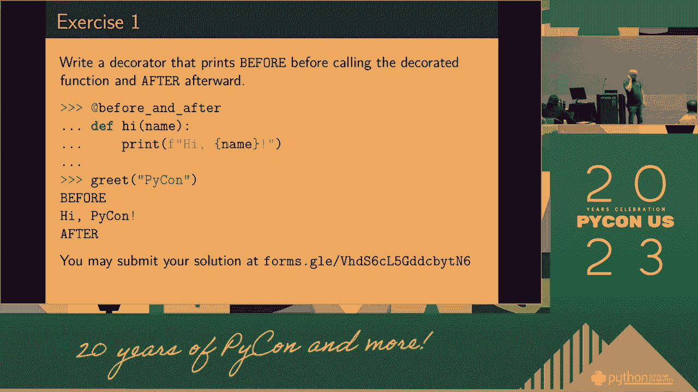

但是是的，重要的是和造物主玩得开心，只是一个简短的说明，如果你不想在那里输入链接的东西，你也可以找到我的GitHub，它是，让我们说一个黄色，然后只需操作装饰师教程23，链接也在那里。

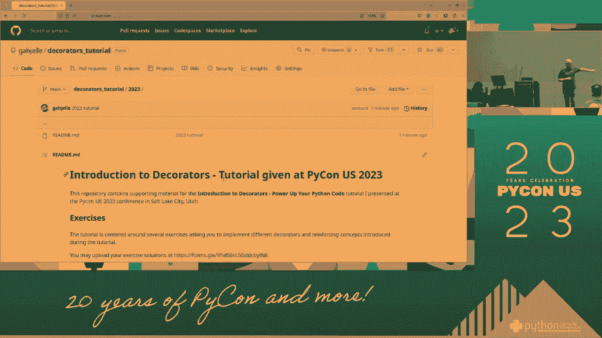

酷，我已经看到不少回应了，所以我想至少你的一部分已经得到了这个工作，我想我们从这里开始吧，如果你还没说完，随便玩吧，然后我们也在这里讨论答案，所以让我们看看这些装饰师会是什么样子。

我看到你们大多数人都想出了同样的答案，所以说。

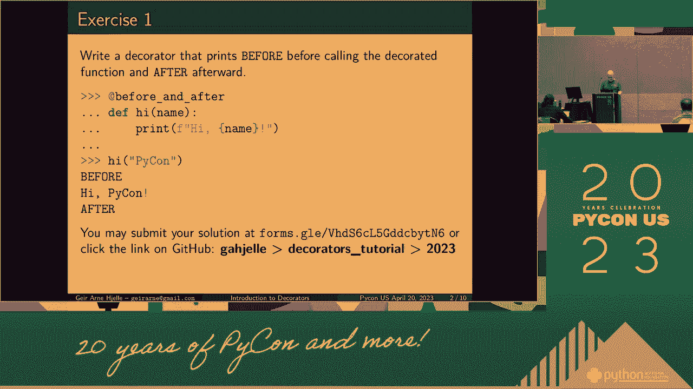

把这个放回屏幕上，所以x是1，所以我们需要做的是在装饰师之前和之后创建这个，前后，我们谈到的是，装饰器是一个函数，接收一个函数并返回其他函数，我想不需要另一种方式，所以我就叫他芬克，到目前为止。

我们在我们的例子中看到的，它的内在功能并没有真正暴露，我想对最终用户来说，从某种意义上说，他们不需要知道该怎么称呼它，但它有点从这里和那里漏出来，所以有时候给它起个好听的名字是可以的，既然你已经看到了。

我们很快就会看到，我们也可以避免泄露这些东西的名字，所以我倾向于把这个叫做包装器，但你可以给它起个有意义的名字，但是是的，我会在这里做一个包装，然后在我们的例子中。

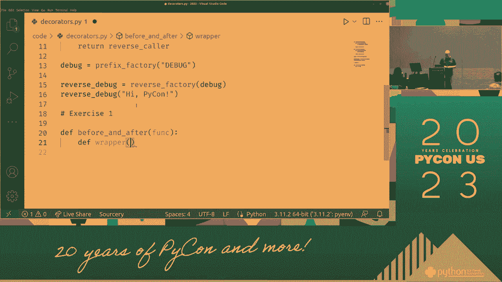

让我们看看还是我们的练习，我们希望这之前和之后，然后能够打印之前，然后运行，在这个高高的蟒蛇上跑，然后打印，在示例中，我们使用了我们一直看到的高函数。

所以我们可以归结为一个问题，说唱歌手的论点应该是什么，如果我们真的是为高的人设计的，最终会来到这里的，是这个名字吗，参数，嗯，我会假装更通用一点，在那里写文字，但那只是个名字，所以它真的不是更通用。

我们很快就会讨论一些问题，然后看看我们如何让这变得更好，不过，我们还是先谈这个吧，会发生什么，是这个包装函数取代了高函数，对呀，所以这就是我们需要在打印之前和之后打印的地方，所以我们要做的第一件事。

这个包装纸是我之前打印出来的，像这样，我做的最后一件事就是，我在中间要做的就是调用这个函数，所以我们可以把这个叫做，然后我在这个例子中为这个文本命名，然后我需要我的装潢师，所以这就是之前和之后的事情。

然后返回这个包装器函数，所以如果我们最终得到这样的代码，我想展示这个的部分原因是，仍然是相当基本和完全无用的例子是我们将，它向你展示了你的装饰师的典型模板，通常。

您希望使用修饰符在调用函数之前执行某些操作，或者之后，你最终会得到一些原则上看起来像这样的东西，所以你在调用函数之前先做你的事情，事后你做点什么，是啊，是啊，我看到你们大多数人都想出了这样的东西。

你们中的许多人发现了更好的东西，所以我们很快就会继续改进，但让我们检查一下这是否真的有效，所以我会复制这个代码，所以如果我有这个，然后我们的测试是我们想应用这个，到一个很高的功能，不是你好函数。

所以现在如果我做高赌注，我们可以看到它做了我们想做的事情，你得到之前，你得到了高蟒蛇，你得到了，当我提供一个参数时，然后当我没有提供一个，是呀，完美，我喜欢这样，格伦告诉我他给名字加了一个默认值。

所以让我们看看发生了什么，所以如果我们在之前和之后做，然后我们在这里有一个默认值，我会让这个人默认问候我自己，现在我想我们的蟒蛇还能用，但如果我这么做，然后我们就可以看到我们出了问题。

那么发生的错误是什么呢，所以我们可以看到如果我们盯着这个错误消息，它说说唱歌手前后缺少一个必要的位置论点，所以这个包装器函数需要一个参数，当我们送进去的时候，当我们在没有参数的情况下调用High时。

我们实际上是在调用没有参数的包装器，因为说唱歌手取代了我们的高级功能，那是一种装饰，所以错误消息来了，因为这个没有默认值，但这也说明了我们的装潢师不是很灵活，向你们展示一个不同的例子，我之前提到过。

我想装饰物是你可以应用于任何功能的东西，然后你可以改变它的行为，例如，我们有，我提到过，我想这个Jit编译器可以编译任何函数，也许我们可以对任何函数等进行计时，但在我们的装修工这里。

我们硬编码为一个参数，我们命名为text，这给我们带来了一些问题，给你们看一个不同的例子，执行这个相当愚蠢的示例，因为我们在Python中有一个加号运算符，所以我们真的不需要这么做，但是。

它再次向我们展示了我们可以，比如说像这样加两个数字，但现在如果我用我的前后装饰这个，我会有和我们之前完全一样的问题，所以让我们看看之前和之后，然后我会在这里做同样的事情，现在我再一次称之为。

我得到了这个错误网格扔给我，这在某种程度上是因为这个包装器只接受一个参数，在这种情况下，我给了它两个，所以说，我们能用我们的，装饰师让这个工作得更好，所以归根结底，就是。

我们真的想让这个东西独立于传递给它的参数有多少而工作，为了做到这一点，我们将使用，我猜，嗯，你有星星和星星操作员，它们通常被称为弧和夸克，只是我们发出的奇怪声音，但是如果你，是啊，是啊，所以说。

让我们先看看那些是做什么的，然后我们再想办法在这里使用它们，参数，这里重要的部分实际上是恒星，名字不重要，但他们有点，除非我们有更好的名字，否则我们通常会叫它们弧和千瓦弧，所以弧线只是你传入的参数。

没有名字，然后他知道，有一个关键字参数，只是为了显示这些东西，我可以看到，我会添加一些f打印f字符串，这也给了我一个炫耀的机会，我不知道大家是否熟悉这个f字符串语法，但它有点整洁，所以玩吧，嗯。

所以这两行f弦，当我在这里加一个等号，它将同时打印参数名称和值，它适用于蟒蛇三号，八年后如此，但是，如果我现在调用这个函数，坚持我的高圆周率，你可以在这里看到，在这个例子中，弧形是一个有一个元素的元组。

这是我在那里的第一个论点，如果我给它起个名字，所以也许我会在那里说问候，然后你可以看到，这里进来的东西是以这个千瓦弧传递进来的，千瓦弧是一本字典，参数，名称或关键字是字典中的关键字，然后另一件事是价值。

然后我们可以混合这些，所以我可以，例如，那里有三个十四个，也许我可以，像这样的事情，只是为了好玩，让我们，我可以做到，E等于它的二点七十一，所以当我们传递越来越多的这些论点时，你可以看到。

它们要么以弧线形式收集，要么以千瓦弧线形式收集，取决于是否使用关键字参数，就像我前两次做的那样，或者刚刚过去，以及立场争论，马马虎虎，这通常是您创建函数的方式，这些函数可以接受可变数量的参数。

或者像这样的事情，这正是我们的装潢师所需要的，向你们展示一下，我想一个更实际的例子，我的加法器版本，加法器功能，所以我希望我的加法器功能能够把任意数量的数字加起来，在这种情况下，我们可以说。

我希望所有的东西都作为一个列表，但如果我现在在这里做什么，我说我至少要一个数字，然后从零到无限，我想在无限数的某个版本中，它就会以弧形的形式出现，在这里你也可以看到它是连接语法的星号，不是名字弧。

但不管我把什么放在那里，都是像球一样的，我现在能做的就是说，好啦，如果我没有得到任何数字，所以这意味着我只得到一个号码，真的吗，那这个是空的，那么数的和就是一个数，我可以把号码。

否则让我们看看我可以返回一个数字，加上这些数字的和，像这样的东西，所以现在这真的不是关于装饰师的事情，只是为了炫耀星形语法，但是在这里你可以看到我现在可以加一个数字，那只是数字本身，我可以加两个数字。

我可以加上我不知道三个数字等等，所以这就是你如何创建这个更灵活的功能单元，那么让我们看看我们现在如何在我们的装饰师中使用它，对此有什么问题吗，顺便说一下，然后我会跳回我们的前后功能。

我们看到的是说唱歌手坚持，只接受一个论点，所以我们现在可以用兽人和夸克来代替这个，所以我们要做的是，我们会加入像这样的弧线和怪癖，然后当我们调用函数时，我们也需要这样做，再把它们传出去，本质上。

所以现在有了这个定义，前后，我们应该能够使前面的例子起作用，所以让我们试试看，让我看看，所以我们有我们的前后，高的默认值，让我们看看这个，像这样的东西，所以我们已经看到了，如果我们用Python。

但是现在我们也应该能够让它与默认值一起工作，那么这里发生了什么，让我们看看我们能不能通过这个嗨，当我在那里打电话给他的时候，我真的打电话给说唱歌手，所以上面的包装纸，如果我这样打电话，弧线将是空的。

夸克是空的，这意味着它打印出来之前，然后它在没有任何参数的情况下调用这个函数，所以这意味着在这一点上默认值触发，然后它就可以打印出来放在下面，现在我们也可以在这个加法器函数上做前后，之前和，对呀，好啦。

是啊，是啊，说得好说得好，所以问题本质上是如果我有更多的论点，太高，好高，如果我们加上这样的东西，这行不通的，这有点像因为让我们看看，我们的高函数可以接受两个参数，所以装饰师不能神奇地做一个功能。

像这样的事情，什么是真正可能的，我不知道我们能不能，也就是说，你可以让你的装潢师接受一些争论，所以通常你要做的是，本质上，遵循这个模板，您只需接收参数，并再次将它们传递出去，但在这里绝对可以说。

我会接受一个论点，而不是把它传递出去，例如，我可以说我正在接受名字的争论，不把它传递到这个函数中，所以做这样奇怪的事情是可能的，但很少有用，让我看看，是啊，是啊，只是为了结束这一切。

我想我们现在也可以检查一下我们的，见上一封信，简单的信，所以第一，这个，所以现在我们有两个论点，但现在这应该真的管用了，你可以看到它在没有之前和之后打印出来，打印出答案，它没有返回答案。

所以这实际上是另一件我们还没有真正解决的事情，因为让我们看看返回值会发生什么，让我们看看有一个包装纸，到目前为止，我们在高功能方面所做的是，我们打印出了一些东西，所以我们已经看到了打印的东西。

当你传递正确的东西时，你通常会做的是返回值，如果我们看这个包装器函数，它不返回任何东西，这意味着它隐式地不返回任何，所以我们实际上是在杀死我们从这个中得到的任何返回值。

所以这意味着我们在这个意义上还没有完成，我们有一些东西破坏了我们的功能，所以让我们看看我们是否可以把它作为另一个改进来添加，所以我们实际上需要做的是收集这个的返回值，不是诱惑而是价值。

所以如果我把值存储在那里，然后我可以返回它，既然我在函数调用后需要做一些事情，我需要保存返回值，然后我会明确地把它退回去，所以让我们看看它是如何表现的，所以我要回去，这个。

然后让我们再一次定义我们的加法器，现在我们可以看到我在这里得到了输出，所以我们保留了你能保留的价值，我想函数的返回值总是在最后，即使我们像这样装饰，嗯，至少只要我们保持同步，所以我们可以在这里看到之前。

在实际加法之后，计算发生在之前和之后之间，然后它返回值，在清理干净之后，或者不管手术后是什么，所以我们现在在上面的东西，会有更多的改进，但它本质上是你最终使用的模板。

对于你的大多数至少是基本的装饰师来说，所以如果你能定义，好啦，在调用函数之前，我应该做一些事情，之后我应该做的事，然后把它放在我们现在有打印声明的地方，让我看看，而且是的，离休息还有十五分钟。

所以我想这是一个很好的点做另一个练习。

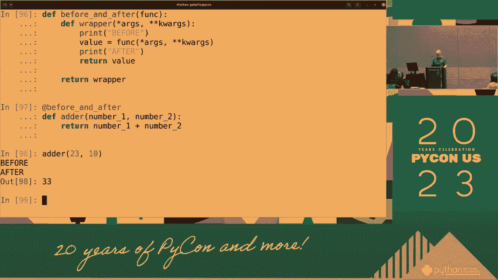

这个我们要去，您可以重用我们现在创建的模板，但是看看是否可以编写运行这个装饰函数两次的decorator，例如，如果我们有这个高函数，然后它应该说嗨蟒蛇，高蟒，然后呢。

现在我们知道我们需要关心这些返回值，当你运行一个函数两次，不清楚，它的返回值应该是多少，我会说，您应该返回一个具有两个返回值的两个元组，所以如果我们实现一个随机掷骰子函数，然后用do把这个卷两次。

你应该拿回两个号码，然后我就能看到什么很酷，是啊，是啊，所以我又开始看到一些回应了，所以我想我们可以开始看看这个，而且是的，我们还在这，有点傻的装修工，我不知道这是否有很好的用处，做两次。

但让我们看看我们能不能想出如何实现它，至少，在这种情况下。

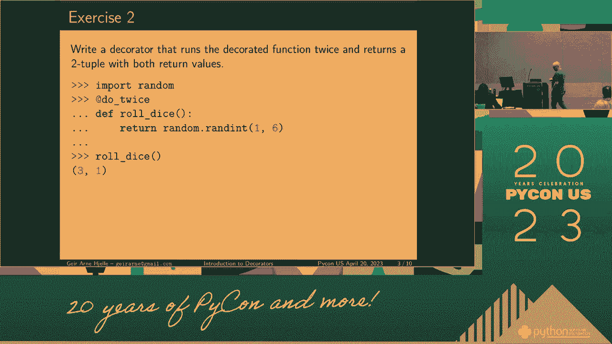

我们会看看，我们之前和之后想出的模板，但我们可以看到我们可以为它剪掉一些东西，但我会从典型的，我做了两次，它接受了一个函数，然后我知道我会有一个包装的东西在这里，正如我们所讨论的。

这个包装器通常总是有弧和夸克，只是为了足够灵活地应用于任何事情，我们的任务是给芬克打两次电话，并将结果作为元组返回，所以我们可以很聪明地处理这个，去做吧，让我看看，我将返回弧和夸克。

然后我会加上一个逗号，再叫一次，然后我只需要记住返回这个包装器函数，所以这可能是一个太聪明的版本，所以在这里我叫芬克，然后我再叫一次，我只是作为一对夫妇返回结果，所以让我看看。

我可以从证明它是有效的开始，然后我们可以看到我可以，之后我们可以把它写得更易读，假设我想导入随机，因为我们的测试是随机函数，这是我做两次的包装纸，然后呢，我们的任务是把这个应用到。

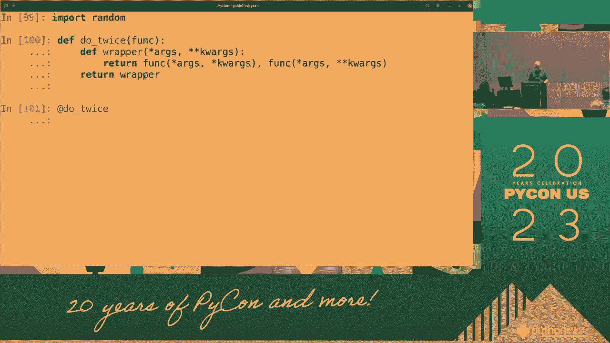

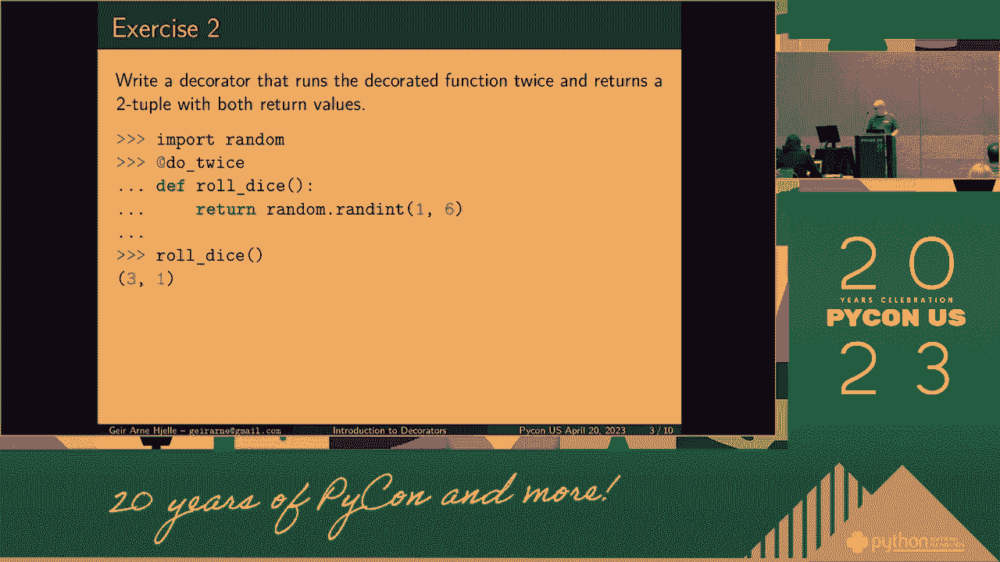

所以掷骰子是一个非常简单的函数，不接受任何争论，它只是随机返回一个，返回随机数，像这样，所以现在如果我掷骰子，其实叫它，我们可以看到我至少得到了看起来像随机数的东西，像这样，你可以看到。

即使这里我返回一个数字，我后面有两个，所以做两次，做点什么，让我看看，让我们，只是为了说明我们在这里做什么，我也可以说，我会把这些存储为，作为临时变量，所以我可以第一和第二打电话给他们，例如。

所以这可能是一种更易读的实现方式，只是为了表明这仍然有效，你可以看到我们还是把我们的两个结果拿回来了，对此有什么问题吗，你可以看到它起作用的地方，是啊，是啊，是啊，是啊。

装修设计师的极限是什么就是这个问题，现在可以一路有海龟，本质上是这样你就可以有一个，你可以，就像你说的，装饰装饰师，如果你想要什么，是啊，是啊，让我们真正做到这一点，现在我们甚至可以有堆栈。

这样我们就可以把装饰器堆叠在一起，这里的示例，我可以，例如，做一个前后，像这样，而现在，如果我掷骰子，您可以看到，对于这些函数中的每一个，它都是在之前和之后调用的，它的工作方式是。

你只需要有嵌套的函数调用，所以我们在上面的，就像现在屏幕的中间，会或多或少地等同于做之前和之后然后，如果我们把掷骰子定义为一个常规函数，然后我们在掷骰子之前和之后都涂上，然后我们再对它做两次。

所以在这种情况下，您可以看到，装饰器之前和之后也被执行了两次，嗯，如果我们像那里一样，但我们翻转顺序，然后我们会看到一个稍微不同的结果，我可以前后做两次然后，现在如果我们称之为。

你可以看到掷骰子做了两次，但前后现在只做一次，因为做两次只适用于这个，但是是的，可以像这样堆叠装饰器，从某种意义上说，你想要多少就有多少，然后这些是返回函数的实际修饰符，因为我们一直在转换功能，好啦。

还有其他问题吗？对所以问题是，装饰师是否应该非常通用，所以它们可以应用于任何东西，或者是专门设计的，总的来说，你想，我想让它们尽可能通用，但没有比这更普通的了，所以说，所以说，例如，说我想在烧瓶框架里。

有一个类似于这个登录装饰器，您可以使用它来检查，用户是否登录，那就是，当然，这些设计是为了放在这些烧瓶路线上，所以它被设计成在这个框架内工作，如果我们只是把它放在某个神奇的功能上，它是不会真正起作用的。

所以是的，从这个意义上说，这是一种功能，是的，你想和他们在一起很普通，但对通用也是如此，你知道他们需要完成他们的任务，如果你有几个要做两倍是的，所以我想这个想法是如果我们做两次会发生什么，呃，好几次。

让我们检查一下这个，像这样的东西，现在如果我掷骰子，大家可以看到它，如果我继续这样做，我偶尔会得到两双，我去拿，我猜最大迭代，我要买两双这样的鞋，它就像爆炸一样，所以做两次，三次，会给我八个数字等等。

是啊，是啊，您可以使用来自不同类的装饰器吗，是呀，如果你能说出它的名字，那你应该可以称之为，本质上，让我看看，你知道的，稍后我们会有一些示例，其中我们使用类作为装饰器，但是是的，只是命名空间的问题。

所以只要你能引用一些作为装饰师的东西，你可以用它，好的好的，然后呢，我想该喝杯咖啡休息一下了，我们半小时后继续，如果有人有任何问题，我会在这里，所以这些都是好的，是啊，是啊，对呀，所以任何好的经验法则。

当您想使用装饰器时，也许当你想要的时候，一个典型的用例，至少我发现你有，你想在代码库中实现的功能，所以我猜，这方面的一个相当基本的例子是，您有几段代码，你想说时间，你的功能或类似的东西。

所以我想弄清楚这部分代码的运行时间有多长，这部分有多长，这部分有多长，一种方法是把这个，你用的东西时间点时间减去以前的东西，或降低代码，当你开始意识到，好啦，我有同样的模式，我已经分散在许多地方。

然后你就可以开始思考，我可以和装潢师一起做这件事吗，创建你的计时器，那个装饰师和这个来增加时间，这里和那里的计时器，我想类似于我们之前谈到的登录功能，带着烧瓶什么的，或者他们用这个编译器做了什么。

事情是这样的，当你开始看到我在做同样的事情，但在我代码的不同领域，可能你的行为，我可以拉出来用装饰师，所以这是一种，是啊，是啊，还是有点抽象，但一种识别它的方法。

所以现在下半年的计划基本上是继续做我们一直在做的事情，探索装饰师，有点从，我们想出了如何写我们的基本装饰，那么现在我们如何做不同类型的装饰师，我们首先要看的是装饰师，只在规定的时间做一些事情。

所以当你定义一个有时可能有用的函数时，嗯，我们会看到这如何改变模式，然后我们将潜入，你怎么能让有参数的装饰器，是啊，是啊，所以我们会看到一些例子，如何将它添加到，然后有时有一个装饰师可能会有所帮助。

以某种方式保持状态，所以希望我们也有机会看看这些，所以这或多或少是未来的计划，但是是的，我们将继续这样做，喜欢用同样的时尚，所以，你得到了一些锻炼，然后我们会谈谈，我想我们做完这个后就离开了，做两次。

造物主和，我想回顾一下，只要确保我们明白，当这种装修工，它什么时候运行，当你装饰的时候什么时候会发生事情，我们在，就像看语法或语法，相对于这个高等于某种高语法，让我们看看我们是否回到，我想我在这里。

所以我就用我们以前信任的装潢师，如果我加一行，非常在上面，所以在包装纸之前，我只想在这里说一些像装饰，所以这个属性，所以我不知道，如果您见过这个双下划线属性，或者叫雷的名字或者特别的名字。

所以这些是典型的蟒蛇，他们研究蟒蛇，这就是为什么他们有下划线来标记他们，他们通常会给你很多关于，说Python的整个数据模型，所以说，例如，定义函数时，它至少知道它的名字，就是。

您可以在name属性下从这个中提取，所以这个打印语句现在是我想称之为，不在包装纸里面，但在外面，所以我会看看会发生什么，然后呢，所以我要这个，复制这个，让我们现在看看，我有之前和之后，让我们是的。

让我们把这个用在我们的好旧高的东西上，我想我们可以做简单的，嗨，像这样的东西，而且是的，我把这个叫做，所以我们马上就看到了一切，那是简单的高潮，没有星号，我们把它留下，所以我们在这里可以注意到的是。

虽然，是装饰高已经来了，当我定义高右时，这一行是上面印着的，这就是已经有的指纹，所以我们可以从中读出，是之前和之后，如果你把这看作是一个函数，当我们定义这个，接下来会发生什么，所有不在里面的东西。

那里的内部函数被执行，所以打印语句立即来到这里，然后当我们实际运行装饰函数时，我们真正要做的是执行这个内部函数，因为print语句不是内部函数的一部分，我们在这里没有看到任何关于装饰的东西。

我们只看到之前和之后，介于两者之间，所以这只是一种，我想跟踪，谨记，这意味着如果我们有一个装潢师，我们只想在规定的时间做某事，所以我们实际上不想改变函数，我们只是想在定义函数时做一些事情。

那我们就不需要内在的东西了，所以对于一个非常像，这方面的基本例子，我可以拉出来，是啊，是啊，我们叫它定义什么的，我可以拿出这个功能，我们刚刚用print语句，所以我会说这个定义的东西只是打印出来。

哎呀哎呀，你做了什么，普林斯顿大学的声明，然后返回原来的函数，这样我就可以定义，然后我会定义高，然后应该打印出来，看看我们是否做对了，像这样，我在这里所做的是我能够做一些事情，理想情况下比短跑更有趣。

但是只要定义了一个函数，我就可以做一些事情，但我现在一点也不改变这个功能，所以在这里我返回完全相同的对象，所以如果我这样做，我蟒蛇在这里，我们可以看到它是这样运行的，如果我看这个函数。

我可以在这里看到这是我刚刚定义的high-name函数，对于后一件事，让我们来看看，如果我回到之前和之后，让我，让我装饰一下你好功能，只是为了让他们两个，所以这是我们添加打印之前和之后的版本。

所以我们可以在这里看到指纹在那里运行，但是如果我现在看这个函数对象是什么，我们可以在这里看到hi正是高函数，但是Hello在包装器函数之前和之后都变成了这样，因为那是我们送回去的。

也可以使用它来实现功能，是啊，是啊，所以所以，我猜评论是，到目前为止，我们只是在做一些虚拟的例子，打印出一些东西，但真正的用例是，您可以实现一些功能，每当有东西被称为，也许你想做一些日志记录。

这是一个很好的例子，你可以做，是啊，是啊，有些调用堆栈操作，但我们会回到其中的一些，你可以做一些验证，希望有时间，作为结尾的一个例子，以此类推，所以是的，你可以用这个做各种各样的事情。

我们在这里可以看到的一件事是，有明确的证据证明我们做了某事，它实际上是一个完全不同于这个东西的函数对象，接下来我们要做的是，我们有这样的闭包，我们保存对原始函数的引用，但我们在《你好》中得到的。

这里实际上是包装器函数，但是包装器函数在这里调用这个东西，我们再也无法直接接触到，其实呢，我们实际上看到的是，是因为这个装饰，我们给东西起的名字，让我指出，在这里，我们看到函数知道它自己的名称。

我们可以看到这个，如果我这么做了，我可以用我们说好的雷霆之名，或者印在宣传册上，当我这么做的时候，我们也可以用，说打印，你可以看到这雪坐在，功能打印，可以为这个做名字，它知道它的名字是印刷品，但现在。

如果你还记得我有，这正好等于打印，如果我这样做，你可以看到它仍然知道它的指纹，它不会以某种方式预览，如果我在这里问它的名字，仍然打印，所以函数的名称，因为它知道自己，可能和我们用来指代它的名字不同。

所以这是两件独立的事情，让我看看，是啊，是啊，所以我们在这里看到，当我在那里打招呼的时候，它把名字弄乱了，这可能是个问题，如果你用这个名字做任何事，那就太可怕了，例如，如果你在记录，我不调用这个函数。

然后突然间，你得到了通常不有用的信息，这是很有趣的，所以实际上Python中已经存在一个decorator，这可以帮助我们跟踪元数据，并确保这里的元数据，更有礼貌，所以让我们再回到一次之前和之后，我会。

是啊，是啊，我再把这个装饰的东西拿掉，只是想让你知道，但我现在可以申请一个装饰师，到包装器函数，到内在功能，首先，我会进口放克工具，所以这是一个标准库，在放克工具里面有一种叫做包装的东西。

如果你看看帮助文本，我们可以看到这就是他们所说的装饰工厂，嗯，把它想象成一个装潢师，很快就会恢复原样，但是这个基本上可以，这是相当技术性的，但是它，好啦，现在太技术化了，它所做的就是更改名称等等。

使修饰后的函数看起来像原始函数，所以让我们来看看，如果我做放克工具包装在那里，然后我实际上需要把原始函数作为函子传入，我看到VS代码在对我大喊大叫，因为我没有进口放克工具。

现在让我们看看如果我用这个会发生什么，所以我再次重新定义了我的前后装饰师，现在我们可以在井上再次使用这个，让我们在高处使用它，因为现在还记得你好还是以前的那个，所以它有个奇怪的名字，但现在嗨。

尽管这里已经装饰好了，看起来它只是一个平面函数，它保留了它的逻辑名称，可以这么说，所以那是，是啊，是啊，在最上面你可以看到，这个功能包装，它的任务本质上只是保留元数据或传递。

从传递给内部函数的funk中真正复制元数据，所以这至少是个好主意，每当你有这样一个装饰好的包装纸，只是把放克工具包装扔在上面，这让事情很好地结合在一起，是啊，是啊，我想本质上唯一的问题是。

如果你没有内在的功能，所以你不改变恐惧，但是是的，我想是的，总是这么做，如果有例外，你可能会明白的，好啦，这件事把我们带到了一个新的练习中。

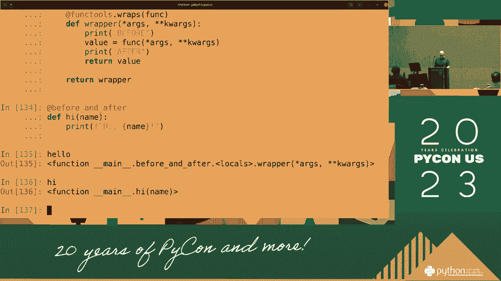

这个可能看起来像是这些虚拟例子中的另一个，但这个是一个，可能是装修工人，我自己用的最多，它实际上是一个相当强大的机制，可以做一些类似插件的事情，在那里你可以注入代码之类的东西。

所以您在这里需要的是编写一个decorator，它存储对已修饰函数的引用，所以我们根本不想改变装饰的功能，所以它类似于我们所做的定义，我们只想保留对他们的偏好，所以在这种情况下，我们的测试是我们会没事。

让我们创建一个全球词典，然后每当我定义一个函数，上面有这个寄存器装饰器，它在该函数的字典中添加了对该函数的引用，好好享受这个，十分钟后我们再谈。

好啦，然后我们开始至少有一些实现，对你来说这很好吗，我想我们现在要讨论一下，所以我们走着瞧，所以这里的想法是，我们将让我们再次得到这个问题。

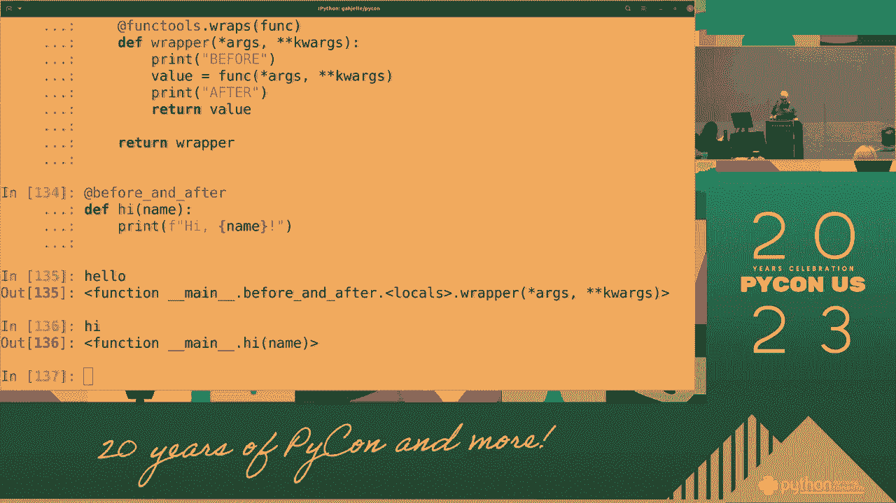

所以我想定义这个寄存器装饰器，这一点也没有真正触及功能，它只是注意到这个函数本质上存在，所以这意味着我们只需要在规定的时间做某事，所以我们不需要改变功能，所以我们实际上不需要用那个包装纸。

到目前为止我们一直在使用，所以这个会和这个精致的装饰师很相似。

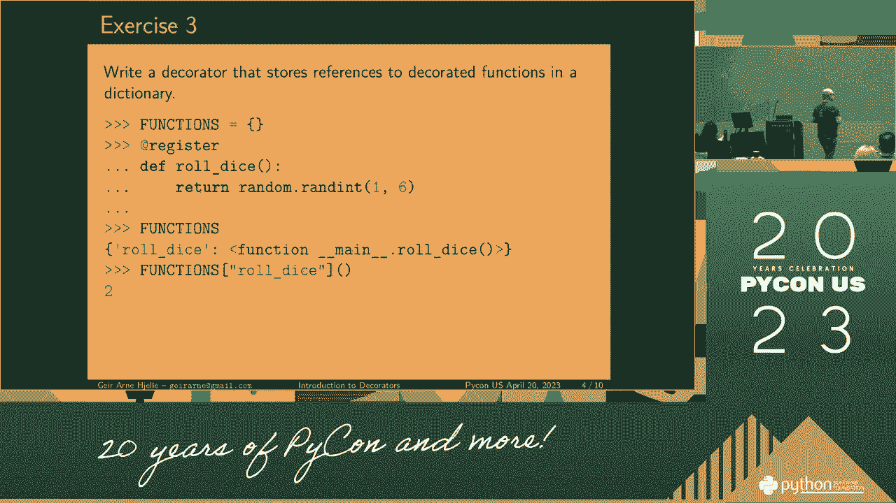

所以让我们看看我能，然后我现在想做的是在这个函数中做一个笔记，在这里我们可以用dunder，我只是说，好的，好的，我会用这个名字作为钥匙，然后我将传入对函数的引用，所以要确保我们没有正确地调用函数。

我们只是存储对它的引用，然后我在这里也应该返回函数本身，这就是我们要找的设计师，我也应该，是啊，是啊，我们之后会运行它，而不返回放克，只是为了让你看看会发生什么，在我真正使用这个之前让我们看看。

我还需要定义函数，所以我就把它作为一本全球词典开始吧，让我们再看看掷骰子的例子，我们做了，是啊，是啊，呃，那么现在发生了什么，因为这是规定时间，对呀，所以我们需要调用任何，所以说。

当我们在那里登记的时候，那么这个函数应该被填充，所以让我们来看看，你现在可以看到，它不再是空的，但它现在引用了掷骰子功能，因为这是一个函数引用，我们就可以开始玩了，所以我挑不出，这里。

这就是我的函数引用，然后我就可以称之为，我可以看到我在这里得到了一些随机的骰子，如果我们只是在规定的时间做某事，那这就够了，我们不需要包任何东西，因为我们不会改变功能，所以它只是保持不变。

所以如果我看看骰子的作用，我们可以看到它在这里有它的好名字等等，让我们看看是这样，是呀，第一批，如果我不，让我们看看是这样，如果我这么做了，聋人注册和我做，但我什么都不回，你觉得会发生什么。

那就来猜一猜，功能寄存器，但我不能，你说呢，但我基本上不能正确地使用它，所以让我们试试，所以好吧，我要，我将把函数重新定义为空字典，只为看看它是空的，然后我用这个坏的寄存器和我的骰子掷骰子，像这样。

所以你现在可以看到函数，掷骰子在那里实现了吗，所以这很美，我们甚至可以称之为，所以我们有参考，但现在如果我看看骰子滚动本身，你看得很清楚，好像什么都没有，如果仔细检查，我们可以看到它已经被一个。

因为我们什么都不退，所以当我们做这样的装饰时，它真的在取代功能，我们用，我们修饰函数的返回值是多少，既然我们没有归还任何东西，Python隐式返回无，所以我们后面没有，所以我想这可能是一个功能。

因为这意味着我不能这么说，它迫使我使用那里的函数，所以也许这是一个特征，可能是窃听器，最后，我声称这是一个非常有帮助的装饰师，可能看起来不会马上，我不想潜得太远，远离装修的东西，但我们可以做的是。

我们可以动态地调用函数，无需事先说明，所以对于一个仍然是一个相当简单的愚蠢的例子，但我可以做这样的事情，您要调用哪个函数，然后在这里我可以说掷骰子，然后本质上我们做一些函数。

我在某种程度上交互式地定义了，我想调用哪个函数，然后如果你有几个定义的，你可以用这个，也许一个更好的例子，假设您有不同的文件格式要读取，然后您可以为CSV格式定义一个处理程序，另一个给杰森。

如果你只登记他们中的每一个，然后你可以用这样的东西间接地称呼它们，然后它就很容易，然后后来，只需为您修补另一种文件格式，然后你可以在其他任何地方，您可以像这样为Yamor注册一个处理程序，所以它允许。

是啊，是啊，非常灵活的程序结构化方法，让我看看，然后我们谈到了那些，是啊，是啊，所以有一件事，我想我现在也要指出，让我看看，高功能，我应该早点指出这一点，我只是想给你看看。

我们稍后会更仔细地研究这个问题，但是高功能是我们使用这个包装的地方之一，而且实际上可以访问像这样包裹的雷鸣，所以这是其中一个之前和之后，如果我做高Pyon好吧，我们做之前的，高高在上，之后。

你可以看到它似乎也是同样的功能，但它实际上是内在的功能，所以这是使用这个包装器的另一个好处，你也可以很容易地访问原始函数，如果我们用功能代表，然后通过木筏潜入，你可以访问原始的未装饰功能。

我想我们可以进行下一个练习，或其他问题。

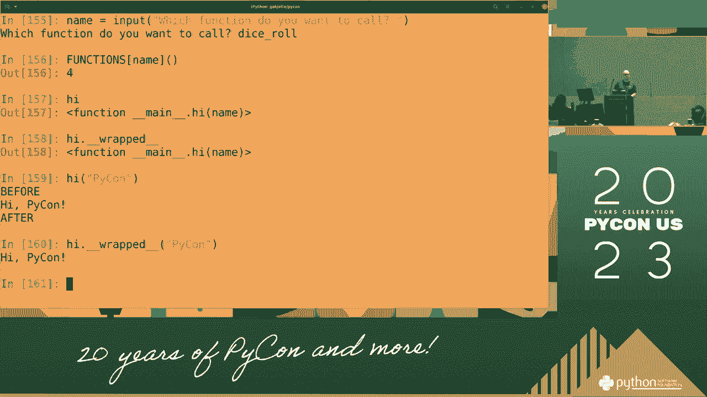

评论，我是，呃，它是，是啊，是啊，访问说唱的用例是什么，呃，嗯，通常你有，我想包装的东西是有原因的，你把它们装饰了一下，因为你想用它，所以通常情况下，它不是你会使用的东西，但这可能是一种说法。

你可以偷偷穿过井，在登录示例中，如果你只是想测试一些东西，所以不要在生产中这样做，我猜，然后您可以通过进入它下面来偷偷通过登录的东西，或者如果你不想给有计时器的东西计时，是啊，是啊。

现在总的来说更多的是，知道它的存在之类的事情，好吧，所以我想，与一些愚蠢的测试函数和，这里，更改掷骰子功能，以便如果掷骰子少于五个，它将创建一个错误，我们想做的是创造一个装饰师。

它只是在函数调用失败时重试调用的函数，所以在这种情况下，当我们运行这个东西，我们应该得到五个或六个，我们不应该得到错误消息，然后耶，这是一个愚蠢的例子，看看稍微好一点的例子，一旦我们有了重试装潢师。

所以是的，我对这个有一些乐趣，好啦，我想我们可以开始看看这个，所以这一个将再次有点像一个普通的装饰师，我们需要做些什么，但现在我想好了，我们可以把这看作是在调用函数后或多或少地做了一些事情。

我们发现了一个例外，然后可能会再次运行它，所以让我们看看解决这个问题的一个方法。

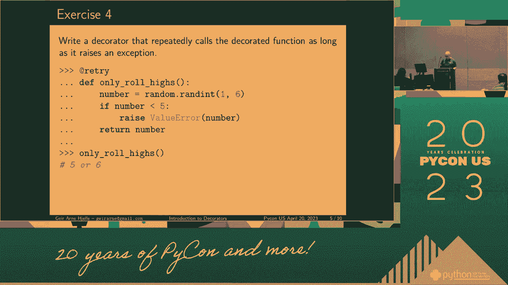

然后呢，会是我可以，让我们看看，如果我这一点点，所以我会定义重试，我们学会了，我们可以增加一个代表，搅拌，然后我们可以定义一个包装器，所以我只是把模板放进去，我们现在或多或少，然后我们在这里做一些事情。

然后我们会退回一个包装纸，所以这只是一个模板，然后我们说过我们想在这里做什么，本质上，我想反复调用函数，直到它不返回异常，本质上，所以在这种情况下，我想我可以把自己扔进一个疯狂的真实循环中。

所以我会永远逃跑，然后我会试着调用函数，像这样的东西，在这里，我只是立即返回值，所以我不需要用它做任何其他的事情，所以唯一的问题是如果这件事现在引起了一个例外，当它被称为，但那是我们可以抓住的。

如果我们得到一个例外，我只想继续前进，所以现在，我就在那里做一个过去的陈述，我猜，所以我想这可能是我们在重试中能做的最基本的事情，然后我们会在一段时间后添加更多的功能，但让我们看看它是否有效。

我把这个放进我们的，然后我们的测试是看看我们是否能继续滚动，在这里只能得到5和6，我想我叫它只滚高，但这真的只是一个掷骰子的事情，在躲藏，所以我们会有一些数字，那是随机的，然后我说，如果少于5。

那我们就加注。

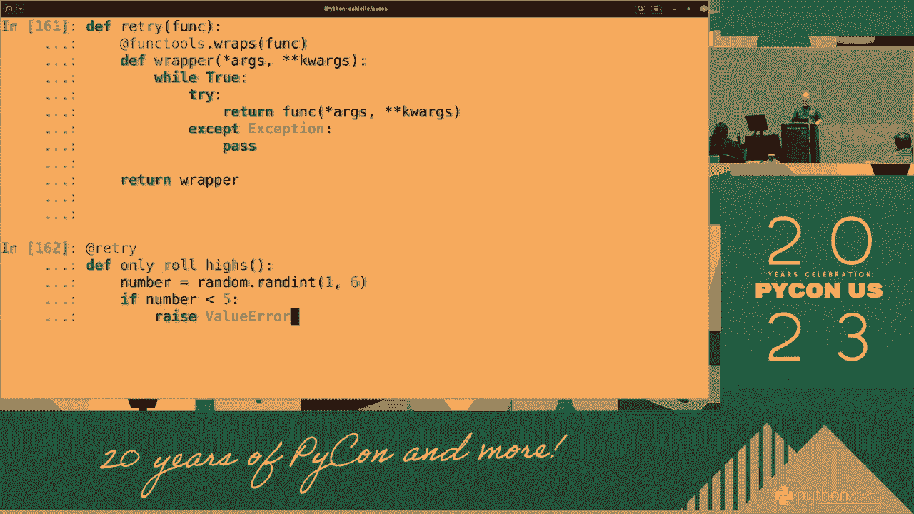

我们是不是更喜欢这个。

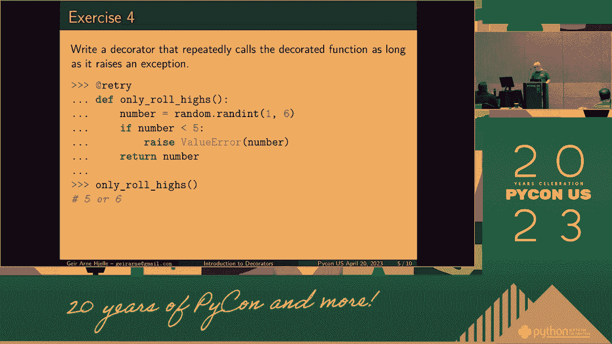

然后我就把这个号码还给你，所以现在，如果我运行这个，我们可以看到，好啦，我有六个，我有六个五，六五六，所以说，我没有得到一个，两个，三个，四，应该在那里，所以现在，一切都发生得太快了。

很难看清这里到底发生了什么，但就这样，让我们改变，这一点只是增加了一点可见性，所以当我在这里得到例外时，我也会打印出发生了不好的事情，是呀，我们可以健谈，说放克的名字，因为一个或类似的东西，所以现在。

如果我运行这个，然后我会，只是不要，这样比较容易，让我们看看，所以现在我重新定义了我唯一的滚动高点，然后呢，如果我运行这个，你可以看到现在我们看到了一些它实际上重新滚动的痕迹，现在呢，当然。

这是一个完全愚蠢的例子，因为我可以用我的随机数发生器，直接给我五六，给你们举个例子，像这样的东西可能会有用，我想对这个系统友好一点，我还要加上一点延迟，时间睡眠，比如说十分之一秒什么的，如果我们用这个。

然后让我们看看，我会做唯一真正的高潮，所以现在你可以看到它只需要一点点时间，所以现在我们可以，例如，用于拉取资源，也许我们知道即将到来，但他们可能还不在那里，或者像这样的事情，嗯，所以举一个小例子。

是呀，求求你了，我想我用一个，像这样做很奇怪，哎呦，不错嘛，好啦，所以马丁在这里展示的例子是，而不是做while真循环，那只是，是啊，是啊，所以这里不使用while true循环。

它只是在确切的块中调用包装器本身，这也有效，除了我想Python有这个递归限制，所以我猜三千次都会失败，或者类似的东西，但是但是是的，一般来说，有可能，我想又是蟒蛇，函数调用需要更长的时间。

所以做一个while循环可能更好，但绝对有效，然后我想进入的例子，尝试用它来进行某种系统轮询，只是为了更好地利用这个范围，我觉得，所以让我看看，我举一个例子，我只是想从磁盘上获取文件。

所以我要做一个路径库操作，让我看看，然后我可以重试，好吧，让我们称之为过程文件，听起来我们在做一件有趣的事，嗯，所以我们得到了一条路径，然后让我们打印出这个文件的内容，所以我会做一些像路径，阅读文本。

现在我可以做一些类似进程文件的事情，然后我会给你一条路，有一个路径库路径，我会把它放在最上面的文本文件上，现在这个文件不存在了，所以它只是告诉我，我正试图阅读这个文件，但我找不到它，我现在能做的。

让我们看看我们是否能做到这一点，我会在黑色的情况下做这件事，所以我们可以看到那里的背景，我想，我想这是上面的目录，所以让我们看看我们是的，所以我将在这里的一个文件中添加一些文本，嗨，大家好，好的。

这只是在Linux上，我只是在创建一个文本文件，我现在称之为文本，而且它有这个内容，所以现在，如果我将此文件的名称更改为Python文本，然后在白色屏幕上运行的过程，当它可用的时候应该能把它捡起来。

对呀，所以让我们看看，所以我将文本重命名为pi，希望我来对地方了，我在那里你去吧，是啊，是啊，所以这是一种，你可以拉资源，理想情况下，你知道是正确的，这可以在本地目录上，或者在网上或类似的东西上。

但是在做这个的时候，中间有这些睡眠是很好的，所以你没有完全压倒你的系统，我想我们可以试试类似的事情，呃，这变得有点太简单了，也许是验证，但我可以有一些，一些函数，我试图从用户那里获得一些信息。

所以说我只想读书，说出一个数字或年龄，或者类似的东西，然后我的，其实在做这个之前，让我来做这个例子，如果没有这样，我会变老的，我会说这只是回报，像这样所以现在，如果我这样做，我想蟒蛇是20年，对呀。

所以我们可以说20，结果是二十，但如果我们做20个，你可以在这里看到我得到了一个错误，因为我在上面做这个转换，我把它转换成一个数字，因为我想用这个号码，嗯，所以一种避免这种情况的方法是。

我可以定义get h，随着重试，现在，如果我真的到了年龄，我声称自己20岁，上面说，好啦，我正在重试，因为我得到了这个不好的东西在那里，所以现在，好啦，我会，我会好好表现的，所以有一些用途。

至少在你可以玩这个的地方，好了，现在是有趣的部分，或者先，哦哦，你比我快5秒，完美，路径库，是呀，所以我用了路径库，所以我导入了路径库，我用了吗，所以我在这里用了很短的时间，所以我在小路上经过。

然后当我定义这个进程文件函数时，让我看看，让我们看看这里，我使用的这个读文本方法是一个path lib path方法，好啦，然后耶，有趣的部分，有时我们想给我们的装饰器添加参数。

这也不是我们正在装饰的功能，因为我们可能想要一些不同的。

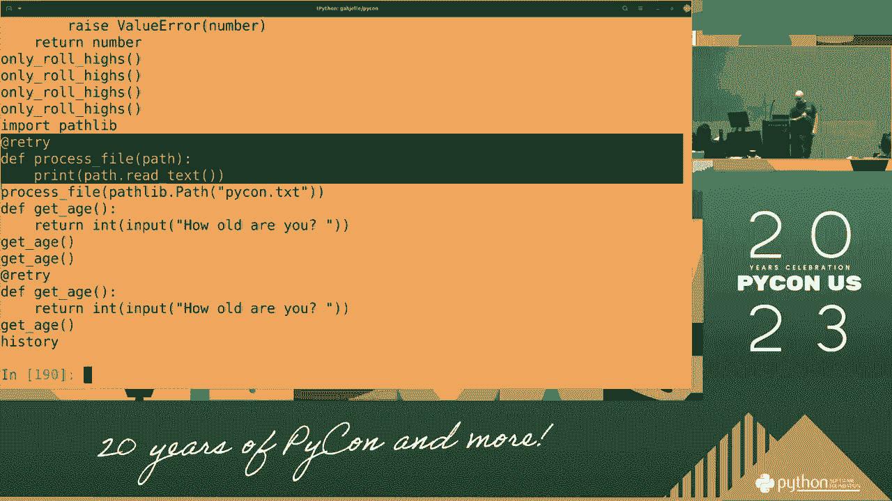

你有两个版本，让我们直接跳到格伦想要解决的问题上，所以我们想适应重试，所以它只尝试最多次数，所以如果我们把这个应用到我们唯一的卷高功能上，然后我们就可以得到五六，我们实际上可以得到错误。

如果我们没有得到最大重试次数内的数字，我给你几分钟考虑一下，但我想我告诉过你一些事，但我还没有真正告诉你如何真正做到这一点，但是回想一下我们早期所做的功能工厂之类的事情，因为我们真正需要用的是。

这次重试变成了装潢工厂，所以一些为我们返回装潢师的东西，所以每个参数，本质上，最大重试将有一个不同的装饰器，这是一种什么，这是一个很大的，所以是的，试试看，然后我们一起看，你过得怎么样？

这绝对是迄今为止最难的练习，所以说，呃，让我们看一看，看看我们能用这个做些什么，我们有点，是啊，是啊，有一种新的想法，我们还没有真正谈过这件事，刚才提到的，我去找我的编辑。

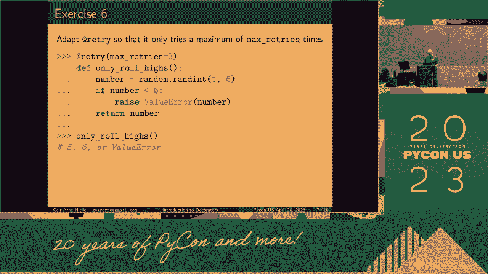

所以本质上我们，我们知道怎么做，现在是这个，好啦，我们可以运行这个一切，但我想加入一些参数，我可以利用的地方，有点像说，我只想跑N次，或者类似的东西，所以我有最大的重试次数，让我看看。

所以这意味着我希望能够发送一个参数来重试自己，所以不知何故，它应该说最大条目，这就是我所知道的，我想让这个看看，这意味着当我运行它时，或者当我使用它的时候，我应该能做的，等于三或类似的东西。

然后我们在下面有我们的功能，这怎么，如果我们看那又怎样，我们有点，到目前为止，通常当我们有一个装饰师，应该是这样的，所以我们玩得很开心，工具，包起来，放克，然后我把我的包装纸放在这里，所以这就是我。

只是在填写我们目前找到的模板，所以现在我想这么做，但我也想这么做，所以我需要把这些放在一起，我说的是，这个新的重试装饰师在这里变得像一个装饰师工厂，这与我们一开始对这些功能工厂所做的类似。

所以如果你还记得，一直到这里，我们有一个前缀工厂，它动态地为我们创建了一个新功能，或者一个反向工厂做了同样的事情，所以这也是我们在这里使用的想法，意思就是，让我们看看我们在哪里我们在哪里。

我仍然希望这个是装潢师，但这实际上是将动态创建的东西，所以我的这个重试将是重试装饰器，所以我就给它重新命名，像这样叫它装饰师，这将是一个内在的功能，所以这将是这次重试的一部分，最后我会做一个返程装饰。

所以这肯定是我们的大脑有点超负荷的时候，像这样的事情是因为现在我不仅有一个内在的功能，但我有一个内在的功能，所以跟踪这一点并不是微不足道的，对呀，但这意味着我们之前有这样的想法。

现在这个完整的表达式重试x重试是什么，让我们看看回到装饰者放克，装饰师放克回到包装器，所以我们又回到了起点，所以如果我们想要有参数的装饰器，通常我们要做的是把一个模板，把工厂建在外面，好啦。

所以当我们准备好这个装置，然后实际实现这一点与我们前面所做的非常相似，除了现在，而不是这样，而真循环可以只在范围内为i做，然后我意识到我永远不会用这个，所以我就叫它下划线，然后我会试着回来。

所以这是我们早些时候试图返回风扇的相同代码，如果失败了，我就打印它失败了，我们重试时使用的文本是什么，重试，然后耶，让我们在这里也加上错误消息，见，是啊，是啊，这接近于至少有效的东西，所以让我们试试吧。

所以如果我们现在复制这个，然后我可以使用重试，但我只会做得很好，让我们最多两个，例如，然后我们会做唯一的翻滚高，让我们看看那是号码，如果这个数字很小，然后我们会提高值误差，否则将返回号码，像这样。

所以现在我有了一个掷骰子的功能，但对于较小的数字会产生错误，但现在我们说我只想重试两次，所以让我们看看会发生什么，所以你可以看到，前三次我运行它尝试了两次，因为我赢了一三四。

这里的一个挑战是它实际上不会增加错误，错误有点被吃掉了，我想可能是好事也可能不是好事，所以我们可能会改变我们的功能，所以我们最后一次叫它，我想我们不保护错误，所以它可以做一些，好啦。

我做这个最大次数减去那里的1，然后我就加一个，在那里我会回来，所以我最后一次重试，我没有用尝试块来保护它，所以如果上次失败了，然后我们也看到错误本身，也许这个错误很好，我猜，所以现在让我们看看。

如果你只滚高点，在那里，我们得到了五个，在第二排，六，你现在看到了，我现在在重试几次后得到了错误，所以这可能是好事也可能不是好事，我想前面的例子只是在最后返回，对呀。

那么我们可以在for循环之后做一些类似于其他的事情吗，去做同样的事情，有可能，这里我有一个for循环，所以另一种说法，我不知道是否每个人都熟悉循环中的其他人，但在这里可以做别的，所以和四个人在一起。

其他的循环，让我们看看它的作用，如果你通过循环而不突破它，因为我们现在刚从那里回来，我想是的，让我们看看是这样，如果我们，与其把这个还回去，所以说，我来复印一下，所以我不会把前面的例子搞砸，让我看看。

所以这个没有其他的，呃是的，所以如果我们有其他的，然后我们可以说打印，重试，Max，重试完成，或者类似的东西，然后我们回到那里，我觉得这个也应该很好看，是的，我想从技术上来说，我们可能甚至不需要其他的。

既然我们回来了而且没有中断，所以看起来是这样的，然后再加上这个，那么我们能打破它吗，我们走吧，我忘了我的F弦，所以但是是的，这将是另一种提醒某人我们完蛋了的选择，是啊，是啊，所以这就是原则，本质上。

如果您希望有一个接受参数的装饰器，然后基本上就是在上面再加一层东西，后来就变成了这个装饰工厂，现在我想我可以告诉你，我声称这是一个功能代表，这个不是，有点太技术化了。

但在这里你可以看到这实际上是一个装饰工厂，我们看到这需要一个论点，对呀，它需要恐惧等等，所以说，好了，我们快结束了，我们还剩17分钟，所以我想我们要做的最后一个练习。

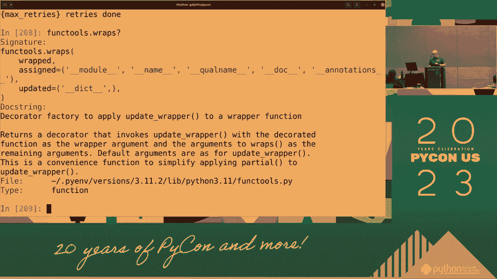

让我看看，我知道，让我们也许只做这一个，所以我们可以重试有一个状态，本质上是这样，而不是，对于每个函数调用，它只能执行其中的三个，我们能不能，在这种情况下，我想最大重试可能真的没有意义。

但我们能让它算数吗，它在各种不同的函数调用中重试了多少次，所以这意味着我们需要以某种方式保持状态，有几种方法可以做到这一点，一种是某种全局变量，那样就可以了，这通常不是个好主意。

一个更好的主意是在函数上使用一些属性，你只是把这种状态，第三个例子是创建一个类，我一定会，我不知道我是否有时间演示这一点，但我一定会留下一些关于如何使用类的笔记，对于装修工来说。

因为到目前为止都声称装饰器是一个功能，返回函数中的值，返回函数，但这真的足够了，它是一个可调用的，您可以拥有类实例，你可以这样叫，因此，您也可以将类用作装饰器，所以在一些笔记中，我会和你分享链接。

之后你可以看到如何做到这一点，但现在，是啊，是啊，就像最后一个例子，我们能在重试上放一个计数器吗，这将在全球范围内计算重试的次数，所以我们可以调整我们已经写好的代码，所以只要再多几行，我猜。

所以我就不说了，因为我们快没时间了，但我会给你两三分钟的时间来玩它，然后我们可以看看，好啦，我猜，然后呢，准时完成，我就开始做这个，所以我会给你看，我们将此作为装饰器的属性的解决方案。

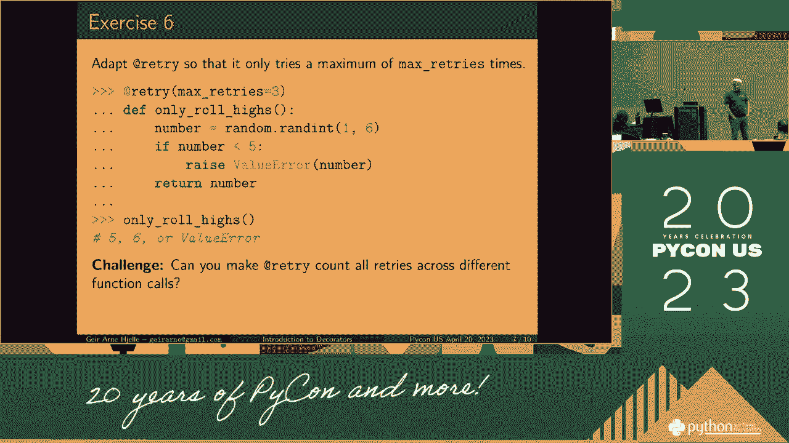

看看这个，所以我们重试，所以我们不会对这个函数做太多改变，让我看看，但是我们，我们能做的，可能看起来有点奇怪，是可以添加添加属性的，如果你还记得的话，我们已经简单地看到了这一点，所以说，例如。

让我们看看我们是否有唯一真正的高潮，我们应该能做些什么来看看这个，对呀，所以在某个地方添加了这个属性选项卡，所以我们可以在这里做类似的事情，在定义包装器函数之后，我们可以说重试次数。

所以现在我在这个包装器函数上定义了一个属性，现在我不使用它，所以我们还没有完成实施，但让我们看看会发生什么，所以我会把这个转移到我的涟漪上，然后再次实现唯一真正的高点，现在如果我只看Rho。

我在我们地区搞砸了一些事情，哦哦，我抄错了，令人印象深刻，谢谢你，好啦，我们再试一次，现在它在那里，然后让我们看看这个和这个是的，好吧，那里，所以这个重试装饰师，因为这个队伍。

这里添加了nunretry属性，所以这意味着我们把状态存储在函数本身上，而不是污染，那么我们的下一个任务就是用这个，让我们看看我到底想用这个做什么，嗯，现在可以让我们稍微先进一点吗，说我想做最大重试。

但减去重试次数，我已经做了，我需要真正数一数这些东西，所以我会说包装点内存尝试加等于一，然后呢，是啊，是啊，我一开始就把它扔在这里，这样我们就可以看到了，是啊，是啊，所以这就成了一条很长的线。

所以让我们看看，好啦，我现在就把它留在这里，嗯，如果我们复制这个，所以现在你可以看到，我加了一句，让我们在for循环中查看，现在我只是在做最大重试，减去我已经做的数字，然后在例外中，我打印出这个数字。

然后我加了一个，所以我在数，所以如果我们做，装饰我，现在让我们把这个数字加高一点，所以我们可以再试十次，然后我说只有一个，一卷高，把这个叫做，现在我有六个，你可以看到它在重试。

我想我应该在打印数字之前加上，但是像这样的事情，现在我们可以看到它一直保持在正确的位置，因为它一直数到二，如果我看这里，你可以看到我已经重试了三次，如果我现在再这样做几次，四五六七八九十。

然后我们现在可以看到我完成了十次重试，我们在几次祈祷中都保持了状态，即使不使用类，让我们看看它的代码，所以现在我们实际上设法或多或少地填满了我们的屏幕，啊，所以我猜这里有些神奇的阿里吉斯。

在那里我们可以添加我们的属性，然后我在这里和那里多次使用该属性，好啦，有什么问题吗？我敢肯定可能有这么多，但如果你是的，他们不会。

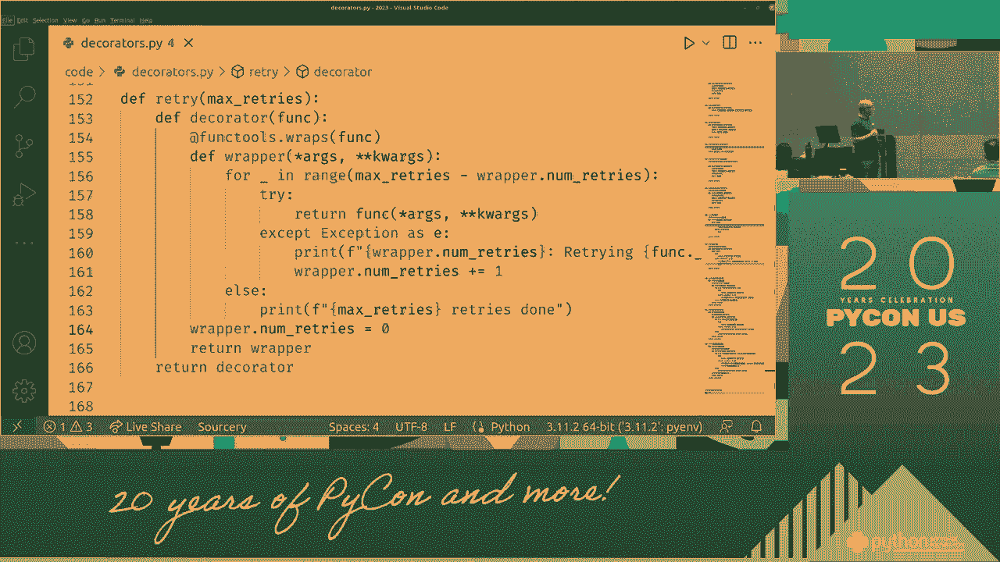

他们现在不出现了，你可以阻止我，如果你在剩下的会议上看到我，或者晚点给我发邮件，或者类似的东西，就像我一开始说的，我会把所有的代码放在我的GitHub上，所以我让我们看看，让我们把这个转到资源上。

然后呢，所以是的，GitHub网络斜线黄色，黄色的，你应该能找到这些东西，Python上线的时候我会给你一个类似的课程，所以有一些视频课程也在那里，然后我会添加代码，我想我一开始没这么说。

但在我的日常工作中，我为真正的蟒蛇工作，它是一个网页网站，在那里你可以学到很多不同的Python东西，包括我几年前写的一篇关于装饰师的文章，在那里你会发现很多相同的材料，就像付费墙一样。

你也可以找到一个视频课程，经历了很多相同的事情，然后网上还有一些其他不错的地方，当然如果你真的想看技术细节，你可以看看水龙头318，它在某种程度上说明了一些历史，他们为什么要做装修工，他们是如何工作的。

那也是，我觉得有趣的部分，可能是读了一些不被接受的东西，有一个很棒的装饰师名单，这也在GitHub上，所以是的，还有很多东西要探索，呃，但我想这就把我们带到了最后，呃还有什么问题吗，对不起，是啊，是啊。

所以我把练习幻灯片也放在那里，是呀，完全正确，也没有井，那么感谢大家的参与，真的很棒，感谢大家上传您的解决方案作为，是啊，是啊，至少能有一些活动感真的很好。

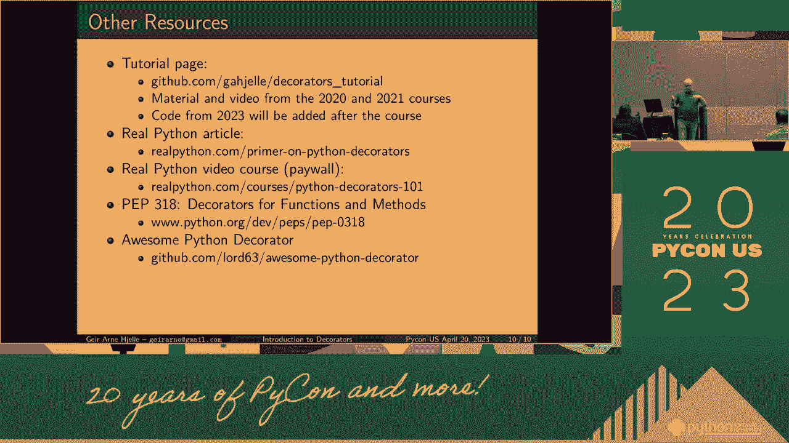