# P79：Tutorials - Lisa Carpenter_ How to create beautiful interactive GUIs and web app - VikingDen7 - BV1114y1o7c5

很酷的团队，大家好，欢迎，欢迎来到Python二十二三的这个Streamlet教程，站在你们面前真是太神奇了，我要坦白，我有点紧张，我在过去的三年里一直在教变焦，而且变焦时很安全。
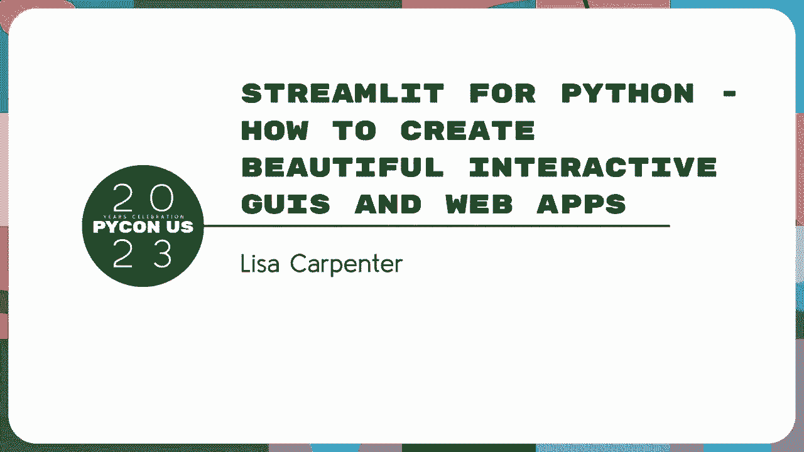

我可以有一千个显示器，上面有我所有的代码和我面前的一切，所以谢谢你容忍我，当我在真人面前冒险回到教室时，不仅仅是事情，一件不好的事情是，当我讲可怕的笑话时，我就知道你不是真的在笑，因为在我的变焦课上。我只是傻笑了一下，就像是的，真正落地的，但在这里我会知道这不是，不过没关系，在我们开始之前，希望你有备忘录说你需要安装蟒蛇，以及小溪，所以如果你还没有，现在请花一点时间开始下载，很多人想下载它。同时它可能会有点慢，所以现在试着下载它，如果可以的话，如果你不能，不用担心，你可以匹普，手动安装很多东西，PIP安装最重要的是Streamlet本身，这将是非常亲力亲为的，所以如果你没有安装流光。你可能会过得很糟糕，我把这个留在这里一会儿，如果你还没有做过这些事，开始下载吧，嗯，好让我们继续，好的，Dokey，我叫丽莎，我从英国伦敦飞到这里，如果你想知道我的口音，是伦敦。

我在一家名为Digital Futures的小型初创公司担任首席数据专家讲师，我们都在为来自不同背景的人提供技术培训，所以基本上我可以教和训练蟒蛇，每天所有真正有趣的数据科学东西，我真的很喜欢。我很兴奋今天能和你们分享，我也只是一个流线型的爱好者，我发现了一些关于Streamlet的事情，我想是几年前的现在，完全坠入爱河，它填补了我心中的一个洞，嗯，我需要在我的数据科学管道。所以我不为Streamlet工作，嗯，他们确实给了我一件很好的连帽衫，因为我是教育项目的一部分，所以谢谢流光，嗯，但是是的，我不为他们工作，我真的很喜欢他们的产品，我很高兴今天能和你们分享。所以欢迎来到我们的辅导室，嗯，当然，问题是如此如此受欢迎，请随时打断并提出一个问题，嗯，同时也互相帮助，如果你看到那个愤怒的红色小盒子，你知道的，语法错误，你不能完全理解，为什么要问你周围的人。

你旁边的人看到，如果他们知道为什么它不起作用，你也可以把你的手扔掉，我很乐意去看看，下午三点休息，我听说三点还有咖啡，所以如果你想知道什么时候休息，你只要坚持到三点，所以在我们潜入之前。我想知道你的一些情况，所以如果你能去看AHA幻灯片，点com斜线流，我们有几个问题要问你，我就等你们中的几个加入，然后我会点击锁定，酷，我们有三个八个人，我想我们快达到临界质量了，所以第一个问题。你从哪里来，哈哈哈哈波士顿在那里看起来确实有点多，不错嘛，我觉得波士顿就像赢了，只是因为它太直接了，一种拉法，不错嘛，容易拼写，酷，我想你们大多数人，非常感谢你的分享，嗯，也是一个多么国际化的团体。新加坡也藏在那里，我们已经得到了菲律宾，我们有德国，嗯，所以欢迎大家，不管你来自哪里，冷静下一个问题，哎呦，哎呦，有人在打字，好啦，那你平时的想法是什么？你喜欢在哪里工作、娱乐和发展，很多馅饼的魅力。

哪个好，大量VS代码，这里有一点木星，我们中最喜欢在笔记本上工作的人，我们将发现Streamlet需要脚本文件，所以圆周率，没有笔记本，嗯，所以当你第一次跳到，只使用脚本，但是很酷，好啦。今天你可以用任何你喜欢的IDE，那绝对没问题，只要不是笔记本，那你为什么在这里，你为什么对Streamlet感兴趣，我需要解锁提交，我爱我讨厌JavaScript的人，那是，我也有同感，好极了，酷。这些都是我希望你在这里的原因，所以我们似乎很符合我们将要教你的内容，你们所希望的，如果你只是想填补一个教程的位置，那也很好，看你喜不喜欢，不管，酷，谢谢你的团队，那么你希望从今天的教程中得到什么。成功对你来说是什么样子的，我在找，不错嘛，好啦，再次感谢大家的分享，感觉很对齐，希望你能带着这些东西离开，爱它，嗯，你最想学的是什么？有点重复最后一个问题，嗯，但是如果你对Streamlet有所了解。

你现在有什么问题吗？你有什么不确定的吗，如果你是图书馆的新手，那也很好。
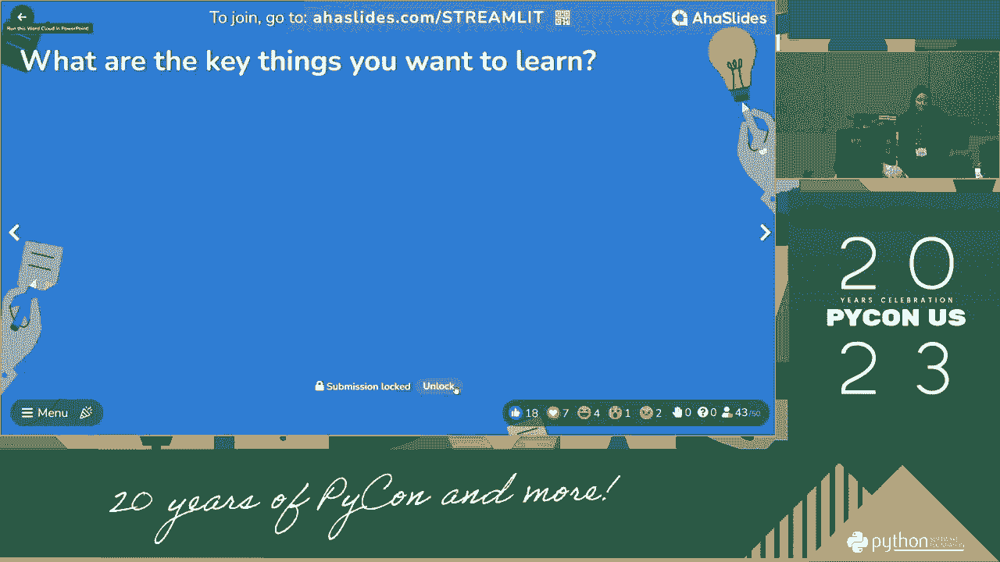

我真的很难过，把地理空间，我实际上没有包括任何地理空间，我对此感到很难过，因为它令人印象深刻，很有趣，嗯，对地理空间感兴趣的人，以后来找我，我会给你大量的资源，我们可以对地图和地理空间感到厌烦。但是是的，我们今天不太了解地理空间，但剩下的大部分我们都在做，爱它，非常感谢团队，我想最后一个问题，你们都想拍张照片的东西，盐湖城有你推荐的餐厅吗？到目前为止，你吃得好吗？你觉得每个人都应该去那里。点击那些建议，没有一个是公正的，你认为他们都是坏人，或者你还没去过，好啦，对于那些还在寻找的人来说，请随意抓拍这张照片，你可以，你可以把它拿走，当然啦，会议上的自助餐厅午餐区是真正的答案。但我看得出来你们都去了，爱它，酷，非常感谢你在那里的提交，它将保持开放，所以如果你想到什么，你可以把它加进去，嗯，这也是问更多离散问题的一种方式，如果你有更概念性的问题。

或者只是你想在最后得到答案的任何东西，您可以随时通过我们的幻灯片提交它们，但是很酷，非常感谢你在那里纵容我，嗯，回到幻灯片上，所以说，让我们来看看，你们的学习目标是在课程结束时。您应该能够自信地创建和部署单页和多页，多页应用程序实际上是世界上最简单的东西，所以即使提到他们也是一种欺骗，因为它是如此简单，嗯，但我们希望你能用，用于输入和输出的各种小部件。希望你会对Streamlet感到兴奋，并了解如何提高和继续你的学习，所以我们的议程是这样的，我们将快速介绍流光的概念，它的作用--看看它是如何工作的，然后我们就开始玩它，因为我相信你们都想开始玩。也不太听讲座，所以我们要直接跳到，建造我们自己的游乐场，看看所有的组件，然后我们有两个现成的例子，它们都是数据科学的例子，在那里你要做一些超参数，在我创造过的最糟糕的模型上调音，嗯，然后一些回归。

回归输入也是，然后我们就结束了，谈谈下一步去哪里，太棒了，贯穿始终的任何问题，只要让我知道太好了，还有几件事我们今天没有讨论，所以我们不会讨论机器学习，我们将使用两个机器学习模型。但是我们已经为你写好了，他们不是特别棒，所以我不会把它们作为最佳实践，嗯，但是我们今天不会讨论机器学习的概念，我们也不打算进入，如何使用某些可视化库的细节，我相信你知道，现在有另一个教程正在进行。仅仅靠可视化，这是一个巨大的话题，真的很大，真的很好玩，所以我们将主要关注Streamlet，而不是可视化库，奥基·多基，所以对Streamlet的一点点理论介绍，它是如何工作的，然后我们要跳进操场。不错嘛，因此，正如您所知，您可以轻松地创建Web应用程序，你不需要任何前端经验，所以我们不需要CSS，我们不需要html，也不需要javascript，所以之前说讨厌JavaScript的人。

你可以很高兴知道你不需要它，Streamlet的一个好处是，如果您愿意，您可以使用它，所以说，如果您想使用CSS，JavaScript和html，你还是可以，你可以把它结合到你的应用程序中。对于我们中的数据科学家来说，它是在考虑数据的情况下建立的，处理数据有很多漂亮的特性，这么多熊猫都是小溪里的土生土长的，所以你不需要重新发明使用组件的意愿，你已经知道并爱上了。最喜欢的机器学习库和我们最喜欢的可视化库，就在小溪里工作，它有处理程序，只是使用我们最喜欢的组件，所以我们不需要变通办法，我们不需要那样疯狂的事，我们可以和我们的图书馆合作。我们喜欢和他们一起工作的方式，Streamlet会为我们做大量的列表，所以马特普特利布·普特利·布克·阿尔特，我们可以像往常一样工作，Strelet会让它发生的，那么Strelet适合哪里呢，真的。

我只是想和你分享小溪，美丽的卡通片，他们有一大堆这样的，我真的很喜欢他们，但这都是关于模型部署阶段的，我们可以使用Streamlet作为Web应用程序，在模型部署阶段真正使我们的模型栩栩如生。我们的一个例子实际上显示了它也发生在模型构建阶段，嗯，但很多发生在模型开发，这并不是Streamlet的唯一用途，虽然我们有很多方法可以做到这一点，所以模型输入，这是你今天要看到的例子之一。所以我们有一个机器学习模型，我将向您展示如何使用Streamlet进行输入，让模型做预测，所以它真的让模型栩栩如生，你可以和非数据科学家分享，这样他们就可以根据新的数据做出预测。我们可以用它来调谐超参数，所以我们的模型，看看不同的参数对它的影响，嗯，交互式数据探索，交互式仪表板，有大量的交互性，我们能做的真的很令人兴奋，Streamlet有一个本地映像类型的界面。

所以你可以从网络摄像机中提取图像，或者只是硬盘上的图片，然后在你的计算机视觉中也使用它，当然，聊天gpt 2可以与任何API一起工作，本质上，它真的只是Python，嗯。所以如果你想为聊天GPT制作一个界面，或者任何类似小溪的东西都很适合，嗯，您也可以为几乎任何您想要的东西创建接口，或数据的前端，我最近参加了一个游戏节，在那里我正在举办一场锦标赛。其中一个参与者走过来说，我们能看看数据吗，我们能看看排行榜吗，它就像谷歌床单一样，有大量的机密信息，在一大堆奇怪的事情中，所以不，他们看不到，但十分钟后，我很快就做了一条小溪。仅链接到谷歌工作表中一个页面的社区云应用程序，整理了资料并提供给他们，我不知道我会怎么做，没有小溪，会很混乱的，流光有很多用途我们可以做很多好事，快到操场了，我保证嗯，所以有三件事你需要知道。

第一个是一切都是函数或方法，是蟒蛇特有的，所以我们要做圣，代表小溪然后点，然后函数或方法，对不起，嗯点对，是我们要学的第一个，它基本上只是输出我们给它的任何东西，如果你给它一个数据帧。它将输出一个漂亮的数据帧，给它一个形象，它将输出一个美丽的图像，接下来是我们的小部件，嗯，这些是我们要分配给变量的方法，以获得我们想要的，第三件事是组件库，这些是Streamlet的第三方扩展。我们今天不是真的报道这些，因为有太多，嗯，但它们确实扩展了Streamlet的功能，所以说，它们非常值得一看，好的，Dokey，所以对你们所有人的第一个小测试，我们要做的就是打开我们最喜欢的。那不是笔记本，我们将尝试我们的第一条小溪，所以它只是进口流作为ST，现在我们要做st dot，然后我们要调用的方法，所以st点头部，当然我们从你好世界开始，嗯，然后一条新线。

在Streamlet中唯一需要的命令，因为一旦你看到它有多美，你只会想玩这个所以点气球，开括号，关闭，一旦你在你的IDE中做到了这一点，你会想把它保存为Streamlet，下划线，应用程序，点。我们做完了就好了，我们要去蟒蛇提示符，我们要打电话给Streamlet，紧随其后的是运行，后面是你刚才给的文件的名称，希望我们都能看到你好世界和气球，如果你和这些东西作斗争，也不管用，把手举起来。我们会试着调试，希望我们都能看到一些漂亮的气球，好的队员们，听起来大多数人现在都让它运行了，谢谢你在那里的耐心，当我们进行现场调试时，嗯，所以我想让你做的一件事是回到你的原始文件，把圣点气球换成圣点雪。斯诺沃雪嗯，只需点击文件上的保存，跳回Streamlet界面，您应该看到它提示您源文件已更改，它想让你点击重播，所以现在您可以开始看到开发周期，您将在本地使用，您不需要一直重新运行该文件。

我们可以做出改变，命中保存，它会重新加载并为我们重新运行，所以试试看，享受雪，你得到了一些雪，很酷吧，你知道的，现在雪地里的气球，你知道的，基本上你需要的一切，准备生产，Okie，Dokie。所以为了让我们开始，我们所做的是创建一些启动码，所以如果你想转到这个URL，所以rb点g y 4 0 8 s，如果你不太信任链接缩短器，完整的链接是底部的那个，所以它只是一个GitHub存储库。如果您想继续下载到本地机器上，这是初学者文件，也是解决办法，但不要偷看解决方案，嗯，下载初学者文件，它会给我们一个框架，我们需要继续完成教程的其余部分，我暂停一下，让你继续下载，嗯，如果有人需要帮忙。把他们的手举起来，我们很好，如果真的是你干的，很好大家都拿到文件了，好啦，完美，所以是时候开始实时编码了，所以请原谅我，我只是要交换到我选择的IDE，我还没准备好放弃木星笔记本，所以我还是用木星。

我们只是在非笔记本模式下做，所以你要去的文件是操场，坐在操场上的圆点馅饼，所以如果你想打开它，这完全是意料之中的，并在这里向您展示了一点错误处理，嗯，好像我不知道，我没有木星运行。所以让我们把一切都关上，试着把一切都交给你，好的，Dokey，所以嗯，我们所做的是为你创造了漂亮的小标题，这样我们就能看到发生了什么，并提醒我们该怎么做，我们要做的第一件事是添加一个标题标题。和子标题到我们的页面，所以我们总是从ST点开始，几乎所有的东西都会打电话给图书馆，然后告诉它什么方法，所以不出所料，这只是将是ST点标题，正确拼写，如果你愿意，或者你可以为了好玩而把它们打错。我给它一个头，也许吧，所以我们需要做的一件事是，返回蟒蛇提示，对你们来说太小了，我很抱歉，但是如果你想进入你的Anatanaconda提示符，这将是流线型跑步，然后是操场圆周率。

确保您在正确的文件夹位置，所以不管操场圆周率在哪里，这就是我们需要运行这个一旦我们击中，输入，应该，事实上，启动Streamlet服务器，给我们我们的游乐场。
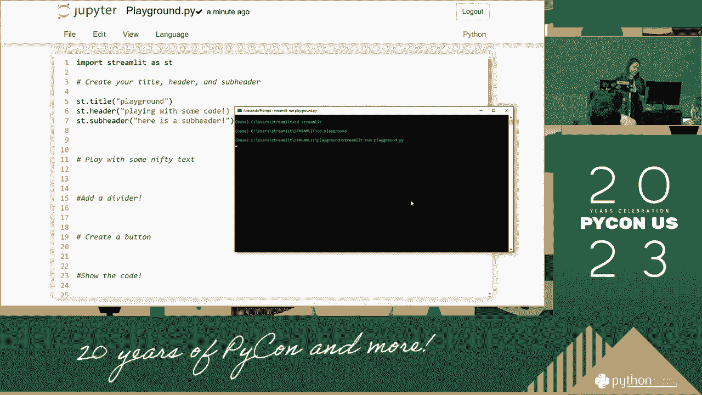

是啊，是啊，太尴尬了完美，下面是一个很好的例子来说明错误是如何发生的，我故意这样做只是为了向您展示错误是什么样子的，嗯，但我们实际上得到了一些非常方便的漂亮的小弹出窗口，让我们知道哪里出了问题。所以未终止字符串文本，从字面上看，错误，我看到所有的时间，现在回到我们的代码。
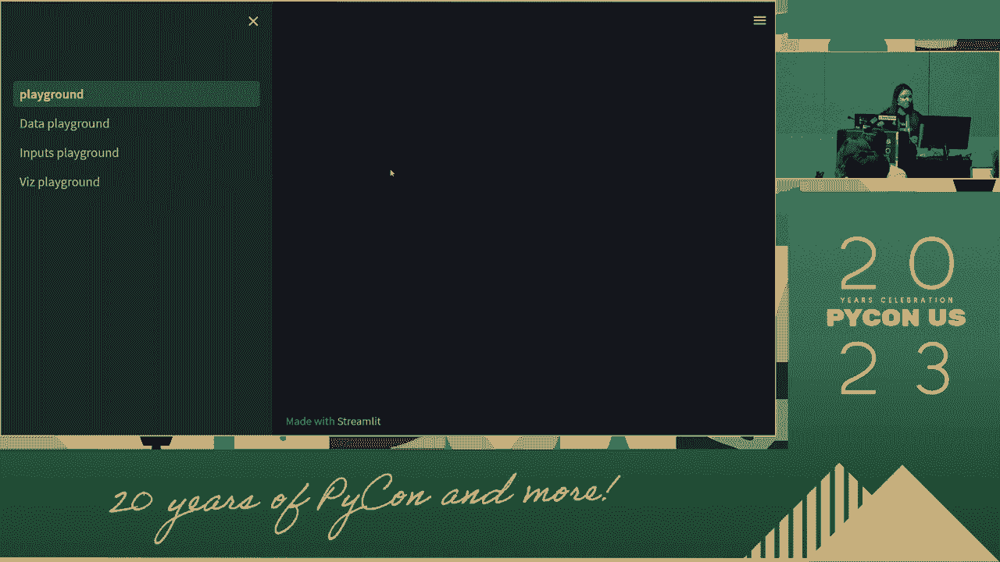

我先走了，再次修复我的错误，我现在可以按控制键了。
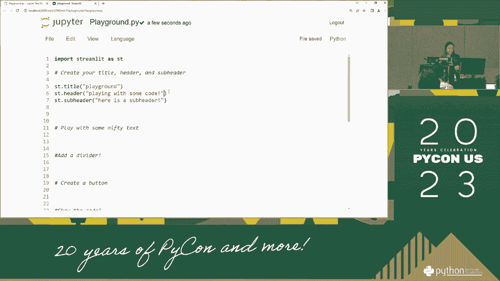

保存弹出，我有这个总是重播的按钮，如果我想继续点击它，每次我保存我的文件，它将继续进行，并对我所做的做出改变，干净利落的工作方式，你可以看到我们实际上在使用一个多页面的应用程序，你可以把侧边栏去掉。现在我们不需要它太棒了，所以我们有了一个标题，我们有一个头球，我们有潜艇，头也是，小菜一碟，哦，你的可能只是，我是。
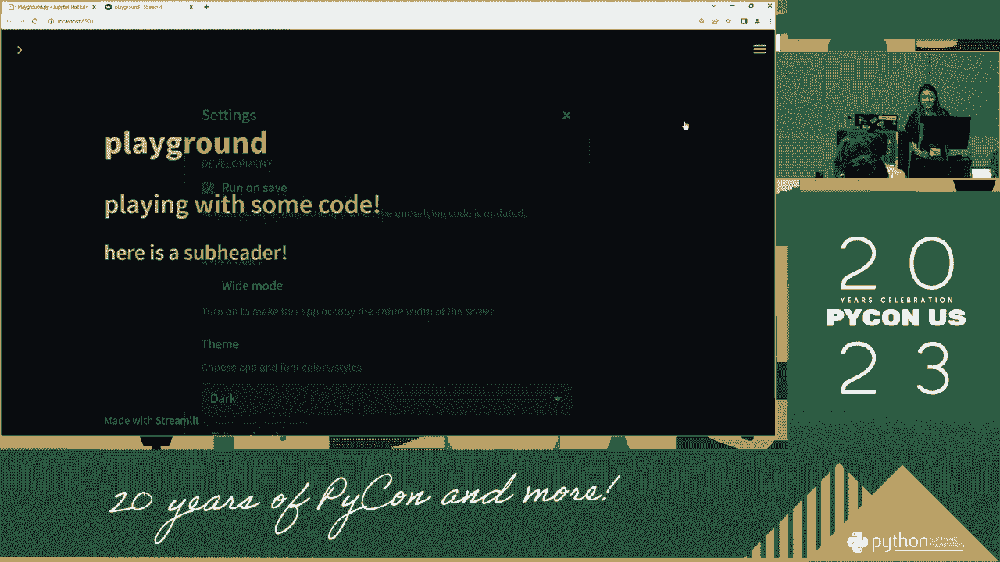

你的可能是光模式，你的可能有点像这样，我希望你们中的一些人现在说你们看起来很融合，嗯，我会把我的调回黑暗模式，如果你想加入黑暗模式团队，你只要走到三行，在这上面，我们进入设置。
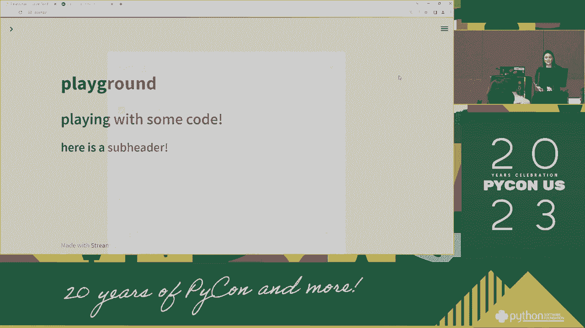

然后我们可以像这样挑深色的，嗯另一个场景，你会看到还有宽模式，这只是意味着它用完了整个容器，而不仅仅是很集中，所以我们有标题标题，分标题，我们现在知道如何在执行代码之间切换，然后看到结果，相当瞬间。溪流中的结果，感觉总是很好，准备好我们想要的下一个片段了吗，我们想要更多精彩的。
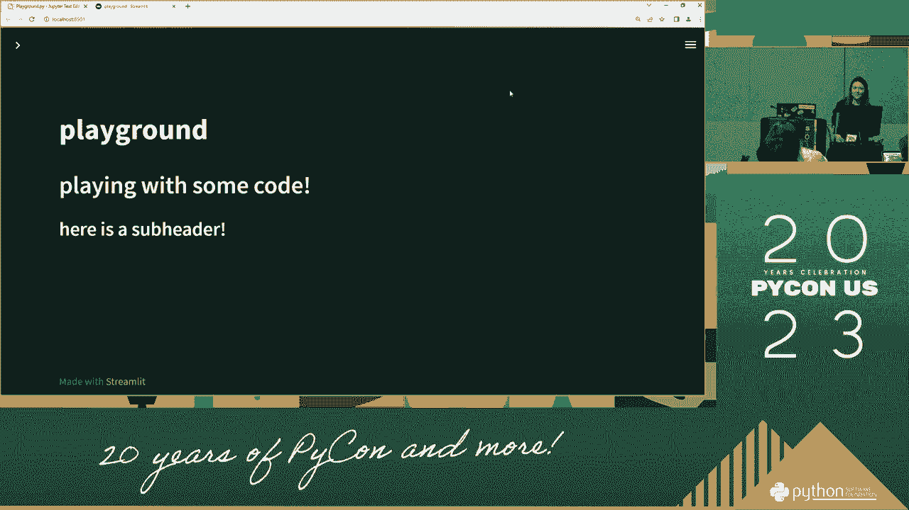

酷，所以我们可以做的一件事是st dot text，关于ST文本真正有趣的事情，如果我们继续做一些多线字符串，比如，所以它会注意我们放入的空白，所以它只是显示了我们拉进去的绳子，不管我们怎么把它拉进去。所以说，如果要在选项卡中放置缩进，像这样的事情，它将非常尊重这一点，并为你展示这一点，如果你想把表情符号放进去，你可以，当然也把表情符号放在这里是一个美丽的句子，我之前做的，击球扑救突然回到操场。你可以看到它很荣幸，我投入的空白，所以如果你想显示文本，你想让它得到尊重，你能做到的，所以现在我们要在代码中添加一个分隔符，所以这将是一如既往的圣，你永远猜不到添加分隔符的代码，布朗尼点。如果你猜到是隔板公平地说是个好东西，这是个很好的猜测，但是是的，只是隔板，嗯就这样，大家可以看到，我们现在在这里有一个隔板，小溪里没有多少把戏，一切都命名得很美，嗯，它真的是你想要的，是个隔板。

所以代码是分隔符，你明白了，是啊，是啊，什么，你的错误说明了什么，无属性分隔符，你很久以前就安装了Streamlet吗，我不知道，是啊，是啊，我不认为隔板是新的，但是在Streamlet工作的人。会去找你，准备好做我们的第一颗扣子了吗，做我们的纽扣，会很简单的，我们实际上要从一个变量名开始，就像Python中的任何变量名一样，在Python的规则和参数中，它可以是您想要的任何东西。我要创造性地把我的扣子叫做我的扣子，因为我的编码就是这样描述性的，但我是个数据人，而不是一个真正的Python开发人员，因此，我们不遵循与实际开发人员相同的编码标准，酷，所以不出所料，这将是ST点按钮。然后我们要给它一个标签，就像这样我们开始吧，点击我，爱它，当然啦，当我们点击它的那一刻，这不是真的要去，不会做任何事，所以我们与按钮之类的东西交互的方式是如此简单，这只是一个假设。

所以我们只要说如果我的纽扣，然后就像一个正常的if语句，当按钮被点击时，我们想要执行的事情，去嗯，所以你可以摘气球，或者你可以摘雪，你只要把它们都拼对就行了，像这样，现在它们是一些非常巨大的气球。因为我被放大了，但就是这样，我们使用一个非常简单的if语句，所以我们把那个按钮分配给一个变量，在我的情况下，我的纽扣，然后我们就说如果我的纽扣，然后我们放在那里的任何代码都将执行，当我们点击按钮，嗯。如果你想在任何时候，一边说一边展示你的代码，我们有一个非常优雅的方法来做到这一点，像这样，我现在要继续缩进这个，酷，您可以看到它将执行并仍然工作，但是如果你用回声，它继续前进。还展示了在运行教程时非常有用的代码，你希望人们能够看到代码，被处决的东西，你不需要添加回声，如果你不想，但是在操场上很好，因为这样你就会看到所有代码的来源，你可以看到回家是相当令人满意的，一切都好吗。

好啦，嗯，点击按钮是相当令人满意的，那么我们要不要加一个计数器，看看我们点击按钮的次数，有多少次我们被诱惑去看那些美丽的气球或雪地，所以让我们试试这个权利，是啊，是啊，我们还算可以，别管酷了。所以我们要做的，我们首先要做一个占位符渡渡鸟，所以我就叫我的短信一号，我要做空点，空是占位符，这意味着我们可以稍后覆盖文本，我们想要的，所以我们要创造这个，然后我们可以稍微更新一下。就像大多数基本的Python一样，我要做我的计数器等于，零，如果我能记得怎么打漂亮，所以我要做一个全新的按钮，叫做第二按钮，现在我们只需要把动作率，所以这将是，因为我们之前做了那个空的占位符，2。我们能做的是…而不是…，嗯，我们将处理要更改的对象的名称，然后点在右边，这实际上是用文本覆盖相同的占位符，我们现在希望它显示，我要用F弦，感谢团队，是啊，是啊，那很酷，我从右边逃出来了，你可以看到很酷。

感谢希特勒，大家可以看到，我的按钮坏了，它永远不会超过1，太悲哀了，好伤心，嗯，有人想猜猜或者告诉我为什么，为什么我的计数器从来不超过1，是啊，是啊，绝对如此。我们需要了解Streamlet的一个关键基础是，每次我们在默认情况下互动，它将从上到下重新运行脚本，这意味着当我们有一个像我的计数器等于零的赋值，我们实际上要做的是将计数器重置为零。所以它永远不会超过1，因为每次我们把它拉回零，当然啦，Strelet非常聪明的人想到了这个问题，给我们一个解决方案，所以这就把我们带到了会话状态--会话状态是一个后端组件，它总是存在。只要您的小Streamlet服务器在后台运行，我们的会议状态会在那里，所以不用直接用计数器，我们可以与会话状态交互，我们可以将计数器存储在会话状态，或者我们可以用会话状态做一些事情。

决定是否需要将计数器设置为零，所以我们要不要修复我们的按钮，增加一点会话，不错嘛，让我们这样做，所以我们要回到这里，我的计数器是零，我们会说如果柜台不在，它只是一个会话状态，呃，这里太窄了，我们走吧。如果计数器不处于会话状态，我们要说st会话状态，这个现在就像字典一样工作，这是一本有键值对的字典，所以我们要说，我们将把它设置为零，这只是意味着如果计数器还不存在，要添加它，会话状态是持久的。重播时不会被擦掉，所以现在我们要做的就是把我的计数器修好，所以比起我的计数器，这将是一个ST会话状态，如果您愿意，您可以执行属性快捷方式，也可以用方括号法，如果我没有犯错，我们现在应该得到一个错误。因为我们还在重复错误的东西，酷，所以，当然啦，这应该是第一次会议，所以你可以看到我们现在可以愉快地点击按钮，它将继续更新，这是相当多的代码，所以我要暂停一下，给你点时间叙叙旧。

但你需要的代码是如果你被卡住了，或者在这个时候你需要一只手，把手举起来，我去看看能不能调试，创建，是啊，是啊，所以计数器会设置，你可以叫它我的柜台，但是是的，因为我在这里说过，啊，好啦，是啊，是啊。你去了一个不同的地方，是啊，是啊，把我的柜台处理掉，是呀，我们不是旧闻，而且是的，你你犯了同样的错误，我做了，你可以怪我，哎呦，所以这需要，不不不不，所以这将是st点的会话状态，是啊，是啊，非常抱歉。那不清楚，现在有道理了，不错嘛，我喜欢它，真的很满足，哼，就像点击按钮一样，我看得很好，看着它上升，是呀，所以我看到了SC按钮，它的签名有一个点击，如果狗点击与，作为，如果SC按钮喜欢，你能用，嗯。您可以用它运行一个函数，这真的真的超级酷，所以是的，您可以定义我的自定义函数，然后把它们分配到，那样真的很酷，我们没有完全按照评论提示，所以如果你真的喜欢把东西放在正确的地方，请随意调整，嗯，评论提示。

但是是的，我们把它固定在顶部，而不是做一个，酷，所以现在你有一个新的东西带回去给你的朋友，你的家人，你的同事，你可以给他们一个按钮，公平地说，他们可以点击，有一次有饼干点击器，在整个游戏中。你只需点击一个饼干，所以你在某种程度上复制了这一点，所以祝贺你，酷，接下来我想提请你们注意的是，所以在操场上，我们给你的文件夹，你会看到有一种叫做页面的东西，这实际上是如何创建一个多页面应用程序。他们让事情变得如此简单，这一切都与您使用的树结构有关，所以你总是会有一个主页或第一页，它总是位于您的根目录中，这就是你最初所说的，但是你可以有一个页面文件夹，这个页面文件夹包含点圆周率文件。这些出现在侧边栏，所以这是一种很好的工作方式，我们一开始就把侧边栏藏起来了，但是你可以看到你可以添加任意多的点圆周率文件，他们会出现在你的侧边栏里，然后当你点击它们的时候。

你可以通过多页面应用程序的精妙之处看到它的出现，它们共享同一个Python实例，所以你在主页上设置的任何变量仍然会在那里，在随后的页面上也是如此，会话状态也是完全共享的。所以如果我想我的柜台或圣塞斯坦柜台，我也可以用在这一页上，所以所有这些变量都会转移到完全凉爽的地方，我们准备好玩一些数据了吗，是啊，是啊，嗨，是呀，是啊，是啊，是啊，是啊，所以这是一个共享的状态。所以如果你一直在一个孩子身上改变它，它也会影响到家里的那个，是啊，是啊，当然，它会完全停留，直到你继续终止服务器，所以我们用本地宿主的细节得到的小蟒蛇提示，一旦你关闭了它，你基本上就结束了你的会话。所以它会一直呆到那时，不错嘛，所以如果你想继续，嗯，在你的心中，我们只是想去游乐场，然后我们要看看数据游乐场，您可以看到我们已经为您弹出了一些代码，所做的只是生成一些随机数据。

所以五列只是做一些随机的数据，耶，酷，所以你可以在这一节看到，我们在告诉你我们要做什么，我们可以做的第一件事是使用st right编写我们的数据帧，其中一张幻灯片叫瑞士军刀，这是千真万确的。你可以做得很好，把你想要的东西都放进去，它会输出到我们的应用程序中，所以我们可以只做st点，我们的数据帧的名称。
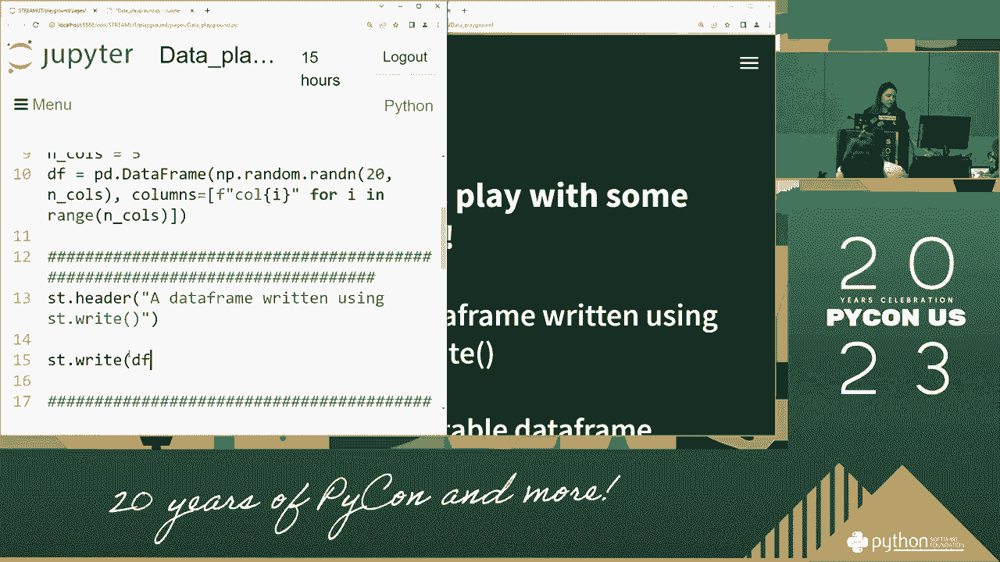

它将继续下去，我要换HDMI，我不知道发生了什么事，我知道我没碰它，我想我喜欢我没有，这相当于把它打开和关闭。
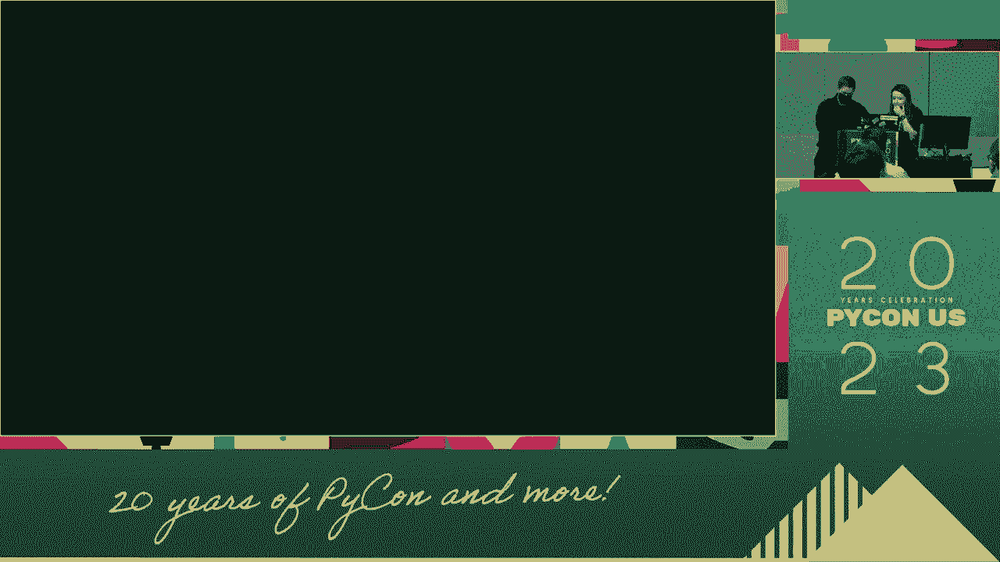

啊，是啊，是啊，现在好了，谢谢你，对不起团队，呃，我们说到哪儿了，酷，所以大家可以看到，它要去头和它的输出。
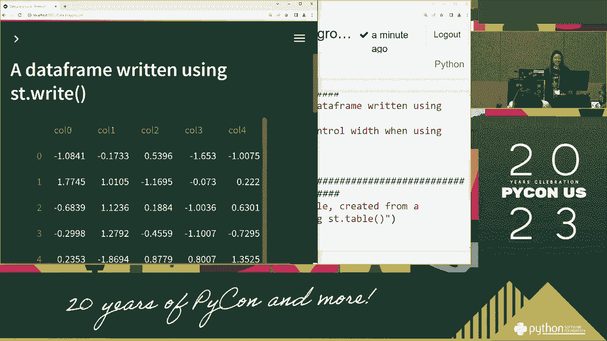

我要赶紧把这些放回原位，是啊，是啊，那更好很好，所以这只是把我们的数据帧写到前端，但我们可以看到一些非常漂亮的特征，所以我们实际上可以通过单击一列来对数据进行排序，它将继续排序，所以已经。在那里添加一些漂亮的小交互性，嗯，它也很容易复制，你可以看到它有一些非常性感的高光，只需选择您想要的数据，命中控制C，它会把它复制到你的剪贴板上，它也以一种很好的方式复制了它，这真的很酷。所以这又是对的，我们可以在前端写任何我们想写的东西，我们还可以做的一件事是ST点数据帧，再一次，我们只是给它一个数据帧，来到这里，向下滚动，它实际上是完全相同的输出。所以st写入默认行为与st dot数据帧相同，不过，一个区别是当您使用点数据帧时，你有几个参数可以控制，比如宽度，所以当你使用st dot数据帧时，你会得到更多的选择，我们还有ST点桌子，不会撒谎。

这个真的很无聊，只是一张桌子，不是互动的，它真的没什么作用，完全是静止的，有时这是一种选择，你想知道圣桌最酷的一点是，它非常可以用CSS定制，所以如果你真的想涉足，真正定制外观和感觉。使用st表是一个很好的方法，但现在我们进入超级有趣的一个，大家可以看到，我们在这里给了你一些精彩的代码，很酷，这个也是，只是会是，嗯，从变量名开始，我们想保存这个的输出，与之前的我们只是输出。我们不会改变任何事情，用这个，有回报，有一个变化正在返回，所以我们想把它分配到某个地方，所以我要说编辑，DF等于，然后我们要做ST，这个是实验性的，然后我们给它取个数据帧的名字，所以在这种情况下，即。嗯，我们可以在这里添加的另一件事是num行等于，动态，所以我们这里实际上有一个可编辑的数据帧，所以我们可以在Web应用程序中实时编辑我们的数据，它只是被保存为数据帧本身，所以如果我们和其他图书馆合作。

我们能够更新数据帧并传递它，所以你可以继续，对数据帧进行一些更改，我们可以放一个很好的小评级，我很抱歉糟糕的格式，不是我平常的想法，我通常有一个琳达责备我，让我有好的代码，所以是的，我的压痕不是不是。据佩佩今天道歉，我们走吧，嗯，但我们可以创建一个下载按钮，因此，我们可以让用户与我们的可编辑进行交互并对其进行更改，可编辑数据帧，然后我们可以继续下载它，就像CSV一样，所以说。我会给你一点时间享受你的，呃，你的CSV在那里，我们喜欢小溪吗，很简单对吧，也很满足，就喜欢而言，它是如此立竿见影，非常简单的代码，输出不错，挺好的，多巴胺从很少的代码中命中，如此爱它，酷。我们准备好看看一些输入了吗，我们将加速运行输入会话部分，因为你们现在都是流线型的专家，所以如果你想继续，我和，我们要开业了，所以我们在这里所做的就是找到一个名为viz库的列表，只包含四个即库。

如果要添加喜爱的库，如果我错过了一个，请随意编辑，嗯，我们将以不同的方式反复问你们的问题是，你最喜欢什么？即图书馆，我要继续交换输入，游乐场，好的，Dokey，所以再一次，我们有同样的模式给你。所以我们放了一些占位符，我们要快速完成代码，第一个是单选按钮，当然你只能选一个，这是如此美好和简单，我们将从变量开始，这将是输入的位置，这样我们就可以用它了，我们要用选定的等式，然后就只有圣电台了，嗯。现在我们可以给它一个标签，所以我要提出这个问题，我们之前预装了，如果我能学会打字，这里的关键词是选项，在这里我们给出了可能的选项列表，它将用它来制造我们的单选按钮，所以只有选项等于。然后我们的迭代或前面的列表，好了很简单，与html不同，我们不需要继续定义多个输入，在这里我们可以给它我们的可迭代，它会像这样继续创造它们，你可以看到这种模式会非常重复，所以现在我们想继续，如果我们想。

我们可以，当然，只要做一点正确的，我刚才的f弦做得很好，我要重温一下，所以我可以向你证明，我知道我的F弦，我们可以说你选择了，遗产，现在当你选择一个新的，它会告诉你你选择了什么，容易，皮西。我们现在可以用Dropbox做同样的事情，所以我们从分配它的位置开始，然后我们可以继续做，它在Strelet中被称为选择框，我们再一次给它贴上标签，这是一个问题，我们走吧，所以现在我们有了同样的东西。但这次是一个Dropbox，所以希望你能看到非常简单的重复模式，这里还有一件事要注意，标签实际上是位置的，我们不需要说标签等于，如果你不想，那是位置上的，它只需要第一个，你给它做标签。我喜欢给我所有的输入命名，我喜欢保持整洁，但如果你想问，你可以，所以我们有我们的多选择，嗯，它是，很直接，又是这个，我们得把它分配到某个地方，我就叫它多选择，这将是圣点，多选择，我就不做标签了。

感觉很糟糕我们走吧，嗯，这把钥匙跟以前不一样，它不会继续返回一个字符串，它将给我们一个可迭代的，所以让我们来看看，我们还可以写，向右，可以看到它正在返回一个列表，它给了我们一个漂亮的空名单。现在我们可以继续了，我很满意，嗯，只是在我们的列表中添加一些选项，像这样，你可以想象这有很多用途，如果你有一个数据框，您让一些用户选择哪些列，他们要去看，你可以这么做，选项是st dot列或抱歉。DF点列，从那里开始，我们所有的输入都有很多用途，我会让你自己做复选框，我不认为这是个诡计，我想这是一个，我真的相信你，你能做到的，复选框为单数，但我想你现在能做到，我真的相信，也许这有点刻薄，它已经。它稍微改变了图案，图案一样，但我们只是在这里使用了一点可迭代的，因为我们有很多选择，所以在这里你可以看到，我们必须做一个循环才能让它做到这一点，但这与我们使用的模式完全相同，我们把它分配回一个变量。

我们只是在字典里做那个变量，让我们的生活轻松一点，也许我想输出像选项的名称，而不是我是那里的东西的状态，我们冷静点，好了，我们基本上使用字典作为输出的占位符，我们可以做四个独立的复选框，嗯。让我把这个代码做得稍微大一点，所以是的，如果需要，可以创建四个独立的复选框，然后为他们每个人都有一个状态，但是通过使用这个字典来循环，只是稍微好一点，干净一点，才华横溢，我们还要检查最后一对。在你有一个应得的咖啡休息时间之前，到目前为止，我们已经从列表中选择了它，现在我们也要看看一些非常有趣的新的优点输入，所以再来一次，它将是类似滑块值的东西，然后ST点滑块嗯拼写正确，滑块嗯。我们只需要给它一个最小和最大嗯，这里也有类似的东西，所以我的最小值是零，我的最大值，会有一百个，我也可以给它一个起始值，我们对此使用Just Value，让我们从中间的50英镑开始，为什么不呢？

我们也可以给它一个台阶，如果我们想，所以这就是我们用滑块的时候，我们可以选择什么样的间隔，我要做一个五步，我还将向您介绍帮助选项，如果我们说救命，我们可以在这里拉一根绳子，像这样。我会告诉你这是如何表现的，啊，啊，是啊，是啊，你需要一个标签，一切都需要一个标签，对呀，我的错，好了现在我们有了数字滑块，就像这样真的很满足，玩起来真的很有趣，你可以看到它在五个方向移动。因为我们得到了5的步长值，我们现在也有了这个小圆锥，我们的帮助也在那里，所以如果你接受用户输入，帮助确实很好，以确保您的用户输入正确的数字，您还可以应用一些格式设置，所以这里我们把它格式化为百分比。再一次，当您要输出时，您只是输出滑块值，真的吗，只是重复我们之前的模式和过程，我们还有一个选择，这是一个项目滑块，同样与以前完全相同，我还是打不了滑块，项等于，只是点点而已，像这样选择滑块，再次。

它总是需要一个标签和选项，嗯，如果你在做像艺术秤这样的事情，这个真的很有用，也许你很想做一些，是啊，是啊，也许应该把那个关上好了，现在我们有了我们的项目滑块，比如，所以如果你对事情有意见，真的很好。你想看看人们站在哪里，很酷的最后一对，在喝咖啡之前，好啦，我们有文本输入，嗯，所以实际上有两种方法来进行文本输入，嗯，我们有我们的，嗯，第一个是什么？假设它是一个文本输入，重复刚才的问题。我需要把它分配到某个地方，像这样，然后我们还有这个，所以文本区域是我们的长文本，所以它会给一个更大的盒子，允许用户放入，我们走吧，我被放大了，所以这个比正常情况下大得多，但我们有单线和多线，本质上。所以文本输入和文本区域，因此，它对于从用户那里获取任何输入都非常有用，你可以，当然啦，对此也要进行验证，所以说，如果您想创建一个验证用户输入的函数，你能做到的，最后两个，呃，在我们做我们的工作示例之前。

咖啡休息时间后，呃，我们有号码输入，字面上只是数字输入，和滑块一模一样，我们需要一个标签，然后我们可以像这样设置最小值和最大值，我们得到了这个漂亮的小，加减，我们可以为此迈出一步，如果我们想。我们也可以手动输入一个数字，我们输入库的最后一个是，其实呢，日期，这只是日期输入，我们走吧，您现在已经从Streamlet学习了所有基本的输入类型，实际上这是Strelet的大部分。这就是你需要的所有组件，你开始制作一些很酷的东西所需的所有小部件，嗯，所以我们要提前3分钟喝杯咖啡，所以你可以像第一个喝咖啡一样，这就像一个战略游戏计划，如果你想二十分钟后回来，然后。我们将开始处理第一个工作示例，在那里我们用你刚学到的一切来应用，对机器学习模型来说，你有什么问题来找我吗，不过，谢谢大家的耐心，感谢你在会议的第一部分，非常感谢大家。

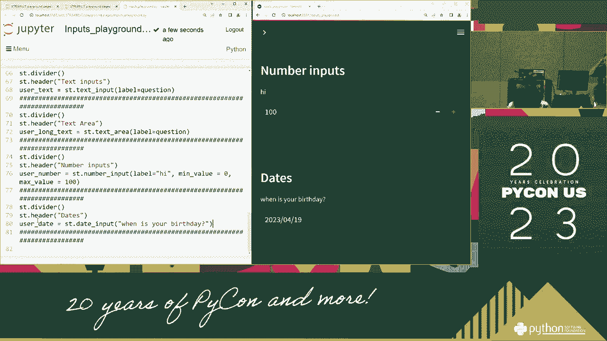

好的，Dokey团队我们准备好继续学习了吗，我们喜欢饼干吗。

很好吃很好吃，很好的大拇指在那里和一些很好的咖啡，希望我们感觉精力充沛，准备好了，所以你看了很多输入，现在我们将用这些输入做一个工作示例，所以这是我们的最终目标，我们正试图制造一个超参数，金枪鱼。所以超参数只是模型的设置，所以如果你在建立机器学习模型，有很多不同的选择，这里的想法是我们做一个输入，在那里我们可以玩这些选项，我们正在玩的模型实际上是一个相当糟糕的模型，它没有特征工程。它基本上没有受到任何影响，这是一个原始的随机森林，有一些非常糟糕的数据，实际上是DOTA 2的游戏数据，如果您想知道基础数据集，所以试图预测DOTA二人组的输赢，数据本身并不重要，在这种情况下。我们也已经创建了，我是你的榜样，所以我现在启动的文件叫做随机森林解决方案，它位于我们给你的数据中的随机森林文件夹中，所以如果你想继续导航到那个文件夹，在你的蟒蛇提示中，您可以关闭上一个。

操场的一个刚刚击中X继续关闭它，嗯，你可以，那我就把我的带过去，所以你可以看到我做了什么，你能放大这个吗，哦，你可以，是啊，是啊，不错嘛，你可以看到我刚刚导航到了正确的文件夹，然后是小溪跑。随机森林解决方案下降得很高，它会继续启动服务器，酷，所以我需要带你了解几个概念，嗯，第一件事是我告诉过你每次我们运行脚本，它将从上到下运行，现在想象一下，如果我们导入一些数据，反复这样做。每次我们运行代码的时候，谢天谢地，我们有一个非常简单的解决方案。
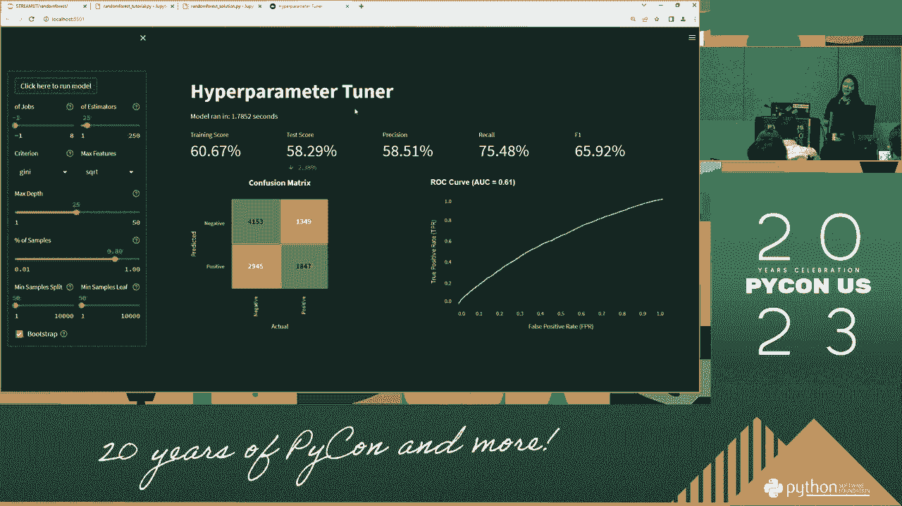

所以在随机森林溶液中，如果我们看看我们调用数据的地方，我们这里有个装潢师，St，这个装潢师，我喜欢装修工，顺便说一下，我从来没有找到使用它们的理由，所以每次装修工有合法用途的时候，我喜欢它是一个装潢耶。但对于一个装修工来说，这是一个真正合法的用途，那么Streamlet将为我们做什么，看看输入是否改变了，看看发生了什么，会有所改变，如果不是，不会麻烦的，重新运行和重现，这个。这两个都会加快我们的处理时间，因为我们再也不需要重播，所以我们的装饰师超越了任何功能，本质上，如果它知道这个函数不会改变，不会麻烦的We’我们在运行它。
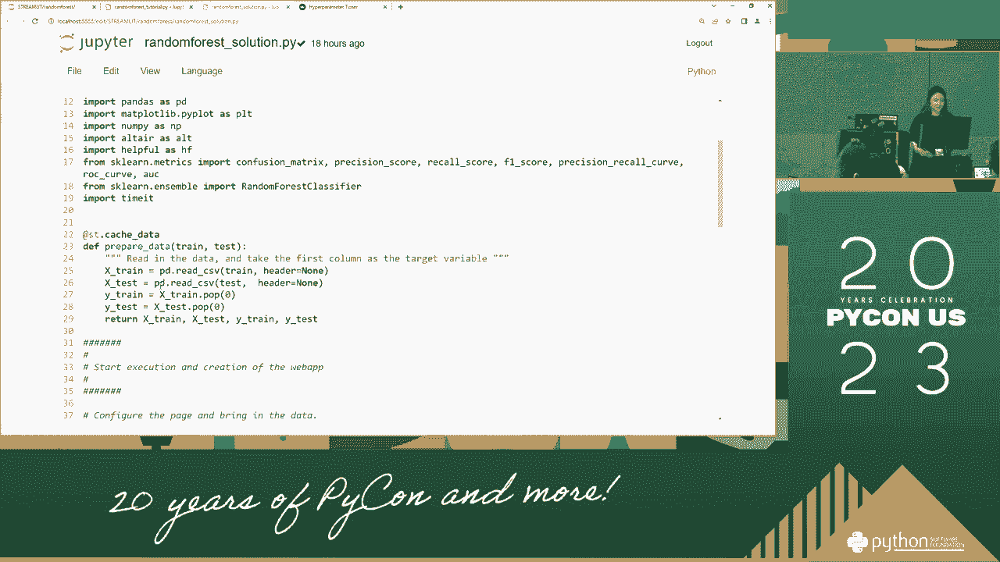

我想向你们介绍的另一件事是形式的概念，因此，有了表单，我们可以将一大堆不同的输入组合在一起，然后我们可以有一个表单提交按钮，这意味着我们可以编辑所有的输入，然后单击按钮，让它实际提交更改。我比以前更快地理解了这些概念，因为我们想确保你有时间玩这个，嗯，但这意味着我们所有的输入，我们可以改变他们所有人，然后在我们准备好的时候执行代码，而不是边走边更新，所以让我们来看看我们的目标。欢迎来到超参数CHO，你要尝试创造一些像这样的东西，我们可以看到我们正在使用侧边栏，所以我们这里不再有可爱的页面了，我们实际上用了。所以我们可以通过使用st dot侧边栏将任何我们想要的内容加载到侧边栏中，在本例中，我们添加了一个表单，但你也可以添加任何你想要的东西，酷，所以这个工作方式，我们有我们所有不同的东西。

当你第一次加载它的时候，这里什么都不会有，嗯，您需要单击以运行模型，但是你可以看到我们可以继续改变我们所有的输入，我最喜欢用它来增加最大深度，减少最小样本，可能会增加估计量的数量。你可以看到它在我的机器上运行得很慢，这是一台相当旧的机器，比利正在从头开始重新运行模型，我们跑了66，呃，那里的随机森林，我们可以看到我们有一个非常超级合身的模型，根据训练数据，我们得到了99分。我们测试数据的百分之五，我们得到了57。4，嗯，所以玩这个吧，如果你想探索，改变这些参数。
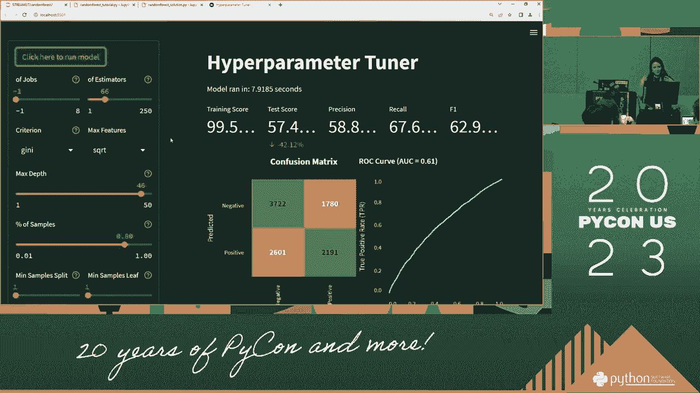

然后单击此处运行模型，但我们对你和我的挑战是，真的帮你，这是使用我们为您制作的教程版本，希望很清楚你需要做什么，我们在这儿编了一本字典，超参数字典，您的任务是创建这些输入。您已经看到了使用侧边栏的一种方法，你可以用任何你想要的方式来做，所以这个现在是相当静态的，它没有输入，这只是字典，您不需要在这里更改此代码，这是实际运行模型的部分，但你可以看到我们只是在末尾写功能。所以你的挑战是把，把这个字典变成用户可以输入的东西，并查看编写代码的不同方法，嗯，您可以随时查看解决方案文件，如果你想看。
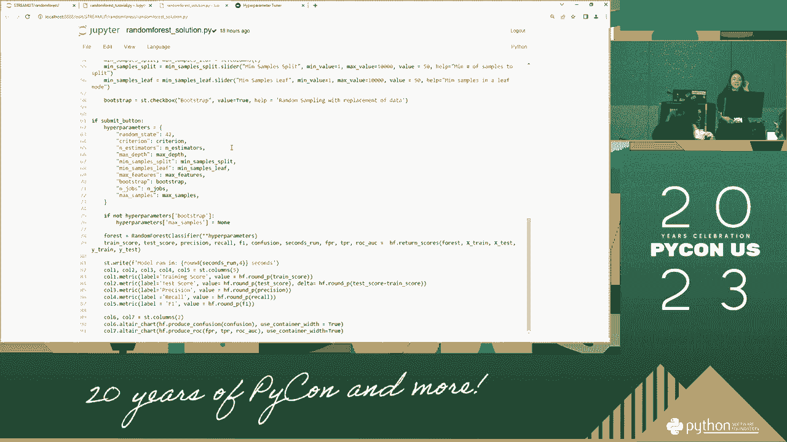

嗯有什么问题吗，只要让我知道，我把这个留在这里，嗯，我会在房间里走走，看看你过得怎么样，但是享受运动吧，制作自己的超参数，金枪鱼。
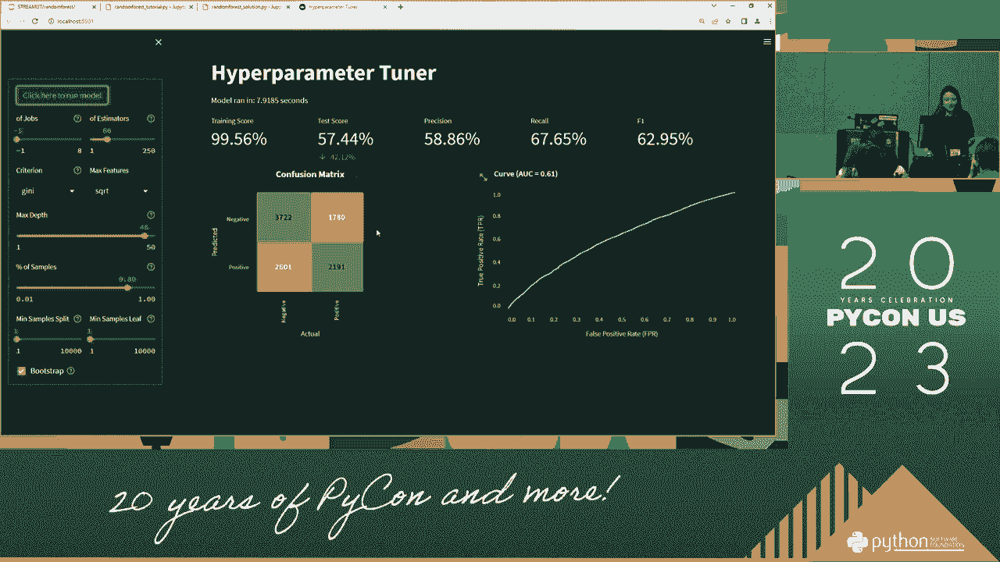

我知道你玩输入很开心，但我们要花点时间，看看一些输出，所以你现在会看到在随机森林的教程版本中，它只是把那些原始输出写到最后，我们还没有看到的，如何做一些很酷的可视化，所以如果我们能回到操场文件。如果你想敞开心扉，即游乐场，我们只是来看看，我们在Streamlet中提供的一些令人难以置信的可视化选项，我们拭目以待，我们可以把那些相当枯燥的输入变成看起来很酷的东西，所以如果你想去维德的游乐场。在游乐场文件夹里，我们可以看一下。
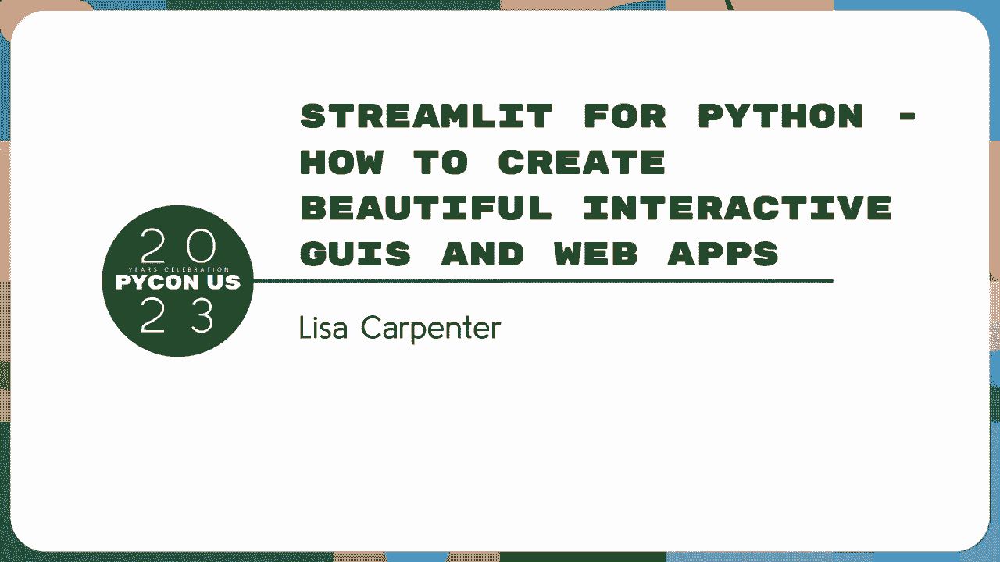

所以提醒一下，我在这里我的蟒蛇，迅速，所以我要搬进我的，然后我的游乐场文件夹，现在我在正确的文件夹里，我可以做，然后我的文件名，所以这将是，即，游乐场号，这不是因为它坐在书页上，一个，我在做什么。我们要做的是，嗯，让我提醒自己，只是游乐场。
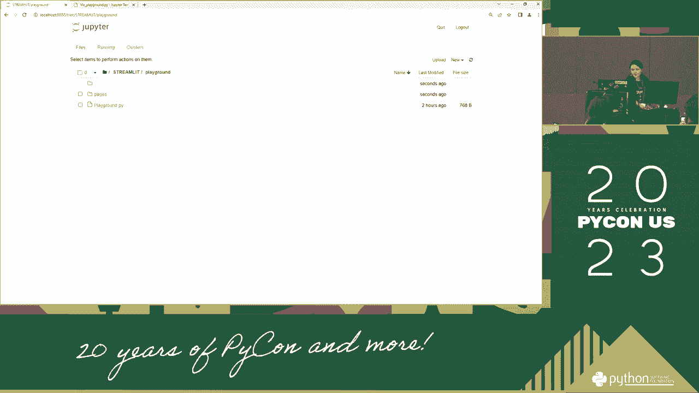

所以操场在高处，是呀，好了，我们要看看这个操场，正如你此刻所看到的，只是占位符，我们将看看如何实际填充它，所以在我们有那些公制标签之前，我们在超参数金枪鱼上看到，所以我们要看看我们如何才能真正继续下去。并制定这些指标，所以是的，让我们看一看。
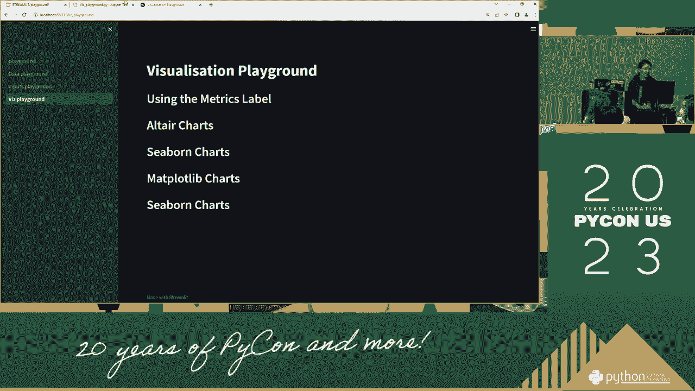

所以对于那些了解英国人刻板印象的人来说，他们说我们不能停止谈论天气，我们完全被它迷住了，我们知道盐湖城的天气很有趣，昨天有点吓人，每个人的手机都收到警报了吗，就像恶劣天气警报，小心呀，否，好啦。我做了嗯，所以我们将使用一些天气数据来使用我们的度量，所以我们有了使用度量标签的st标头，您可以看到我们已经为您弹出了一些代码，我准备好走了，我们可以节省一点点时间，所以我们得到了我们的城市名单。我要打电话给这些城市，所以这只是一个城市列表，因为我们将使用一个循环来做到这一点，请随意添加您自己喜欢的城市，我们从这里开始只有四个，但加你喜欢的任何东西，我们要做的一件事，把这些放在一起。所以我们要去伦敦，然后盐湖城，然后是巴黎，然后奥兰多祈祷这个作品，我们走着瞧好的，所以我们要做的第一件事是向你们介绍这些柱子，所以我会把光标放错地方，我要把它移到正确的地方，现在我要说的是城市科尔。

会是圣多柯林斯，然后是四个，对于如何处理这个问题，你实际上有几个选择，如果你是一个喜欢拆包的人，我们可以继续做一些事情，比如打电话给一个，叫2号，叫三冷，四，这将使这四个物体，每一个都是一列。然后你会继续把你的项目放在那一栏里，它们会很好地挨着展示，或者我更喜欢的选择是不打开包装，然后我们可以索引，所以我们有城市纵队，零，一个，两个，三个，这样我们就可以迭代，而不是手工做每一个。我们可以用迭代，所以我们有一份城市名单，然后我们制作了我们的列对象，所以我们要做的就是循环我的代码非常小，道歉，我把它弄大一点，这样好多了，不是吗，所以我们要做的是循环，找出每个城市的温度，去吧。冷静地填充它，所以要做到这一点，我们要为我和城市说，我们要列举几个城市，像这样，所以我们已经知道在我们的城市科尔，我们有零的指数期权，一个，两个，三个，所以通过列举列表，我们有很好的联系。

现在我们从枚举中得到了眼睛，这和我们城市的眼睛很相配，嘟嘟哒现在，我将带回我们之前看到的会话状态，因为我不想一直去这个API，我们不想被API禁止，我有点担心，我们可能都是从同一个IP地址打的。我们看看会发生什么，我觉得他们很冷静，嗯，所以我们可以再次使用我们的会话状态，我们可以说，如果城市不在，嘟嘟嘟st dot会话状态，所以说，本质上，我们将在会话状态下做什么，创建一个关键值配对。关键是我们的城市名称，它的值是温度，所以我们只打算这么做，如果还没有的话，如果我们已经得到了一个温度值，我们不会查那个的，我败诉了，好了，我们走吧，如果城市不在会话状态，现在我们可以做我们的事了。我要说城市网址，我们需要做一个小小的改变，我们可以看到盐湖城有一些美丽的空间，但这对我们调用的API无效，嗯，所以我们需要做的是快速地说替换，然后用下划线替换这些空格，就像这样，我想我们可以排队。

但没关系，现在我们只需要填充会话状态，所以这将是一个会议状态，就像这样，然后到我们的城市，你可以看到我们已经给了你请求，上面已经有东西了，所以我们只需要把它放下来，就像这样，它只是使用f字符串调用输出。如果我们快点抓住这个，网络浏览器，然后，如果你不确定你的城市是否会在那里，您可以在这里快速测试，我们可以看到我们得到的输出伦敦目前是12度，嗯，所以你可以随时去你的网络浏览器，用城市名称替换城市URL。如果你不确定它是否行得通，巴黎似乎是目前最温暖的地方，不错嘛，在城市中枚举，只需访问一个快速URL来获取输出和文本，现在我们要做的是继续，实际上输出这个，所以我们要退格，现在我们不想再做那种声明了。我们只想进入for循环，所以我们退出了if语句，所以这段代码发生了，不管如果的结果如何，现在我们要填充这些列，所以我们有城市下划线科尔斯，我们知道我们可以用索引号，我们用i表示索引号。

所以它只是城市下划线，打开索引的方括号，我们想索引到i，所以现在它将依次调用每个列并填充它，我们现在只执行要调用的方法，所以我们的情况是公制的，用公制，我们可以给它贴个标签，所以标签又是一个可爱的f弦。我们只是为了城市的温度，在城市里，你不是这样拼写温度的，然后我们只需要给它的值，值将是ST会话状态，这将是为了那个城市，像这样，然后只需要关闭最后一个支架，呃，是呀，说得好，太感谢你了，是呀，塞什。我们走吧，非常感谢你的接球，是啊，是啊，它应该是会话状态，非会议城市，所以我们有城市下划线科尔斯，我们用的是，因为我们要迭代来填充每一个，嗯，我们称之为点度量，让我们来看看这给了我们什么。
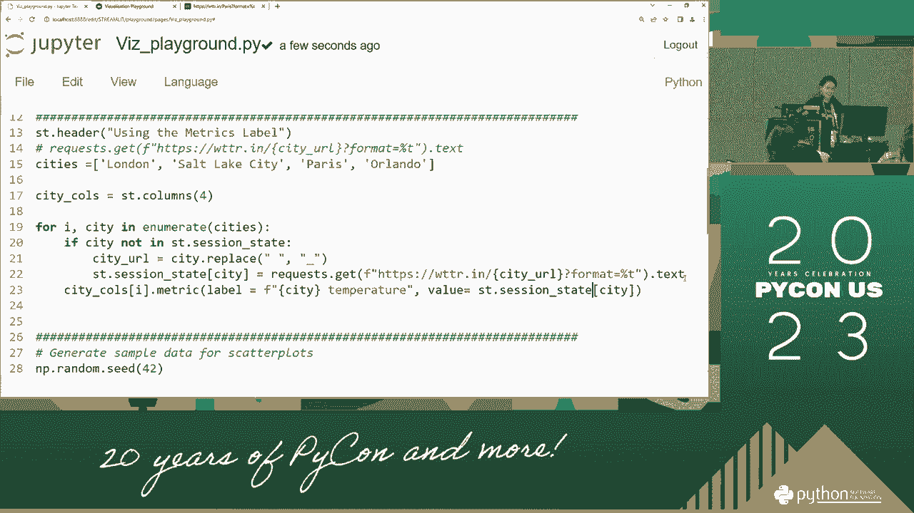

可能会有很多错误，让我看看，去掉侧杆。
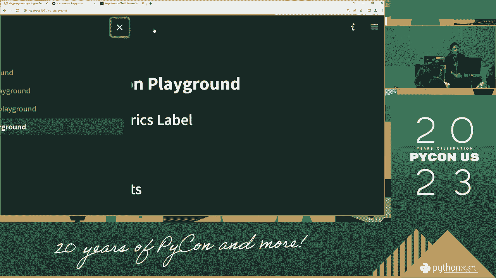

让我们做，我真的打了，保存，嗯，我总是发现这个需要一秒钟，它第一次运行，让我们看看它是否真的运行，或者只是弓箭而不告诉我们，嗯，我来分屏，所以你仍然可以看到代码，我真的以为会发生这种事。我不知道你是否能在这里看到错误信息，但这本质上是说，目前我们对该URL的请求太多了，我相信，超好玩的，是啊，是啊，说得好，我就像禁止我们这样吗，让我们一探究竟，那没道理，那里没有城市。我想去的地方似乎比这里更温暖，所以这似乎是一个很好的地方，试着刷新一下，好啦，酷，当然，我们去那里，我不知道那到底是怎么回事，但我们可以看到它继续前进，并以美丽的柱子填充，像这样，嗯。每次我们走动或做什么，它不会重新运行代码，因为我们已经把它放进，所以我不知道，奥兰多现在看起来很暖和，家里看起来比这里暖和一点，好的，我们在这里停一下，只是让你，呃，继续并复制此代码，如果你还没有。

是呀，它确实，是啊，是啊，否则，您可以使用点格式或任何格式选项，或者F弦，值不一定只取整数，它可以像整数后面跟着格式化，会很好的，所以有一件事要用这个快速演示，我要把它硬编码，因为我懒得处理删除格式。做数学，嗯，但是有一个选项叫做Delta，嗯，我要把它卖给他们所有人，我不知道五什么的，嗯，但你会得到这些很酷的，嗯三角洲选项，所以这里的区别是5，你也可以把负，您还可以添加格式。所以当你比较两种不同的东西时，很好地展示了Delta选项，只是看起来不错，我在流媒体上最喜欢做的事情之一，我喜欢所有的东西，你看得出来，好像什么都是我的最爱，嗯，但是这个，这个实际上是真正很酷的家。我们可以继续，也许只是躲在这些公制标签里，嗯，所以我们要做的就是在上面，我们叫柱子的地方，非常重要，我们在上面这样做，嗯，所以我们要做的就是，然后ST点扩展器，最后我们只需要一个结肠。

我们可以给它起个名字，我打算称之为天气度量，本质上是一个扩张器，有点像你可以点击隐藏和显示的东西，所以我们所做的一切，我们想在那个扩张器里，就像普通的蟒蛇一样，我们只需要把它缩进。所以它在width语句中，就像那样，我们可以看到我们现在有一个小面板，我们可以用，我们想看看天气吗，还是我们不，所以你可以看到添加像扩展器这样的东西是如此简单，它只是把宽度加上，把那里的一切都加上。标签也一样，嗯，所以你可以用完全相同的方法制作制表符，我们已经做了柱子和扩展器，还有最后一点要给你看，在我们开始收拾回家之前，我们有一些图表，我们已经为您预先填充了图表。仅仅因为Python中的可视化比我们希望的要复杂一些，嗯，但你可以在代码中看到，嗯，我们已经走在前面了，我们做了一些随机的数据，所以我们每次运行它都会有所不同，我们得到了第一个占位符，也就是改变图表。

而且真的，这一点只是为了向你展示，它真的是从可视化开始的，因为你不需要学新东西，我们唯一能做的就是，如果是为了改变，这是最新的图表，然后我们就给它情节，像这样，就是这样，然后我们得到一条错误消息。因为这里应该有一个下划线，耶，我们走吧，嗯，所以大家可以看到，这将创建图表，然后对不起，然后这表明它与我们可能做的非常相似，PLT点秀，这相当于那个，但通过告诉小溪，我们用的是什么图形类型。它保留了所有美丽的交互性，所以改变，例如，给你这些非常好的悬停和类似的东西，所以你可以创建你的可视化，但是，你通常会，它将继续下去，并能够做到这一点，嗯，所以对于改变图表，它只是改变航海图回家。然后海运，我不知道为什么C生重复了两次，那真的很奇怪，Seaborn和Matplotlib，嗯，因为他们都属于同一个家庭，其实只是，我们把它叫做无花果，所以我们只是在这里做无花果，其实是一样的。

这边这个，它也会对这个复制说同样的话，所以你只要想象一下你通常会想象的，然后找到与所使用的库相关的方法，所以Seaborn Matplotlib，这是馅饼情节的改变，它是改变的，所以它真的是那么简单。那么容易，你只需创建你的可视化，就像你通常会做的那样，然后你可以继续把它绘制到Web应用程序中，简易PC，可以看到我们喜欢互动会话的地方，我应该补充的是，Streamlet实际上也有自己内置的可视化。嗯，文档中有更多关于这一点的内容，所以你不需要使用图书馆，你可以用，我给你们一点时间来添加这几行代码，但它们是很基本的，呃，只需改变散点图和点图，所以我们的会议快结束了，它消失得太快了。所以作为一个外卖练习和给你的礼物。

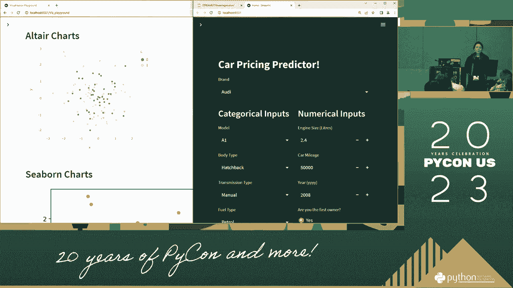

呃，我们收到一条随机的错误信息，酷，谢谢再见，你可以看到我们的汽车定价预测器，与超参数非常相似，但这一次是在模型创建后发生的，所以它的作用是获取一大堆用户输入，然后用它来预测一辆车的价值。所以在这个背景下，有一个线性回归模型，使用一些从一个受欢迎的英国二手车网站上刮取的数据，但是你可以看到你选择了所有的输入，它会告诉你它认为你的车值多少钱，英镑，英镑，在这个演示示例中。您将看到的另一件事是。
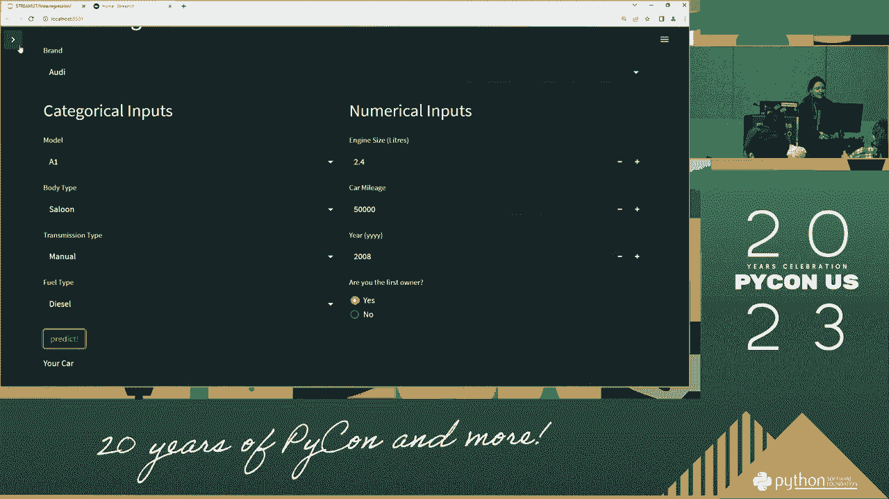

呃是EDA，呃，那不是艾德，我们走吧，酷，所以，这是一个例子，您可以开始使用我们以前见过的所有输入参数，用图表，所以本质上和我们以前做的是一样的，现在你只是改变你的数据帧，您正在更改正在输入的数据。你在改变这些参数，但本质上，只要你能从用户的输入中提取任何东西，您可以使用它对输出的内容进行动态更改，所以这些礼物是给你带走享受的，你对他们有什么问题吗？你让我知道吗，我把名片全给你，如果你想。我可以做你的私人流线型助手，我不知道，也许先谷歌一下，可能会更快一点，嗯但是是的，你有剧本吗，看看代码，探索模式，嗯，看看里面的一切，呃，我们只是有一些最后的收尾工作要快速完成。所以很抱歉我们没有得到太多的时间来讨论第二个例子，嗯，所以希望您能自信地创建和部署，单页和多页，记住多页面，你只需要创建一个文件夹，称为页面，你把你的书页贴在里面，你差不多玩完了，然后呢。

希望您能够自信地使用各种小部件，我想我们更注重投入，感觉我们在最后的输出中闪电战，但希望你对这些感到满意，希望你对流光感到兴奋，你的很多问题都是关于下一步，这真是太棒了，那么你下一步做什么，嗯。有一个非常活跃的Streamlet社区，他们有一些不可思议的开发人员传教士，他们真的很棒，很乐于助人，对于使用Streamlet的人来说，有一个不和谐服务器。他们实际上一直在举办一系列比赛和令人惊讶的事情，现在有一场比赛，我想这只是一个网络应用程序，也许用雪花，奖品是，我想去拉斯维加斯旅行什么的，别引用我的话，就是这样，这是一次旅行，去拉斯维加斯旅行。那很酷，嗯所以是的，一定要参与Streamlet社区，帮助论坛真的很有用，嗯也只是练习和创造，试着建造东西，我马上要向你们展示几个非常有用的工具，这真的能帮助你完成创作步骤，嗯另一个，如果你喜欢。

公开学习，所以当你创建一个教程，也许是个视频，或者只是和人们分享，你正在进行的旅程，你看到我今天犯了这么多错误，这么多错别字，这么多问题，但这都是关于在公共场合学习，通过向你展示这些错误。我们一起去旅行，你帮我调试了一些东西，所以在家里非常感谢你，但是是的，在公共场合学习是分享我们的知识和提高我们自己知识的一个很好的方式，并利用后续资源，所以我们将在，一些建议的后续资源。你们中的许多人继续阅读Streamlet文档，你会看到它的美丽，它有小溪嵌入整个，太全面了，如此互动，是个学习的好地方，酷所以其中一个，本质上，它的工作原理与你今天所做的非常相似，你可以在本地继续发展。但不是在本地部署，相反，我们将把它弹入GitHub，然后我们可以继续使用社区云来启动它，本质上，它制造了一个小虚拟机，你告诉它要求，它将安装您需要的所有库，然后它将继续进行。

并将其创建为一个公众可访问的，在线或私人资源，你也可以有私人的，但你可以把它们公之于众，并如此迅速和容易地分享，里面也有秘密之类的东西，所以如果你有API密钥或数据库密码，或者保护你不想分享的东西。它有一个叫做秘密的系统可以让你处理所有这些，所以社区云一定要看看，目前是免费使用的，我想它将永远免费使用，永远自由，耶，这是一个非常好的资源，所以一定要去看看。我还想提请您注意一家名为数据按钮的全新公司，我刚刚才接触到它们，我很确定他们会把我注销的，它将成为我的浏览器，是在，嗯，所以数据按钮是全新的，这一切都建立在小溪上，它本质上是一个云托管的位置。用于开发您的Streamlet应用程序，它基本上允许您运行代码，有点像在云端，所以对于那些有技术问题的人来说，这可能是一个很好的解决方案，它甚至有一种热重新装填，所以当你打字的时候。

它会继续在侧面呈现输出，它也有一些很酷的，呃工作，所以如果你有像网页刮擦API访问这样的东西，您可以出售它来自动在计划中运行脚本，它也有呃，您自己的库，如果您创建了库，你可以把它们嵌入，它也有数据存储。所以您可以继续存储您的数据帧或数据库，你想要什么都行，在他们的后端，然后通过应用程序访问它，所以它们是全新的，他们目前就像在私人测试版，但绝对值得一看，嗯，我有一个小应用程序，我做了一会儿，真的很傻。只要等它加载，通常不会花这么长时间，我有几天没用过了，基本上和我一起工作的一些学生，他们注定要写得很少，喜欢配置文件，他们在那里解释他们是谁，他们做什么，他们讨厌这样做。所以我们知道他们会使用聊天GPT，所以这是一个小迷你形式，他们在那里填写了一些关于他们的事情，然后他们点击生成，它就会进入聊天GPT并为他们生成它，它可能会产生幻觉，一直在编造东西。

所以它提供的资料毫无用处，但我花了几分钟才建立起来，使用你见过的所有文本输入，并能够在，数据按钮让它超级快，嗯所以是的，数据按钮全新，看看他们，你可能会喜欢它们，希望你现在知道如何前进。你对Streamlet的未来感到很兴奋，它的所有用途。
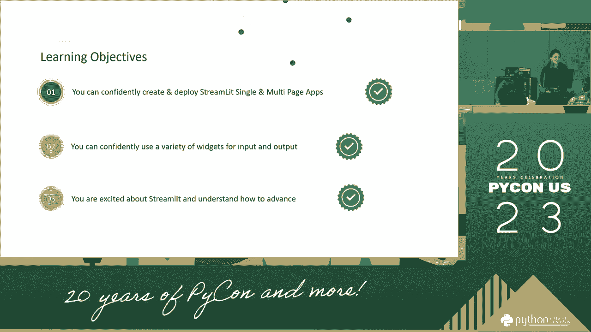

嗯，所以非常感谢你，有时间提问，如果有人有你想问的随机问题，非常感谢大家，你真是太棒了，这是我的荣幸，感谢收听，感谢您的耐心和关注，我喜欢，Pyon，我玩得很开心，非常感谢你们，这只是幻灯片。但我用变形，如果你指的是动画，是呀，你只要用变形，谢谢你，这是一个模板，我不能得到太多的信任，就像真的很好，就像看完整的浏览器，但是如果你，就像嵌入你的溪流，是啊，是啊，是啊，嗯。所以这是一个非常酷的事情，那个嗯，您可以使用CSS和您拥有的任何品牌，所以你从盒子里看到的是沼泽标准，但是您可以设置自定义主题，你可以带来你自己的图像，而且CSS是如此的可定制。您基本上可以在页面上更改任何您想要的内容，您只需创建一个css文件，然后将其导入为html，当他们成功的时候就会像超驰一样，所有的ID和一切都很漂亮，嗯，以一种方式设置。

用您自己的自定义主题来覆盖它真的很容易，所以是的，您可以自定义外观和感觉，嗯，为一家公司做一点模板总是值得的，嗯，就像是，你下一步做什么的基础，所以是的，好问题，就是这样。