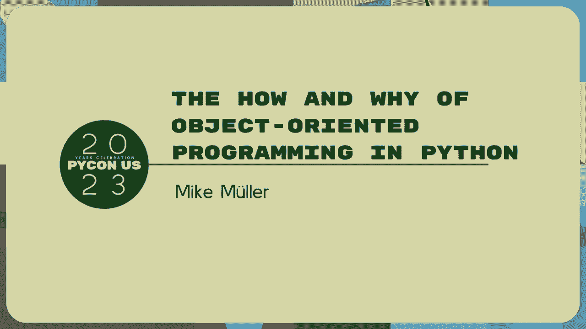
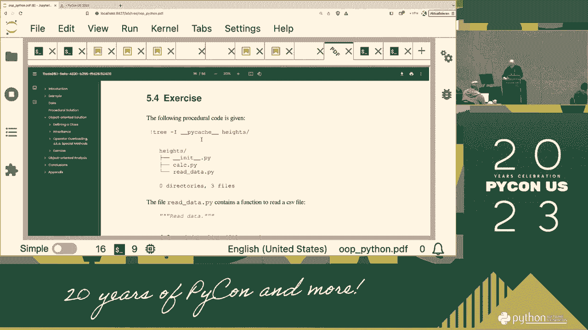
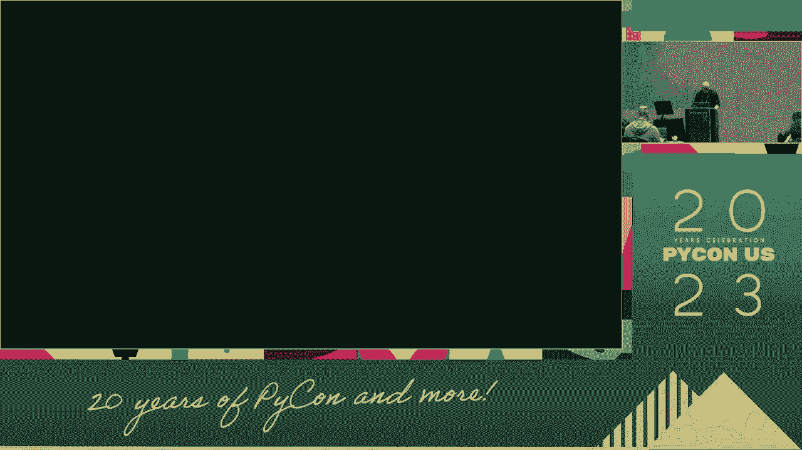
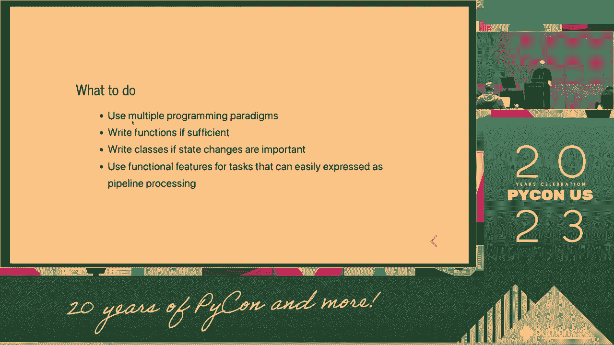

# PyCon US 2023 - P80：Tutorials - Mike Müller_ The How and Why of Object-oriented Programming in Pytho - VikingDen7 - BV1114y1o7c5

好的，现在是九点，我们开始吧。

早上好，大家欢迎来到我身边的Python 23，我叫迈克•穆勒，我将是你们今天早上的导师，所以我们要抬头看，看Python编程，我们怎么做，为什么先做，我想从我这边的一个简短的介绍开始。

你知道谁在这里说了三个小时，然后我要对你的蟒蛇有一点概述，技能和期望，所以我从1999年开始就是一个专门的Python用户，所以我总是可以声称，自从上一个lperiod，所以我从版本1。52开始。

我还记得四月份买了我的第一本书，一九九九年，我已经没有了，我把它借给别人却没有要回来，我不记得是给谁的，但这就像是一份历史文献，因为我开始，然后我几乎每天都在编程，碰巧的是，在2004年。

我第一次接受训练，因为我在大学里有一些讲座，已经有一些其他的东西了，所以我可以说，好啦，为什么不给蟒蛇训练，我给蟒蛇训练，所以事情发展了，二千零六年，我在蟒蛇学院创立，哪个是本地的。

从2010年开始我就全职做这个，目前我们在蟒蛇学院有相当多的其他教练，所以我们是一个训练蟒蛇的训练师团队，我们专门研究蟒蛇，我们做一些这样的教程，也是Python的介绍，高级Python。

很多科学和数据科学话题，阿斯卡炼金术测试，这是个大话题，普通科学与程序设计中的数据库程序，用Python等进行高性能编程，好啦，那是关于我的，我想对房间里的人有一个简短的概述。

我刚才问你用Python多久，这不是一个真正好的衡量标准，但总比没有强，所以请举手，如果您编写Python不到一年，这就像，一到三年的20%左右，因此，如果您或多或少地定期使用Python，是啊，是啊。

那是在三和五之间，也不止五个，那是我的少数，好啦，所以这种分配，更多长时间不使用Python的人，这是意料之中的，我们走吧，我有几张幻灯片，然后我解释了一点我们要怎么做，我说了一点目标。

所以我们的目标是学习编程的基础知识，所以我们来看看如何创建一个类，我们看传承的概念，它是面向对象编程中的一个重要概念，我们看运算符重载，或者特殊的方法，所以有点太窄了，我们拭目以待，但经常使用这个术语。

我们做这件事的方式，我们从一个过程代码开始，所以我会给你一个简短的程序代码，已经工作的简短过程代码，然后我们一步一步地转换成一个更抽象的IT解决方案，看看有没有好转，所以如果你是反过来做还是我们怎么做。

然后你看到它变得有多好，或者如果你更喜欢，如果感觉好些，效果更好，你觉得怎样就怎样，所以我们了解了它的优点和缺点，几年前，在圆周率上的谈话就像，不要写类，这和我在这里做的完全相反，所以免责声明。

我还用Python教授一整天的函数式编程，所以Python有一些功能特性，我喜欢它们，而且它们很有用，这在很大程度上取决于手头的任务，所以Python支持多种范式，一些功能性的，对象和特征的充分选择。

你可以用它们，你可以把它们组合起来，那么，你学了一些基本的物体或设计技术吗？如何设计方案，所以我们只有三个小时，包括一些练习，所以这不能像一个多星期的设计课程，很明显，但我给你一些基本的东西来理解。

那可能有用，所以我们从一个示例代码开始，我很快就会去看你的表演，那已经有效了，所以我们用几分钟的时间来研究这个示例代码，您可以理解，希望不会太难，我选择的不仅仅是地狱，是啊，是啊，那太简单了。

但不是很复杂的事情，在那里我们花了三个小时试图理解事物在做什么，那也不行，所以我们必须在两者之间有一些，在某种程度上，它仍然是一个玩具例子，但你会发现你可以很容易地让它变得更复杂，是啊，是啊。

所以如果在现实世界中事情变得更加复杂，然后我们把它转换成代码上的对象，当我们这样做的时候，我们应用这些原则，希望这有用，我们看到这是如何，这是如何工作的，关于这个编程范例的几句话，如果你去维基百科。

你会发现大约70种不同的范式，作为一种非常不同的等级制度和结构，和非常不同的名字，以下是您可能看到的主要名称，我们有这么大的团队吗，Tekla Rev编程中的命令式编程，大多数人或多或少地做命令式编程。

过程式编程确实编写了您的函数，调用过程中的函数，或者对节目有异议，但是您现在看到的是声明式编程，主，声明式编程的主要示例是函数式编程，其他的都很少见，动物编程只是开场白，我从来没用过，我得说我不知道。

其他的我也没什么想法，但他们也属于这一类，但它们比其他范例更罕见，所以有些人说做所有这些范式都是垃圾，我不这么认为，在一定程度上是有帮助的，如果你不把它当作一种宗教，说它必须是这种范式。

你总是可以把它结合起来，但有时你必须有一些术语来传达你想要的东西，所以蟒蛇一般都很务实，你想把事情做完，你怎么称呼它并不重要，但有时言语和，编程中的对象，你有不同的表达方式，我的背景也是数值模拟。

在这里做模特，所以建模，但它的建模建模是对现实世界的简化表示，他们一直在做模特，因为我们大多数的句子，如果你数一二三四，那是一种建模，你用一个数字来表示某物，但是外面没有号码，三个中的三个。

三张三把椅子，是呀，但这只是三个，有点像是，如果你想说它已经装瓶了，是啊，是啊，所以它被简化了简化了，重要的是我们有一个目标，很多人并不是一开始就这么做的，但是你说，好啦，你想实现的是一个模型。

然后他们必须尽可能简化模型，仍然实现目标，但不要让它变得更简单，所以你需要指定，你还需要指定你的假设，所以如果你说好，我们在地球上，我们可以假设，我们有地球的引力，这通常是一个很好的假设。

如果你把这个模型带到空间站，那就没用了，是啊，是啊，但很少有人去过空间站，对大多数人来说，在地球表面是好的，假设大多数时候重力是一个很好的假设，但你还是要写下你的假设，软件也是如此，但我的假设。

当你把它们写下来的时候，问题已经变得很清楚了，所以让我们来看这个例子，我有个例子，半年前这么开电动车，我从内燃机换成了电动汽车，这就是为什么我有这个例子，开电动车开电动车有点，这和假设已经有点不同了。

有点不一样，所以通常当你有一辆客人的车，你去加油站，你加满，然后你就走了，需要几分钟，你付钱，你有电动车就去，一件大事是充电，所以你需要给你的电动汽车充电才能从A到B，排泄通常需要时间。

取决于充电器的类型，你可以离开几分钟，大概二十分钟，如果你有一个快速充电器，你可以得到一个体面的充电，但如果你的充电器速度慢，也可能需要几个小时，所以如果你这么做了，只是你的家庭插座可能需要几天时间。

只是最弱的一个，所以那里有很大的范围，所以这就是，这就是我想介绍的例子，这些都是假设，所以我把它们写下来，我写了一些，过了一会儿，我看了看，我做了一些事情，我说，我有更多的假设，我加了越来越多。

这里可能还有更多你可以补充的，总是有假设，有这个假设表是件好事，因为这是你的世界，你的课程，我们以一种方式代表现实世界，或者软件中的另一个，然后你写下你的假设，所以那些车只是为了继续前进，没有其他站了。

他们只是停下来充电，他们以匀速行驶，所以在现实世界中，这显然是不现实的，但简单来说就是一个恒定的速度，你总是可以让以后加速和突破变得更加困难，像这样的东西，所以能量的使用并不取决于速度，更不现实。

当然啦，如果你开快点，你需要更多，如果你加速得更快，你需要更多，我们把这个拿出来，它只是一个恒定的速率，所以，然后每辆车总是以精确的80%的电池容量启动，所以当你在那里开始时，电池电量高达80%。

然后一旦你达到20%，你停车充电，你要价八十，所以通常你不想卸下电池来放电，你从这个知道这个，这种深度放电对笔记本电脑不好，但对汽车电池不好，因为它们有点相似，是啊，是啊，所以我不是电池专家。

但你宽泛地说，而且通常你也不希望它一直充电到100%，所以让我们去八十，那通常是胶结，还有，这通常是这个，充电较快的区域，在这个区域之外，通常会变慢，稍微慢一点，并不总是零好，所以这个假设。

然后充电速度取决于充电站，你有多少你可以离开这里，取决于你的车，你的汽车供应多少，我和旧车店的人谈过，假设我不能使用这个电台，我的车只能跑40千瓦，就是这样，是啊，是啊，一百五十全球化对我没有用，是啊。

我有我的车，我把150千瓦，大概有一百到十个，这是最大值，你出去，所以我想如果你连接到300千瓦，这改变不了什么，因为这是一个限制因素，所以没有额外的驾驶，通常当你去充电站的时候。

你可能不得不离开你的路线，走几公里或几英里，冲锋，我们不考虑这个，可能有很多，这里有更多的假设，所以这是个问题，原来是这样的，其实我跑步已经有结果了，但这给了你一个假设，这是一辆车的一种模式。

我们可以看到，一台电脑让他们更容易一点，这是其中之一，它发生在一辆大众汽车上，但它可能是任何特斯拉，任何一种电动汽车，你看，这是一个旅行时间，这辆车是旅行，这是一个距离，所以我们走了一千公里。

所以这里的一切都是公制的，所以我们走了一千公里，我们的旅行时间是几个小时，你可以看到距离是如何增加的，这是我以每小时80公里的恒定速度驾驶，大约五十英里，是啊，是啊，所以我以恒定的速度前进。

然后我就不充电了，虽然如此，距离不再改变，但是教授们和我闯红灯的时候，在这两条红线之间，我有充电器，充电的时候就是这样，你看，而且总是有收费，从20%到80%，我们都一样宽，这个比较薄。

因为在这里我不收取80%的费用，我只收我到达终点所需的钱，我的目的地，我还剩百分之二十，所以这个要倒着算，通常由汽车，当你驾驶它时，它总是在预测，或者告诉你何时到达目的地，你还剩这么多，有点变化，总是。

因为它不是恒定的，但他们在里面有一个预测，他们考虑到你的驾驶风格，你输了，我不知道你做过多少次这样的旅行，所以他们有某种预测，哪个更复杂，这一个，这只是一切都是线性的，这使得它很容易，好啦，这是一个。

好啦，这是一个例子，所以现在我切换到，木星笔记本，所以这是一种材料，你已经有了，我要用木星笔记本，你们中谁在利用木星实验室，木星笔记本，像这样的东西，所以如果你知道怎么用，你可以用它，如果没有。

你不必举这些例子，蟒蛇岩石旁的任何地方的岩石，你，你可以在终点站工作，没问题，你不必做什么特别的事，他们会工作的，但笔记本很好演示，所以这就是为什么我通常用笔记本工作，好啦，让我们看看这个例子。

首先我们有，也许这是我做的，大点，你能在房间后面读这个吗，它足够大，稍微大一点，好啦，是啊，是啊，这个屏幕和房间比较，不是最大的，所以我正在创造新的笔记本，笔记本已经进步了，我可以写文字。

我可以把数字放进去，我可以在这里加载我的代码，所以当你下载这些东西的时候，你会得到这个，这两个PDF，然后我们有目录，E车，它只是有所有这些不同的版本和我的程序的不同版本，不同的化身，你这里有数据。

这是数据，这些不是原始数据，我有一个很长的解释，数据从何而来，所以你可以通读，但这不是我们感兴趣的，所以我用了它们，并对它们进行了一点修改，把一些东西拿出来让它更容易使用，所以数据是这样的。

就像你看到的那样，这样不好，因为它是一个，哦耶，这是我的，所以我必须打开它，我说是CSV，但这不是一个好的开始，所以这是一个数据，实际上我可以从笔记本上加载数据，我做了一个新笔记本，我看到这些新笔记本。

所以你被鼓励，如果你能打字或工作，或者只是听，我们将能够做练习，我有一个练习，你自己做一些事情，我会在这里，你可以问我问题，但重要的是，你实际上或多或少地活跃，如果我总是在这里说话，做一个很长的陈述。

那没什么帮助，所以首先是数据，所以看看数据，所以如果我CD到这张CD到EOS目录没有，我已经到了，我已经准备好了，所以我，我从那里开始，因为我把数据笔记本放在那里，所以哪个不好，但这个，在那里。

把混合物放在那里不好，所以我把它剪下来混在一起，把它放进，我想把所有的笔记本，所以现在我可以说，我说CD汽车，汽车，然后你可以看看，减少百分比，你仍然可以看到，这些是数据，我变了一点，你看。

在顶部我们有一个短暂的追逐，邻接物，有一个单位，所以我不知道这是不是一个好的格式，但至少我们抄送单位，这是我们的桌子，如果我们有一个特斯拉品牌，不管是什么型号，作为一个或X，或者类似的东西。

然后基珀百公里，也就是用法，电池以千瓦时为单位，和收费率，汽车用品，然后我们有数据，这些是我们将要使用的数据，所以最后我们真的可以把这些三年前的真实数据，所以它不是最新的，但这并不重要。

所以你可以输入新的数据，我稍微修改了一下，如果你想做阑尾，我去的地方非常详细，怎么做，但是，让我们坚持下去，所以让我们来看看一个程序性的解决方案，我会从B到B，所以你已经知道了，问题没那么难，数学上。

希望，所以我写了一个解决方案，我们看到的这张照片我们看了几分钟，所以你明白问题所在了，您需要在一定程度上了解域，因为越来越难做到这一点，所以让我们看看程序性解决方案，为了这个，我可以做一个新的笔记本。

我说它让我改变它，程序性，第一件事，如果我再去，到e car子目录，我正在使用配置文件，我把选择权放在哪里，所以如果我可以在这里加载这个来执行它，配置点py。

所以我的配置是一个非常简单的Python字典，所以如果你想变得更花哨，您可以有不同的输入格式，但为了简单起见，我只是在这里用字典，我指定我的世界数据，我的模型参数，如果你想喜欢，使用供应品的费用。

每小时最高100千瓦时，就是这样，就是这样，我不想要这条新线，在那里做，跳了进去，然后是百分之二十和百分之八十的事情，是啊，是啊，我们聊了聊，然后80公里的速度，现在呢，它影响了时间。

速度不影响能量的使用，这是不现实的，就像我们说的，但这是我们的配置，因为我们一直在用它们，已经进口了，然后每个人都进口这个，我们得到相同的配置，所以我们可以比较我们的，建模团队好，所以这是一个数据。

然后让我们来看看第一个旅行时间，这是一个，什么都没有的旅行时间，这是一个程序性的解决办法，我有一堆功能，我需要一堆进口货，现在我们有了不同的东西，我们有开车和充电，所以开车实际上是当我走完距离的时候。

所以我开车去某个地方，这是我在函数中实现的第一件事，我确实收费，我们可以看看这个，然后我们也可以计算充电量，它总是不变的，然后我们有一个叫做旅行的东西，整件事就是一次旅行，包括开车和充电。

但这是我在这里使用的术语，我可能是不同的术语，但这就是我要用的，否则很重要，但通常当你和别人交谈时，有人说旅行或其他人在开车，什么是什么，是啊，是啊，所以开车实际上是移动的东西，时速80公里的汽车。

作为一个整体旅行，从A到B的整个旅行，所以这就是我在这里做的，所以我们从这里开始计算旅行时间，所以我有，所以如果这里没有给出，所以我让它可选，否则就给丛，我只是提取完全相同的东西为我的配置文件。

这是我们刚刚看到的数据，是啊，是啊，我们计算这些东西，所以现在我们把这个20%和80%乘以电池容量，得到这个电池的绝对数，是啊，是啊，所以有百分之二十八，这里和这里，我除以一百，因为我每一公里就有一个。

每一公里就有一个，所以更容易计算，所以最大充电量是80%减20%，我们没有旅行的距离，剩余距离为目标距离，一千公里，行车时间为零，目前的充电量是80%，那是我们的假设，然后这就影响了。

有效充电率是汽车充电率的最小值，以及这里提供的充电站的最大费率，所以如果充电器只提供两个2千字节，那你只能用两个22千瓦，通常是三个，典型尺寸的2或11千瓦，至少在欧洲，不在这里，但也许有类似的好处。

然后我开车，这是我开车的循环，有一点点，算法，所以我在这里开车，我驱动并调用函数驱动器并提供这个参数，或者功能驱动器不做其他事情，但是你看，这是我得到的目标距离，一开始还有一千公里。

是的然后可用的电池以每小时公里计算，所以如果我在最后，这个目标距离会越来越短，只要旅行，如果，如果我只有十公里的车程，3。我没有80%的折扣，因为它会更少，所以说，就是这样，当然还有开车时间。

距离除以速度，然后在行驶时间内返回距离，所以说，然后充电也很容易，你给出你想收多少钱的收费，收费率，然后充电时间就是计费的金额，一点点数学，所以这有点算法，如果你不明白所有的细节。

这个方法我们有一个有效的解决方案，我们有这些组件，是啊，是啊，所以我们有这个，你得小心一点，如果你和你周围的东西相比，否则你可能会陷入一个不等于零点的境地，九九九九，或者像这样的事情，你想避免这种事情。

像这样的东西，如果你到达目的地，那你就停下来，事情做完了，我完蛋了，否则我在这里计算费用金额，给它多少我需要驾驶剩余的距离，按小时计费，做我的计算，收费金额是这里的这个，好啦，A：

最低收费加上这笔钱我需要付多少钱？但我至少要保持20%，然后剩下的距离乘以公里，我需要多少，如果超过80%，有80%的机会，如果少了这个东西的费用，所以这就是为什么我把这个和这个的最小值。

这是你拍这张照片所需的一切，我把它变成了函数，然后我这次回来，然后我把我所有的成本，所以我读入了数据，其实呢，我们还没有看，在数据部分，我们这里其实也有，我忘了如何读取数据，很容易，为了完整起见。

清酒读取数据，是啊，是啊，所以我们忽略CSV，完全编辑了相邻的部分，完全不公正，阅读简历，我们不做什么特别的事，我们刚刚用编码读取了文件，Uf 8，我们从数据开始，用手劈开，是我们能做的最简单的事。

你可以用什么样的，如果你了解熊猫，现在容易多了，但只要用手做，穿过并劈开箭头，我做了一些转换，所以所有可以转换为整数的东西，将转换为整数，否则我试着漂浮，如果没有，我把它当作绳子，所以很容易。

对我们的目的来说足够好了，如果你需要一个更花哨的，阅读或使用任何形式的自由，所以这不是数据处理的问题，在这里读取数据只是一件事，这里有这个，数据是一个列表，你可以在这里看到，每个入口都在那里。

然后你就有了，所以这就是我们的解决方案，在最后，报告旅行时间，把旅行时间打印出来，我想先请跑得最快的人，这就是为什么我卖掉了我所有的车，我想用一个旅行时间，这里的旅行时间，我用犹太人区的物品。

它是一个函数，这是我从这里进口的，操作员模块，所以这个基本上是进入我的字典并提取键，这里的关键是，这是一个函数，并且这个函数可以通过键使用，谁知道这种对键函数的排序是如何工作的，只是几个人。

所以我需要解释，所以如果我有，我想我这里有一个例子，我可以用它，我不必重新发明一个新的，是啊，是啊，所以说，如果我有一个，如果我有字典，如果我有字典，有词条的词典，A，是两个四，我想。

我们必须让科林在这里，我想整理我的字典说，好啦，我想把B作为第一本书，因为这是最小的数字，然后我可以继续写我自己的函数，如果你想，就得到价值，我把字典放进去，是的，所以实际上我没有字典。

我这里有一份字典的清单，所以我得把我的我的东西弄得更复杂，否则就说不通了，所以我有一个字典列表，这个有这个，我复制了这一切，现在我想按这些东西中的一个排序，现在我用b的值，这里，我说这是25。

这是现在我想按B排序，现在我看到我得到了我的字典，我只是在这里返回我的字典值b，这是一个函数，现在我可以说排序我的字典我的列表，其实这叫这叫名单更好的名字，而且这个功能还可以。

我把我的这里作为一个关键功能，我的排序功能，求值函数，现在当我看到这个现在你看这是第一个，这是第二次到第三次，因为发生的事，所以说，如果你在这里添加打印，你看Python是怎么做的，我们有一个指纹。

然后你看到当我调用我的函数，我的函数Python在我列表的每个元素中，刚好是一本字典，到此帮助器函数获取值，我得到b的值，它将用于分类，所以我创建了我的搜索条件，我的搜索密钥。

如果你能想到这是一个创建黄色便签的函数，我写作的地方，但是你想用什么来排序呢，所以如果你说我们要按名字排序，每个人都写名字，便利贴放在这里，我看到了你，当我做完，我拿着便利贴，你的顺序是对的。

因为我实在记不住你们的名字，但如果我有便签或名牌，在这种情况下，这将是有用的，是啊，是啊，我知道字母表，我可以排序，所以这里你写一个帮助函数，这个项目让我们做到了这一点，这不是不重要。

因为我们想使用排序作为编程潜在优势的示例，您可以使对象更容易或可排序，对它们进行分类更容易，您不必在这里编写这个helper函数，所以这就是我在这里做的，然后我有一个主函数，读取数据，让采取。

驾驶或汽车驾驶所有汽车，穿过所有的车，汽车清单，然后计算出他们所有人的旅行时间，所以如果我把这个拿出来，因为现在这行不通了，所以如果我把这个拿出来，是啊，我加载我的，我加载我的文件。

现在我有了我的主要功能，其实说起来更简单，是呀，否则很难我的主要功能，现在我只是给它，我的，电子商务文件，然后打印出这辆车，所以特斯拉跑车，在这种情况下，需要13个小时才能跑完1000米，十三点七。

下一个，三点七，八个以此类推，所以这是我假设的最短的旅行时间之一，如果你有不同的假设，然后你可能会有不同的结果，你看这个电池容量很大，和其他的比起来大约是两百块，这个要小得多，但在这里。

这家伙100公里只需要10个，它需要二十个，哪个更现实，所以它总是你使用多少的组合，电池有多大，你能以多快的速度给这些东西充电，然后你就可以调查，是啊，是啊，所以这是一个程序性的程序，它起作用了。

我可以知道哪辆车先到，根据这些简化，对此有什么问题吗？所以如果你有问题，我应该重复一遍，因为录下来了，或者如果你如果你愿意，你可以走到麦克风前对着麦克风说话，那么我们有直接的任何问题，一切都很清楚。

到目前为止我们所做的，应该是，应该不会太难，所以会有很多问题，那就太难了，因为我们假设我们知道我们的解决方案和程序解决方案，我们做点什么，所以让我们去用物体做点什么，所以我们，顺便用物体做点什么。

所以我们有十点半，我们将有一个咖啡休息时间，二十分钟左右，像这样的东西，所以你可以在外面喝咖啡，它将是连续的，那么让我们来做第一个关于解决方案的对象，对于这个，我们现在采用现有的解决方案。

我们没有真正实现任何新的逻辑，你会看到我们用这个，我们不做任何新的数学或任何东西，最终结果是一样的，只是我们表达事物的方式不同，这很重要，那是我想给你看的，如果你不想。

您可以在很长一段时间内不使用Python编写类，只有少数情况下我需要写类，因此，如果您想创建自己的异常，您必须从异常继承，正确的班级，是啊，是啊，有些库可能会让您继承类并编写类，否则。

您可以大部分时间只使用编写函数，但是编写自己的类可能很有用，这就是为什么当他们看着这里，所以通常一个类，所以你可以去上课，所以如果你在他们去那里之前，你可以有一辆高级车，在我们的情况下。

我们将看到它将是电动汽车，我们有班级声明，然后我们定义一个函数，类中的函数通常称为方法，然后我们有了自我，我们有了价值，然后我可以说自我价值等于价值，所以这是一个非常典型的，如果您想编写类，请使用模式。

你经常在里面放这个，这里面是一种特殊的方法，我们将更深入地研究特殊方法，它们都有这些图案，强调，以下划线命名，通常被称为dunder方法，因为你说要下划线，但两个强调，你说邓德，它被称为下方法。

官方有特殊的方法，有人称它为神奇床垫，这实际上是不正确的，因为我知道魔法，做某事的特殊方法，这是你经常遇到的，大多数课程都会有，您可以在其中尽可能地写出类，但通常你想因为你想在这里初始化一些东西。

我可以说有一种方法，然后让我自己，然后i递增，我可以说返回自我价值加增量吗，所以它不是很有用，但它显示了你可以在这里做什么，然后我可以做一个例子我的车，并给它一个值，是啊，是啊。

所以这是你能对你的车做的第一件事，然后你可以说汽车点增量，你得到，因此您可以访问value属性，然后你可以说汽车点增量，用方法调用并给它一个增量，这种方式处理，你确实得到了这样的东西，这是基本的东西。

如果你现在看到，我们看看我的电动车，稍微复杂一点，但完全一样，完全一样的事情，我们加载文件，所以现在你会看到很多东西，我几乎把所有的数学，我们没有变化，但他们把事情重新安排，所以进口是一样的。

我有我的电动汽车，你可以看到通常每个会议，类名大写，这里有多个名词，这里，这个电动的，不是名词，是个形容词，但我们把它当作名词，我把它缩短为E，也就是说，每个人都知道电动汽车通常是什么，所以这就足够了。

还有E车，这就是为什么他们保留了使用许可证，我们有一辆电动车，我们总是把最重要的东西用于类中的函数，文档字符串编写一个好的狗字符串，所以我们有一个狗弦，现在你看，我可以得到这个配置选项。

如果你和我们的其他解决方案相比较，我们会经常看到的，我们在这里多次移动相同的数据，我们可以用这个，任何人都知道下划线是什么意思，这是内部使用，这是纯粹的惯例，用下划线表示，这只应该是内部使用的。

在本例中，从类内部内部使用，你可以访问它，但是你不应该，然后为自己的类编写一个测试，那么访问是完全可以的，然后你使用别人的库，你不应该这样做，因为这些事情可以在没有通知的情况下改变。

如果您有其他方法属性，他们不能就这样改变它，他们必须有一些程序，就像贬低，警告什么的，它必须是关于这一点的文档，这些东西也可以或多或少地无证，因为它们是内用的，你看，现在我只是把我的配置数据。

这些数字从这里存储在这里，课堂内部，这可能很有用，因为现在你可以重复使用它们了，所以说，如果你需要很多地方的数据，当你用一个好的功能风格来做的时候，你总是，如果一个功能永远不会改变外面的世界。

您只获取数据和获取数据，如果你这么做，你可以很重复，如果你需要同样的信息，三大功能，你必须把它作为参数tal或参数上交，当你在课堂上一次又一次地调用它时，你就有了一个类似全局范围的东西。

所以当您编写Python时，永远不要使用全局语句，所以如果你用皮林，它将警告您永远不要在这里使用全局语句，这是什么，可以说，这是一个全局语句，这就是所谓的玻璃变量，这将在全班范围内提供，你现在看到了。

我的init正在做很多事情，它设置了所有这些信息，所以有很多设置，我树立了我的品牌，我的模型公里数，所有这些事情，我可以预先计算出这是我的20%，我百分之八十，我们之前做的所有这些计算。

在其中一个函数中，是啊，是啊，这里没什么新鲜事，所以旅行时间还不存在，我可以稍后介绍一个旅行时间，但在这里，把旅行时间设定为零是一种很好的风格，所以旅行时间是作为一个名字在那里的，但没有价值。

但我没有旅行，您可以将其设置为零，有可能引导，也不可能，所以这是一个设计决策，所以它还没有旅行，或者你可以说如果它是零，也许它在充电，我不确定所以像这样的事，那就不再是零了。

所以这可能是我决定的同样的事情，但零也可能是一个选择，是啊，是啊，你看，我有我的驱动器负责功能，并在方法中移动，他们做的完全一样，我可以重复使用，我唯一拥有的，如果我们看自我，我们看到，这里发生了什么。

好呀，所以说，还有一些东西收费金额，同样的数学，没什么新鲜事，而且旅行也一样，但是有点短，所以如果你把这个旅行功能，这是一个旅行功能，你看旅行功能一开始需要做所有这些事情，这就是我们在上面的课上做的。

所以现在我们可以更好地划分这些东西，对于本例，并不总是这样，也许吧，但是对于这个例子，所以我做了所有这些静态的东西在这里，现在我的旅行功能，在数学上是完全一样的，变短并适合屏幕，经验法则。

一个函数应该在屏幕上过度适合，如果它不适合屏幕可能太长，这并不意味着你应该使用六种字体和42英寸的屏幕，我不是这个意思，但是只有一个正常大小的字体和字符串应该屏幕应该适合那里。

所以这和我们在这里做的数学是一样的，然后我们有这个，在那里我重用这个函数，这个这个我在功能上使用，我不为这些写课程，所以Python总是允许组合类和函数，你应该一直这样，这些东西可能比函数更好。

没变成上课，如果你愿意，你可以，你总是可以把所有的类，但也许这不是个好主意，在这种情况下，在这里吃，而不仅仅是旅行，所以说，如果你看一下这个，所以我把这个拿出来，否则一切都会被执行。

所以我现在正在执行这个，这里的一切，它现在在我的笔记本里，我可以调用所有这些函数，因为他们都被处决了，所以我的第一个，我可以读取数据，是呀，所以读取数据我可以放在文件里，然后我就可以读取数据了。

然后我就可以有数据了，然后我们就不用输入任何东西了，我们可以使用数据数据，是读取数据他这么做的，因为是的，这个，所以我有我的数据，然后我可以访问数据零，那么现在我如何处理一个类，类是新数据类型的蓝图。

所以如果你看看这辆车的类型，如果你看看这辆车的类型，您将看到这是一种类型类型，如果你看看int的类型，这也是一种类型，如果你看看列表的类型，这也是一种类型，所以在列表中有类，所以当我开始上初学者课时。

我说好，我可以使用一个函数将字符串转换为int，那是不正确的，这不是函数，这是一门课，我实例化，但这是一个可调用的，所以当你说功能性毒药的时候，你是说一个可调用的，这才是最重要的。

实例化类和调用函数看起来完全一样，实际上你并不在乎，你在那里用的是什么时间，你在乎结果，所以Python通常并不真正关心类型，它关心行为，这让很多事情变得容易多了，因为这并不重要，什么类型的叫LISS。

只要它是可调用的，所以只要我能在这里用这个普通的括号，它给了我一些回报，我很高兴，所以这就是为什么你经常不知道，如果使用类，很多初学者，当我输入一个，我使用类，因为这是字面上的。

在编程中生成此对象中的类的实例，所以打一个1，这是在一个节目中，如果你想，因为我们使一个类的实例很好，所以现在我们有了我们的车，现在我们可以，吃了我们的车，你看，我可以看着我的e车，我可以看着问号，在。

帮助如此，这是一回事，如果你是个正常人，键入帮助括号正在添加颜色，你去帮忙，而这种帮助显然是，此init文件的签名，所以说，当然十字架本身没有任何东西，但这是你要输入的参数，我要用论据来支持它。

所以如果我有我的特斯拉，这是我的特斯拉，这是数据零，我的特斯拉作为我的数据零，是啊，是啊，现在你看，我可以喂他们，我现在可以说我打了一个新的特斯拉电话是一个例子，我说这是我的车，我可以说，特斯拉品牌。

所以你可以做这样的事情，所以你可以把这个写下来，你可以用特斯拉打字，你得打一个小模型，等于特斯拉车型等，所以出于某种原因我用了相同的名字，所以这也意味着你可以让它有一个更快的方法来做到这一点，然后我说。

每小时等于，所以现在变得相当长，所以这是格式化它的一种方法，把每个论点放在一行上，做这件事有不同的风格，但这是一个有效的东西，现在我可以，我不需要重新打这个，我可以复制，所以我不能实例化我的车。

我在这里也做同样的事情，电池大小，电池大小等于这个，你看你这样，B是同名的，有一个更短的方法来做这件事，我马上就能给你看，但我会告诉你漫长乏味的方式，第一次充电率等于T充电率，是啊，是啊。

所以现在复制这个，现在我有了我的，怎么了？打印打错的打印件，所以我没有抄，现在我有了我的特斯拉，它看起来像这样，这是一个，这是一个标准的表示，这可以很好，所以我们要这么做，我们将使我们的类更好地表示。

但现在我可以访问我的特斯拉，我可以看看品牌，我应该说是特斯拉这样你就可以看到所有这些属性，有人知道它怎么能让这东西变短一点吗，你可以用两颗星，所以如果你想说，假设我做了同样的特斯拉，我说特斯拉2等于。

E和我可以，上面这个特斯拉你可以写，特斯拉，特斯拉，它在做同样的事情，所以这一行等价于这整件事，它实际上就是这么做的，这个打开字典并提供里面的所有内容，如果你和如果你有一个不同的字符串，他们不会工作。

所以名字，这些名字和这些名字必须完全相同，否则就不行了，但这让事情变得更容易，所以您可以实例化它，所以如果你能保证这一点，你想要他的名字，那你就不用，如果你再加上两个参数，没关系，只要名字一样。

你去查字典，会有用的，是啊，是啊，所以这是一个和他们所做的，现在呢，我们有我们的电动汽车，我们可以用它做点什么，让我们看看我们的特斯拉，所以我们的特斯拉现在有一堆属性，特斯拉和如果我说点标签在这里。

然后我确实得到了，建议，你会看到你会看到类型i作为一个实例，f是一个函数或方法，所以我们，从技术上讲，所有这些方法都是函数，没有区别，但通常你调用这些方法，在教室里，如果他们孤立无援，它们被称为函数。

但技术上没有区别，现在我可以访问所有这些，是呀，收费金额为，它是一个所以所有这些事情我计算在之间，我可以访问，我可以做到这一点，这是一个实例，自从我做了一辆特斯拉，很明显，我可以做尽可能多的例子。

我喜欢，但我也可以看看测试内部，如果你看了，用了另一个，就去吧，但这不是一个既定的方法，但是这个属性，如果你想，这是一本字典，这就是实例存储数据的方式，所以这本标准词典很有趣，当你编程的时候。

您可能不想手动修改它，嗯，因为可能会有一些奇怪的影响，经常是岩石，但有几件事，就像Python支持属性，它们只是看起来像属性，但是字典里没有，因为他们有不同的技术可以使用，所以你可能。

这可能不是你想要小心的，但是看着很有趣，您现在可以看到Python存储了所有这些信息，所有这些实例，本词典中的动词，好消息，如果你知道字典，你知道怎么做，你知道这是怎么回事吗，你可以访问所有这些，好啦。

但我也可以说特斯拉，如果我真的喜欢，我可以访问这些下划线，这个下划线，它们不存储在本词典中，但仍然在那里，所以通常当你说特斯拉圆点，然后Python在这个字典中查找这个字符串，如果它找到了。

它还给你价值，如果我说特斯拉打印，它把绳子还给我，特斯拉，如果我说下划线最大电荷，那它在这里就找不到了，它有什么作用，它走得更远，走到车里，在车里有一张车点下划线的罚单，还有一本字典，看起来有点不一样。

它没有说字典是映射代理，因为这是只读的，你不能直接写信给它，您可以直接修改实例的dict，这件事你得三思而后行，如果你真的想做，我不建议修改令人上瘾的词典，除非你有充分的理由这样做，如果你调试一些东西。

你想引入一些东西来获得更好的输出，所以这完全没问题，所以为了调试，你几乎什么都能做，如果你说，好啦，好啦，有些人帮助我们得到一些更好的信息，然后把它扔掉，否则你可能不想在这里做，你不能。

因为它是一个映射代理，否则就是字典，你看，所有这些东西都在字典里，所以你说，实例点Python首先在实例中查找，如果你能找到，它进一步到班级，这样做的好处是，我只需要在课堂上存储一次这些信息。

所以这个数字只被认为一次，在所有情况下，阅读时共享相同的号码，然后你访问相同的号码，你不必把同一个号码存储十万次，如果你有十万个电话，这很重要，说比特内存，但也不要重复你自己，如果信息应该完全相同。

那么最好把这些信息只放在一个地方，不是十万个地方，原来是这么回事，所以你有属性，而这个对象，实例，还有全班，当这些属性存储在这里时，您可以使用它们，好呀，所以现在让我们看看我们的车，做一些旅行。

所以我们可以去旅行，所以如果我有我们的特斯拉车在这里，当它们穿越时空，然后给我一个零分，这里没有显示，没有旅行时间，它没有定义，然而，可能是零，也许你可以把它改成零，我觉得完全没问题。

现在我可以说我开车，我到处旅行，我千里迢迢来到这里，然后呢，它在做，您在这里看不到任何输出，如果你看看现在的旅行时间，旅行时间增加到这十三点，八小时应该和另一个例子完全一样，希望，所以这是一个，是啊。

是啊，这不是，没有排序，这只是我，我还没把车分类，我只有一辆车，这就是为什么它不完全是，它和我们的特斯拉不一样，然后我们把它分类，结果完全一样，我们没有新的产出，但节目不同，一切都组织在一个类中。

而不仅仅是在函数中，但是我们重用了相当多的函数，并使它们成为我们类的方法，这是一个非常好的方法，你可以做这样的事情，所以如果你想，你也可以，到一个阴谋，所以我在这里策划了这个。

所以如果我有这个这个我可以说，从旅行时间来看这张图，我导入了一个不同的类，这是一张图表，打电话，现在我让我的图形调用懒惰，就一个，我用同样的东西，我的T，是呀，我有我的图形卡，我可以说旅行一千公里。

然后这个现在支持密谋，如果我说阴谋，如果我有一个麦可夹，所以如果你想用情节，其实你需要麦克里普斯，对不起，我没有指定这个，并介绍，在这里取消此输出，愤世嫉俗，这就是情节。

但是情节对于理解对象表示法并不重要，只是你看这是输出，你看这个特斯拉，例如，只停车三次充电，因为电池比那些人走路的电池大一点，花了五次什么的，所以这是你可以直接想象的东西。

现在你可以一步一步地探索这些对象，所以这是一辆不同的车，我们不需要也不需要看阴谋，绘图是如何工作的，您可以查看代码，我给你的，这是我的夹子，如果你不剪，我对它不感兴趣，因为它不会。

真的不关心我们的对象在上面，问题好，所以现在这是我们的节目，这里还有一个助手功能，显示dix和排序，我也可以做同样的分类，你看这个，我也可以根据旅行时间排序，我只是把，我也可以用我的get我的属性。

开始运作，它和一个函数完全相同，我写了，它只是为我生成函数，我可以把我的车分类，先拥有旅行时间最短的车，很相似，解前，但我们班上有，有问题吗？一切都很清楚，到目前为止，好处似乎不是很大。

我们可以把事情整理得更好一点，所以我们可以把课堂上的东西，类属性，我们可以让实例中的东西，因此，我们的旅行函数变得更短了，因为我们可以把东西搬到另一个地方，这是一个优势，至少对这个应用很好。

让我们进入下一个话题，那就是继承，所以我们可以在这里做新的笔记本，所以我们每个主题都有一个新的笔记本，我们停止了继承，继承是其中之一，然后呢，如果你想要技术，或者一种技术。

编程中的一种技术可以让你的生活更轻松，好啦，让我们举一个到目前为止的例子，我们说过，好啦，当我们到达20个充电开始，当我们完成继续驾驶，事情不是这样的，通常你必须，如果你去那里，你必须停止，出去。

你得带上你的电缆，把你的电缆放进去，那你就得把，我有一张塑料卡或一些应用程序，然后应用程序就不起作用了，他们穿着它们走来走去可能需要一段时间才能联系起来，这个时候不是不是在这里，这次不在这里。

我们想改变我们的问题，包括这段时间，所以我们想充分利用它，我们所拥有的，所以驾驶一切都应该一样，只有这一点点额外的时间来连接和断开宪章应该包括在内，举个例子，你有东西，你想稍微修改一下。

对于这种类型的问题，传承可以成为利器，遗传这个词来自生物学，所以我们将使用父母和孩子这个术语，因为他们用这个类比，父母和孩子，通常孩子和父母很相似，这种情况下，你可以有一个父母在这里。

生物学上可能没那么容易，但在这里你可以有一个父母，在Python中也允许有两个父母或三四个父母，这是很罕见的，但有可能，我不建议在Python中使用它，但你可以，所以你有这个类比。

你当然说孩子和父母很像，但不完全一样，有点不一样，这不是克隆人，这将是百分之百相同的，但是有点不一样，这个原理可以用于继承，所以让我们来看看我们的，我们认为，我得把文件放进去，这一定是，是啊，是啊。

我不是从头开始，所以我得检查自己怎么找到它的名字，有时候是的，连接时间，所以相当长，名字叫苏洛，我们需要车里的所有东西，因此我们在这里进口我们的电动汽车，这就是我们刚才写的，现在我们做遗产，我们写父母。

所以e车是家长，而这个连接时间的收费，E车，这是一个很长的名字，你看这个，所谓的骆驼案，这是骆驼箱，因为你总是写每个名词的第一个字母，你把它们大写，它看起来像骆驼的天性，他们只有两个。

但在这里你想看多少次就看多少次，然后，嗯，在这里，我介绍了充电连接时间，有很多方法可以做到这一点，我在这里又使用了一个类变量，课程将提供，他们说好，做整个事情大约需要六分钟，把它们放在一起连接断开。

挺合理的，因为你得找到你的应用程序，然后你有，你有不同的收费提供商，你有错误的应用程序等等，是啊，是啊，所以说，然后你有这个多余的，现在你看到了，我不执行任何东西，我确实从父母或孩子那里得到了一切。

免费从父服务器获取所有内容，放电匹配，我重新实施收费方法，现在这个班--一个孩子班--收费和家长班有点不同，而且差别很小，它仍然想做和父母一样的事情，这就是为什么你用超级，所以还有另一个类比。

有时父母会很好，孩子会很好，所以这是一个不同的术语，所以这意味着请把我的父母带给我，在这种情况下，这是非常明显的，只能是E车，可能会有更复杂的情况，如果这里有更深层次的继承层次结构，我们只有亲子关系。

但我可以成为父母和祖父母，曾祖父母等等，甚至可能有Python支持，多重继承，可能有两个班，这不是常见的，但可能的，然后你就会有你母亲那边的祖先，从父亲的角度来看，然后可能会很复杂。

有时候奇怪的事情会发生，你没有预料到，和超级，它在做正确的事情，在这种情况下，它只是带来了电动汽车，我从电动汽车上调用充电电池，所以如果你回到这个解决方案，这就是我们所说的电荷，不多。

所以我可以很容易地复制这些行，这只是一句台词，本质上，这只是一句台词，这只是一句台词，如果你复制这一行而不改变它，然后你可能会想我必须这么做吗，这可能是一个更容易的方法，因为如果你在这里发现问题。

你在这里解决这个问题，那你就得去这个，他打电话也修好了，是啊，是啊，然后你把它固定在三个地方，忘了第四个地方吧，那不会长久的，不要再重复了，试着在一个地方做，只要有可能，是啊，是啊，问题，问题是参数层。

这是什么意思，参数层，是啊，是啊，所以我们看的这个是所谓的方法分辨率，2。我们来看一看，就知道是怎么回事了，他们会告诉你这是怎么工作的，通常，您从父级继承，如果要跳过父级，因为祖父母，变得有点困难。

因为你得知道祖父母是谁，但通常情况下，如果你经常父母用祖父母的汤，这是很常见的事情，你有多个超级，假设总是这么高，不一定要这样，但这是很常见的，您也可以重写该方法，不要使用汤，或者如果你不需要任何功能。

如果你做一些完全不同的事情，那也可以，所以让我们来看看超级是怎么来的，这是如何工作的，我在这种情况下做了一个，我拿着这个，我把这个拿出来，我们也可以从命令行运行这个，所以我做了一辆新车，所以为了这个。

我需要复制一些代码，因为我做了一个新笔记本，所以我必须，我要抄，像这样的东西，是啊，是啊，我当然需要把我的数据放进去，所以我读了我的数据，数据没有定义，所以我有我的数据，现在我让我的呃。

我的充电环连接车，我给这个伟大的名字，C在这里，然后我说好，做这辆车，我现在又可以吃了，起动器数据为零，我的特斯拉，所以我有这个专栏，而现在，嗯，这将是一个例子，但最重要的是，如果你看看。

你的目的是什么？所以如果你不知道，只是看看帮助，所以说，当然如果你用这个，说救命，所以在笔记本里，我用问号，但蟒蛇的健康状况也是一样的，所以如果你看它，返回类型方法解析顺序，所以方法解析顺序。

然后你说实例点什么，然后它在实例中查看，伦敦去上课，如果在课堂上找不到，它去排队的下一个，下一个是方法解析顺序中的，你可以看到这里，我们的充电或接驳时间从E车继承，从对象继承，一切总是从对象继承。

那是我的判决，我不知道我说了多少次，在Python中一切都是对象，因为我每次训练都重复很多次，这就是你看到的证据，对象总是万物的最重要的，一切都从对象继承，所以如果你说是实例对象，它总是有效的。

那里没问题，所以我们总是在这里有一个对象实例，管理员什么也不做，但是使用这个，沿着这个方法解析顺序，直到找到方法，所以如果家长没有问题，如果父母没有做或收费，它将归祖父母所有，因为它在父级中查找。

而父级不提供，它去下一个，最后，他们会向对象要求一些东西，这也是为什么这个由这个，这个输出，这个叫做表示，看起来像这样，此表示来自对象，我们稍后再看，我们如何使我们自己的代表。

所以Object带来了相当多的标准东西，如果你不执行，我们买标准的，所以你看，这是一堂很短的课，这和电动汽车完全一样，但做得有点不同，这让它很好，因为现在你可以一步一步向我解释，因为我可以专注于。

我不必复制整个代码或更改所有这些功能，是啊，是啊，如果你用电荷函数来做这个，您需要编写一个新函数，可以调用文件，你也可以做同样的事，但这里有一个标准尺寸的价格，那是遗产，当每个人都期待这样的事情发生时。

编写函数时，你得说清楚，这个函数称为另一个函数，以此类推，所以继承是Python中存在的一个概念，在令人反感的编程中，当然在Python中也有很长一段时间，你可以用它做一些事情，关于这件事。

有什么问题吗？一切都清楚了，好呀，所以让我们继续，让我们来谈谈操作员重载，所以我做了一个新笔记本，我把这叫做，如果我有两个列表，有两个简单的列表，现在我可以在这个方向上说列表一加列表二，通常。

加号是数学中的数字，但是在Python中，您可以对列表使用加号，可以对字符串使用加号，当你使用加号时，它是如何工作的，其实在后台，Python正在使用add函数，这里，这个这个加这个特殊的方法。

这个笨蛋，这个广告下，我再加上这个，把左二放进去，我得到了同样的效果，其实呢，如果你有号码，同样的事情也会发生，所以你说一个数字加5，我确实明白这个，我可以说数字加，加五，我可以得到15。

就像在这里加一样，所以每当你使用Plus Python时，都会在你的，如果它没有，它转到父类，如果它存在并搜索它，如果你不在那里，默认情况下，对象没有广告，所以这就是为什么这个会失败，此对象不支持广告。

所以如果你想了解更多，你可以去找Python帮助，所以这个帮助打开了规范，完全相同的Python文档，如果我输入广告，我以前也这么做过，很明显，然后跳转到对象添加，然后你会看到还有很多很多你看到的。

这是一个模拟模拟数值类型的部分，它提供了几乎所有的数值运算和乘法，所以这里解释了这些迹象，不在那里，但你可以读一读，所以你能用数字做的一切，你有一则广告，还有更多，还有更多，如果左边的搭档没有。

它去了正确的伙伴，第二个伙伴为这个伙伴寻找，然后我加了一个，加等于，是啊，是啊，加等于，减等于，以此类推，数字前面的一堆负号可能会改变一些东西，你可以把复数中的一些东西变成浮点数。

这对汽车来说没有太多意义，但你可以用数字来做，是啊，是啊，这将是非常有用的，您可以实现自己的四舍五入，它不连接到像加减这样的运算符，但对于一个内置的功能，所以运算符重载有点太窄了。

因为它把这个特殊的方法传递给了更多，因为这里也一样，这些在浮动中是复杂的，不是操作员，但是你输入复数和浮动，当你输入这个函数或他的名字时，然后Python正在寻找这个对象的标准方法。

并将其应用于相同的方法，追求长度，所以有很多这样的，所以如果你想，你可以透过，还有更多这样的，一旦这个包含将是，所以当你在列表中说x的时候，那么如果您的对象有包含，它使用包含，你会看到，如果它不包含s。

还有一些其他的回退也在为同样的目的使用，是啊，是啊，相反，您应该返回迭代器，所以你必须了解一下这是如何工作的，你可以覆盖很多这些东西，获取项集项，在这里你可以看到很多不同的语法，这将是，设置项。

获取项目，这个XP的东西，如果你通读，如果您想实现其中的一些，您还可以使实例可调用，例如，所以我们了解到类是可调用的，函数是可调用的，您还可以通过实现远程调用来使您自己的实例也可调用，最有趣的其实是。

往上走一点，有，吊杆，你可以让你的，你可以说我的理由是真的还是假的，你能实现这样的东西是什么意思，但有趣的是，这些是比较的，是呀，小于等于，平等，不平等，大于大于，平等，然后你就可以让你的事业。

这就是我们现在要做的，所以这就是我们现在要做的，我可能需要关闭一些，那些类型，否则我再也看不见了，哪个是哪个关闭继承选项卡，所以说，我有一个例子，我们这样做，所以我们改进了这个比较。

所以我们不再需要通过，一点点，所以我加载这个，可比汽车，所以我们可以比较一下，我再次使用继承的概念，你不必把它们结合在一起，但这让它更容易，因为我想专注于它，所以你看，我继承了这辆车，已经。

我们刚才做的，然后我重写这个LT函数，这足以使它们具有可比性，文档说，您可能还希望实现相同的，但只要把它们分类就足够了，在这里，我们提供了与我们在一个特殊的键函数中使用的相同的信息，所以我们把旅行时间。

所以这辆车，这个比较短，出行时间第一，上面是这么写的，现在我把这个比较从一个helper函数移到，我必须从外部应用到对象中，对象处于活动状态，在某种程度上，它可以做一些事情，物体总是什么都不做。

但你可以想象一个物体在做什么，这种能量是有意义的，现在我的分类更容易了，你看这个排序，现在呢，它不需要这个关键参数，我可以直接对它进行排序，并有相同的输出。

所以如果我喜欢我可以在这里运行它告诉我这不在那里，因为我换了目录，然后你看到现在这和以前的输出完全一样，但我不必在这里指定特殊的键函数，在概念上把同样的东西移动到物体本身，所以物体知道该怎么做。

我也不必从外面告诉该怎么处理这个物体，如果一切顺利，这将是一个优势，对象知道该做什么，你只要做点什么，它的行为是相应的，你不用从外面看，有一个函数怎么做，现在如果你把它比作，你可以覆盖许多。

更多的特殊方法，如果有意义的话，如果有意义的话，你可以覆盖它们，你可以改进你的车，好呀，这就是我们现在要做的，因为如果你看看这辆车，所以如果你有我们的特斯拉，如果我输入特斯拉，你得到这个输出。

这是一个表示，所以Python有两个内置的函数，代表权，这看起来是这样的，还有STR，对于许多对象，它给你相同的输出，不是全部，所以这是完全一样的，如果我说代表，字符串的表示，字符串的表示。

然后是这样的，如果你说弦中的弦，然后看起来有点不一样，所以这里有一点不同，事情看起来怎么样，因为绳子只是一根绳子，这只是一个字符串，表示一个字符串，所以双弦，这就是为什么这里有双引号和单引号。

问题是如果你把这个通过，这只是相同的源代码，如果我用元音来表示，它获取一段字符串，并将其计算为python代码，那你应该拿回一根绳子，这就是整个事情，就是这样，如果可能的话，并不总是可能的。

但如果有可能，那么代表应该这样，如果你用这辆车这么做，在这里行不通，它只是向你展示，这是一个类的标准表示形式，它给出了类名，名存实亡，这是我的笔记本，这是一个ID，所以这是一个六边形，的十进制形成数。

当您使用ID时，所以如果我，如果我说特斯拉的ID，特斯拉的ID，我把它转换成一种形式，那它应该，行不通，所以它应该给我同样的答案，所以如果你看看这个数字，是同一个号码，这实际上就是ID中的唯一。

这就是id的全部目的，然后你可以区分你的实例类的想法可以重用，就像你有一个汽车牌照，如果车不存在了，然后其他人以后就可以得到同样的车牌，这里也差不多，可能发生，不是很常见，但这个完全有可能，你可以。

所以让我们的车有代表性，然后我把我的代表装车，然后呢，不加载，所以通常它应该给我，把它复制进去，有时候它不喜欢我，这个表示函数，现在我可以给它一个仪式上的原始表现，这取决于我。

我所做的是看到我必须返回这里的字符串，这就是我要做的，你如何想出一个字符串取决于你，但他们应该看起来很好，这就是我在这里做的，我只是用一个f弦，你得多花点心思，可重复使用，所以我只能说，好啦。

我取这个名字，代表汽车返回，所以说，让我们运行这个，所以我可以，现在呢，如果我运行整个事情，我收到一条错误消息，因为我有错误的目录，所以如果我运行你现在看到的整个事情，看起来不太好。

因为我需要把一个CRE，因为我在命令行上运行，我看起来不错，我们就用指纹，是啊，是啊，只需选择打印，不要用漂亮的印花，我有看起来更好的变化，所以现在你看我有一辆可以代表的车，这辆车看起来是这样的。

所以这看起来正好是一个，如果你输入这个，你会受到汽车的影响，所以现在这是一个更多的参与到那里，你看，我用f字符串生成一个字符串，然后我在这里做一点，我把这一切都列出来，因为我有这么多属性。

列出了我喜欢的属性，我在这里用一些格式化来格式化它们，另一个，我不是手写的，我只是格式化并说，好啦，去这里换条新线，四个空格的缩进，所以加一个4空格，把这些东西连接到这里，我走了。

在这个属性中作为use，将属性self属性名自动获取到实例中，在这里检索属性名，是啊，是啊，在这里获取所有这些名称的属性，我可以自动把它们放进去，当这个给我的价值，当然啦，如果我把这个打印出来，你看。

这是，这是我提供的名字，但是这个值是一个实例，我需要得到的信息，这个get属性自动完成，这个get属性和self dot属性做同样的事情，然后我在这里使用对象和生产者的表示，所以这显然涉及更多。

然后我还需要，有人知道我为什么在这里做这么长的事情吗，这是什么意思，名称类别，所以这代表了成本，如果你这个，这就产生了，这代表了汽车，所以我可以复制一个代表，汽车，为什么不知道。

在这里将汽车复制并表示为字符串是个好主意，有什么想法吗，不，这个，在这种情况下，就这一个，直接把它复制成一个字符串，当您以后更改类的名称时，或者你做遗产，所以如果你从这个类继承，你没有指定一个代表。

然后蟒蛇说，好啦，我没有律师，我从我父母那里拿的，提高质量分辨率顺序，然后它从父级中取出这个，然后突然间我的班级换了一个名字，说是这辆车的代表，事实并非如此，它在撒谎，这可能会发生，是啊，是啊，这可能。

这可能并不明显，如果你不测试这个，你没看到，如果使用继承，您应该考虑制作代码继承证明，而这并不那么容易，你得想得更远一点，会发生什么，所以如果我写了一个类，把我的模块给了别人，其他人可以继承我的班。

我无法阻止它，我不知道我不想被继承，然后他们可以做各种各样的事情，然后你应该实际上你需要一个或多或少的因素，有人从你那里继承的这个用例，会发生什么，如果这是一个子类，我自己的费用之一，还是不一样。

我喜欢它起作用，所以这是一个，这可能是个问题，所以这个表象的事情更多的是涉及到，我想让你看看，你能做到的，然后你在这里得到一个很好的代表，如果你在，在笔记本里你可以得到更多，所以如果我现在说，嗯。

我这里有我的数据吗，所以如果我说我代表当时的车，我代表这辆车，一切都是一个可代表的呼叫，啊，我的数据，启动数据零，这是我的第一辆车，我在读，所以我有我的车，如果我在这里这样做。

你会看到现在看起来不一样了，这是五颜六色的，这是五颜六色的，我制作它是因为它只是一根绳子，但如果你在笔记本里，你可以加一个数字，没那么特别的方法，但是笔记本的特殊方法，开头有一个下划线。

这个表示html，您可以生成html，可能会有用，所以如果你在笔记本上工作，你用熊猫，然后你总是得到这个漂亮的html表，在这里你可以自己做，这个是一个，我自己不做这项工作，我只是用颜料。

它是一个Pythor模块，所以如果你想运行这个，然后你需要颜料，但对于对象和状态来说，这并不是必不可少的，然后我只是这只是，这个是素色，所以这是如果你去帮助页面的第一页，这个素色的东西，如何格式化。

把一切都弄好，彩色语法高亮显示，所以没什么特别的，我不必写任何新的一行，现在我可以有语法高亮显示，如果你想，您可以手工制作自己的html并生成html，CSS，你喜欢什么都可以，这发生在笔记本上。

如果在命令行中执行此操作，你看到这篇课文没有任何东西，如果你在里面做，所以如果我说打印r，现在这个打印r将使用一种表示，这是一回事，但是你不做语法高亮显示，这种情况下没有颜色可以用，使对象可表示。

因为此表示是在调试时使用的，当您看到错误消息时，您可以看到表示，如果你看到，这是该曲线的一个实例，也许这不是最好的信息，如果我说这是一辆有这些信息的车，也许它更有用，因为是的，是啊，是啊，好啦。

此值为零，这可能是问题所在，这就是你能做的，你可以做一个，可以让你的，汽车雷布尔，对这些特殊方法有什么问题吗，Python提供了其中的许多，如果你去求助，好像是一百五十，你永远不需要所有的。

他们中的许多人都很特别，非常非常深，其中一些很常见，像这样，为，加，比较运算符，代表权，是啊，是啊，第二个叫做STR，你也可以实现，如果单反没有实施，会回到代表，所以如果我因为我没有狗屎，捆绑，St。

它将返回到表示，并使用表示中的这些信息，现在我们使我们的对象更容易表达，我们把一些必须从外部提供的功能，比如对象内部到对象的排序，可以做更多的事情并将其移动到对象内部，如果您创建对象，这可能是一个优势。

好啦，我们知道我说什么，只是看脸而已，我不知道如果你不明白我们有休息，休息的时候可以问我，如果有什么，现在是10点31分，所以说，二十分钟吧，这是这是，好啦，所以二十分钟，所以我们在这里继续，十点半。

十点五十，十点半，现在一万五，然后我们继续我们的旅行进入陆地上的物体，好啦，我们还有一分钟，我没有时间了，但再过一分钟，所以请回来，如果你在外面，如果你能听到我，我们想继续，所以我们有很多事情要做。

这就是为什么我们不想浪费时间，所以现在是50，所以首先我想在休息时间回答几个问题，有几个人走近我，例如，关于笔记本，所以所有这些笔记本都是开发出来的，我会和你分享，因为他们有问题，答案在那里。

所以我会拿走一切，我有笔记本，我也有一个解决方案推荐PDF，我把所有的东西都放进zip文件里，然后再上传一次，所以你可以下载相同的zip文件，这包括所有这些东西，所以没有新的链接。

给我一个小时左右做这件事，如果我忘了，给我发封电子邮件就行了，如果你忘了这么做，然后我派你去，然后我做，刚刚上传了，是啊，是啊，还有一些关于这些笔记本的问题，人们可能不熟悉笔记本。

所以去年我给了一个完整的教程，关于笔记本，你能做的比我教你的多得多，所以这些有点，这是术语原型，它对尝试事物的原型有好处，一旦他们变得更严重，把它搬到火堆里，所以因为它们也有缺点。

如果你不介意实现这些类，我所有的课程都在文件上，我只是进口的，我只是在这里给你看，但当你做了更严重的事情，利用你的能力，工作室代码馅饼魅力，你所有的这些好工具，你总是可以把它结合起来。

有一些有限的重新加载选项，所以当你更改源代码时，导入功能将自动，有一些警告，它并不总是起作用，但在大多数情况下，它是有效的，你可以结合起来，笔记本是一个很好的工具，但一如既往。

你必须为正确的目的使用正确的工具，人们抱怨这不起作用，这是因为您以错误的方式使用用户，那就没用了，所以你必须意识到，缺点或假设，正如我们所说的，然后事情就清楚了，关于继承的其他几件事。

有一个关于她的继承和构成的问题，所以有不同的方法，所以我不在这里讨论构图，我可以，但时间有限，所以继承通常是一种关系，所以车就是车，所以如果我有一辆车，我可以继承我的车，因为它还是一辆车，作文更有关系。

就像汽车有轮子，轮子不应该从汽车继承，轮子属于汽车，所以这是一个，东西在那里，也在Python中，你实际上可以做一种不同的方法，这叫包装，但我叫包装，所以不做继承，您有一个使用自动子句实例作为代理的类。

你总是委派布鲁克来这个班，因为当你继承遗产的时候，你总是从父母那里得到一切，你没有选择，你要么得到一切，要么一无所有，你不能，只是，我只想要这个方法，这个方法如果你不想，你必须重写这个方法。

您实现该方法，当您引发但未实现错误时，这就是我所说的黑名单，所以如果你做遗产，你得到了一切，如果你不想，你不得不说，我不喜欢这样，我不喜欢这样，我不喜欢这样，一定要包容吗，像这样可能很难。

因为你可能不知道，但你得到了一切，如果你知道，我知道你的出路，出于某种原因，你得到了所有这些方法，因为你从那里的祖先那里得到了一切，所以如果你做GUI编程，所以这也是一个很好的例子。

如果您编写图形用户界面，所有的现代学校都有课，上百个类，每个类都有上百种方法，因为它们有很深的继承层次，很多人都有很多方法，从很多小部件中，在这种情况下，大多数时候它是这样设计的，但这有点难。

如果你的班级有三五十种方法，你如何使用它，所以这可能有点势不可挡，它这么大，这是包装，您可以进行白名单，您可以显式地声明，我想要这个，这个，这个和其他一切都行不通，所以白名单可以更容易。

这是一种不同的方法，但是您可以在Python继承中做更多的事情，继承的一个主要例子是异常，所以如果你去找蟒蛇帮忙，当你输入时，所以这也保持了这个开放，并使另一个帮助，因为我想展示这个，还有一个问题。

所以如果你去Python引用，当你说像零除法例外，或者是某种例外，您将转到异常页面，因此，如果您转到异常页最底部的异常页，因此，关于Python Strated库中异常的帮助页面，或者Python帮助。

然后您有一个异常层次结构，这是继承的主要例子，因为所有的例外都是一样的，您不希望此异常执行此操作，他们也应该做同样的事情，唯一不同的是课程，为什么提出例外，课程以班级名称的名称显示，骆驼箱，是啊，是啊。

这是一个很好的例子，因为所有的例外都是一样的，他们会产生追踪信息，所有的事情只是他们被抚养的原因，或者他们为什么是哈是不同的，传承很有意义，然后你可以写下你的问题，你有漂亮的盒子和箭头。

它们聚集在一个漂亮的头发等级中，这表明继承可以是一个很好的解决方案，如果所有的框和错误都像这样，当他们没有正式确定等级制度时，那么继承可能不是最好的解决方案，所有这些技术都可能对你不利。

如果你用错误的方式应用它们，因为他们会做很多你不想做的事，你工作，你可能会有一个术语，你对着框架走，框架为您提供了非常好的工具来解决某种类型的问题，但如果你有别的问题，它与框架有足够的不同。

你可以根据框架工作，同样的事情这个编程，所以如果你的程序不适合，那也许不用继承，这可能不太清楚，开始，随着时间的推移，当你打破它时，我能，也许不是最好的事情，好吧关于这个，这个这个比这个少。

对模块的恐惧，在Python中有一个名为Total Order的类修饰符，所以我们不在这里讨论群集器，但这是你放在那里的东西，它发生了，你只需要知道这里和这里，您只实现等于和小于。

这个总排序修饰符实现了这些比较函数中的其他四个六个，你不必用一些规则来执行它们，是啊，是啊，小于相反，比那更伟大，这很容易，是啊，是啊，所以就在这附近，然后你就不必这么做了，你会让这四种方法都摇摆起来。

如果您想使用您的对象，那些操作员如此输入，这些运算符作为运算符，那就成功了，所以有不少人在这里和那里帮助我们，我在PDF中提到了其中的一些，但我可能提到过，让我们再继续一件关于。

所以我调用第二个构造函数，即使它不是构造函数，所以嗯，Python有一种叫做类方法的东西，有人知道类方法是什么吗，所以如果你有A类，然后你有一个正常的方法，然后你有一个正常的方法。

你有自我作为第一个论点，自我是什么意思，自我是什么意思，注意自我，是啊，是啊，self是实例的占位符，因为这些是第一个参数中的函数，例如，我可以解释，我不知道，或者只是说返回四二所以。

然后我有一个类方法，我有一个类方法，为了有一个类方法，我需要一个装潢师，所以我需要用一个类方法来装饰这个，所以装修工在做一些，此方法更改方法，您可以为自己实现装饰器，但这又需要三个小时来解释所有的事情。

所以说，如果你不这样做，这就是为什么我有这个，所以让我们假设我们有一个init，像这样的东西，是啊，是啊，所以现在我经常从一个，从一个，然后这里我得到了CS中的CSO，只是这些名字，在CS中只是惯例。

它们不是固定的，它们确实变成了蓝色语法，因为它们有一个非常特殊的含义，但他们不是你可以用任何工作，但这是一个非常强烈的惯例，使用self和seal作为阶级，回到过去，有些人用k或类似的东西拼写玻璃。

但这已经不常见了，所以现在我有这个这个，我只想说我还了一个新的，我通过使用class并提供，实例A当我说一个点值时，所以这使得我们班的一个班，这是类方法的一个非常常见的典型应用。

所以一个普通的方法把这个实例作为高度，所以如果我把我的类作为一个实例，然后我可以说我必须提供一个值，杰作是的，我输入了错误的值，所以我可以在这里修好它，回溯历史，所以A是这样的，现在我可以说一个方法。

一个方法返回，如果我说资本主义，一种方法，然后它告诉我，哦不，你漏掉了什么，只有一个你忘记了自我，你忘记了自我，自我必须是一种特殊的论点，它必须是类的实例，如果我把实例，现在呢，这和这个做的完全一样。

因为A方法是一个函数，只是一个正常的功能，没什么特别的，只是一个碰巧在类中的函数，第一个论点是南方，这里这个方法是一个绑定方法，所以它是绑定的，它注定了什么，它绑定到实例，所以你不能。

因为a在a点方法的前面，然后就被消耗掉了，小写的a已经被消耗掉了，那你就别再提出这个论点了，事情就是这样，方法绑定复杂，情结，使用描述符等等，但我们没有，我们不必关心它实际上是如何工作的。

我们只知道它起作用了，是啊，是啊，所以如果你想说一堂课，首先是属于一起的函数的集合，不知何故，我有一个更有条理的方法把它们放在护目镜里，这是一种方法，如果你想，是啊，是啊，它们有一个全局命名空间。

在这个全局命名空间中，是移交self，所以当你写函数时，你不想要的全局变量，你一直在用，当您编写类时，所以如果你有一些信息需要保留，以某种方式作为全局函数调用，那么可能是一个很好的方法，实际上。

我建议您使用类而不是全局，现在，您永远不应该使用的全局关键字，全局键盘，如果你不这么做，那么你可能需要，如果你想做同样的事，您需要使用类，所以这是第二个构造函数，现在我们有这个例子，然后这个是一个。

灵活类的名称，我们很灵活，但也很灵活，我有这个或者，所以我有一个类方法，你现在看到这个x遵循与类相同的模式，首先是上课，现在我实例化类，这就是这个案子，当然这辆非常灵活的车，我可以，我可以创造，这是。

如果有人从这个类继承了这个，这个上交的班级将是当前的班级，不是这个班，但是继承的孩子，所以现在，只需创建这个类的一个实例，把它交上来，我现在说，好啦，品牌就是例子，以点打印模型为实例等，我没必要写出来。

我可以把它做成复制品，从一些很常见的东西，有没有人用熊猫，熊猫，您可以从字典中创建数据框架，从各种各样的东西，他们很相似，所以这是一个典型的名字，然后你有一个类方法，这将是明确的，所以我都是手工指定的。

但如果你太懒，你可以在自省上再深入一点，我使用内省模块，与其把这个写出来，我在上面用内省检查，是的，检查给了我初始化的签名，然后我就可以把参数拿出来，我去掉了自我，我也会做同样的事。

这个花了我一段时间才到那里，是啊，是啊，所以你不是在半分钟内就写好了，它需要一点点，但这是完全一样的，但是如果现在类在init或更多参数中获得了另外三个属性。

它们会自动出现在那里这个和这个在这种情况下是等价的，这是自动的，所有这些都只是在课堂上检查，所有这些都是我父类中的参数，当然，然后我只是在把自己拿出来后做按摩，因为我不想给自己，然后我可以做同样的事情。

现在我可以选择从现有的类创建一个类，所以这将是第二个构造函数，如果你想要的话，你会经常看到这个，通常从，这是一个例子，在那里我可以使用类方法，可能会有用，不不，因为，当您编写一个实例时，我不把自己。

你看，这是一个这里，当我做一个例子，当我做一个瞬间，在我的第一个例子中，我手工做的，这个，是啊，是啊，所以我不说自己，如果我把自拍作为第一个参数，我可以破例，因为我在init上调用它。

客栈已经有了自己的，init不是构造函数，Denuis构造函数，有一个对偶u，我从来不记得实施了一个新的，他们很少需要一个新的，新的是一个真正的讲师构造函数，它返回一些东西，自我永远不应该回报任何东西。

因为只要初始化它，通常它被称为构造函数，从技术上讲是不正确的，因为新构造函数正在创建实例，新的制造实例，init过滤了这些初始值，九十九点，百分之九的时间，你只想填满这些初始值，新的用于，唯一的问题是。

如果你有单件图案，有没有人知道，那么新的是好事，但这是唯一的应用程序，我知道你需要一个新的，可能还有其他的，哪个，我不知道，然后自我是签名的一部分，但当我在这里使用它时，我有例外。

说它不需要自己的一部分，这就是为什么我要把自我剥离出来，所以这是你不知道的，我有个例外，这本身就是如此允许和感动它，否则，是啊，是啊，你通常不会去想它，但在Python中很容易。

因为你总是得到一个例外来解释哪里出了问题，另一个问题，在允许继承的时候显示东西，它不需要，视情况而定，如果你有一个，然后它就会用这个，如果不在那就不特别了，在这种情况下，继承的工作原理是一样的。

它提高了方法分辨率，虽然如果我的课没有，它转到父类并从那里获取，取决于你想要我们所有的样品，我们没有越过入口，因为我们没有做任何不同的事，但他也可以用汤或小费，他们通常都是这么做的，你得到了一些东西。

你做点什么，此外，然后你通常用超级，打电话给里面的家长，然后做你想做的任何额外的事情，所以你只能做额外的，你不能少做，因为函数是一回事，你不能从函数中取出东西。

但是您可以在init之前或之后执行一些操作，如果你想喜欢，您可以检查值并说，好啦，进来的值应该在极限，那个可以，如果你不喜欢，擦除异常，然后它只是把值交给它，而不做功，例如，所以在里面是完全一样的。

如果它是继承方面的普通方法或init，完全相同的行为，让我们做一个简短的练习，我希望它能起作用，所以说，我还没有真正排练过这个练习，因为我不知道怎么排练，其实呢，我什么都没排练，然而。

这里有一个相当新的教程，但到目前为止，我们有点在我的预期中，时间计划，让我们做一个练习，所以如果你去PDF，有练习的描述，所以如果你打开内容表，然后你可以去，这里有一个解决方案练习的对象，我们有一个。

所以我们这样做，这叫身高，所以我们有这个，在这里，我们有它，我希望我有，否则我需要上传，我们稍后再做练习，我们有这个吗，但它应该在里面，所以高度，的，斯诺登为什么在那里，应该在里面，这样高度就在那里。

不是吗，人在那里，是呀，所以我们有一个人，我们有这个，高度文件，他们有一个读取数据和一个杯子，我这里没有，所以我需要快速上传这个，虽然这很有效。

给我点时间，所以如果我们想做运动，现在呢，你已经可以通读了，所以b根据情况，我需要尽快上传这个，然后我给你这个东西我需要一分钟，所以我们有一个现有的解决方案，我们想修改这个，现在什么都没有了。

什么都不管用，当我，当我在这里，我们想修改它们，我有一个非常简单的，他们有一个CSV文件，我们读到了，我想，如果我们用，这个，嗯，在解决方案上的对象，所以我们刚刚读了一个CSV文件，我给你的。

但由于某种原因，代码并没有在拍摄时结束，因为我引用了它，而我的自动不知何故没有做到这一点，但我可以，好啦，我找到了，所以我们有，这是现有的解决方案，我们想，修改并将其转化为解决方案上的对象。

这是一个小一点的例子，但很相似，也许你应该试着去做，努力去做，为了那个，我需要集中精力上传数据，总是出问题，但现在我们有了，好啦，所以我上传了，如果你需要一秒钟，它会上传。

他们需要再次下载这个zip文件，而我，我甚至没有意识到，所以当你做这样的事情时，总是会出错，由于某种原因，这并没有出现，所以如果，我知道我没有提议，决议和螺丝钉完全不同，一切，我在这里看到的，好了。

现在，如果你是一个。

如果你重新下载，如果您重新下载此文件，那么你应该有目录，数据和有一个高度在那里，所以这是这是应用程序，所以如果你已经下载了，你应该找到这个高度，这里我们有一个非常简单的数据，读取CSV文件。

没什么特别的，我们有一个计算，这个计算做非常简单的计算，所以计算出平均值，计算最矮的人和最高的人，从这个数据来看，很简单很简单，这是一个非常简单的应用程序，所以这里有一个模块，你可以使用，是啊，是啊。

然后这个呢，所以一切都包括在PDF中，但我没有给你消息来源，它是从PDF复制的，现在不行了，你应该把这个重新写成，这是给定的，我会快速浏览并向您展示源代码，这是一个CSV文件，我们打分。

这是一个身高只有厘米的人，对了，这里，所以没有米和脚，只有一个数字更容易，然后你读进去，然后你可以用这个，你可以展示这里的人，然后你有这个伟大的功能，Python中已经存在的平均值，是一个统计数据。

意思是你可以计算出平均值，你得证明这个人是最高的人，以此类推，所以这是一个给定的任务，不同的源代码，然后现在的任务是重写这个，然后按照下面的步骤，创建类人员，所以我已经给你一个人了。

所以让一个阶级的人在身高上有一个人的名字，所以不是函数，制作一些实例，所以这一切都只是几行，只是一个人很短，为所有数据创建此实例，编写一个计算平均值的函数，人的高度，并创建一个儿童阶层的人。

我们做了一件相似的事，然后创建实例，然后找出哪个部分最小，所以数学是，一切都在函数中，把所有东西都搬到教室里，看看能不能用，我还没在真人身上试过，你能多快做到这一点，有人对这个函数的内容有疑问吗。

那是PDF的说明，那是PDF格式的，如果你去锻炼，然后你发现它是如此PDF，这是这里的一部分，五四在页面页面上，三十一在这里，所以这是一个3-1的文档，换算成三个，八个在这里，如果你到这里去反对。

或者在那个解决方案中练习，然后你会发现这些说明，这里是对这些文件的解释，我不知道他们为什么不在那里，因为我是耶，因为另一个，其他练习，好啦，我可以很快地告诉你如何，用这个这么大，我得把它弄小一点。

所以看看有什么有用的东西，所以让我们去做一个新的笔记本练习，现在如果你有这个目录高度，那么如果我说a，那么树只在UNIX上工作，如果你的窗户坏了，所以树高，然后你看这个，这是我的大包裹，我确实有数据。

我可以说，从高度点读取数据，导入读取数据，然后呢，然后我可以说我的数据，读取数据列表，好啦，这是一个不同的名字，然后我可以说我的数据等于读取数据，是读取数据列表，当数据有一个检查时，我说数据。

数据叫做人，然后我有我的数据，看起来像这样，是啊，是啊，所以显示现在是漂亮的打印机，虽然你有名字和，所以如果你不喜欢漂亮的印花，顺便说一句，Python有很多魔法，你可以关掉漂亮的印花。

然后它看起来是这样的，所以这是其中一个魔法，以不同的方式展示，然后你可以说从，计算，然后你可以说计算，点，第二次参赛，然后你得到平均值，是啊，是啊，所以这将是我数据中的第二个条目，你的意思是。

就正在做的事情而言，不是很难，然后呢，你也可以有最矮的人和最高的人，最矮的人，你必须把名字和价值，哪些是数据，零数据，一个你可以在上面开枪的，这将是，数据零点和一个应该查看的数据，可能是捷径，也是。

是啊，是啊，所以如果你不想把这个写出来，然后我们就可以用我们的，开始，这将是最矮的人，这将是，这就是它在做什么，现在输出应该是一样的，没有新的逻辑，您可以重用逻辑，但是你用一个类重新组合它们，当然。

最明显的阶级是一个人，因为我们聊天，我们和人一起工作，所以请试着实施，我来过一遍如果你有问题，我可以试着帮你，所以有相当多的人，虽然，然后是的，是啊，是啊，这颗星相当于，我们不需要那个。

但我们可以长话短说，马马虎虎，与其在这里写这个，在这种情况下，星星和这个一模一样，恒星打开序列，因为数据是一个列表，一个元组有两个条目，第一个是名字是第二个，我可以这样写，如果我用这个。

所以我们会有数据零数据，一数据二θ，四个中的三个，这也是一样的，它需要所有经常迭代的东西，就像如果你说打印，如果我有一个名单，然后当我说打印列表，它只是打印列表，如果你想让单个参数说打印。

第二份参赛名单，第三次参赛以此类推，入场等，但我可以说打印，然后我只是说，事实上，你甚至不需要名单，你可以说打印星级10，现在我把从0到9的所有数字分别输入打印，一如既往地工作。

这个需要把这个可迭代的对象拆开，喂你会得到的所有东西，当你遍历它的时候，作为函数的单个参数，因为这场小火被判了很长的刑期，这可能很有用，如果你的懒惰程序员是好程序员，如果你能减少你的工作。

你还知道他们在做什么，那就做吧，如果你最终得到了专业代码，那你做得有点过头了，缩短代码，所以我会回心转意，我关掉麦克风，所以我不打扰你，几分钟后你会看到进展如何，好的好的，让我们继续，这就是解决办法。

我给你看我的解决方案，这是一个PDF格式，是一个解决方案，所以你会得到这个PDF，我将把它作为zip文件添加，所以第一件事就是写班上的人，那应该很简单，班上的人，如果你必须有你在里面。

你在身高上有个名字，通常你会说自己的名字等于身高，等高，那将是第一件事，这里没有那么多不同的选择，我想应该是这样的，创建实例，你看，有一个，有一个解决方案与列表理解，您还可以编写循环，如果你不喜欢理解。

是宇宙，而是一个循环，这是最短的一个，所以你创造了一个有名字和身高的人，你的名字和身高，通过啜饮，姓名和身高，这就是你读名字和身高的方式，如果你有数据，你刚才说数据存储，但在这里明确地，第一列被命名为。

另一个是身高，所以我们有一些人，功能变成免疫，所以这仍然是一个均值外的函数，在一个班里是没有意义的，您需要多个实例，那你说刻薄，你说好，现在您可以为人和人访问人的高度，但该人是该人的名单，是啊，是啊。

所以您总是可以将函数与类组合在一起，这并不意味着你必须总是，所有东西都有B类，如果它的功能很简单，使用一个简单的函数，如果你需要更多，那么你可以应用它，你得到了你的意思，得到同样的结果。

然后让它有可比性，那么这个呢，你需要的比它少，并没有真正实现等式，甚至比这里更少，问题是，这是一个标准，你想用身高的人是你想比较的，你也可以通过名字来比较人，然后你就用这个名字，这将使比较变得紧张。

是呀，但在这里我们用高度，然后当你这样做的时候，你，在这里做可比的人，然后你可以有这个，您可以使用内置的min函数，它的工作原理和，和min用同样的原理和一个关键函数，看起来一模一样，如果你有课。

你有一个min，你可以把它建在里面，用户不需要知道任何事情，只是，你知道的，他们用min，你扔在你的物体上，它给了你所有的物体，对象列表或对象集合，然后给它同样的东西，是啊，是啊，在最大值上。

非常非常容易的解决方案，然后表示，这是一个更多的参与，如果你解决了这个问题，你得有包装纸，在这里，由您来创建一个漂亮的字符串，而这个要多做一点工作，是啊，是啊，你看这个感叹号。

R表示使用这些对象的表示形式，有它前进，它为字符串添加了额外的引号，你不必用这个来填充，所以你说，好啦，给我这些属性的表示，这些是已经内置的对象，Python，填好，这里我再次使用类名。

所以我得到了班名，是啊，是啊，然后当你看到这个，然后现在一个人是这样的，如果你把你的清单打印在笔记本上，像这样的东西出来，是啊，是啊，第二构造器，也许我们还没这么做，原来你有个同学，你只要上一堂课。

然后你做一个新的类，你看到一个人的名字，人的高度，把那些东西装进init，这可能是一个小练习，但它给你一些感觉，你在现实世界中能做什么，事情变得更复杂，线条更多，但本质应该是一样的，本质应该是一样的。

有问题吗？如果有什么，不管用，任何意外，通常当我做训练的时候，我们在木星中心一起做这件事，然后我们可以改变交换解决方案，通常我们也有更多的时间锻炼，但你在这里好好呆着，这就结束了第一部分。

当我们有了这个程序性的解决方案，一步一步地进入更多和解决方案，现在我们想去一个不同的地方，我得把这个弄大一点，下一个是你在分析仪上做的，所以与其，现有的解决方案，你从问题开始，从头开始。

有很多不同的方法可以做到这一点，你必须分析你的问题并想出解决办法，所以从零开始，这里我有一个，一种方法可能有不同的方法，这是一种方法，所以实际上你不会马上开始编程，你先把事情写下来。

所以定义问题总是一件好事，你不应该做得太多，你不应该在几个月内指定，但是写下来一点，还不算太糟，所以就在你下面，句子的问题，在某种程度上，其他了解域的人可以理解，所以别人可以在六周内做你自己，六个月后。

然后我们完全忘记了这意味着什么，你派我们来陈述你的假设，然后我们分析课文，我们的分析仪就像四年级的语法，三年级，我们只是遍历并找到名词和组，或者形容词只是下划线把它们去掉，然后我们从这些中强化潜在的类。

潜在类，然后我们尝试实现一些原型过程，然后重构我们的代码，所以可以有很多细节，但通常情况下，如果一个简单的解决方案有效，然后用一个简单的解决方案，所以现在我有了我的故事，这就是我们刚才谈论的全部事情。

一直以来电动汽车的事情，是啊，是啊，电动汽车以恒定的速度行驶不同的距离，它在千瓦时方面有一定的优势，汽车开始行驶这个80%的充电电池，电池等等，这些是一篇课文，这些都是同样的假设。

所以它们来自同一个文件，包括这个地方的相同文件，所以这些是我们研究的假设，写下一段叙述，有用的句子，并以，如果你给别人，别人会明白他们的意思，这很有道理，因为它让你觉得，当你必须制定它的时候，让你思考。

这就是我所做的，所以说，我有这些假设，到目前为止我们的假设是，然后我们做分析，你看，我只是通过，现在我收集我所有的名词，然后我有动词，绳子在这里是两个，你可以看到绳子是，所以说，在这种情况下。

我这里有一辆汽车或电动汽车，这辆车行驶，有一个开始，还有一项指控，这是我从课文中摘录的，还有很多其他的名词，距离，速度，电池，电池尺寸，旅行等，这里有很多名词，不是所有的名词都应该变成类，通常。

不是全部，只有你感兴趣的，因为我们的建模有一个目标，只有这些位于我们目标中心的最重要的名词才会成为类，其他的会保持正常的属性，只是数字，字符串或列表，或者像这样的电池充电，是啊，是啊，你达到电池充电。

你有一个明星充电站，所以如果你根本没有看过充电站，你可能有不同的目标，你想建充电站，你看你有最好的发行版，充电站最大限度减少出行时间和充电时间，不管怎么样，然后你就可以。

然后你可能想在这里有一个充电站作为一辆车，充电站不重要，2。我们只是照单全收，我们不知道他们是充电站，我们只是开车，是啊，是啊，收费率，出行时间等，所以很多这样的词来到这里。

他们中的大多数人不会成为班级，通常，但这可能会有帮助，所以这在技术上并不是很难，写一篇可读的好文章，通过识别，所以如果你想，你可以为名词写脚本，你要用手做什么，把它们整理一下，可能会有更复杂的技术。

简单是好的，只要它有效，是呀，所以这就是，当然啦，这些名词是用来上课的，球体是方法的候选者，名词是某种东西，规则可能有例外，在英语中，你经常可以用同一个词来表示bourn，就像有些可以是总和。

或者对一些人来说，它并不是在每种语言中都有效，但很多时候，它可以同时是两件事，这很重要，然后我们有这个建模类比，所以我谈到了这个建模，所以建模是世界的一种表现，现在我在找一句名言。

大多数人说爱因斯坦是一个来源，其他来源，一切都应该尽可能简单，但不是更简单，如果你把它弄得太简单，这是不对的，所以我去参加模特会议，只有一个主题，所有的模型都是错的，有些是有用的。

所以总有不完全正确的地方，但这对我们的目的来说已经足够好了，所以如果你看看你的车，你测量速度，你不能用二十痒来衡量速度，以后以后不需要这个了，为什么耶，所以大致上，已经够好了，即使它没有任何死亡的地方。

这对我们的目的来说已经足够好了，我也一样，所以不要把事情搞得太复杂，但也不简单，但这是说起来容易做起来难，因为他们经常，你不知道这是怎么回事，这里我们说我们的目标是找到一辆电动汽车的旅行时间。

考虑电池充电，按旅行时间卖了多辆车，那是我们的目标，这一目标可能会随着时间的推移而改变，然后你需要重新审视他们，如果你的假设改变了，以此类推，所以说，然后我做了一些事情，我仍然想有我那种未来的证明。

这并不容易，所以这会导致过度的工程，如果你加入了很多永远不会发生的可能性，但有时为未来的变化做准备可能是有意义的，很可能并不容易，但你有什么，所以你可能知道你不需要它的东西。

所以你可能会添加很多你以后永远不会使用的东西，你必须以某种方式预测将要发生的事情，那有点难，但如果你现在说，以一种方式设计它并不很贵，你以后还可以做，你不阻止它，所以我不硬连线重力为九点。

八个一个是地球的，所以只要给它毫克，然后我可以把值，木制品破坏了我的方程，因为我把它变成了一个变量，所以把它变成一个变量并不昂贵，只是一个热的，而不是数字中的硬件，如果我在火星上使用这个模型，我不知道。

但也许把号码放在不同的地方比放在代码里更好，是啊，是啊，这将是一个相当容易的决定，有时候没那么容易，所以这是一个小小的思考，对编程一无所知，这只是一般的问题解决，如果问题很大，通常你不会在一天内完成。

我通常在早上锻炼，我一直在努力思考，早上什么也没出来，这么容易，很明显，是啊，是啊，所以这是你需要做的事情，现在我们考虑电池的老化，所以现在电池H你也可以从你的笔记本电脑上，一开始几年后。

你可能撑不了那么久，这些类型的电池，他们有一些记忆效应和什么样的东西，是啊，是啊，所以随着时间的推移，它们会失去一些容量，然后说好，或许我们应该考虑一下，也许十年后就没有电池了，这件事已经没有问题了。

但谁知道我不知道，不过没关系，这就是我们想要的，会说好吧，现在我们要对电池做更多的处理，为什么不在我们有汽车之前就把电池变成我们自己的汽车呢，电池是汽车的一部分，现在我们可以把电池变成你自己的类。

这里会有点不同，如果你在某种程度上，不会痛的，没关系的，所以这不会让事情变得更复杂，它不会产生更多的工作，那就没事了，如果你不需要这东西，然后呢，所以其他事情，所以现在我们保留时间和距离信息，例如。

您可以将所有这些信息聚集在一起，所以你可以检查发生了什么，实际上我们需要它来打印，所以我改变了它，所以这里有趣的是，所以现在我们设计我们的类，这是一个决定，现在呢，I，你想得越久。

所以我们有了以前的e车，所以现在我们不是没有偏见的，我们有我们实施它之前，我们没有真正新鲜，不过，好吧，我们还有电池，所以电池也会成为一类，然后在这里，我让其他名词成为这个类的属性，几乎写在课文里。

当然，模型参数都是e车的属性，以前有过这个，不是什么新鲜事，然后这些动词驱动到达到达，也许不是所有的动词都会变成方法，但是我们已经到了，所以电荷消失了，充电到电池上，当你说你给一辆车充电的时候。

它实际上是正确的，给汽车电池充电，如果你想，然后我们有电池，电池有大小的属性，这里的动词是电荷，所以我们用电荷作为顶点，把对不起作为名词收费，充电和充电作为一种现在的充电速度是一个过程。

而这就是当前的状态，是啊，是啊，这样再充电充电几次，然后你没有充电站，旅行时间和旅行，我们没有用过，你以前使用的旅行时间，所以我有消息要告诉你，所以它们是剩下的，也许我们可以考虑写封信。

所以这是一些关于依赖的思考，你的问题有多复杂，这也可能是一个工具，如果您需要与域中的其他人交谈，但不是程序员，那是件好事，因为他们可以写文字，他们可以对名词和事物进行分类，他们可以在这里帮助你识别。

什么是重要的，因为世界上没有一排馅饼，但只是一般的事情，所以现在我们有了电池，现在呢，让我们看看这些东西，我做了一个新笔记本，一如既往，所以我们分析这里的一切，我又一次加入了我的EOS，我需要检查一下。

这个，所以我先打电话给这个，所以先反对然后这里，我在重用之前的代码，所以那不会发生，但我不想重新实施，同样的事情，还做了一个看起来和另一个很相似的送货，因为我们有经验，好吧，看，现在我有电话了。

我确实有看起来很相似的，还有电池，所以电池是新的，e车很像，电池是新的，当然，与充电有关的一切都转移到电池上，我的新东西，否则功能和以前完全一样，但是布局是，如果我们现在有两个类拥有对象类型，当然还有。

现在电池，那是电池，电池有，检查我在这里写的东西，电池有，一些新功能的大小，现行收费收费率和有效收费率，在这里提供大小，在这里，有效收费率可以是零，如果没有，我接受相同的收费率，嗯。

我可以说这就像这是受影响的，收费率是，制片人把这个写下来，说这是收费率，顺便说一下，这个这个可能没问题，几年后，收费率降低了5%，或者类似的东西，是啊，是啊，有效，你可以，这是第一件事，然后你看到。

当然有效收费率需要小于收费率，如果大于收费率，那我不喜欢，并提出一个例外，例如，所以错误检查，可能会有帮助，我放进去了，现在我有了一些新的功能，因为那是我的定义，有效充值率只能是百分之百。

不是百分之一百一，会比以往任何时候都多，现在冲锋移到了这里，冲锋移到了这里，现在这也是一样的，和我们在收费前做的计算一样，但我做了，现在我有了当前的电荷，这是新的，我们没有这个，这是一种状态。

现在这只知道当前的电荷，所以我可以随时询问当前的费用，当然我们以前没有，我们不在乎，我们刚刚通过了额外的充电，但现在我们有了这个信息，而且还增加了一个新的东西，放电放电，因为现在我有了这个电流电荷。

可以在放电时跟踪它，把这个收费金额扣掉，作为我的收费，这是新的东西，这可能需要一些改进，所以他们必须，但我不检查这里，理论上它只是不检查，我有足够的钱，所以我可以让你在这里减去20%。

如果你想知道什么要在这里检查，如果有其他人，但这可能是一个很好的地方说，我可以，你只能释放到零，甚至说得到警告，如果你的排泄量低于20%或10%，所以通常你不应该低于10。

所以如果你开的车在你的RDS上闪烁，你现在应该碰碰运气，所以这是你现在可以做的事情，所以当你执行整个事情的时候，它会给你和以前一样的输出，但是分发我们的，多班，在本例中，有两个类。

我们在电池上做了一个东西，给电池施加了更多的压力，这是有道理的，因为这是电动汽车的一个新元素，作为电池，如果你有一个好的电池，通常你有一辆好车，所以必须有电池可能也是有意义的。

我想你没有更多关于电池的信息，这是我们设计的结果，仔细检查并识别重要的物体，物体很重要，看着它们，这是新的新设计，否则，如果你看看数学的内容，没什么新鲜事，只是有点不同的安排。

所有与充电有关的事情都像电池一样，所有与驾驶有关的东西都留在车里，所以我们没有看引擎，根本是，电动发动机似乎甚至没有被提及，当然有啦，但就我们的目的而言，我们不必成功，我们自己的班级什么的。

如果你设计电动发动机，那可能会非常不同，那么你可能对电动发动机更感兴趣，幸运的是，电动发动机在技术上比内燃机简单得多，对你来说太多了，不要有这么多活动部件，所以这就是这就是区别，所以我现在把它拆开了。

如果你看这个看起来很相似，看起来很像，我有一点零钱，所以当然之前有东西移到了电池上，在我们的和解决方案中，所以如果你回到这里，稍微打扫一下，你看这里我们有这个，电池尺寸，电池大小是汽车的属性。

现在我们有一个电池，有一个财产大小，并搬走了，但我想使用相同的界面，我做了个小把戏，我做了个小把戏，只是关闭一点点，1。你在这儿迷路了吗，那一定不是，我关错了吗，是啊，是啊，好呀，所以电池，科学。

我还是把电池放进去了，我坚持同样的论点，但你看电池科学并不储存在这里，但我把电池标志给电池，但为了我想要一个财产，更好的汽车居住也，但我只懂一次信息科学，做这件事，我用这个东西，有没有人知道。

这东西是财产，你要确保一段时间，是啊，是啊，你不能说这是副作用，因此，属性有时被称为计算属性，背景是描述符的应用，但是让我们来看看，如果我有课，属性的典型示例是类正方形，然后你就在里面，在里面。

你得到了一面，所以正方形就是长方形，两边都有相同的一面，我说自己的网站是签名的，然后我定义一个，物业和我称这个区域为，精细区域，面积与自我，他们刚回来，现在我可以做一个正方形的例子，然后说好。

这里现在是每小时五个人可以进入的地方，这给了我回报，所以这不再是一种方法了，通常一种方法，如果是这样，你得把括号放在这里，你不把任何括号，一旦访问此属性，就会在后台计算它。

泰森正在调用一个相当复杂的过程，然后关心它是如何详细工作的，它返回这个区域的返回值，这叫做计算属性，如果您从一个，常量值，你用它，然后你决定必须有一个方法来计算这个值，因为它不再是恒定的，然后可以使用。

API，所以从外面看，看起来一样，如果有人把这个高度作为一个常量，你可以用同样的，没有区别，但在背景中，发生了其他事情，所以你可以把界面从外面，但是用的时候，那很有用，这就是我在这里所做的。

所以现在我只是委派，我说从外面看还是，看来我的车还有一处房产，电池尺寸，但实际上它只是委托给电池，并从电池中获得大小，所以这意味着科学只储存在电池里，汽车问电池，你的尺码是多少？而不是存储此值。

您存储值两次并更改它，你有两种不同大小的电池，这是行不通的，所以这可以工作，当然，这在汽车和电池之间产生了耦合，但是联轴器，反正，因为电池只在车内，我们只关心汽车电池，你回收东西。

你以后可能会用汽车电池做其他事情，但这与我们无关，车只在里面，电池，只有在车内，所以联轴器还可以，所以你可以考虑的那些事情，如果总是这样等等，现在从外面看，这个属性看起来完全一样。

我可以用同样的功能来工作我的车，有一个类电池，现在以后我可以有一个算法，然后说好，引入一个时间，电池随着时间的推移而老化，时间还是错过了时间，事情或时间，我也会统计，电池多久充放电一次到什么程度。

因为这也会影响电池的寿命，如果你的流量一直很低，然后可能你很快就会减少电池容量，你可能知道这个，如果你不处理电池，我们就这么做吧，然后这个很像，非常依赖技术，如果它们很快就会出现使用不同物理学的新技术。

那就不会有更多的史诗了，但这是一个漂亮的代码，但这只是一个翻译，主要的东西进入分析第一，我想要实现的，什么课是做什么的，我需要，未来如何发展，会导致你实现的很多事情，你永远不会需要，但在这种情况下，呃。

没有那么复杂，做着同样的事，只是我把一些东西搬进了课堂，这里有电池，接管了我正在做的一些事情，好吧，这是我对分析你的问题的看法，想出解决办法，你对这种策略有什么问题吗，我不明白这个问题，你能重复一遍吗。

我觉得你把可比性，该类中的左带直接未继承，是这样吗，是啊，是啊，你不必这么说，这里的继承实际上更多的是一种工具，让我专注于，所以在现实生活中，我不会做所有这些继承步骤，这只是出于战术上的原因，你可以。

可能是，我会把所有这些特殊的方法放在一个类里，所以这里使用继承只是因为我们想专注于这个新特性，其他都一样，唯一改变的是，为了解释这种遗传，这很好，我做同样的事，我教一门关于，他们做同样的事情。

我想从一个基本的例子开始，然后我听到了，添加了更多更多的东西，在现实世界中只会做一门课，有可能，但要专注于新事物，否则它必须变得更大，只是，都是，这是一回事，只是战术上的原因，是啊，是啊。

所以我们在这里使用的大部分继承只是为了让它更容易，在这里消化，我有个练习，我们只有十五分钟，所以可能不会完全成功，但也或多或少有些东西要带回家，所以这就是练习，也许我们可以开始，所以我有一个很大的阑尾。

在那里我解释如何，对了，有一个数据准备，我怎样才能从，然后如何制作图形，所以如果你对图表感兴趣，我对图表有很长的兴趣，只是没那么重要，所以这就是这里的练习，也许你可以从你的领域中选择一个小问题。

然后写你的用户故事，陈述你的假设，然后呢，这样做，以下是，我这里有一个关于计算机的例子，它们是啮合机器和类似的东西，他们如果你没有一个例子，对于程序员来说，这应该仍然足够通用，你知道吗，你的机器是什么。

你可以去云端旋转一些机器，这些是很多细节，并使用码头工人容器，即使你不用Docker，这就是我们，你可以用一件事安装所有东西，可以这么说，一切都立即运行，然后这里有一些假设，你可以看到我们有一长串假设。

所以说，这是给定的任务，或者，提出自己的任务并分析自己的任务，你自己的测试，然后它就通过了，解决方案不应该出现在这里，但是解决方案没有明确显示，写下程序应该做什么，识别类别，尚未实际执行，哦耶。

您可以使用一些实现，但你可以用止损，所以这些方法没有任何作用，你只要给方法命名，所以你想出了类名和方法名，但不要把任何实现，我想无论如何都很难，解决方案还在这里沉睡，好啦，这就是我们应该做的尺寸，但是。

让我们回到我的演讲，优势所以我结束了演示文稿，然后我们做运动，因为它有点开放式，该对象的优点和编程，所以如果你想，你可以说你可以有更高的抽象层次，但现在你可以用你领域里更好的词了，那些类名。

方法名可能比函数名更好，你可以用对象表示来使用真实世界对象建模的能量，现实世界的事物与传承，您可以很好地重用代码，我们在这里见过这个，对于那些例子，起源于七十年代，八十年代的闲聊是八十年代的第一次。

所以这不是什么新鲜事，已经有一段时间了，也有很多关于ation的批评，在Python中，答案是你总是可以结合面向对象，你只能用这种方式做你程序的一部分，另一边的餐馆完全没问题，如果你用正确的方法做。

你可以有更多的可扩展性设计，继承创建依赖项，我告诉过你，当你继承了，你从你父母那里得到了一切，你得把什么东西关掉吗，如果你不奇怪，你必须明确地关掉它，这可能会导致一些工程上的事情，你添加了更多的东西。

所以还记得，我参加了一些小型编程比赛，找一段文字找一些参考资料，我被启发作为一个解决方案，但是Python的解决方案已经完成了大约行，这个家伙带着Java解决方案来了250行，他在这里有接口。

那里的接口或那里的东西，所以他解决了很多问题，他们没有要求，这可能很有用，也许有可能，但是有很多额外的工作以后可能不需要了，如果你做错了，它会让事情变得更复杂，但突然之间，物体之间有了各种各样的联系。

你不会想这样的，如果你真的用Python，你有圆周率，里面有圆周率反转，所以你可以去上课，它创建了一个类，暗淡，ML级dicrum，通常是相反的，你用这个，你有很多建模工具。

所以你可以完美地建模你的对象，然后从中生成代码，在Python中停留，您可以编程您的类，然后生成这些文件，然后你就知道谁继承了，从谁那里，以及它在图形上的样子，如果一切都像，每个人都与万物相连。

这可能太多了，您希望有一个干净的层次结构，有一些工具可以帮助你把事情形象化，也许它们会很有用，不会让你的程序变得复杂，我认为命令是，反转您安装的，堆进去，它创建一个文件。

您需要安装此覆盖率以可视化点文件，是啊，是啊，可能还有其他的工具，我知道所以，那么从我的角度来看，在Python中该怎么办呢，您总是可以使用多个编程范例来编写函数，班级，使用函数式编程。

我们所做的列表理解是，您可以将它们放入函数式编程的盒子中，所以迭代器可能属于盒子函数式编程对吧，但如果有足够的小右函数，你不必总是写一个类，不需要，重要的是一个函数，获取输入参数并返回输出。

也不应该改变外面的世界，如果你需要改变外面的世界，那你应该考虑上一堂课，把一切都安排到课堂上，你有自我点，和自我下的一切，可能是你的本地世界，你在方法之间转换，如果愿意，请使用功能特性。

所有看起来像管道的东西，你有这一步，你把它移到下一个，你把它移到下一个，到下一个移动，这通常是您可以以更好的方式使用功能特性的东西，所以不同的任务更适合不同的范式，你可以用你的方式把它们结合起来。

这是一个相当广泛的事情，但这是我的经验和在这里看到的，这辆电动汽车有一个声明，一切都变了，所以这是有道理的，有道理，因为有些东西会随着时间的推移而改变，你想跟踪发生了什么，很多事情都是联系在一起的。

那么有一个对象是很好的，如果你只是处理一些东西，你有这样的，真的是管道，那么也许一个功能性的方法，那就更好了，演习仍未结束，但这是一种开放式的，如你所见，这是一个相当普遍的问题，我给了你一些想法。

我对这个练习有一个解决办法，我写信给你，我会在一个zip文件的解决方案，还有我的笔记本，那你就什么都有了，zip文件，所以如果你觉得你现在可以开始练习了，我会留下来，你也可以问我更多的问题。

不是现在就是以后，我会在冲刺中陪伴你，所以如果你能在走廊的某个地方找到我，然后你可以随时和我谈论这些事情，我会在这里多呆一会儿回答问题，如果你想来，否则，我谢谢你，非常感谢你能来，你现在可以开始练习了。

或者去吃午饭，或者来问我问题。

