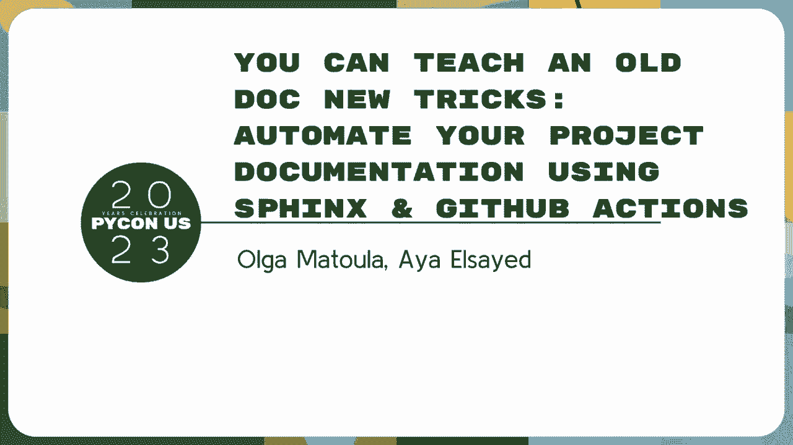
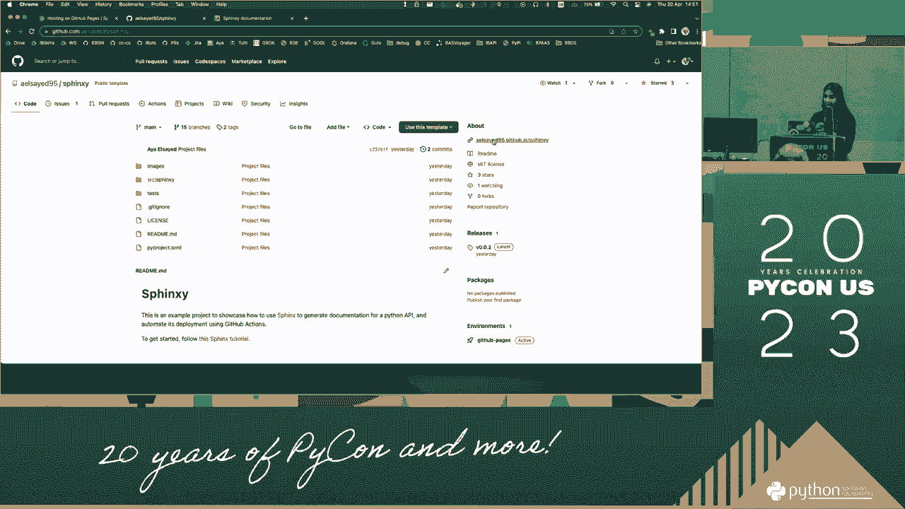
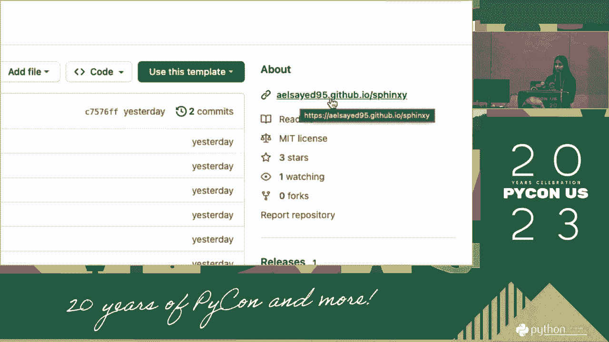
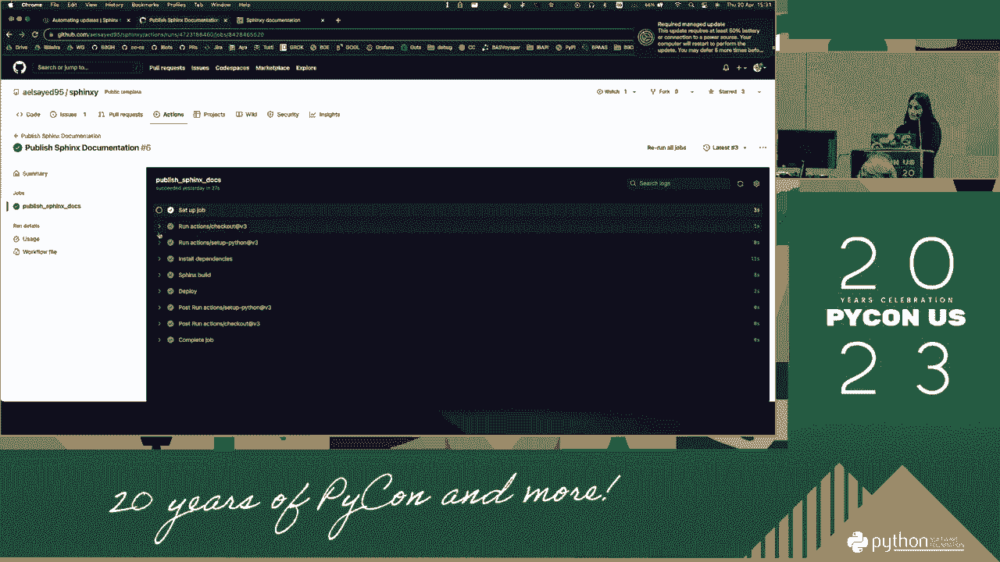
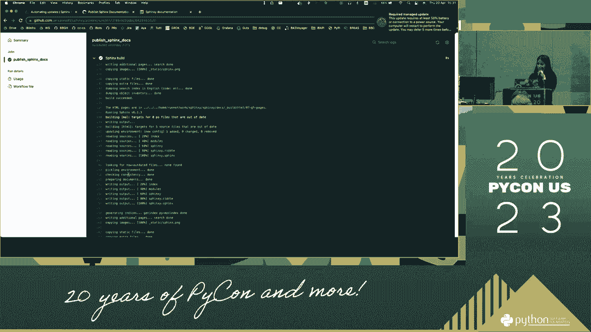
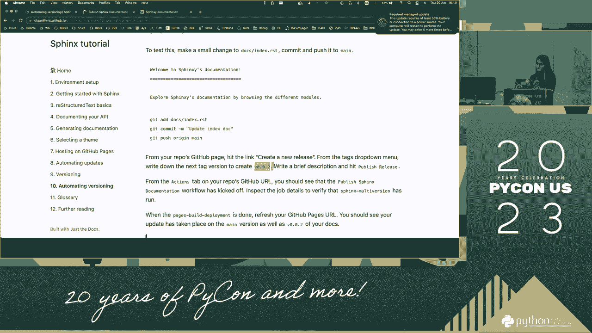

# PyCon US 2023 - P81：Tutorials - Olga Matoula, Aya Elsayed_ Automate Documentation with Sphinx & GitH - VikingDen7 - BV1114y1o7c5

嗨，大家好，我希望灯没有使你昏昏欲睡，接下来的三个小时你可以关注我们，我叫奥尔加，这是我的联合主持人阿亚，我们都在彭博社工作，我在一个为我们的即时通讯应用程序创建API的团队工作，它在警报系统上工作。

我们有一个彭博社的市场警报，我们在彭博社工作了五年多。

大概三个左右，我们都是内部蟒蛇社区的成员，我们有一个作品，蟒蛇公会，嗯好吧，所以谢谢你报名参加这个研讨会，你们中的一些人可能知道狮身人面像是什么，你们中的一些人可能不会，我们要保持。

我认为每个人都跟着做就足够了，对于那些想尝试更多东西的人来说，会有一些挑战，嗯，如果你没听过狮身人面像，它是一个轻松创建令人愉快和美丽的文档的工具，它可以产生很多不同的输出，像html。

乳胶或明文今天我们将重点讨论html，它的伟大之处在于它为你带来了很多魔力，所以它可以，当您创建文档并在Python代码中创建对其他对象的交叉引用时，例如，所以所有这些都是在引擎盖下为你完成的。

你不用担心，狮身人面像最大的优点是它有很大的认可度，有一个很大的社区和很多很酷的扩展，你可以试试，我们今天将使用一些，我们有一些链接，我们进一步阅读部分的其他人，嗯是的，我今天买了这个工作室。

所以我提到我们，我们是彭博社内部Python社区的一部分，大约一年前，我们举办了一个内部活动，在整个公司，关于很多不同的技术，所有这些社区都展示了他们的一些工作，我们收集了一些关于人们想了解什么的反馈。

我们注意到了一个模式，我们可以更好地记录，这就是我和A决定想出这个研讨会的原因，所以在形式上是非常为彭博科技量身定制的，但我们从参加研讨会的人那里得到了很多很好的反馈，我们决定把它推广开来。

并赠送给白人共和国，参加了几次会议，所以我们做了这项工作，所以九月在Python英国，内部会议，在伦敦当地的一次会面，我们都住在伦敦，现在我们在这里，是啊，是啊，这是一个很好的观点。

也感谢到目前为止给我们反馈的所有人，我希望我们做得很好，你们也会欣赏今天的作品，如果你有任何反馈，很好，但你可以晚点来和我们谈谈，好的，好的，下面让我们更详细地了解一下今天要做什么。

所以这将是一个非常互动的研讨会，我们将有，十节，是呀，我们将在哪里，而我，我们将介绍其部分的内容，然后你会有一些时间按照步骤去做，我们将在教室里帮助任何人或回答任何问题。

我们也认为我们自己从别人那里学到了好的东西，所以请大家互相帮助，在课堂上一般提问，所以其他人可以，你可以在这个小网站上找到车间链接，是的URL，我们得到了开始环境设置的指示，如果你没有或者你刚进来。

别担心，我们要一起经历，万一有什么问题，你可以问他们，然后呢，所以让我们仔细看看今天要做什么，我想这是车间的说明书，这是一个教程，你可以以后在家学习，如果你错过了任何一步，如果你想记住什么。

或者你可以和你的朋友分享，你爱吃什么就吃什么，这些是我们将要看到的不同章节，在右上角，我们已经链接了我们今天将要处理的示例项目，所以你可以点击它，它可以，它会带你去这个GitHub回购。

我们稍后会要求你处理这个，但现在你可以浏览它里面有什么，你可以看到源代码是，所以你可以走了，你可以浏览内容，所以你可以看到它是关于什么的，在接下来的几个小时里，你将与它一起工作。

所以今天将为这些模块创建的文档，并给你一个笑话，你将创造什么，这将是记录此模块的最后一个示例，所以是的，我们希望你，是啊，是啊，所以这就像我们的狮身人面像，我们将致力于，你可以去浏览它的内容。

您可以在源代码中看到不同的类，你可以看到，例如，我们为其方法创建的i文档，你可以，是啊，是啊，已经浏览了，你可以去看看，那里有什么，你可以看到，有链接将你链接到，这里的不同阶级，在左边，大家可以看到。

而且我们有不同的分支和不同的标签，这将是关于版本控制的部分，我们将要看到的最后一部分，我想，是啊，是啊，这就是本页的全部内容，嗯是的，为了那些刚进来又让我这么做的人，这是教程的链接。

所以如果你能在微小的URL点上浏览，COM作为最后的事情，这是教程，我们在展示这个，屏幕上有什么，如果你现在打开它，您可以浏览到第一部分，哪个是环境设置，你可以看到我们的先决条件是。

安装了不推荐使用的Python版本，我们推荐3-11，不过，我想只要是3。38就够了，这里是如何使用回购的说明，我们给您的示例项目，所以这是一个模板，然后你可以用这个模板，创建新的存储库。

你可以给你选择的名字，我们建议坚持狮身人面像，Y，万一出了什么问题，你可以一直遵循这一点，这样你就可以在笔记本电脑上克隆回购，而且是的，光盘进去，您可以使用任何您喜欢的编辑器，我们推荐可视化工作室代码。

我们会给出一些额外的提示，但任何事情都会起作用，你只需要一个编辑器和一个终端来处理它，克隆回购后，然后创建虚拟环境，说明在这里，安装包，你应该准备好了。

我们再次在基于unix的机器上对这个研讨会进行了更广泛的测试，如果你用别的东西，我们可以试着帮忙或者一起想办法，所以我们现在给你一些时间来遵循这些步骤，而且是的，有任何问题请告诉我们，好啦。

下一节我们将从狮身人面像开始，所以你当然要先安装氨纶，然后船上有一个方便的快速启动，我们将用来生成基本文件，我们需要狮身人面像，嗯，基本网站，所以你要运行这个工具，你要通过提示，然后生成许多文件。

第一个文件是conv pi，你可能猜到了，允许您配置狮身人面像行为的配置文件，嗯会稍微调整一下狮身人面像，这种行为随着我们的前进，你会看到那是怎么用的，下一个文件是index rst。

所以这是您的文档网站主页的源文件，嗯，这将生成索引点html文件，rst扩展名用于重组文本，我们将在下一节讨论它，make文件是一个方便的，是啊，是啊，方便有一堆喜欢，制定目标。

使构建或清理文档变得更加容易，生成文件夹是输出文档文件的所在，所以你的html文件将存在那里，静态文件夹是您可以存储所有静态文件的地方，所以说图像，嗯，然后最后。

templates文件夹是您可以将html的小片段放在其中的地方。自定义网站外观，所以嗯用，使用快速启动工具，只需构建由此产生的输出，你可以预览狮身人面像的输出，快速启动，就是这个部分，嗯。

我给你几分钟来解决这个问题，让我们进入下一个，所以我提到了重组文本，所以重组文本是一种纯文本标记语言，这是狮身人面像默认使用的，它还支持降价，但由于这是默认支持的，我们将在哪里教你这个。

我们也不打算过多地讨论语法的细节，因为外面有大量的资源，嗯，我们只是要介绍一些基本知识，这样你就明白了，嗯，如何创建基本页面以便，例如，这是创建标题的语法，所以这就是你网站的标题，这是一个目录树。

您可以通过指定最大步长来配置它，你可以给它加上标题，我们选择了内容，是呀，是呀，开始吧，本节的实际部分将是，是呀，加一小段，然后还链接一个图像，这样你在这里也有一个图像，你可以用我们相同的图像。

在回购示例中，或者你可以，当然下载你自己的图像，我是埃及人，所以我倾向于这个，所以我可以，当然可以用你想要的任何图像，还有一些我忘了在介绍中提到的东西，你可能会看到，在每一页的末尾，我们有一个提示。

您已经阅读了教程的这一部分，所以说，你有教程的这一部分，所以如果你在示例回购中，您可以看到，我们已经创建了教程中它的章节的不同分支，所以如果你因为任何原因落后了，或者你想确认你做了什么。

您可以浏览存储库，你可以从那里继续，我希望这样能有所帮助，接下来是第四部分，它记录了你的API，同样，我们一直在使用这个例子，你看到两个Python文件了吗，狮身人面像圆周率和谜语圆周率。

现在我们要为这个模块生成文档，嗯，所以我们要做的是，我们要加狗绳，这意味着我在函数签名后进行注释，或者定义类时，狮身人面像会施展魔法，将这些狗字符串转换为文档，我们想看看，有几种不同的风格。

你可以写狗串，一种样式是我们在上一节中看到的非常重组的文本，但你可能会同意这可能有点麻烦，所以出于这个原因，我们将使用谷歌风格的狗弦，我们正在联系，这看起来像是有很多规则，你可以把它做得很严格。

我们将遵循指导方针，你不需要按时做每件事，我们将使用一个非常酷的狮身人面像扩展，叫做拿破仑，所以拿破仑是个预处理者，所以在狮身人面像处理之前，拿破仑拿着Numpy或谷歌风格的狗串。

并将其转换为重组后的文本，在狮身人面像试图解析它们之前，所以谷歌风格也被许多不同的组织普遍推荐，这就是我们这么做的另一个原因，你会看到它非常熟悉，很容易读和写，所以在这一节中。

我们将从这里的一个方法开始，我们在选支票，阅读答案，因为它有一个更有趣的特征，但我们的想法是你要填写这两个文件，你自己的所有方法，我们将创建一个谷歌风格的狗串，所以我们决定写的课文是我们给出的。

最初只是方法在做什么的指令，然后我们解释争论是什么，我们解释是否提出了任何异常以及返回类型是什么，嗯，如果您使用VS代码，我们还建议通过代码扩展添加此功能，正弦，在那里你可以开始添加双引号。

它会预先填充，为扩展狗字符串选择的任何样式，所以这是一种快速做事的方法，所以一旦你对你添加的狗满意，然后添加和提交您的文件，并将它们推送到main，这将是第四步，我们会给一些时间，就像我不知道创意一样。

或者你想怎么懒就怎么懒，你只要填一个，或者你也能感觉到他们，制作更完整的文档，而且是的，如果你真的真的很懒，就像我有时会做的那样，您可以查看示例回购上的品牌，你可以看到我们预先填写的方法。

所以从这里开始，所以我认为零四文档API，你可以去SSC狮身人面像，你可以打开Pi上的Fix，看看我们在这里填了什么，如果你错过了，示例项目从教程的顶部链接，嗯哦，我不确定，好啦，是啊，是啊。

它连接在这里，嗯，所以你可以打开这里看看树枝，而且是的，一些更多的物流，我们知道下午三点有咖啡休息时间，但现在因为这一步可以从很少到很长的时间，如果你想休息5到10分钟，也请随意，不管怎样。

我们要等十分钟，这里没有羞耻，你可以去厕所，灌水，任何人都需要更多的时间，拿着那份文件它一个方法，没关系的，是啊，是啊，您可以继续后面的，是啊，是啊，好啦，因此，在本节中。

我们将学习如何从doc字符串生成html文档，你刚刚填写的，所以我们需要两次延期，第一个自动文档，从文档字符串注释中提取文档，其次是拿破仑，奥尔加说的，它会帮助事情理解，我们使用的谷歌风格文档字符串。

因此，您将列出需要使用的扩展，然后我们在本节中使用的主要命令是狮身人面像，API文档，所以嗯是的，您将把它指向输出目录，哪个是您的文档文件夹，然后是Python文件所在的源目录，嗯，这样它就可以为。

对于您注释的每个Python文件，这就是这里的单独旗帜，对于，这是为了告诉它，我们希望每个模块都有一个单独的html文件，嗯，如果你不用它，当然是可选的，如果你不用它，然后它将在一个页面中生成您的文档。

但我们觉得它只是看起来更好，所以我们用它们，嗯，是啊，是啊，你也是，一旦你做到了，您还可以链接内容树中的模块组件，所以这将允许您能够看到这里的内容树，因为如果你把它留在2点，最大深度是2。

所以你只能看到顶层的那种，您还可以将max步骤配置为稍微深入一点，如果您想查看主页中的内容，嗯，这就是这一步，所以您要重新构建文档，你应该能在步骤结束时看到一些看起来很好的东西，像这样的东西。

只是它还不会使用很酷的主题，因为我们还没做过，好的，好的，我知道，有些人摔成了碎片，但是嗯，我想我们的进度还可以，下一步我们将使用这种可选的更有趣的，完成的人可以玩一些东西。

所以这将是为你的网站选择一个主题，所以狮身人面像有一些内置的主题，你可以看到它们链接在这里，所以在你舒适的圆周率，你可以看到已经有一个主题被选择叫做雪花石膏。

现在你可以从所有的建筑主题中选择你想要的任何东西，你可以看到你最喜欢的，所以你可以试试，例如，经典，你总是可以跑，让html再次打开你的网站，看看什么看起来是最好的，嗯，但除了建筑主题。

很多人创造了自己的主题，他们被窥视着啜饮，所以我们在示例项目中使用的主题，你看到的最后一个网站叫做photo，它是由彭博工程师和普拉德创建的，是啊，是啊，我们想支持他，还有，我们很喜欢这个主题。

所以要使用圆周率主题，你可以安装一个犁沟，然后在你舒适的圆周率下，你选择，这是我要用的东西，你再做一次，您也可以提交Push来进行此更改，你可以刷新你的网站，你可以看到它的样子，呃。

我们很喜欢的是它有一个内置的黑暗模式，因为有些充满了黑色，所以是的，试试那个，如果你想，嗯，如果你喜欢别的，没关系的，但我们建议在这次研讨会期间，你继续犁沟，因为在某个时候，我们需要在主题上做一些改变。

而且是的，如果我们都在同一件事上，效果会更好，这就是本节的一部分，然后你可以在你的网站中添加另一个造型元素，如果你是像我这样的人，通常有数百万TA，通常你想通过Fabicon认出他们。

所以你现在要把面料添加到你的网站上，嗯，所以你在你的舒适馅饼里做的方式，你可以给一个链接，给他们存储图标图像的目录，通常我们更喜欢用这个，在静态目录下划线，你可以用你喜欢的任何东西，如果你现在不想选择。

您可以在示例项目中的图像下找到，道上织布，你可以用它，然后你可以把它的TML，将您的更改提交到缅因州，所以他们在那里，再次，这就像是一个可选的步骤，所以如果你在其他事情后面跑，你可以继续锻炼。

不用担心这一节，虽然是的，我们确实建议您在某个时候安装Furrow，所以是的，我想我们要给这个五分钟，这样我们就可以进入下一节，然后我们会有一个更长的休息时间，因为是的，可能需要在休息前让它更刺激。

我们希望你们中的一些人，你们中的大多数人都将他们的网站托管在GitHub页面上，你将有一个大脑链接和你的朋友签署，这是一个重要的里程碑，希望你已经安装了犁沟，你的网站现在看起来很漂亮。

我们将学习如何在GitHub页面上托管网站，这真的很令人兴奋，因为是的，你会有一个链接，你可以与人们分享，嗯是的，他们可以访问你的网站，当然有很多托管选择，但我们选择了GitHub页面。

因为我们不想让你学习新的工具，机会是你的项目，嗯，已经在GitHub上了，你已经在那里做了你的源代码控制，所以嗯，使用GitHub页面，只是多了一步，所以要使用GitHub页面。

我们将创建一个名为GitHub Pages的分支，Gh页，所以这是GitHub认可的一个特殊名称，当你创建这个分支时，它只是自动检测到您试图使用GitHub页面，它给你一个网址，你的网站将被托管，例如。

对我来说，这是示例项目，我不能给你看设置，因为这不是我的笔记本电脑，不过，好吧，但你可以在设置中看到，嗯，页下，您的网站托管的URL，他们也有我的链接在这里。

嗯，它会是这样的，所以它将是你的用户名，点github。

IO斜线您的包的名称，嗯好吧，所以要做到这一点，我们有几个步骤，第一批，我们将创建孤儿GitHub页面分支，我们之所以要创建一个孤儿分支和一个完全空的分支。

一开始是因为我们只想把我们的html文件放在那里，所以我们不想要，我们在我们的主要分支机构做出的任何其他事情，嗯下一个，我们将创建一个本地工作树，挂载在github页面的html输出文件夹中，然后呢。

首先，我们要把一个非常简单的你好世界网站，所以只是在一个索引点html将只有一个标题说你好世界，这样您就可以熟悉GitHub页面是如何部署文档的，所以你会看到，嗯。

每次您将某些内容推送到GitHub Pages分支时，这个动作开始了，所以它被称为页面构建部署，它只是重建您的文档，一旦完成，你可以看到效果，您可以看到您的更改，对实时URL生效。

这是我们要做的第一个练习，嗯，然后在我们真正把我们的网站推上GitHub页面之前，只是我们要做的几件小事，所以首先，一个快速实用程序，帮助我们快速清理本地工作目录，嗯，然后我们还将禁用杰基尔。

GitHub页面默认使用的静态站点生成器，但是因为我们已经在使用狮身人面像来生成我们的网站，我们不想用那个，所以我们只要禁用它，嗯是的，然后你就准备好把你的一个网站，到目前为止。

您在github pages分支上创建的所有html alpha，然后呢，是啊，是啊，你应该有一个生活，嗯，你知道的，像我这里这样的网站，我会让你开始的，呃，因为已经有几个人碰到这个了，当你呃。

从模板创建，有一种选择是将所有分支机构都包括在内，所以如果你选择了，你现在这一步，已经有编辑分支了，所以你要用力，所以在我们要求你，推，或者八页，使用lank空间，F是否强迫猫并推翻那里存在的东西。

是啊，是啊，有问题吗？让我们知道这件事，是啊，是啊，所以可能这里的最后一步，这是一个更长的部分，但是我们说过三点会派你去休息，莫索，如果你做完了，你放心去吧，但即使你没有做完，你也需要休息一下。

你放心去吧，我想我们三点二十继续，所以尽量在那之前赶到，是的，从这一步开始，就像我们说的，这是一个很大的里程碑，所以希望如果你只有这一步，你已经有了一些可以继续工作的东西，或者行李箱回到你的公司。

或者我不知道，在接下来的章节中，我们将看看如何在这个工作流上运行一些自动化，这样我们就不必不断地创建这些g-8空间，这些品牌在当地做一切，我们将使用GitHub口音来自动化这个过程，所以你得冷静下来。

将您的更改推送到main和所有内容，所有的文档生成都将神奇地自行发生，最后一个有趣的部分是添加版本控制，所以API的发展方式，你要添加新功能，人们如何在运行中引用所有文档，你的不同版本，所以是的。

到目前为止，我们一直在手动检查步骤，现在我们要学习如何把它放在一起，在自动化工作流中，为此，我们将使用另一个GitHub特性，不是因为我们想推广GitHub，因为我们不想让你学到太多东西。

但是github操作非常有用，他们允许你，嗯是的，基本上在给定的触发器上自动化许多工作流，例如，这是一个非常简单的Hello世界，工作流程，嗯，您可以创建一个文件，此路径下的YAML文件。

以便GitHub可以将其识别为工作流，这是文件的内容，因此您可以命名您的工作流，我们称之为你好世界，然后你选择一个触发器，GitHub支持的触发器有很多，但这是一个简单触发器的例子，我们在这里说。

我们希望每次都运行这个工作流，有一个推到主干，然后我们定义了一些我们想要运行的作业，在这种情况下，我们只有一个工作叫你好，它只有一个步骤，只是说你好，所以我们把步骤命名为，打个招呼，而实际的命令。

只是打个招呼，世界，所以这只是一个工作流的例子，所以您理解了GitHub操作的结构，嗯，但是现在我们将创建一个用于部署文档的工作流，和我们上面做的很相似，我们将创建YAML文件。

在github工作流文件夹下，我们要给它取名，发布狮身人面像文档，触发器又一次被推到了主分支上，我们首先要做以下工作，我们将请求内容范围的写权限，这将允许我们推进我们的GitHub笔芯，下面是台阶。

所以，首先我们要检查回购，我们要在这里设置Python，因为我们在311上班，我们把311作为Python版本，但是如果您使用的是不同的Python版本，然后当然修改步骤以使用您正在使用的版本，嗯。

好啦，现在我们已经建立了我们需要的Python版本，我们将安装依赖项，您可能从我们前面手动完成的步骤中认识到这些步骤，所以首先我们，在编辑模式下安装我们的项目，然后我们安装我们的依赖项，到目前为止。

我们使用了狮身人面像，下一个主题是犁沟，我们要建立狮身人面像文档，首先，我们使用sphinx api doc工具来生成，丢失的RSD文件，嗯，从我们的Python文件中，这些文件用文档字符串注释。

然后我们使用sphinx build命令来构建html文件，这是我们一直在使用的命令，但是我们一直在做html，这只是方便，嗯，这样您就不必键入整个命令，但这才是引擎盖下真正运行的东西，嗯是的。

最后是部署步骤，嗯，所以我们就用这个动作，调用的操作，GitHub页面，嗯，我们在说，我们希望将输出发布到GitHub Pages分支，输出位于停靠站斜杠账单斜杠中的位置，html文件夹和耶，是孤枝。

嗯，所以到目前为止我们所做的一切，但只是嗯，所有这些都写在一个工作流中，GitHub将自动为您运行，嗯是的，下面是整个工作流程，所以你可以理解它是什么样子的，你知道所有在一起，然后耶。

您只需将这个分支提交给GitHub，你要观察到，因为这是对ain的承诺或对main的推动，您将观察到GitHub运行您的操作，你应该可以点击它并看到，哎呦，好啦，我一直没有显示，好啦。

我没有在屏幕上显示这个，希望我说的有道理，我就跟着，我将再次显示完成的工作流程，所以这是工作流的名称，这是触发器，所以推到主线，嗯，触发工作流，这些是我们工作中涉及的步骤，嗯所以是的，去分行看看。

设置安装依赖项所需的Python版本，所以狮身人面像和犁沟运行我们的狮身人面像建造命令，所以API文档和狮身人面像构建，然后最后部署，是啊，是啊，部署到GitHub页面，是啊，是啊，因此。

一旦您提交了工作流，你应该可以转到这里的操作选项卡，你会，你会看到一个像这样的动作，它会，它会有我们给它起的名字，它是发布的狮身人面像文档。

嗯，你就可以点击它，并查看GitHub运行时每个步骤的细节。

所以你可以在这里看到，这是狮身人面像比尔命令，你会看到你在本地看到的熟悉的输出，但现在它还在继续，嗯，我们的远程机器，是啊，是啊，请一定要让我知道。

如果你有任何问题，对不起，我以为我在说话的时候展示了所有这些步骤，嗯是的，你过得怎么样？有多少人设法让他们的行动奏效，好啦，喝几杯，我再给你一分钟，我想我们要进入下一节，更像是，让我们说，高级。

如果您在GitHub页面上阅读主机，然后自动更新，您已经有了一个完整的工作流程，所以你可以看到现在你可以推动主，嗯，对模块所做的任何更改，然后这个动作将重建文档，GitHub页面的发布操作将发布它。

所以一切都很好，好啦，我再给你一分钟，然后我们继续版本控制，好啦，让我们开始下一章，所以我们说过，您的项目继续发展，你也许可以添加更多的模块，或者您希望接口有更多方法，或者任何可能发生的变化。

但您仍然希望支持以前的版本，可能有人在用它，他们想参考文件，由于这个原因，拥有不同版本的文档也是很有用的，今天，我们将，我们将看看我们如何做到这一点，使用一个名为狮身人面像多版本的流行扩展。

有很多不同的方法可以做到这一点，我们发现这个更容易使用，而且是的，所以我们要这样做，所以首先，我们将在我们的虚拟环境中安装这个新的包，我们会确保在我们的管道里使用它，从那里开始。

我们需要做一些html魔术，每个人都喜欢这样，但我们正在研究第六章中的主题犁沟，现在我们需要配置它，允许解决您所看到的不同版本，是啊，是啊，您可以在我们完成的示例中看到，这里我们选择了。

我们希望显示存储库中存在的所有不同分支，所有不同的演出标签，传统上，您可能希望只显示标记或其他内容，但我们正在展示如何两者兼而有之，然后你可以配置它，随你喜欢，我们添加扩展。

现在我们开始按我们喜欢的方式配置餐具柜，所以我们需要创建一个文档，在html的模板侧边栏版本下调用的html文件，其中这个解释了我们希望如何显示分支攻击，因为我们忽略了侧面燃烧的效果。

就像我们需要告诉罗罗，好啦，我们要推翻这一切，但其他一切我们都想使用默认版本，所以别以为我们只需要，所以出于这个原因，在科文派，你需要做这个配置，以便进入时在栏的网站标题。

侧边栏的不可滚动部分仍然按我们喜欢的方式呈现，所以只要把这个加在你的戈皮上，然后我们就可以开始了，使用狮身人面像多版本来建造我们的码头，所以说，狮身人面像多版本将取代狮身人面像构建命令。

每当你做html的时候，它就会运行，所以你要完成这一节，按照文档中的方式运行命令，在那之后，我们将承诺我们所做的改变，在我们的馅饼上，或者在我们的侧面，让它们出现在我们的主要品牌上。

所以我们知道下一步什么时候需要，当我们要启用GitHub操作时，一切都存在于那里，所以一旦你做到了，您都设置为使用多版本，然后我们可以试着测试一下，所以你要做的，我们将创建一个项目当前状态的Git标记。

你要把这个标签推到GitHub上，然后我们将对您的索引休息文件做一个小的更改，这里可以是你喜欢的任何东西，我们只是在第一个标题后面加一个新句子，然后我们要把这些变化推到主要，从那时起，我们将运行多版本。

然后在本地，您将看到在构建下生成的多版本，指导和构建html目录，所有不同版本代码的不同目录，一个是你的主要分支，然后我们有我们用版本零创建的标记，零一，这样你就可以去浏览那些。

你会看到第一个版本和主版本不同，因为我们在main中增加了一个新的变化，因此，在此之后，您将把所有更改推送到GitHub页面，这样你就可以看到它现在在侧边栏和不同的。

我们创建的两个不同版本main和version one，你要在一个问题上运行，我们说我们要用这种方法来解决，所以问题是，因为现在有了狮身人面像多版本。

所有的html文件都是在git分支的相应目录下生成的，或者您正在使用的GTAG，这意味着没有创建html的索引，所以出于这个原因，我们需要说，索引html将重定向到我们想要的版本，在我们的情况下。

我们选择主要品牌，所以我们需要重定向最初的，外面，索引html到主索引html，你需要通过添加这个逻辑并提交它，并将其推送到GitHub Pages分支，从那时起你应该看到成功。

所以在你的用户名GitHub中，Io Sphinxi是一个网站，你可以查看你的主要品牌和标签，索引8符号会喜欢这一页，因此，带您进入主分支上存在的代码，最后我们这里有一些信息，如果要自定义要显示的分支。

或者类似的东西，你很擅长正则表达式，你可以尝试不同的事情，您可以看到如何显示，这里有更多的台阶，所以我们要给更多的时间，是啊，是啊，你可以继续，然后这一段之后呢。

我们将看看如何修改我们的GitHub操作，支持多元化，是啊，是啊，有什么要注意的，因为有一些人问过因为我们现在正在做这一步，我们正在使用与GitHub操作不同的东西，你可能会看到一些失败，别担心那个。

这很正常，因为我们已经改变了我们正在做的事情，下一步我们将修复动作，一切都会恢复正常，好啦，我们现在准备做车间的最后一部分，所以在这里，我们将自动化我们在最后一步中所做的一切。

通过将其添加到我们的GitHub工作流中，GitHub工作流，好啦，所以我们要做一些小的修改，首先我们要更换之前的触发器，所以在让事情变得简单之前，我们在每个推送域上都触发了我们的工作流，但是嗯。

实际上，您没有创建文档的新版本，每次你把它推进去，对呀，嗯，您可能正在创建一个新版本的软件，这时您需要发布文档的新版本，所以我们选择了这个触发器，上面说当一个新版本发布时，那时它将触发工作流，嗯。

我们还修改了结帐步骤，获取所有分支的所有历史，然后标签，我又一次，我不是给你看我在说什么，好啦，对不起，这就是我说的导火索，呃，依此类推，真正发布出版，所以当你发布一个版本，而且是的。

然后我们要修改这个步骤，嗯，所以我们不想只拿主枝，我们还想把所有的树枝和标签，关于回购，那是因为狮身人面像多版本需要看到，那些能够创建文档的所有不同版本的，嗯。

还将修改安装依赖项步骤以安装Sphinx多版本，并将修改狮身人面像的构建步骤，当然啦，使用Swing多版本而不是狮身人面像，所以是的，嗯，这里还有一个细节要添加，在上一步中，我们创建了一个html文件。

它将用户重定向到文档的默认版本，所以说，我们只是要把这个文件复制到GitHub的一个位置，工作流可以看到，所以说，嗯，我们也可以在那里有这个重定向索引html，嗯是的，这就是工作流的整体样子，是啊。

是啊，所以就去做吧，然后提交，然后您可以通过创建项目的新版本来测试它，所以你可以把它命名为开放版本。

零点二，是的，是的，您将看到工作流已经启动，它为你创造了所有的分支，所以你应该能看到所有的分支出现，也是您创建的第二个版本中的第二个标记，我就祝福你这么多，好啦，如果你做完了，我们有一个小小的反馈表。

我们真的很感激一些反馈，如果你能给我们一些。