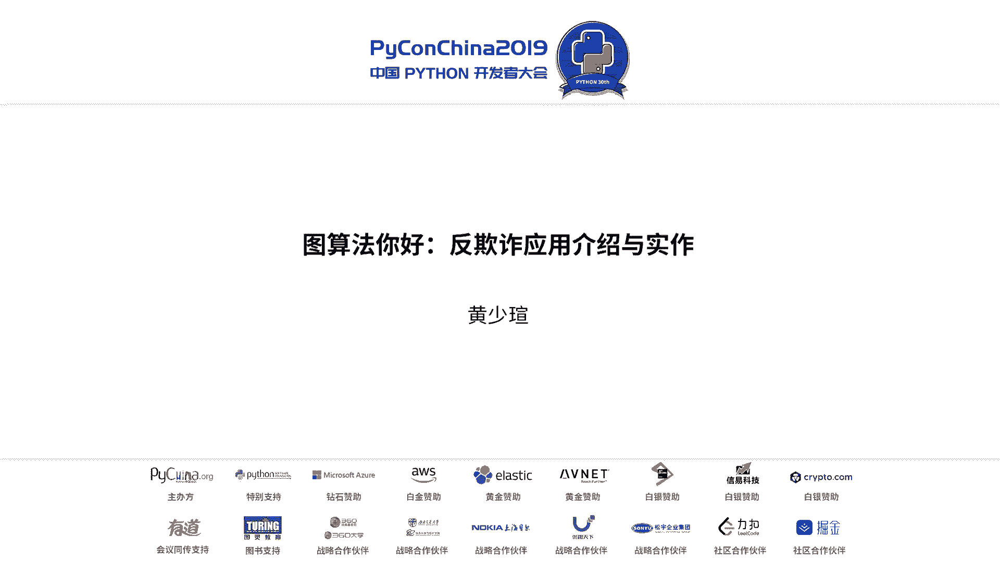
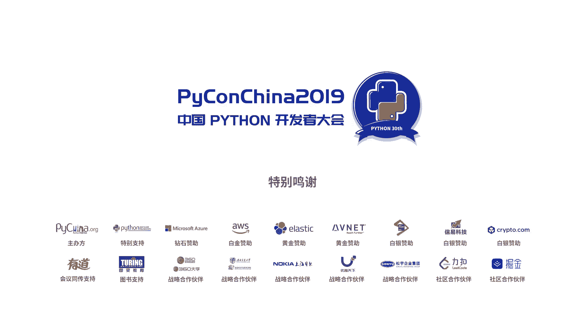

# PyCon China 2019 北京分会场 - P10：10. 图算法你好：反欺诈应用介绍与实作 - PyConChina - BV12E411Y7ze

呃，大家好，呃，今天要跟大家介绍是图算法在反击价的简单的介绍与实作。那呃我是呃青岛研究生，然后现在在平安科技实习。那其实这个top评呢是我在学校的项目的延伸。那呃反期上的这个因为我们今天是拍抗北京嘛。

所以我想到呃我们可以用一个呃宫斗剧开始说起。那以下这四个宫斗剧呢，相信大家都有看过。那我现在现在做简单的调查，有看过还珠格格的举手。诶，还蛮多的那有看过延禧攻略的举手。哎，好，那我们就应观众的要求。

那我们就看那个尊尊重经典嘛。所以我们下一张就是我们来介绍一下什么是图算吧呃，图的这个数据结构。其实图呢它就是由节点边以及属性所构成的。那我们可以看到乾隆皇帝，乾隆皇帝呢他的名字叫皇帝。然后他是甜品座。

这是他节点的资讯。那他跟主角小叶子跟子薇呢，他就可以透过风为哥哥的这个属性构成连检。那比如说呢他也可以跟呃他选了皇后跟令妃嘛，但但是我们知道在历史上还有剧里面，他都是比较爱令妃的。

所以他对于令妃的爱的承重，可能就有8奇葩，就还蛮高的那他呃皇后跟荣梦玛之间呢，它也是一个经典的关键角色。因为他是他最爱的部属。

那他同样对他赏赐的程度呢也可以用呃雇佣部属以及赏赐程度87分不会太高了来做呈现。那接下来呢大家可不会好奇，哎，右边怎么会有一个复恒，他并不是还珠格格里面的角色。那大家知道说他们的关系吗？

像是还珠格格里面的尔康跟颜熙里面的傅恒刚两个都有看过的同学们可以可以好，那我就布大家，因为时间不多，他们其实是父子的关系。那以数据结构来讲呢呃就有点像是康点黑的等于复恒，然后复恒点那就是康的概念。好。

那这对我们来说有什么意义呢？因为在关系网络图当中呢，在西藏同名当中有一个专有名词叫做核实身份。那简单跟大家讲什么是核实身份。那这边呢就是有三个版本的皇后。然后大家可以看到说呃来自三个版本的皇后。

大家的开头都是皇后，然后都是同一个人。然后可是呢假设今天我们呃金融机构认定的皇后呢留存的申请资料其实是还珠格格版的皇后。那这个时候呢来申请觐谏，就是披着皇后的名，然后来申。请的呢其实是如懿传的皇后。

这个时候呢，金融机构就要有能力去查验，也去核实说哎，这个核实这身份不对，我要做及时的拦截，这是第一种。那第二种呢呃呃因为那个于思曼没有首先让他刷一下存在感。那第二种呢就是关于呃团伙的欺诈场景。

那这怎么说呢？因为我们刚刚看到那四部宫廷剧，它其实是错综复杂的关系。那他其实都是从雍正以及乾隆两位皇帝皇帝作为出发点。那我们可以看到最经典的右上角的这个社区，就是皇后以及容妈妈。

不知道大家记不记得还珠格格里面有一个非常经典的场景，就是呃容妈妈就是害子薇的那一幕，然后后来被皇上发现皇皇上正怒，然后就把容妈说抓出来。然后就说哎是不是皇后指使你的。没错，这个就是社区发现。

就是当我知道有一个做坏事的人的时候，我就要去找到他的关联关系人。但是在欺诈场景呢，假设我们有一套呃产业界共享的黑名单，我们只知道一个节点，他可能是涉黑的，我们就可以办法透。

我们就有犯法透过图算法去找出他的相对的社区。那接下来呃给大家三招，就是假设你想要用图算法去implement在你的模型上。你首先第一个最需要呃采的呃避免的误区。因为这也是我采购的误区。

就是你的数据涵盖的信息量，它是一个connect graph吗？但是是什么意思呢？在gogle上面呢，我们透过 visualization。我们可以看到各式各样的图复杂网络关系图。

可能有呃密集恐惧症的同学可以先ep这一页。那呃在这上面呢，他总结的图算法是有分成这三个部分。第一个部分呢是关于，它主要是解决最小路径的问题。那第二个呢是中心度算法。

它去衡量整个网络图里面哪些角色是重要的，它有很多种不同的衡量方式。那第三种呢就是跟反欺诈比较相关的。就是我们刚刚讲到那种团伙欺诈的行为。它是透过呃社区呃发现的方式去侦测说哪些是涉黑可可疑的名单。

以及它可能的社区。那这边有一个 fully connected的大家可以参考呃，在最中间呢可以以呃小燕子紫薇希，他们是一个社群。大家可以看到紫色的群内他们是非常紧密的连接的。

并且他们跟群外也就是紫色绿色深绿色深蓝色之间，他们也都有所连接。那其实这个呢这个图呢，如果你想要找到一个涉黑的名单。其实你可以找到他们相关应关联的关关联关系嘛。那接下来给大家看一个返利。那这个返利呢。

它是呃在K上面有一个呃交易欺诈的数据集。那我当时做的时候呢，呃中间红色的点呢都是呃涉黑的黑名单。那这个交易期诈呢，由于它的呃信息含量就是它的呃初度平均就整体大概600万条数据，平均出度只有一。

那超过三个粗度的呢不超过3。所以大家都可以看到说他其实群内就是都有聚集，可是群跟群之间并没有完整的 connected。所以呢其实这类的图透括刚刚那个。comde的算法呢。

它其实会被分成很细碎很细碎很细碎的社取。那这样的话就没有办法帮助我们找到那些可能涉黑的群体。为什么呢？因为正常的群体也是长这个样子，所以没有办法帮助我们做有效的区分。

所以初步呢我们可以透过简单的统计输入的方式去检验呃各位的数据率是不是符合这类的特性。那第二个呢就是大家很好奇说哎，那图算法要怎么搭配上手，要怎么样用thon去做实现。那先讲呃我研究了这些party之后。

我觉得呃最方面是用new它是一个图数据库。那它预设的节就是它可以呈现化节，它是透过web呃web friend的方式做呈现。那它预设节点就是可以呈现3000个节点。

那像刚刚大家看到google那些大家都是1000个以内。对，那刚刚的那个皇后乾隆re方式就是用spher语言做实现。那spher语言呢其实跟蛮像的。它简单来讲就是长这个样子，就是通过刚刚的语法。

大家就可以把节点画出来，还有它的属性画出来以及权重画出来。那呃如果想要就是更好的处理话，就是我们习惯用on去做我们的数据处理。然后外进去给new的数据库。

那它同时呢new它有延伸的API像algo跟app。然后呃go跟他们的区别呢是在于呃是比较旧的APgo是比较新的那下面两本电子书呢都是可以在的官方网站去做下载的。然后并且这个电子书呢。

它是今年呃2019年5月才试出最新的版本。那大家可能在实做的时候要注意algo跟po他们在呃imment的方式，上面可能会有些时效。

因为网络上目前还是比较多的go算是比较新的然后也有呃中文跟英文的社社区。然后其他的呃基于package像它背后是用C写的那namework X它是纯拍对不对？然后GEPHI它的角色其实跟new蛮像的。

因为这个也是呃就是有一些网友就有跟我分享说他他们他其实可以处理更大规模的图。那GraphQL哦Q graphQL呢，它是可以去query，像是图的一些属性啊，节点啊边啊。

是基于是facebook开源出来的语法。那第三招呢就是呃我觉得也是最难的，就是你要跟反欺诈场景结合。因为呢呃这个是大钱贷中贷后的整体风控流程。那呃刚刚讲到的就是和生以及团伙欺诈。

都是属于发生在大钱与贷中。那在贷后呢，假设我们想要找到一个催收失联的账户。我们也有机会透过图算码方式去找到潜在的关系联系人。那最重要最重要的可能就是要怎么样用图算法呢？

就是我们希望可以建立一个 fully connected。那如果我们要有这类的graph的信息量一要足够。所以其实在呃黑产的这个产业链，大家希望的是是不是有一个黑名单的共享机制。

比方说我的主数据不只是账户ID而已，我还有一些手机IP然后手机设备号等等。一旦这个联盟或是共享机制建起来之后呢，是有助于整个黑色产业链发展比方说我们就可以建立起其在联盟，然后找到更多黑名单的可能性。

那以上呢可能讲的有点快，但是呃以上的细节呢都在我的上面，然后大家可以参考，就是这几天然后下面呢又帮大家整理就是我觉得像我当初实验选择要用什么工的时候，我有实际去做做做了这些东西。

然后发现这些是可以资源比较小的no，如果你的需求是比较小的话对那最后这个是我的联络方式，然后希望有机会可以跟大家。交流。

