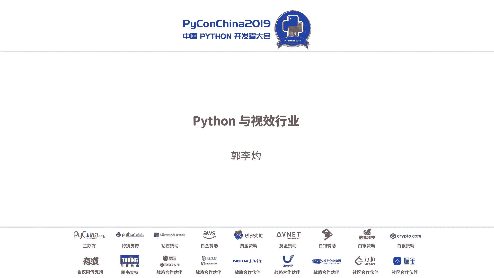
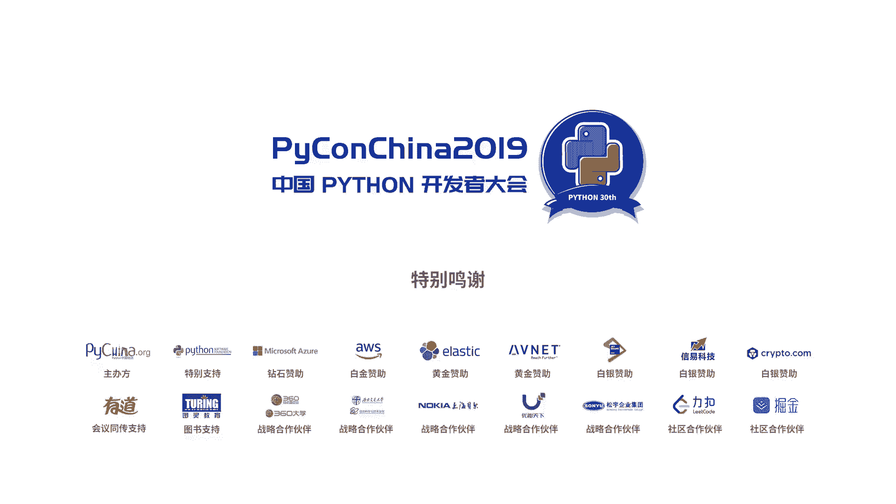

# PyCon China 2019 北京分会场 - P11：11. Python 与视效行业 - PyConChina - BV12E411Y7ze

啊，很高兴和大家在这分享一下。如果说一门语言，它可以这也能用，那也能用，我觉得应该就是拍上拍上它是一门在很多的行业都在应用的一个编程语言。因为它的应用性，因为它有很多积累的素材库。然后今天我想分享一下。

就是在影视特效行业拍上是怎么应用的。然后这个分享呢主要是第一个是讲一下事效怎么做。这个是一个一个比方说大家刚才看到的漫威，看到了很多的大片，它其实每一个镜头它都会分成很多的环节在制作。

比方说最开始是这个资产模型环节。比方说一个怪兽，现实中没有存在的一个东西，它需要先做之后它的这个资产。然后针对这个资产做完以后，结合实拍绿幕啊，包括画面啊有一些叉杯眼啊，包括一些画面不干净的部分。

包括把刚才的资产结合动画，让这个资产动起来。然后这一系列的环节做完，最终呈现在咱们眼前的就是电影上的这种效果。这里边每一个环节，它都可能是一组人在做。比方说加猫的，这个模型环节，它有可能是几十个人。

然后一个电影假如一个上千个镜头的一个特效电影，它的制作团队有可能就是1个2000人，甚至更多的一个人。所以。特效行业可以理解成是一个劳动密集型的行业，他需要很多的人去参与。

然后在开场对视效行业的一个应用是这样，就是在四效行业主流的一些制作软件。比方说3D maxax，可能很多人都听过呃，像玛雅和diminew，这就是在私效领域比较专业的应用一些软件。他们比方说很多的电影。

他们幕后其实都是在用这些软件。然后像一些大的公司。所以这点在国外会做的比较好。像国外的迪士尼，像国外的很多的公司特效公司，包括北塔。他们都有自己的开发团队，有自己的一些开发的专用的视效制作工具。

这点是咱们目前国内的视效公司比较欠缺的。拍上的话在和这些软件的话，包括这个操作系统，它就因为它就有提供接口。所以拍上的话，在比方说在玛雅里可以直接调用玛雅的这个库进行编程，进行做一些自动化的流水。

做一些。比方说流程化的应用。然后下边是讲一下这个失效，就是说起咱们国内私效，可能更多的人对的对于失效的概念就是五毛特效。经常看到网上很多舆论说这又出现五毛，比方说手持鬼子等等等等。五毛特效。

这个五毛特效的话，其实我觉得有两方面，一个。因为我也是转到这个失效两年左右的时间，五毛特效，一方面可能就是制作周期和预算的问题。换句方说，任何一个好的项目，它必须有相对充足的制作周期。

然后需要足够的预算。还有一方面的话，其实就是咱们国内试校啊，现在就是缺少人才，缺少人才。就是市校，特别是这个计算机学教。它其实是一个艺术和技术的一个结合。就是我们这个行业。

比方说比方说处理画面做一个模型，可能他是一个艺术家。但这个艺术家假如离开了计算机技术，他是没法去真正的做好。比方说像右边这个狮子，大家看见来都很假，第一眼看上去就觉得可笑。

但是这这个狮子其实也是几十个人的团队才能做出来这么一个狮子。所以今天来这个拍康给大做分享，其实也是希望更多的人能关注一下，就是视效行业。因为大家都是拍档方面的专家，然后可以去了解了。

解看有没有兴趣加入到视效行业，为咱们国内的视效减少五毛特效做出一份戏。然后还接着还说一下，就是这这些新的技术，新的技术，比方说深度学习人工智能。其实现在在视药行业已经开始在用了。

比方说像第第一个我们展示的其实是一个画面的处理，这是在视效行业处理镜头最常用的一个场景，就是把画面上不需要的东西拿走。比方说现在出标注的部分可能将来都不需要替换成其他的，然后给它替换成它的背景。

是一是比方说一座山，或者是一个其他的场景，这个叫Q蓝Q绿，或者叫lo。然后这次现在可以通过人工智能来实现一些自动的识别，但现在还比较熟悉。然后向右边的话，这就是图像的分格迁移。

比方说把白边场景变成板上或者其他时间段。然后下面这个是这个应该大家都知道坏品。换脸最早可能就是他印的领域不是那么光彩啊，但其实换脸会。快点这个其实怎么说呢？在市效行业其实还是有很多的应用需要去做。

比方说。有有有一些危险的镜头可能是需要替身去做。然后现阶段的拍摄方式可能就是人工去处理这些镜头。但是假如通过AI的话，这个可能就是几分钟甚至几个小时就可以做。因为一个艺术家他处理一帧画面。

因为一秒大概就是按咱们现在通常所用的这个视频的帧速率话，11秒画面是25帧。因换句话说，理论上一个艺术家，他处理这个一秒钟，他需要处理25个画面。假如一分钟的话，这个画面是1500张图片。

所以这个工作量还是很大的。假如通过编程，通过AI可以节约这个工作量的话，其实对这个怎么说的对五毛特效是有很大的帮助。然后整个行业的效率也会提高。然后最右下角这个图其实是一个图像呃就是叫跟踪网。

就是左边的人做什么样的动作，然后在右边做一个实时的捕捉。这个技术其实在很多的大片里，比方说咱们看的那个星球崛醒新境新境的很多动作都其实都是通过动作演员这边动作演员的动作捕捉，实时反回到新境的身度。

现在这些就是这就是算比较前沿，就是深度学习。现在其实这几个领域在呃这个影视特效都在慢慢的在使用。现在很多的剧里面有一些尝试。然后最后就是说一下，这希望更多人能了解开上在黑白在这个视效行业。

希望有一些人能加入到这个视效行业。然后这个视效行业和咱们IT行业有一个相同点，经常加班，工作强度也也很大。所以你们来了应该会很适应。然后然后视觉行业的话。

其实相对来说它可能因为它属于一个艺术和技术的一个结合体。所以他怎么说呢？他可能在经验就是咱们的工作经验，可能相对来说比传统的咱们的IT互联网行业会更新的会慢一点。你的经验会越来随着工作年限会越来越值钱。

然后拍档在视觉行业几个基本上可以分成几个功能。第一个就是。产品经理的角色。因为咱们现在国内其实没有自己的视效制作软件，现在。视效这软件说刚才大家经常能听到3D bags，现在很多的失效软件是英国做的。

这个可能你们没有想到，英国加拿大他们是现在在视效领域比较强的一个国家，他们的技术研发能力并不是说有多好，只是他们国家有很多的政策去扶持。所以现在比方说有一个软件叫六个。

六个呢是最常用的制作电影电视剧的一个合成软件，它是英国做的。呃，然后所谓的这所以这个行业又需要这个产品经理去规划视效产品做一些通用的产品。然后第二个拍烂PD拍烂其实在咱们互联网行业这个不陌生。

这其实就是一个流程管道。然后在视界行业里其实也是刚才第一张图看到了，就是假如一个镜头，他需要经过很多的环节。这些环节之间的衔接，包括这些环节人员部门之间的衔接都需要拍个烂PD去帮他们梳理这个流程。

包括上一个环节怎么通知到下一个环节，上一个环节输出能不能自动的兼容下一个环节的输入。然后还有一个叫专业的PD。咱们比方说电影里看到的爆炸的效果，水牛的效果，其实这些都是物理特效。

就是通过计算机在模拟物理特效，它并不是说凭空想象出来，它里边也会用到很多的物理规律呃包括物理运动规律，包括怎么说呢？就是很多的数学数学原理，包括。像这个专业TD里面。

他可能更多的其实还需要了解一些现金代数啊，包括一些数学的基础。这个专业TB的话，它可能就是针对某一个环节。比方说模型环节，它有这个TB所以TB就是tetedirect。

就是directctor可以理解成指导，就是一个技术指导。然后最后就是图形图像研发，这其实就是比较直观。所谓的图形图像研发，其实每天在视角行业基础上的都是图形图像的研发。

