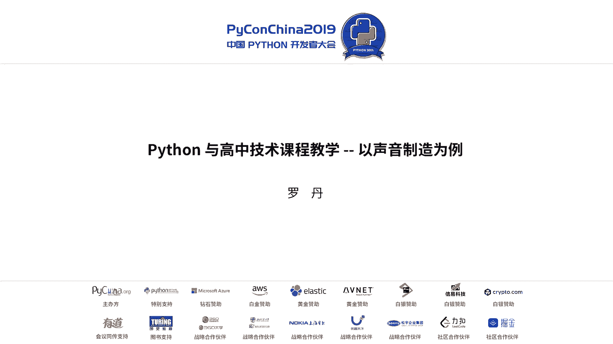
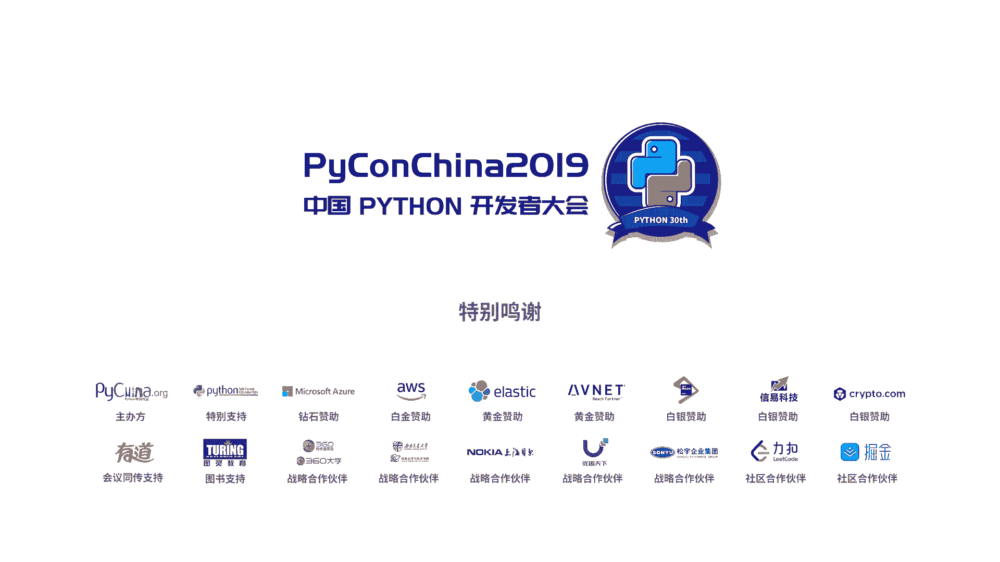

# PyCon China 2019 北京分会场 - P12：12. Python 与高中技术课程教学 -- 以声音制造为例 - PyConChina - BV12E411Y7ze

呃，谢谢大家，我就是那菜单菜单上没有的那容。然后首先自我介绍一下，我来自北京大学附属同学，然后是目前担任这个技术的老师，还有负责一部分音乐的音乐课的老师。

那么今天我带来的这个题目就是呃拍on与高中技术课程教学。然后以一个声音制造这样一个具体的项目为例。那么这是我今天将会啊。cover的一些呃呃标题。

第一个我将我将为大家为大家介绍一些我这个课程设计的一些背景。然后它的一些基本思路。然后就是最关键的pyython在我这个整个课程设计里，它的一个核心的角色，然后最后就是标题有点大。

就是因为这个team现在非常的火。那么我也会把我的一些思路啊，像跟大家分享一下。这个第一个就是我们学校目前技术课程设置了一个模式，就是呃无设置独立的信息技术跟通用技术。这个大家如果大家可能都上过高中。

对吧？呃，在高中我们技术课程主要现在分为信息技术，还有通用技术。那么信息技术主要就是我们这个这个有关计算机成绩设计，然后计算机的一些基本知识，还有这个通用技术，就是呃手工制作，那么目前为止在北大课中。

我们不单开这两个两个类型的课，而是融合成了一个，也就是把我们一个个技术老师逼成了全能，就是既能写代码，也能去目的。那呃我们的课程设计是以项目就是为，就是学生来了选了我的课，呃忘了说了，我们目前是选课时。

就打破了年级，没有班级。然后学生你是根据这个课表里的内容，因为像我们大学里这个选课的这样一个模式。呃，然后对于我们教师来讲，我们有相对呃比较大的一个自主权。就是只要呃在一个圈子里面。

这个比如说这个学校的整体的课程设计规划和这个高中课程呃标准，那么我们就可以根据自己的经验来设计这个课程。那么。这个思路第一条我刚刚已经提到了。第二条就是可以融合中学主干学科知识。

也就是我这里面不单是技术跟信息技术。你要把你从数学物理化学乃至其他科目的这些知识都要拿过来用。那么呃但是呢我会给你一个明确的研究对象。也就是我一会儿要说的这个声音制造。

同时这个目的主要就是现在学生这个研究性学习的能力，给你一个有限的空间了。那么你能不能应用现有的工具去做一些有用的事情。呃，当然第三个还有还有一个重要的原因。

就是我也希望通过这样一个努力能够打通中学知识与大学专业知识的一个通道。就是因为这这高考这道坎，实际上上呃，怎么说呢？对我们大家在学习的这个学习的经历上会有一个比较大的影响，就是它是一个分界线。

那么我们现在尝试做的就是把这个分界线尽可能给他给他做的平滑一些。呃，这个就是我们呃这个具体的这个项目，就是声音制造。那么呃学生要完成这个任务，是需要通过研究这个5个主要大的板块，就是了解声音声音是什么。

然后分析声音，制造、处理传播声音。那么在这个过程中，学生就需要用到他们在他们主干学科中学到的知识，同时将他们进行一个融合。这个目前就是我呃整体的一个课程规划。首先，学生先到我课堂上。

前可能前一周到两周的时间。首先你要我带着你复习或者预习这个相关的数学物理知识，也就是三角函数。还有我他们在物理中学到这个这个呃。你不这这个叫震动这样一个一个概念。同时我要告诉他们。

OK你们将要用计算机这个工具去解决这个问题。那么计算机它有什么特点？那就是两个作为我来，就是两个有限，一个是有限的空间，还有一个是有限的计算次数。你必须你既然选择了计算机。

那么你就必须要这个面对这个现实。然后。台on的这样一个角色就进来了。那么我们说呃。你可以先怎么办呢？因为声音的信号它是一个我们说可以用最简单的挣弦波来表示。那么我们不放心把它画出来。那么在画的这过程中。

他就体会到了OK你你在处理的是一堆离散的数据了，就不是连续信号了。那么在这个过程中，实际上你就是怎么样？就是在利用计算机的这样一个它的特性来研究你真实生活中经常会遇到的这些问题。

然后你对这个声音长什么样，你看见了，那么下一步就是用pyython去生成你要制造的这个声音。有了这个你你生成了声音之后，那么我就可以什么增加变化，对不对？我可以设计。

比如说这个控制它的音量控制它的这个频率等等这样有关声音的这个参数。然后可以就利用这个智能硬件平台，比如现在我们正在用就是resberry pad和这个arrena，通过它。和计算机进行一个协同的工作。

这样你的这个这个奥，不好意思啊，忘了这个我们的具体要求是你可以动手制作一款可以演奏的电子乐器。这个就结合了编程。还有这个我们说这个动手的这样一个呃一个要求。当然最后还有就是要鼓励他们这个头脑风暴。

就是你呃我就这么跟他说，你们平常在上物理课，在化学课生物课上做实验的时候留一个心眼。凡是在你实验中实验过程中，哪些因素是人为可控的？那么你这个人为可供因素对你的结果有什么影响？

其实你都可以拿过来当做怎么样，你的触发机制。那么这个就是pyython具体的一个功能。呃，首先第一步给你数学公式，一个正弦波功能生都知道，然后利用pyython，你把这个这个正弦波给我画出来。

当然我们这个库就是用的，大家都知道这个wi派这个库，一个正弦波出来了，OK那么如果我让你生成OK你一个正弦波可以生成。那么我如果让你生成几个不同频类的正弦波，你把它结加起来，怎么办？那就顺便说一下。

所有我讲的这些内容都在高中课本和课程标准以内，没有没有超纲的内容。那右边就是一个很简单的例子，你证件目出来了。OK那我给你个公式，把矩形波公式给你，你能不能够根据这个公式？把举行波这个数据生成出来。

然后画出来。有了数据了OK那这个就是一个具体的案例。因为我让学生生成了之后，然后他听到这是这个就是已经他听到了这个声音效果，他会发现OK这个声音在一开始和要结束的这个时候。

他的电脑的音响或者耳机会有一点点过载的现象。怎么回事儿？当然其实我也不知道怎么回事，但是我会我是我会粗发他们去想，哎，会不会是因为这个你在信号这个电瓶在上升的过程过速度过快。

从而造成了一个有可能是这样过载的现象。那么我们可不可以让这个上升的过程变得平滑一点。这里我就会把这两个图像让他们抠出来，然后他们去看，然后唉你怎么通过这两个图像的对比，找到一个属学模型把它给解决。

那么实际上这个问题就是我们高中。这个高一就学的这个分段函数的这个概念。第一个就是我让他们当时就是把这个你把把那个震动的那部分内容看掉，就只看那个直线，那边也只看把这个只看它的包括线。

把中间这个震动部分给它去掉。那么你能不能通过这个角度，然后再利用分段函数的这个概念。把它给解决掉这样。解决了之后，他们发现哎，这个确实是这个信号，这个声音在出来之后，这个起始阶段它确实有一个平滑的效果。

它不再那么突兀了。而这个东西实际上在这个信号处理过程中，就是我们说有一个这个叫很经典一叫曲叫A呃AASD啊最后一个忘，就是attack对吧？上升，然后stain然后DK这样一个曲线。

这个在这个电子乐器中其实非常常见的一个一个功能。然后后边就会我会让他们设计一个简单的图形界面，然后干嘛呢？利用这个我们的这个。wifi的功能或者这个呃比如说这个串口通信，让他可以怎么样呢？

你的电脑去处理所有这些heavy duty work。但是你的这个触发机制，你可以让他把它部署到这类智能硬件上。然后通过目前为止，我让他们用的这个UDP其实在这个过程中。

很多这些这个核心的咱们平常用到这些核心的电脑概念都会被设及TCP跟UDP有什么区别，这个他们就会想我现在如果我要做一个电子乐器。我是需要TCP的这个协议工作方式好一些，还是UDP好一些，对吧？

这个他们都会你会促使他们会去思考。当然了，用了这个这个我们说这个传输的协议其实就是很简单的一个jason，就是你我要什么效果，然后我要什么comd，然后你给我play一个这个他的音就OK了。啊。

最后跟大家分享一些这个有关中学te课程的这个设计和教育思考。因为我研究生就是主要跟我导师就是做这方面的研究。呃，那会儿呃也是有机会去了几次这个MIT的这个media。

所以我是比较认同他们那一套这个呃技术和艺术融合的这样一个呃这样一个方向。因为我本身我其实我我玩音乐比写代码的时间要长了长多。我高中就开始玩我摇乐。那么我那会儿就是想哎我玩了集集德效果器，他是怎么回事。

他其实会促使我去想这方面的这个内容，那现在我掌握了一定的这个技术的知识。那么现在我就可以带领我的学生。OK你对这个感兴趣吗？我我现在手里确实也有一批玩音乐的学生。

你有兴趣O那么你可以按照这样一个呃方式去呃学习。那么。对于中学的ste教学，学team教学来讲，我认为内容肯定必须优于形式。就是不再是现在市面上有一些很火的什么steam教育，你就什么教你个编程啊。

sp啊，做个小机器人。其实我觉得那个对我来讲，对我来说，他对我不够成吸引力。那么我我的这个这个比较喜这就怎么说呢？就是呃比较喜欢的切割点，就是还是就是从我们的主干学科的教育大纲起点。因为我们要面对高。

这个形式不能变的对吧？但是具体考什么，我们可以有一些这个呃改动。那么平行深入教科生合。这个这个我呃意思是我可以把中学生在他们在学的这个主观学科的每一科都可以跟技术逐步的相连。然后在这个相连过程。

它是一个并行的，还是没有连接。但是在相连过程中一定会找到这个焦点。那么有了这个焦点，那么网络就会形成了。那么这样他在经历过这样一个过程之后，他高中毕业。

那么他的知识网络肯定会比单纯的线性的这样的这个只学生物哲学物理出来，会要要要这个通通透的多。那么还有就是各学科老师之间应该进行一个深度的合作。这个就是我们正在做的。

我目前跟我们的学校数学老师跟我们学校的美术老师其实都有一个比较深度的合作。他们有需求。因为他们有想法，但是他们可能对于这个计算机编程这块不是特别熟悉。那么把想法交给我，我来帮他们我来帮助他们实现。

然后在教学过程中应该清晰的展现出学科知识之间的一个联系。就像刚才我说的。我就是要你用了分段函数这个概念来解决这个信化处理的这么一个问题。你不懂回去翻数学课。

然后最后一个就是引导学生对他们所学的知识技能进行一个模块化管理。这个其实就是我们作为程序员来讲，一个一个思维定式。就是我我会了什么。然后我掌握的信息，如果我能够按照一个合理的方式去给它归类。

就像电脑编程一样。那么对于我的学习和工作来讲，都会有一定的好处。呃，呃，跟大家讲的可能也就是这么多了，因为时间有限。啊，所以呃可能是我们这我这个题目有一些这个不是很很专业。但是可能因为跟我的职业有关嘛。

毕竟大家是呃是想办法让机器更聪明为人服务。那我的工作可能就是就是让我班这帮智障学生变得更聪明一点。好，谢谢大家。

