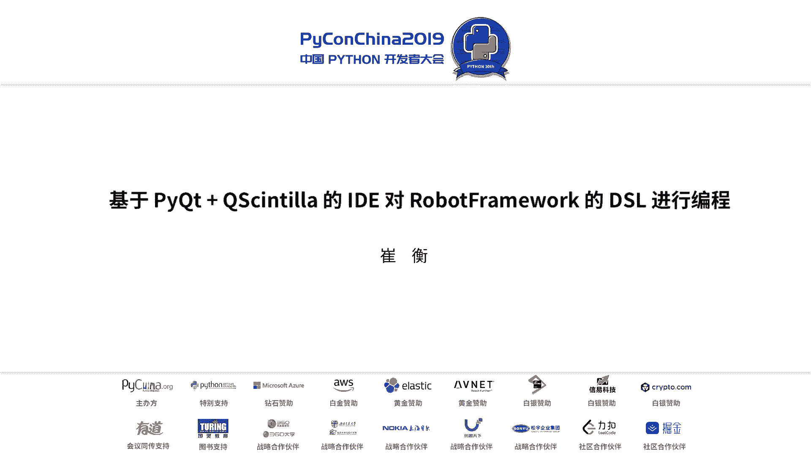
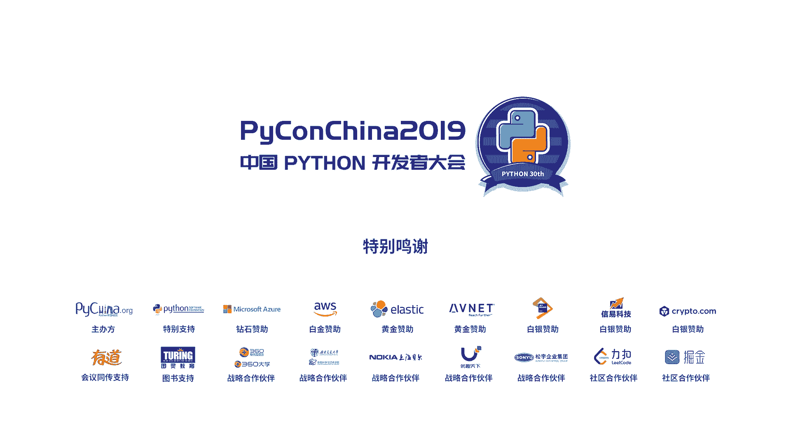

# PyCon China 2019 北京分会场 - P1：1. 基于 PyQt + QScintilla 的 IDE 对 RobotFramework 的 DSL 进行编程 - PyConChina - BV12E411Y7ze

呃，大家早上好。可能今天还是比较早，然后很多同学都比较辛苦的从各个地方赶过来。呃，那也很感谢这个大会的组织者啊，还有这个P这个这个会能给我这样一个机会呃。

去给大家分享我过去在学习工作中使用那个python的一些呃经验跟体会。好，那首先在那个话题正式开始之前，我还是希望跟大家做一个小小的一个互动的一个调查来暖一下场。呃。

就是首先在那个工作中用python去做那个AI包括那个算法啊，使用到那个tenorflow啊P这样的同学，能不能举举下你们的手，就类似的啊这种算法工作的。O。大概明白了呃，使用比方python啊。

像pandas啊，n派去做数据处理的呃，有哪些同学OK嗯。那摄影有没有去使用python，比方说做那个呃应用系统，像江狗啊、fask这样的有哪些？好的好的，感觉用系统还是用系统还是比较多一些。

OK那我今天分享的这个题嗯课题呢，其实是稍微有点小众跟复古的一个题目。呃，那就是用python去做那个自动化测试。那我们之前用遇到的一些问题，那是怎么去解决的呃。

那对那个robo framework这个框架有了解的同学呃，能不能。就是听过的角手呢。OKOK那人还是蛮多的。好的，那我今天分享的这个主题呢叫做buil DSSL editor using pthon。

这个是我个人的一个介绍。其实我我是大概在2013年开始，然后就在使用python。然后目前在那个阿里云数据智能事业部，然后是做技术开发工作。呃，那我也喜欢那个一些呃电影啊，还有一些小而美的烟食物。

到最后大家也可以加我的微信。那此外呢，其实我也在使用那个像CNR购啊ra。嗯，好的，那我今天分享的这个主题呢，分下面几个部分啊。第一个是一个背景知识一个介绍。呃。

就是介绍一下我们使用robo framework。呃，还有一些就是你要了解到这个topic，你需要掌握的一些那个知识技能。第二个是对robo framework，我们会做一个快速的一个那个就是介绍。啊。

然后呢我们遇到他在使用它的过程中遇到了哪些问题。那我们是怎么去呃解决的。然后最后我会做一个总结和一个QA的一个时间。那这个是呃一些小小的一些背景知识吧。第一个就是说像DSR对吧？DSR的话。

它就是doomainspec language的一个缩写。那我们可以理解为像计算机语言，现在有很多像C加加啊、java啊，然后python啊，对不对？但是呃在解决特定的领域的这些问题的时候。

往往不需要这么专业的这么完备的呃编成语言。那可能我像数学建模领域。那我只需要去把我的模型 run起来，就OK对不对？那这个都统称为叫一个DSR。呃。第二个是那个robot framework。

那robo framework呢，它就是一个基于pyython编写的这样的一个自动化的一个测试框架。那这个测试框架呢应该已经在呃很多公司在生产中已经去呃使用了。那目前来说呃，后面我会对他做一个介绍。

然后第三个呢是1个QT啊，就是这方面我觉得希望大家还是呃对他有个了解。那QT本身是一个非常优秀的这样一个跨平台的1个CPR的一个框架。那它也支持像桌面、服务器，还有这种移动端。呃。

像我们大家都在使用的那个linux1个KDE的一个桌面，它就是基于QT去开发的。呃，接下来是那个PIQT对吧？PIQT的话，其实目前来说呃像呃我们大家做科学计算的时候，比方使用那个康达康的话。

它其实已经内置了一些那个呃PIQT的就是比方说4啊，还有5。那我们在做那个就是做报表啊，做一些那个呃数据的渲染的时候，其实底层用的都是PIQT。

那这里面还有一个非常一个著名的也好一个python的一个开源的IDE那它也是基于那个PIQT去开发的，就是eric嗯。然后接下来是一个叫Qcent呃，Q呢它本身是一个呃C加加的一个编辑器，对吧？

就是s的它的一个QT的一个实现啊，centin的话，我可能说说到这个开源的呃编辑器的这样一个插件，可能大家不是呃很熟悉。但是我如果说它一个一个产品的话，那我我觉得大家可能或多或少了都使用过。

就是那个note pad。note pad的话其实呃应该还是比较广泛的去使用的那最后的一个就是说呃我们在实现我们的这个editor的时候，我们用到了一个呃就是工具吧，叫那个PY passingsing。

它是一个轻量级的，然后纯python编写的，然后一个语法解析器。那我们要做这种DSR的工作的时候，你可能需要去做一些词法分析啊，语法分析。那传统的可能会用一些像什么lex啊，亚，就是比较那个。

比较重的对吧？要做那个BNF范式，呃，你要考虑各种的这种就是呃词法分析吧，就是说可能会稍微重一点。那我们这里面就用了一个比较轻量级的一个就是语法解析，就叫那个P。好的。

接下来是那个robert framework的介绍，就是我后面的话呃也会有一些那个就是一些code的一些呃演示。呃，因为现在大家也都知道啊，就是那个2。7那个版本已经慢慢的不再维护了。

所以我的那个code就是可能会3。3。5加，对吧？可能现在最新的一到3。7，呃，这样的会呃就是是能 run起来。然后那个robo的frame呢，它是2008年那个由诺基亚发起的。

然后一个开源的呃自动化的一个测试框架。那目前来说呢，它最新的一个稳定版本是3。1。2。然后我后面可能会就是缩写叫RF嘛。那IF呢本身它是一个叫做keyword driven的一个测试框架。

那它主要是用于那个ATDD啊验收测试驱动开发。就是我们呃做那个开发的时候有几种模式，一种是比方说我们开发完了，然后开发工程师去做那个UT对吧？然后你最后在系统上线之前做一个大的集成测试，然后去部署。

但是那个ATDD呢，它是呃讲究就是说呃你在那个呃就是拍就是开发跟那个测试是同步进行。就是说你是以最终能交付的那个user case，然后作为测试用例去把这个测试啊，就先先写起来。

这样的话你就是能够持续的去呃验证你完成的那些功能。那robo frameworkbook呢它也借助了一些优秀的非常优秀的一些插件。它目前已经基本上覆盖了全端，对吧？像外部端。

然后一这个ccil啊后这个移动端的多平台的一个测试。那接下来这一块的地方呢是有关呃官方对ro framework它的一个架构的一个说明啊，那它从底向下呢，就是第一个是被测的一个系统，对吧？

第二个是你为了测这些系统，你要做的一些那个测试的t tools。然后接下来的上面的这几部分可能是呃我们工程师会比较关注的第一个就是那个test library，对吧？

就是你为了写你的让你的这个case run起来，你可能要去写一些那个用力，对吧？内库，那这个你就叫test library这一部分应该是有一个呃具备开发技能的一个工程师这样的一个角色，他去来做呃。

那在这之上呢，他可能就是ro framework，对吧？如果 framework会呃作为在这一层会把你的那个就是编写的t date，然后跟那个test library它做一个关联，然后把它 run起来。

这是一个大概的一个架构的一个情况。呃，这样讲可能还是有一点。可能还是有一点那个就是大家可能还有点迷惑吧。就后面我我会再结合一个例子，然后把这个。讲一下啊。啊，这个是我的一个例子嗯。

这个例子其实也比较简单，就大概是一个呃能够run在thon3。5以上的。然后这样一个例子叫SSH client对吧？它里面用了一个me的一个库啊，他它主要的功能就是说第一远程到一个SSA这个主机，对吧？

然后去执行一些com，然后把结果拿回来。我我这里面可能也用了第一个是那个python3。5个有个feature对吧？就是那个叫type hint，这样的话是呃能够让我的代码。

就是后期尤其是在给别的同事做呃代码就是交接啊运维啊维护的时候，就是能让你的代码可读性更强一些。啊，比方说像这种hos的这种数据类型啊，in像这种端口的数据类型可能都会去指定，然后返回的时候也会有这种。

呃，他返回的一个类型。呃，那大概这个库呢，他就是长这个样子，就是呃。拿到他的IP，然后端口，然后远程的user，还有password，然后上去去run一com，大概是这个样子。呃。

那接下来这部分呢就是我们的那个robot framework的呃那个代码的样子了。那那它安装也非常简单，对吧？就是PIP直接inststore那个rot framework。嗯，如如果没有什么问题的话。

你就去把这个东西已装上。呃，那接下来这一部分呢就叫我们的那个teststate，就是你的QA工程师啊，他为了呃让你的这个case乱乱起来，他去写了这样的一个脚本。呃。

它对应我前面这个s的这个地方就是说test state。对应的是这个test state对吧？刚才这个python的这个代码呢是对应的是这个叫test library，是大大概这样一个架构。呃。

从这里面其实我们就是隐隐约约能看看懂看到一些那个robo framework的一些语法，对吧？那这里面是分为几个block，第一个是那个ss，对吧？一个配置。就是你要加载的那些内库啊，它位于什么？

什么package下面。然后你的。user呃你的那个hos host就是那个IP地址，然后port，然后user，然后pasword。然后我们我最后面可以给他起个alas，对吧？

叫with name SE呃，然后第二个是我要导入的一个ro framework的一个building的一个libary。呃，接下来这个section呢就叫那个varis。

那那它的那个作用呢就是说远程到SSA这主机上去之后执行这样一个sha的一个com，对吧？然后把那个可用的磁盘空间给取下来。呃，接下来这部分呢就叫我们那个test case。他t case呢第一个就是呃。

先获取di一的available的一个可用的磁盘空间。那他要做的这些操作的，就是第一个是log in，对吧？先登录。第二个是呃拿到这个。就是空间，然后把它打一个日志，它大概是一个这样的一个样子吧。

就是那个robo framework。但是这个里面有几个问题啊，就是说第一个是ro framework，它本身就是大家呃也有先做这个相关开发的同事。

就是说呃它本身是一个基于那个表格去呃做分割去做那个代码呃，这样那个语义分割的这样一个一个语法，是吧？就是中间的话其实呃里面有的地方会是叫t啊，有的地方会是就是叫space。

就是特别是在你没有一个很好的工具去管理，去编写的时候，其实是有一定概率。就像这个case就是在在运行的时候就挂掉了，就是大概是这样一个。这个这个问题。那我们运行这个case也非常简单。

就是执行这个com on，就是robot，然后指定呃它在运行完输出的那个报告的一个目录，对吧？然后同时会指定它加载一个python pass一个目录。

最后是我们要执行的那个呃test date的那个文件。那如果万事大吉一切OK的话，那你会得到一个这个绿色的就是报告啊，就保持你这个case这都pass了OK对不对？

那你如果想看到具体的这个代码的运行情况呢，你还可以点到下面执行的这些case，然后你去看一看，比方说像这个里面呃，它有一些临时就是局部变量的一些返回值，它那些值是什么情况，就是你在这里面是可以看到的。

就如 framework呢，它确实一定程度上就是满足了我们那个ATTD的一个需求。然后它也一定程度上呢就是说呃极大的改善了我们的那个就是这个从开发到测试的这样一个流程。

但是呢它也没有那么就是没有那么完美嘛。那其实就是目前有一点小小的可以改进一些空间。就第一个呢它是一个基于那个tular的一个编程。它尤其是在呃就是说呃你可能没有一个很好的一个工具的时候。

你可能会把那个t跟space，就是就是制表符跟那个空格，你去做一个混淆。这样的话，你的case有一定几率是run不起来的第二个的时候其实我们大家也都知道，就是说输入法有全角和半角的之分嘛，对吧？

那你在代码里面你可能不小心的写了一个全角的啊，那你那个case十有八9也是会有一些问题。呃，还有一个就是资源文件一个导入。呃，如果frame呢它本身是一个基于那个Qword追问的这样一个case嘛。

它在中间运行的时候，它也是可以在上下文指定它的一些依赖的一些资源的路径，对吧？但是你这种资源路径的时候，可能有几个问题，第一个是我去做迁移的时候，比方说我原来在我自己的这个开发机上，就是我写的很好。

对不对？但是我我引用了这个路径，这个资源路径是一个临时的路径。首先我放到我的那个就是预发环境或者生产环境上的时候，你突然发现哎你这个case挂了，就失败了。

那这个时候其实从资源文件的这种呃路径的检查上面来说，呃就是说他在呃就是在运行之前其实它能做的那些工作还不够完备，就导致你你这个case是这。那个就是filil呃。然后我下面一个问题呢。

就是说它就是有一些工具其实已经呃满足了日常这种开发的要求。比方说像大家都知道有一个那个呃editor对吧？就是叫ride，对？就是那个专门用来写robot一个case的一个readide。

但是这个工具呢，它可能就没有那么酷对吧？我我这里边就是就反正我给自己那个造轮子找了个理由，比如说他可能就是没有那么酷。因为他那个界面其实还是比较那个呃就是不是那么美观。Yeah。好。

那接下来的话我们就去想一想，就是有什么办法去改善这个问题。那我们这里面就是用了一个呃插件嘛，就叫那个Qcent。呃，接下来呢我会去讲一讲就是他是如何去定制这个DSR语的这个editor。

然后它实现那个高量股权这些这些现代IDE的一些呃现代IDE或者iditor的这样一些特性吧。呃，这个是RDT吧，我们就暂且称为这个工艺叫robot developing to吧。

就是这个RDT的一个架构。它底层的话其实用的就是PIQT5，对吧？然后有python，有Q这几个其实是呃。有一些关系，但是从导入还有从使用上面看，其实是呃。其实是呃有一些隔离的一些东西。呃。

那最上面的话是UI的一个系统。那下面的话有go啊，有pl，to，UI，还有一些我们那个应用，对不对？那接下来这一部分呢，可能就是像词法分析啊，还有我们要设的这个主题。

还有这个edit还有我们这个AST吧，就是抽象语法术这块，还有一个补全还有一个token，就是token的话，其实在那个Q里面它是是这样一个意思比如说你在edit里面呃什么东西能被称为一个token呢？

就是比方像注释，像这种关键字呃，像这种变量名呃像这种函数名，其实你只要是在你的语法术，就是在你的语法术里面，它是有意义的。它都可以叫做一个token，这个地方是这样的一个。情况。那Q呢其实他也非常酷啊。

他到现在的话应该是已经支持了30多种，差不多有40种这种语言，对吧？像CPP啊java呃thon啊呃甚至像sh它都有支持做语法高。但是说因为我们刚也介绍了嘛。

果frame它本身是一个那个R的一个语言对吧？那在这块的话Q其实是缺少对它一个支持。那还是比较幸运的是这个Q他当时也提供了这样的一个接口啊，去自定义啊，你用户感兴趣的这种语法这样的一个架构吧。

它这个架构大概是这个情况。就是说你你如果要去做那个的时候，你要先去实现就是个就是你要去继承这个类。然后你如果对于那个补权的那个呢，你要去继承个。

然后这个Q这个如果我们把那个API啊叫ro APII它是属于。这个对象呢就是robot这个对象。那robot这个对象呢又是属于这个Q simple的对象，就大概在呃类的调用的时候，就是这样一个架构。呃。

这个地方就是有关那个P passing的一个介绍嘛，就是因为我们前面大家也都知道，其实呃条条大陆都通罗马，对吧？就是你要想做这种呃语法解析，不一定要写很复杂的一个巴斯范式对吧？

你也不需要去把那个编译原理那个什么龙书啊，那种红宝书看完之后你才能去写。那我们这里面就用了一个比较轻量级的一个thon一个工具叫 passing。那它的话可以呃非常快捷的高效的啊。

去实现你对这种词法的一个解析，那我这里面有个例子啊，就是叫hello world，对吧？那他的这个规则呢，就是说第一呃你要想去解析这个hel world它的规则就第一是前面一个word对吧？

然后他加上一个分号，再加上一个另外一个word，最后是一个叹行对吧？这这有的有的同学可能说哎那我会去写一些什么正则表达式啊，然后怎么样其实当你的这个语法一旦规则。膨胀的时候就是说去写那个政则的时候。

还是比较难以维护了。就PI passing的话，他提供了那个另外的一个解决之道。那我们认为这个还是比较那个比较小而美的一个事情。那对于那个如dent framework呢，那我们可能就是比较。

简单的那我们就用这条分吧，就可以把它的那个呃就是这种这种词法分析啊，你们相于给做了，就把这种词词词级别的要素就给提取出来了，word value。好，OK那我们把前置的这些知识其实都都大概的串了一下。

那接下来的话我们去讲讲去呃怎么去把这个去落地，第一个是那个发，它就实现了资本的基本的那个法分析和语法分析。接下来的话我们就要定义自己的一个token。那token的话，其实它就是说在呃这个开源框架里面。

它的意思就是说呃你要做词法分析，然后做那个it渲染的时候，你那个最小的一个语义的一个单元对吧？那我们可以把注释，然后把这种关键词把这种呃是至种信息，对吧？因为它有有的是全角，有的是半角。

有的不是UTF8的这种信息，我们其实都可以把它定义为一个token。那autocomp的话，其实呃这个里面也比较简单啊，就是他comp有两种，一种是有上下文的对吧？就是说比如我这个对象有哪些方法呃。

我可以用那个呃做一个上下文的一个autocomp的还有一种是没有上下文的对吧？那我们可能有些同学去使用那个m插件为m里面有些补全的话，它是没有上下文的那这个没有上下文的话。

其实我们现在就用Q3AP可就可以把你要使把你要导入的那个呃没有上下文的那个呃就是呃。就是word吧，就都写到那个TST里面，然后去导入就可以了。那语法高量的话，其实这里面有比较几个核心的一个要素。

就是叫做那个就是呃qs custom。这个类它它下面几个方法，这几个方法的话，就是说呃比方说像这个token key对吧？它就是你在启动在你生成你自己的这个类的对象的时候，这个框架会去调用你对吧？

它会让你去注册，比方你们token一，那你你希望它是去呃有什么颜色去渲染，对吧？那你的token2呢，它是用什么字体去渲染，这个是一个就是框架去回调你的一个方法，那你自己去做这种词法分析之后啊。

就是说像那个呃你可以在就是框架也会调用你的这个方法叫tyle text。他会告诉你，因为我这个edit，我现在那个用户去做了一个刷新。我我有些部分就是要做那个更新。那这个里面他会告诉你。

就是说你在你这个文本的那个位置，就star这个位置，还edit按了一个位置，然后去更新。然后需要你把这部分的那个token的定义，在这个函数里面去实现嗯。它里面有三个关键的一个方法吧。呃。

对于那个idit一些其他特性，其实我们都可以用那个Q center的一个设置来实现。比方说我们它设置默认的UTF8和基于t啊，基于t的一个补全，它就用下面这种方式对吧？就是比方说呃就是说。

有一个关键的一个命令就叫sas啊这个命令。那它里面会去指定你要设置的一些属性和一些这个valueue，对吧？你你就是说你做这种，比方说做这种符号匹配的时候，你是需要它都高亮还是不高亮。

你做这种代码折叠的时候，你是需要它呃左边是有语义的对齐还是没有语义的对齐，就大概是这样一个这样一个方法。那那前面也介绍了这么多，其实大家还是比较好奇啊，就是说这个东西它里面内部的一个原理是什么？

其实其实也比较简单啊，就是他申体了，它内部维护了这么一个对语法高量啊渲染的这样一个指针，对吧？那用户的话，他每次他每次只会告诉你，哎，我这一部分的这个ara要要渲染，对吧？我会把这个指针的这个位置。

就是起始的位置，我告诉你，然后你去填充就好了。就是说你来去实现他的这个规则去呃根据你的这种语音理解，它是它是是比方是注释啊，还是这种关键字啊，就是是由用户去去实现这个方。呃。这里面我也讲一讲。

就是我们遇到的一些坑啊，这个坑的话呃跟我前面对应的那个叫预步渲染是能对就是对应上的。就是第一的话，其实我大家也都知道，我们现在做的那个做故益开发的时候啊，就是说就方像像有的移动端吧？

移动端它有就是叫就是界面挂掉了，对？那为什么呢？就是第一个是因为你的界面线线程啊，就是你渲染的时候，你可能被阻塞了，对不对？导致你这整整个UI线程就是没有响应。

因为目前来说我们使用了大部分的这个UI的底层的这个东西啊，它都并不是一个完全就是能够跑在多核上的这个就是那个UI的一个平台。比方像那个什么openR，还有那个老的那个window的那个就是一些渲染技术。

它其实并并不完全是那个能支持多核的，所以它这个里面要求你的UI的线程，一页是也不能阻塞掉，你需要尽快。把你函数处理反回掉。那我们刚才那个架构呢。如果你在处理。

比方说7000行到8000行这种以上大的这种lobo的 case的时候，你会发现哎在在你界面渲染的时候，你拖动你这个呃编辑器的这个滚动条的时候，你发现哎整个界面就焊住了，对吧？就然后那个也不刷新了呃。

过一会儿哎那个那个东西又又开始高了，又开始工作了。那这个时候就是因为主线程啊，就是UI线程被阻塞了。那那这个里面也比较简单啊，就是说。嗯，大家也都知道那个里面有个线程安全那个就是那个qui对吧相应对列。

其实我们只需要把那个就是你要渲染的那部分事件通过那个qui去处理，放到后台线程。就是你在后你原来把主线程的这个词法分析啊语法分析的这部分工作，你都通过那个放到那个backend放到后台线程去去做处理。

但它一旦处理完了之后，就通过那个呃PIQT的一个叫s和st这样一个信号跟槽的一个绑定机制，把这个事件呢去拿到那个UI的线程，然后在UI程去做渲染跟处理。那这样的话大概是我们一个。呃。

就是遇到一个一个最大的一个坑吧，就是叫那个UI的一个现程确认的这样一个问题。好了，那我对我今天的这个做一个总结。第一个就是我我在前面去介绍了一个 framework的一个语法，对吧？然后它的用途。

还有为什么我们要造这么一个轮子那主要是现有的这个这个it可能没有那么吧？第二个的话是我们去介绍了如何去用那个那个SL去定义你自己的一些那个就是补全啊多量的一些机制。

最后我们是用那个信号跟槽这个机制去接耦，对吧？把那个UI程跟UI程主进程跟后来进程我们去做一个拆分。最后我我希望就是说在因为这个项目还要继续啊，现在可能还就不具备那个开源的条件。

就是说可能在接下来会去做一些那个测试啊，还有一些那个跟工作流的一个成。还有跟那个去做进一步的集成。OK那接下来是1个QA的一个时间。就是我问一下最后那个艺术。

因为我那个就是解析他C个地主动释放L的过程主动释放什么就到后台个是手放其实样就是那个的话第一个是安全的嘛。就是它内置的那个安全的。然后那个的那个个置不太一。是从那个C加那部就内部的是一个的一个程。

第二的话就说我只需要我在个快返最最终实现那个效就是说你拖拽的不会是界面拖拽但是我的那个你可以看到就说就跟有的时候大家拖那个的那个word文件的时候，就是你可能看已经拖到那个word底但是过一会。

还有那个才会被加了，就大概是这样一个效果。所以所以可能还没有你说的内容底层，我就是我需要去关注那个GL的一个锁。呃，那那我理解就是说其实那个US是你的thon的那个解释的主现程。呃，对。

就PIQ是加加实现的。所以他在其实在回调这个的时候，他可能自己已经把。这个好像也不太说的清楚。呃，其实其实就是呃回到这里面，就是说呃。这个地方就是说我每次我只需要那个去渲。

就是就框架告诉我哪一部分要去渲染，对不对？然后就是他会给我一个起始的位置，但这个时候我并没有去渲染。然后我只是把这个起始位置记录了，然后我把这部分内容放到一个后台现场。然后这一部分的话。

你可以看到效果就是我拖拽归拖拽，但是主进程没有焊住，然后过了一会儿呢，它会自动去刷新。就是放通过那个就是这样的一个拆分那个机制，就就让它组建成就是没个汉路嗯。因为这个话题还是有有点复古。

所以我不知道大家那个有没有什么疑问。好的，接下来那个是我的一个联系方式。然后那个也欢迎大家加我的微信，然后我们到时候有什么你可以做进一步的沟通跟讨论。

