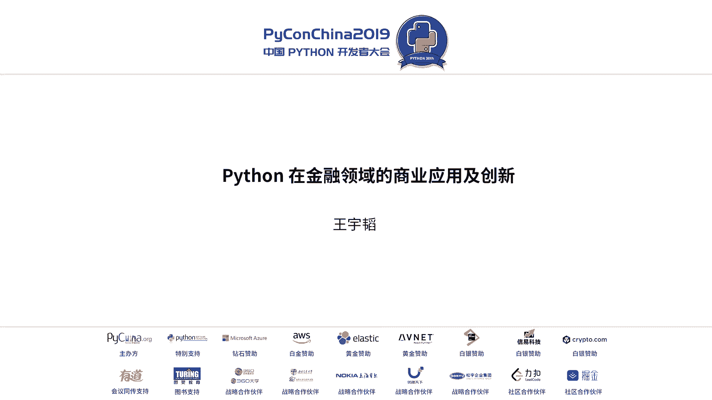
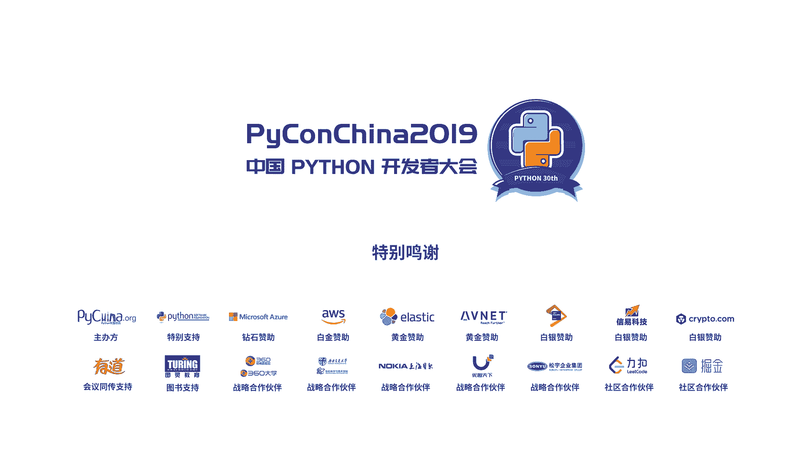

# PyCon China 2019 北京分会场 - P2：2. Python 在金融领域的商业应用及创新 - PyConChina - BV12E411Y7ze

好，大家上午早上好。那个我是来自华能信托的王宇涛。然后今天主要给大家讲一下这个pyython在金融领域的应用与创新。刚刚我听到这个崔老师的演讲啊非常专业。然后其实我不是一个专业的程序员。

我可能算然是一个非中非非典型程序员，我是半路出家，在工作中学习的。所以这个在这种实际应用中的一些应用场景，以及pyython如何在金融或者其他领域的应用场景，可能这方面比较熟悉。

但是那个具体的一些特别细节的东西，我可能就是不如在座的各位一些一些老师。还有所以我讲一下我之前做的一个就是比较呃典型的在工作一个比较有那的项目，就舆情监控系统。

然后还讲一下我们这个金融科技实验室的一些别的一些项目。好，这边我要先看一个简单的一个视频吧，就是我们之前通过这个pyython呃那个爬虫技术，然后以及一些前后端技术做的一个舆行监控系统。

这个系统等会我给大家讲一下，他在这个金融行业，它有多大的一个应用场景，以及那个那个前台的价格。这个舆情监控系统是什么一回事。就是那个你在金融这个行业，他做就两就两件事，一个是找钱，一该是找项目。

那这个找钱的话就是去找那个谁有钱去投资。那找项目就找合适的那个标的或者项目去进行投资。那这样的话，比如说你投资一个项目，比如投资那个阿里巴巴或者投资那个万科。

那你就要知道这个公司是否会出现一些负面的舆情信息。那这个的话一开始我没进这个行业之前，我觉得这好像停进来一个事么，百度上搜一下就可以了。

然后后来进了这个行业之后才发现这个一个公司会对标将近200多家项目公司。你通过人去搜其实是一个很大的工作量。然后我们先来看这个视频吧，等我给大家讲一下这个它它的一个价值。

🎼监控系统由华能信托华小智团队开发，旨在监控公司履行，做好风险预警。一、主流网站一网打尽。新浪财经、百度新闻、微信推文、财经网等多个主流平台通通九周，不错过任意一条负面新闻。2、24小时无间段查取。

通过IP带领去发件，每次查取切换新IP负面新闻出现的瞬间即可实现捕捉。3、机器学习智能评分，通过机器学习大数据分析，对每条新闻进行评分，自动筛选部予新闻，根据评分展示所需新闻条弄，一键可查看。

当分数低于发0时自动标红显示。🎼4、一键排序，点击评分栏可实现自动排序，进览当日运行状况。点击每月评分可查看当月所有页面新闻。5、监控公司任意增加，想监控多少就监控多少，只需在ex中添加目标公司。

在TXT文件中进行编辑，即可修改顺序，操作简单运行，无需设计编程办法。🎼智能预警邮件自动提醒，当机口公司登日分数跌破80分，其统自动发送预警邮件、收件人邮箱可自主编辑，为避免邮件档案。

系统还能自动整理每日预警，并可实现自动设置定时发送。🎼C多板块监控除了监控项目公司外，系统还可监控股票信息，分析股票相关运行，还可监控主流企业信息。

更多信息可关注华小智智能平台3W点华小智点com智能进阶板块。那那个网站好久没更新啊，那个这边就就不用管。🎼先我们来看一下信托舆警监控系统，由华能信托华小智团队开发，旨在结合公司预行做未来的些日子。

然后那个刚刚跟大家看简单看下那个视频啊，中间的那些很多技术。因为那个毕竟是python的一个大会，中间很多技术我也讲它的一个核心的代码实现。然后中间就是我们之前跟那个mo平台。

就是创始人这个李博金呢也坐在我们这边的第二排。然后那个回头大家也可以跟他交流，就是我们把这个代码全部发发布到那个他的这个陌平台上面，等会我可以把那个如何使用这个陌平台，以及看这个代码的方法给大家说一下。

那这边我先介绍一下这个黄源信托以就我自己的一个人介绍。然后我先说一点题外话，就是这个python或者说这个编程，它在本本行业可能竞争比较激烈。但你一旦跳出这个行业，你去金融这个行业去呃人力这个行业。

或者去那个医疗这个行业，他他有非常大的一个应用场景，为什么呢？他没人懂，你知道吧？你在你在你在金融这个行业里面，你只要会一点pyython，你就很出色，你就就显得跟别人很不一样，你知道吧？

然然后然后然这像你你的那个特色，你就能发挥的非常好。你就很大的一个叫在金融学里面大到比较优势。那在这个IT这行业里面，你你无论毕得学的再好。那在那些大厂里面永远会有比你更好的。

你永远不可能说是那种很脱类拔萃的。但你如果在一个另外一个行业，那你可能就是你只要会一点点，那你觉得比较优势，非常强大？😊，好。我来讲一下这个我们公司啊，我们公司叫华能信托。

它是那个华能集团下面的一个金融子公司。华能集团的话，大家如果可能比较了解，就是那个中国亚洲最大的一个电力集团嘛。然后我们这个是做信托的信托，大家其实我没金这个行业之间，我也不知道信托是干什么的。

后来我才知道其实金融就是件事就是资源的整合匹配，去找钱找资金。那这边其实对的就是信托，就是一个本源的大家可以容易离业的业务，就是那种价族信托。比如说你是个副行，有1000多万或者几个亿。

那你想把这个钱进行一个投资，那就找找我们公司进行一个投资。然后我说金融这个行业，就是我我之前跟他们讨论过，就是目前以后会有很大发展的四个行业，一个是金融，一个是IT一个是会说科技，一个金融，一个科技。

一个是医疗，一个是教育。那这四个行业是未来必然的一个发展趋势。那金融这个行业我要解释一下为什么是一个暴利或者有很多发展前景的一个一个趋势。因为它是一个他他离资金最近。我举个例子啊，像我。做很多项目。

他那个资金量动辄就几十亿或者100亿。那大家对这个100亿这个概念可能不是很深。那举比如说大家对那个银行的活期利率是3%。那比如说你100亿，你放到银行里面一年你啥也不干，那你就赚3亿。

也就是说你一天啥也不干，你就赚赚300多万。那这个其实这只是举个例子，所以说为什么这个金融这个行业是个暴利行业，就是这么一回事。那其实如果你能把这个IT或者说技术与这个金融相结合。

那产生的这种效应是指数指数增长的或者IT跟教育相结合。这个大家可能那个不是不太了解，像我之前跟出版社的合作，他们说现在那个编程在什么领域最最最应用最广泛或者获利最多，他不是在这个系统开发，也不是在这种。

但但是这肯定是必须啊，他说在目前在中国有个有一个行业是非常非常南海，是一个呃非常有前景的，叫少儿编程。但是这回头可以跟大家讨论啊，这个其实因为大家普遍就是家长会比较焦虑。然后那个孩子可能还不焦虑。

家长已经很焦虑了，所以就让孩子学这些东西。那这个先不提。好，这个是公司的一些简单介绍，我就不不不多提啊，就是那个回头有兴趣可以来了解。我，就我个人的一个介绍，我是那个上上交本科，然后兵大硕士。

然后我虽然是从事这个金融这个行业啊，但是我本本科和硕州学的是工科，但是我不是学的编程，我是学的那个机械与动力工程。但是很多东西跟编程是相关的。然后这个是我在我们公司创立了一个叫金融科技小组。

然后是大家你面的组长。然后那个中间还写了一本拍on金融相关的书。然后就就这本书除了我要到那个最后面大家感兴趣的，可以去看一下。哦，然后再跟大家说一下。

大家因为可能是呃有的有的同学或有的那个同事或者对金融比较感兴趣啊，就有几个证大家可以如果感兴趣，可以考一下，叫CFA或者FRM或者那个还有个国外比较知名的一个叫CPAA就是注注会。

然后CFA是那个金融特许分析师FRM是那个呃风险分析师。那大家就是对金融感兴趣的，可以去了解一下。好，然后之前主办方也跟我一直说，就是这个top easy兄弟的 code。

就是说那个尽量还是讲一些代码的东西。然后这边也给大家简单就。我我把我把详细的代码已经放到那个平台上面了。等会我跟大家讲，如果去看这个平台，然后这天我讲一些核心的一些理念。其实这个的这个舆情监控。

它主要分这么几个模块。我这边以百度新闻为例啊，就是你要去网上监控这些公司，它主要就分6个板块。你首先需要爬取到这个舆情的信息。第二步，你需要对这个信息进行一个清洗及优化。第三个。

因为你是要进行一个上百家公司的不间断爬取，所以你要实行1个24小时不间段爬取。当然最后一个你还要第四个，你还要进行一个舆情评分。比如说有一个这个新闻进来之后，你要进行一个处理。

你要知道它是一个负面新闻还是正面新闻。那再往后延是来说，你需要知道这个负面新闻，它是多方负面。比如是-10分是-100分，那这种都都是不一样的那这样你新闻爬取跟评分之后，你就需要去进行一个预警。

比如说你是做项目的，你是一个投资经理，你需要知道你的一些项目到底发生什么问题了。比如说这个这个舆情预警系统。就就回我刚刚那个话题，为什么这个很重要？😡，你1个100亿的项目，你如果出现问题了。

一天就是300万的损失。如果你没有及时处理的话，一天就是300万的损失。所以这个退对金融公司来说是很重要的。像金融公司它管理的规模动辄就是几千亿。那你如果这个当然不可可能几千亿都出问题啊。

但你如果如果中间有一个环节出了问题，你没有及时反馈。比如这个项目出问题啊，你没有及时去处理结果导致这个项目一天亏损几百亿呃几百万，那其实对公司来说也是很严重的。

像一些好小的创业公司可能一年的营收也就几千万。你那个亏损几百万，其实对一个公司来说是很很可怕的。然后那个第六个就是那个你在进行爬升的过程中，可能会遇到一些那个反扒，这个其实就是比较偏技术一点啊。

就是那个这个是也是爬成一个比较需要克服的一个阶段。但是对于我们这个金融领域啊，就金术一个好处，就它不像那种专业的技术公司，你不需要做太多的反扒。很多公司很多那个网站可能他没有这种反扒比如说百度新闻。

它没有反扒，非常好爬。而且你爬百度新闻技术上你能实现90%的一个一个爬行的一个需要，你要爬些。😊，微信可能麻烦一点的，微信的信息其实没有那么重要了。当然这个IP反扒等会我也讲一下如何来实现。好。

那个大家如果是对爬虫有一些了解的话，可能就对这几行代码完全不陌生啊。但是如果就是对爬虫不了解，我就讲简单讲一下，就你通过四行代码，你就可以完全实现这个爬虫，就四行代码，本就三行代码。

最后一行是print，然或者两行代码就是request requestquest那个get一下就可以了。然后这样你就可以获取到这个呃就是python的一个首页，你就可以获取到python首页的一个哎。

这个这个可能在后面吧，等一下。哦我先这个PPT上可能没没放上去，我先说一下这个平台啊，是那个mo平台。然后那个我是把它放到这个mo平台，其实有点类似于那个国外的giub。然后它它有个好处。

就是说你可以在线去那个那个运行以查看代码。而且他用那个搭的。然后就是你查看起来会比较方便。然后你进过这个平台之后，你可以注册账号，然后点击上，然后点击这个最新发布，但可能我刚看一下，已经被挤到下面去了。

然后就是在这个有叫华小师拍成金融的一个这么一个内容。等会我会那个通过网页给大家看一下，这样大家可能更更方便。我最后再给大家看这个如何去网上走这个现在讲的时候就不给大家说。然后在这个领域你可以看啊。

就是左边这块就是那个你点击那个右边fo，你就可以把这个相关的一些代码给直接fo到自己的那个账号上去，然后你看到这个舆监控大概是怎么实现。这边我们又写的特别详细。因为那个时间有限。😊。

然后这边你看它这个非常方便的地方，就是左边是这个呃那个拍点文件，然后右边就是相应代码，你就可以直接在这个平台上运行。好，然后刚刚讲完的那个是四行代码，实现的是。那个thon官网的一个爬虫。

然后我们讲一下这个百度的这个爬虫，那其实非常简单，就多了一行代码，就多了一行代码，就多了这个ers加上这个就是agent。就是你你模拟这个谷歌浏览器去爬取这个百度首页那就可以了。

那这边这边就是简单讲一下，就是你在这个quest requestquest这个函数中你加入个，然后把相应的这个代码直接抄过去就可以了。然后这个代码也是发布在那个平台上。所以大家可以到时候直接看一下。

然后所以它讲的一点，就是说你首先爬虫的第一步就是爬取这个网页源代码。而爬取网页源代码，对于大部分网站来说，通过这几项代码就完全可以实现爬取一个网页源代码。

你可以把这个就是这个网址换成任意一个正常的一些的那个网站，不要不要找微信推这种比较复杂的网站你找个新浪财经啊或者找一个搜狐财经啊，就非常方便把这个信息给爬下来。好。

你看呃这右边就是相关的一些呃百度新闻的一个查取。等一下，我看一下啊。就是你你看就是最最呃右边最上方那几行代码，就是爬取它的一个呃正文，就是他所有的一个网源代码。那下面就是正则表达式。

大家如果是呃接触过的话，应该都比较了解。就通过正则表达式来提取这个呃新闻的一个标题网址以及它的一个呃来源日期。那这个其实爬出里面除了正则表达式有很多别的方法，比如通过一些库。

而其实我们后来发现正能表达式是一个叫做一律详实会的东西。你任何文本内容拿过来，我都可以通过这则表达式进行一个提取，没有必要搞了一些花里胡哨的花里胡哨的库。然后后后来那个那个就是你爬出来这些内容之后。

可能这些比如说。给大家看一下啊，就是你通过这这代码我也放到网上了。然后你你直接运行的话，就可以获取这么一个结果。那其实这个对于企业来说已经够了，你知道吧？虽然你看我就通过几条代码。

我就把这个企业需要的东西给给他搞定了。然后你知道这个有的有的技术公司卖给这些企业卖多少钱了。他他卖给他其实我觉得这这个技术公司也是这信息的不对的他卖了卖到一年期位数，一年期位数就是100多万。

就就卖就卖这几个代码，但是他包装一下，包装了一个UI包装了一个界面，然后包装了一个系统。但本质的核心东西就就把这个就把我爬到这些东西卖给那些企业，就就这么一回事。😊，对。

然后那个就是刚刚说那个智能表达式的一些东西，智能表达式我这边就因为并不是讲课啊，所以我这边不详要讲解，就是它的一些核心的代码。如果爬这个新闻的来源，尤及它的网址，我就直接放到这个PPT上面。

然后在那个网站上也公布了。然后这个就是呃如果清洗这个标题啊，以及清洗一些无效的信息，那就通过以下的方法，或者通过一些常见的一些函数，这边我也不讲太太详细。然后这个也是清理的一些方法。好。

然后讲一下这个就是第二模块，就是你爬取到这个信息之后，或者清洗完之后，你需要进行1个24小时不间断的爬取。当初我刚学判摄的时候，就好像24小时好像很复杂，后来学完之后发现很简单，你写YQ就行了。

YQ直接刷刷刷一直运行呗，24小时实现了。那很多技术公司吹嘘我24小时不间断爬取不就是YQ吗。然后那这这个可能就是有点粗暴了。那其实你要写的那种更智能一点，你就写一个schedule函数。

然后定时比如说每天9点开始爬，然后爬完歇一个小时，爬完歇一个小时，那就那也可以。😊，那这样就其实对公司来说歪去就够了。因为他爬完一次需要一个多小时，你让他休息一个小时，他一天能爬将近12次，对吧？

他12次其实你基本上网站的信息都能获取到的。下面讲解一下这个舆情评分系统啊。那这个在讲舆评分系统之，之前得讲一个数据乱码。因为你需要根据这个新闻的这个正文来进行一个语义分析啊，或者说继续学习啊。

或者说最简单的方法关键词那这个有个东西叫数据码。那其实编码这个问题啊，对于那种可能对于一些大流来说非常好理解。但对于当初我这个编成小白或是我我我估计浪费了十几个小时在上面。

我都没搞明白这个编码是怎么回事，后来发现有个非常简单的方法，你就因为他那个主要中文编码就两个嘛，你可以优先杠81个GBK你就把它们通过这个两种编码解码方式，你就exc试一下。

然后你都不用去不用去管它到底是什么一个编码方式就试一下，就直接把这解代码复制粘接过去。基本上目前没有发现不能解决问题，基本上网站出现乱码都能解决。就通过个ex函数。

你就试一下GPK或者U杠8就来把乱码给解决。好，然后我讲一下这个舆情评分啊。当初那个呃我们跟同同事讨论的时候，觉得这个舆情评分好像很难，那怎么评分呢？那后来发特别简单，就是你不需要做一些什么积极学习。

就是我们对外去宣传的时候，我们讲机器学习。但其实那个那个其实你可以用机器学习，做一些那个自然言处理，后来你发现你通过这种关键词的一个一个就那个呃itle如果在这个关键词列表里面，你就给它扣分就行了。

比如我们这边有个那个QOS列表，然然后你看到那个比如说这大家不要啊，虽然这个很粗暴，但是很有效。然后你看它有违约诉讼这后面几个词是我要显示它能扣分放上去了，其实他不应该是这个这种词啊。

比如说只我自己有个词汇有将近有将近100多条就是那种在种领域可能会出现的那种负面词库，然后直接就是你都不用写别东西就写个列表，然后把那个面词放进去。然后你去检测这个这个标题里面是否。😊，还有这个负面词。

如果还有这个负面词你就给他扣5分，如果还有两个就扣10分，扣有三个扣扣15分。那这样的话基本上基本上一个新文就给他打分了。这个其实挺有效的。然后你如果觉得这个方比较粗暴。

那另外一个比较有效的方就是说你那个进行一个权重。违约就扣10分扣5分。那这个是第二种第三种这还粗，你可以写个继续学习后那个标根据标题，那下面就根根据那个标题正文那这个刚标题我给简单看一下。

就是你看就是看你这个说里便利个标题，然后那个这个K if这个违约词在这个里面那就扣就这条标题以及这标题对应的新就扣分然后你创立一个空列表，然后把这些那个分数也放。那这个根据标题评分。那这个简单了。

后就是那个因为很多标题里面写的比较模糊。那那可能你并不能去进行个合适的扣分那这边就版本2，就是你可以根据这个标题。进行一个联合扣分。那这个就是你排除它的一个。因为你刚刚我刚刚给他展示的。

你可以爬取这个新闻的UIU，那你可以就可以爬有UIU，就是你就可以去排除这个新闻的正文。当排除完正文之后的话，你就可以把这个正文里面的文本进行一个解析。那刚刚我讲一个就是那个数据代码的处理方式啊。诶。

这个当时做的时没做PPT没做进去，就是你可以把刚刚处理乱码的那几行代码给放进去。因为这个正文你不知道它是是不是乱码，你把那个tract函数的那些乱码的一个代代码放进去。那这样的话正文你就获取到了。

然后这个代码我都会放到那个货平台上面，回头跟大家演示一下怎么怎么看啊。然后这个就就最后一点的话是那个过滤不相干的新闻。就比的时我们当初这个是核心的一个一个点啊，虽然这边也可大家讲了。

因为其实我在书上也经讲了，所以所以其也也不怕就是在PPT上给大家讲，然后就是因为有的时候你去爬新闻的时候，你会发现里面很多这种推荐新闻，比如说什么那个以色利又打仗了，或者说美国又违约啊。

这种这种这种这种推荐行闻，里面很容易出现负面词。那这样的话，本来一个新闻比如说去夸阿里巴巴，说阿里巴巴有什么科技创新。然后后面有一个推有个推荐，说那个美国又又打仗了，然后结果给扣分了。

那其实这个阿里巴巴躺枪了嘛，对吧？所以就我们就写了一个就是一个非常精精巧的一个方法就去屏蔽这些推荐新闻。就你发现发现这个正文啊，他是写在这个。😊，系。哎，这个这个这个PPT这边截错了。

他我这边家口口口述讲一下，就是它是截在那个它是有个标签，是P标签。大家如果写过前端就知道，就是多诺是写在P标签里面的那我只需要提P标签里的内容，那就是新闻的正文内容。

但是这样就可以把那些推荐新闻一些滚动的那些那个那个那个那个内容是写在list标签里面是LI标签里面，所以你把就可以把那些东西过滤的。哦。然后下面我来讲一下这个舆情预警系统啊。

那这个当初我们想做这种所谓舆情预警，觉得很难，就怎么怎么实现呢？我发现也很简单。拍有个库，你看不到20行代码，你就可以实现一个自动发邮件的那个功能。那其实在java或者C加加里面也有这样的库。

但是我我看过写几十张几百行，特别复杂。那这个这个拍的就非常简单。这个我给大家演示的是1个163邮箱的一个自动自动发邮件。这个代码呃或者那个密码以及那个账号啊，这个代码单我我发平台上面。

大家都拍到也可以直接拿回去运行，或者直百度搜搜一下这个派自动发邮件，基本上就能实现。😊，然后这个其实就呃舆情预体系统来说，对企业的问题就到这一步来说啊，对企业来说就已经够了。

因为他需要看到就是每天看到一份这样的邮件。好，下面讲一下这个爬虫或者说这个云新电融系统最后一个技术难点啊，就是除了百度新闻之外。

还有一些别的一些这种这种网站我们也是需要的那这个的话比如说像那个呃比较重要一个平台叫微信推文。它对应的一个网站叫搜狗微信。然后它里面涉及的就需要一个IP代理。

那这个IP代理就是你要通过不停的切换IPIP10来进行一个一个那个。嗯。IP伪装。当时我自己去拍的时候，在网上开一下网课，那些老师为了扩充这个课程量，花来将近三两个小时讲这个IP代。

后来发现这这真挺扯的，两分钟就能搞定。四行代码四行代码搞定IP代理，不需要两个小时自己搭配IP代理是，就我们我们我们金常追求效率，我们不追求所谓的什么什么那种搭IP代理是做一个服务器，太麻烦。

然后然后然后就你去去那个买这个专买买IP代理，然后把那个把那个代代码直接放到上面就可以了。然后这边这边核心代码是4好啊，就是应用的时候还是得看一下，就是那个我我放在陌平台上的一些讲解。

然后然后具体来说就是。呃，这边没有写到PP上面，就是网上有那种专门卖IP代理的。他那个好像是9块钱1000个IP也就刚才说0。00。009就很便宜。

就能买到1个IP那差不多我花了200块钱用了一年半没用完。他其实你比做个服务器好的很多。然后另外一个反扒的手段就是有的网站，它是通过那个S渲染的。

你直接通过传统的request库是没有办法获取到那个那个网页的源代码的。然后这边有一个非常好用的库叫库。然后这边少打了个E啊，就是第个没打错就是那P少打了个库的话，他是那个非常好用那库。

他可以就是你你只要这个库常强大，就我跟我们领导说，领导不懂I嘛。但我跟他说就是说他非常高兴，就是我说你只要在网上能看到的东西，我都能给你爬下来，那那那怎么实现，就是通过这个库你只要在网上看到的东西。

你就可以通过这个库。我再给技术技术分享，我给大家讲一个我自用非常好的技术就这个网站里需要登录，然后你需要去输入一些手机验证码，那传统的方式的话，你是通过就很复杂，你得设计什么写啊写啊，就特别特别复杂。

那你通这个库，我给大家讲个技巧，你通过这个库模拟登录这个网站之后。😊，你手动去登录一下，然后你就别退出，你就可以一直爬这个网站来信息了。😡，Right。然后这个就是2019年1月20号。

我们那个这去年开发的一个产产品啊，然后获得有这个中国出版社的一个软件著作权。然后这是我们未来的一个发展方向，就想把这个系统做的像一个sas牌sas牌那个saras我打错，好像少个A。

然后然后这个那个那个那个人工人工智能在升级，然后多系统融合。所以这个回头回头我们我们再再再再沟通吧，这个就就不提了，就是这个这个系统我们打算做的就是更商业化一点，但是我们不想卖那么贵。

就是那个那个外面的公司卖的太贵了。然后我们讲一下这个黄老机这个技能配计实验室啊，就是我们除了这个云件和技求，我们还做了一些别的项目。😊，那这第一个就是我刚才说跨行业嘛，就是这个你跟别的行业进行沟通之后。

IT的在别的行业里面发挥一些更大的作用。那，比如说这个环岛就是面试宝就是跟人力行业相结合的。资金雷达是跟那个财富管理团队相结合的。大数据风控是跟这个风控行业相结合的。然后RP自动化在任何行业都可以用。

然后智能答机器人也是在人行业都可以。然后语音助手的话，其实就是这个其实没什么东西，这不是我们自己做的，这是我们用的数据的接口。然后我们搭建了一个做为1个ESD。😊，然后首先看一下这个面试宝啊。

这个大家可能不是很关心。那我简单讲一下，因为这个对人力行业来说是非常重要的。就是大家去面试的时候，大家可能都是通过这个邮箱啊，然后别人面试官进一个微信约你，然后在微信在面试。

然后再约到那个大厂或者厂里去面试。那，其实你可以就是通过先微信，大家不道这边有个腾讯的。O好像没有。然后就是那个通过微信小程序的话，你就可以非常方便的进行一个调动手机摄像头，然后进行一个面试。

然后这边我给大家就是大家可以体，如果感兴趣可以体验一下。就是以后我觉得们家可能这个趋势在国外已经用的非常常见，就是扫一扫这个二维码，你就可以体验一下这个就是微信扫小程序是如何进行一个这样的一个机器面试。

我给大家简单有有机会给你扫一下。他使用起来非常傻瓜，非常方便，而且觉得非常节省时间。而在国外跟大科普下去有的时候，大家就是埋头做技术，可能忽略外面一些很多业务机会。

就是在国外这个就专门有一家公司做这种所谓的机器面试，他估值是几亿美金。然后他吹嘘从行业，比如说证券公司，或者说那个信托行业或者保险行业。那现在干才都是一个事，就是借钱跟借给别人钱。

那其实比如说那个信托他就是从那个有钱人手里，或者从机构手里，把他的一些闲钱给拿过来，然后去投向一些需要钱的一些大型的企业，比如说那个万科啊，或者投向那个像比如说阿里巴巴有那个蚂蚁蚂蚁花呗跟借呗。

然后腾讯微信上面也有那个未贷。唉，好的好的，然后那个那个其实他这些钱的话，都需要从金融公司去进行一个借款。那我们就可以通过这么一个手段。然后这个资金呢就是通过网上可以去找到这些。😊。

这些那个需要资金的一些人的信息。那如果实现的话，是通过一个爬虫以及RP的技术。然后这边主要分享一些这些一些概念啊，就是因为时间有限，我这边就不详细讲解了。然后这边就是一个跟大家可能比较关心的。

就是学习在应用，它其实是有应用。刚我说在云监系统里面，好像是我说是一个噱头。但是在真的大数据风控里面，用的都是学习。比如说那个大家熟悉的逻辑回归啊，以及决色术。然后这个实在那个很多互信公司。

互联网金融公司他用的非常多，然后这个是常简单一个决色术模型。这个为什么我可以演示这个东西，这个老板能看得懂。你说吧你你你给他演示看不懂这个东西他就能看懂从最上面的一个节点一级一级往上延伸。

但是这个是个只是个演示，实际上并不是这么简单。😊，然后大家如果是学几学就是说它并不复杂，就语言你可能比较复杂。但是实你如果用的话不复杂，他调用库就行了，就三个代码。

三个代码就可以进行一个决束的一个一个一个实现。三个代码不复杂。然后就是RP流程自动化，就是你可以批量的爬取，就就人能干的活，就流动化的工作，机器都能干。大家如过以前玩过游戏啊，知道有一个软件叫按键精灵。

然后现在其际大家不用那个就拍on就可以实现这种模拟金玩鼠标操作。然后你就可以进业如人人人人人人从事你该的工作。我再给大家讲一下，这个就是从技术角边上，很多公司就有些咨询公司就包装这个技术。

然后去企业销售，你知道卖多少钱嘛？就包装一个，比如说他去批量爬去网易流水，然后进行一个自动的excel对账，就很傻瓜一个功能。那技术公司不懂卖40万，400万一次。然后一个公司卖一家。

他卖卖一1家就400万，就卖这个东西，你知道吧？所以就技术包装很还是很重要的。😡，那这个就不简单讲，就就是个智能达机器人。这其实是个市面上这种你就给大让找这种技术很常见。

就是通过一些语义分析可以自动回复一些答案。那其实我们后来想了一个最简单的方法，你设置一个两两列，左边是问题，右边是答案，你设计几百万问题，那后面几百万答案，那就就实现一个所谓的人工智能了。😊，Yeah。

一一。嗯，然后这个就是语音语音助手，这个这个其实就是这个调序练接口，这个我就不详细讲，然后我包装成了1个EXE。然后这些外化金融就是通过股票以及这个其实这是一个我们未来想做的一个核心的一个发展方向。

就是那个通过这种股票的一个信息来获取一个合适的交易机会。然后就是我自己写一本书啊，那我这边写书其实并不是小说小说就是一个写书其实并不挣钱，一本书才赚3到5块钱。

但是你写说我做就大家如果有时间都尽量自己能写一本书。因为这样你出去，如果谈业务啊，或者去做交流，你把一本书送给那个对方人，那中国人吧他他可能不会看这本书写什么东西。但你给他一本书时得你很牛逼。

他就得要书作着，对。😊，然然后这边我们目前还有几本书，就是那个五本书，我们跟出版人聊了5本书。然后其实我自己一个人写，有有的时候忙不过来。然后大家回如果有兴趣的话，有时间的话。

最好是学生的工作的人可能没有那么多时间。但如果是工布有时间的话，也可以跟我们一起写，然后到时候也可以背一个作者，就者放一个像我下面就挂三个作者，其有两个作者，他其实啥也没干。

他就到时候学便有说随便学员说要帮我或少忙。然后我说给你们钱也不合适，就给你们挂个作者然然然后这边的话就是那个还要还有4本书吧。然后未来我们还要写很多书，就比如说少儿编程啊，或者说那个拍个办公。

那大家如有感兴趣的话，我会会会留我的一个联系方式，大家可以到时候进行一个沟通。然后就是那个除了这个脚踏实地，我们还仰望星空嘛，就是那个。😊，我们我们我们金融公司有一个东西叫做慈善信托。

就是那个你可以把智能钱去做一个慈善。就是其实呃无论是你是做金融还是做IT可能都会有一些特别是做IT，我觉得可能更会有一些这种学术的追求，或者说那种社会的责任感。那这种其实我们其实也是想往这方做。

其实我们目前的很多这种营收创说，比如说说稿费啊，最都进这个慈善信托的，就是通过这种呃教育就是科技啊或者说知识的东西来促进这种教育扶贫啊。因为我们注册地是在贵阳。所以我们这个所有就获得收入。

就目前来说都去进行贵州的一个教育产业的一个扶贫。那口号就做制精准扶贫。就通过一种这种知识来进行一个知识的一个二次宣传与科普。然后刚刚这个大家等就我联系方式。

然后大家感兴趣可以加我一个这个这个左边是我的个人微信。然后右边是我对快完了，然后这个这个就那个那个就是我那个教育群，其实我们有大群。但是因为那个大群没有办法直接投给大家，因为他是超过100人。对。

就是在大家可以扫这个群，然后里面是我的那个实习生，然后那个大家可以到时候一起进行交流。然后然后那个哎工作人员帮我上来演示一下那个就是录平台，我给大家看一下如何使用。哎，先先大家再扫一下吧，先稍。

然后如果那个没有没有，拿有什号码，可以问旁边朋友去要一下。然后那个我们到时候反可以进行一个互互相的沟通啊。好，我们退出一下。我们我们演示一下那个网站，我这边就结束了，这个是吗对。

这个网站我是我觉得是国内做的还是比较不错的一个平台。诶，等一下。Okay。就直接在这里可以用吗？啊，可以，你把把对。那全屏。啊，可以可以。然后这个它叫mo。

然后但是我觉得他们可以把这个百度百度推荐优化一下，我搜了好几次，才搜到他们这个百度上搜了它。然后就在这个moAI这个平台上面，然后你点进入之后，然后给大家看一下，在这个项目里面。然后在这个最新发布。

但我感觉这个最新发布马上就会把我这个给挤下去了，就在这个地方。然后大家点击一下。然后代码全在这，然后代码全在这，然后我还配了一些讲解啊。但是这很多内容其实那个数量讲的更详细啊。因为这我做了两天。

很多东西没放的太全，然后大家点这个fok，然后就可以进行把这些代码权给拿过去。然后比如说刚刚讲了这个量化金融，他有个库可以调这股票数据，非常方便。然后这个是到时候去分工，然后大家也可以进行一个一个查看。

然后我要讲的就这边，然后时间有限啊，大家回头可以微信我看刚主办官已经跟我说没时间了，然后这边就不做这个KA，然后大家那个回头有兴趣可以在微信上进行沟通了。这边就讲到这边可以。😊，呃。

我们还是两个QV的问问题时间。然后大家那个有问题的话，举手，然后我们的场下主持。这边。你好，呃两个简单的问题，一个是你这个就是云经系统，他的现目前主要的客户是哪些。然后还有一个就是呃这个就是。

系统这个效果是客就是客户怎么评估你们这个就是你这个系统效果，或者是还是说你们自己有什么评估的方式。这个这个于新天系的目前就是我们开发主要目的并不是出去销售。我们目前主要是给我们自己用自己项目公司用。

然后它主要监控的公司并呃还不是来自银行，主要是来自于比如说你你你我们跟阿里巴巴有合作，我们跟腾讯也有合作，跟那个万科跟多地产公司跟政府平台都有工作。那我们就需要监控这些政府平台，或者说举个例子。

就我们以前做房地产的生意，就现在不怎么做，国家不鼓励嘛，以前做房地产生意，我们就爬取这个三全国头部的30多家城市的这种房价，然后看每天有没有负面新闻，然后虽以那那就到第二个问题，如果评估这个效果。

那其实就是我们有业务部门同事他们每天去看看这个就是看那个邮箱，他就看这个比如说是不是有有一个负面新闻给他触动他神经了，然后去进行一个处理。那比如这虽然说北京的房价就举个例子，但没有出现北京房价大跌。

但是北京的房地产项目都需要去跟那个领导去汇报一下就这么一回事。就就这么一个功能。然后比如说再举个例子，像那个我之前给我们卖给一些别的新的公司，他们那个公司会有那种就是公司里面会有有有个。

董办董董事会董事会秘书，他们就会很关心跟自己公司出面有没有出现这个负面舆情。然后出现之后，他要说第一时间去那个去洗地，去那个去找媒体，去把这个给洗掉。啊，就就就是他能收到这种邮件，对他们就已经很重要了。

然后然后就是尽两回呃这两个问题这么我觉得就这么回答啊。对谢好，然后还有其他同学要问的吗？还有吗？啊OK。就是关于这个。你说。一个新闻里边，他说本周的新闻，然后说北京房价平稳，湖南房价大跌。嗯。

在你们的关键词匹配里边，你们如何把北京同这里边安全的过滤表推给北京的业务同学？这个我们是考虑过，就是他有一个非常方便的方法。但是这以后呢我们就否定了，我先说解决方案。就是说北京房地产大涨。

然后深圳房地产大跌举这个例子，它是分肯定是分一般来说是分在，就可能说一边夸一边骂，所以一般就分在两个段落里面。那刚才讲过了，就是这个段落是通过这个杠P标签来进行一个包围的。

那如果我发现北京这个关键词我就找他这个段落里的信息是否出现负面词，然后进行一个评判，你就不管下面段落。但后来我们发现这个有缺点，就是对于业务人员来说，我希望看到的是更多的新闻，哪怕是无效的新闻。

我不希望过滤到可能对我有潜在风险的行为。所以我后来把这层看的判给删掉了。因为我觉得就算看到一条深圳大些新闻可能对北来说也是有影响的。那全部的I北在涨。那所以这个这这种新闻我们也是给留下来。

就这种逻辑我们后来这个是可以实现的。但是我们后来把这个给砍掉了。因为因我希望就是你看到尽可能多可能会存在着负面的新为。

