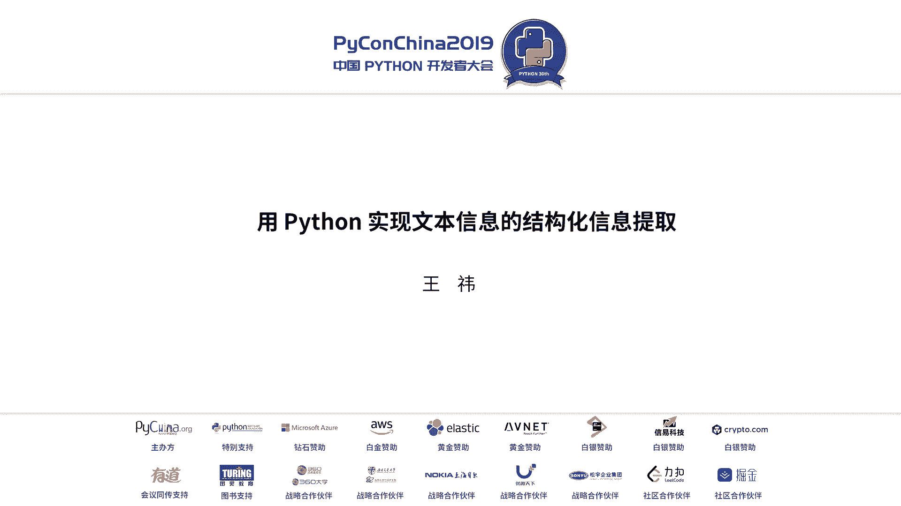
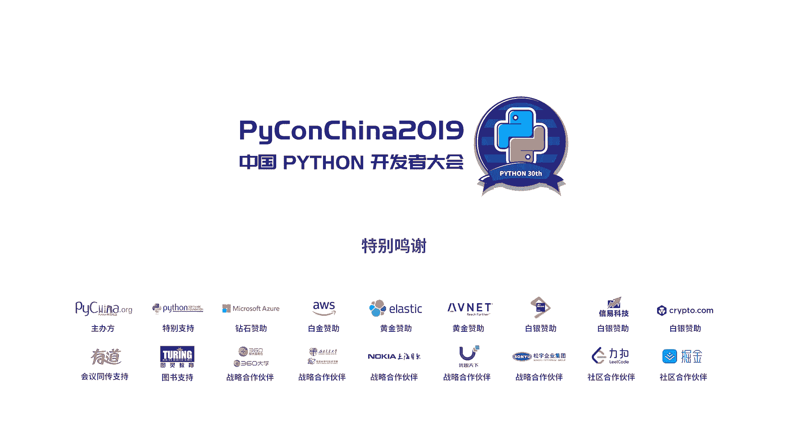

# PyCon China 2019 北京分会场 - P3：3. 用 Python 实现文本信息的结构化信息提取 - PyConChina - BV12E411Y7ze

hello大家好，我是那个呃来自托尔数据智能团队的咨询师。呃，我叫王一。然后今天非常荣幸的能够来到这里，然后与大家见面。然后刚才也是听了了两位老师非常精彩的这个嗯演讲。

然后我今天带来的话题呢是叫做文本的结构化信息提取。呃，在在开始我们这个话题之前呢，我想先给大家一个呃先让大家想象一下，现在呢我们是来自于呃，我们现在是一群来自于某个电脑公司的这个IT部门的员工。

然后我们是直接对接于咱们公司的这个业务部门。那现在呢业务部门给我给了我们这样一个需求。那就是他给了我们这样一个文本的这个样例。Okay。嗯，这样一个文本的样例。然后他希望我们呢能够呃告诉他们这种文本呢。

他是否与这个咱们公司的这个业务相关。如果相关的话，他希望我们能够从中提取出来这个招标的这种编号，然后采购的这个目标预算单位联系方式等等信息。这样的话呢。

他们通过这个信息呢就可以去节省他们这个业务人员的时间，能够快速的去发现文本中的这个呃业务的这个内容，然后他们就可以去进行跟进，然后来提升他们的效率。那我们作为IT部门，我们要怎样去做呢？

那其实我们就就需要使用我们今天接下来会用到的这个分享，就是我们这个文本的结构化信息提取。呃，这个是我一个简单的这个目录，我们会大概讲一下这个是什么。然后我们怎么做，以及我们最后能够去提取出来内容之后。

我们要将它部署成一个服务，然后上线给业务部门去使用。诶。嗯，首先呢是关于这个一个简单的介绍。啊，那么什么是这个文本的结构化信息抽取呢？那其实就是我们将这种非结构化的文本来抽取出来。

它里边的这个结构化的数据的这样一个过程。呃，就是我们的这个结构化信息抽取。那这个是一个很简单的例子。那就是这个是一个千岛湖的经简介绍。然后右侧呢是我们抽取出来的信息。那其实我们在读的时候就会发现。

其实对于我们人来说能够很好的去理解这样一段文本。但是对于机器来说，它可能并没有办法很好的去理解。像我们平时呃在在我们服务中都会使用到数据库。那数据库里面它就会有一个一个字段的表。

其实这种东西对于机器来说，这是他的语言。那我们需要去进行处理的时候，我们就需要将我们人类的语言翻译成机器的语言才能我去做更多的自动化的这个信息。所以呢我们就需要去用到这个结构化信息抽取。呃。

所以这个其实就是我去呃我们可以用呃用这个结构化信息抽取做的一些应用。那我大概列了这三点，其实主要就是说我们是可以去通过抽取出来的内容呢，去构建一个这个领域的这种知识库。然后我们就可以在此基础。

上去实现这个智能的这个服务，包括去进行这个呃垂直查询之类的这些。然后像刚才我们给的最开始给大家的这个场景呢，它其实就可以辅助我们去进行商业决策，然后抽取特定的这种目标信息。

然后来做一些我们商业上可能需要实现的东西。然后包括我们抽取出来的这个结构化的信息呢，它可能也是我们去做这个智能服务的一个基础。我们可以以这个为基础来实现这个信息检索问答系统、情感分析这些应用。嗯。

那我们知道了这个要做这件事之后，那我们怎样去做呢？这个我们可以去做一个简单的调研。那这个就是我们调研的结果。就是我们有这样，首先可以分为两大类的方案，一种是传统的方案。

一种是我们现在比较流行的这个深度学习的方案。那传统方案的话，我们最基本的呢，它可能就会基于这个基呃规则的这种方法，那可能就会去构建一些领域的字典。然后包括我们可能会去做正则。然后那除了规则的方式呢。

因为这个规则的方式，它本身我们会需要这个领域专家，而且呢也会比较耗费这个呃时间，然后它的迁移性也比较低，整个成本都会很高。那我们可能就会考虑到我们会使用这个机器学习的这样一种方法。

那我们首先呢就会有无监督学习的方法跟这个有监督学习的方法。那无监督学习的方法呢，主要是使用聚类。那这个的话呢，其实现在呢呃它的这个其实准确率并不是特别高。那我们之后呢还有就是会使用这个监督学习的方法。

然后呢呃这些的话呢，这几种方案，其实呢都有都是有人去做过实验的。然后嗯都可以使用。当然CRF的这种方式是最好的一种方式。然后我们之后呢还有这个深度学习的这种方法。那深度学习的方法呢。

这个是一个很简单的这个呃一个呃从输入到输出的这样一个过程。那我们文本输入之后，我们就需要使用这种呃就是已经训练好的出来的一些这种向量来去表示这个文本之后呢，我们需要去对这个文本进行一个训练来抽取出来。

它里边我们认为呃机器人为它有效的这个特征。最后呢对这个它的这个结果呢进行一个输出。嗯，然后其实呢最后我们就会发现呃虽然深度学习这个方式是目前来说用的呃最先进的一种方式。但其实在我们之前的项目里来说。

我们其实使用了规则的方法，与CIF呃这两种相结合，这个呢是由于我们当时是有这样一个需求，就是说我们当时需要抽取出来的一个内容是我们这个文本它是属于那种状态。那这个。状态呢它其实是相当于是一种分类。

但它又就是很难从这个里边直接得出来这种效果。那但是业务部门呢就提出来说，那这里边有其实呃这里边所有的这个都有一个字呃，有一个那个关键词就可以提取出来。它是哪一种哪一种呃哪一种状态。

那我们其实就可以直接使用规则的这种方式来进行推理就可以了。然后之后呢，除了这个以外，其他的特征呢，我们都都都使用CIF的方式来进行这个提取。嗯，这个也是由于我们当时数据量并不是很大的原因呢。

我们就使用了这种方式，当然我们后期呢有了一定的数据量之后，我们也使用呃也一种方式，就是现在比较用的比较多的这个深度学习的方式，就是RNN里边的这个LSTM加上这个CIF的这种方式。

然后我们发现其实它的效果提升的并没有很多。包括我后来看了一篇论文，它也是有提到，就是它对这个深度学习的方法，还有CRF的方法，包括深度学习和这个CIF的方法相结合。然后就会发现，其实CRF的方式。

它效果非常好。然后而且它还节省时间。所以如果大家去做这件事的话，那么可以优先考虑使用这种方式，它的效率也很高，而且也能够达到一个比较好的这样一个效果。那我们现在有了这个呃大概sp过了这个方式之后呢。

我们就需要选择我们去怎样去开发这个东西。那其实呢我们就会发现，其实我们这样有这样几个需求。啊，就是我们首先我们拿到这些文本，我们先要去对这个文本进行一定的分析，我们才可以去做这件事情。第二呢。

就是说我们很有可能会使用机器学习的这样一个算法去进行这个我们这个开发。包括我们还需要去进行快速的迭代，这多个方法呢去进行这个验证。嗯，刚才那个就是我们项目的话是我们最后的结论。

但是我们在一开始拿到这个时候，我们需要去对很多个方法去进行验证才能知道是哪一个算法更好。那么基于这三个，我们目前已有的需求来说呢。那其实python对于我们的我们当时的情况来说是一个最好的选择。

首先呢python它有非常它它有很好的一个生态，它有很多的这种第三方的库，包括数据可视化的库，以及机器学习的库。像刚才老师提到过的这个呃K learn然后这个or flow，然后这些东西呢。

其实他都做了对这些机器学习的这些方法，包括呃深度学习这些方法呢，都做了一个很好的封装，方便我们去进行快速的这个使用和验证。然后其次呢就是python有这个的这样一个工具。

那我们就可以一步一步的去对这个文本进行拆析，来看我们怎样去呃怎样去清理这个文本来使用这个文本是更好的。然后第三呢就是thon它其实语法呢？非常的优雅简洁。

然后这其实也是python最开始就是建立呃就是去开发这样一种语言的这样一个目的。那其实。也很能够方便我们去进行这个验证跟使用。那我们现在就确定使用pion了呢，我们就需要去进行这个结构化的这个信息提取。

呃，我们就其实定定义了大概这样三个大的步骤。首先呢我们先要去对这个文本呢进行一定的清理和预处理。然后得到一个相对干净有质量的文本之后呢，我们需要去对这个文本进行标注。

然后拿到一个它这个呃可可以进行训练的这个信息。最后呢我们去进行这个呃拿到这个模型之后去进行这个呃服务化。那其实我们很多时候呢这个重点会放在这个最后一步，就是模型的训练跟服务化上，会忽计会忽略前两步。

那就我之前的这个项目的经验来说呢。其实这个模型的这些算法，它是会对结果有一定的影响。但其实数据的质量，还有标注的质量是对于我们最终的结果来说是至关重要的。所以其实我们在前期一定要打好这个基础。

处理出来这个很干净的文本，有质量的文本，并且进进行一个合理的标注，之后才能拿到一个更好的结果。所以呢接下来我会大概介绍一个我们怎样去进行这个提取的步骤。嗯，首先呢就是其实就是我们先要去获取数据。

那这个呢就不细说，刚才老师已经提到过很多种方式啊。然后之后呢，我们需要拿到这个文本了之后，我们先要进行一个清洗。那由于我们业务部门，包括可能我们自己写爬虫会从各种网站上去去爬取到这个内容。

它的质量是不确定的，不能保证的。那其实像我这个例子是我们当时一个真实的例子，就我们真的就拿到的这种文本，然后它里边就有很多奇奇怪怪的换行，还有空格，甚至还有这个奇怪的这种字符会干扰到我们的这个训练。

像我们去进行训练的时候，他我们我们首先呢肯定会对它进行分词。然后还有就是将一个完整的句子去丢到这个模型里面。那像这个这个第一种这种情况，它就换行了。

那其实这个换行有的时候其实是有含义的那我们这种不合理的换行就会对我们这个结果造成极大的影响。包括像那个采购人联系人，还有这个呃这这两个例子的话，他就会对我们的分词造成很大的影响。

我们就没办法拿到一个合理的这个分词结果。那像这个日期的话，它很很不好的这种空格呢，也会说对于我们这个提取特征来说，它是造成一定的干扰，它的准确率就会降低。所以呢我们先先要去对这些文本的进行一定的整理。

拿到一个好的结果。那这个结果的话，其实就像我们最开始给的那个千岛湖的那样的例子一样，它就是一个很完整的一个句子，没有奇怪的换行跟空格。然后这个是我们当时主要做的一个过程。

然后接下来我我是想给大家一个例子，那这个例子呢可能就是诠释了我们做文本清理的这样一个大概有的这样一个流程。大家可以当做一个工具来看。这个例子其实就是这样几个点，就是首先是pathon的这个大小写问题。

然后popular的这个呃拼法呃拼写问题。然后像这个programming呃，还有release这些我们去对它进行了一个词干抽取，然后包括就会发现下边的这个句子，它变了少了很多词。

它少了一些像is a这些词。那我们成为停用词的这样一个东西。那这是一个例子。那其实这个例子呢，这里边就是我们这样几个文本清洗的步骤。这个步骤呢是一个算是总结出来的这样一个步骤，是就是可以有的可以用。

有的可以不用，这个其实是具体还要根据我们项目，然后包括我们拿到的文本质量来去决定的。然后像我们当时的这个项目呃，因为它主要是中文，然后而且是这个卡取出来的这样一一些内容。

包括它很多是从一些政府的官网上查到的内容。他可能就会说它的这种错字就很少。那我们就不需要做。因为错字校正本身它的成本也比较高。那我可能就是去把它清理干净，去除无意义的字符，然后去除一定的停用词就可以了。

然后我们就不需要对其他的再去做很多的事情。那我们拿到了这个干净的有质量的文本了之后呢，我们就需要对这个文本呢进行一定的分词。然后呢呃来就是方便我们后续进行标注。然后我们当时分词呢是使用结吧这个工具。

其实分词的话有很多现在开始有很多很成熟的工具都可以使用。嗯，但是呢这些工具其实它都是基于一个现在比较通用的这种呃词库，然后呃这种文本的文本库来进行的这个。训练。

所以你就会发现它其实对于领域特定的这些词汇来说，它并没有一个很好的这种识别的效果，它可能就会分的很奇怪。那我们就需要去进行对我们这个特定的领域呢去构建这个分词的词典。然后像这个第一个例子呢。

千岛湖它其实就是我们就可以放到这个词典中，它就是我们这个一个地名。然后像右侧的话，它其实就是一个分好的结果。然后以及我们做完标注的这个结果。那我们有时候就会发现我们的这个样本量严重不足。

那我们其实就可以对这个样本呢进行一定的增强。这个我们当时在项目中就是会发现有一些tag，像联系人、单位联系人，还有什么呃采购联系人。他这几个联系人就这几种出现的形式。

那我们就可以对他这个有限的出现的这个形式呢，呃去与这个各种的这个文本的其他内容呢进行一个排列组合。然后这样我们就可以有效的去增强这个样本。后来我们的实验结果也确实证明这样对样本进行增强之后。

它确实是这个识别率是提高了。嗯，然后呢，我们分完词之后呢，我们其实还要去对这个文本进行一定的标注。那其实我们现在比较常用的这几个标注的这个前缀呢，其实就是像这样子E是一个就是一个完整的这个tag。

它的这个这个起始的这个前缀。然后I呢是中间的前中间的这个前缀，E就是结尾的前缀。那像这个新安江水库的话，它这个BIE它这个EP打头，然后EE结尾，它其实就是一个完整的t。那S的话就表示是新构。

它自己就是一个t，像O就是others，然后我们这个tag呢可以自己就根据我们这个呃期望的这个来去进行一定的这个标注就可以了。这个t我们可以进行自定义就就行，就不不一定非要遵循某一种标准。

那我们有了这个tag呃，有了标注的结果之后呢，我们就要去训练这个模型。那我们去训练模型之前呢，我们其实是需要把这些文本去直接塞到这个模这个我们要训练的这个里边。那我们就会发现，其实对于机器来说。

它不能理解这个文直接的这个文本，各个语言的文本。那我们就会使用一种就是会使用数字的这种方式去给他，或者使用一个向量。那其实就有这样几种几种文本的表示方式。那最最传统的呢就是one浩，包括TFIDF。

它都是我们可以直接得到的。然后这个one浩可能度很大。然后TFIDF呢，它其实就是表示的是那种。词频对于这个呃词频与这个文本的这样一个关系。

那它其实就是出现在这个所有文本里的这样一个可以理解为是呃词对于文本的这样一个重要程度。然后呃像后边的几种呢，都是我们现在是使用这个深度神经网络，然后去训练出来的这些或者是一些算法来训练出来这种东西。

那它其实就是一个一个向量。那我们可以选择的这个算法呢，就是有这个CIFCNNR的这些方式都可以去进行一个选择。然后就像我最开始说的，我其实呢最最推荐的是大家先使用CIF的方式。

然后去进行一个呃算是一个specike，因为它最快也最省事。然后像我们当时的话直接就使用TFIDF去丢到这个CIF里边，就可以得到一个很好的结果。然后呢，当我们有足够的数据量。

并且有时间去去进行这个多轮的验证的时候，那我们就可以结合RNN再加CIF的这种方式呢来来去进行这个训练来看这个结果。那为什么CIF这么有效呢？其实CIF它就是根据这个前一个词，前面的词语后边的词。

对于当前词，它会得出来这样一个类似于统计学的关系。然后呢来去得到这样一个特征。包括我们观察到的这个词它与tag之间，它其实也是有一个统计学之间的这样一个关系。它也会提取到这个相应的特征。

那其实CRF呢它就可以很好的去将这一整个字符串的这个彼此之间的关系这种特征来提取出来。然后它的对相对来说就是这个字符串的这种形式呢，它就很友好。

而且呢他也能表示这个我们观察到的这个词语t之间的这个表示关系。而且呢他还去统计一个全局的这样一个概率，然后来去去算出来哪一种哪一种就是呃这种t的组合是最好的那他其实就可以得到一个全局最优解。

所以相对来说这种算法是就是虽然是很早很早就提出来的，但是在现在也是依然非常的适用。那在我们可以去训练出来一个模型之后呢，我们就需要对这个模型进行一定的服务化。这个是我列了一个很简单的。

就是我们去构建一个服务的这样一个流程。那像业务部门给我们的需求，就是说他需要这样一些文本，然后去我们可以去进行训练。那这个文本呢可能他就会给他不想去爬取，因为他不懂，他可能就会说给我们一堆网站。

让我们说这些网站你可以去去去拿就可以了。那我们可能就需要去做这样两种数据的来源。首先呢就是我们需要去定时去爬取这个相应网站的文本。第二呢是我们还可以给他们提供一个接口，他们自己拿到一些文本的时候。

他们就可以直接把这个文本给我们。我们自己我们就拿到这个东西给他处理就好了。嗯，这个呢是两个来源。然后我们拿到这个来源之后呢，我们就需要去就是这样一个数据处理的这样一个拍。我们先对它清洗预处理。然后呢。

我们可能还会去进行一定的文本分类。但其实文本分类的话呢，这个就不细说有很多这个算法，我们当时也使用了这个呃逻辑回归的这种或者是这个SVM的都都很有效。

而且这些算法其实很很容易是呃很容易的这些呃机器学习的这些算法，它之间的差别并没有很大。然后我们进行分类之后呢，我们对这个我们相应分类出来的结果呢，不同的结果，然后进行不同的文本提取。

然后最后呢将文本提取出来的内容呢放到DB里边。那我们前端呢就可以去定时去推个这个DB的内容来给这个业务人员进行一定的展示。那像我们这样一个流程，就会发现我们其实这整个开line。

它是一个呃任务调度的这样一个一个过程。它是一一整个这个任务的这个流程。然后像我们前边呢，可能这个服务后边呢就直接就是一个前面是一个对外的这个API的服务。那后边呢可能就是我们一个后端的服务。

那我们就可以使用这个微服务的架构就可以了。这个是我们当时使用到的一系列的构建服务的这个工具。然后docker呢就是大家可能都对微服务有了解，可以去用它。然后我们构建这个前端的API呢。

就使用flask它相对比较清量。然后我们进行这个任务调度的呢，就使用这个sary来进行这个任务调度。然后包括我们这个构建多个服务的时候，我们就使用这个Q来进行这个服务间的通信。然后可能还要存一定的数据。

那我们就使用这个re来进行这个存取就可以了。大家也可以大家可以根据自己的项目来换。然后呃在我们能够构建我们构建出来这样一个服务之后呢，我们就会发现我们这个服务它可能时刻都要更新。所以呢嗯我想先问一下。

就是咱们大家对这个对这个持续集成，持续交付这种敏捷的这个概念有没有了解呢？或者大家平时在工作中就是有没有去构建这个CI这样一个东西。哦，如果有的话，麻烦你举一下说，我大概了解一下。好。

咱们基本上是一半一半嗯。然后我那我先大概介绍一下这个咱们这个持续集成，持续交付是怎样一个东西。嗯，持续集成持续交付呢其实是咱们敏捷中的一个概念。然后就是说呃持续交付的话。

其实我们可以理解为是一个软件工程的这个方式。呃，然后他是这个让让这个软件的产品呢，在这个短周期内呢能够频繁的这个上线快速上线，得到一个用户的反馈的验证。那其实咱们这个持续集成呢。

就是呃是跟持续交付是一起使用的那这其实就是一个我们持续呃持续集成的这样一个流程，就是我们开发会将代码进行提交到代码仓库。然后我们会去一个呃CI其实就是这样一个可以理解为。

他会去进行这个呃频繁的去吹个这个代码仓库。然后呢，当他拿到新的更新了之后，会去对我们的代码进行一定的编译，然后去跑我们的单元测试，或者是可能会跑搜纳。

会保这个sll check这些东西去规范大家的这个代码。然后当我们这些都跑过了之后呢，他会自己去进行服务的部署上线。这样呢就可以方便测试人员去进行测试。然后我们就可以拿到首先快速的拿到一些反馈。然后呢。

而且我们能够验证出来我们这个东西，它是不是我们期待的这样一个东西，因为很多时候我们就会发现我们local的环境跟d的环境。他就环境就是不一样。他上面的东西就会有差别。

所以这个也可以帮助我们快速去验证我们。我们这个就是即使有环境差异，上去的东西，也是我们期望的东西。那这其实就是我们持续集成的一个概念。那其实就是我们去做这样一个过程的话呢，其实有这样一个新的概念。

是我们swork提出来的这个一个叫持续智能的概念。它其实跟持续集成很像，是来源于持续持续集成。但是它是从这个持续集成搬过来，在AI领域的一个应可以理解为是一个方法论或者是应用。

那其实比这个嗯比这个持续集成会多一些的东西呢，就是说首先我们这里呢虽然也是一些代码，但那些代码的这个开发的这个工程师可能就不一样了。像ETL可能是数据工程师在做。然后model呢可能是算法工程师去做。

然后像这个data呢，可能我们会是产生出来的一些数据，包括我们的这个服务，那我们就是可能。大家去进行开发。那这些不同的工程师，那可以不需要知料全局，他就可以去呃发布自己这个相应的内容。然后之后呢。

我们就会tver出来这样一条paline，他会对这些东西去每一个改变，他都会他都会对这些进行编译，然后呢去重新训练一个新的模型。然后会会多一步就是训练这个模型，包括对模型进行评估。

那像如果我们这个模型它低于80%的准确率，我们可能就不能上线。那这个时候呢就会发现这个拍 plan它就挂了，我们就不能上线。那可能这个算法工程师以及数据工程师，他们就要一起合作去解决这个模型的问题。

那当这个模型评估过了之后呢，我们就会跑这个基本的单元测试。那可能这块主要是跟开发工程师相关的。现在去当测试过了之后，我们会上线这个服务以及模型。那我们就会发现我们上线了服务与模型之后。

会产生一些新的数据。像刚才我们刚才说的那个有1个API的这种模式，是我们的数据来源。那他这个数据呢，其实我们就可以存下来。后续呢我们当我们攒到一定程度的时候，我们也可以去吹了一次拍line。

然后让他对我们这个模型呢也去重新训练一次。然后呢，这张图呢其实是我们就是刚对刚才那个过程一个更完整的一个诠释，它其实就是一个闭环。我们的最开始拿到的原始数据呢是一个起始。然后我们催了出了这样一整条流程。

就是对数据进行处理，然后以及训练模型之后我们上线。上线之后我们又拿到了很多数据。然后这个循环就开始了。这样是我们持续智能的一个概念。那其实从我们拿到从业务部门拿到需求。

包括我们去进行数据的这个处理以及训练模型。再到最后产品上线。这样一整个流程呢，我们就基本上是讲完了。那我们大概过一下我们刚才讲过的内容。首先呢我们就是说介绍了一下什么是结构化的这个呃数据提取。

那其实就是我们从人类的语言到机器的语言的这样一个过程。那么为什么要做这些提取呢？那其实就是辅助商业决策，然后呢去为我们的智融服务打下一个基础，那我们怎样去做呢？那其实就是说这样几个步骤查取内容。

然后进行清理预处理，然后呢需要去进行一定的标注。之后呢，我们标注完了之后去训练模型。最后我们去构建这个服务，然后最后去部署服务。然后最后让这个服务它能够很好的去呃去更新，然后去run起来。

那我们就是一个持续智能的这样一个概念。然后这个话题基本上就讲完了。出来。发你。需我们那个课约时间两个问两个问题，然后是。好了，我们先接着同说吧。老师你好，我现在有一个问题，因为我们做过一些事情。

你刚才讲的这一套服际的这产品还。534的。然后我其中有一个比较大的问题就是。这次这个标注工具是怎么解决的？因为我们在解决自然语言的那个文本，就是文本标注的时候，我们发现。一些开圆的笼子。

就是一些开圆的工具。呃，它其实并没有。是和我们真实的业务很贴近。比如说我们文本的那个分类或标签这种的标注工具和我们实体。整体这新的标注工具，它并不是一套工具，然后。贵司的这个标注工具是。

从一开始开发还是基于一些。已有的客数据。然后比如说呃你们这边的量。有多少，然后这个。交通工具的开发周期大概占。检查系统里面嘅。一个什么样的。要个重复吧。呃，不好意思哈，我想问一下。

就是你说的标注工具是指我刚才讲的我们这个项目还是指最开始对这个对这个训练语料进行标注的这样，就是最开始训练能力。因为后面的好多东西其实都算是一件比较重复的。大家可以借鉴的东西比较多。

但是交付这一部分的工作呃，我们公司的体量比较小，所以我们公司的经养不是很多，就自己的一套流程索下来。在生产中也出过事故，所以说就想。系家仲三啲方。嗯，我其实想大概说一下。

因为我们其实当时做这个文本的这个提取呢，它并不是这个传统的，我们就是匿名实体识别里边提取出来的这个location，还有name，其实呢有这样就是斯坦福他开源了一个工具，是你可以自己去定制这个tag。

但其实还是要人手动的去进行一定标注。他只是辅助你去进行这个标注这个工具是这样。然后第二呢就是我们当时标注呢，主要是人去标注。我们当时是找了一批人帮我们去一起进行标注。然后最后就会发现大家的标准不一样。

然后标注的这个质量就参差不齐。它对我们最终这个训练出来的结果造成了很大的影响。那我们后来呢就是这个几个开发人员呢，就是主要主要就是我们几个人自己去定义了一套标准，然后呢去进行一个标注。

那我们当时标注量可能就几百条的样子。然后其实主要还是用到了刚才我提到的这个样本。增强的这个呃这个。算是步骤吧，这样一个样本增强，然后去呃去让这个样本量增加。

然后最后呢就会发现这个其实你即使只有几百条的数据，但是当你进行样本增强的时候，这个数据量一大，它的结果也可以达到很好。不知道有没有回答你的问题。好，还有吗？然后我们这边的同学吧。嗯，你好。

那个我有两个问题。第一个问题就是刚刚老师你前面讲到，就是说关于那个呃从A结构化文本提取结构化呃信息这个部分。就因为我看了一下你做就是还是提取实体比较多，比较多。然后我觉得就是说呃如果要更有信息一点的话。

他是不是要考虑就是实体跟实际间些关系的东西。然后我就想问就是说呃规师是不是有考虑过用知识或是整体论做一些这个更有丰富一解释的这样一个输出。然后如果有的话是打算怎么做。因为可能刚刚没提到多重复一下。

然后第二个问题就是说您刚刚提到那个持续智能那可能是持续提成。其中有一块就是说关于那个模型重新训练这件事情。我我的理解也是这样吧，因为在模型重新训练，其实有的时候它是要花很长时间。

然后呃有的时候这个持续提成，它是讲求快速迭代。所以如果说模型要整个重启，每次都要重新训练的话，其实是一个。不经济的事情。然后我不知道就是在这个细节上，呃，你们有没有遇到这样的问题，然后你们是怎么解决的。

因为有的时候平时靠增量的方式来来改进你的这个模型，有的时候靠迁移学习的方式来解决这个问题。有的时候是靠一些条件触发。当我这个模型随着数据越来越多，它的这个准确率下降，它的loose方式越来越大的时候。

我才开始触发这个重新学习这件事情。就模型的持续更新跟部署。所以我主要是这这两个问题。呃，首先呢我先回答你第一个问题，就是其实我们当时是就是我刚才提到有一些tag。

其实他可能会经常出现的那其实像联系人这种东西它其实并不是我们要提取出来的东西，就联系人这三个字。但是它后边的内容是我们要提取的。那我们其实就会对我们发现这种他有一定规律的这种t。

我们会在前边呢就是就是对这种词也进行一个标注。那我们就会给他的标注叫pre什么什么什么这种tag。然后最后就会发现，其实这种pre tag。

它能够很好的对我们后续要提取出来的内容呢来进行一个嗯算是就是他们之间的这个关系来来帮助后续我们去进行这个t的提取。因为我们就会发现，即使我们提取出来人名，它其实人名也分为像有一些是联系人。

包括里边可能提到的一些其他的人名，它并不是我们想要的，所以呢其实我们去对一些呃就是稍微有一些关系的词也进行一定的标。他其实会对我们后续呢进行一定的影响。然后刚才您提到的这个知识图谱呢。

我们是目前还没有用到。但是我觉得呢是一个非常好的建议。然后在座的各位呢，我觉得大家也可以吸取这个建议去应用到自己后续的场景里边。然后至于第二个问题呢。

其实确实是训练是有的是比较花时间的那像那种可以我们很快的去训练出一个模型的这种呃这种算法来说呢，我们其实就可以使用这种 triggerer的方式。但是像那种呃需要花费比较久的呢，一一方面呢。

确实我们可以使用这个。增量学习的方式来进行。第二个呢就是我们可以是因为我们像CI的话，其实大家现在有很多的这种CI工具。那这些CI工具呢都可以去触发这种定时的这个跑这个拍line的过程。

那其实如果我们是需要去sp的这样一个过程呢。那我们可以就是说呃去改很多，然后去进行很多的这种定时的tger那他可能就会在我们非工作时间内去ter这样一个拍line，然后让他去训练。

第二天早上我们来收一个结果。那可能就就可能能够得到一个这个结果，这可能只是一些方案。

