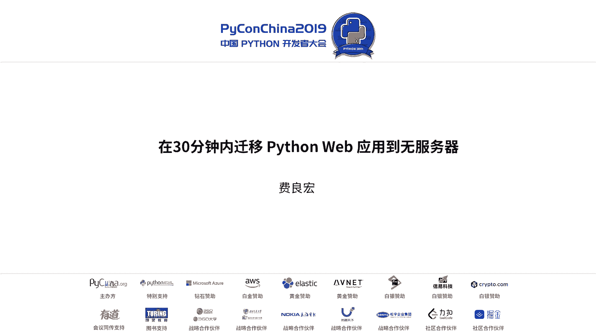
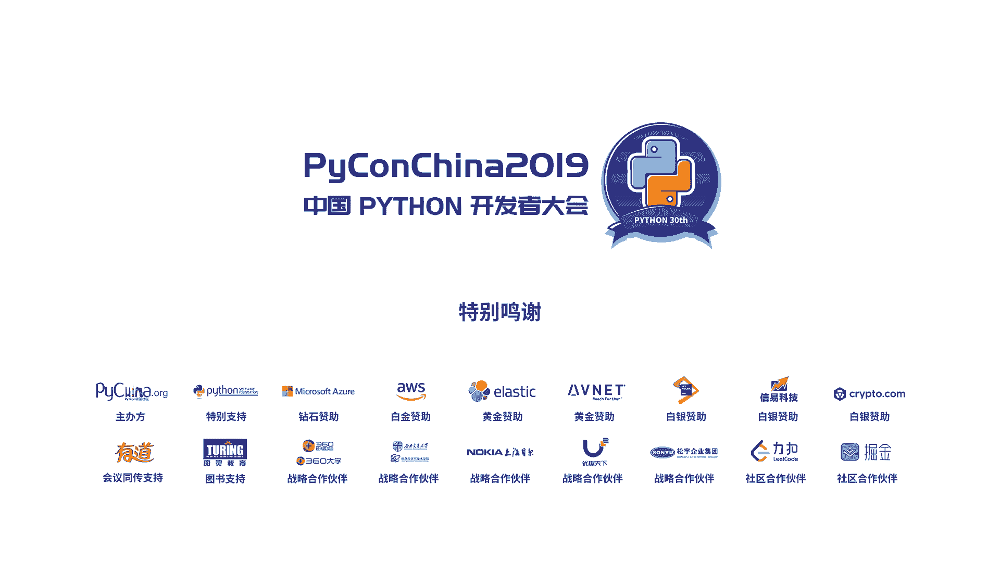

# PyCon China 2019 北京分会场 - P4：4. 在30分钟内迁移 Python Web 应用到无服务器 - PyConChina - BV12E411Y7ze

大家好，我是来自AW的飞常红。今天跟大家分享的话题呢是跟丝兰警官。size从2015年开始是一个非常热门的话题。发展到今天。其实我相信很多人都听说过，甚至。没用过有没有用过修相关框架开发过的？

也有不少人开始用，因为这个发展方向势都非常的迅猛啊，是不是我记得有人跟我提到过，他说cloud2。0就是servize，当然这个说法比较激进啊，但是可以代表一种趋势。

所以我想今天跟大家分享就是servize今天发展的情况。尤其以EWS现有的servize服务为例呢，跟大家分享一下究竟。呃，用拍手如何去开发收表相关的应用。那首先先做个自我介绍啊，我是一个老程序员了。

我相信在座的比大家年龄要大很多很多了。年龄年龄大一些，可能会倚老卖老，请大家多原谅。那s为什么会出现啊？这个大家我没有想过？其实我一直在想这个问题。呃。

2014年我记得呃reeven大会上就是AWS大会上当时发布一个产品叫做landmb。当时大家就在想说这个东西到底为什么出来吧，以及如何去用它。结果到了2015年的时候就变得有点流行了。

甚至很多人都在探讨这个话题的时候呢，甚至UC book里呢都出了专门的论文，就探讨s时候，其实特别引起我这一个关注，我也在思考，就是我们之前以往开发模型有什么问题。那么s究竟就应对应对什么问题而出来的。

所以我这样的一个思考，就大家可能在开发应用的时候有过这样的一个困惑。我不知道你们的想法怎么知道我的经验是这样，就在我们开发应用当中，如果是纯粹功能或者是业务导向来看的话。

大概不超过40%以上的代码是跟业务直接相关。大量代码其实是围绕着平台系统或者是其他的关联性集成等等。这些功能去开发的。但是呢。开发效率来看的，我们花大量分的时间不是专注于业务逻辑本身。

不是专注于应用的功能本身，是功能之外的其他东西。某种程度上来说，让我们生产效率其实在降低了。所以我认为在今天尤其我们的应用开发越来越复杂。我们的这个需求变更，包括发布的这种响应速度要求越来越快的时候。

希望我们以更快的速度去发布的时候，那原有的这种矛盾就面得越来越激烈。所以我们希望能够更快的去部署和利用的效率提高，我们容错性可用性将越来越高的时候，那怎么办？用我们现有的经验嘛。

还是用我们这个每个人不断的积累去实现这一点，这点确实比较困难。所以有没有一种通用的方法，用一种平台去解决这个问题呢。这个人叫我马是阿蒙 co的CPO，这个荷兰的。

原来是个教授做分布式计算的那他就在一次演讲当中提到一个观点。他说我们未来啊应该是有这么一个什么样的期望，我们所有的代码都是为业务逻辑而开发，这是一个非常理想化的目标。但是事实上也说出了很多开发者晋生。

就是我们希望我们大部分代码都是为业务应用而去开发，而不要再去为一些平台细节底层而去花费大量的时间的，尤其这部分时间还是很琐碎重复性的工作。所以从这个角度出发呢，大家就引申出来一个概念，说。

如果我们创造出这样一个平台，这个平台本身它可以自动化的去调度管理基础设施的资源和平台，那不在乎开发者开我们的程序本身去管理它的话，会不会更好。如果这个平台本身它的资源使用是按使用付费。

那对我们来讲是不是一个经济性和利用率的一个大趋事。如果这个平台本身它是可以实现自动扩。化那这种弹性伸缩能力对我们的应用来讲无疑巨大的好处。我们不需要在应用当中去考虑用伸缩的特性。另外就是高可用性安全。

因为毕竟我们要面对的挑战越来越多，我们需要在程序设计当中，架构设计当中充分考虑高可用的问题的时候。那如果每个不同的场景都需要单独去设计，概率还是比较高的，尤其安全的问题，现面得越来越敏感。

我们不希望有每一行代码都要考虑安全的问题的时候，那么是不是有这样的平台出现。所以由这一系列的这个原因呢，我觉得导致了这样一个结果出现。就是出现了serverize这样一个概动。他从某种的程度来讲。

并不是说没有服务气，只是这种服气对我们来讲是透明的。我们作为开发者来说，关心的是这个平台，平台之下的服务器的运作的细节由平台来。所以呢最初出现的size它是针对计算品牌。

但是慢慢的这种概念你延展到更多领域了。所以ss本身已经从一个纯粹的计算平台的概念拓展到了存储。应用集成还有其他相关的领域。我相信未来这种应用场景会越来越多，都冠于servize名称的。

虽然最初是我们最熟悉的是计算环节。所以如果说今天我们为servize下一个定义的话，我们绝对不能再能把计算平台作为service唯一的一个标签了。那size的发展啊大概是这样的一个过程。

2014年11月，在EW three院大会上发表的第一款这产品。A拉斯拉达，我记得是在第二年。啊，这个2015年的时候，就有人提出来s less这样的一个这个名称和概念了。

然后到了这个2016年初的时候，大概当时google cloud function就发表了。然后紧接着2012年呃16年2月份的open based也出现了开源的这个项目。然后2016年3月份。

m的这个 functions也出现了。2017年2月份open fast这是开源项目出现了。然后2017年10月份的时候，function也出现了。2017年12月份的project也出现了。

所以到今天其实类似项目我没有办法再再统计了应该有很多很多外serv，而且每个项目延展出来的项目工具框架又有很多很多。所以这个产品家族或者这个概念家族你延伸出一个庞大无比的体系。

所然今天这些项目可能很多开项目还比较弱小，甚至影响力均名度还不是很大。但是假以时日的话，也许其中的某几个产品或项目会催生出一个非常庞大的新的概念或可以体系出来。我觉得非常值得关注。

但这里面可以看到说精位分明的是两个不同的条线。一条线是商业化的平台以Wgoogle呃这个sof为例，他们是纯粹的基于云计算的一个这个serv平台。另外就是开源的项目。尤其Qub的统计和发展。围绕。

serv又产生出一个庞杂无比的一个新的体系。我觉得这一切都需要值得我去关注它。如果我们失去掉对这种关注的话，未来当整个计算环境发生天翻地覆变化的时候，可能我们就要重新去审视这个环境。

而且错失这样一个机会。那么servless的好处究竟是什么？其实我们来设想一个简单的问题来回答。如果我们今天来开发一个分布式的应用的话，大家会怎么去选择？我相信肯定有些人会给我答案。

就是例如使用像瑞这样的框架去做，对吧？但是如果你们想过没有？你们真写一个锐应用来说，会不会有杀鸡牛刀的感觉？就是我可能只是很简单的几个分布式函数或者分布式应用。但是你用一个庞杂无比的一个框架。然后呢。

我需要为这个框架进行一些复杂的配置调度资源管理通信等等。那我是不是很值得做这样的事情。所以我们今天非常尴尬的是当你写写一个并行任务的时候，变得非常非常的复杂，非常非常的复杂。但是如果我们转换一个思维。

用一种更简单的模型框架去考一个问题。比如说slect来做它。你会发现一个新的思考点的出现。就是我们用一种更简单化的方法去实行实现一个平行化的任务的调度或者开发。

这个是一个开放的一个一个开一个开放的一个案例啊，呃，案例呢是opdes的开发的一个项目。这个项目本身呢它是面对他的用户进行注册管理通知消息用户的呃这个数据验证的这样。因为它的数据量比较大。

所以他每天需要并行完成许多许多的任务。那以往大家可以想象，这个我们可能写一个任务，用这个基于这个这个时间调的方式来去驱动它。但是可能是一个串起运行效率低。但是如果是并行的话呢。

你可能就要构建一个复杂的一个体系架构。但是这样的一个功能，你看起来并不是一个核心业用，可能你不需要发动大器，所以你觉得非常矛盾。但是在这里你看到啊这是一个架构。在这个架构当中呢。

凹凹盖大概使用了12个这个方式，12个da方式。然后呢，大概24个方式大概有12个这个API的这个安接口，然后大概有7个数据库这样的一个架构。然后还有一些这个交集队列的通知服务等等。

就实现了这样的一个框架。从这个框架来看，你可能觉得特别的复杂。但是对于这个我比较了解这个项目就包括了解这个样的技术来讲，其实实现它的开发量非常小。因为大部分我们是基于这种。搭积木的方法。

基于不同的服务本身，只开发很小的若干行业代码，就可以实现迅速的拼接起来这样一几术架构。所以从这个角度出发呢，就是在这样的一个架构体系当中。

我们设计的架构更多的像乐高积木的这种使用方法是把一些功能块选择出来。然后用我们的代码像胶水一样，把它连接在一起。所以也有人讲说这种拉杆的出现，它是一种胶水函数，它可以把很多的服务穿联在一起。

而且穿联的效果可以非常简单的实现一种并型化。所以从这一个片面可以看到它实现这种并行化变得非常非的简单。那。从这个service产品来看呢，无疑lam姆da是一个非常值得去解析的一个产品。产品。

甚至绝大多数的第三方的开发者来说，都把自己的产品与lammbda的对标来进行对比。所以某种程度来讲，lammbda是值得我们去做参考的。那么lammbda的python到底有什么关系，跟大家分享一下。

那lam姆da我们知道呃它是一种呃计算的环境。更具体来讲呢，它算于是种计算环境的高度的抽象。在简单通俗来说呢，它实际上就是一个函数的开发环境。

所以也有人有另外一个定义叫做fas叫做function as services啊，这是一个另外的解释了。但是我觉得这个解释有点片面，但是也可以说明一些问题。在这个方开发当中。

我们需要开发的不是一个完整的应用，不是写一个应用或者写一个大的age，我们只要写一个方式或者若干的方法就可以。那function如何被驱证和调用的，它有几种方法。第一种就是同步的调用方式。

就是每方它会暴露出来一个端口，然后通过正常的调用模式HTTB的re调用方式直接去吹个查就达到调用。但是这种方法并不是最常用的方法，因为在这种模式下，它的优点并没有被表现出来。更多的是异步方法。

更具体来说就是事件驱动的方法。就是当某一个事件匹配了以后，这个函数会被自动驱动它。那么事件源究竟有哪些呢？它包含了首先AWS现有所有这些服务相关的事件源。例如在一个对象存储当中，一个存储图。

我放入了一个文件之后，就是一个事件源。我删除了一个文件就是一个事件源。例如有人啊就曾经实现过这样一个功能。当一个网站的缩略图，很多很过那个比如说用户图像或什么需要缩略图的时候，它批量生成缩略图。

它是如何完成呢？那就是写一个方式的函数。然后呢，当有一个用户自定义的图像被上传了之后呢，通过这个函数本身来进行缩略图，所以这是一个非常常用的方法，事件源事件驱动的模式来成。然后在这个框架下呢。

它已经有跟其他许多的服务做了很好的集成。所以在这点来说呢，是一个非常值得称称道的地方。就是对我们开发者来讲，我们专注于这应用本身大量的集成的工作其实已经被内嵌了。

就我们不需要考虑太多相关集成的调用的返回啊，状态检测相关的开发工作了。那它可以用来做什么呢？这时我简单的梳理一下，其实并不仅限于这些场景。第一种场景就是最简单的外b应用啊。无论是静态网站。

还是比如说blog，我大概在今年年初的时候，自己还动手做过一个，就是用lambda去写了一个blog的一个环境。就是我们未来可以把自己的blog静态的内容放到一个这个这个S3的存储品当中去。

然后把你的这个动态的内容，你可以通过直接通过lambda函数去想一它。非常简单就可以实现的。所以网站的应用mb里相关的应用是最常见的方法，比如说对图片的处理啊，对网页的处理和渲染啊。

相关的这个安全啊或者其他技础等等都可以去做。第二类呢就是后台。后台相关的内流啊，比如说任务的调度，系统的集成呃，这个流程处理等等都可以用它。调动的方式来完成相关的操作。

数据处理呢现在也是一个非常热门的话题。因为数据处理的某种程度上相做一个拍的方式。这个拍line需要一个协调器。那这协调器是什么呢？我们以往可能用自己去编写的方法，比如说用 flow啊或者开发应用。

那现在有更简单的方法是需要写若干个函数，然后这个函数基于某个特定的事件语源就可以驱动的话。那这个拍变得很简单。而且这个拍的调用关系，我们可以随时去改变它。还有呢就是聊天机器人。

大家看到很多网站客服需要的聊天机器人的时候，这种交互处理的话，它是一种这个呃这个异务调用的方式说有聊天机器人用户的事件方法。在亚马逊内部啊呃姆da最早被使用在什么场景，大家可能不知道的就是丽a。

大家听说过那个阿姆 apple这智能音箱，对吧？它的智能音箱的后面的语音交互的技术叫做丽a。这个丽a的必须环就是在流量版面上。如果大家在座的各位有兴趣开发一个阿姆多 applele的 skill。

就是这个对话的能力啊，你会发现你开发一个scale的时候呢，都会利用lam姆da来去托管你的这个文件码实。所以这个变也就非常简单了。所以浩胜有讲是30分钟开发一个 skill嘛。另外。

在这个运维或者IT维护过程当中，经常会使用lammbda来作为一个事件驱动的调度器。例如我在我的日志过程当中检测到系统运行状态，出现告警过异常的时候，可以通过da来去告警信息。

或者是创建新的服务或者对应的操作，都可以把这个逻辑像da用人去维复它。所以da可以跟很多其他的图配合在一起完成一些很大的工作。所以从这个角度出发，大家敢不感觉mbda就像一个胶水应用一样。

它像调度器一样，它可以把很多的图穿递在一起。然应用场景还不仅建议这些包括像一些人工智能推理等等。我记得在去年的时候，我自己写过应用，就是用这个叉CN生成这个对藏诗训练完了之后，生成藏诗。

所以你每次调用一个mbda的函数之后，它就能给你写一首看起来还像像藏诗不可事件。那这个今天给大家分享的真实案例，就是那个ar echo的智能音箱的所有的语音交互，其实完全都是运行在这个lambda之上。

如果大家如果感兴趣，自己写一个这个语音交互的ki，你可以看到首先要学会的就是da函数开关。那说了这么多，大家一定关心这个da函数长什么样，是不是非常难以使用啊，如果难以使用的话，我相信在口没有兴趣。

那我给大家看一看，如果我想写一个lada函数的话会是怎么样的。那么这里就以这个on为例。当我写的函数的时候，就是这样一个格式，我首先要有一个handle一个名字，就是起了一个名字。然后这个函数呢。

它会有两个变量，一个是evenvent一个是ex然后我会返回一个值返回一个值是个可选项，不是一个必选项，你可以返回你所需要，也可以不用返回这是一个标准的框架。那这个标准框架实际含义是什么呢？

这个疑问就是大家知道刚才我强调的是个事件驱动的话，那这个事件的消息包含在哪里。是通过这个疑问传递过来的，它是一个一个dictionary的一个函数类型。当然也可以是其他类型。

这个包他们所需要的这个项目获取这个事件的相关信息等等就可以通过它来获得。那这cont是什么呢？cont就是调用这个参数的时候，向你的函数传递当前的运行环境上下文。但是如果你需要的话。

最比较常见的是我们使用event来了解到这个事件的一些具体信息，然后来进行后续操作。那如果需要的话，就是了解一下商态信息，然后之后就是逻辑了，然后最终你返回。那这样看起来大家如果觉得还算简单的话。

我就给大家看一个真实的一个例子。其实就是这样的，就是写一个我的handler的 function，自己起个名字。然后呢，针对我的疑问题传递过来的信息来进行相关的处理，然后返回一个值就可以了。

这就是我所写到的一个函数。所以这样看起来写一个函数，是不是很简单，大概就要几行十几行就可以完成一个很漂亮的功能了。那写一个函数怎么样去写呢？

其实比较简单的方法就是在lambda的在AW的这个呃b控制台上面。然后它其实是有些工作。你可以从一个简单的呃这个从零开始去写它。

也可以从一个所谓的blueprint去写它blueprint其实就是有一些框架。比如说ex scale啊，或者是做这个数据集成啊，或者是相关操作，可以选这个蓝图。

它有一个框架之后去写它对编写起来还是比较简单的。如果大家有开通经验的话，其实几分钟你就可以写一个看起来不错的一个功能，可以以及跟那个AW线功能集成在一起。那拉文达很好是吗？其实也有很多很多问题。

就在这里跟大家分享一下，就我看到的拉文达的结会。第一个问题啊，它基于一个函数，所以它不是一个可以long run的一个应用场景。long run一用场景是什么意思呢？就是可以长时间运行。

基于一个路的环境下不断的运行。那么它的有效的生命周期是多少。目前看lambda是15分钟。所以如果超时的话，它的平台会直直接把你的函数卡掉，所以这是一个路线啊，不支持long run。

但是未来未来也许会有这样的突破。所以我们可以期待一下，第二个呢，这所谓的costar，就是冷启动的问题。大家知道这个lambda它运行环境是怎么样的？在基基础层面它是一个EC two的虚拟的实力。

在每个虚拟实上呢，它运行了一个一个容器的环境。但是这个容器不是使用一个完整的KVM啊这样虚拟化的环境，因为那个环境太重了，开销太大，创建大，它是使用了一个叫fire开源项的一个产品。

大家进去可以看一下那个它创建一个容器的速度特别快，大概就是10个毫秒之内就会创面完成。创建完成之后呢，它会把你所需要的运行环境。比如说开的run time，还有你所需要加载的应用能能加载创建完成。

然后呢，一切就绪之后开始去运行的一个应用。但是大家要知道，无论这个容器是一个多么轻量级的，或者是mic的con的话，它都需要加载时间。尤其我们应用本身的复杂程度越来越大的时候，比如我如果加载的话。

那于秒计了有几秒钟时间去去加载就开销也比大。所以冷启动它会有一定的损耗。那当然对于冷启动来说，大家很抱怨这样冷启动。但是其实也有一些对应的方法。比如说我自己采用的方法是什么呢？

就是我会做一个定时器的应用，定时器的应用。在一大大厅外那个clo时间，大概每隔5分钟我会拼一下。加载一下这样最大的可能呢，当我的用户来请求的时候，他已经被我的定的应用给加载了被预热了。

但是你要付出一定代价，就是你要额外开发应用。另外。因为按使用付费。但是未来我在想这个一直以来有这个抱怨化，这个问题有可能通过其他的方法会解决，所以这是值得期待的一方面。还有一点呢就是资源的限制。

毕竟它是在一个有限的托管的一个容器环境的运行的。所以它的并发的能力它的IO吞储它的内存程序包大小等等，它是受限于这个容器所承载的环境的限制，所以它并不是一个无限的环境。

也意味着说我不能把我们现有所有的应用都变成一个函数直接投过上来。这样的话，在大部分应度没问题，但是一小部分对特定环境有要求的时候，是受到有限制的。那还有呢就是在开发过程当中啊。

因为它毕竟不同于我们以往开发一个标准派出应用，或者开开发一个这个开送其他框架的运作，它需要有新的ID新的有监控工具，新的有ds的部署工具，新的pro这个分析系统等等。它是一个全新的框架。

它跟以往的工具手段，也没有办法是完全集成。所以这切都有待于我们去适应学习，包括新的工具的不断出现。还有一点呢，就是它的运行环境是一个通用的环境。

目前看到通用环境就是一个intel环境的一个通用的CPU的计算环境和资源。如果我的应用本身需要特定资源内如，刚才我提到的，你他说到推理环境，我需要GPU资源的时候，对不起，目前还没有提供。

如果需要可变成门字类的话，对不起，这个是没有存在的。当然也许未来差异化不但出现之后会出现，但至少目前来说，这个只有一个标准的运行环境并没有其他可以及加应急资源供以使用。另外一点啊。

这也是一个大家很多人诟病的地方。就是刚才谈到了许多的这个seless框架和产品，你会发现一个什么问题？他们并不是一个完全标注上的产。这意味着一个什么新的。你的离职的问题，你的标准化土地的问题。

一旦你选定了平牌，你就绑定在一上。所以这是我需要考虑的个一个方面。所这是这样大的几个不足问题。那如果再看一看，刚才也谈到了cosstar的问题。costar的问题对各个语言的表现，其实差异非常大。

我其实应该把么样头先放起来问大家哪一个语言表现好一点。得到你们的那个证明。为什么会这样？大家能想到。当然，不同程绩的表现会有所差别。

总之只是简单一how word拍phone的性加载性能是java的将近400倍。为什么会这样？其实我的理解是VMVM的那种特性，就DVM的特性本身增加了这个开销。嗯。

反倒你们发现没有解释型语言的开销是最小的。解释器里面成量最小，因为它的解释器本身的价值开销是最小的，不需要加来这种完整的VI。就如果GIT引后的话，你开销会更强。

所以强类型的语言在这里面优势并不是很明显，反倒是能解释性的。会更有优势。无论是javascript，包括像拍on的表现会更好。当然你会说我这个测试是不是有失功允呢？我这个没有办法把每一种场景都便利它。

都有可能去覆盖啊，做一个非常功允，只是做一个power world简单的测试大家参考一下啊，所以这从这角表现来看，拍thon表现的非常的惊艳。所以python跟这种s结合是非常非常理想的一种场景。

所以你们看到大量的AWS兰的案例其实都是用python来进行开发。那刚才也说了，拉姆达有很多的这个技术上的限制，那些限制有什么呢？简单跟您说一下，第一是他的。这个能力的一个局限。在能力方面呢。

它只是用统一到用CPU的大小来去衡量它的这个能力。它把CPU大小直接映射成对应的网络和CPU的处理能力。从128兆开始到3个GB每64G64GB作为一个台阶，你选择不同的这个内存大小。

也意味着你获得不同程度的CPU或网络资源。对于这种方法来做简单化的一个选择。所以你按照你不同的需求，你的应用需求来去选择不同的内存大小就可以了。第二点呢就是函数的运行时间。

刚才我也强调了900秒15分钟目前的限制。然后呢，含环境变量是只有4K。你如果通过环境变量来传递信息的话，不要超过4K。这个lays呢是一个新的一个概念。

大家知道在pyython里面我们有很多丰富的package。但是如果你每个不同的函数都要你import自己的package的话，会出现什么？大量代码用语，甚至还有一致性的问题。

我要去没有办法在不同的函数当中去保持版本的一致，所以有没有办法去共享这种部分呢，那新的出现就是用lambda的lay把我所需要的所有依赖的第三方的packagelib打包成一个lay。

然后我的函数会共享它啊，用lay方法去解决。所以今天的这个lammbda可以做一些大型用，而不像以往一样，只是一个小的函数。然后函数的初增并发其实是有些曲限，从500到3000。

当然这个可以通过预热的方法给来去解决目前的局限是这样的情况。程序包本身其实受限的，这点是非常让人痛苦一件事情，尤其是一大型的鱼种。它现在是这样，就是压缩后的压缩成 zipip的 zip包的话。

受限是50兆，没有压缩是250兆50兆的话意味着什么？大一点的这个你就没有办法打里。比如说那我以前的做法是怎么做呢？我先把拍pen这种打包好了之后呢，放到这个S3当中。然后呢，当我的函数启动了之后呢。

从这个S3拖到我的t这个录下面去，那就是。人的智慧总是会有各种方法去突破的，当是也希望未来会有所改进的。还有呢t的目录呢是512章，刚好可以放下我刚才所需要提到那几个那个library。

然后执行的进程和线程数量是124，文件描述服其实也受限制环境是124，这是整体的一个栏段。所以你会看到说它是适合于通用的一些场合。但是如果你突破这个环境的话，除非你找到一个更好的work around。

否则你会受限制这些历程限制。那刚才也谈到了，在工具的局限方面，工具局限方面，其中一个很重要的工具呢就是我如何去做pro坏，如何去mage获的这个拉。因为传统的方法你失效没有办法去观测到哪个细节。

你唯一能做的就是print的方法去输出一些调试信息。那这种调试信息的效率是比较低下。这你会忽略掉很多细节。那有了S three之后，这一切就变得很简单。S呢是AWS一个服务，它主要是针对的是分布式应用。

其中尤其包含对无服器的应用。那S怎么用呢？其实非常有意思。这是昨天我准备了一个小的应用，就是写了一段呃方这个方程的主要问的呢是针对S3。

就是你对象存储来进行操作的那为了进行调试的话呢我就引入了这个S three的整个这个这个package。首先呢我这里就引入了au three bottle three呢是AWthonSDK啊。

就是大部分文当中都会以使用的。其次呢我就还引用了这个AWS的SDK这是我后面所需要的。然后每一个函数或者每一个你的函数的片段，你需要怎么样呢去创建一个子的分段，需要子的分段。在每个子分段里面。

有话去测量它的运转的开销和效率等等。在你所需要地方就创建它创建这个s。这个子分段的话，有两种方法。第一种方法呢是手工的，我写入一段代码来去创建它这种方法。第二种方法就更优雅的漂亮一点，就是用一个装饰服。

这个deator，我直接去生理它就可以，这个取决于你的个你的习惯。如果你是对一个函数做用这个子分段的话，用装饰符当然一是效率最好。如果你是在一个大的函数当中有不同的分段的话，你可自己手工去完成它。

那运行这样的一个程序之后会得到什么结果呢？就看到这样的一个结果，就对我的每个子的分段就会有详细的一个for数据共同去优化，找到瓶颈，这是这行相关的问题。所以这样的话就比须用print输出调试信息。

那我们一定要好上很多个倍。那另外一个就是开发一个应用。大家都知道，今天我相信大家可能用了很多很多IDE，尤其很多ID已经非常非常的强大了。

那这些IDE呢好消息是他们很多都已经提供了这些插件去实现了对da或者无服务器的支持。那尤其像这个，呃，包括像也好，还有 studio code都已经非常完美的实现了。那另外跟大家介绍一点呢。

就是有一个的一个产品是基于浏览器的一个ID的环境。那它原生的一个提供的。我かな。对取决于大家的需要。那这里尤其介绍的是这个AWS two k for video studio code这个插件其实做的非常漂亮。

它对lammbda的支持应该是非常非常的完美。所以我这是也让我一直在动摇，是不是放弃我的VIM转到这个客户里面去。但是我觉得这还是太重了。如我的VI来的更更有效率。但是确实这个插件做的很好，非常的贴心。

很多的集成调试，还有部署这种不简单有效率。所以大家感兴趣，想尽快上手把证这个式的便捷的捷径。那刚才也强调了开发一个函数的。那最后我们涉及到一个问题，就是如果部署。大家在部署的时候知道有什么方法？

其中一个就是写一个脚本。有一个tplay，我们叫做comformation，就写这样一个jason或者ylow的个文件。反正至少我看到这个东西我是要吐的，因为我实在太讨厌他了，我真的很反感这种东西。

因以我觉得这不是程序员所面对的问题。啊，这是痛苦件事。所以我证明未来家意见，我只是告诉这样一个。那我推荐方法是什么呢？其实有一个新的工具出现。这个工具是围绕着一个大的框架。

这框架呢就是servless application model的这样一个新的开源项目，叫做s大开源项目。这个开源项目呢，它就定义了serv less一些规范和标准接口等。

其实如果未来这个标准规范成为事实标准的话，我相信可能会很深远的影响servless发展。如果更多的开源项目去接受了这样一个标准的框架的话，那未来有可能在serv less领域里面大家达成一致或者标准化。

那样对大家来讲应该是一个皆大关喜的一个结果。还有更简单的方法，就是用一个命令行。比如说我就更喜欢使用一个脚本的方法用命令行去完成相关的项目的创建啊，函数的部署以及后续的一些发布等等。

那这个工具其实是基于some这样的一个框架，然后开发一个com工具，这也是开源的项目。这开源项目呢它提供了很多强大的功能，甚至它提供在本地运行一个docker意味着来对你的函数进行评估和测试。

至少你可以把这个所有的问题可以在你本地先报露一下，避免等你发布之后再发现一个函数出现各种各样。所以那个就非常糟糕了。所以这是一个非常简单的应用。那怎么去用？其实非常简单。当时我看到这段的时候。

就是最大的动力开始去学习史za，大概只要几分钟就行了。那么首先以匿一个新的项目，然后它会在当前的目录下创建相关的目录的层次。然后呢我进入到我的方程里面。

然后我写好我的那个开的文件点PY文件放到那个方程下面去。然后我就用s就并，它就会打包检查你的语法问题啊，进行打包打包成一个Z文件之后呢，我就开到我的S3那个存储图里面去了。放S存储里面之后。

我再使用一个deloer，就从SI存储当中部署到一个烂。如果不署栏环境之后，你觉得有问题，那你可以回退回来，重新再去修改你的代码，然后呢再执行这样的过程完成后期部署。最终，如果你的代码成功发布之后。

你希望你的代码成为一个模板，或者为更多的人所使用或者是复用的话，那你可以把它plish到一个reportory里面，让更多的人去看到它或者去使用的话，那么这也是一个非常有效的管理方法。

而且这个reportory支持版本来模种程度上就可以进行版本控制。所以就只要通过这么几行几个命令行就可完成操作。如果大家熟悉的话，你可以把你的至少部署相启动变得更为简单和自然。

那兰姆da跟拍送的关系呢跟大家最后再简单的汇报一下啊。la姆da上的拍thon呢其实在最初2014年的时候呢，就开始支持了这个派送。在preview版本，但是当时支持12。7，当时我们特别恼糊。

这个为什么这个时候呢，还给我们支持的这个版本。所以我记得在我们内部开会的时候，当时呃这个da的那M就问我们说大家希望我们下一个特性支持什么go还是什么我就说紧接着就发布了了这20到了后后续就慢慢发布了对这个2点7支持到3。

6的支持3。7的示等等。然后到了2018年的时候，现在支持这个新的run time写错run然后这是一个的那个lay大家知道就是一个对的管理。那个run time什么呢？

它可以支持任何一种运行在lin环境下可执行的东西变成运行管理也意味着我甚至可以写一个sha脚本来作为我的da式。都可以。

甚至有人把那个原来老旧的cobo啊这种这种这种函数的呃这种语言的东西变成了两个方式。所以这个runtime变得就更好玩一点。这是一个这个态度的萨尔代。那如何我将现有的一个应用切移到版本上去。

我相信大家一定会有这样的问题。新的应用开发，应用这些ID也好，工具也好，是怎么去实现。如果有很多用户的积累的，想短时间的去体验一下兰mbda体验一下搜来话有没有什么更好的方法，其实也有这样的工具。

第一个大家听说没有？这个开源项它是一个非常有意思的工具。它简单到了你只需要简单的去安装一个这个开，然后去创建一个新的函数，然后你就可以把它直接通过这样一个命令部署到da盘。那你只是看到创建和部署。

一定关心的是这个函数开发起来是不是很简单？那函数开发是什么样的？其实就是这个样子。那个大家可能都非常熟悉plus就不用多说了。如果你有一个pl应用的话，你只要在程序当中做简单的修改。

就支持了lambda环境，然后用到za去预报一个拉mbda。所以那盘最大程度的集成了现有的大型应用的那源。我记得今年初的时候，我当时做那blog就是么办法去实现的。那第二个呢。就查就是圣杯啊有这个项目。

这项目呢也是一个非常有意思的选择。大家可以看一下，我们首先去安装一下type去安装一下就可以了。然后呢，它提供了一个很强大功能，就叫做这个这个重构refactorory。呃，我可以用它去来部署。

如果这是一个标准的发字应用，大家都非常熟悉的话，这个不程都解释了，每人都可能写过这样的应用。那我需要变化成呃这个重构成什么样的重构成这个样子。所以只是寥寥几行，就会从一个标准的大字函数或者是标准外运用。

瞬间就变成了那。神奇不神奇，就是这么简单。其实达给我们带来的好处或者servize给带来好处非常非常多。但是其实开发的门槛非常低。如果大家感兴趣。

我觉得非常建议大家开始实践一下未来lammda发挥的作用非常非常大，远远超出我们今天所设计的传到的内容。所以非常希望大家未来有实践，我一起来去分享和交流。关于size和开行之间的应用美好未来。

这个当然现在所有这一切还不是那么厉好。很多很多限制啊很多很多局限的地方，很多很多需要改的地方。但我相信一点，就是未来这种技术的演进应该会越来越快，这种技术的限制会越来越少。对我们开放的功能来。

对这年我毫不至息，毫不至于。所以未来servless拉杆发展一定会越得越好，也预祝大家在未来的体验当中得到很大的收获，谢谢。OA聚会。然后。先这边吧，那后面。哎，朱老师你好。我这里有一个问。这是我们在。

如果用这个视频构建应用。然后这里有一个定义。地。呢道你搞自己嘅。We。什么问题就决就是这个函数的力度啊，力度问题啊。对，就是我中间一个，因为我是这个函数做多它的任务量。就是如果我拆的戏。

其实就好像有时候我们遇到这种挑战，我理解疯狂的调大C里样。你想得得要可影响就是我哋次求已结下嘅。其实那个在我们自己内部讨论的时候呢，就关于这个分解的问题，就是呃分解分解到一个原子的原子线索啊。

单线程都是这样强调。但是这个分解的力度是什么呢？是是到michael nano还是到什么呢？其实也没有一个标准答案。我觉得大准答案非常灵活，就是取决你的需求。比如说这响应延迟，你的那个就是对于重构来说。

要求达到的力度，对于重构来说，对于敏捷的方法。所以一般来讲，我们经常的方法就是说我们在世高法分拆，判断前提是它能不能够提升敏捷性。如果不能提升敏捷性，你就不要去。如果它能明显的带来敏捷性的变化。

比如说未来重构也好，或者是这个快速部署带来的好处非常明显的话，你把它分解开。当然分解前提还有一个情况，就是特定场景下想延迟的问题。就像你谈到就如果过多的依赖这标准关系，这个延迟和效率低下也是不可忽略的。

所以我觉得第一就是是不是有敏捷的好处。第二，有没有特定的想延迟的额外的限制。一个是从技术方面。基本上的话。那我觉得。做。个业务。结合销部门。坦率说，这个因因为业务场景差异非常非常大，就很难有一概而论。

因为最简单来说就想着延迟这个问题，我们遇到的挑战非常非常多。有对100毫秒之内是可以的，有的只能强调是在50毫秒以内等等。所以这种差异性导致了说你使用的技术路线都完全不同。

例如如果你强调这个延迟性非常非常低的话，坦率说我都不推荐使用来安排。因为它的能启动的问题，包括其他的这个环境的足够的问题。没有办法通这个问题。所以事实实上，我认为这个对业务角来说并不。

是我们具体的业务需求。要结合对，你结合具体业务需求，没有标准答案对个。好的，谢谢。Okay。Oh。想请一下呃。やっぱり。关于那个最后有一个疑问，就是说把一个外跑应用程序，然后让它建入到lammb达。

但是我刚刚呃第一点，然后我我在上传文里看到说le达的这些是。啊，最常就有15分钟，但是外国应用同学一般都会类请。这个地址，所以我不知道这个。对，具体去。实践出来。呃，对，是这样。

因为那个我们有些外部场景里面，但是基于这种STP请求的时候，呢就想给他。比如说我们有一个网站，或者是有一个日志的游一博客，那都是用户请求的时候才会得到一个响应。但是这个从请求发生到这个完成他的回复。

你中间时间不超过15分钟话。就他的15分钟是指说从请求发起到任务结束的时间不能超过1。所以请求是先请求到一个代理然后代理再再转移到那个当当中有几个途径。第一种途径的话呢是请求1个APIA的位。

然后呢再去请求这个呃拉维达APIA的位本身会产生一点点延迟，但是可能是毫秒。这是一个场景。第二种场景呢，在选择上，你可能选面选择一个自载变衡器，比如说ALB就是AW9个ALB的自带变行器用自载变衡器。

那它在初工效在两大。也可以，那个延迟其实也不是很大。所以你可以认为说前面在兰姆达之前的延迟都比较小，主要的这个运行时间损耗都在兰们达还是本身。就只要在拉达本身运行的时候，不超过15分钟的话，你都是可以。

但是确定明确下来，这个函数会长时间预行到，很明显在。至少50。Yeah。

