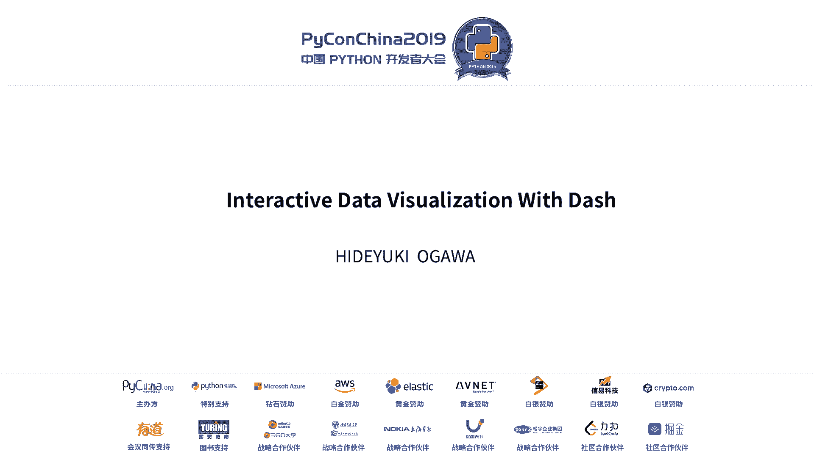
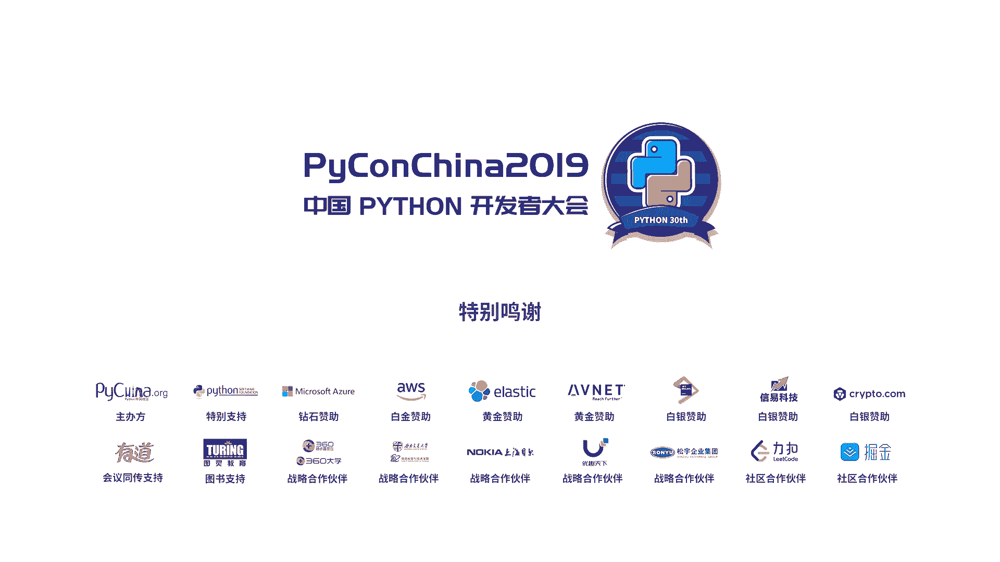

# PyCon China 2019 北京分会场 - P5：5. Interactive Data Visualization With Dash - PyConChina - BV12E411Y7ze

大家好。今天我担任用大市县找福士出主科媳傅。So。Today， I use。My application， dash application on you can use。

Dash application from here。 and you can use from。Sly on the电。Maybe， maybe I sleeping on。It take time。

 but。Opreation where you wake up。Yeah。Okay。ok。让我自我介晓，我是小张星。りゆ小川英之。我学还有一年。当。太有闲啦。おししもし引入。对不起。呢个知。

😀Yeah。嗯。And this is my first trip to Beijing。 and this is my first experience of talking in front of many Chinese。

😊，And now， thanks。Thanks for。Opportunity to talk。 And I'm real bit nervous， but I try。

I talked about my career， I worked as director and analyst at Financial Institute for 18 years。

5後 I started usingパython for data analysisです。Two years ago， I quit that job。 and recently。

 I founded my company named Chom in Chinese Chaangu。Im from Ky Japan。I want ask one question。我想问被告温迪。

無後認知だ人類。啊，你呢住小吗？哦。Many people know京都 thankが欲。Recently when Chinese come to Japan。你啲。

People who come to Kyota， too。アイアンァンスパイソコミュニティ人教授。いつねあんなリパイソン。ハなりメヨやインチャニ。

We hold Han on every Friday。Please join us if you come to Kyo。

 we welcome and if your a friend live in Kyo， please tell them to join us。

Today I have stick up and person my company， please ask me if you want。系。

Talk about why I come tocon China， Beijing。One， I have been interested in Chinese culture。

My company name is fromオ Chinese worldチフ。And still。

 many people say Chinese programmers quality is the best in the world。

My friend work at Chinese company said so too。I want to communicate with people。

 but I cannot speak Chinese， sorry。Three， I wrote book about titles and Financial write the book。And。

I don know this book is popular in China but。This book was very exciting for me。

The most impressive thing was。That and financial people which to square the office。

つアメリカンペイメント company。嗯。And financial people were disappointment of square business model。

Because square from expensive fee of the service and and financial start to sink their own business model。

And I think this is a great story。4， Ive accidentally found this event in August。

Then I was preparing for Python Japan talk。So I send the proposal with same same dash and interactive data visualization。

まちょっとでコンテンツ載ってせ。ジャパンストークハ。Many Japanese leaders。 and maybe it is not interesting for Chinese people。

And far， that is a great framemon。I am not contributor。 I'm just user， but I like。

Data visualization and I use many data visualization tools and I think that is great。

And I won't share with you。Today， I will talk about one。

 me talk data interactive data visualization and two about data visualization and three about dash。

At first， late fields of merit interacted with data visualization。But here I use two data。

Numbバ tourist in Japanフミション hotel in京都。啊。This fast table shows number of foreign tourists in Japan。

 by country， to1 by Europe。啊。China is number one。サンキ forビジティング Japanパン。

And you can select the error from this dropdown and you can。See the data is changing。

Nextス showsナバ inジパアユキャ。Select the country from this to down。 But sorry， this is in Japanese。

Because this is Japanese data and。レフサイルドセレクティト companyカントリーデータ。ライズライズクラフ。Shows number of tourists。

 number of total tourists of Japan。あのグラフビ shows percentage of the selected countries。As a whole。

This is Chinese data。 we can see that the percentage is increasing month by month。嗯。

Each percentage is close to 40% recently。Very huge number。I don't see this。佢。And I am Zing。U。

The total number of普。In Japan， is increasing from 2014。And the number number tripleed in five years。

경인가 지금发 한던 봐。Many people was to run Chinese。Noラ補。They are not enough to。They are。

 there are not enough room for tourist to stay。So more peoples。Rshed， buying hotels and rooms。

This graph this graph shows the numberオ京都 hotels。We can see the numbers jumping 2014 to 2017。

So what I think I want to buy some rooms too。So I rushed to real estate company and。

Tell them to show me information， but they show me information about rooms。I going this， but。

It is not good for good information for investment decision。

So I make my interactive data visualization like here。This is part of the data visualization。

 and I add the map data。This map shows where is Kyoto hotels。で面に補つ。

And you can see where is the famous hotel。Where is that popular。Space or unpopular place。

I think this sample shows merit interactive with data visualization。

Interactive visualization give us more information and help us to understand circumstances。And。

I think it is necessary for decisions， like business or。Services for your life。Next。

 I talk about data visualization。Why do we visualize data。When we analyze data， there are five steps。

 I think one。Define your question and goals to correct data and three data preprocessing and four explore three data analysis and file evaluate model and algorithms。

On step4 exploratory data analysis， we do analyze data set and summarize their main characters。

And this step of use visual method。Because in this step， we human observe data。And this step is。

The most important to make good model。If we。Of the data， How about using data table。Yes they。

This is only 115。データセトアイリステート。I think most of people cannot understand how to data on or future of data。

For here， there is not。T is difficult to understand。How about using graphs。Heres graph。I think。

With graph。We easy to understand how the data and feature of data。

Data and visual evolution will help us to understand data。I skip three and move to four。リセントリーゼめに。

Daタ visualizationション tools。Ts like BI tools， like Tago， Microsoft， Power BI and Google Sta and more。

There is rival like these3， multily bouquet and more。There is there。Interductive wave framework like。

 shiny， Dutch and paner and more。I think all of these good tools。We can use what we write。

For example， I usually use dash and pot， but I also use much pot and tabis。I think Ta is good。Zs。嗯。

All of these tools help us to understand the data。And today I will show you Dutch。

Dash is open source Python rivalry。Dash is made by Brory and Zor D Ana will framework。嗯。

Dash can write code with only person。I think this is an important point for me。I mentioned earlier。

In data analysis， in data analysis， there are five steps and it is nice。

All steps can do in one language。And the dash is made by fscan propertiesris and the reactor。

On the footprint is here。The documentary is very detailed。Easy to understand。水出しウ上げメイク。D application。

 it is very easy to build interactive data visualization and easy to share。

that has many otherコンポーネツ besidesグラブs。Like dash byハ data dash byハ。バイオインフォーマティックスビジョライデーションアず。

You can build your own components。Next， in this section。

 I will show you how to build dash application。This is today's sample application。 And here is graph。

 if you mouse over the。Growth。It will show the data here。These looks are little bit complicated， but。

Easy with Dutch。The application is made by layout and call bank。

Reyout makes what looks like and corebas makes application more interactive。Let's see the call。欢迎波。

スモジル。Dash is more dude like。フラスククラスあフラスクモジルフラスククス。And they have more functions。

And the dash core components has tools， right？DD down on slideer and graphs and dash HM components provide HMl cut for dash。

And。Here rem dash。嗯。That instance。 and here we make。Here we create layout。And this is Goldberg。

In this application， I use cobo dataator as。Input to data。And in Co。

 if input to data changes automatically。Corba function， this case here is。Fire and data pass to。Here。

And application will like this。This application is written。Just only38。

Including comment and I formatted with the block。With D， we can build the complex application easily。

Next， I talk about one。Difference between normal work framework and the dashes。

 dash can use interactive graphs。D can create graph。With protein。And the Pro has Rapper names。

 Pro express， Raich， multipros， Shibone。Let's look difference of modules。At first。

 I write code with Dutch。This is graph， and this is called。G five right。Next for three group objects。

Pro text is the。呃能ま能完の这という。On good way same as dash on。Call the same five liness。

 but a little bit different。Protty express。Put express graph is a little bit different from another。

And cold is getting shorter。你啊。Gド is only three lines。How do we use this？

I usually use pro graph no pro express because it is easy to write call。

And if we won't do something complicated， I use pro gramolis。Nextコンポーネンス。

Dash has seven components ready to use。 Today， I will show you some of these。啊 to。出して出して。

私しデータ例を及りずインタラルティブテを。This can be used rack excerpt。

I will show you how the graph changes as I enter number in the table。主啊。W use。Exhale。嗰边。对都。And定。

We can use。Dash data table like this。You can create applications that can be used by dark under file with dash call components。

On the next， I will show you dash canvas。Dash canvas is drawing and annotation for image processing。

Today， I create application thats youth。你冇白啦。Aories。This is my smiling picture。

I draw line and remove background。R is very easy。And I push slowly moving back around the bottom。

Here。There is noise， but it looks good。呵呵。😊，Next dash sidescape。

DashSSscape is network visualization components with Sscape Js。リセンチアネットワークビジゼーションアアイラユース。ダッシュサイズケープ。

And this is。This application is from D gallery sample， but this is interesting。If youくの。ノドコネクティトウルす。

The node is dis。An interesting point of network visualization on if we change the layout changes the way the network looks。

If we choose consent。You can see what is center network。And we features bread very fast。

ウィーケーシーストラクチャーズネットワーク。I think this is interesting。Next， I will talk about the drug。

Sharing application is easy with crowd。This time I use module this time I used A first time。

 but it was very easy to。And I will show you how to deploy。At first。Make your account and get she。

And step2， make dash up fire。Like this。 How。1 three。Make requirements far。On step4。

Deed to Azure with she。She has just only two rhs。Roing on the De。And here we are。At this。

The application is deployed。And in Japan， a jury is free for one years。Sharing windows。

Sharing me that the people of jurisdiction can be easy with dust on the crowds。

Cooration with Corew and client will be easier， and there will be many new discoveries。

Sharing data generalization will help us to create better services。A summary today' summary。

I todayブティブデータ visualizationショデータ visualジizationショバダュ。インタネクティブデータデジョライデーション、ギーバースのインフォメーション。

And sharing interactive data visualization and collaborating with another people will create new discoveries。

And good insights help to create better service and the future。I think D can help with this process。

Let's start with people so us。谢谢。give people chance to ask questionOK我们还是两个问题。然后的话如果是大家能用英语提问是最好的。

如果不能用那个英语提问的话，然后就那个用中文提问。我们这边会有志者帮大家翻译成。然后呃hos first。有人有要提问的吗？呃，有什么问题？需要问提教一下我们的。吃的吗？可以用中文提问。可以用中文。

第个。either that graphic section。Graphics。Oh yeah， graphic yeah， and you mentioned three model and。

Gra objects and also express。 So the the first is that。

 So the other two is also included in that or just two items to make a compare。

ァの町は私の中にもありますので、それとも比較的にちょっと。ここに打これこれもマジですかそうです。こ他のマジ他ののジで。も比的こに。

あ、ここにもな三つの街チュルですねこ小げはそ皆がそのデタミチュライゼーションですか。そうですそうです。そうですねツールももしその複雑の場合はそのふうんこれこれです。かそうです。

じゃあこれはどのどのくらいどのタイミングで使います。今わちょっと難しいね。後から後カらーとかでもいいです。後からす。他说这个问题他待会儿再再回答啊。哦，还有最后最后一见可以综合提问的来。啊，话筒话筒。

大是可以跑在那个猪蹄车里边吗？うん、十分のノートブックにも確か。できますイエスウケユずイ。ジピタラブジテラブ。And。But。Windows can't use that。

I don't use theYeah， the next and Mac can use that。ゼイズモジュールオケ。还有其他的还有其他的要提问的小伙伴吗？然后我们还可以再补一个问题。

因为刚刚我们是驰还有其他的提问的小伙伴吗。啊，那时候还有。谢谢。😊。

