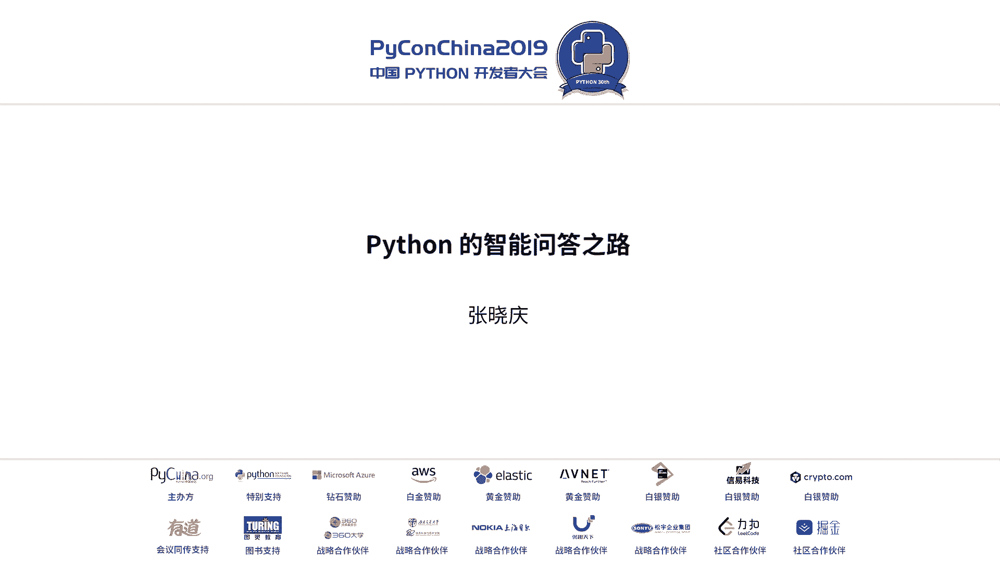
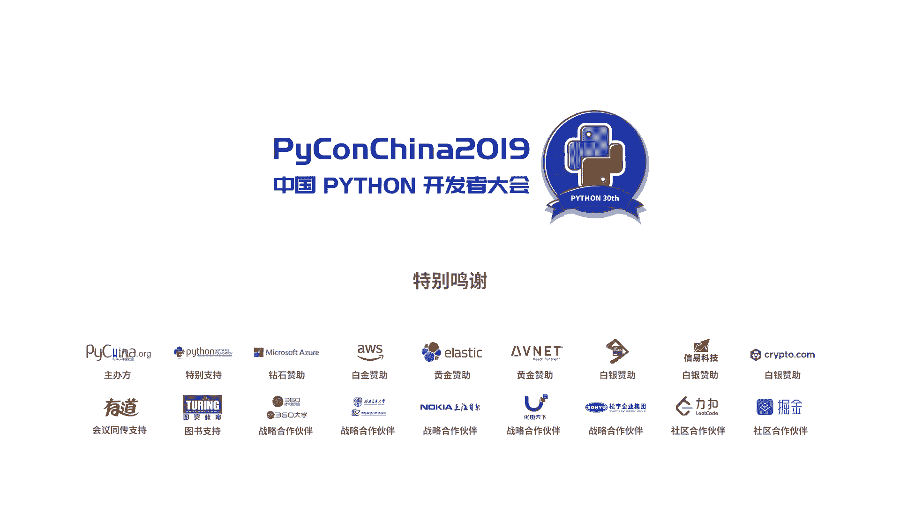

# PyCon China 2019 北京分会场 - P6：6. Python 的智能问答之路 - PyConChina - BV12E411Y7ze

hello，大家大家下午好，我是来自来也科技的算法研发。然后今天给大家带来的题目是开phone的智能问答之路。也就是怎么用python去快速的搭建一个呃问答机器人。天点じな。Yeah。好的。

这比应该也好。我有没有。然后这这次讲解的主要内容会围绕智能问答简介UA的快速实践，开放开发的利弊总结展望这四个方面呃来围绕呃介绍。希望呃经过今天的介绍以后。

大家对AI或者是对问智能机器人比较感兴趣的同学，出了这个门以后，回家会更有勇气去尝试搭建一个自己的。机器人。首先我们来看一下。智能问答到底是。是是什么个意思？呃。

这张图是来源于段楠2017年天论文里面的一张图。下面比较清晰的，我列出了当前业界对智能问答的一个领域分类分类。呃，KBTV就是基于知识图库的问答。Okay。所有的知识以三元组的形式呃。

组织比如说姚明妻子叶丽，当用户提问姚明的妻子是谁的时候，问答模型可以直接帮我们定位到答案是叶丽。这部POA是基于表格的问答。这一类比较适用于。像很多商家他可能有很多产品，然后每个产品都有很多的属性。

我们把这一类的知识用表格的形式组织放在数据库里面。比如说拿呃移动的某个流量包来处理，比如说30块钱的流量包，它具体包含了多少G的流330块钱的业务套餐，它具体包含了多少流量，多少话费。

这种产品信息放在数据库里面。用户问呃，用户来提问某个产品的时候，会拿模型会把用户的语言翻译成C可的查询语句，然后直接去表里面查询得到最终的答案。这两类问答都是呃基于结构化知识的问答。

然后pasyQA其实就是公似也来说就是阅读理解。然后用户的。问答模型会帮助你来定位。他的答案是在。某一篇文档的某一个段落，或者是某一个句子，甚至是呃句子的某一个短语。AQA呢拿这张图片来举例，呃。

用户可能会问导住这个。孩的脸是什么东西？然后问答模型可以告诉我们，答案是香蕉。其他的几类我今天不做具体的介绍，今天主要讲的是communicQA。就是基于社区知识的问答。那什么叫社区知识？我举个例子。

在呃一些母婴的论坛下面可能会有用户在交流说宝宝发烧了怎么办？要吃药吗？或者在呃读书的论坛下面可能会问。比较涉一图的人工智能数据有哪些？对于这样的交流的问答队，其实是可以沉淀为领域知识的。

它是可以被重复使用的。所以我们今天讲的。智能问答主要简介为QA，接下来都是围绕这一方面来展开的。更具体一点来说，就是我们可以通过挖掘或者是呃收集标注的形式，把一些领域知识是用母音也好，是用。留学也好。

适用通信也好。把这些知识用问答配的形式组织起来。一个问答对代表一个领域一个领域的某一条知识，然后把给他起个名字叫知识点。因为考虑到自然语言的这个。博大精深，一个语义的问题，它可能有很多种不同的表述方式。

所以我们这里给一个语义的不同的表达方式，起名叫相思问。呃，一个知识点呢就是有若干个相思问以及能回答这些答案的回答这些问题的答案。当然一个领域内它可能不止一个领域知识了，它会有很多的知识。

我们把它叫做知识库。也就是说我们要解决的问题是在已经有了这个知识库的情况下，希望能通过一个问答模型，用户提供跟提问跟这个领域相关的问题的时候，我能很快的帮用户找到最准确的答案。嗯。

回过头来看右边是一个呃比较简单的例子，大家可以。看一下呃，那我们为什么要用这种方式来管理这个知识知识数据呢？为什么不用前面所提到的。数据库的形式或者是知识图库的形式来表示呢？是因为。知识的表示。

它其实是来源于你具体的业务场景的这种方式呢，它也是表易有维护，它能很明显的去减少员工维护答案的这个工作量。我把各种不同的表述。组织成一个知识点，然后这些问题它其实都是可以用一个答案来回答的。很显然。

这个维护答案的工作量就减少了。同时同一个语意的不同的表述放在一个集合下面，将来它也会是很好的训练数据。早在呃6年前吧。语音助手那个时候较泛滥的时。刚开始出来的时候。开始到今天。

PV就已经渐被应用在了人们生活中的各个各个方面，特别是像客服营销这些。重复性对话发生比较多的场。以及呃市面上的很多智能音箱，像小麦这个如果、卢卡普等，他们都集成了这个PV的能力在里面。

那既然QOA的应用这么广泛。怎么去快速的又开去去搭建一个。智能机器人啊。我们来进行任务拆解。并且对每个任务不会去解选。首先。做任务拆解的时候，我们需要明明确这么几个。关键点。

比如说我们的业务是面向什么业务的，要去解决用户的什么问题。我们有哪些数据去支撑我们完成的一项工作，以及我们应该怎么建模这个输入输出是什么？我比较完善的工作流是什么样子的？开发语言这么多，开发工具这么多。

我们用什么语言来完成它比较合适。然后用什么样的模型能达到最好的效果，怎么去评估我们的工作，以及怎么去快速迭代。最后这个服务怎么上线，应用到真实的场景中去。从这几个点，我们来一个一个。讲解。首先是业务。

嗯，我再举几个例子，这里主要主要是想出现呃QOA这个机器人在实际业务中会被应用在哪些大的场景。一个是营销场景。比如说在51top上面那个公众号。我想去给小孩报英文课，但我不知道他课程具体是什么样子的。

呃，这个时候我可能会去公众号上问。呃，说这个课。是个人介绍能不能给一下大概呃。多少钱，然后什么时候开课？这个时候对于商家来讲，他不仅需要去回答我的问题。同时我对他来说的话，还是一个潜在的商机。

因为他想跟我有更多的交流，然后把我转化为愿意在他平台上付费的真实用户。所以嗯这一类机器人我们统称为是营销场景机器人。他呢是商务团队的好帮手，可以在多个平台自由切换。同时。第一时间来引导你。

通过比较少的人力投入来获取更多的有效的线索。然后第二类是更加通用一点的客服场景的机器人。比如说询问。询问某个产品，询问如像业务，及询问一些。技术专家的一些经验。嗯，这一类客户场景的机器人呢。

他就是呃永不打烊。你什么时候找他他都在线，他也不需要去培训，他的回答基本上都是正确，并且是迅速的。同时，对于一些比较刁钻或者是不太友好的问题，他都能够积极的去响应你。然后往深了做的话。

这一类的问答机器人他是可以。拓宽到某一些垂直里域。检查里鱼。相信很多不同的企业的HR他面临的。问题集合大多都是相似的。所以说这一类机器人它可以有效的渗透，并且。我像复制到给不同的企业的。

给给不同的企业去使用。通过前面的一些举例，我相信大家对QOA的实际的业务场景有了更进一步的了解，知道我们去调做哪些事情吗。那我们用什么工具去做它。呃，这里我列举了C加加开放加va购的一些特性。

我相信每每呃每一种语员他都有自己的特定优势。呃，以及他适用的场景。那我们选择语言的依据在哪呢？就是关键点需要考虑哪些？主要有两个，第一个是迭代速度。我希望快速去完成这项工作。

第二个是一开始我并不知道我用什么样的模型效果会更好，所以我可能会面临多次迭代。那呃。比较完备的机器学习的工具包装能。帮助我。少走很多弯路。所以基于这两点考虑来讲的话。最终我们选的是拍on。哦。

工具选好了，现在我们开始正式做这件事情。这是第一次建模。第一次建模很简单，一个解锁加匹配。检索就是把我们原先提到的知识库以一个问答，一个dog的形式入库ES。当用户询问某一个问题的时候。

我们通过ES的检索，把比较相关的若干个文档返回。这样我们就得到了可能能够匹配上的。相互的人几合。同时，这些相似呢也会直接映射到我这事间的答案。那接下来第二件事情要做的是。你ES返回的结果。

它可能相关性不够，只是做相关，并不知道具体的答案到底是哪一个。所以说我们做了一个匹配，计算当前用户他的问题和你返回的相似问，他们之间的语义相关性。这里的低版的匹配是用WMD做的。

WMD它有它算法产生的缺陷。所以这样的一个建股的话，它的相似意图的区分能力是比较弱的，并且算法能力比较差。嗯，但是通过这样的一次建模，我们能看到是通过呃ESWMD我们基本上就完成了。

这一个问答模型的搭建。所以。看到还是非常高效的。其实实际代码并没有多少。但他没有办法上线，所以。开始了第二次节目。二次建模的时候是基于第一次建模的基础。呃，新增了排序模型。因为前面相关性。所以。

直观的感受是一个特征W不了就不够。会想说我要用lo文。然后用多个做。轮获的结果去影响最终排出的效果，尽可能的把最相关的答案。这一个建国。历史经过了40年代。依次迭代的话，我们是指引入了一些。统计特征。

然后用这个统计特征去训练排序模型。出这种的分数。我这个人。包括杰卡德。最长公共子串小便距离就信息，还有这个贡献或者。第二次我们引第二次阶段，我们引入了。会具体的语音表述或者。包括WD。

Where to that向的距离。前面的两个颜料我们都没有用知识库相关的信息。第三次点代，我们开始用就是库内的数据去训练一个发s test的分类模型。同时用在呃发现的训练的过程中，我们去。

发音 tomore to back向量，然后新增了两回fa test相关的。第四次迭代，我们是一个深度学习的模。训练了1个EC影，同时对EC。改进一路。播嘛。最后牺增了两个EC。这次迭代下来。

我们能看到呃，其实效果还是。那这四次迭代的过程中还是比较顺利。开始在里面又起了什么作用呢？前面我也提到过，前两次迭代，其实没有用知识库的。数据。TMMI。还有限量这些这些词典。所以我们还是需要一些通用。

他可能来源于天猫豆瓣的一些呃问答队。通过这些数据去训练一些资三量，训练TFMD。python在数据的专属上面。就相当简单了。呃，这里我也不做。工作介绍。除了这些数据的抓取，数据的处理三要训练以外。

前面提到的所有特征的计算。他全部都支持的非常好。比如说。先用接吧。这小编距里用de，然后fas test咱们让第一算吧。开源工具包都已经相当成熟了。好，那个经过前面的这一些步骤之后，效果还不错。

但是效果什么个不错呢？我肯定不能说用。用一个不错，两个字就能来让你相信我做的这些工作是有真正的收益的。我们想到的评估的策略是选了6个领域。每个领域50个知识点，然后每个知识点下面12个相似类用于训练。

3个相似类用于评估。去看。第次迭代他的准招F一的一个变化。评估的结果不同次次迭代。在一定含域值的情况下，准确率从0。8提升到。0。93。呃，这个时候会有人问说，那我不知道什么样的特征是有用的。

我也不知道什么样的模型是有用的。这么多的模型。根本就不知道该怎么学。其实。在整个呃迭代的过程中，我们发现bad case分析是非常有必要的。因为特征的设计，一方面来源于你对这个问题的直观感知。

比如说我会想办法。多方面来考虑。用什么模型来刻画或者是增强句子的语表示能力。一开始我们可能从一些统计信息，后来我引录一些。模再后来我用深度学习的模。除了基于这个是对这个问题的直观感知以外。

对于ba case的分析。因为我要去看每一次模型，它有哪些case是它解决不了的。然后通过分析case来观察它的变化的规律，有没有什么规律可以去总结，然后设计出可以弥补这些bad case。

同时呃强调也就是。学术界还是持续不断的变化的，可能3年前的模型放到今天已经完全不适用了。所以我们要也是要去拥抱。变化最后实验就在这样的一个数据，同样的数据集上面把那个fit。

做任务训练的模型你入进来以后，最终的准确率是能够达到0。968，相比0。932还提升了3。6个点。好了，现在效果可以了，我们准备上线。呃，上线的话，左边和右边两种框架，最终我们选择的是右边这种。

把匹配服务，也就是特征计算环节。多个特征拆分成了多个。这样做的好处是一方面我们降低资源的占用。呃，另外的话。在扩容的时候会更方便。再就是我能监控插针，服务最小化了监控插针的能够使资源的利用达到最大化。

最终采用的服务是加RPC的，因为它。避免那些重复的。建立释放来。那额外的资源开销，这个产。前面就是用。他搭建考智能问答的所有的过程。在这个。工作的过程中。的利B又有哪些呢？我们来看一下优势。

前面已经提到了很明显，一个是它的开放速度很快。第二个是它有强大的第三方的工据库。这里还要强调一点，就是python它是一门教学语言。支持新加加和加的的调6。他的这个特性在我们实体项目的过程中。

会发现它是一个非常有用的一个颗星。弥补了python本身的一些不足。这里举几个例子，第一个是。还子的内存占高。我们在做这个。迭代的过程中是需要用到很多词典的。像TMMI词典，它其都是很大的。

而python留如一个ink，在Pthon3。6的。打到里面。28个。这还不计88。可能。的取值只对应了C的某一个属性。其他的附加字段、引用尺寸这些都会有一定的内存的占用。一个G的文件。

如果用python link load。能达到5到6个。那根本就没有办。你的进程一多了，那占用的资源是不会越来越多？最终解决方案是我们用C加加封装的一个配备的。编译成SOO开怎难调。用KVD的话。

他可能一个G的文件就只会用到1到1。5。就是。这很，同时因为呃CI他内用。来实现的话，相比python的。是那。他的重户理论上是会更少他查找数据的有相。はいて。这个是他的一个选点。第二个是PPC的缓慢。

因为前面我们提到了吧。匹配服务里面特征计算独立成了微。あ就不可避免的よ。我今天没个调有。他那个调用的时候会传出。比如说访子200个多少款。道口的迁层的结果，道头的一些统计特征，这些都会传输过来。

他这个数据包一大10K的数据。程序的话达到两级，那怎怎么用呢？而且序列化的时候，对CPU的占用很高。并发的性能也会相应的下降。这个比较好的一点是它他自己支持C加加呃插件编译解析。有引入C压压引培审之后。

它的这些速度能提升10倍以上。第三个缺点绝对是pe层的并发。我相信在座的用过pe层们都知道。因为GL所的存在，多线统根本没有办法去实现计算的一些并发操作。多进程的话。资源的建成之间的调度开销也比较大。

CPU使用率不高。而携程呢往往是在IOP进行操作，呃，会比较有效。这个解决办法就是我们前面提到过的。一个服务里面计算所有的特征，并且是效率非常低的，根本没有办法。

所以我们把多个特征的计算的独立常规服务用携程。他的方式来调用。只能在一定程度上起高他的并发的效率。最后呃。简单总结一下吧，就是。我们拿到一个任务。到一个。对待一个问题的时候，首先我们要去。

对这个问题进行合适的建模。同时选择比较合适的语言，先完成一半。结果的产出在有显出的商活和迭代。就不要一开始就想着我一定要效果达到最好。继着往下走。呃，由浅入深，我们迭代的时候。

不断的去建立数据模型以及反馈的一个闭环。最后就是呃持续性的学习。去拥抱技术，拥抱变化。最后提两点小小的希望吧，就是希望。一个是他。能够呃得到不大的优化。第二个就是他想源本身。支持那个。高地发。

然后这是我的个人微信号，大家。有什么问题可以直接现场提问，也可以加我微信。下交流。好的，东谢。し大。啊，然后我们今天就从这边开始吧。来，我们化总化总传计学员呢。呃，那个你好。

那个就是因为我们这边其实也有在做一些跟这个QA有关的一些服务。然后引用的python。然后我们那了一些问题就是呃当你们多个进程去启这个微服务的时候，里面有一些资源，然后他可能要进程时间共享。

然后在这方面的话，你们有没有一些实践的这种经验，或者是一些呃内型可以共享这样的一些。存共享内存共享我没有尝试。还有资源。我一个尝识是把这些词典相关的这种获取未成服务的形式。

比如说你每一个特征计算服务都需要一个。那我就把子向量这一块对成一个。大家去调用他。不需要在每个进程之间都去加载。嗯，那这个延时的话会不会就是有些差？好，如果说你传输的数据结构。高不盛大。

在加BC的框架下，他的。数也可能。1几毫秒。因为你特征计算肯定不止19。还有朋友妈。还有我们我们还有其他的。其实我跟你还挺多。第一个就是我不知道你们这个社区问答是单的还是多人。单人。

那你们是怎么设计这个回复的方案？就是最小自付最大自回。因为通常我用一些客户手呃，助手之类的，我都会有一些单片子，这个是非常令人讨厌的。我不知道你这边的回复宣程是有次不限金的吗。

就比方说我现在问今天天气怎么样，他说你好，就是这种特别。安达。呃，我先回答这个问题吧，我们这个问答面向的。场景是不是生层式的，它的方式不是深层式的，是解锁式的。所以你的问题和答案它都已经是。

放在知识库里面，你知道数据了。那意思就是说如果我们问一个问题，在你这个库里面没有，那你这个是怎么解决？如果你的问题，是库里面没有。第一个是巨石。就是我告诉你对起这个问题，我但是。回答。

因为我理解了你这个问题，同时我查到了你之后，发现你这个问题我特己没有，所以我没有办法回答你。呃，没有没有办法回答。第二个是与此同时需要每天去看哪一些问题是我应该召回，但我没有召回的，需要把它持续性的。

去丰富现有的知识部，让这个整个环节不断的。Okay。迭代知识库的规模不断的去增加。用户的问题的这个召回以和准确率。少。然后第二就是我看你们那个评估的时候，人工评估的时候。

那些问题都是非常 easy的问题。如果是遇到一个非常复杂的问题的话，你能解决出来。特别就比方说姚明的妻子沈晨的儿子王对象。这种走。有单法解决吗这种说法，就是在我理解。机器学习的某一种方法。

它肯定不能积决用户所有的。这些问题可能有28的比例。比如说我解决了你80%的问题，那有20%的，我这种方法是解决不了的。我可以采用其他的方法。你刚刚举的这个例子，在用我刚刚介绍的这个问答这一套方案。

没有办法实现的。因为你觉得他有关系的依赖，有基于知识图。但是这个只是。单纯的基于问答对。那也就是说你们只是把我我理解哈，就是说去做一支付，然后解析开位，解击开位之后去匹配，然后返回答案。哦。

那最后一个问题就是说我不清楚你们这个线上部署的时候，你刚才说是用ton，然后去做一些加加硬是吧。那我想问一下一个问题的响应时间大概是长多久？多长时间？一个问题时间大概是汪师傅个支付。

我就我我就是说问答这一个模块吧。因为一个问题过来以后，他可能会经过中控，经过各个服务，然后经过。一些组织，然后最终把答案给你。我这里只提问答复的话，他一次请求的响应时间是在150毫秒以内。

平均的响应时间150毫秒以内。至于你说要评估它。呃，TB90TB99这个。嗯。GB999大概你在500毫。啊说是语音的话是10秒。らな？I hope。有眼。这一个文字很直接。啊，我这么说吧，就是呃。

你可能真正的做了这个事情以后，你会发现。请求的平均响应时间在150毫秒内，它其实是非常快的。

