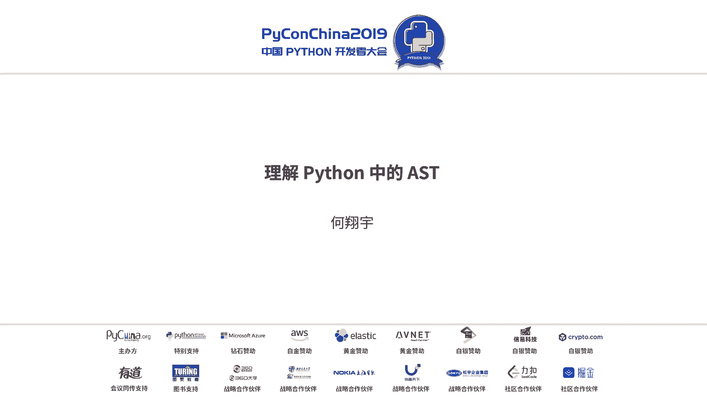
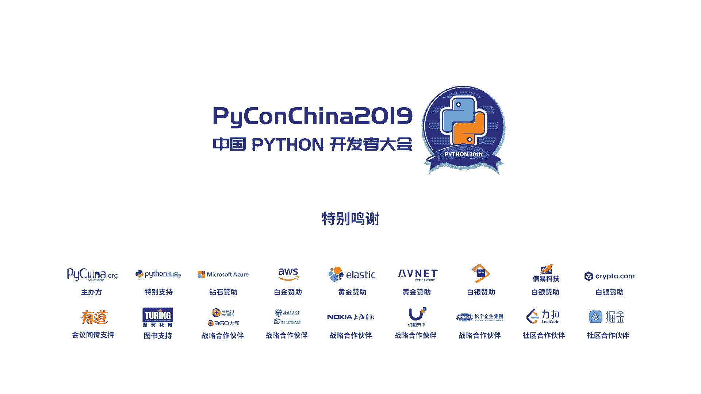

# PyCon China 2019 北京分会场 - P7：7. 理解 Python AST - PyConChina - BV12E411Y7ze

嗯，大家好。今今年我又来了，去年来看过的，可能有看到我，有可能没有看到。因为我去年在后面呢。嗯，今天呢给大家分享的是ST这个东西啊，我先自我介绍一下，我叫何湘宇。呃，有个网名叫郑小爱。

然后我是来自于字节跳动效率工程团队的后端开发工程师。呃，接着我们讲啊，这个ST呃，大家可能或多或少都听过，但是不是很多人真的用过。因为这东西说实话一般真的不是太会用到它呃。估计用的最广，也是最有名的呃。

应该是属于GS它的一个库叫bubblebubble这个库不知道大家有没有听过，或者是用过。我觉得写过JS的人可能多多少少都会用过。因为在我们的浏览器当中是不太支持ES6以上的语法。

但我们为了又要能写ES6的语法，又要能让在浏览器中跑。所以说就有了bubble这么一个东西，它能把一些比较新的语法转换成一些老的语法，这样子我们既能写新的语法去比较爽，然后又能在浏览器中跑它。

所以所以这非常重要。其中bubble的主要原理就是它解析了它的AST，然后去转换一些ES5的语法。呃，今天我会从这几个方面跟大家介绍一下。首先我会介绍介绍一下C中的一个comparere过程。

当然我先声明一下comparere过程我自己个人也不是非常的了解。因为这里面的门道太多了，我只是了解到了一些非常粗显出显一些片面的东西啊。然后接下来我会跟大家分享一下呃我们要使用ST嘛。

我们肯定会要一些库，所以我会给大家介绍两个关于ST处理的库。然后呢我会跟大家分享一个真实的场景，这个场景呢非常的痛苦。但是我们用ST做的很很好的解决，最后是一些建议跟一些参考。

O我们看一下整个on的过程，我们说的compare过程，是说从我们的s code，我们的s code指的是文本形式的on源码，就是我们真正在呃编辑器里面写出来的那些东西。然后呢他会经过一个的过程。

转换成一个一个叫解析数的东西。这个解析数呢就是说它保留了原本的一些具体语法的信息的数。这个数呢它保留一些很具体的东西啊，就包括我那些换行空格啊什么的，它都会给你保留。然后会有一个的过程。每个圈过程。

两个圈第一过程，它会把它转换成STST就是我们今天重要要讲的东西，我们先暂时略我们接着往下看然后会转成叫CFG的东西。我不知道大家有没有听过P。如果有的话可以去老爹的一些博客中，你们可以找到这两个关。

东西这不记得的东西呢。简单来说，从ST到CFG真正的是走向了backd code的过程。但是呢我们程序执行的过程，它都是一个呃有向图，就是说它下一步要走到哪里，这个他需要明确的知道的。

然后经过CFG之后，我们听过这个艾it。然后艾it才能转化成真正的backd code。这个back code就是我们真正python解释器能够执行的东西。

所以我们经常以前老的时候会有些PYC其实你拿个PYC也能跑起来。那玩意其实本质上就是back code。OK我们接下来看我们再详细的讲一下他这个pas的过程。这个pass的过程呢，它第一步是些解码。

我们都知道写pyython2的时候，我们经常会在上面写的杠杠UTF8那玩意儿就是说我这个被定义成UTF8的编码。然后这个几个PP就是说定义了它的一个编解码的形式。

比如说比如说263它是定义python的编码形式。然后3120是它的解码形式。然后这个3131是能支持一些非阿的一些定义。第二种呢。我不知道大家有没有接触过编译原理，不是所有同学都是科班组任的。

所以可能可能也没有提过编译原理，或者编译原理没有没有详细的去了解过。然后在编译缘里第一步，我们是需要分词的，就是把我们python，比如说A等于10会把A等号时把它拆出来，这样我们才能一个个的去解析。

然后这个呃在。A原理中它可以叫分值器，所有的东西都是要基于这一步先开始的。然后啊大家找一个例子，开始呢能直接那么输出。你看我们可以看到我这就是一个print hard。

print hard里面我们可以看到这个就是它分层的过程，他他他他告诉你，你看把那个括号啊，呃什么什么什么杠N啊，然后inline啊，这些都给你打出来了，这个都是我们要处理的东西。第二步处理完之后。

我们要拿这个处理成一个解析数，解析数呢是一个更抽象的东西了。其实我们大部分情况下根本用不着，它大概是这样的东西。这东西估计几乎我觉得一眼看上去没有什么人看得懂，我也我也看不太懂啊。

懂啊什么什么什么258331。但是这些东西呢呃简单来说它是定义了一个数字数字会标记的一个特殊的东西。如果我对这个有兴趣，python的官方文档中有一个叫pas pass库。

你可以进去看里面有非常详细的项品，告诉你这里面每一项是什么意思。当然这个一般我说我用不到。如果说如果你能用得到的话，呃，我觉得是应该非常特别的东西。接下来我们看它的圈放和amp的过程。比较复杂。

我我给大家简单的呃归归纳了一下。当然具体的流程非常多，这部分大部分都是用C语去去呢实现的。这个整个过程呢，我们刚刚得到了一个解析数。然后解析数的话，它要生成T它首先第一步你可能要从解析数中读取一些东西。

然后经过一个转换规则，这个转换规则，在thon的源中就是在这个thon点ASDL它这是一个AT的一个语法，你可以进去看它里面定义了很多各种各样的语法，然后再经过一些内置的东西。

它就可以编成AT的一个节点。它的这个节点是我们最关键的也是我们唯一能用到，或者说我们很容易用到它。然后最后是交了一个s处理。它创建1个CFG这个CG其实就是一个非常大的s，你们可以到on中翻译。

它里面有非常大的。就是这来处理这个。然后最后一个就是艾艾他其实就是把CMG给配平了，然后算出了他自己网的偏应量。因为在克里边，他实际上是按每个每个部分的偏应量去找到他下一个要执行多少来决定的。

OK我不知道讲的是不是有点快，感觉有点快。呃，我们接下来就更详细的哎，其实最重要的是后面的例子，我觉得例子大家更感兴趣。前面这些听我讲这么多，回去一翻其实也都有了。然后我给大家介绍一下ST相关的库。

ST相关户文只给大家介绍两个，当然有更多的哈，我介绍了一个是呃不好意思。这个抽象与法术我觉得刚才我都稍微介绍过了，大家可以看一下抽象这法术之所以说是抽象，它抽象的过程的话是一个。怎么说呢？

他取他有很多东西都会没有掉了，他只关心程序到底是一个什么东西，它程序所需要的是什么。比如说你呃A大于B，那么我只关心A大于号B，我只关心这三个东西，其他你既然你之间的空格换哪，那我都永远都不开啊。

因为对对程序来说，它并没有什么太多的用处。而抽象语法数就是相对于解析数来源，它就是说只保留了它最后想想要的东西，这是一个抽象的语法数的一个定义。其实这部大部分内容啊，在在文数里面都有非常详细的呃定义。

感兴趣的可以去翻译翻它。呃，我们先来直观的感受一下IST呃，ST呢其实非常的长啊。我们看一下这个ST这个一个我觉得大家应该都会写，闭着眼睛都会写这个东西它转换出来ST是怎么样啊？大家看一下。

这样的ST这么长，你觉得能写的话能写的出来吗？我觉得够呛能写的出来啊。所以说后面会告诉大家一个取巧的方法。我们先来观察一下这个整个的AT它主要是有几个结构构程。

它所有里面你看的那些像什么function啊，那些都是它真正ST的节点。ST的节点是我们关键的东西，也是我们可以操作的东西。所有的ST的节点都是计承于这个叫ST的定义的一个类。

然后由它继承的下面是那些各种各样的定义，我就不定样那个比较长啊，这些东西又会派生出这样一些东西，这个才是我们真的用到的ST我这边捡了几个比较重要的跟大家呃分享一下，就是我的我的模块的定义。

大家知道拍成一个文件，或者说一个包都可以定义成一个模块，然后我的函数定义，我的类定义我的负值我是不循环一还有字典函数参数，这些都是我们非常常用到的。

虽然说我们它大概有好几百个也不是几百个有几十个这子类似于这样子的ST。但是我们记住几个重要的。然后剩下的我们翻译版就OK了。然后我们不能看得见嘛？上面有个我叫王者嘛，你们点进去看一下，里面非常多。

这个是python，他带的1个SK的库，这个裤呢非常的短，官方文档非常的短。呃，说到这里我可以给大家呼吁一下，这个官方文档的中文版呃应该也已经上线了。如果有需要中文的。

可以继续在官方文档中看到简体中文的反应。嗯。然后我们看一下这个他的STST它的模块，这个他写的相当的简单，给大家抽象一下，他就是他告诉你SD模块很有用，他能干什么呢？可处理开成的语法数，这个当然不行。

大家也都知道。然后其实呃这ST是可以直接被内置函数compare直接编译的，所以这个是一个非常重要的点，这个点有什么用呢？这个点意思是说，我可以不从源码中改变我的程序，我可以在ST中改变程序。

然后直接改变程序的运行的行为。当然这个有带来了一个坏处，就是你会考过一些派程的检查。当然你最后loglog起来，取决于你到底写对不对？然后这个有个基本的类ST大家知道吧？然后就是他描述了抽样的语法。

小云吧刚才也说过了，非常多，然后他还提供了一些便携的函数来处理一些ST相关东西。然后有个SD替换的demo这个demo呢呃你们可以具体去翻一下这个文档。因为我觉得文档里有的东西再给大家列到这边。

我觉得没有什么太大意义，大家都可以看得到的东西。只不过有时候大家可能不知道去哪里看，我告诉大家去哪里看，大家去看就行了。然后然后其实官方的文档太简单，简单到什么情况呢？简单到有人受不了了。

他自己写了一个，自己写了一个文档，叫ing开山ST do。这玩意呢是对官方文档的一些补充，补充的点主要是关于它有哪些节点以及更详细的去使用ISST。当然他有没有详细到很哪里去啊。

也就是多了两个demo而已。呃，在这个文档中其中有一句话非常重要，就是它有个类叫ST呃 node这个呢我们对于一个程序而言，我们去需要解析它解析它的第一步，我们要需要能便利它。因为我不便利。

我们不知道它有什么东西。然后呢这个整个ST的这个n它是可以你定义你可以访问的规则，就是说你可以记住它，并且实现一个叫的。

然后一个node这个n就是我刚才给大家列出来那些n什么more啊呃什么啊这些东西这个名字是它找吗？从我那个文整版里面去找，你把它复制出来，然后怎么实现一下就OK了。大概就是这样个东西。这样子写呢。

他的意思说我呃想要找到我函数的定义，我可以把它辨离出来。就是说干凡是我解析到一个函数的定义的时候，我可以把它P出来。这样子就完成了一个变类的过程。这个非常简单啊，这个在文档中都可以有。然后呢。

还有一个非常重要，它里面有有一句话说，如果你想删除一个节点，那么你在这个函数里访回一个那就OK了。这就非常重要。因为他的信息非常少，基本上就是我刚才摘的这两个东西，就是他的中心思想。

它里面没有更多的东西了。所以说SD对于普通开发者而言确实呃第一次接触不多，第二次你接触到我你也不知道该怎么办。因为官方文档真的太少，你去google或者是啊百度就不说了。

就是说就就是gogle文话上面搜信息也是非常少。因为确实接触的不是太多。然后呢，有一个非常大的问题。大问题就是我1个ST我从代码变成AT好说。但是从SD对我们代码的能力，官方的是没有这个功能的。

那么哎呀有些东西就是官方能力不够，社区来造的，很多都是这样子。然后有个人写了一个叫STOR这种这种这种东西，这个东西呢。他是通过通过阿米写了一个课有之英点PI直接编译，直接把它反编译成一个他的原码。

能译越多圆码。阿米来上海了，大家一没去。然后然后他还有功能能打印出美观的ST，它便于调试。大家看到我刚才那ST这么长，你要是他给你打了一行里，你根本自己你拿手你都分不出来。美个的号法，那个真的太多了。

接下来就是一个提供了非递归的能力。大家知道树有一种递归便利，有一种非递归便历。当然了，非递归便利，我们能比较好处理的一些东西。递归便利便利的方便，处理难，非递归是递归简难，处理简单。大概是这么一个东西。

我先呃pass了一个played2加3，然后我再突source一下，他又回来了，这个非常有用，特别是对于我们普通开发者而言，我们把SD解析完，然后再把它导回去。O。嗯，接下来我会重点的跟大家分享一下。

我到底是如何使用我的IST解决一些非常实际的问题。首先大家还是看到这个函数，这函数没什么特别的。大家注意看一下这个print。print有用吗？我知道啊debug的方法大家都有。主要分为几种挡牌。

第一个是print的，然后一个是第八个的。然后print档其实非常多啊，我本来也是print的。但是print多了之后，你会发现有时候你不想删他，不想删了之后呢，你会发现一个问题。

你的print的越来越多越来越多越来越多。当你大到一个无法想象的时候，你连删了他的动力都没有了。那你你要去删呢，你愿意删吗？1万个难受，你一个个删，万一删万一万一删错了怎么办？

所以一个比较好的方法是把它删掉。呃，其实也是把它替换掉了。首先我们对于程序来说，我们尽可能的不去改它，我们不不去删它，但是我们可以改它改改成什么样呢？我给它改成个令，行不行？

我们用mon意去把它给定出来，呃，可以瘟印，我们可以有一些一些一些一些功西，我可以把它转换到一些我不重要的地方去。我这样子程么序呢？我即使出错了，我能把它找出来，但是我不会改动我任何的源码形式。

因为我本身是想打印出来。所以我现在还是把它打印出来，只不过换一种式。这养几不出量的问题，你有这这样子一个这样的一个这样的一个再来一个再来一个再来一个。那改吗？不改啊，这玩意儿怎么改啊，谁改谁背锅。

是不是？你改改错了就就真的就完蛋了。那么有个非常经典的东西叫C。这个我能不够用，当然可以用啊，这个我认为这个这个搞定懂人的。😊，当我说的是这个牛编辑这个这个方面。这么一个搞定了搞虑台招第bug了。

我们的需求就完成了，可以下班回家了，对不对？1万个函数，我就是把这个批发软件便定出来卸了一下就完事。个人发现问题。这如果不能一撤开，没那过我就跑不起来啊。😊，怎么办？这真的是C的，真是太厉害了。

我再来一下这个有了。呃，直接把一在第一行就是加上啊这个整个C，大家不用关心是什么，你就回去说实话我也不太会写，我只是查了一下，然后把它老老把它提出来。这个就是我直接在第一行插了一个in。

然后再通过这个这个替换把f替换成了in点击bug更全部换掉。换掉之后，这回不可以下班了吧，这回再下班，这回再下不了班，真的对不起拍摄了。那那那那那那大家觉得能下班吗？我觉得下班回去也得被后悔了。

为什么呢？😊，这样子的配则怎么办？这样的说你怎么办？这样的怎么办？这个他只会替换t，但他不知道ttter是什么东西啊，我我可能是一个函数名，其中方法人叫，我有可能是装着器，他有。

然后我觉得preretter你面再个t，这个怎么办？他如果是这的话一替换，他会把所有替换掉。然后你觉得他们可以运行吗？我觉得够呛，他们真的抛不起来，但是。有时候嗯需求总是要做。

问题总是要解决程序的代码的好处就是帮我们解决问题，快的解决问题。我们可以看一下。首先。既然说我们自己的解决不了，那今天大家知道ISTST肯定可以解决啊，因为它能辨历出它的语法数。

便历出语法数的意思就是我能找到我play的这个函数，我这函数这边可以的，我只跳理这函数，我其扯不动，也就能说呃我能很好的解决这个问题。但是大家刚才看到我那个那个IST这么长，你你你你要自己去写的话。

根本不现实。所以说处理IST的一种常用的方法，就叫我叫他找不通，什么意思呢？怎么找呢？这个是我们刚才的print的ISP。这个是我听望的log in之后的IST大家有没有发现什么不一样的？我觉得调调化。

很大一部分时间是在走不同，你看一下到底哪些地方不太一样，嗯，你就可以把画给调出来。但是呢对于我们这个人言，呃，程序员总是比较懒。所以说我们有了这这这么一个东西。我直接定住一下。付一下找到了。

还有两处不同。第一个呢，它这个包里面多了一个in，刚才给介绍大家介绍过一个inportinport就是SE里面呃的一个inport的 mode。

第二种不同就是你看它那个me里面那个codecode里面的一个放着一个它的名字之前叫t，现在换成了叫 build多给你，然后inport大家看到这两个记住这两个下边的是怎么样的。

然后你默默的把contrl see一下，因为后面会用不到。然后呢，其实其实刚才通过这样子的，我就能。好的。我就能这么写。这么解大家注意看啊，我下面那个AP扣里面是什么呀？是刚才我们con C的东西。

你把它con C过来，然后把它复制一下。就完事了。这时候他的input那个robin已经替换完了。接下来是input的问题。那么input怎么去解决它呢？因碰呢他我们刚才看到了。是这么一个东西。

它的功能里面。那么我们注意看啊，这A子D所有都是python的语法。所以说一部它是一个例子。所以说是不是很容易，大家想到没有？在波璃里面直接在钉里落位有插定落了，OK也就可以搞定了，大概就是。这时间。

这样子这样子实现啊，这样子实现了，你就可以真正的完成了说我在。从语法层面把这个print替换成了录印，这样子我们才可以真正的去下班，要不然你真的永远都没有办法下班。这个是SP1个最简单的最简单的应用啊。

就是替换一个节点。另外一个节点呢呃它的启动的原理就是这么多。第一步找不同，第二步copy一下，第三步写一个定例函数，把它复制进去就完事了。这玩意就是这么简单。所以有时候有些东西呃是自己。

大家自己把它自己给复杂化了，所以有更好的方法去解决它的时候，我们就不要选择一些奇奇怪怪的方法。然后呢，这是一个非常简单的例子。非常简单的例子，我觉得大家都说这么简单的例子其实也不用教。

我这个上网一查都有。确实这这个确实网上网上有很多，大概类似于这样的东西。就是接下来给大家介绍一个我真实的工作的工作碰到的问题。是这么一个问题，这个是刚才呃弄出来的原工就会变成这样子。呃。

首先我给大家介绍一下我这个业务的背景，这个背景呢特别的简单。问我大家有没有学过RPCRPC有没有碰常会定1个IDL，不管是还是RPC你都会定一个叫IDL的东西。IDL基本上是描述了一个接口。

这个接口它呃非常简单，我这里用H来给大家假装下我有了这样一个这个IL我在什么意思呢？我这个com里面包含了两个我这个货地址呢写在下面然后呢我这个货呢有两个命令，一个叫li，一个叫up然后呢有两个叫特。

然后呢。刚错了，加装是一个RBC那个大家不要太急约，太执着于他是什么东西啊。然后呢，我想把它生成，因为对于IDL来说，我们调用的方式都是统一的。我们需要把它转换成一个可执行的东西。

当然这玩意儿肯定是执行不了的。所以我把它转换成一个东西，我写一个的PY。成这么个东西，大家看一下这个东西，我让大家看一见，这个东西呢非常简单啊。也就是说我这个假装这个RPC code呃。

是一个HTTP的request，然后我通过com来区分出我的这个函数，我这边就是把这边转换过去，大家能非常清楚的看到这边转换怎么写，我觉得大部分人非常非常容易写。这帮人转过去呢怎么写。我其实非常简单。

我写个我能从这个转换成那个那是相当的容易啊。这个我只需要写个自创模板，然后去填充一下就完事了。所以我大概写出来是这样这样的一个东西。我就是通过封面的sp拼接一下字符串，然后就可以很很快的方便。

大家看到我这个各种各样的方面的s，然后通过把它加起来。然后唯一要注的问题就是你得处理一下锁定开成那个不处理缩定会出错。所以这样子我们第一步的需求是完成了。那么完成之后呢。假如某一天，你的一个同事说。

哎我要把list给我们加一个东西，我这玩意儿我就不想让他教育教育用户，因为我觉得需求变了，教育用户没有用，我就把它给换掉。换掉呢其实方法非常简单。你只需要在整个这个函数生成的代码里面啊。

大家注意我的用词，生成的代生成的代码里面把它加上一个参数，我叫一个 user等于处OK这边会有什么问题？这边会有一个问题，就是说。呃，我加上了这个参数，但是我的这个这我的这代码怎么来的？

我的代码是tempate去生成的那我下次再生成它的时候，大家觉得这一个就是而为在嘛，我觉得肯定没掉了，是不对？没掉了，这个是件很危险的事情，你有可能真的就报错了，报错了然后就剩下个事故了。

事故的人就被太熟了。所以说所以有时候也是比较危险的。但是我们想想，我们应应不应该在他这里加。比如说别人家里在行，找你来扣，找你来扣的有view，你说你不应该在这夹。呃，人家说是我也知道不应该在哪么加。

但是呢我不他在家，我去哪家呢？我不能说呃我的这个代码在十几个微博中被调用，就是说我这开可在十几个微度中会被用。我不能十几个一个个的去改啊，或者说我给你改一下，我自己再去我自己再去派升级一下包。

这个也很难。假如我我几十个，我几十个，我可能我更新一下再上个线，这个一周就过去了。那么其实这样子呢，也就是出了一个问题，就是我大家都知道你只要在里面写是很不好的。因为我是生产来的。

但是你跟真实的业务情况相比的话，你真的是非常的脆弱。所以说呢。这种问题就导致了什么问题呢？就会导致会不会不改。被覆盖掉的原因呢是说我们这个是生成的。所以说我们生成的话，我们得想办法去解决它。

解决它的办法。我这边我我只是我只找到了三种。第一种是人肉修改客户，也就是说我不使用我的ide去去生成。我只用人工的去写写成这样加一个可不可以当然可以，你这样子写，就我交易PY没有用。

当然你大家去人工的去生成这种模板式的代码都没有任何的意义，这完全是可以通过自动化去解决它。然后还有一种方法就是假如说我我发现我再加一个参数进去，就我再的时候，这时候能不能做能不能不能满足呢？可以满足。

但是下一次下一什么我我也要讲我怎么进去再去写个if么当然是也是不现实的。因为我们从软件功能上角度来看，我们能不就不改。但是呢有时候必须要改，那怎么办？所以说我们只有一种方，我们在生成新客户端的时候。

我不去覆盖老的客户端，是不就完事了。但是问题又来了，我这我这玩意是用t去生成的，我没有办法让他去生成的时候，只生成一个老。呃，只生在一个新的。当然我知道可可以解决啊可以解决。

但是你需要自己处理很多很多的东西，你可能要需用大量的一些政策表达式，一些计划的东西。这个在处理上是非常麻烦，而且也会引入。刚才最开始给大家看的那个例子，政则表达式，它处理的是文本，不是语法。

所以他会同为无伤。所以说有个灵魂拷问，我每次在新生的客户端的时候，我怎么忽略到老的客户端，就是我写的时候用成user的时候，我我就放在那了。下次生成的时候，我绝对不会替换它，这样子能不能做到呢？呃。

可以，而且方法很简单。你我没有AST这个东西，AT东西一路。我要知道我的方法有哪些啊，然后这个ID要做做一个比较，如果你可以找出来说哪些方法是新的，哪些方法是旧。这么行。大家看一下这个这这个代码。

给大家详细的解读一下。第一步，我先把它转换成一个ST。第二步，我创建一个方法名，这个就是呃我新增的方法。第三步，我看我这个看我这个class这个便利的这个这个类。

我visit一下class defined，我就是说在class defined的时候，我需要进来处理OK我进来了怎么怎么样处理呢？OK我处理我的body里面就是一个一个的函数的定义。

所以说我看一下它是不是函数，函数，唉，我把它atend一下。我这样子就能把我已知的方法，我存在的方法都给它找出来了。OK我我我作为一个参数，我返回出去，返回出去就好说了。跟我的ID做一个比较。

我我就能知道说哎。我的这个到底是插在了哪里？所以说这样子的第一，我们就完成第一步，我们知道的方法有哪些。OK老方法知道了，现在是我们要呃找到新的方法，新的方法其实就相当的简单。我就是跟我老的对比一下。

然后我再把它插进去，就是在我的开始de的时候，呃，我往我的包里面再插一些东西。然后我的那个新增的呃一些东西，我在刚刚那个时候已经把它跑出来了。我这个的时候我只需要把我新定的东西给它添加进去，就完事了。

所以很简单，就这么写。所以我来来回回就那么三四行的代码。所以大家我觉得大家学习一个学习一下非常容明。然后这么做呢就完事了。传授了之后呢。这个是我科我风险的。东西我都擦一下，会光写这么长。

大家我不知道大家记得有没有我刚才我说过了这个东西这么长怎么办啊，我们有个东西叫copycopy怎么用呢？跟大家说过了，把2个AC打出来，然后把它copy过来，我这个就是这么干，这个绝对不是我手写的。

这个我自我可以发现这么长的东西我是肯定不会去选的。最以说最后会变成什么样呢？这样子。OK这样子大家看到啊我的list box原来有up date ball呢。也是原有的。我新添了一个叫delete。

这个时候你再去看你通过ST转换出来的罗码以后，你就会发现哎我脑子没有变。我新的也加进去了，这时候我就能满足我的需求了。我既不动脑的又搞了一个新的。所以说所以说呢呃ST呢大体的作用就是这这么一些。然后呢。

我不知道大家有没有我讲的有没有讲的太明白啊。我我今天今天比较激动，所以可能没有讲太明白。但是总体来说，ST的能力就是在处理语法能非常的简单。呃，更准确说是非常的精确。最后大家给大家一些。

如果你们恰巧以后有机会可以用到这个IST的话，大概你需要注意这么几套东西。首先正的表达式是处理的最象是文本绝对不是具备语法的文本。什么叫具有语法的文本。比如说你写的thon，然后PY文件。

这个叫具有语法的文本，它是不适合处理这些东西的。处理这些东西的时候，你就得非常的小心。因为但凡你碰见两个同样的文本，它都会直接把它处理掉。所以你最经确的方式是处理它的ST，而不是它的文本。

其次呢在处理SNT的时候，注意的三步嘛，找差异写便例口学pa。大家前面给大家介绍过好多次这个三个方法，大家紧急这三个方法法，我觉得解决99%问题是没有问题的。然后呢，还有一个就是我最开始提到的。

如果你直接改了SD，然后去comparere，你是无法保证正确性的。因为你绕过了很多东西，前面的分词啊呃解析数啊，你都把它绕过了，所以这个。呃，可以用，但是最后不要用。然后呢。

每种语言都有自己的IST它的他们灵活使用，他们功能很强大，他们能处理一些语法上的东西。这些呃一些我参考的东西，我讲的东西在这边都可以找得到。除了那个我的第二个例子是我自己写的以外。

其他这些都可以在这里找么到。大家更详细的可以去看。嗯，OK其实我的演讲就到这里结束了。但是呢我还有最后一句话想说就是。派成二快狗带了，大家快先派成三吧，这也算是一种呼辱吧。OK谢谢大家。这个然后。

提问的请举手。我们这边。呃，老师你好，我想问一下，就是刚才那种用SST加参数和三不加参数，那么的效率的话是有一样的吗？呃，你再说我表明就是用AMT的那种方法，加那个参数和单独就是退股的话。

它那个效率上的话是有。一样的有差异吗？补是什么意思？就是一个一个有填再加一个参l默认参数那个呃，我ST最后又转换成PY文件了。所以跟你所写的是没有区别的。啊就说哦就是换一种形式。

效率上是一样的那我1个PY文件没有道理，我用AT生成的会比手写的更高啊，他们都是一样的，都是一个点PY文件。哦，即系开开惜啊。还有其他的题了吗？嗯，你好，有两个问题。

然后第一个问题是就是之前从那个编译好的那个，比如说KYC或者什么，然后再去往那个源码翻译的时候，其实之前我也做过这种事情。其实它是会有一些这种就是信息的丢失的。

你不可能完全恢复到他原来的那种一模一样的心态。然后这种的话就是有没有一些之前一些坑，比如说你编过来，然后再反推回源码的时候会出问题啊，这是第一个问题。

然后第二个问题是其实我们这边就是可能大家也都会有这种需求，就说我可能有些业务逻辑，我其实是想开放给用户去用的。比如说我希望用户能够去写一段代码，然后我去执行它，但是又希望过滤掉其中的一些危险操作。

这种其实你可以去用沙箱啊，或者是比到时去隔离等等这些都可以。但是一些箱来比较重对吧？但如果说我用AST我去干掉其中的一些危险调用。这个我看其实有很多人就说在提到一个方法。

但是好像并没有就是总是在说这种话其实是有一些漏洞或者是。就是可以绕过去的一些手段。然后其实你要做也不是很安全啊，那在这方面就是你有没有什么这种就是了解。呃，首先第一个他转过去。

首先啊这个是一个非常规操作。它转过去确实会丢失一些东西。但是呢我至今并没有遇到过，说我转的一些会丢掉一些东西，99%，我认为我猜测99%都有可能是正常的。你只有那1%级特殊的情况。

这个如果你想知道它哪一些会丢，你可能要真正去看它就那个我给大家推荐库就是SPR，它里面具体的实现是怎么样的。所以这个可能非常抱歉，我确实也不太知道这个第二个问题呃。

是说就是说关于你贴的问题说删掉那个是绝对不可行的。我们在写代码的时候，我们绝对不能去删任何东西，删掉东西其实操作很危险的。所以说我们不会过滤掉一个。呃呃，不安全的操作。

我们我们正确正确的做法是我们有个审计，我们那个叫代码审计，这代码审计它能自动的给你标识出你这玩意是危险的，你需要给我重新提交一个不危险的东西，这个才是这规的手法，而不会去把它删掉。因为一删掉的话。

你不能保证会影响什么，包括你去删漏，有有可能删6的也会导致一些问题。所以说呃它本身的方法是不对的，应该去审计审计的，就是通过ST的方式去便利它的语法数，找出你未选的操作。比如说我。

up我up一个myscle当中的一个字段。唉，我的这个字段是不能被类操作了。这时候我们通过AT你就可以找得出来，哎，他在用mysrcle更新的语法在他在更新这个字段，这是我自作危险的。

这是审计的一种常用的方式。所以说你刚才说的删除绝对不是一个好操作，更好的操作是去把它找出来，然后去通知开发者你需要修改。

