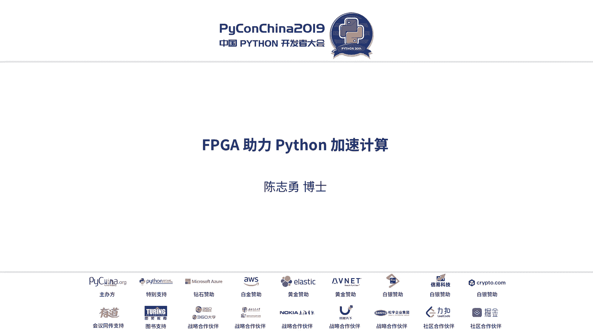
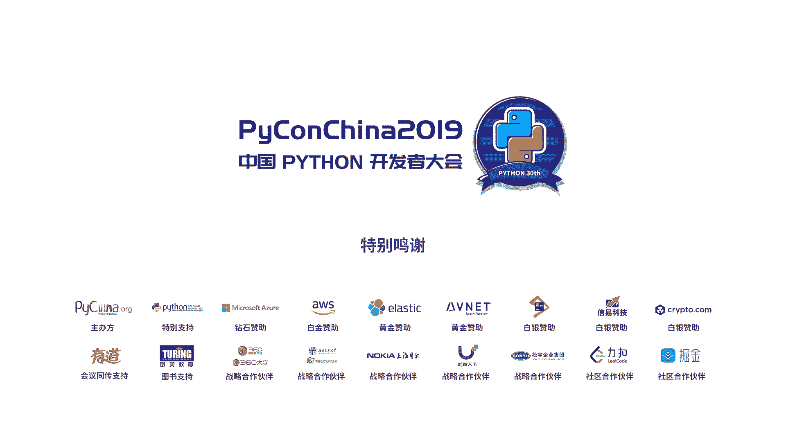

# PyCon China 2019 北京分会场 - P8：8. FPGA 助力 Python 加速计算 - PyConChina - BV12E411Y7ze

首先感谢大家时间啊，大啊，下午听还有这么多人真的是是常少。这个在你之前跟IPK这边的培训有两个跟大家分，一个是我们当时培训几乎没有，但是难受。因为坦判讲，我们是是硬件硬件女孩接触的现太少太了。

第二就是这个我这基本上是最后一个话题，就是目前还有这么多人还在听。其实这个。所以我呢其认有我来自于UMB公司。因为大UMB可能并不是特别了解。后面也也介绍。我这次主要讲这个IPJ啊。

这也跟大家可能关系不是特直接。之前啊，所以我先问一个，或者就是大家呃以前用IPJ做过设计，甚至在大学学过IPJ选修的，请举二手。在抽个时候。还不超是个。啊，好谢谢谢谢。

所以呢IBJ对这个对传统软件工程师来说还是比较过深的一个。如果大家只学计算机科学的话，可能没有学电子电路。对个IBJ可能奥数的逻辑都不是很了解。如果要学电筑工程的话呢，基本上对这个还有一个概念。

对所以呢这边是之前我在跟那个thon组委会啊，其实有个讨论，就是在thon工程师关心的问题有哪些。所以这里边列了一些包括语言啊、工具啊、应用，然后生态环境，这个其实大家可能比我还清楚啊。

就这些thon的一些优势但是呢怎么用thon开发这个嵌入式产品，我想这个大家其实怎么接触的不是很多。因大家可能都都是在这种呃服务器啊，他们这平来去做，真正做嵌入产品的话，这个标准。然后呢。

包括之前你们很要接触硬件啊，所以我这次本次提供的主要内容的话题讲到我从thon怎么通过一个工具，把它电脑FPJ里边可以实现的代。然后呢，我怎么叫算法速以及怎么叫并跟计算。然后呢。

赛连斯啊就是赛斯售务原厂，它是有一个PG芯片。所以他的芯片，它的工具怎么支持on语言，以及目前我们主要用在哪些领域啊。其实呃刚才很多人其实我在我们的展台，刚才有两个演示，一是跟我有过一个是图片分类的。

可以看到我们的小板子凹596啊，很多人问呃，你这版跟这个数媒派有什么区别。其实这个其实能够到这个问题的话，我觉得这里面是是入门，就是说知道哦想用切入式做的东西。其实数派的话呢。

可以理解它是一个就的多的一个呃芯片一个一个SOC芯片。而我们呢除了R在里边。但我们那个板子是两个两四核A53啊，然后呢还有FPG逻辑，我们封装在一个芯片里。

所以呢既有R又有FPG所以这从这个层面来说的话呢，我的这个处理性能要比那数媒派要高出蛮多。所以尤其我在FPG逻辑里边他会讲到我怎么把一些算法给它加速啊去去做这事。呃，期融计算切融计算的话。

大家可能也知道，就是说大家如果呃可能现在工作呢，大家可能接触不多了。但是之前读书的时候，这些词我估计大家应该都知道MCUDFPMPJGPUAFP啊，比较呃我今天听这个讲座比较高兴的一啊。

就是在上午的那个AWS的这个。那个那个那个老师他讲那个呃那个就是lemon，因为在有硬件环境不支持的话，他提到了这两个词，大家不知道有有印象啊，这是我在今天的会场上第一次，那是第一次看到FPJ这个词啊。

我不知道大家对这个词有没有说有没有什么理解啊，所以呢其实这是一个很重要的一个基算平台啊吧？而且在切入事故前是蛮流行的这个。然后呢，我们材到嵌维计算，这些都是我们百书上也是找出来的。大家一一看都明白。

做一个类似于一个专用的针对某些应用的一些小型化的机器啊，就嵌入平台，以及我们怎么做加速计算，我们怎么提高效率，用什么框架，用什么方式啊，其实大家如果在做嵌入开发的话呢，这个加速运算还是很重要。

因为我需要在一个很小的一个硬件平台里边达到一个很多的性能。怎么把算法做的所谓算法的优化。另外你算法的并行化，以及你算法实现的优化。其实这很容预算考虑。因为在一个很小的产品里面的话，要把性能发挥的极制。

这是一个这个每一个做产品工程师要考虑的事情。这台P啊。就这么四个词叫fe现场可定这个是在part和之前啊，因为我给大家能先讲一点。

我呃我们在9几年当时做编程的时候就会谈到part了就是学术数字逻辑就是我们说的以与后为文触发器就这些东西然后IP只把它做一个整合，做一个很大规模的一个门真力在一起。然后设计语言，刚才那个才有人还问我。

就是你没有什么设计语言啊。其实我讲说我们叫硬件描述语言叫HM吧？它就专门用一个语言来描述，很类似于啊主要是这两种这个其实很类似于C了，很类似于C这个是比。这个的话。这个可能语言从来说可能不一定很类似啊。

但是这俩个功能是作为硬件模户语言，他要把这个用力语言，把这个雨获飞文，把这个逻辑描述出来。然后呢，主要实验功能，我们在最早可能在8几年赛公司是84年成立。对最早话就组合逻辑啊，就就做雨后飞文啊。

做一些基本的一些逻辑组合。后来有计录器记录器当时最有用的什么呢？就做那个存储器的地发生器。这当时我们在编列的中做这块啊，后边开始就算好了。

然后后边这种SOC就我们现在用的啊加上IPV所以呢很多工程师其实很难理解这个S这个算法这块怎么用IPV实现。就是我一个算法我们用这个逻辑的后飞文去实现。这个对很多工程师来说，可能他很难去理解啊。

这是如果做IPV的话就知道其实任何的算法都可以一那种硬件逻辑雨后飞文触发器去实现出来。比如说用用用了很多近似的方式，我怎么实现K根号，我怎么实现一个除法，这个是怎么实现一个九个标系坐标。

这些都可以用IPK实现出来啊，这个可能大家呃。其实这里边有一个很多题概就风裂肌肉染啊，他是用一个逐次逼近的一个方式，把一个公式用逻距门给它写出来。然后另外的IP的这个应用。

其实跟刚才在这个展台有很多的你们P主要做P其实我们很多的应用的是什么呢？从这从这啊通讯通讯一直是我们很大的市场。所呢从去年中心包括其华为在美国的一些这个禁售，其实IP是一个主类级别。

因为这是在呃国技电路里边它是最重要的一个新品啊，所以我们在通讯一直是在我们整个的这个市场客服大概这一块，以及目前我们新的市场在工市场这块也是很多的应用。

然后在一些消费类广播类包括A系这块这个IP的用里面很广。其实在纯消费类IP做确实普通，因为在中国AC上添讲。但是在这个非消费类甚至一些主消费类产品。IP的话用可能还很多。

然后包括现在我们的旗舰空间很多了，就不光是不光有你们包括包速接口，包括啊。包括一些IP盒啊，带有什么存储。以及还有一个就是我们我在新一代的1个PCE加速法。

大家如果做一些加速或做一些呃包要做一些那个AI的训练的话，都用到英伟达的那个GPU嘛。所以我们有一款很类似于英伟达GPU的一个加速法。所以我这里边主要实现了几个主要的一个应用方向。

做金融计算数据库包学计算和视频转化。这是我们目前有一款新的产品就加就是在04边除了芯片，还有一款加速款产品是类似于英伟达的显卡产面。这是几用。所以呢IPC的话经过这么多年从84年到现在，从它的功能层面。

通过产品形态层面，应用层面做了很多拓展。最开始的话，其实通讯是占了百之七八十的市场。但是现在通讯逐渐大概只有50%其他的新兴市场是越来越多了。就是这个希望工这一页我们大家对IPV有一个比较全面的了解。

就是这么多年的工艺的发展，包括它的功能的发展，以在产品形态以及应用的拓展。啊，其实这么多年。あた。这个就想一下吧，就是他什么创意计算一个计算。这是我们呃我们IBJ的团队经能培训的一个路径。哎很难理解。

就是我IBG为什么快。其刚才很多的老师也讲到了进行计算啊，其实我们这里边也讲到了并行计算，就是我一个离合器，我数据器数据出，其实我这数据这些预算跟一个尺打。而你要传统的这个，不管是SCDIP，你是循环。

你就很多时钟。所以都是结本的话就是我如果我这个芯片主频，我只有600兆，其实IP主频不像大家想象的，我一个G呀1。5G啊，我没那么高啊，跑不很高600兆。但是我用一个时钟把这个这么多成法，你现一下打完。

所以我的这个每这个600兆的SPS就是三通倍的这个速率。如果我这这到250兆一个时钟我还要250个M三通锐。而你的电N力甚至更高的一个G，但是你有一包一个循环，所以你摊下来的话呢。

其实你算下来你只有8兆。所以这个比较形象的讲到就说我定行计算的跟传统的串作计算的一个优势。所以刚才其实这是硬件一概念。其实在软件开发过程中，大家也遇到，比如很多刚才也讲了。

就拍摄语言刚才哪位同事老师讲的说说就种拍摄语言里边也能。内含一些并行计算的一些思路。这样的话可以加速各种算法的这些预算啊，其实这个是整个的这个产业界，要考虑怎么创新，怎么并行，怎么做的，通并行算。

把这性能提高的更好。完了呢，其实呃对通品加速的概念的话，可能最早是来源于我们做仿真啊，开始的软件仿真，通用软件my livelink做了一些软件仿真啊，这个是软件仿真做什么慢。对，这这怎么办的话。

如果我之前做无线通信嘛呃做了一个。呃，模仿一个系量模型，然后求一个BR的一个呃一个一个呃过马率，可能跑下来要大概几个小时，这是很正常啊。甚至如果你要定点的话，定点的话，那只能报好十几十几个小时。

后来的话有一点真，就是我的东西可以。啊，可以在这个通重的环境把你的算法都加速啊，这个是一个很很重要的一个问题。就是我可以在您往平时做算法验证的时候，我通过一个硬件打子嗯，帮你把这个速度加快。

这就讲到这个就是这个我们叫哈州外录，就是从微硬变来。通过一个硬件平台啊，其实我数据在这边产生。然后但是我跑啊是在那个靶子里跑，然后结果可以显示出来啊，其实输入和结果显示都在PK上程。

但是我这个实际跑的运行在我们个开发板上，这是硬件叫我们在哈都尔一个路这么一个概念啊，所以呢这是呃刚才讲到分布阶段运行计算，包括是我们现在包括我们现在做一些数据库它做啊先做一些啊。

这个是分布是呃计算平台以及这个函数与编程这个部分是比较火的一个star，其实函数与编程它。反一就是一个并形的一个概念。它是通过各个函数之间独立分成，函数之间通过一些互相传递数据能。

保证这个还是会独立的去。他这影很类似于刚才我提到硬件的并行计算的概念。在很多年前我就说到物语，大家可能还如果掌过还可是叫handtherC，他认里边就是把这个进程，就类似于这种情况，哪个进程可独立编程。

进程之间可以通过通道来传数据啊，所以其实在软件层面，就是纯软件编程层面。通过这种函数的编程以及多进程的编程，这可以实现一个并行计算为。这个讲这对明对吧。然后，其实我们对这个说呢IBD的话从并理计算。

你还有一个加速，就怎么用我的硬件逻辑，再把这每个并行化的算法再度加速，这以得用入这理层。CIP简单介绍一下大家如果学过的话，可能大概也不了解。其实我们就是一些一些文件路啊，就堆这就就一个文件类。

很多很多门。但是现在功能比较强了，有有些存储器了，包括有些都4IO了，而最新的那个器件上那板子上呢就把一个R有些不是一个，是四个啊有3放进去去个SOC了。所以呢传统的就是这样啊。

就就是认为你是堆是堆文件力。然后呢，现在新的功能就是包括而且我们处理是以腮国来做，我100到之中大就达到十0大表。所以呢我们都是几几个塞就几个腮做。所以呢你可能想象一个软件里做，因为都是淘秒级的。

而我们做的话都是那。其实明秒我们都都能跨过去。所以这个硬电跑的话，或者要100兆的话，我一个三个只有10万兆。其实这要几个三个就能做完一个事儿。其实你就几十万的做。这个跟那个纯软件去做完全不是。

没有问题的啊，所以我包括这些地处化器啊，这些进行处理啊，都是这个。所以大家可能多常这间了解后，因为整体的这个处理的这个方式跟传统的这个软件的cycl。当然我这也比较塞除。

但他对整体的还是这道题还是差的很大的。所以这个相当于我的每一个指能的处理要快很多，而且又加上一些病情计算。这就是我们呃介下一下赛0斯这个较新的1点16万米的。

这也就是我们展桌上展示的那个小板子的一个芯片，里边有4核A53啊，4核A532个R5呃，包括我的就这个有电源管理，然后里边还有一个马丽400的1个GPU啊，就显示这的，然后有一些多速的接口。

然后还有里边还有一个规定的编码解码，对吧H点4R5编码解码。在这个已经是的，就跟大家传统的理解并些不太一样。就是这么多功能，我放在一个芯片里头啊，就是这原来传统文发就黄色这种逻辑啊，现在我有有些处理器。

然后呢还有视频编辑码，还有一些多速的我里边有平台硬顶盒，包括100G的这个麦。大我说硬件可能会了解，就是现在的IP已经是一个很综合很综合的一个器件。

包括说现在呃已经推出来的7纳米的这种就是我们叫七纳米器件系列，它已经把一些IP的地术核也放进去。就是说在IP越来越综合原来超过了之前我们对IP理解啊，就后飞门就这些T触化器T触化器。

这已经远远超出了之前的一些一些理解范围。这功能也越来越很大。为什么好多人问我哎，为什么你们做AI性能那么高，这功能这么多，而且不适合软硬件划分啊。

所以我们为什么做这期件就是软件硬件都可以一起来协工作软件做软件的事，硬件做这件事。硬件就做加速软件就要操作系统你的做业务啊，协议站啊，其实这是软件划分一个很好的一个一个一个架构。

而且是在一个芯片实现这个在目前业界的话还不太容易找到这么一个完全其成。分系的方案把软硬件都结合在一起，这不是很容易的。然后呢，讲到这个这这个其实大家可能慢慢的会了解了一个，就是呃可能因为大家一直做演件。

可能用C吧。呃这个可能也比较多。其实ence这几年他一直想降低这工程师用FPG的门槛，就是大家说在写HDL语言，还挺痛苦的，真的比写C要痛苦多了啊，这不是问离的这是。

但是呢我们怎么样学C的工程师更好的用IBV做这明一个很重要工具叫HLS高层次数据。而且在这方未来的5年甚至十年，都会以这工具作为一个核心引擎去接受C的开发环境去做。

所以这里边可以认为就是他有一个C语言转成硬件语言的一个工具。它这个编析也认为它这个compiler啊，然后他可以接受CC加加呃呃opCL啊，包括它可以输出这些代码RU它通过加一些约束来告诉你这个。

你硬件实现的性能，包括假如你C写个副循环，你副循环你展开的话，你是流水线形式，打你是个否循环，你是流水线走呢，还是1个B型走呢？因为。硬件的这个病情的话，它是以牺牲这资源来来做代价。你实物我就还。

如果中间可以独立的话呢，我是用10个。呃，运算单元抠背过来同时跑啊，它是以牺牲这个逻辑资源作为代价。如果你你如果你用那个呃呃流理电方式的话，你可以相当于省些资源去一步一步走。

所以这就是其实我们是通过这个硬件来实现这个东西。然后这个工具主要的话我加预测，其实给大家一个简单的理解，就是说高层次的硬件开发工具。然后呢，C开发者属就是大家可用C去实现1个LP设计。

然后反这个就讲到以后怎么用C去写C的，它其实就是C的一些用C的语法，它是分成C的语法啊，除理一些特殊的一些C的它指令，包括指令它它是指指，就类似于呃特殊的一个C的一些指令是不支持，然后呢。

用C的非读语法，用硬件的设计思路，所以你这个减C的话呢，是C语言，全都明白。但你的C的话，其实你是有硬件的一个想法去写。包括你方说循环，包括你一些呃存储对吧？其实做软件的话，你们可能对存储没么概念。

就直接就是种指的这些证。而我们在做硬件时存储要考虑你是用发译组家。forfi这种处理器还是用双可能可能说知道。因为你们做存储都要考虑这些硬件能西。但是我们这里地方你是用阵列。

你用fi还有双是端去怎么去存你的数据。这个就要在C语言里要去想这个去定义这个跟我们传统的这个C代码编能就差别比较大。你当时纯C的话不用考虑这些事。但是呢对于我们硬件的话。

就要考虑就是要有硬件的思路去写C啊，这就是我们对这个HL语言的一个模度。这个工具是一个很就在目前的业界从C语言到IPJ工具呃比较成功的一个点啊。

这个很方便大家就把一些C的算法直接通过这个编器把它转成FPJ的这个载。我这个讲一下，就是呃赛尼斯的openC部。其实我们当时那边的那个光流就是来源于这个呃公流的。啊。

这这功能工程中这个函数就赛尼斯他也做了一些一些他是基于开源的欧enCV的一些函数。然后呢，他经过赛尼斯自理工程师的优化，针对赛尼斯器舰做优化，针对赛尼斯的工具做优化。所以呢这些函数这前都开源的。

可以让客户呃基于这些函数做一些计算机视觉的一些应用。所以你可以看到，就是我们这边的话欧中间的函数跟原来的函数基本上是一样，它的功能基个参数都一致的。所以当大家都便使用。

我们只是把它做为一个其实做一个硬件实现啊。这些函数是所以我们叫函数，把它是在C环境里在用的。那通过我们那个HS工具，把它转成1个IP放到我们的ID些模辑里做。所以这这是一个。

所以呢大家知道就是IPC怎么做一些视觉的啊，我可以利这些函数去做一些视觉应用啊，这个直接当你在这当中一个苦在C里去较用可以以及客户还可以自己手写一行一行的把这些东西都可用阿前语言。

就硬件标录语言去写出来啊，所以这都是有很多方法去实现视觉的应用。这视觉是仅次于这个通讯这块在IPC里边用出最广的一个领域。通讯是最广，一直是百分五六十的这么一个市场份额和应用的群体。

然后视觉目前也是最多啊，也是蛮多的一个一个一个应用方向。包括现在的AI。然后现在就呃讲讲这个我们FBC跟那个呃thon是怎么结合起来的。所以呢这这个的比。

所以我们这张那张易拉宝用这个词叫thon是的O芯片就是我们那个有芯片那种器件。所以呢是这么一个框架是个软件框架，你通过一个件框架，然后你去实现你的python里面通过一个我们到需要显示器，它不叫编译器。

它显示成它叫映射的我们底层的硬件逻辑把它变成一个硬件逻辑层的夹啊是这么一个东西。呃，所以呢我把这个pin的一些解释放这这是原文，然后这边做了一些呃中文注释，就是pin式的软件框架。

我们这里边很重有一个词叫olalayolalay可能狗软件的人不是太理解，但是境界里边是一个目前比较流行的一个词，就是说我把一些事先做好的IP。是从们的硬接IP组就这哈到这来说，他本身也这么写。

睡家好像。我即下个日咧诶铺嚟。就硬接IP怎么把事先做好就已经进电化啊，做1个OO类放上去。我其实我上边的里面就是怎么去调度的OO类。我后面会有一个呃代码给大家分析一下，就是怎么用的OO类去调用它。

然后怎么去实现。然后呢OO类可产生的O类的话，这还得要传统的IP的工程师去做啊，这个一般你就相当于你做IP啊，这还是1。1点的传统的IP工程师去开发，就是OO类。然后呢，这里边大编提什么呢？

就是说需要呢如果你拼个环节做好以后，你需要一个。IPC工程师，你把这个O类这个算子设计好，然后你还确实需要这个软件工程师把这个驱动度大，非得把pin的扩散大会以后。

然后才轮到大家就纯做拍摄语言的工程师才基于这个P的环境去做这个设计。所以呢这个P准环境搭开以后，才能有python工程师在上边做进些应用啊，所以这个是这么一个。

所以呃所以通常你要做这一个嵌入式环境的话呢，呃还得需要有一些硬件工程师这里搭底层平台。然后上边测了工程师，还有这个python。只以说现在我们这个下边硬件的一些外设呀，算子库啊，都是很很流行了。很很。

就是连5件蛮多本都开了的了，推些用宅已经会比较方便了，就不用再从头去开发那家硬件外设啊，算已经不用那么辛苦了，大部分已经可以拿来直接用。

所以呢目前很多会员可以不直接基于这个P的硬件环境和软件的孵盖环境去直接开发pa子的算法。哦，这边又讲到了那个呃在C拍on，刚才上一位那个老师也讲到了这个对吧，他解释了呃C拍。

其实我们这个配这边是C拍对来写C，所以它整个支持你们C里边的接库和代码都是支持的啊，所以这个跟大家呢以前用的习惯是一样的。呃，另外一点的话，刚才讲的这个我们的开发环境。

我们这个是有一个是基于外汇的一个开发环境，它用的是这个交户啊，用它做一个开发的一个一个开环境去做。然后呢我们的主机后s在哪里？就是我们那个SOC芯片有。

所以呢hos你可以用器啊这里边就有那个ipad和 server在那个我们那个小板子里边的ar在做这个大家我不知道什么东西这这显示个ho大家可理解后做一些PC机服务器。

但是我那个里边的这个也是ho可以在上面做开发做调试，这就是一个很实时的你可能很难理解我在一个硬件的小板上做一个开发。后s是里边一个芯片。其实就是这事。然后然后通常常规的那个拍on的调试的话。

可以抓你们的原PC机这种去做拍on调试也是OK的那这样的话呢，你可能无法用到它的快设，而且它的调试可能比较慢。而你用我的按这个芯片的板子做调试的话呢，它整个去用硬件做加速。

它速度会会比你正规调试在PC上要快很多。因为你这些调试PC上所有的算法全是在处理线。而我们用这个这子，如果你做为调试的话呢，它有些以成造流量做加速的。所以就就这三页大概讲了就是pin是个什么东西。

是个远程框架。然后呢，我的开发环境是什么？然后我的调试方式啊这些东西。其实有一个刚才讲到也很重的一个词叫，就是我们叫harware library。

它lib这词其实本身就是指的是呃这个就从软件来说是个酷酷的类，对吧？我们硬件一般都是IP我们硬件已经很少叫libry。所以呢它叫 library，有的时候你在C或环境下可以直接调。

IP的话是纯硬件开发工程师的一个词。那这个讲到后边目前呢就是目前整个P个社区的一些东西，就是包括我们怎么在客户自己的版上，就是大家自己的版上啊，可以做搭P平台，然后做自己开发Ppython的应用。

然后这就讲到来我怎们去做OO的就是这些这个做的话确实得要硬见工程师来做。这讲到OO洲96板子，就是我们那个上面展示那个板，就是我们怎么用这都是这用传统的SPD工程师去一。点把开OO来做出来。

这都是纯硬件用，只是过目前这开源OO类的资源已经很多很多，包括常用的接口或常用的一些呃算子都有。因以呢很多的做算法工程师的话，直接可以拿来去用这比较方便。

但是如果目前这个在开源里社区里的这个算法不支持的话呢，那必须你找一个有硬件经验的人就有应有IPT设经验的人，把他这个IP或这个算法给它写出来。就怎么搭建这硬件库，就是说如果没有这控，你需要这个算子。

没有的话，你真得要用最原始的方式把这个硬件库给他写出来。呃，这就是讲到这版子了。那这这这幅图可能在我的一当中也看得到啊，然后这些是呃赛是赛德斯，这是这个新的原厂啊，包括我们的定子芯片。

因为我们这个做销售的话，好多是基于开发板。所以呢我们这个天板这个呃使用啊，包括测试呃调试这些都是出版重药，怎么用啊开压板，怎么用开发环境，对我们做一个很好的一个清入产品都帮助会很大。好。

这个就是我们目前做P2。4，这跟你的拍one的版本不太一样。拍用的是3。6，就是我们目前发布的P2。4的版本，就是包括这几部分，一是拍one3。6的版本，一个是这个赛林斯的，有一个那个208。

3的我们一软件版本，以及现在我们一个赛斯的P的一个这么一个库，其三类加在一起，就是我们目前的P2。4版。结果你这是替的些方式呢传统到我的开子，就这些这边大配。啊，这个阶段也变较。

然后加上这个三会有这些他做的一些。这个这就是找运理工程师，要把它这个库一点这扣款搁在一起，变成了我们这是一个整个大的P的一个电框架。然后这一页也是讲到就是分几层，就是这一块是我们的叫逻辑。

就是我们的这个一些逻辑门。这就是从这个粉色的，就是我们相当于我们的一些硬件IP啊，硬件的就我们的后类容啊，然后呢这边是我们开发环境啊，怎么去通过这个这是一个C的开发环境基于C开发环境调用调用的。

然后呢上边就是用你们的应用去做一个开发啊，这是整个是个的一个携带的东西。从下边最小的最低的这个一个流，就是这的流到这个驱动到API调用到非后上层啊。

这是整个基于赛斯的一个C的开发环境的一套的一个开发流程。如果说嵌幕式的话呢，这个SPSSOV就这个这个软件的话呢，其实还是需要大家可以去了解啊，这是完全基于新人的环节。

基于P的这个一框架去做这么一个嵌换式开发。然后呢，咱刚才讲聘用的这库，其实目前的KA库其实蛮多的。大家可以他可以去看这些呃，因为有一个社区呃做了很多库。KA很多我们不需要大家从头去做这些库网。

包括成规的外设，成规的算算。其实我们只要用这些现成的库，把这个P框架搭起来。所以呢python的工程师就可以在上边去开发纯python的算法。这都是啊。然后包括天园社区，其实里边因为我都都蛮多。

人可以看到啊，就是很多人家也比较熟悉的一个东西。经经历了这么多有些项目都是基于P的去做。这里包括一些P一些连接，包括我们一些官方的网站，包括社区，包括一些有些开源的一个P的项目，一些文档。

这个目前的话已经大概有45年的这个这这个过程。所以呢整个的这个从文档啊，这个包括一些呃开源代码啊，包括社区支持啊也还算都比较完善。

所以确实也是希望就是呃通过这些拍送的工程师可以用的赛斯这个SO分析件做一些小小的一些嵌换的产品。这个我想对大家微对产品的公司帮助还是蛮大的。另外我这里就讲了两个案例分析啊，讲一个啊。

讲一句案隔例这功路流就是后边我们当时有演示，就是那边呃靠这边的那个一个演示。其实呢这它就是是这么一个场景。这个纯我们这个单位是比较什么慢？一个是纯软件，还有一个是硬件两边比较怎么做一个呃软件怎么慢。

硬件怎么快，就做这么一个加速的一个性能。然后这是软件协件全部是一个纯在CPU跑，我这逻拟就这么逻辑测优好，这个就是我的我的这个呃就硬件跑完以后，它的性能大概看的性能最弱，我这北表一个是处理时间。

你是没有处理这个帧速啊，比较软件跟硬件的一个差异。所以大家想理解这个硬件加速，它的它的加速意义什么意思？就是我在我的一个纯软件CPU跑的东西。我通过我硬件逻辑度加速。

我可以达到每秒可能达达到一个实时性啊，一个原来可能北表只是。四五帧我可能每秒或者几十帧啊，就这么一个叫硬件加速的感。因由于在图像这边是以每秒的帧帧率来定义这个加速的这视。

因为这个demo也是展示了软件跟硬件的一个比较的差异。这上都有一些开源的连接，大家可以有兴趣的话，可以可以读读上传代表。呃，这就是代表的。我我拿出一部分代码，所以呢呃这一块是垂网，大家可能看的很很熟了。

然后呢，这边是我们要把刚才说的O类，把它要加载进去。所以呢我要通过这些东语句，要把这个OA要加载去，然后这块调用。这边要调用所以这块就是调用我O去实现这东西啊。

所以你大家看到这个红色这两句话其实功能是一样的。只不过我这个是在CPU上纯C比较好。而我那个是在逻辑上做一个把下边的一个硬件库或调用。然后刚才也提到了这个存储这块，就是我们在硬件存储的话。

不是简单的就写一个存储是吧？就不再的存软件那么方便，但是它可要给它定义你的你的这个高，你的窗口吧，你的高，你的宽，包括你的是整形还是浮简型，所以呢在硬件实现这些呃存储的话呢，可能要对你的数据类型。

包括你的数据的这个size，要一个比较清晰的一个定义啊，这个确实是一个硬件设计的思路，软件设计可能就不用考虑这么多东西。所以你可以看到那边是硬件加速代码。

一个是m的这个改变定义以及一些怎么调用底层的那个硬件库。两边红色的这功能是一样，比如说这是纯的一个C的呃纯python的一个调用，那边是个硬件和国类的调用。然后这边讲到拍摄。

其实我们在一些AI的编计算也很有很多的东西，就是赛尼斯去年收购的这个北京的深界科技啊，然后其实有一套工训类，完就可以做AI的。其实刚才也有也有这个呃有人做的就说赛斯可做AI。

其实我们是有一套AI的一些开发环境以及一些AI的IP在赛尼斯的器舰做这个AI的做。我们这边主要是做一些部署和推理这块。呃，训练这边的话，因为是就浮点的不多。所以呢呃因I这边并不是很擅长做浮点。

至少目前是这样，所以呢我们主要关注在。合金粉这边啊。那这是我们有在在艾这边是有AI的开发工作链以及一个IP。而且赛尼斯现在有一个mod度。这个他赛迪斯自己开发了很多这个呃这种神经网络。然后呢。

这些网络客户可以拿来直接用，而且甚至这些网络后还可以拿来他自己的数据做腾讯，从去微调，然后这个网络可以方便的部署到赛尼斯的旗件。所以赛斯里这个A这个网络的这个这个企业啊是每个季度都在增加。

所以赛斯AI这边的话还投入还蛮大的。一方面神经网络它逐渐在完善。另方面它有布序链，以以及有IP来实现这个AI在艾特。这里就讲到另外一个就是我们有一个马达通制的东西，其实也是用AI的概念，用P的概念。

然后做一个可预测性维护。那我我就知道这马达什么时候失效。我通过那个红色这个圆的那个是是不是原来椭圆啊，还有个缺点啊，能知道你这马达的状态，现在是不是有问题，这就是估业这块可预测性维护。

其实这里边也用AI概念，就是它通过大数据训练，我知道在什么时候这个原是什么状态，是马达是什么毛病啊，也是通过AI的形式来做一个interest来知道一个马达出于什么情况啊。

所以这也是在艾端的一个P的环境的一个一个一个应用。然后呢，发想到这个就是在这个云端，这这加速感，这就是赛尼斯一个类似于英美达显卡的一个加速感。我们呢也是插到服务器上可以做很多的处理。

所以这个卡线不前应用也可以接受一些拍on语言做部署，然后包括做一些呃做一些AI的一些在云端在真能用，目前支持的这些框架以及支持的一些网络啊，包括一些文等啊，这些资资源都是满全的。包括你们这个宽带。

这个宽带大家可能对，上边应该都比较熟悉。那下边的话就是赛0斯的这个呃IP，包括赛0斯的开发环境。然后上面基本都跟日软件工程师之前做的很类似。所以呢在云端揽售位这边，34也提供一套完整方案。呃。

这一页是我跟上海那边不一样的一页，就是这一页我新加的。因为在今年的10月2号在这个呃美国的圣合赛赛格斯开发者大会上宣布了这个软件s就是叫我们叫统一平台。就刚才我听到这艾端在云端的那些软件呃。

现在都整合到一个软件，包括个所以得看看到下边是我们的硬件，中间是我们状态库，以及这是我们的开发环境，上边这条库，这是目前核心的东西，就是我可看到我们在AI到视频的对接码。

然后那个视觉以及大数据分析金融包括云第三方的库，啊，都会放下来放框架来做应用。所以看到我们在爱端和云端是基于这么一个框架就果。其实中为营销广告的。其实呃。

这些尤其数据库网和金融这块都是我们会些新的一些金用领域。在一些大数据，在些云计算这块要做的事情。已经远远超出了前几年，我们只专专注在做艾，做一些通信啊，做一些工业呀啊，这是之前我们做的一些主要方向。

那现在的话呢，基于大数据，基于赛林斯那个呃1个PCE插卡。在那个加速法。我们其实在很择新的应用里边，也是逐渐在在在采取一些有些新的项目在做。然后呢呃这一页大概介绍一下。

其实大家对安福利不是很了解安福利其实是我们是一个呃半周体新门代理商。那现在的话我们会在专在一些解决方案这边。所以呢跟赛丁斯这边是我们原厂，我们基于赛斯的IPJ包括开发板做了很多方案。

所以呢也是希望通过这些方案能更好的去支持我们的客户。另外我们团队里大概在中国区啊，我们整共有70的人都们在中国大概17个城市。是目前大家有知道边国内IPJ团队最大的一个知持团队。

另外我们整边我自己有人的技术对战团队，包括有一些做新望处理的相货设啊，中国L以及还有设计服务团队，他给客布做一些参考解决方案。然后我们还有很多技术培训，包括很多演示。所大家看到那个桌子上的一些演示啊。

那些东西包括我们有一些教程，这都是我们这么多年一直在为客户，希望提供一个比较完整的参考能地和解决方案，支持各项的一个方向。这是我们。也都是。呃，这一块的话就是刚才讲到了就是我们这边两个演示。

就是一个是包邮的，一个是图片分类。就大家有兴趣可以可以去看一下啊，去去配个环境做的这么一个东西。其实谈到两个方向，一个是AI的方向，一个是教机视觉。然后呢。

这里我讲到的就是我们这个9个板子大家看呢就是这个上面的小板子呃，是基于4和V53的。然后呢，我们希望通过这个板子的话呢。

有一个统一平台可以跟这个我们广大的这个拍社区on开发者呢建立起一个很好的一个社区的互动。我们希望有些培训活动啊，包括有些生态环境，希望能更更好的做一些呃比较实际的项目。

以及包括一些算法来专注是在视觉AI大数具，以及在产品层面，我们希望有些小量样机这种这种合作。因为我们这边毕竟是硬件为主的一个呃这么一个环境。所以呢针对这个做嵌入产品，做硬件的公司的话，其实是比较积极的。

所以我们的应用领域也主要是中在切入式计的边缘计算。主要是这样的东西。因为我们呃专注在边缘计算这话，会有更加注重这个产品怎么去落地，更加做出一个范围产品层啊，这是因为这从硬件层面。じ。

另外呢话我们也很希望有一些呃更多第三方，更多社区能跟我们一起来推动这个python的加速计算。啊，因为这是我们就想通过这种高层语言，怎么通过我们底层的FPJ的逻辑，咱把它的性能提升，通过并度计算。

通过加速计算，把整个这套东西做一个呃比较好的应该生态的比较好的一个扩充啊。因为大家之前可能更多是基于PC机服务器做python编程纯软件。呃，怎么去拓展python语言在一些加速计算。

在一构平台里的应用。其实这是我们呃很希望跟各个社区跟各位开发者一起来合作的事情。好，谢谢。啊，这是我们公司的微信公众号。大家有这里什么不了解的话是可以了解的。😊。

