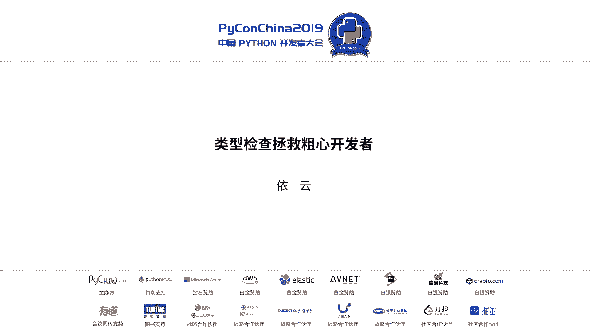
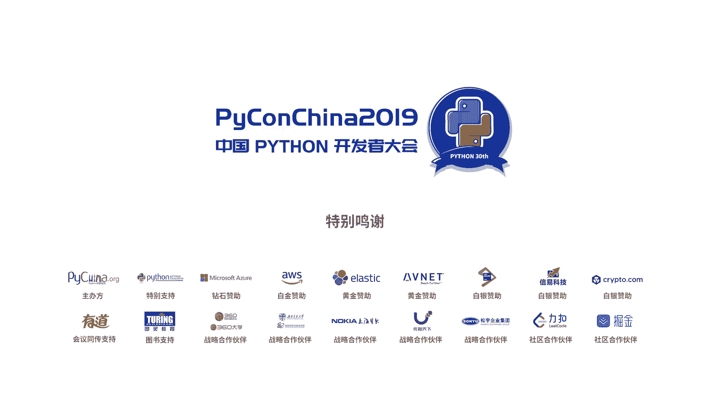

# PyCon China 2019 北京分会场 - P9：9. 类型检查拯救粗心开发者 - PyConChina - BV12E411Y7ze

我们在开发过程中是不是经常会遇到这种错误？本来代码逻辑写的好好的，他就莫名其妙的出来一个H id。我们有一个边量一不小心被我们弄成了no，然后他就会找不到我们所需要的方法。看到这个错误。

其实改起来很容易，但是每次就是改了再跑，改了再跑。要比如说像这段代码，这是一个tomatoto的外面的开hand着了。如果在忙碌过程中，我们写这样的业务代码，看上去是没有问题的。我们首先要获取。

用户要访问的是哪个页面，然后我们去获取数据，对吧？又或者是这样的一个很简单函数，我们去检查这个文建明是否是我们预期的后缀。大概也没有问题，对吧？但是呢这样的代码如果你真正跑起来，跑到了它。

你就会遇到类似于这样的错误或者这样的错误或者这样的错误。等等等等这些他款案子。为什么会遇到这种错误呢？因为你忘掉一个小小的内心转换。这是我真实变成过程中经常会遇到的。一个得快速的参数，本来应该是个整数。

但是忘掉了转换，然后跑起来就会出现各种奇怪的错误。对于这个代码就是我前几天才刚刚写出来的。X位他可以接受接受一个tople参数。然后因为。本来就是函数调用嘛，有一层括号，然后很容易就忘掉一层括号。

然后还不容易看出来。这样的错误在我使用python编程的过程中经常会出来。我曾经以为判审编成就是这个样子。会经常因为我自己的一些粗心大意，然后就出现一些。很低极的错误，然后我就回头去改。

改了再跑跑了再改。直到后来我看到了这么一句话。如果他通过内心检查，他就能够运作。うん。这是一句非常非常美好的话，为什么呢？因为我们知道。当你代码实际运行起来之后，再处理错误是很麻烦的。

可能你得传到服务器上面跑，可能他跑了好久才会遇到那个错误。如果你有测试的话很好。但是呢这个测试你可能得比如说花半小时才能跑完。或者你需要有一个队列去等待你的测试宝。而对于内心检查的话。

就可以在你刚保存代码的时候，他就提示你，你这个地方有问题。但一直以来，类型检查一直只有静态园才有。我看到这句话是当时我在学hs school，然后。就遇到这么一句我非常羡慕的话。但好消息是从拍摄3。

5开始。可选的类型标注已经让python也有一个静态检查的能力。虽然没有hand子狗那么强大，但是已经非常好用了。比如说这个函数我们只需要增加一点签名上面的类型标注。然后当我们把它交给类似检查器。

你说完这里交给卖fi，他就会告诉我们，你在了第二个参数，第三个参数，他们的类型不对。当然这个报酬有点莫名其妙了，其实我没想传那么多参数，但是没关系，因为这个错误实际上是非常。明显的。

不就是弄了一对括号吗？我一看代码我就知道了，对不对？然后我就可以把它改正。我根本就不需要运行它，我就知道哦，这个地方我不小心漏了一点东西加上就好了。另一个经常出来的问题就是被称作10亿美元错误的浪。

那在在其他语言中也一直存在，比如说C的那指针，还有java的notpointex等等。但是当然派摄员有了。类型标注之后，我们可以使用Otion这个标注来完美的解决这一系列有浪引起的错误。怎么做啊？

比如说。我们一开始的代码是这样子。我们用某个ID去获取用户，如果找到，我们就返回一个用户对象。如果没找到，我们就返回那这个逻辑相信大家时常会写到，或者你的同事会写了，然后你就去调用它。

然后你就会一不小心忘了检查这个用户到底存不存在。但如果你就这么标注一下。告诉我内型检查器这个函数可能返回一个Uer对象，也可能返回no。他是一个可选的。这样当你在调用的时候。也在他得到一个返问值。

但是你不能直接访问他的属性。因为他有可能是那。那开会提醒你这个地方。它的内型是O型的 userer，不是Uer。所以你呢要首先检查一下。当他不是那的时候，我们才能访问U者的属性。就通过这样的方式。

如果你的代码通过内型检查。那我他当然会已经处理掉了所有了那不管你是想怎么处理，反正你不会忘掉他。嗯，当然有一点比较遗憾的就是mfi或者其他类型检查器可能有一些bug或者呃不完全不完善的地方。

这个真在使用的时候需要注意一下。卫心检查器。最出名的就是拍摄官方推崇的买拍，也有官方的开发者参与。另一个是facebook用ca写的。H they check。据说它的特点是检查起来速度非常快。

然后google也写了一个是叫拍 type。最近微软也放出来一个用taxscript写的，叫quiite。嗯，这些类型检查器我目前使用的是买拍，因为。当时我用拍 check的时候。

就发现他会要求你所有代码全部标注。安排拍呢可以允许你部分代码标注，他只是检查你标注人的部分，没有检没有标注部分，他就当你什么类型都可以。拍 type我。曾经尝试过一下，但是没有发现他特别优于买拍的地方。

pilight可能以后有机会我会尝试一下，反正就有这么一些简查性，大家可以。看喜好选择。因为python把内型标注这个东西通过一系列PEP给标准化了。所以呢大家不需要担心你一个。检查器认识的代码。

另外一个检查器不认识。嗯，什么时候使用类型标注呢？但是呢这个是可选特性。所以我个人是这样想的。如果呢我的代码非常简单，可能就几十行。然后呢，我可能就跑这么一次，那么我就不写恶心解代。

因为写了可能也没太大的作用。反正一次性的通常类型错误是发生在你。处理负担了。项目的时候，尤其是当你重构一个项目的时候，你很容易想着你的业务逻辑，想着你怎么重构呢，然后就不小心忘掉了。这个函数。

可能返官那那个函数可能接受类型不是你传给他的，或者你弄了一些参数等等。这时候你就可以花一些时间去把你的代码给标注上。而且可以1。1点的标注，不需要一次性的全部标注上。这样就你可以非常。顺滑的去。

根据项目慢慢的添加类型标注，让他越来越好越来越好。

