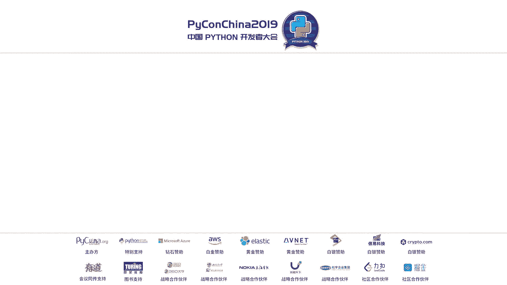
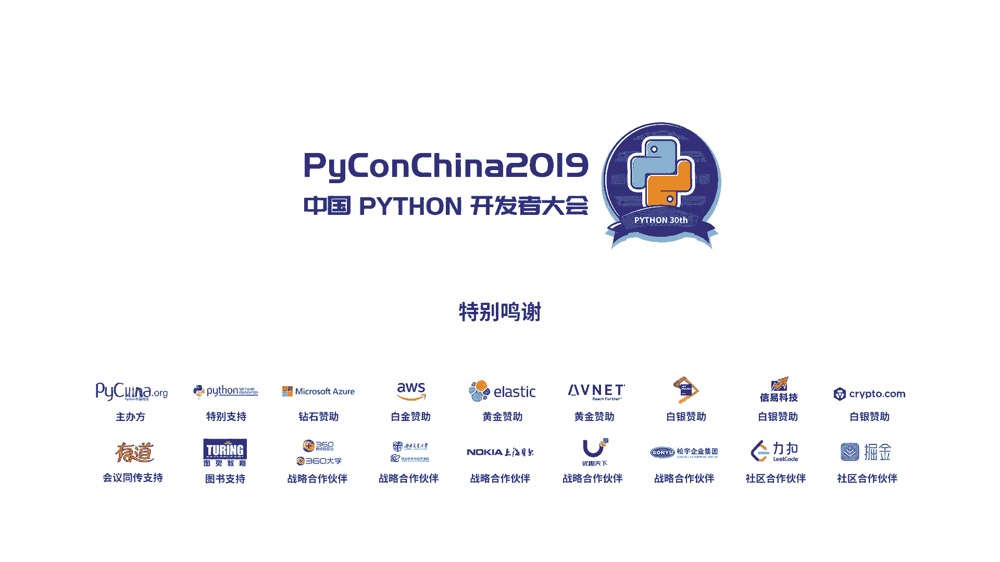

# PyCon China 2019 成都分会场 - P10：10. Python 的 NLP 实战分享-如何实现合同风险预测模型 - PyConChina - BV1mE411v7t8

大家好。Okay。今天我想说一下，抱歉，因为今天早上本来是9点要来这的，可是实在没有办法，但现在能见到大家，我很高兴。那这个时间呢由我来讲一下拍送的自愿语言处理的实在分享。OK首先介绍我是谁？啊。

我叫唐静明呢，这个是我的大com，大家可以或者我当成日语学习。然后呢，今天的这个资料已经上传这个G大。有的部分看不清楚的话，大家可以下载自己用电脑看也可以的。然后好。

那我是在一个GV tech公司做积极学习工程师和数据分析工程师。然后我们公司是在日本的东京。是做那个法务方面的人工智能的工作。因为我们公司呢除了开发部门，还有就是那个法律的事务所。

所以我们手里有很多关于这个合合同这呃语言数具。那么今天呢主要讲三个部分，派ythonB入门就是很简单的东西和多语人B攻略，主要是入门和中文的比较。最后讲一下合同分享合同分险。预测模型的实战分享还很难。

你普通话说的比我还好，谢谢。😊，好，那我们就开始吧。那第一节呢我可以简单来介绍一下这个处理资源源处理MIP的流程和利用语料库做数据分析的方法。那大家有做过这任员员处理吗？有有做过两个人。哦不是很多哈。

那那我选题选对的。好，那首先呢一般不是。MP呢一般不是说是余料开始。比如说刚才老师也在讲，就是一个是爬虫，一个是比如说你的公司或是大学具有的这个语言数据，还有是。啊。

语料库从语料库可以就是取到语料也可以。然后之后呢就做前处理，做前处理的时候就删掉你不要的一就是一些特殊符号等等。那把这些处理好了，呢就可以分词了。分词的时候就可以做语义解释分析。I。啊 sorry。好。

嗯。处理这个的说，大家有没有想过专员处理呢，他到底在做什么？实际上资然员处理是把文字如何处理成机器可以读懂的数字的一个值。所以呢我们一般都会就是分完词之后，做那个向量化。

变成ctor或是可以变成tencel之后呢，放进模型里面。这样我们就可以就是放进机器让这个模型学习。那有的时候还会把语义分析的结果做成一个feature，然后放进这个进行模型里面。

那这样模型就可以学到很多语义方面的一些知识。那我们分词其实还可以做一件事，那就是EEA。刚才举所的那些同学有做EDA吗？嗯嗯没有好。那我们一起来看一下什么是EDA，为什么要做EDA呢？我们一起来看一下。

这是ET是一是一个就是分析数据的一种方法，就是探索性数据分析。大家想一想。作为MNP每个领域的语言都具有它的领域的特征和倾向。那我们就是别的领域的东西都放在一起来分析，我觉得这个有点不合适。

比如说收集一些网络的方才的八卦的那个东西也可以，就是网络上的语言和这个文学作品上的语言，一起来比较的话，有点就是很多地方会不一样的。那在这里我想强调做NAPP大家一般关心的是他的具体的方法处理的办法。

可是如果你不知道自己就是手里有的这个数据到底是什么东西，有什么倾向，怎么处理，什么都不知道，然后就去具体的处理的话，在中途你会就迷茫的就迷路了，不知道自己在做什么。所以呢。嗯。

我今天介绍的是就是EDA有很多很多种办法，不是今天介绍的是用这个cofaBCCWZ这个是一个日本就是最靠谱的一个cofa。来做此类的分析方法。Oh sorry。

那这个方法就是首先我收集十0万条这个合同文章。因为我公司有很多合同的这个文章。然后呢，从这个BCCWZ取出来别的领域，比如说图书还有新闻，还有杂志都可以，别的领域的语料来做benchmark。之后呢。

使用同一个分词方法来处理各个领域的这个词，就是原数据做一个词类频次分布表之后，再把它就是它的频质高的地方涂上颜色就变成这样的。y。然后这个图呢很小，对吧？这个数字大家看不清。

飞瞎就是下载那个哦那个最大资料也可以。现在主要是看它的颜色。做出来的东西。那个上面的黄色的部分是。哦，所以但大家看那个浓度就好，浓度就是数字越高值越高的地方，它的浓度这个颜色的。颜色也越浓。

然后黄色的部分是出现单词总数的百分之比，然后绿色的部分是出现单词，它的总类的数字的百分之比。那上面是多个言领域，我选欢了123。567890大概是十几个112个13个。那我们看一下。

大家有没有发现我收机的这个合同文章是最嗯右边从大家看是左边左边的这个东西，它的颜色和。法律文章是不是有点像？有有感觉吗？有。然后那这个合同文章和图书或是杂志，还是什么别的课文呢，完全不像。

那我大家可能是在想这这个一行一行到底是什么？那个是就是上面是名词啊，动词啊，形容词啊，一个一个这个词类它的百分之比。那这个就是说明，比如说这里面还有一个这个叫叫怎怎么念呀？引引文就是说这个诗啊。

什么古代诗啊、诗歌这种。那诗歌是这这一行。然后它名词比较少，动词啊、副词啊就是修饰修饰的东西特别多，所以它的颜色就变成这么浓。然后我现我在这里想讲的是。不是说这个颜色的问题，我是说。一般来是做原处理。

做hositive negative的分类，大家有做过吗？就是一个文章。它里面比如说又在安里省买东西，有很多这个评价，这个分析这个评价到底是评价好呢还是不好呢？这个叫s比如分类。

那这个时候大多数是比如说用这个知识库的文章或是博客的文章，在这种领域的文章，嗯分析的比较好。可是。不放在这边，然后就是我在这边。那比如说我想用我们这个合同的章也做一个或是的分类的话，能不能做好。

看这个图就可以猜到，大家觉得能猜的好吗？就是能预预测的结果不好，嗯，我也觉得不好，为什么呢？这里面有一个可能是看不清楚哈。有一个连词就是连接词，一般的这个合同都是第一条什么什么什么什么，后面来一句。

但是怎么怎么怎么样，然后再来一句，那么像像这样的场合怎么怎么样。然后但是它的语义呢变过来变过去。那这样的时候就是一般用go over就的话分析的还是不错的。可是这种合同啊还是法律文章呢。

它的语义就是变过来变过去这种的话就B是嗯它的结果是不是很好，我们要考虑到这个 prediction像那种。才可以就是处理好。那这张这张图呢，我是给大家介绍，不是说我涂颜色来玩的。

是说其实可以这张图就可以告诉我们很多语言的这个倾向和领域的特征。导致就是我可以后面做工作的时候，要选哪一个model也可以能看得出来。好，那总结一下，就是说那使用co做EDA的话，为什么要做EDA是。

为了掌握就是把握自己的数据形象，这样可以后面的工作的处理效率可以变高。然后选那个model的时候就是有把握的。然后选完model出来的阿你也也可以，因为你知道你这这是自己的数据是什么样的东西。

所以吐出来的结果呢，就是也看得懂。好，那第二节是多亿元人民币攻略。嗯。不好意思啊，翻两页就是挺难的。好。う。😊，OK首先介绍一下英语和汉语和日语，这了三种语言就是哪里有不同。英语的话。

因为它已经一个一个单词是分开的，所以我们分词的时候不是很确力。那汉语的话要分隔词数，然后之后要分词。那日语呢就是更复杂一点，它还要有一个叫同意出现形式这个工作。哦，另外我说一下，比如说德语。

德语是英文语言，可是它还是要分词的，特别是名词或是俄语，还是就是俄罗斯语或是芬兰语呢，它也有这个活用，一般都是英语和日语有动词活用，这个大家都知道。可是芬兰语和俄语呢，它动词名词形上是会有活用。

所以也要统意一下。那我刚才说的同一出现形式是什么东西呢？比如说汉语汉语，你说什么吃这个动词吃了没吃，你切开这个吃一个还是一个汉字，那手机这个名词也是就是出现的形式，但是一个可是到日语这边呢这个动词。

因为有活用，所以你要变成它的原形，还有名词名词最麻烦了。就是说一个名词有就是日语的汉字，然后汉字的缩写，还有偏加名的加汉字，还有拼加名，还有偏加名的缩写。然后还有一个叫半偏加名。

就是把这种东西呢都要统一一个形式才可以就是处理好。那这个工作反正我是不想做的，很麻烦。那一般来说，很多工具可以帮你处理好。可是有的地方嘛就是工具处理不好的地方，我们还是用人工。自己用手来处理。

那这里这个就是很多公式分词的公式。英语的话特别用力，就是NTK我觉得只有。这个这个最简单最入门。那汉语的话当然也有很多。嗯，我喜欢用结巴，然后日语呢是我再再介绍一下。大家有没有处理过日语呀？没没有。

那以后以后哈。所以如果要处理日语的话，就是像汉语的结巴一样，日语也有就是特别有名的工具，就是叫梅卡都，这是第一个。然后可是这个梅卡都是它的里面纯纯粹的 simple process就是说马尔科夫过程。

汉语是马尔科夫过程吧。所以呢要加一个词典，那词典比如说你要处理新词或是固有名词的话，就第一个这个叫new用这个词典好一点。那做数据分析的话，第二个这个做用用这个词典好一点。

那还可以说比如说你想分析韩语分词的话可以自己做一个词典换到这个梅卡都里面它就换名分词了，所以扩展性很强。然后还有三个，还有一个橘梦，还有in讲man。那这个橘曼呢在日语里面是它的分词功能。

就是它的进度特别好，分的很好，可是很慢。嗯。因为就就是很慢，大家记住就是很慢直放，就这样就记住了。好，然后这个第音章呢是。2019年大概4月吧，新出来的一个分词，这个可以也可以分词，也可以做语义分析。

所以这个很方便，大家可以试一下。然后语音分析的话，还有卡过其活动的话这种东西。那我在这里讲一下。日中语义分析的不同点。看一下汉语汉语，因为要分词嘛，分词的时候，比如说太阳把花子就分成太郎把花子。

发自把太郎，你分开了之后呢，哪个是诗氏，哪个是宋氏，你是不知道了，要给他一个标签。那日语的话有一点不同，它有助语，就是说。太郎一个主语，画子一个主语，然后这是动作的打。

那可试实后面一定有一个就是表示主体的这个组词吧，还有有一个表示受诗的一个主语。所以你如果后面要做日语的这个事实收式分析的话，把这个副词也一起切成一个单词放在词典里面的话，会分析的很好。

为什么我要在这里讲这个东西呢？因为我用的是合同，合同有甲方和乙方甲方给乙方付钱的时候，你把甲方和乙方颠倒过来的话，这个结果是很惨的。所以一定要把这个事实和收式搞清楚。好，那后面的话介绍一下。

合同分享预测模型的实战禁言分享。大家有我签过合同吗？先过先过。嗯。好，一般大公司都有他的法务部，然后就是没有法务部的公司呢，就是自己去看，或者福利ance的人，或者你们就是自己去看这个合同。

那关键是这个合同呢，有的时候是看不懂的。然后有的公司呢还特意就是写的特别复杂，然后让你看不懂。也有这样的情况。那合同这个规模越大，就是这个合同越长，你这个内容呢也越难，很吃力。那我们想啊。

需不需要就是把这个合同这个风险呀，要预测出来。那目的第一是这个合同里面到底有没有该写的条文没有写。比如说要付给你多钱呀，什么什么时候月末付啊，怎么样的，有没有该写的没有写。

或是合同内容的合同这个内容是对你有没有就是不利。我们要预测这两个东西，所以目的一是查看合同的条文类似性，目的二是查看这个合同中的不利条文。好，那使用Pthon做这个合同分享预测的话，我们的思路是这样。

首先达到目的地的话，要查看合同的这个。类似性就是一个一个去查，然后搜索全部把这个全部的类似性算出来之后呢，我们设一个这个月值C word，然后来判断条文内容的一致。那要达到目的二的话。

我们还需要就是判断。就是哪一个是对甲方有利呢，还是乙方有利呢，还是品什呢？就是要判断这种东西，所以要做两个模型，一个是那边可以用无监督学习，然后这边也可以用监督学习。

那预测合同分分享呢我们先试了四个办法，为什么要想这个四个办法呢？因为它就是就是很不一样的东西，一个是路这个是积器翻译的手法。然后来迪斯也是积极翻译的手法，这个比较新一点。然后还有是神经网络。

还有TFIEF就是典型的手法。那我们就是。其实用法很简单，就是int之后呢，就可以就是用。那在这里为什么要用wa不用么？就是我们的数据来说，the的进度很不好。那还不如就是一个一个wa切出来，然后算。

然后加起来这样的话进度更好一点。我们看一下具体的例子。那我们现在是想知道点签合同里面有没有。和第五条。一样的条文，最上近的条文。比如说一般公司呀都有那个什么点心条文，然后别的公司给你一个合同的话。

你要一个一个这样查，我公司的标准是什么？然后他给我的这个内容是什么。然后超过自己的这个公司的标准的话，这个就是对自己的公司孤励，是这样看所以要一个一个这样比较。那用4个。手法来比较出来的结果是这样。

刚才嘅。这个第五条一个一个来比较之后呢，他选出来的是。这个条纹大家能看不见都看不见好。本来的第五条是，如果因为乙方钱款所成的，对日本人来说，这个很难。反正他的第五条的内容是违约责任。

那我们用四个手法推导出来的，也是违约责任，所以模型还是可以的那现在看一下这个数字，数字的话在这里面。他是玩是最好的，他不该猜的，他猜的特别低，然后该猜的他的值特别高。

然后likes的话他把不要猜的全部变成0。所以呢不是很好判断那TFID呢，他算算的时候，他的零和一就是特别多，就是他的内容特别fi，所以也不是很好，要调很多次。然后我们看找到这个最象限的条纹。

用where to make最最好，可是在这里要注意的是ve to make吗？嗯，这个是。而具备的模型算出来的和甲方最相近的名词，就是那个位置。哪个东西最相近？第一是乙方0。922。

然后第三是第二是甲方乙方0。52，然后下面是买方，反正看这个内容的话，这个模型还是做的不错的。可是我刚才也说过，就是和甲方最像的是乙方的话，普通的情况下，别的领域的语言的话是OK。可是在这个合同的话。

就利益完全是相反的，这个是不可以。那要解决这一点的话，我们想办法，一个是选班的等这种考虑文章的前后关系的模型。可是这个还有一个问题，这个合同签约书这个东西呢，其实大家都不愿拿出来。所以数据很少。

要收集很多很多数据才可以，就是让把就这种东西去学习。可是呢收集不到。那解决办法二是采取对监督学习的模型模型。因为我们公司有很多律师嘛，让他们来标一下就可以，然后做标题。所以对。领目的爱的。

这个办法是是用最简单最简单的分类器做两种分类。第一个呢是预测条文的这个种类的mararch class分类。然后第二个是分完m class分类之后，再放到他是对甲方有利呢？还是对乙方有利呢是平等呢？

这种mararch分类这是两种，为什么要做这么复杂呢？就是说。你的条文的种类不一样的话，看你的这个list判断的标准是不一样的，所以要做两层才可以。它的它会就是预测出来二或者是条文的种类。

然后在这个条纹的种类的里面，甲方有利还是平等还是乙方有利。那总结一下，用这个方法，我们现在这个日语的product已经好了。那中文呢嗯我怎来做学生这样的一个阶段。那今天是主要介绍了中文化日文的具体方法。

以及这个合同分险预测模型的思路和怎么构成。那目前呢日文的这个斯版本是它的结果预测一致条文的正确度是85，条文的种类达到91，然后就是哪一方。就是有利，这个正确度达到90。可是嗯。是这样的。

我们现在就是简单做这个分类的模型，还在做这个深层学习，两面都在做。那最好是用生层学习，再把这个进度提高。可是大家知道生成学习这个模型呢有一个最近热门。

就是说这个模型到底能你能不能解释到这个预测这个feature到底对不对？有一个这个问题。去年的这个国际会议上也是很火的嗯。所以现在目的是要做出来一个可解释性有可解释性的一个机极学习，这个是最大的目的。

那我是最后想说的是人生苦短快其做AIP今天呢从入门。他们说到就是怎么做modle，所以呢大家我觉得可以回家先试一下。任何时候都不要忘记，当初你想你想要解决什么，这个要不要忘记。然后呢。

把课题这个你想要解决的东西变成具体的这个统计问题，或是积极学习的问题来解决就好了。那想不到应该怎么解决，或是把这个问题变成统计问题和积极学习问题的时候，先做刚才那个EDA就可以把握你的数据倾向。

那把握数据倾向之后呢，就可以就是很容易的选这个模型了。那解决办法有很多那种浅的什么深的单层深层就是随便选。根据你们可以用的一所时间和。这个运算的机器的金钱吧，来挑选你喜欢的模型，然后目的确定。

这个模型选好了，只剩下你们动手，加油吧。OK谢谢。这段时间你可以用这个我们上去好呃，好的，我们还是两个问题的时间。然后这次应该呃自中文不错，你应该不用日本提问了。但是你言论提问也是没问题的。어。啊。

这个腾天小姐姐你好，我是成都某高校的法律系的学生。呃，然后呢从去年的暑假开始，关于呃这个AI和法律方面的这种技术实践也看了很多了。呃，你今天讲的这个NLP领域的NL的实际操作还没有接触过。

但是我比较好奇的是两个事情，一个是你后面的那个分类系，就是已经使用自然语言处理啊，这个合同处理过以后，你们是怎么样去给这个合同合同分类，或者说你们呃这种合同大概分多少类，然后有哪些种呃。

因为我看到的像今年的这个它的那个上面给了一个关于呃的那个分类他们写的比较详细，然后甚至于关于每一种这种分类都有一个。然后这是第一个问题。第二个问题是想知道的话，呃。咱日本的话，嗯，这个律师事务所啊。

还有包括我们普通这种民用这种AI加leaal的这种应用程度已经达到了多么普及的程度，它的这个应用的呃广泛的这个面，这个数字面已经达到了多大。谢谢OK首先你第一个问题，你是说英文的合同，对吗？

你刚才说的那个数据是对对我我之前看到的都是嗯嗯我之前看到的论国全部都主要是欧洲，有一部分美国的。嗯嗯嗯OK因为这个法律这个问题呀，因为有法律才有这个合同。然后这个法律呢根据各个国家不同。

可能你看了就是那个法律和还有日本的，根据法和中国的根据法的完全不一样。所以这个类型的数字呢可能是就没有一个同一的数字。嗯我现在要嗯给你介绍一下。比如说日本。

的话首先签约类型签约类型我们现在公司收集了20多个，这个是很大的一个分类之后一个一个类型。比如说这个分类类型是比如说NDA或者是嗯做买卖或者是怎么怎么样，就是这么很大的分类。

这那个NDA里面呢还可以下步分类，能分成现在我那边是大概是不到300。但是你也知道这个分。分类里面上面是前文，后者最后面有一个后文，然后中间有很多很多条纹的这个分类。所以嗯。比如说是NDA的话。

因为NDA最好打比方嘛，NDA的话是300多。第二个问题是就说是目前日本在那个leggo就说是在AI就是律呃就说是呃法律加上那个呃。

第二个问题是我记得我记得我记得现在第二个问题是我们的这种AI像法律的这种服务。在我们的这个律师事务所，以及是我们的这种当事人，他自己的这种商用人用的这个程度啊达到了呃。

比比比如比如说哈我们这个律师事务所在处理哪些环节的时候，已经会用到这个。然后有没有什么已经开发出来的软件可以拿出来直接给我们的这些用户使用啊什么等等等。首先说一下日本这个情况吧。

前年去年前年前年的前年是什么呀？前年吗？上千年上千年的话只有两家两家就是做这个leg的公司。我们和别的一家公司。然后那个时候呢，3年前的话这个在日本还没有做leg就是法律事务所或是律师。

还有那个法务部用这个AI的这个倾向。可是去年就变成这个公司就变成两倍。那今年呢一直有很多公司开始做这个leg大概我知道的就有15家。然后日本有最大的学会就是会自然语言处理。

那明年呢还会开一个的这个是专门是的。所以说在日本这个影响的影响是很大。那实际上。很多法律事务所是开始用。那他们用在首先最后的判断，肯定是他们要自己眼看的。可是他他们想把这个工作量呢变少一点。

所以刚开始的这个过滤是用这种legal。的地方很多，嗯，大概有现在是百分之差不多40左右吧。嗯，现在越来越多。那法务部的话，因为日本的大公司的法务部呢，就是怎么说脑袋比较硬，所以还少。

嗯还是fance的人呢，就是用的也蛮多的。现在。还有什么没有回答的吗？好的，我们没有问系，嗯谢谢小美。I want not ask the question。哎，你好，我想问一下。

就是关于你之前说的那个于那个的话，他是把数据就是可视化出来。然后对你后面的分析的话是有一个促进的作用。然我想问一下，就是这个仅是用来定性分析吗？

还是说他对之后的这个定量分析也有也有帮助作用嗯就理你说的定量分析是哪一种呢？呃就是比如说帮助鉴定模型，还是说这个只是一个之类的这个就是就是ck。就是要了解这个语言的这个信息倾向。我后面要用的话。嗯。

因为E页这个东西呢，其实。后面用的还是不多，就像刚才你说的一样，就是一个check。那切的时候呢，可是这个切ck很重要。切ck的话，我们就可以排出哪个手法可以用，哪个手法不可以用。嗯。

是为了这个我们是来做ADA的。嗯。응 먼저했어요。

