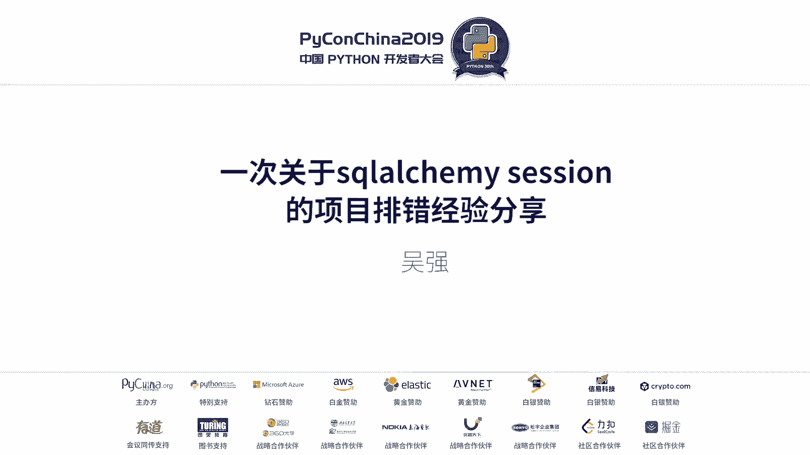
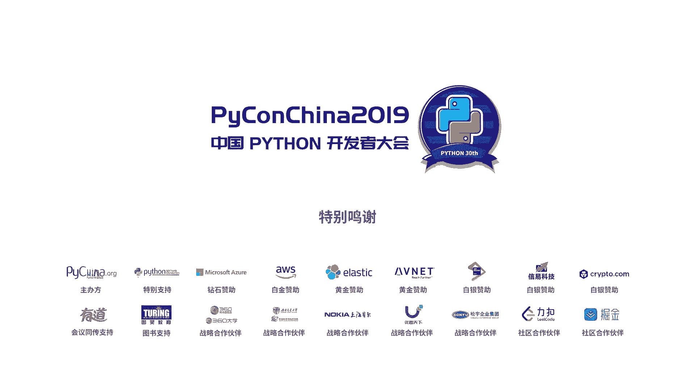

# PyCon China 2019 成都分会场 - P11：11. 一次关于 SQLAlchemy session 的项目排错经验分享 - PyConChina - BV1mE411v7t8

我是来自新希望金融科技有限公司的吴强，我是在我们公司作为后台开发人员的。今天我给大家分享了一个题目就是。

这以说阿比你申形的一个彩坑。好，先介绍一下我们的项目背景，我们项目背景用的是flask，然后接下来用的是s，然后数据库用是my circlercle。但是我们的考虑到之后，用户量比较大。

所以采用了一个分布分表。然后具体的问题呢是这样的，我们嗯我们在后台在大批量修改用户数据的时候，然后发现有的有些有些用户的数据是修改失败了的。然后我们就具体查，然后查到了一个问题。

就是我们目前有两个接口都是用来修改用户数据的，就仅仅是修改的字段不一样。然后在并发请求这两个接口的时候，总有一个接口是修改数据失败的。然后但是你串行修改的时候，那是没有问题的。

其实我当时当时我同事给我描述这个bug的时候，我就在想。创新修改是拿来证明一些接口基本上是OK的那可能就是要么就数据库有关，要么就是两者有关联的地方。然后具体在我就当时根据他的描述，然后重新写了一下。

看是不是我们的数据库有问题。啊，这是一个bubug描述，这是数据库里面的一个一个字段。接口一呢它是修改，把nameme改从张三改成李4接口二是把年龄18岁改成20岁。

然后并发调用的时候发现数据库只改了一个A，那就是有一个数据，相当于是数接口一，它是修改失败了的。然后我们就进入查错阶段。我我当时根据他的描述，然后模拟写了一下代码。第一个是修改，不知道看得清不啊。

第一个是修改名字，第二个是修改年龄，然后并发掉，然后把三个打出来看是OK的，是没有问题的。然后这这时候我就有点懵，我就在想，然后我又重新理了一下我们当前的项目情况。第一个是嗯用了b，然后用了s。

然后接着用了一下分库分表。我就想分库分表的话，每次获取C型的时候，他会去单独去建建立一次C型，我就在想是不是C型的问题，然后去看他的代码。好，果然是C型的问题。因为是分布分表嘛。

所以我们每次去拿里拿数据库建立的时候，需要再建立一次。然后我就看我们的代码，实际上是获取用户Uer的代码的时候，获取用户Uer那个对象的时候是获取了一次C型。然后保存Uer的时候又获取了一次C型。

两只有并发的时候，保存C型和你那两次保存C型的时候，有时间差，那就会导致存输问题。这是我当时建立这个模型，数据库里面的数据是OK的。两次筛ession。

然后pro嗯进程一是把nameme name改成李4process把A改成20。我两次筛ession拿的是同一个数据，那都是那数据库存的存的数据是张三name是张三A是15，我两次筛选拿的时候。

这时候两两个进程拿的数据都是OK的。当我右右手应该这对右手边这个进程。把名字改了的时把A改了是20，它存到数据库里面了是后，这个时候存在C信，两个保存有个时间差。

那么像左手边那个C星保存上去就会把A从20改回15，这是bug。然后当时我们当是因为我们当时写的非常抽象，嗯，业务代码是和那个具体的建立申是两套代码逻辑。

所以当时我们的当时写业务的那那那个哥们他是没有查到的，他就不知道什么原因。然后后来查到我们就。然后我我也我也模拟了一下代码，就是说看框画了方方框的地方，就是第二次获去筛型。然后第二次获取申情。

这样我们把三个打出来看，就能看到每次并发的时候，不仅改了la，然后还改了A级，之前是并没有改A级的。那就证明我们的排除是对的那我现在就就然后就我们就接下来的东西就是把获取C型就改另外一种方式来改。

然后数据就结束了。实际上这个事情对我们的一个启发，就是说要敬位数据，要敬位测试，还要敬位代码。哎，很重要的，因为那个是生产数据，但是我们修术是花了很很长时间的。然后为什么没测试出来？

实际上我们单单元测试自己是有的。但是我们单元测试都是并没有考虑到，就是两个接口进行并发测试。而且因为我们的有其中一个接口是通过小程序来调的。小程序那边调一个用户只调一次，也没有出现这个问题。

而是大规模的在后台修改用户数据的时候才会出现这个问题。所以是非常这个这我觉得是有必要分享给大家的。好，基本是。出个。

