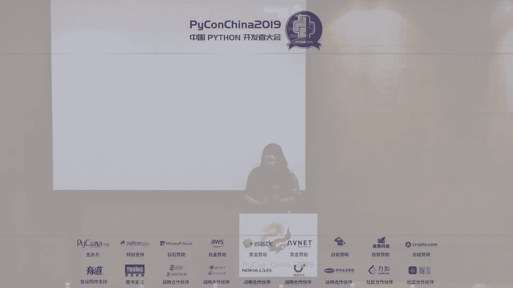
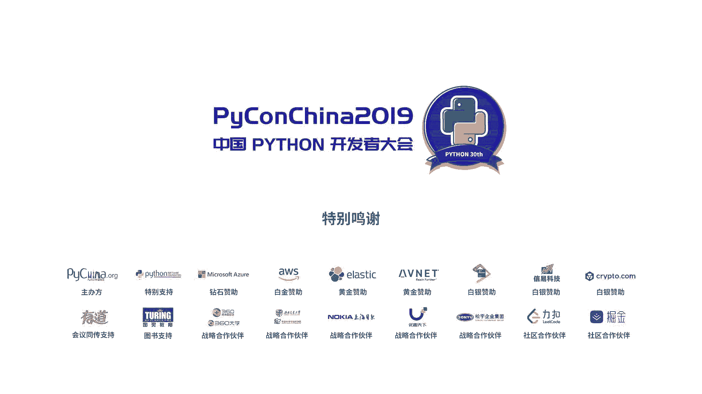

# PyCon China 2019 成都分会场 - P1：1. Python 之路 - PyConChina - BV1mE411v7t8

好，然后就由我来给大家补上这个分享。当然我这个PP是因为昨天晚上才接到消息，然后从晚上通宵改出来。然后对，然后里面可能还是有一些各种各样的小bug。然后请大家在会后结束之后，不要呃对我抽鸡。

或者不要忘我出打一个好吧。好，然后我今天其实想分享的是一个叫做呃on之路thon位。然后的话。我其实然后我当是我我想问一下这个东西，因为大家都知道。呃，我想问首先问一个问题，大家知道派有谁呃。

我有谁知道pyython3是在哪一年发布的，举个手，等一下可以来抽一个奖品哦。有谁知道python3是哪一年发布的？你。是的，没错，等一下去领领取一本书。好的，对，然后因为到08年到现在了，对吧？

然后也十年十多年的时间了，而且我们20年python二即将结束他最后的生命周期。所以说我觉得可能说做一个演讲来回顾一下他的过去，然后展展一下他的未来还是挺有意义的一件事。呃，再次做个自我介绍。

然后我目前在饿了么，然后用on，然后做一些中间的开发。虽然说我很thon，但是因为工作首付要插海嘛。然后对所以说工作中心浪 java。然后但是然后我和几个朋友其中的可能有大家比较熟悉的耐个9M。

还有知乎还有信涛就一起做一个获客叫做不设者说thon然后大家有兴趣的话可以去听一听我们都是中文的thon那个节目。好，然后的话我的博客是这个，然后上面可能会写写一些那个就说是技术分享或者是虐狗之类的。

然后大家也可以没事去问问。好，我们正式开始进入我们的就主题叫做python三之路。然后我先回顾我会先回顾一下python2的历史。然后我会说一下python3给我们带来了什么。然后我们会展望一下呃。

就说是python到现在，我现第三部分可能就并不急限于python3，而是就说是像再往下python的，就说是缺陷。我们以及我们真正需要的是什么。哦。实在抱歉。哦，好的，然后python二的历史的话。

其实它python2。0发布于2000年。然后的话大家可能说是呃跟我们很多人很多朋友都是差不多大的。然后2。22。3是在01年和04年发布的。然后PP3000这个重要的题案是发布于2006年，然后22。

7是发布于2。10年，然后是2020年python二结束维护。为什么我挑这几个时间点嘛？因为其实我们呃python它是在89年那个开始开发的，就是在89年开始开发的。但是在早期版本的python里面。

其实很多东西我们看到的不并不一样。然后所以说20年的时候，它比如说我们早期的版本里面没有unic的。然后在2。0这个版本开始引入的。然后2。22。3引入诸如的，就说是大家比较熟悉的上下文管理器。

比如说迭代器生成器这样的语法，在2。22。3里面，而thon3000的话，就说是俗称英语时间里面。那PP3K的话是就说是呃06年发布的，它是就说是决议我们将抛弃python2，然后开发python3。

然后2。7的话，其实这应该是大家用的最多的版本，就是python二里面最多的版本。它和现在用的python就近乎是一样一样了。然后的话。在2020年的1月份，然后我们的pyon二将正式结束维护。好。

我们首先来说一下pyython2的缺陷有什么编码的支持。语义的分歧，内件系统设计的不合理。好，我们首先来看一下编码知识。呃，就说是你们首先来猜一下这段代码代表着什么含义。

有没有同学愿意举个手来回答一下这段代码啊那个代表着什么含义。好的，然后这段海马首先第一个含义，它代表了ABCD字符串，然后就是代包含了4这四个字符的字符串，没问题。

OK但是它也有可能代表的是代表着这1六进字数的字节数据。因为大家都知道我们派森2里面的它的字节数据和文本数据是没有分隔开的。答案是以上都可能。好，排ython二的云场面。

大家肯定经常遇到遇到过这个问题的，举个手，这个没奖品，但是可以举手。好的好的，看起来遇到了不少。对，这个东西其实就是简而言之，就是对于unicode的支持。因为在早期版本里面，它更多是对于阿狗的支持。

而在那个un两就是我刚才说了，在2000年的时候，拍在2。0发布的时候，引入了内建的unicode支持。但是它只是一个opional的影，而不是一个m的选项。

所以说这个地方的话就会编码的问题就会造成大家unicodecode error。OK好，然后我们on我们on的经典缺陷啊，我们又是个名场面。

我们来看一下range和 range的区别里面iteserat区别ki和er kiss之间的别。这个地方其实有个背景，因为大家都知道，我们最开始在我刚说2。2234引入个就是代之。

我们我们是没有迭代这个东西然后我们一多，比如说我们100万数据它都是一次性到内存里面去。然后这个时候然后我们就肯定说我们内存就原地爆炸了，对不对？然后于是我们就后面我们引入er之后。

大家觉得这么好东西怎么没人用呢，我们就也是新引建了一些东西range range x range就是我们返回的是一个迭代器而比如说我们erer也是返回我们的迭代器。这个地方是不是让人很绝望，对吧？好。

python二的缺陷是那件系统不合理。我们再举个简单例子，我们还是我们举个例子讲道理嘛，对不对？好，大家看一下。然后其实这一段代码，大家可能看这是一个正常的东西，但是实际上这个地方有一个很大的问题。

就在于我们在下面这个里面，我们在执行完这我们在执行完就说是我们在抛出 simple simple one exception的时候呃，我们在处理simple one exception的时候。

我们里面又抛出了一个新的异常。这个时候我们的异常应该是上下呃我们全部异常信息都应该保留了。但是在thon二里面，然后我只保留了simple simpleimpleex。

我simple一 exception是彻底给积极了。就比如说我在处理一个异常的时候发生了一个异常。然后原本的异常就不知道，这是不是很绝望，对吧？很绝望了。

然后我们这个地方其实就是说我们这只是一个诸多不合理的地方之一，所以说我们当时社区有个讨论，就。就是我们需不需要就说是破坏性的升级。因为python3很多是不向下兼容的。在最开始发布的时候。

那么这个东西叫做breaking change。然后breaking change的话，这个是不是值得？但是目前来说，然后当时经过社区讨论来说，呃，我越早越好，然后这个东西宜早不宜迟，对吧？好。

我们现在然后我们08年之后，我们进入到了python3的那个到现在我们前段时间那个就进入了python3。8。对，有有有用过python3。8的举个手。然后当然也是没有奖品的，这个有用python3。

8的举个手。唉，看起来尝鲜的同学还是挺多的。好。啊，然后所以说python3能给我们带来什么统一的编码。更严格的语义，更合理的设计，更多能提高生产效率的新特性。好，我们on3我们带来统一的编码。

对于我们字符串和二进制数据严格予义区分。我们就刚才的ABCD那个东西，我们就不可能说它既可能是字符串，又可能是字节数据，那是不可能的。因为大家都知道我们三里面是分为两种类型，一种是STR一种是对吧？好。

然后对于unic的更好的支持。然后就说是我们默认就说是哎所有的文本那些都是以unic来处理。然后更严格的语义还是之前的例子。大家看到我们比如说ra x range统一为range。

然后这些东西我们就统一，然后成为一个统一的东西。这样还有它包括在一些内介mod里面的支持。比如说将一些相关的HTT6的包，然后全部移动移动在一个mod下面。

然后这个地方其实就给我们呃就是简化了我们的心智的负担，对吧？OK然后我们给带来了更好的设计。比如说我们还是刚才那个代码的例子，比如说我们在拍s三里面可以怎么做。大家可以回去试一下这个端代码啊。

就说我们这么做之后，我们这个地方它新加了一个叫做rara的一个就说是那个语句。我比如说我在那个simple处理simple一的时候simple的时抛出了一个异常然后我又抛出了 simpleim exception。

那么这个时候我可以通过一个呃simple exception然后就表示说我是在处理这个时候又发生了新的异常。大家如果回去可以看一下它的 back的话，其实就是一层一层的关联起来了。

同时这个地方还有个小优化，我在那个PPT上因为晚框时间不够没写。然后我们其实也也可以不用这种显示的语法，然后实际上我们在抛出 simple exception的时候，它的解释器在构造 back的时候。

就是我们的调度站的时候，它其实是也可以帮我们捕获到上下我们的对应的异常信息。大家看到其实这个东西就是thon三在我们的内件里面其实是做了很多的优化。哦。然后更多的，然后更能让我们提升生产效率的新特性。

对，然后生产效率。比如说呃我们就说是大家可能听这个听力了，我们今天也有很多讲师会来分享这个PP484类型标注。我们来举个简单的例子。我们首先问个问题，python是强类型，我还是弱力型语言。

有呃同学回答的举个手。も。是弱类型吗？强类型弱类型好，答案不统一。好，我们来然后它实际上是一个动态强类型语言。好。我们先回的，我们先黑一下javascript啊，当然我不是为了引战，我只是为了黑一下啊。

好，我们大概算一下。然后我们你们看一下这两个代码分别会发生什么。你们看一下这段代码会分别会发生什么，有知道的吗？呃，python里面会报错，javascript里面是不会报错，他会告诉你得到1。5。

因为这个时候它是数值类型和字符串类型，并不区分，它是弱类型。而python是强类型。这个时候他会告诉你说我字符串面和整数进行那个除法预算是不可以的。好。啊，sorry，然后我们现在开始来玩猜一猜啊。

我们都是要叫动态嘛，动态要猜一猜有意思。好，我们来猜一下。我们来看一下啊，这一段代码，大家呃有看过fask代码的方面有fask的，我也就说是核心开发者来给我们就是说分享，大家来看一下我这段代码。

你们来猜一下这些参数是什么东西。有然后对我们可以来猜一下，猜一下，大家可能一开始hot portbu落 do因为什么都鬼啊。好，我们再来猜一猜。我们再来猜一猜这段代码的返回的类型是什么。

然后大家是不是觉得WTF然后对我们要和谐一下，对不对？然后我们就看到猜不透。好，猜猜怕3。我们猜一猜这段代码是否正确的。啊，对，然后然后对，其实大家我们发现了什么问题没有。

因为python它是一个动态强类型语言，但是它是没有一个就是合理的一个内建的内内型系统的，对吧？于是会造成一个就是我们在编码的时候，我们特别是在接手一份超大的代码时候，我们就在很很疑惑。

这到底是什么类型。好，对，这就是我们经常说的，就说是他的内型不明确，怎么解决写更好的注释。比如说我们在flask代码里面，它会将通过那个do string的东西，将就是具体参数它是什么样的东西。

然后类型是什么给大家标示出来。好，但是问题是这样。想象很么美好，技叔最讨厌的四件事，自己写文档，自己写注释，别人不写文档，别人不写注释。人生老师告诉我们。文档是不可能文档的，这辈子都不可能文档。

so有什么itple。好，4PB484等着我们我们来检呃，然后它是一个python3。5之后支持的一个这种新的特型，它是给我们增加一个可选的选项，让我们去标注我们具体的参数的类型。

然后在关键位置参加参数的类型的标提升代码的可读性以及可维护性。大家都知道啊，动态类型一识上重构全家火葬场，对吧？其实这个类型就有很大一部分的因素，复杂类型的标注，第第三方工具的检查。

然后提供了接口以及可以实现运行时的检查，OK好。😊，我们现我们现在来就说是我们现在来改一下之前的代码。大家其实就看到一个东西，就说是我run，我后，然后我这个地方交筑之后是不是有变得更清一晰。

大家有没有觉得？对，然后这个时候我其实因为大家其实我们这个时候在编程中其实很强调一点东西是叫做我们代码集注式。我们如果说通过合理的代码手段能够表清晰的表明出我们想反表达的意思。

那么这个地方就是叫做代码集注式。然后那么这个时候我们如果说加入了类型标注这样一个东西，那么是不是就实现了我们代码急注式这样一的东西。好3。3。on3的一个新透性叫做PP518。

其实这个东西还处于一个draft的时，社区已经很就是接受它了。在有很多就说是第三方的工具，比如说我们就说是想写一个库，大家可能都说是比如说我哪天写了一段超棒的代码。然后但是这里空白不下就好用错了。

就是我写了一超的代码，然我去一下，我想把它封成一个然后但是这个时候我想把它发布出去。因为我不可能说我们要分享的时候，我问一下你们分享时用用那个PIP的举个手，就说是安装第三方依赖时候用PIP的。

他第三方依赖的举个手。啊，然后有没有有没有人使用就说传统的拷贝文件的形式？看起来没有看起来没有很好很好，我讲这个有用啊。对，看起来没有，我们不对我们要发布一个第三方库怎么办？

我们可能就不可能说我们就哎兄弟，你把你的文件悄叉叉文件拷贝给我一下，对不对？这个不可能啊。然后我们就要写一个为I是我们就是th最开始早期版本里面默认的就说是描述一个就是项目文件。

它的依赖以及安装方式的一个就说是一个文件。然后大家然后我们就写了这样一堆东西。大家看里面我们首先要引入。然后我们要去指定我们的依赖，然后我们要写一大堆的就说几一大堆的参数，有没有觉得很恶心。

有觉得很恶心的举个手。清楚。确实很恶心，对吧？好好，这个时候怎么办呢？太复杂了怎么办？当然是选择原谅他，而不放弃他了。好，然后对，然后我们现在PEP518的话，其实就说给我们带来个新的东西。

叫做就是是它是通过一种叫做tomail有有知道tomail的举个手TOML就是有用过tomail这样或者说其他jason类似的东西的举个手。对。

它其实就是通过一种结构化的表述来给我们就说是呃让我们呃就是项目更加清晰。然后我们来看个例子，这个地方是来自于我我们大办不帮他打广告回去啊找的是广告，就是一个它是一个非常的个客户端。

然后实现了静态检查什么我们不打广告了。然后大家可以看到相较于我们的就说是相较于我们就直接写Y我们要去看一大堆参数，我们这样的那个就说是mail的方式，其实就已经是很清晰的，然后表现出了我们需要什么。

然后哪些是我们不需要的。比如说刚才的exclude是我们不需要的，包括我们的入口或者是我们是什么我们依赖我们限定是什么。就说就说我们Y这样一个西原本的这样东西，它其实上是我们我们经常育东西叫做语音化。

而这个西它做的东西太不语化。就说是我们要去调队函是我们要去调队一些奇奇怪怪的东西。而这些东西本来应该是underline的，就是说是我开发者并不应该关注的。

我开发者关注的是应该是用更就是说简洁我更通易懂的方式来描述我的项目，然后能方便的把它发布上去。而PP518的话，它是官方引入的。

它就是通过这样一个文件的形式来帮我们去就说是引入了就说是简化了我们就是发布到语的负担。包括我们现在主要是像poetry因为这个地方我们大家可以看到我们这个地方是有个东西etry的话。

就是现在就是全方面支持PEP518的这个第三方的一个就是依赖管理，然后跟些那个类似。但是的话它的功能更强大，也就是518也是Y。然后同时也支持一键无脑。就说是暴力出奇迹的将我们的东西发布到语言。

我们就不需要那种各种呃鬼鬼祟祟奇奇怪怪的东西。然后当然python三里面给我们提供了很多，就是其他的改善生产力的东西。PP492哦thinkL用到thinkL的举个手。哦。你你你能手放下，然后对。

然后thinkO现在我已经把它黑出墙了，对吧？然后虽然是他在生产上，现在距离可用，还有一段段距离。对我的确是因为大家有有认识我的都知道我是呃应该是知上黑了think黑到这个。

然后基本上你能看到黑thinkIO下面的喷子，肯定都是我对对我就是传说中的键盘侠嘛，对吧？然后我就492这个东西，他虽然说他现在有很多的坑。但是的话他对于Pthon的意义还是挺重大的。

因为它是有官方的意义不支持了。然后比如说380E要5，然后我们改善了我们使用生成器这样一些的那个负担。比如说geo的优化，比如说我们在python3。2的时候，我们的geo做了一次优化。

有知道原本的ge有GIL的，就说是呃什么时候切换的，请举个手，有知道原本的geo是具体细节的，举个手。OKO好，是这样，就说是呃在呃这个是在3。2有的一个新特性，然后它并没有PEP。

然后但是是一个比较不错的优化。到大家都知道我们在早期版本的话，我们在早期版本是我们是通过一个固定量的一个字节码，就是OP code。比如说我们执行11100个OPcode之后，我们就切换到下一个线程。

而在新版的里面的话，就说是我们就通过时间，我们通过就说是规定5毫秒，然后就切换规定5毫秒就切换。这样就说是保存更多线程能够更均匀的抢占。然后的话同时它对于锁的释放和其他是有不错的那个优化的。

大家回去可以试一试。呃，但是它字典的性能也有提升。大家这个有关注的话，可以去看一下3。6里面的一个新的ature。然后等等。然后对，因为很多很多。因为如果说要练的话的话。

我估计能从早上给大家讲到晚上派行三里面讲什么。但是今天晚上今今天这个时间肯定不允许我晚这内还可以主持，所以说我们就先用等等来代替了。那么拍on完善了吗？你们觉得拍thon完善了吗？对。

看起来槽点他其实槽点还是很多的对，没有，毫毫无疑问是没有，对吧？要是有的话，我也不可能在这吹呃吹一波，对吧？好，我们就是我我们首先要去想一下，我们在想python完成之前上面，我们需要去想一下。

我们在日常做工作过工程，我们日常工作中的时候，我们python需要我们对python来说，我们希望什么，或者是我们就就先不仅限于python，我们需要什么。

第一个我们需要一个语言一个良好的性能方面的调试工具。然后良好的可维护性。好，我们首先来说信能。大家来找呃大家来玩找一找了啊，我们来找一下python，这上面有没有python的框架。有吗？好。

我们看一下上面的ra的java，javajava C，然后C加加C sharpgo go go go go哦。好好，没有没有啊，PHP都摆在拍成前面了，我们我们还是别PHP了，对吧？好问题是这样。

大家可能说我就说是我python，我并不去关心我就说是我用了python，我就不会去关心它的performance。但是实际上这是一个相对就是说错误的一个看法。个不知道大家带过团队没有？

我之前在就是来饿了吗之前，我是在一个分公司。然后我后面断了的时间团队。大家带团队的时候肯定都会遇到一个东西，就是一个叫做一个cos的东西，就说是你具体的服务器，你们团队服务器具体要花什花多少钱。

就是说是你们然后具体其他的就说是整体的费用，你们的bu是有限的对吧？然后这个时候的话，其实大家就说是我们如果说在量级小的时候是可以的。就说哎我们需要thon它的快速实现，快速实现一个。

然后我们并不需要去关心它perform。但是实际上你发现当你的业务量大起来之后，你需要去堆机器，而对其他你需要去平衡他们之间的性价比。这个时候比如说像知乎他们去呃对thon就说是关键的节点。

比如说问答或是其他他们就说是用python去重构到go他们一个很核心的理由，就说是我python重构到go浪之后，我的就说是我整体的花费下降了20%多。就说我整体的花费。

因为我thon虚拟机我thon动态的就说是自解码执行，我等等，其他都是需呃很耗费性能的。所以说这个东西我对于我们而言，如果说他的它需要保证它的性能能够满足。我们就是说在一些极端case下需求。

而在呃这个地方的话就说是什明，我再给大家讲一个例子。我之前做过一个微服务网关，是用勾写的。然后的话然后我之前是我们当时没有用做做什么优化。然后我们在压测的时候，然后跑出这样一个数据。

我们是在8C就是8核16G的机器上跑出了啊。20多万QPS就说是总共连接是长连接，加上各种个连接，大概是20万QPS。然后整体的那个峰值流量大概是在1。4GPSBPS之上。

然后而在8C16G的机器上勾浪的服务显示是还有余利的。大家就知道，对于我们在线极端case的情况下，我们还是希望语言，它能够满足我们这样的需求。python的缺陷，框架的治理，框架治理。

我们这个东西可能有点抽象。我们来看个例子，看一段代码。大家看到我们这段对吧？我们是首先写了个demo的一个就说是装饰器。我这个东西我其实就是想就是说是呃就像先写个简单的装饰器裹一下，裹一下。

就说是呃就说是呃裹一下我里面就说是呃某一个类里面的，就说是名字里面就就是包含ABC的公有方法，对吧？好，我们来看一下这段代码，它有什么问题。好，我们首先呃demondemo meta。

然后就是我们wa呃就是是wa，然后就是那样我们demon，然后大家可以看一看。然后我们看一看这段时这段时间有有没有有没有什么问题，大家看一下有没有什么问题。比如说好，我们现在的函数是这样。

然后我们现在类似这样。好，我们现在。然后我们现在的核心代码是用了一个原内，然后大家看下这段代码有没有什么问题，然后还是回答了没有说。然后对，然后但是大家可以猜一下这段代码有什么问题吗？有的人知道吗？

有人知道吗？我们这段代码有什么问题没有？OK好，我就不卖关子了。然后的话首先我这个地方我demo up的话，我不应该改出改一变函数的一个就说是他的行为，就是函数返回什么。

我们必须要把它返回这个地方我们没有写维特尔。好，现在大家看。我现在这个地方我包里写了个圆内，然后的话然后我包里写了个圆内，然后我这个地方一个逻辑错误。

我用了ABC in key就是我Dt里面就说是我在创建内的时候里面的，就说是具体的方法。然后就说是我判断里面，然后就说是有没有key是ABC。

然后它的这个东西就说是方这个地方它就我们不希望私有方法也被就说是也被忘。但是实际上ABC inK就是这样东西，而这个地方显示的做更好的做法，其实我们就是应该是用普通的装饰器。

我们直接在ABC上给它裹一层。但是为什么会出现这样的代码？然后可能有人回答说。呃，对你问他为什么会去写出这样的奇奇怪怪的代码？因为这个代码其实bug很多，而且风险很大。

特别是你有些时候你没有去看原类代码。比如说我们再看一下，其实这段你没有看他原类代码的时候，你根本不知道它会有原类这个东西。对，然后原类上面做了手脚，把类的创建行为直接给你hoook，对吧？好。

你问他为什么会写这个代码的时候，你猜他可能回答是什么？我看到流畅的thon。他还可能的回答是。我看了pythoncbook。对，大家其实就发现了这样一个东西。其实发现这样东西。

我们python里面就说是我们python框架，其实我们在就说是包括我们饿了么，其实是有一整套的框架流程，包括我们的就说是呃CICD，包括我们的就说一整套的规范性的框架。

包括我们会禁用很多我们在线上通过Q的review之类的。呃，就说是会禁用很多的，就说是feature。然后这个地方我们把它统称为叫做框架的治理。但是大家其实发现我们python太灵活了。

有些时候你根本不知道他会在哪个地方，对吧？他根本你根本不知道他会在哪个地方用个原来，他哪天看在Qbook上看了一本哇，这段代码超炫的。然后转眼一看，你在生产上就用了，对吧？这个东西很很不行的。

所以说而相较于java或是勾乱其他行为，特别是像javaspring全家桶用过spbring全家桶的举个手写过spbring全家桶的举个手。看起来啊只有一个看起来啊好的，看起来我们还是thon。

不是java对吧？就说是这样，就说是我们回到刚才的东西，就说是他会就说是我们spring全家桶的话，就是他其实是将很多东西给约束了。而我在就说是做一个初创企业。

我作为一个就说是一个就说是初创企业或者是一个中小型企业。我没有那么多人去去构建一个完就是完备的inrastructure的时候，就是基础设施的时候。

比如说像facebook他们他们为了写thon是造了一堆写程序语言的人去进去把他们把把on写成了静态语言。我们没办法去齐备这样的inra的时候。

那么这个时候我们更依赖于语言以及框架对于我们整个代码的治理，或者说把它叫做框架的治理上面。而我们现在on在这一方面做的，可能还是不会因为它本身就是相当灵活的语言。而这一方面就说是如果说他治理一旦失控。

还是那句话动态类型。一时爽，重构全家吼葬堂。对，然后所以说这就是我想说的。但是实际上啊这个图是那个在那个行啊行US2017上面，然后说一个图，我们说实话说吐槽了这么多，我们还是很喜欢on。

因为它毕竟是优美，然后简洁，而且能帮我们快速的挣钱的一个东西。然后当是一句话我很喜欢f了RR道ROR举个手就是那个对那是一个更更灵活的语言。对对对。

然后我们就说是我们好我们绝对不会让自己的朋友去用当然这只是just joke好，所以说我们综上所说的话，其实从thon到发展就说是到现在我们其实可以看到就是说是on他进步了很多。

包括于他历史的缺陷的包袱丢弃。包括其实现在也有很多的提案在针对于大家一直在诟命的G就GIL，然后包括种种种种种各种奇奇怪怪的缺陷。但是实际上他也有很多待解决的东西。就比如说对于工程的友好性。

对于其他的友好性。所以说我希望的话python走过30。所以说我希望作一个thon热爱者。然后我希望的话，python能够在这方面能够迭代更好，然后能够对于工程更友好。

然后能在更多的领域得到更更深入的应用。然后就这样，谢谢大家。然后的话然后我就因为我又是主持人，然后我就直接规定。然后我们看一下，我现在时间好像还够。然后的话就2到3个QA的问题，大家有问题的可以举手。

哦。有什么问呃，有问题的可以举手了。唉。好啊。Okay。呃，你好，就是呃老师你好，我想请问一下，就是因为我这大一大的话，主是在学习。然后就是想后的话想就是给社区贡献一些自己的力量啊。

是想想问一下老师就是就是就是就国内的一些开发者。如果是想给就是那个就是相关贡献渠道是没有一的社区还说直接是给国外的一些就直接去国外社区，还是国内自有的一些社区好明白你这个问题的话其实是这样。

然后你这个问题的话其实可以分为两部分。第一部分的话，你对on的贡献，大家都知道对th贡献是直接对th就本体的一贡献。比如说thon或说一些官方项目。

比如说刚才我说的就是第三方类型检查的工具叫做是这种工具的贡献。然后这种贡献这种就是说官方本体的贡献的话，可能就还是只能参与，就是去去参与到具体的社区里面就开始的话，可以去现在有个就是点然后你可以去看。

看一下常见的有没有什么bug什么的，或者说你可以在日常使用的时候去看一下他的文档有没有什么typo，或者说是什么什么没写好东西，从就说是 fix开始做起，或者说是从这开始bu fix开始做起。

然后逐步提升。然后据我所知目前国内唯一一位的和核心开发叫张他现在华为。然后的话他最开始也是从那个他是就是在16年晋升的，他之前也是专就在做就说是 fix打这方面，也是就说是从这方面开始。

然后对于第其他方面的贡献的话，就比如说第三方的贡献的话，其实这个东西并没有一个明确的界定说我要去参与个什么什么大项目的贡献。其实有个很简单的方法，就说你觉得你自己平时写了什么东西，然后你觉得不错。

你就可以把它打到了就统一在上公布，然后然后或者说把它上传到上去，然后或者说是让更多人来用它。或者说比如说你去用到某一些新兴的东西，比如说是RPC。呃，这种他的python端的不太是不太成熟。

或者说是国内的一些项目，比如说像阿里的roetco或者说是其他的一些项目。他们python的客户端不太成熟。那么其实你就这个地方你就可以从你的角度去让你把你自己用的不爽的地方实现成代码给他回归过去。

然后第三方面呢可能就是一些thon宣讲，或者说就是像我们这样做一些thon conference的一个东西，这方面的话，国内国外都有。当然这个说起就很长，我们可以私下聊一天。那这应该能不知道解决到里面。

谢还有其他人要问问题吗？然后问问题有说啊。就就是我身爱是。在呃开始学习学习个容啊，就是呃我都看到了说。呃，学习pathon的最好一个版本叫3。6。5。我就想请问一下，3。6。5和我们现在3。

8有什么区别？或者说3。6。5，为什么是对一个水手最友好的一个版本？呃，这个问题其实我首先说一下，我其实没有听到过这种说法。然后但是的话实际上呃就说你呃其实在3。5以后的版本其实是相对于成熟的。呃。

如果我没记错的话，3。7和3。8其实是没有引入新呃太多的渗透性。3。8是引入了P1P572就是P1P572，然后3。7的话是。呃，PP5725703。7，我先忘了哪几个PP其实这几个PP的话。

对于thon本体的干扰都其实不是太强。如果说是3。6。5的话，如果说是有人给你推荐3。6。5的话，我可能说呃它最大的原因可能就说是他现在已经是处于LTS的状态，就是说是那个的状态，就是长期支持的状态。

就是相对于一个的状态，就是说不会有太多的bug或者是其他呃，但是如果说如果你要觉得我学on的话，其实这个东西你固定哪个版本影响都不大。只要是3。5之后的，固定哪个版本那。我谢谢。呃，好。

还有其他人要提问的吗？好，最后一个问题。然后。啊，你好，我想问一下。你在饿了那边的话，知道他那边有什么程上的应用呃，这个东西的话呃这个东西也不算说明。我说一下我我说一下我说一下吧。

其实饿了么最早是用thon在写的。就是说包括他的核心交易链路的时候，因为我17年就去应聘过。然后他们当时的链路就还是在用on。而现在的话因为是在那个大家都知道饿了么是被阿里收购。

但然这个是然后我是官方的说吧，然后就说是我们整体的技术是像java移，就使用很多比如说招人不好招或者是其他的，后现在thon的话就说是呃thon在饿了应用应用就是说一些核心链路的话，还有一些中间件。

就比如说我们组我们组在做的就说是那个服务发现一注册中心服务治理这样的一一些东西。然后我们现在也在推动派。如果有兴趣的话，可以后面关注一下。啊，谢谢啊，好，那我们就不好，那我们这边的话就到此结束。

