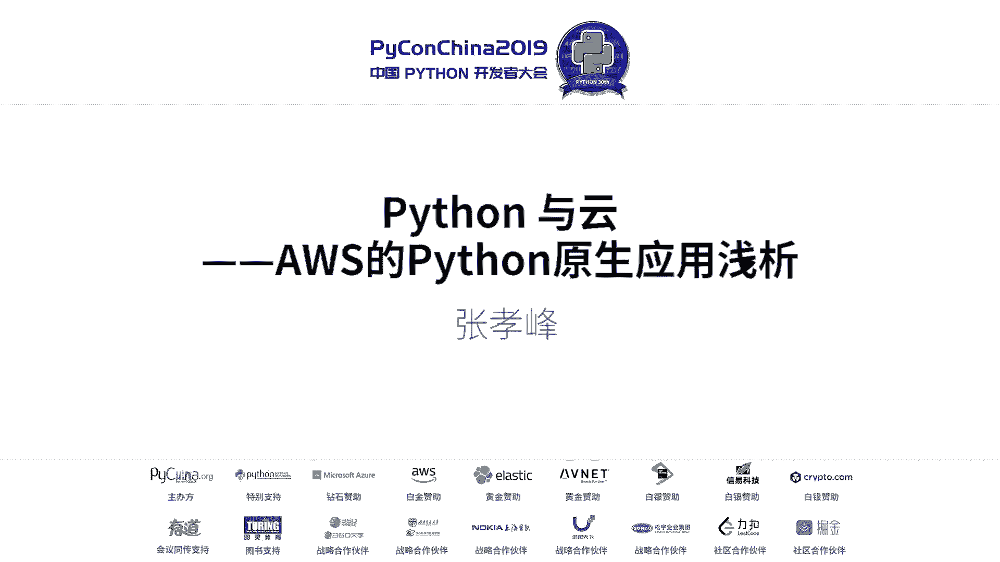
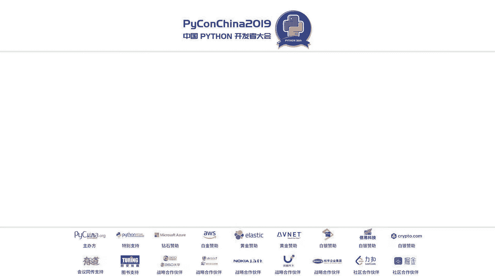
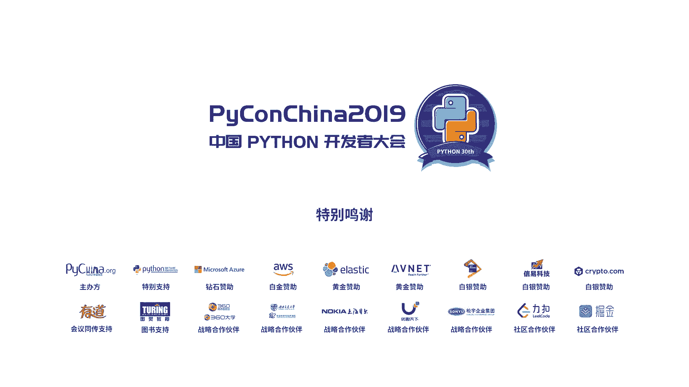

# PyCon China 2019 成都分会场 - P2：2. Python与云-AWS的Python原生应用浅析 - PyConChina - BV1mE411v7t8

谢大家好，我是那个来自AW呃张晓峰啊。今天刚才就是大家分享了很多很生层的代码的内容啊，然后很有深度。那我在开始现在讲一下一些轻松的发展啊，今年这个呃中国的这个是python30周年的一个进典啊。

这个进典其实还是蛮重要的。呃，但是我看到在座其实很多都是同学啊，这个30年对于大家来说话是是一个挺漫长的过程啊，实际上很容易去算30年的话，就是python是从1989年开始的。

可能在座的很多位都还没有出声啊，所以经过那么多年的发展，其实python从1。02。0啊，可能呃像我这种ID界的老炮的话，最早去接触python可能会在2。6的版本什么的，而且还有一些老炮。

他们还是非常迷练的python的二版本，甚至还有一些网站会把python二继续往下发展。那这个是。其他刚才其实有同学问到，像现在大家去学python都会从3。5以后的版本开始。那3。

8是最近几天刚刚开始发布。啊，那thon发展的这30年其实也是一个嗯IT界发展的非常迅猛的30年。其中就是互联网在这个30年里面是急速的发展。那互联网里面毫无疑问，最重要的一点就是云计算的。

而云计算这个发展呢其实还没有开始那么长，其实最早开始云计算的AWS呢就是从亚马逊他们自己的一个需求开始的。大家都知道亚马逊啊是贝索斯去创建的。然后呢，他们从呃贝索斯从9698年就开始去搭建他的网站。

到两0天年的时候，他已经是一个非常庞大的公司。那一旦一个公司庞大起来或者一个系统庞大起来。他们都会面临一个问题，就是说我一个庞大的单体的系统，怎么去让。所有的开发人员可以很方便的进来去做开发。

在当年其实是没有像微服务这样子。我们现在耳熟能详的这样的架构。当年传说就是贝索斯去看了一本就是叫生命的书，他就说认为生命是一个一个很小的单体。然后他们用一个统一的接口，跟他们互相交流起来。

就能够长成一个非常完整的生态圈啊，所以他们当时就从2000年开始去构造这样的一个微服务的架构。那到了2004年的时候，其实亚马逊自己本身已经长成了一个非常好的微服务的系统。

那一旦搭起来的一个微服务系统以后呢，很多人就会开始去思考说啊其实有句话这有个词，其实大家现在都很熟悉，就是中间键。就会你会发现有很多微服务是通用的。我可以把这部分拿出来。然后既然是如此的话。

其实贝索斯他会更深入的一层去思考。就是说他会想我怎么去。帮助我的客户去创新。所以在2006年的时候，我们开始会把自己。亚马逊自己本身去用到的一些微服务去发布出来，把他们变成了AWS。

而这个AWS就是从2006年开始发布到今。到今天的时候，就是像现在的python30周年，他其实现在已经遍布全球22个地理区域，有165项不同的产品。中间有一个比较重要的，我后面会提到。

就是在2014年发布的的拉这样的一个。啊，所以大家可以看到，其实云计算的发展其实也只有十多年的时间，远没远没有python长啊，就是一些python的老炮可以自己吹。

比如说啊我写python已经写了30年了啊，那个是on做的。但是如果有一个人告诉你说他玩云计算完了30年。当年那个AW的一库还是叫一 one的话。

那你就会知道这个一定是吹牛的其实像云计算还远没有python长。那python在发展了那么多年之后啊，python会被誉为一个瑞士军刀啊。

我们现在可以看到很多很多不同的这样的一些的产品都是使用去python去开发的。而且这个产品的跨术非常非常大。

尤其是现在在座各位我不知道多少学python的是为了AI人工智能去做的那python在1989年去写出来的时候，他一定没有想过自己能够做这样的事情。但是因为他的整个语言的灵果性逐步会变成了很。

有很多方向。同样的AWS这样的一个云服务，它也是有一个全面功能的这样的一些的服务。它有165项功能。这165项的功能会便及了很多很多方便。

并且我们刚才提到了我们为什么会构造AWS构造AWS我们的目标是为了提供一个标准的。所以在AWS发布任何的一项服务的时候，我们都会提供标准的API的接口。

所以我们165项服务会涉及到几千项的这样的一些API的服务。这些API的服务会帮助啊我们的微服务之间自己互相理起来。但相应的来说，我们也需要去编且构造这样的一些的API。并且呢这个API是需要安全的。

需要健全，需要去签名做很多很多的事情。所以最常见的办法，我们就是把这些API封装成各种语言的SDK啊，这个大家去写很多代访的时候都会知道。

我们很多时候我们只要需要去面临SDKSDK会帮你隐含的API下面的各种像是健全啊签名啊这些动作。那而我们的SDK会涉及各种的语言的版本。但是thon的这个包头3。

可以说是我们的它是一个利用了thon的这样胶水语言的这样一个特性。说我们官方。一个SDK为什么会是这样的一个说法呢？因为其实我们可以看到我们AW官方的com就是我们官方的命令行的参数。

其实就是用python去开发的。它的底层就是这样的一个thonK的我们发表任何一个服务的时候，即使我们这个服务上面啊，我们甚至有些服务可能在上面都还没看到，就是我们在界面都没有看到。

我们就一定会发布这个服务的API对应的来说，我们就会去做这个服务的包就是th的这样的一个SDK而这个SDK可以去马上应用到我们的这个com上。然后很多时候我们些新的服务是可以只能够在命令行上面去用的。

它的底层就是on的识。那就是的。啊这是一个比较完整的一个简单的一个thon的包去启动一个一的代码。大家可以看到这个代码非常非常的。因为它里面用到了一个很完整的try catch。

但实际上这个代码唯一有用的一个地方，其实就是业这样的一个对象，然后去s这样的in。这上面一大堆的这样的上上下下的一些内容，其实是表达了刚才这个大刘想说到的这样内容。其实thon你需要有时候就写到很工整。

那包括三是已经一个一个已经发展了接近有十年的这样的一个项目，它里面的所有的try catch这些东西都很工整。所以也有很多的就包呃除了这码去自己的命令行以外，其实有很多的云管系统。

他们也会利用我们的这样的个SDK去做开发。所以这样的一个SDK是已经已经非常完整。那我们的所有的服务都是有SDK的那其实呢在去年我们还发布了一个服务，是亚马逊推出了一个卫星的服务站的这这样的一个功能。

那这样的一个卫星的服务站，我们作为一个AWS功能提供，毫无疑问，他也可以在包3里面会有这样的一个相应的SDK大家用到。当然因为我们有真正的卫星，所以这个函数会返回我的微信数是0啊，如果你要用这个服务。

首先你要一个卫星在上面，然后它才能跟这个地面站去做东西。那这是开一个玩笑的。但实际上呢我们跟真实的业务场景，可能是一些三层架构啊，尤其是现在在微服务下面的一些三层架构。

我们的客户通过一个呃网站去访问我们，然后通过一个负载均衡器把呃来把不同来源，不同是否验证完或者是不同功能的一些代码分散到不同的一些的容器的集群里面去。这个情况其实是我们。绝大部分要去做的状况啊。

就是我们在on，如果我们需要去搭一个完整的网站，就好像嗯像饿了么他们都会用说这样的容器化这样去做。那这样的一个网站里面呢，其实又回到了我们刚才一开始说到的，我们为什么要去做微服务。

那为什么做微服务其实前面已经说到的就是当年亚马逊在思考这个情况下，我希望能够让更多的开发人员可以加入到一个大型的系统开发。然后我们让每一个其实任何的一个完整的代码，通常他能够支撑的真正的核心的维护人员。

可能就是那么两三个人，其他人只能够帮他去审周边。但是一个庞大的系统，我们怎么把它拆散成为一个一个小的服务。那这个12要素宣言，我们不知道在座各位有多少是读过的。

其实我建议所有的去嗯读计算机的同学都应该要去读这个12。宣言他其实是呃ki户啊，他本身是亚马逊的一个他们，再加上亚马逊用户。他在云端去构造了自己的一个大家可以比较熟悉，就是说法就是pass平台。

就是他会认为你在我们在这个pass平台上面去构造你的微服务的话，你去符合这样的一个12要素宣言的话，会能够更容易体现你的微服务的价值。其实它里面就是整个里面就是会尽可能的去利用现代化的一个云平台。

因为我们去构造微服务的时候，我们是希望我们的服务是可以自行的平行的扩展的。所以我们希望我们在写一个服务的时候，无论你刚开始可能是100个人连入，还是最终不可能展成一个数十万数百万人在线的系统。

他都是不需要猜测容量，你的架构是可以横向的平行扩展的。并且可以摆脱各种。异化的工作。我们的程序人员其实现在在座的各位可能都在读书。但是如果大家进入到工作的状态的话，会发现啊。

大家都会说马龙马龙前几天正好就是1024马龙杰啊，大家都在996甚至甚至是007的加班，就是人力的资源总是有限的那我们希望我们有限的人力资源全部集中在写更多的我们的业务代码上面in的事情。

我们可以高高交给一些的高手或者甚至是交给我们的云服务平台，那我们就可以集中把我们的概念实施出来。这个就是一个12要素宣言最重要的一个体验。所以在云端。

既然我们已经可以把我们的这样的基础设施的资源很方便的给到大家使用的情况下啊，我们刚才也提到了，我们可以通过高三去调用在云端的165项这么多的服务里面每1个API。

我们能不能把我们的所有的基础设施把它像代码一样去表展现呢？就比如说我们刚才要去部署我们这个一个完整的一个三层架构的网站，它可能是docker化的那它会涉及到我们前端会有域名，会有我们的域名的证书。

会有我们的负载均衡器。我们后面会有docker的集群，上面会跑各种的do file。那这样的一个完整的过程。

其实是我们可以通过in后这样的方法去构造的那最早的时候我们会有AWformation这样的一些的服务。那这样的一个formation这是一个样丽的模板，大家在AW官方网站可以看到，我们会把它全部打出来。

因为它有500多行。因为我们要涉及到一个完整的这样的一个服务。我们首先可能需要在云端去构造一个内网的网络环境啊。对不对？我们首先要有网络，我们这个网络可能要分私网，有要分外网啊。

私网里面我们跑的可能是我们的数据库啊，外网我们是对外的，可能跑我们的负载均衡器，或者连到我们的新间里面去。然后我们会有docker，我们会有嗯各种的负载均衡器。然后他们之间会有自己的连接关系。

所以在这样的一个完整的代码里面。这个500多行的jason的代码是可以描述了整个场景里面的所有的部分啊，并且有他们每一个场景之间互相沟通的关系。那这样子，其实你已经可以很简单的去描啊，其实也不算很简单。

但是你可以通过一个代码的方式去描述你的基础设施的环境，最最重要的是，一旦你用代码去描述这样的环境以后，你的这个环境是可以被复制的啊，现在我们其实很多的企业都会在出海。当然出海的时候，你可能。

现在是在中国去开一个这样的服务，你很容易可以把这个服务，比如说复制到中东，复制到南美啊，甚至是到北美、欧洲这发大地区去。

然后你就可以通过infrastructure code的方式去把你相同的已经成功的经验复制出去。一旦你有新的一些代码的部署，你也可以通过少量的修改，然后就从另外一个方向去部署一遍。

那这个是一个instruct code的概念。但是我们以看到刚才这样的一个S code的概念里面，它会有一个问题就在于它的描述非常复杂。因为它是描述是涉及到每一个细节的。

假设你的整个环境里面可能会有三四个不同的网络，他们可能有私网，有公网，然后他们的网络里面大部分的内容是相似的，但是有少量的不同，你都需要去把他们独立的描述出来。虽然它已经是代码，但是不是很像我们的代码。

所以。在今年我们其实推出了infstruct code这样的一个概念啊，就是我们的一个新的产品，就说叫做AWS的develop cK这样的一个产品，它可以通过C或者thon这样的语言。

按照一些像面向对象的有继承的这样的一些关系去做我们的代码库啊，去做我们的这样的一个基础设施的描述。这是一段on的K代码，我们可以去看一下他们的内容，们一看到这前面的port很正常。

我们都会把这东西放进来。我也看到会把K里面我们需要用到的不同的模块出来。我们需要用到to我们需要用到我需要到虚拟机。我们需要用到EC这样的一个容器的管理平台。那我们只需要把它引出来就可以了。引出来之后。

我们可以去描述这样的一个VPC因为它是一个。代码的方式，所以他会把很多隐含的东西去隐藏掉了啊，就是你在六这样的一个python的这样的一个类，它是其实是一个构造的函数了。这样的一个函数的时候。

其实它有大量的。隐含的属性啊，这样的隐含属性在你不需要去修改的时候，你就可以直接去使用。然后呢，你就不需要每一项的详细描述都列出来。相应的，如果你需要更多的内容的时候，你可以把它描述的更加详细。

并且很重要的是他们之间的依赖关系是非常面向对象的去管理的。比如说你的这个au，你要依赖某一个BPC的话，你只需要把你前面做出来的这样的一个VPC的对象传递给下一个对象就可以了。

那这个是一个非常面向代码的这样的一个方式去思考我们的基础架设施的这样的一个概念。那这样子的方法是非常方便我们的程序员去思考我们的基础架构的设施的那K目前能够覆盖绝大部分的AW这样的一个服务。

那如果未来大家去构造这样的一个。嗯，代码的话，大家可以去看到这使用这样的CDK，可以帮助大家非常快的去构造我们的基础设施。其实呃今年的on的上海站，我们的AW的另外一个大呢就是胖虎老师。

他是台湾的胖虎老师，呃，其实就分享的这一块。而且呢大家也可以去找胖虎的这样的博客。呃，包括。墙外的跟墙内的这样的一些博客去关关注一下。他其实在很多的项目里面。

他可以通过呃大概十来行这样的CDK代码就能够完整的去实现他的一些服务啊，还是蛮酷的。最终这个信P可去实现了一个完整的带自动扩展的一个容器的提取。那只要有了这样的业个容器集群以后。

我们就可以直接在容网里面去抛容器的话，我们就能够支撑我们的业务去做。所以我们可以看到AWS在最早去给大家有这样的基础设施的时候，正正是虚拟化新级的年代。

所以我们最早的时候我们是通过虚拟机的方式去给到啊我们的开发者去有这样的一个计算资源。到了后来啊那这虚拟机现在我们还可以经常去在上面去跑向数据库啊，这样raius啊这样的一些服务。

通常我们不会把数据库或者服务带它容器化。因为它通常能够吃满一个虚拟机的资源，而且也比较不不适合做容器化。那其实容器化在前几年已经开始非常火的。那我们AWS上面也可以有相应的容器的编排平台。如果大家比较。

熟器的话，那也可以使用EKS之类的这样的服务。那容器的编排因为服务通常都是呃密切相关的那AWS还推出了像发这样的一些服务。这个服务呢其实是把虚拟机这一层是完全隔离开来的。

就是当你去啊构造这就它就是一个容器云的服务。所以你面对的可能就是每一个的包括 fire，你不需要再关心这个容器考在哪一个虚拟机上，那这个是更加容器的一个想法。但实际上AWS还有一个更完整的想法。

或者说更往前走一步的想法，就是所谓的我们的无服务器的服务。呃，我们在座的可能都是有很多是大学生啊，我们未来可能会成为一位啊从马龙开始。然后最后你们可能会成长成为公司的架构师或者CPO或者CIO。

然后无论如何你在公司里面去实现的价值，或者你即使。你今天再去给导师交的这样的作业，或者你写的毕业论文，你实现的价值最重要的部分其实都不是你的基础设施啊，你的基础设施去构造只是一个部分。

你最重要的还是要去实现你的业务。那我们的业务毫无疑问，会有业务逻辑。业务逻辑的话，我们当然可以跑在虚拟机上，你可以跑在容器上，如果你跑在虚拟机上，你可能就要去考虑你的虚拟机装怎样的操作系统。

这样的操作系统有哪些的库会被你依赖。然后在座的各位可能都是python的爱好者，所以你可能还要去装python啊，当然大部分都内涵的。但是python的时候。

你要想我在用python2还是python3啊之类的巴拉哗拉的一大堆的问题，所以容器走前的一步，带你去做容器的时候，你去inport一个do file的时候，你一定知道你的依赖关系。

这个其实也是符合我前面说到的12原则的。就是说你不要。依赖一些隐含的你不知道的事情。你每在do里面，其实每一步你都是知道的。我引入的最基础的可能是的某个端的这样的一个基础。

然后我要装到哪一个版本的哪一个库之后在上面做，但是你还是要去管理这些东西，最理想的状态，我们要实现我们的业务代码，我们能不能只写我们的代码。我们不需要再去考虑底层的任何的东西，这个就是无服务器架构。

希望要去做的事情。这是一个最简单的无服务架构的hello world。当然你可以看起来它跟普通的一个thonhello world或者说嗯就没有什么不同啊，都是这样的一个函数。

但是实际上我们可以看到他们前面其实不需要你去安装任何的环境，你只需要把这一个代码丢给AW的服务。他就会帮你去执行这样的一个函数。而这个函数我们可以看到它是一个even handle，毫无疑问。

它需要一个事件去调用它，这个也是我们常见的业务代码经常要去处理的事情。这个even可能是来自于一个H的请求，也可能是来自于一个IP设备的触发，也可能是来自于某一个文件的上传。

这一部分我们都可以通过这样的一个even去做。所以我们这个even每一个都是对应一个事件啊，有一些是事件的响应。

比如说我在网站上面有人一下这个可能是一个抓去触发的某一个recal的I然后有可能这个时候所API可能会调一个事件的后端啊，或者说我们可能是上传的一个文件。比如说我们在AWS3上有人上传的一个文件。

这是一个图片，这个图片我们需要把它改大小。那这种情况。我们就可以只写这个改大小这个代码的函数，而被人去调用这个函数就可以了。你不需要理会这个函数什么时候被调用，被调用了多少次。

比如说他的QPS可能是从两次，瞬间变成了几万次。这种情况下，AWS会在帮你们在后面去做这样的一个扩展，让更多的实际上你是容器的环境去把把你这个代码并发的运行起来。你的S3可能瞬间过了几万个文件。

那几万个并发会同时去帮你这个服务去做这样一个事情。而你需要的就仅仅是写前面这个代码。那这就是一个呃很常见的一个例子，这个是一个在S3上面去变化这样的一个图片大小的这样的一个例子。嗯。

我们会看到他使用东西基本上都是一样。因为它需要使用这个bo3啊使用S3，所以他需要引入我们的bo三的这样一个库。然后他因为做了一些图片的处理，他也从这些图片库里面引入了一些功能。

然后我们做了一个叫三 image这样的一个的函数，这个是实际的业务函数。然后之后我们定义了一个handle了。

这个handle了会收到了一个里面会返回到底在你哪一个指定的S3的这个同里面上传的哪一个文件，然后你需要把这个文件拖下来，在你的。本地的拉杆环境里面放一会儿，然后并且去。

调用这样的一个res image的函数。然后之后把这个文件传回到SN的另外一个地方。所以这样的一个代码是非常非常纯粹的，它就是你的实际的业务的逻辑。

你不需要再去关心你这个代码到底是跟哪些的一些基术环境有关系，你只要写完你逻辑就可以。这个就是无务计化，希望给大家带来的一个效果。但其实无服期化的东西不仅仅是拉啊。我前面反复的提到了只要要素的宣言。

所以要宣言里面其中有一条提到，我们应该尽可能的去依赖一些外部的现成的服务。我们不需要去区分外部的现成服务，跟我们自己开发服务的区别。只要这个服务能够在我们要求的并发下面去实现我们的业务逻辑就可以。

所以我们其实在云端可以给大家用到了很多有些人可能会把它定义为pass。有些人可能定义为s anyway无所谓。它都是。些托管的服务。比如说我们会有托管的数据库，像这样的一个达B，它是一个托管的no系统。

那大家只要去操作这个系口就可以了。你无需要去考虑这个no系口的服务器到底后面有多少台，它可以扩展到多大，它可以从几条的数据集开始成长到数百P级别，这都没有问题。它后台会帮你去做这样的一些事情。

就这个达还真的是整个no系口的始主。大家如果有空的话，可以去看一下有篇像达的文章，其实就是亚马逊当年去做出来的。包跟卡西其实都是来自于达这样的一个原理。那像别的一些服务像我们的呃一些开发移动端的服务。

我们也会有这个涉及到一些的微源的计算，或者说我们移动端的计算啊，我们可以去一键的去构造一个不知道在在座多少人会去写像或者这样的一些的移动端。是网页的这样一个环境。那这个环境的话。

你可以一键的去跟呃部署一个环境出来跟云端去做一样的沟通。所以我们会有一系列的这样的一些服务。这里面只是举了一些例子去帮助大家去构造这样的一些的服服务器的架构。哦，怎么拿那个东西出来，电量不足。

可能要插个电。像这样的一些完整的服务呢，我们可以构建成一些完整的方案。像这个媒体分析的履约方案，其实大家可以在亚马逊的官方网站里面去看到这个媒体分析的履约方案呢。

它其实表述出来它是一个完整的conformation，就是我前面提到的in S home。你在这个conformation上面一键部署出来，它就是这样的一个完整的服务。这个完整的服务呢。

我们可以看到它会有一个前端的静态网站。这个静态网站呢，它会维护了一个像用户相册这样的一个环境。那用户可以上传他自己的一些相册，而这个上传呢是有健全的服务。当他上传完以后呢。

我们会调用AWmbmb会触发一个方式，会根据你上传的这个媒体，可能是一张图片，或者是一个视频或者一个音频。然后他会调动一系的人工智能的服务去识别你这个。视频里面那些人说了什么，把它转成文字。

然后他说了什么意思，然后这里面有什么人，他认识的人会把它标记出来，然后全部放到elect search里面。elelectse之后，我们可以就可以把我们的些图片或者视频就搜索出来。大家知道。

其实现在的很多的。的一些啊。图片处理或者是图片图库架构。API他把APP他们都会提供类似的这样的一些服务，可以帮助大家去搜索我们的图片或者视频。因为我们以前在搜索图片视频的时候。

可能是非常嗯少这样的资源的。你上传一个图片的时候，你可以手动去打标签，或者说通过一些时间的标签。我知道啊今天我是在这个西南加通大学拍了这样的一个图片。那这个图片里面拍了谁拍了有什么东西。

这个东西图片本身其实是还有这个信息的。但是以前我们通过普通的计算机系统，是没办法把这个内容给抽取出来。那今天我们有了各种的人工智能的服务以后，我们其实是很方便可以把这个东西抽取出来。2。

on其实也是一个嗯非常适合人工智能的环境。那回头这里不要去卖一下广告了，等我不知道在座有多少人学python是为了AI的学习的那其实呢呃无论你是怎么去学on或者就开始去用AI的话，我们还是这一句。

第一步我们一定会接触到的各种的基础设施，这个基础设施最早的肯定是有CPU的机器，是不对？但是我们知道我们在一些深度学习的场景里面，我们常常会用到一些GPU的机器。

那在W我们会有最新的像V100这样的GPU那这样GPU呢其实我相信在座的各位可能呃不一定会马上用得起。因为这种的GPU通常在一些大的公司里面去买的话，一台机器就是大概100万人民币。

因为他们里面有8块这样的的顶级的卡，每一块大概十几万人民币的样子啊，但是如果你真的有一个模型想好。你在CPU上面可能要跑一两天。但是你在云端，你想跑的话呢，你在云端去开的话。

它是每一个小时大概十来美金这样的一个情况。所以如果你真的有一个非常有信心的模型的话，你也可以考虑去使用这样的一个云端的设施。因为你不需要拥有这台机器，它是按秒计费的，你可以去做这样的一个事情啊。

那其实可能我们还会有一些大学生的优惠啊，这个我们会有一些同事会做到。那这个是我们的基础设施，有了这个基础设施以后呢，其实你拿到人才100万的机器以后，你可能不能马上去干活。因为你要在上面去装操作系统。

对不对？要装装完操作系统之后，你还要装vidia的驱动，装完驱动之后，你要装扩的工具包，装完扩的工具包，你要在上面装thon装装thon phone啊，这个东西虽然都是python，要是每一项都是零散。

那在云端的话呢非常有好处的话，我们会有这 learning阿。因为每一个虚拟机启动的时候，我们都需要一个镜像。那是这个镜像我们就会构造出一个专门适合AI学习开发环境的镜像。一旦建起来之后。

你只需要一两分钟。它里面相应对对应一些硬件的所有的环境已经帮大家去安装好了。那这个是最基础的基础设施的部分。我们也可以去看一下很简单的去做这样的一框架，上面常见的框架我们都会有了像我们非常非常熟悉的。

还有这两年非常非常火的啊，这些都是会用到on。然后M呢是AWS自己推崇的框架。因为它的并发能力非常强。然后还有一些比较传统一些的啊这样的背啊啊比较先进一点比较框架一点的这样这样的一些环境。

那其实AWS呢本身。大家可能如果知道一些呃关系的话，会知道说t phone那不是google的东西嘛？其实也无所谓，它都是一个开源的项目。正是因为云端的资源非常之灵活。

所以很多人会使用云端的资源里面去使用呃作价的机器学习。因为你拿了一台100万的机器，你其实没办法让他7乘24小时全年的跑马。那在云端的按缴计费去建模是最合适的。而云端最常见的资源呢是AWS。

所以实际上云中的t phone有85%是跑在AWS上面的。不过头来我们去看一下我们的那个。环境怎么很方便的建立。当你启动完一台。好了这的机器以后，无论你是GPU的版本还是CPU的机器。

你都可以马上登录到这个上面。然后你只需要执行一台一条命令这样的一个thon3。6的版本。当然如果你坚持要7其实也可以啊。然后之后他会自动的帮你去安装各种的依赖库，它会检测如果你是一个GPU的环境。

我可能就要去安装这样的一个GPU的驱动，再加上打的一些库，然后去帮你做。然后之后呢，你的命令行会变成了这样的一个环境，你很清晰的看到自己在thon的环境里面。

然后之后你就可以进入到thon啊添到这个环境里面，在ip里面你就可以马上去执行你的。这样开测后的环境。当然其实更多的人会使用像呃juit这样的一些工具。那jupy其实也会在这个环境里面内装的。

然后之后你就可以远程的通过网页的方式去一步一步的构造你的环境。那如果我的环境已经有一部分的数据了。然后我又去看书的时候，因为现在特别火。然后我发现我其实我想回到的环境。你只需要再执行这一句这样的一个。

它就会自动的安装把把拍测 code给卸载掉，然后安装到的环境之后你就可以执行你的to的函数。那就是说这样的环境可以让我们的还是前面那句话，让我们的开发者更加专注于在我们的业务上。

而不是在我们的基础设施上，所以非常合适我们的开发者去做这样的一个环境。好，那我们刚才知道我们基础设施是这么去用的，但实际在生产环境里面，其实还有更复杂的一些东西需要去做。因为你去构造了一个神经网络以后。

你需要去调动这样的一些的数据去进行你的模型的训练，模型的训练的过程中啊，你可能需要非常庞大的机器提取。因为你的模型，你的数据集可能非常多的模型可能非常大的。同时呢这每一轮的训练，你可能都要去做调参啊。

其实说真的现在很多人说我在做人工智能，人家会问你做人工智能哪部分，其实你们在做人工的部分啊。因为很多的人工智能的还是马农，马农做的很多事情就是在做像调参或者各种的low数据啊，土数就这样的事情。

这件事情国内国其实都可以交给机器去做。其中里面就会提到了像一些的超参数优化。超参数优化其实在嗯就实像我们那个日本美媒里面可能会讲到这一块，就是什么叫做超参数优化呢，就假设我现在要去做一个嗯用户的分类。

用户的分类比较常见的一些的做法就算法就是差距bo差距故里面是非常非常成熟。而差距bo里面他其实会有嗯好几个参数可以调每一个参数都是一个浮点数。而这个浮点数都有一定的范围。

很多时候你去找一个人工智能的大流回来，他就会帮你做人工的部分，他会觉得你这样的一个数据集回来以后，我可能把这几个参数怎么调，他可。出来的那个模型的那个回收率是最好的。

那这样子你可以用最短的时间去建立你的模型。那这个东西你问那个大牛说你到底为什么要这样调程，那就说我也不知道啊，有一次他这么调参就是好的。所以这个情况下呢，其实很多人工智能方向。

或者说大家现在比较熟悉的一个呃一个实际的做AM auto mL。所谓的 autoMM就是说我已经有了这样的一个数据集以后然后呢，我怎么去选择合适的算法，然后每一个算法怎么去选择一个合适的参数。

我就都丢给他由它随便去试。然后我总有相同的损失函数去算我模型回来的这个回收率，那我只需要挑出回收率最好，并且没有过拟盒的那个模型就可以了。所以这个的确是一个很好的办法。但这个方法就涉及一个很大的问题。

你同你有很多个不同的模型都要去算一遍，并且每一个模型里面每一种参数都去算一遍。然后说所谓的超超参数优化，就是让我们的这样的机器有这样的一个智能。我在一定的范围内，它会帮助我把所有的参数都算一遍。

那这种情况就非常非常适合在云端的环境。假设我现在写出来一个模型，在一台机器上面可能要跑10个小时。那我要去做100组的这样的一个超参数优化，我们就需要10乘以100个小时，就是1000个小时。

但是在云端你去开一台机器，1000个小时，跟你开1000台机器一个小时，它们的价格是一样的。但是这样的情况下就会让我们的整个时间成本变得非常非常少。当然我不建议大家去开1000台机器。

咱们大学生可能还用不起1000台机器啊，但是可以从一些小的模型开始部署。但是对于一些大型的公司，通过这样的一个云端的资源，他们就可以迅速的把他们的模型优化起来。

所以sage make这样的一个服务就是帮大家去做这些一键安装一键部署跟超单数优化的一些的理念。大家如果想去了解的话呢，可以去啊这个片子回头也会给到大家。

所以大家可以去这个网站上面去看到s make的这样的一个，我们可以看到我们在做一个距，就是我们大家提到的这样用户分类的内容里面，我们怎么样去做这样的一个超单数优化。如果大家没有合适的数据的话，即。

啊我们在亚马逊上面也会有一些公开数据，可以去大家试用这样的呃X件bo。当然这个会花一定钱的啊，但这要看钱包来做这个代码非常长，我就没有把它给打出来了。再到最上面这一层。

其实有很多的python程序员并不是真正去做AI的。但是呢我们未来可能开发出我们自己的网站，开发出自己的1个APP的时候，我也希望我们的这个APP智能一点。那这个情况下，我们就可以用到了一些AI的s。

这天服务是AWS自己的这样的一个训练集，自己的模型做出来，让大家去可以去用已经是现成的模型。比如说你可以去做人脸的识别啊，就们图片的视觉的各种的识别，这样做文字的OCR啊嗯。在这个视节里面有很多。

比如说会像一些场景的识别，可看到这里是一个会场之类的。就像我们刚才说到的各种的丰富化，然后还有语音的识别，可以中文的朗读，或者说中文的。这样的一个嗯嗯演讲，然后把它变成。变成我们的那个呃字幕啊。

这个字幕还可以调用我们的翻译的功能，把它翻译到英文去。那我们就可以做一个自动化的功能，把我们的上传上去的视频自动的加上字幕，甚至是自动加上翻译的字幕聊天机器人啊。

还有一些像调去经常会用到的预测推荐啊这样算法这两个其实也是就这两个算法这两个服务呢比较偏向于像这样的服务。但是它会把呃预测跟推荐这2块更简单化。其实它里面就是用到了auto mL这样的一些想法啊。

你只需要把你的数据集整理好，我们就可以帮你去做这样的一个预测的功能。回过头来，我们刚才去看到我们媒体分析解决方案里面，这3块东西其实就是用到了我们的ss的服务。当一个S3的媒体文件上传以后，它读进来。

然后判断一下这到底是一个视频的文件，还是一个图片的文件，还是一个音频的文件，然后把视频音频的部分拆出来如果是跟图像有关的，我们就会给会帮你去识别里面有哪些他认识的人，有些是可能是名人。

有些是可能你录入了你的家人，然后他们都会打上相应的标签，甚至如果你未来可能去做一台真正商用的嗯一个APP的话，你可能还要面对像什么建黄啊这样一些事情，他也可以帮你去做了。然后如果他是一个音频的话。

我们可以通过这个的服务，可以把它里面的这样的音频的文字给转录出来，变成你的字幕，或者变成你的可以被查询的内容，丢到你的。面这一系列东西都可以变成一个纯纯的ss服务。

就是说您只需要去写你们lambda的代码，这个lambda代码可以是python去写的，然后你就可以直接去调用这些啊前能帮你做好的一些AI的服务。你就只需要专注于你的业务就可以了。

那这个是这样的一个方案。Yeah。这是一个实际的调用我们的的这样的一个服务。我们又可以看到我们非常亲切的3因为我们所有的服务在3里面都可以找到。然后用了这样的一个后，就可以去调用这样的函。

然后你把一个S3对象文件传给他。然后之后这个label会按照on非常熟的方式，实际上是一个son的方式们里面是很容易变成我们的一个。

然后你就可以读出来里面的所有的label这bel里面比如说他认识到这个里面有一个人或者有一辆自行车，它都会在图片的相应的地方去画一个方框啊这个是我们可以看到很多人工智能服务里面都会有。

那你就可以自己去调用一个的函数，把这个方框方框的在你图上显示在你页面上，所以是能够很方便的去做这样一个调用啊，就像们。这样的一个实际的例子一样。那如果大家想去真正去玩一些更酷的东西呢。

大家也可以去买到这样的一个硬件。当是目前这个硬件嗯只在美亚上面去买，大概要几百美金。然后大家可以寄到中国来啊。如果有钱的同学可以玩一下。这2块呢分别是一个我们叫AW这样的一个服务，它其实是一台小电脑。

当然它里面不是大家熟悉的数一看，因为我们是个英tel合作的，就这是一台英tel的小电脑，是你可以认为它是一个叉86路，他们跑的是一个age，上面会有一个高清的摄像头。

里面已经类置了我们C make的一系列的函数。然后你如果你买回来以后，我们会送到一些的AW的 creditit。然后你可以很简单的去。运行一些教程。这个教程可以让你这台d嗯，你可以给他一些的训练参数。

比如说最最搞笑的一个事情或者让让你听过就是识天一张图片上面有没有热狗啊，这个是很很经典的一个人工智能的项目。然后你就可以让这个机器看到这个热狗的时候叫一声出来啊，这样的一些的函数。

然后这台是叫draerraser其实是一个嗯。人工智能的小车上面其实会有一个摄像头，然后它会有一个驱动的机构。然后它可以通过强化学习的方式做一个玩具性质的自动驾驶。

其实我们每年都会举办这样的一个dV大赛。嗯，现在的最佳记录应该是能够在五六秒内就跑完一圈，大家可以通过自己的强化学习去构造这样的一个dvis的一个函数。

那这里面会涉及到这些其实都会一些比较偏向IOT的产品啊IOT大家应该会知听过就是inter我们的物联网。那相应的来说呢，thon呢以前其实是相对离物联网比较的。其实前面的大也提到on启动的资源非常大。

会有我们thon虚拟机会有我们的字节代码，这些东西都会消耗资源。但是相应的现在我们的物联网的资源，那个本身的设备的能力也是越来越强大。就像我们刚才看到的或者那个它里面的电脑其实都很强大。

所以变成说我们现在的很多的物联网产品里面其实是可以跑一个on当然这个物联网产品可能不是你你的一个门锁，它可能是一个网关或者是一个之类的东西，它可以跑一个像数媒派这样的产品情况下。

它上面毫无问题跑一个on，所以相应的AW的T产品也会提供on的这样的个K。那AMSS的IT产品呢会分为了这几块。第一个是IOIT的扣，这个是在云端的。因为我internetoff。

首先你的face是可以上到internet，可以帮助到大家去在internet去。互相交互，这个才有用。但是呢很多时候啊我们需要在边缘有很强的计算能力。比如说我这边有一个蓝牙的摄像头。

我在需要在本地录下来，我需要的时候才需要跟云端通讯。所以我们会有green grass跟设备这2块。而green grass呢其实是一个本地的网关。现大家如果有去玩像蓝牙京东或者阿里他们的那些嗯。

LT的服务的时候，你会看见他们会有一些蓝牙网关的概念。AW会有相应的这样的一个网关。这个网关可以帮助到大家去收到本地的一些进场通讯，不是那么强大的机器，可以去在这个网关上面去做一个本地的运算跟预测。

然后再往上走。那AWS的这个包括我们说到的一些AI的服务。下面的这样的一些服务。我们其实是很方便通过IT后跟化去交互，并且把云端。为你要去做模型训练的时候，你需要很多的资源。

所以我们会调云端的资源去做训练。然后之后我们可以把训练好的模型往下部署部署到我们的网关端网关端可以做一个本地判断，甚至我IT设备够墙的话，我们也可以部署到IT设备上。那这个是现在的一些。

互联网常见的一些动作。那我们的拍thon的SDK呢现在在很多的IT设备上面可以做。就这最简单就是说明看，说明他一定是可以搞的。那在这个。本地的这个上面，它这上面它也可以跑本地的ladada毫无疑问。

也可以用python来写。那这个是实际我们的big也是组持了一个大赛。这个是去年的一个大赛的一个产第一名的产品。其实他就是在这个b里面去放一本书。然后这个big就会读到这个书的这样的一个内容。

并且把里面的图片去OCR出来。然后把上面的文字面给别听就可以帮助那些可能还不会。独字的这种小孩去读书啊，这样的一个很有趣的一个产品。当然只是一个玩具了，你商品化还是有一定的距离。因为A该是挺大一个设备。

所以我今天讲了这么多了，我就正好倒倒计时1分钟，我就可以去总结了啊。嗯，我们可以看到pyython其实是一款胶水的语言啊，大家知道并不经常会盯这句话。但是我们知道其实我们不会我们去构造一个房子的时候。

我们当然可以完整的用胶水去做一个房子。但这样子毫无疑问，效率是非常非常低下的，并且可能也不那么牢固。所以很多时候我们构造这个房子的时候，我们会用到钢筋和凝土各种各样的事情。这种情况下。

其实AWS正正是提供各种各样的基石的，而pyython是一个很好的胶水，可以把这些部件把它们连接起来。所以大家学pyython是对的啊，可以很快的去实现自己的业务代码。当大家成长为一位大牛的时候。

你们就可以去优化这个胶水，去把这个胶水里面的一些功能发挥到提示。但是我们先去依赖这些基石。这个是我们今天想分享给谢大家。是感谢张老师。然后现在还是作约时间给大家有提问的吗？在提问的嗯，好。好吧。嗯。

我好两。张老师，我想请问一下，就是能不能呃，因为我知道就是在海外建网站的话，可能会优先考虑AWS。能不我想问一下，能不能简单给我们介绍一下，就AWS在中国区域就是大陆地区的发展的情况。嗯。

其实在中国的范围内AWS会有三个区域。嗯，第一个区域是在北京啊，我们是由光环新华运营的等区域。嗯，然后会有在宁夏宁夏新云运行的宁夏的区域。这两个区域其实是能够帮着来家。

尤其是宁夏区域是比较适合深付的地区的，从宁夏到成都应该只有大20多万的。而且宁夏的成本是非常低的。因为那里是一个力广人稀的地方，我们会利用当地的风电跟开阳门电力去做这样的一个机房的电力经理。

并且散热非常好。所以这个成本会非常低。所以这两块都可以用。但是呢呃目前我们还没有开放个人，就是中国的这样的区域，还没有开放这样的个人的注册啊，就是说你需要有一个公司的营业执照才能去注册这样的一个网站。

未来我们如果开放了个人注册的话，我们希望你可以帮助到大家开发。那我们在海外会有呃。除了中国以外呢是有20个区域，而最靠近中国的可能就是香港特特别新区的这个区域。那它是属于海外的企业，是可以个人注册的啊。

你只需要拿一张信用卡，就可以去注册这样的一个。服务，然后它上面会有一年的一些免费资源去帮助到开发者啊，然后当然其实在中国区中日本的区域或者新加坡的区域。重也来可。就大概是这样子。어还요 저。

后面有同时一系发发。你好，呃，当时可能我们的像天技触两就是在用刀的游戏时候，我感觉是相对于在主机上来做一个游戏。用的话它是。利用CPU的GPU的时候，性能好像要差一些差一些，可能差的比较多。

不知道你是不是这方面有没有遇到就同样状，不知道有什么建议。其实一般来说，高考就是像无论是虚拟化也好，还是现样的高考也好嗯。CPU的那个性能损失几乎是可以忽略不计的，因为基本上都是直通的。说两个层面嘛。

如果是虚拟机的话，嗯，其实现在主流的CPU都是支持硬件虚拟化的，它和你绝对的把一些呃那个呃资源给分隔开了，基本上是没有太多的成耗的。而端口的话。通常来说呃。

在win下面的cker它都是直接的一个内核的调用。如果你去勾这个内核的钩子的话，你没有看到它其实多了一些调用。所以CPU的资源其实是应该没有太多的损耗的。

相反的可能在一些IO或者网络方面的损耗就会比较大。尤其是你在多一些O类的网络的情况下，你的网络肯定要经过另外一个高er在CPU的这个。用户层去做一些处理，然后去实现一些功能的话，那这个性能性能是比较大。

纯纯的CPU预算应该没有太多问题。对，就是我的感觉是说说去唱跑个四五个歌但是那种序还好二十几个，我觉得不太可能吧。如果有一些具体的呃问题的话，我们可以去。那正常不应该有这样的一个情况。嗰呢你嗰个用。

好好好得。嗰能太多。哎，张老师你看，就是我刚刚就听您讲到那个就是LOT就是边缘计算。然后我也是最近看到，我就想问一下那个就是现在有没有就是边缘流计算流计算的一个框架。

因为像云计算上面的那些流计算的框架也比较多嘛，我不知道在边缘流计算上面的框架有没有一些。这是一个蛮大的问题啊。因为其实流计算只是一个很宽泛的概念。我不知道你这个流计算需要去做到怎么样的一个情况。

我举两个例子。第一个情况是我需要在边缘做1个AI的预测。那这个是很简单的。因为现在就像我刚才说的，我们预算的时候，我们需要模型。然后呢，我们可以把这个模型在云端去把它计算好以后，把它推送到边缘上面来。

这个模型推送下来的时候，通算你比较小，我们在一些无人机上面在一些的呃小车上面都可以有这样的一些这个模型是可以直接跑。而且我们有一些框架是可以专门为这个边缘去优化这些模型。

像这个模型呃像那存占用啊什么靠的最小。那这种情况下，某种程度也算是一个流程运算。因为我每一个边缘的指令，可能都会经过了这样的一个模型的运算。这个模型的运算其实是跟云端是有。关系的。

但是另外一种情况就是我可能涉及到数据的收集，我要实时的把这个数据反回反馈上去。甚至说我的模型可能要准在线的升级。可能我在秒级分中级，我要去在线升级这样的模型。那这个问题呢就是相对来说就会比较困难一些。

因为你会涉及到你的边缘跟云端或者说你的服务器端，你有有足够低延迟的这样的沟通，一般会至少在目前的一些状况下，即使在中国这么好的网络环境下面，我们也会希望就是从业务层上面去做。

比如说变成一个准实时或者是一个相对离线的这样的一个方式。就是像我刚才说到的，我在云端去构造模型，再把模型推回来。然后之后IT端可能就是。一分钟或者3分钟去把自己的数据打包的往上传一遍。

这样子通常效率是比较高的。比如说你可以通过肯里显示啊嗯就是卡住卡这样的一些服务去回过去。然后整个。调度还是在云端去执行。一般系怎么去做？还有别的问题，这里这这面。你们好好好，然后我们最后一个问题。

不好意思啊，最后一个问题。张老师你好，我刚才听到您呃介绍那个机器学习，还有VI这一块。嗯因为我之前呃就是这一部分我知道是需要很多大量数据来支持。对，就是我之前有接触过那个AW的个ship。

就是但是好像您的个分享里面没有没有提到这一块。就说我想了解一下这一块就是我现个发展情况。对还还有和没有一些结合的很好这是很好的问题啊，其实这个同学已经研究的比较深的。那呢其实是一个数据仓库的概念。

不知道在座的各位有多少去会研究大数据分析这个方向。呃，最早大数据分析，我们都是从数据库开始的，我们的数据库以前也没有去分到OLAP那reship其实是一个大家可以认为是个L的传统的数据库的概念。

它里面是用一种范式的语言，就是一个强范式的方式去存放我的数据。但实际上。今天我们没有时间去谈数据的一个议题。其实前几年呃前年吧我在呃AWS的中国区的峰会上，我都去谈了两次这样的一个数据的议题。

最近其实呃如果大家呃有看我们AWS的那个公众号的话，我们也有一篇的公众号文章谈到数据这一块。那当代的数据呢，其实更加会偏向于大家比较熟悉的像卡度这样的一些架构。它会把一些数据的储存变成非常范式的。

就比如说我存成一个jason的格式啊，这个跟开始都会比较合适。那像我们的传统的一些数据库像s甚至马西口的8。0了，他们都逐步会放了这样的一些的数据结构在里面。其实就说白了这样的数据结构。

毫无疑问在数据的逻辑上是更容易去实现的。所以当代的数据这么去说，那AWS配送数据是以S3为核心的替代HDFS的这样的一个理念。所以reshift某种程度上面来说，已经是相对比较嗯。

老的产品在一些传统的数据仓库里面会用到。那这样AI的运算，我们需要到大量的数据集。当然reship可以作为一种数据的来源。那但是我们更多时候我们这种来源会来自于像S3呢，像卡度里面的一些的数据。

因为他们是非结构化的，没有范式的。其实这里面稍微带言一点点。就是说嗯我们在做数据弧或者说做AI的时候，我们都很强调数据的收集。而这个数据的收集，我们非常强调原始的数据。因为如果我们在做数据清洗的时候。

我们强行的去把它做范式化的情况下，很多时候我们可能会丢弃了一些维度，丢弃了一些维度，甚至会有一些人工的偏向性。比如说我把这个数据取整。这个时候就会导致会引入了一些系统的误差。所以无论是做大数据分析也好。

或者是人工智能也好，我们越来越多的方法尽可能的使用原始数据，当然使用原始数据，你可能会要更多的计算资源，这是一个取舍啊。那我们提问时间呢随着，我们再次掌声感谢张老师。

