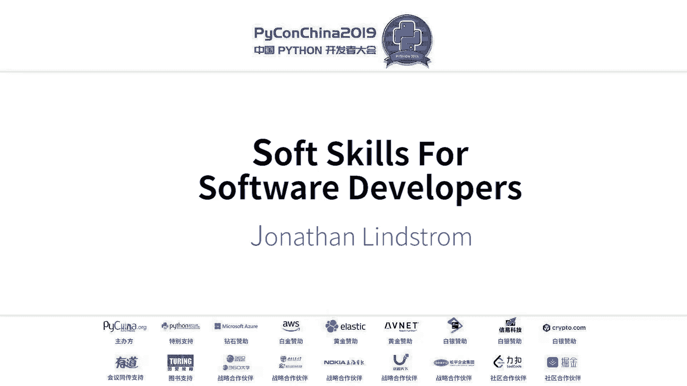
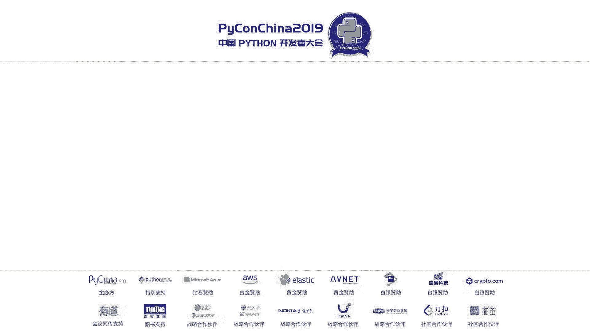
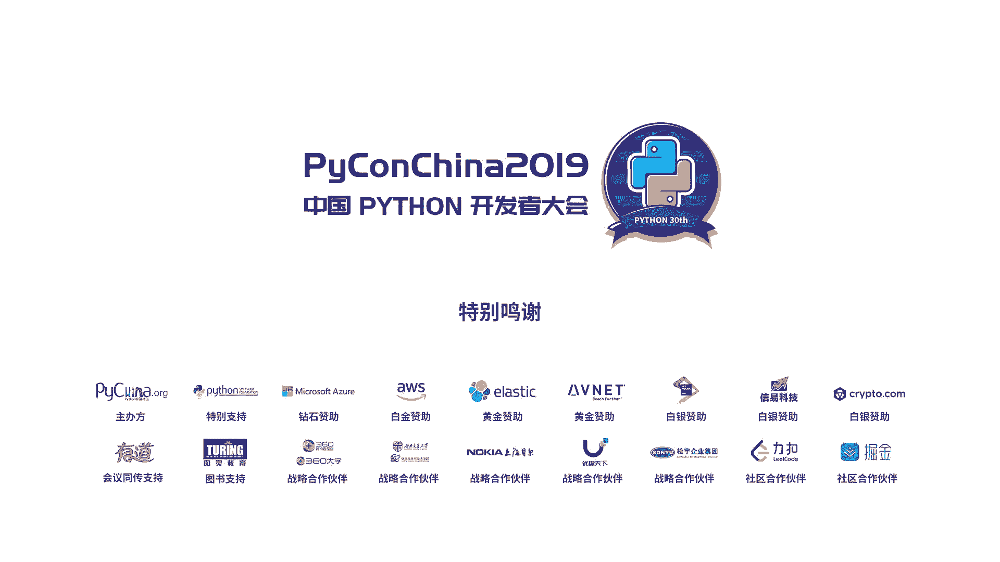

# PyCon China 2019 成都分会场 - P3：3. Soft Skills For Software Developers - PyConChina - BV1mE411v7t8

啊翻下吓。Good morning， it is a privilege to be with you here today。30个。So just to use keyboard。说一。Okay。

お社？Okay。Today， I want to talk about。Ourselves as developers。About our colleague。

 the teams we work on。And our managers。I love this quote。Good decisions。Come from experience。

And experience。Comes from bad decisions。When I look around the room。I noticed that， well。

 you have more hair， but I。I have 20 more years of experience than most of you。

That means 20 more years of bad decisions。And hopefully I have learned a few things。

 I have had some good colleagues， some good managers。😔，And I think， back to。College。

 my first job and things that I wish I had known them。

I wish somebody had told me more than just programming。😔。

And I thought I would share some of those with you today。But first， a quick introduction。

That's not really a computer， it is a programmable calculator。😔，My grandfather was an engineer。

And so when I was 10 years old， I wrote my first program on his c。In high school。

 I wrote basic programs in college to help pay for school。

 I worked in the physics department writing C programs。My first job out of college was。

As a C programmer。But we had just installed a network， and I kept getting in trouble with my boss。😔。

Because instead of writing software， I would administer the network。Finally。

 I decided why should I get in trouble， I'll just find a new job。😔，So I moved to PC supports。

 network supports。Unix system Administration。哦。My Uniix colleagues always said。

 I wasn't really a system administrator， I was just in old C program。😔。

And it is true that I tend to look at administration problems as software problems。😔，So in some ways。

 I think I'm the original DevO， a developer in the operations team。

I worked for seven years as a release engineer and that's when I finally made the switch to Python。

recently worked remotely for a Seattle Web security company and have been working on my own projects for the last couple months。

But that's the only part of who I am。My wife is here today concerned about。😔，What we were eating。

To try to find us healthy food。10 years ago， we had a chance to buy some farmland。

So for several years， we had our own herd of dairy cows in Minnesota in the northern part of the United States。

😔，We also， she loves to bake， so we also ran a coffee shop for a year。 In fact。

 she is a very good baker。 The first year we were married， I gained seven kilos just。Her good food。

But why am I here？in 2001， I worked for An Heiser Bush by Lake He。

My boss asked me to go to Wuhan to install some new servers。😔。

I tell people that I fell in love with China somewhere between the Puddong Air and the hotel。

My wife came on my second trip and she equally became fascinated with this country。😔。

That we have tried to keep finding excuses to come back。😔。

Our youngest daughter went to college last year。We sold the animals。

 We have a friend actually in Qinghai Province who runs an English school。

 So we spend as much time in the mountains， helping him as we can and。

But always looking for an excuse to come and of course。

 to come to Chengdu and see the pandas kind of life throw up。Okay。

I also want to make it clear before we get too far。When you're in your expert business。After a while。

 you realize there are no experts。😔，I am not an expert。I've been programming。For 30 years。But really。

 we are simply on the same road together。I'm trying to learn how to be good at technology。

And good colleagues， and to be helpful to our customers。

So I'm actually very interested to give this talk my experience as primarily in the United States。😔。

So I'll be curious for you to know what is helpful and what doesn't translate well across cultures。😔。

So let's get started。Skills that make us good developers beyond primarily our technical abilities。

I was always told to be the best。In school that was very easy， you looked at your grades。Migrate to。

Your grade's there， I'm not the best。 I must work hard。But after you graduate。How are you the best？😔。

I really struggled with that， especially in my first job。😔，One way to try to be the best。😔。

Is to be a perfectionist。 Everything must be perfect。But you and I are human， we are never perfect。

I remember spending so much time making sure that every line of my C program was as fast as it could go。

 that it was the best。😔，My project actually got canceled。

 customers never used my software from that first child。😔。

So all of that time that I spent on every single line was wasted。😔。

Trying to be perfect on every line of code。😔，Is not useful， is not healthy， I feel。

Agile didn't exist back then， but I do like the agile notion of。Not having a huge， perfect project。

 but having two weeks of work， two weeks sprints， get something done that works。

 make it better in two weeks， add a new feature the next two weeks， but little steps， not perfect。😔。

All at once。Another way I tried to be the best was to be better than my colleagues。

 I have the better idea， my technology is better， my idea is better。😔。

But colleagues are not competitive。😔，Our friend。That's where good ideas come from。

 We'll talk about that a little later。Being in competition with my colleagues is not that they would be the best。

 certainly not the best for me and definitely not the best for the company， the company needs us all。

I can remember not wanting to let people write certain parts of the program because I knew I was better。

😔，Doess that matter。If we're all on the same team， it's not that important。Another way that we。

As humans can try to be the best as badges。When I mean badges， well， badges three。

 my badges are different color than your badge am I bedroom？My shoes， are they nicer than yours。

 Wait， that watch， is that a nicer watch find your car？

All of the things that we think make us better。Is that really how to be better？

So I've come to view it more as stewardship， as taking care of。😔，Taking care of our abilities。

Some people are very good。Was actual coding， other people are better organized。

Other people are better at writing and documentation， whatever abilities we have。

 we need to steward them。Of experiences。Ice。嗯。Oh， I forgot to tell you。

 I'm not a computer science major talking about。Being an expert， I'm not a computer science major。

 I majored in German， actually， German language and literature。I was my college major。

 so I'm definitely not a computer science expert。But I am the only person in this whole room。

Who has milked cows in the winter and spent a year in Germany and or twiceth on boat。

But you are the only person in this room。With the experiences and abilities that you have。

So it is not a matter of are my experiences better than yours or are your experiences better than mine？

But are we each doing the best job with the experiences and abilities that we have？Of resources。

We may be wealthy， maybe we're not， we may be very intelligent and we are a little slower。

 we all have different things， opportunities as well and relationships， who do you know。

 you know different people than I do， but the people you know the resources you have。

 the abilities you have， the experiences you have all of those make you you need the only one in the world。

 and so instead of me trying to be better than you or you trying to be better than me。

 we can each try to be best at using what we've been given。One thing to be somebody else。

Is a waste of the person that you are。I hope in。Five years that I'm not the same person I am today。

 and five years you won't be the same person you are that we will each have grown in some ways。

Here are a couple thoughts on growth。😔，I remember in college thinking of all the opportunities that I had。

😔，Could do this。 I do this。 I could do this。How do you choose。When my own children got to knot。

Decision。I told them to turn the question upside down。😔，It's not what can you do。

 You can do so many things。What can you not。Not do。What is that thing that pulls you？And every time。

You keep going back to it， as I said， my wife is a baker。😔。

And she will try lots of different recipes， lots of different experiments。

 and sometimes they are delicious and sometimes they are not。😔。

And when she is so discouraged that the cake she tried did not work out。What did she do。

She goes and reads the cookbook。And finds a new recipe。Because she's fascinating。

And that's the thing that draws her back For many of us， it's coded。

 What happens when you have stared at the same piece of software for so long and you cannot find the bug。

😔，P is there and you can't see it。You might walk away， you might take a break。

 you might go have a meal。😔，But you've got to be thinking about it， it keeps pulling you back。

 you want to solve it， you want to figure it out。😔，What is it that you can't not do？

Growing through difficulties， have you ever had days that you said， why is it not easy？😔，哦。

If the computers were easy， everyone would be doing it and you and I wouldn't have an opportunity to chop。

But。It is a fact that we actually learn as humans through difficulties， not when things are easy。😔。

When I made the switch to Python。There's a both diving and Python。And I read it once。

But I did not have a project。And so I read it and read it and read it。

 and I didn't remember any of it。The second time I read it， I had a project that needed Python。

And so I read it again， but I paid attention to every page because I had to。

 because I was confused because I needed the help that the book had。😔，So it is actually through。

Challenges。That we learn。I told you I studied German， so I will。Teach you a little。

This is from a German poet。D Ze Laden inines I'm vimist their chief be the immigrants designer。

Winning。Does not tempt that man。He grows by being defeated。Decisively。By ever greater opponents。

I feel like this describes really our lives as humans and our lives as developers。

We don't get to the end， there's always another piece of software to write。

 there's always another challenge。😔，对。We never get to winning。As developers。

Because there will always be something more。😔，We can be。We can grow by being defeated。

By ever greater opponents。So that this year。Your Python problems are here and you can't figure them out when you have to work hard on it。

😔，In five years， you will still have Python problems and you will still not be able to figure them out。

But they'll be here。Or here。Or here。Directly versus indirectly。

 I was challenged recently with this idea that。Some of the things we try to do。

 you can't get there directly。😔，How are you successful？😔，How are you popular。How are you effective？

Some of these things that we want to be。If I try to be popular。😔，I don't know how to make that work。

😔，But if I try。Simply to be honest。Andre good friends。那为什？Well。

 then I will find that there are people around me， and I do have friends。

 but if I try to get friends。😔，And work hard to be popular。 So everyone likes me today。嗯。

That's not how it works， and I will not have any friends at all。😔，So not to try for the goal。😔。

But to simply be authentic。And find that I get there。那你个。Realizing that we are not on our own， know。

 the internet is a wonderful tool。I was a system administrator before the internet was common and there are times。

😔，When I have been solveed by a problem， I'm the only administrator and there's no one to ask。

I can figure it out。Or nobody's going to figure it out because I'm the only one in the room。But。

With the open source community， with conferences like this。Colleagues， work， classmates。

 we are not on our own。😔，So let's talk a little bit about teams。

Working productively with people with different skills， interests and personalities。😔。

No man is an island entire of itself， it's an old English poem。😔，In an American。Poet said。

 whoever you are， I have always depended。On the kindness of strangers。

We think about even getting here today。Did each of us get here independently？

Or did we have some help？Along the way， I know very little Chineseese。

 and so I'm also dependent here in China on the kindness of strangers。To help me out。

I was trying to get seen I was trying to get from a hotel to the airport。

 and they only took Recha but I don't have a WeChat London。Fornately。

 there was another person who was willing to trade me if I paid them。

 they would pay for my tickets so I could get to the airport， the kindness of strangers。

 we're not here。😔，Simply on our own efforts。😔，Another German quoted Levent Trimansic Isibal in life。

You meet everyone twice。I don't promise that， but。😔，Projects die。Friendships remain。

And so I told you about the first project where I worked for four years on a see program that never was finished。

 never was sold to the customer， was never used by anybody。😔，那 yet。I still have。

A LinkedIn contact from that。不南。And so as we work with people。And for many of us as technical people。

 we focus on the result， I must get this done， I must get that done。😔。

I must figure out this algorithm。Can you。Will the project ever be finished， will we be reassigned。

 will the company change its mind？ふな。But we will still have our colleagues。Friends， a classmate。

Those relationships we've built。If we have been so busy trying right if I have been so busy。

Trying to be right。Trying to prove my point。That I have chased off all my friends。

Then what do I have？No projects， no friends。But yes。I have worked as a。

As a friend and a colleague and a cooperative individual。Throughout the project。

 whether the project succeeds or not the relationships will succeed and will endure in five years。

 ten0 years later down the road， we may find we're working together again on in totally different project。

We will have had a solid relationship。So I have had to learn the hard way。😔，嗯。

That it is more important。On how we treat people on versus how we treat the software and to make sure that we always leave well so that when we do meet a second time。

 it will be a friendly reunion。😔，Another point about our colleagues。

Vendors will sell anyone or computer， anyone can buy loud datas。What makes our companies different？😔。

你啥。And their teamss。That's what makes us better than our competition。Ftter ideas， better interaction。

 more cooperation， ideas flowing。So that again， to view our colleagues as resources。

And not as an obstacle to get into where we want to go。It is a team to get there together。

I'll talk about an idea that has really。😔，Influence my thinking in the last couple years。

 it's called appreciative inquiry。😔，The English word appreciate can mean to think， can mean to value。

Oh， wow， that's a really nice painting。It costs mean to rising value。😔。

Your house is worth more this year than it was last year。😔，Appreciative inquiry。

Take advantage of both of those。Inquiries simply to ask questions to inquire。😔。

There was an American college professor， this is a quote from the homeage from appreciative inquiry。

AI is about the search for the best in people， their organizations。And the strengths fill。

Opportunity rich world around them。AIThis is not about intelligence， this is appreciative inquiry。

Is a fundamental shift in the overall perspective American。Business professor。

And he would consult with different companies， he would go in and he would ask questions。😔。

What's wrong， What do you want to fix。His wife was an artist。

And they were walking through a museum one day， and she said， you know。In every picture。

From whatever。There is something beautiful。You thought about that。That as an artist。

 she had an appreciative odd， she could see the beauty， some beauty in everything。And you realized。

That。He had been doing it backwards。Because he had been going into every company and asking what's wrong。

 what don't you like， what should be changed。嗯。Constantly。Pointing out the problems。

And his wife's perspective was an artist form。Let's find out what's good。What's beautiful。

 What's working。And then be more of that。这在封一。If we have a lot of good。It so bad。

If we fight against the problems。😔，We are always thinking about the problems。😔。

And our minds get consumed with the problems。😔，But if we have this much good。

What if we just did more good？😔，And there's no room for the problems。😔。

Because now we're doing even better than we were。If I tell you that 95% of your customers are happy with your products。

😔，What do you do？Do you find out。What the problems are that the 5% aren't happy。😔。

Or do you ask the 95%。Why do you like our product？And once you know that， you can do even more of it。

And make them even happier or make new customers even。

That's the notion of appreciative inquiry is not to focus our mind so much on the problem。

 but on what is already good and how to do more of it。Maybe this has happened to you。

 open up a piece of code。And you look at it， and you say。Who is the idiot who wrote this code。

 This is terrible。 No one should ever write。Oh wait， I wrote that。Six months ago， I wrote that code。

I didn't know as much that。 I do it differently now。

But appreciative inquiry says when you open a piece of code， be kind。Look for their good parts。

And don't think that you idiot broke it because the idiot might have been you or me。

And then quickly about our managers， I was a manager for a couple years。As an American。

 we love freedom and so having a manager over us is a lack of freedom and is something that I didn't like。

 but I have learned that managers provide some important things。One that provides structure。

My first project， I didn't know how to manage a project。

 and my manager unfortunately didn't know how to manage a project。😔。

And so we just kind of tried from week to week to figure out what was next。😔。

But a good manager will provide structure。Tell us where the edges are。What must be done？Protection。

Especially。As developers。And there are many layers of managers above us and some of those managers。

Now， don't quite understand what it is like to write software。

 and so they have a good idea that is not a good idea。But a good manager will protect us from that。

 It's like an umbrella， there may be bad ideas from higher management。😔。

Our manager can protect us from that。Permission。One day I was a manager and one of our best。

Administrators came to me。And he was talking for a long time about a script he wanted to write。😔。

A script that would help us take care of our。是。And he kept talking about it and talking about it。😔。

And I。Until I realized。It was a good idea。 He thought it was a good idea。

 I thought it was a good idea。But he needed permission。He needed somebody to say yes。

 this is a good idea。对。And so that day I was able as a manager to give him permission。

 to give him space。😔，To do， to implement the good ideas that he had。Nurture。

One of the best managers I ever had。😔，His greatest skill was。Helping each person on his team。

Here what to do next。He was not trying to trap us in a single role。

 but to help us grow in our skills so that we could do something better。

 more challenging in the next years。😔，A good manager provides nurture and finally， authority。

 a manager has authority。And so this is something I would。😔，Do with my team。

 if they had to go for a meeting， I was not able to go the meeting。I would tell them。

 now if you have a problem in the meeting。😔，And people don't want to listen to our ideas。

 Just tell them， well， Jonathan and I talked about it。Use my name on your menu。As authority。

And if I would go to a meeting。And would have problems。I would say， well， Rick and I talked about it。

 my manage。😔，I would use his authority to help accomplish that。

 and so a good manager provides that authority to get things done。😔，So what is the man need。

Now the first thing any leader needs is something willing to follow， we have to be willing to follow。

We need to accept the fact that。At the moment。The manager is above。

Even if we'd like to be a manager someday。And so， we need to follow。Secondly。

 a manager does not need excuses。😔，My first job， I was late every day， almost every。

And every day I had a new excuse for a while I was late。Oh， the train was late。 Oh。

 the traffic was bad。 Oh， it was raining oh。Does anyone care。The point is I need to be on time。

 the manager does not need my excuses， the manager needs me to do what I am supposed to do。

And if I can't do it， to be honest， a manager does not need surprises。😔。

If the project is two weeks late。Tell them as soon as you know that the project is late so then the manager can work with his manager to figure out what to do next。

😔，It does not do anyone you could on the last day when things must be done to say。都有。

It's going to be late。No surprises。Honest agendas。 this translates well。No hidden agendas。

 no secret plans。😔，Yes。If you really want to grow in a different direction to like for me。

 I was a C programmer。But I really wanted to learn more about network administrations。Well。

 that's fine。不。Your manager probably needs to know that so that he doesn't plan how to make you the best。

Developer ever。When he could be hoping giving you more systemive administration practice。

 the more honest you can be with him。The more you can help。

He or she can help you get to where he really wants to go。Hest timelines。

 I guess I mentioned under no surprises。😔，Things are constantly laid in the software world。😔。

I didn't put， but there's a quote。If we knew what we were doing。We would be born。

Everything we do as a software developer is an experiment， if you knew how to do it。

 you would have written that and done something and be doing something else。

 so everything is learning， which means it's very hard to know how long does it take。I don't know。

 I've never written this program before， I was the last one。But honest timelines and honest feedback。

 I having a person on my team。W said。Give me as much work as you need to and I'll work weekends if I have to。

But I don't want him to work every weekend。😔，How much work should I get them？He would never a tell。

So I never quite knew when he was too busy for one more thing because he would always say yes。😔。

But if we are always a hero， if we work every weekend and we work late at night。

 eventually we will get tired and leave and then the company will not have us at all。😔。

So it is better to be honest about what it is。😔，A good level of work。

 What is a reasonable level of work。And if we can do this much。And the company wants this much。

Then the company needs to know they need to hire someone else， they need to have a different team。

 they need to have a new strategy， something。😔，Let them know because if you keep saying yes， yes。

 yes， yes， yes。😔，Until you are so tired， leave。Well， that's not helpful to anybody。😔。

And I wanted to talk just quickly about motivation。😔。

One of my other favorite quotes is actually a fresh。A pilot from the early 190s。

What's motivatedtiv yourself？You major bigger badge。AndMore money。More opportunity。I feel like。

 ultimately。What motivates us has to come from within。The thing that excites us。

 the thing that we can't。😔，あのじに。嗯。And突。So Zubre says， well， if you want to build a ship。

Don't drum off the men to gather the wood。😔，Divide the work and give orders。

That's project management， that's coming from outside。Maybe they will， maybe they won't。

If you want to build a ship。Teach them to yearn。For the vast and endless sea。In in the words。

Once that happen in their heart。To go to the ocean。They will figure out the wood。

 they will figure out the work， they will get it done because it comes from inside。😔，咁到了。

So thank you for the opportunity to share with you。然后的话就说是大家如果是能用英语提问的话，可以用英语提问。然后如果能用中文提问的话。

然后我们这边有句子翻译好，OK好，稍等话。Thank you， sir。 this question you saids once now I'm survey last week。

 I said yes， yes， yes to my leader。And then the project is delayed， so my leader is very， very angry。

First of all， I'm a spider energy to work for a company just use Python to driver the browser like such as Chrome to collecting the data from other website。

 this is the normal this is the normal spider energy inside and first of all。

 my company is a business company to sell some ticket then there are some people they will click click click click and I use some and I use Python to build some project to auto auto this this but my but my。

But but my dream work is data and analysis or some other some other work some other work around the not the work now。

 so could you give me some some suggestion in my level to what to do and if I would I do more height skill or I just have learning some some learning some knowledge such as AI from work or such sense Thank。

That is a very good question。There are universities around the world。

That are all teaching computer science。So there are many thousands of computer science graduates。

Who have。A certificate。But。Do they have experience？😔。

I feel like one of the things that is so important now is to have experience。😔，系。I suppose yes。

 so if there is a way within your company to have a small project to learn。

If there is a way to work on an open source project。😔。

Even to come to a conference and talk to people who are doing it。😔。

That book learning and certificates will only go so far， but that experience will。😔。

Give you an advantage and then hanging around people who are doing what you want to do。😔。

One of them may say， hey， we actually need somebody like that。You should come and talk to my boss。😔。

后哋好。考重要什么。에 이 팬 너무수。Thank you for your sharing。 I have some question about my learning。

 Im new in deep learning。 So I want to be on somebody in few years。

 should So I have a question is what should I do is better in learning deep learning in few years。

Can you give me some suggestion or recommend some books for learning。I can't recommend any books。

 unfortunately。But I。I feel like my answer would be similar is that you need experience。

And so whether you write a small project on your own。Just for practice。

Think about your degree and then you think about your portfolio， the things you have done。😔。

And the things you can talk about。 And so if you have written even a small project。😔。

And maybe it would be useful to a club you are a part of。

 maybe it would be useful even to the company you're working for just as an experiment。😔，啊。

That when you have the experience。Even a little bit， then you can talk about it。

 And when you go to an interview。Then you are able to discuss it。

 as opposed to just having read a book， I told you I read the Python book twice because just reading a book doesn't help。

 you don't remember it。😔，再去。OK好，然后。嗯。Since you said that the time arrangement。

 you just mentioned that you always feel light and you always have a lot of excuse。 So I want to ask。

How should we properly arrange our schedule when the work is very much and how should we give up our health to trials have to finish our work。

I need some re thank you。そ啊。As I mentioned earlier。Projects change companies come and go。

 but our friends and certainly ourselves。Our bodies will stay and so we need to take good care of them。

And if we are。Stressing ourselves。😔，We don't have good ideas anymore。I have one bonus slide。😔。

It was an Italian professor as a student， he could not focus。And so， he would。其他的。

The kitchenitchen time。For 25 minutes， it looked like a tomato。

 that's why he calls it the pomodoro system， pomodoro means。

Tomato and the and he returned however to 25 minutes and for 25 minutes he would only study he wouldn't check email。

 he wouldn't。So look down the window， he wouldn't get a cup of coffee。

 he would own the work for 25 minutes。And then he would take a five minute break。

He has a whole complicated system， I don't do that。

 but I do the 25 minutes and the five minute break。哦。And you can combine them。You can。

Often I will do three ponddo。So hour we're in 15 minutes， I'll take a 15 minute break it。

Because I find that my mind needs to rest， just working harder， just working later doesn't。

I don't have any more good ideas。😔，Ecology， but I would find I would be stuck。I would give up。

 I would walk to my bicycle。😔，And in the 10 minutes to walk to my bicycle and unlock it。

I will to figure out the phone。So because my mind was。On break， it was rest。嗯。You can combine ifi。

 I can combine at the four polymermods。And two more things that I'll say to it。

 I do a lot of work from home now。So my wife is around， so she knows。For 25 minutes， don't follow me。

Because I'm very busy。But in 25 minutes， you can bother。Because I want break。

And so it's helpful for family， for colleagues to know now I'm working hard。Now I one break。

As opposed to just kind of wandering through the day and not getting anything done。O， the last。

And first I want to appreciate your sharing course because I think the soft soft skills is very powerful because I have been for 21 years and I think I don't need that much hard skills for me and so my question I want a soft answer to my question as well。

In fact， I have gone through a project last week with a team of five peoples。 And I think my team。

 the the biggest incentive of my team is the teacher。 The teacher will review quo。 so we we。

We must do it well。 but I think we should find a more。A more good incentive。

 like I just want to do the product well and or interest or something。

 So my question is how how do you define a good team， a good team。

So we keep I go together to do do one thing。Team building is a challenge because each of us is different and we have different interests。

There are some people who just want technology and push for the technology。😔，But as I say。

 other people are better at organizing。And so my wife does not write any software at all。

 but she does keep me organized without her， I would not get anything done。Yeah。School projects。

 even company projects can be difficult because we don't pick our team。😔。

Our manager gives us our team， the class gives us our team。😔，All。

Sometimes we you are left working with people that。

Maybe we don't even like them or maybe they can't keep up。😔，哦。

I don't have a good answer because I struggle with the same thing。

 The most fun I ever had was on a team of 15 units。Administrators to all loved units。

You didn't have to ask them to do anything， we all wanted to push hard to do a good job。😔。

If there are people on the team who don't understand。

 that could be frustrating if there are people on the team who don't really want to help。😔。

That can be frustrating too。So I'm sorry I don't have a good answer。😔，哦。

And I appreciate your hearts that from the inside you want to do a good job。

 you do want to build you do want to see the ocean， not just build the ship。嗯。Oops， oh。

 that's all doesn't matter。My only advice and the mistake that I did make is pushing so hard for the project。

😔，And forgetting the people。Because in the end， the class will be over， you will have a grade。😔。

But the people will still be there。When you will want them as friends。

 you will want to have encouraged them along their path。先。

