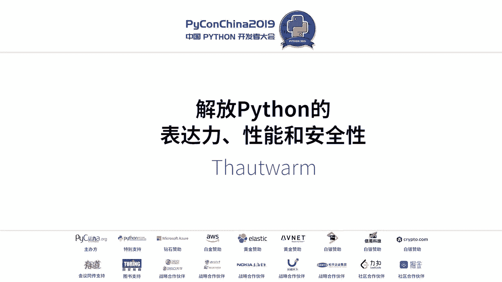
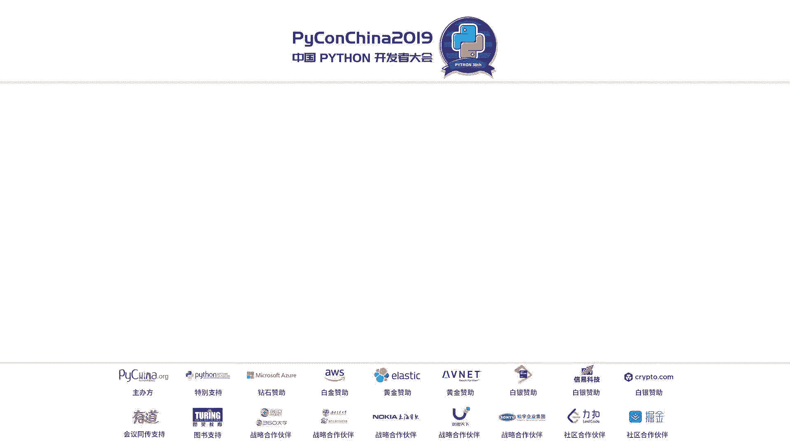
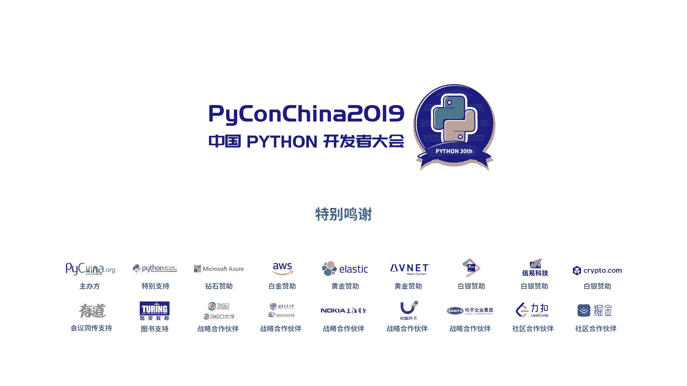

# PyCon China 2019 成都分会场 - P4：4. 解放python的表达力，性能和安全性 - PyConChina - BV1mE411v7t8

就今天我们要讲的东西呃，本来是想讲三点的，一个是解放python的表达力是指py呃扩展python语言本身。然后还有一个是python的性能优化，也就是python的GIT这个应该是之前没有人做这一点。

还有就是python的呃安全，这点是用竞态类型来实现。但今天的话因为时间的原因，可能讲不了。然后后面有导师会讲那个竞态类型安全事情，我们就先放这。呃，然后第三点的话，我们就这个PPT里面就没怎么谈。

然后第一点，首先是语法和语义的扩展。语法语扩展。我们这里呃在之前杭州场的时候呃，有一位朋友帮我讲了就是为什么要这样设计。为什么我需要语法语扩展。然后我们今天就不再着重于为什么还是说这东西它怎么怎么用。

就是给一个教程啊，或者讲一下有是有什么东西有什么样的语法和语义的扩展。呃，我会演示一小部分比方说模式匹配，就大家应该知道就是源于还是源于呃逻辑编程里面的一些比较高级的构造，它就是如果怕会知道是很好用。

它可以呃就是减少就是。呃，降低很多冗余，还有就是派预算。就是说呃如果有一条呃就像呃linux的管道预算不一样，可以把前面的操操作当做结果，然后送给后面的函数继续做运算。我们会演示这些东西。

然后这个表达的扩展它是怎么来的？它它它其实是它是保留了python本身的可用性。就是说你在任何时候都可以安全的开启它，也可以安全关闭它，并且它是白来的午餐。

然后首先我们讲就是语言是决定的你使用的语言决定了你的思维模型。你你们在解决个问题的时候，你有什么语言，就是它决定了你你是怎么去想这个问题，怎么思考它的CI加，然后APL看只是我们求入质数。像哈的话。

它这个底下是实现了，他直接求了所有的指数。然后像APL的话也是一行。你比如说要求呃0到100之类的质数也是一行，就是一行的实现CI加的话就会多一些。这是呃语员从你解决问题的思维模型就是不一样的。

然后比方说呃在实际的业务中去呃这个模式匹配的使用。就比方说呃我们根据那个呃运输工具，它的它的这种它的这些呃数据，然后计算它的有个用户需要给的价格。像这种模式匹配话，直接给出一个比较直观的这个呃结果。

就是说我们知道啊对，比如说第第一个case什么意思？就是说啊有一个car，然后他的passenger把它mat然后bra，就比方说他可能跟可能这个car它的价格和它的这个牌子的这个。呃，即便跟高地有关。

然后会就会输出一个对应的你需要给的价格。这种这种对定关系是比比使用也非常非常明确的。然后在paon里面的话，你要实现这些东西的话，你就需要写很多的ifel。然后他并不是非常直观。

当然如果你很你如果这代码如是你写的话，你可会觉得很很清楚。但是别人第一眼看到他是不能够一眼过去就明白你在干什么的。然后语法中的呃语言中语法问题，它其实决定了就是语言真实的表达力。

如果我们我们在一个语言里面写一个东西，他写很多代码，那我们那里其实会会下意识的去抗拒这样写。因为他很写实很繁琐，你会选择我会选择别的做法，可能更写些更简单的。然后我们我们其实还是希望python就是。

他是比较完进一流的，希望他能够解决python能够去呃这个呃accommod所有的这种这种advance的语法。然后我们开阔一下扩展一遍，开阔一下思维。就是我我设计的一个系统，它是什么样。

它是呃用这个pre来做这种标志。比方说呃你在文件的时候写个模然后它这个会开启这个法扩展。但其实你只写的话，它认任何扩展都会用你必须在在开启模扩展之后，然后用这种请号加什么。

它会它会去找对应个扩展有没有这样扩展。然后比方说我们这边开始扩展是。你可以看到那个map那边用下划线表示它是一个函数map第一参数，你看一下是下划线 score，more它其实是个，然后它是那个mod。

然后去上一个。就是说它第一个参数其实是一个函数，然后pi在嘛它那个那个管道本来是本来是pythonpython后，然后在这边我们通过呃加在这边这一块这一块代码去加这个盘带扩展之后，它就变成了函数调用。

然后就这样然后这个这个然后底下的就是的话就是就后面再讲吧，它就是也是语法扩展。你可能觉得看起来好像很神奇，但实际上它实现是非常卫生的。他没任何就是我和已有框架它的不同之处，就他们会去有东西叫in。

它会他会去呃查文件的I，会去查那个源码在什么位置，然后再通过一些去重新从源码中读到原来那那段函数所在的代码，然后这种操作是呃非常的不可靠的。比比方说如果你使用这样的机制的话，那你文件如果不在了。

那你的python文件就运行不了。我们我们其实有很多时候还是希望比方说能够呃把python打包成那个pythoncomp发布。这个时候话呃就需要一种python完全兼容这种机制。你说第六点。

在任何情况下，就是如果你不使用python能够实现的功能，能够有的功能，你在使使用了这个系统之后，它还是保留它只是一个就是附加一个扩展。那他怎么工作的？其实我们介绍一下python import机制呃。

实现与把馈只实有四种方式在我杭州的PPT是有的。这面我们讲一下python importport，它是最好的一个，它是python的python的inport。呃，paon或怎么样？

他首先会呃从一从sstem呃SYS这个模主里面，它有有个成员叫me pass。 meta里面有很多的founder。呃他会去根据你的port语句，然后去找到一个对应的loader。

然后这个loader然后会这个load的话是呃是内置的或者说用户实现的是是的一个成员一样的西。然后这个呢就会决定是怎么去这个模块。然后我们的做法就是说一下是thon的源代码原代的那个loader。

然后在他在原代码读过来之，我们我把这给呃给overloadload之后，然后比方说他不代码。我们这边先处理一下未给未给这是我们的做法。这样的话就可以保证任何的行为。就是只要python原来呃谈派的东西。

我们也是抗派。然后这个做法是这样的，这个其实就不用多说了，大概给大家看一下。这是件搜字后拿到之后做什么事？然后最后返回。然后这个东西简单解释，它其实像一个新语别，他只是说借thon，然后编译到thon。

然后他有一个用户很容易扩展编译器，然后他还是可以编译到thon解码发布，它就完全为thon态。你可以这样理解。

但是我不会我在这说他个语但我当不会在什地方去说 language能不可能然后我们就讲这是上最快thon绝对没问题么那个派了个数量倍。然后他有很多的有很多的on。

因为因为我我我本身我专业就是个我我在播的话，我的导师是如果大家知道是也就是世界上呃搞 program language可以说是第一人，然我是他的职业学生。后这个然后我的这个话是基于12的呃这个叫做。呃。

rackd的一篇叫extensiblepart那个文章，然后我给他做了很多扩展。然后把基本上把所有语言的partmat都都可以用我的就是一套东西来表达出来。然后我们可以讲一下。首先它的实现依赖于就是红。

依赖于真正的语法红。语法无法语红是一个从呃语法数到语法数的函数，这是红。然后我们拍子这边呢提供了这个红的机制，比方说我port一下，我就表示这个这里方这这里面这个函数里面是一个呃语法数的列表。

这个是其实是它的实现很简单，但是其实用起来不是很好用。我们只是说有这个东西，这个东西有个名字叫cony court，给大家可以去查一下y court。诶。然后我们就讲party matching了。

这个时候我们要演示一下呃，party matching。呃，总之有很多很多的用法。我问新年呢。系。那那个我这边要开一下。财密导演示一下。啊，我想问一下，在座有写过hasco的人吗？我想问一下。

有人那边有一个只有一个写过哈t吗？两个啊，三个。而也也还行，不是特别少。对，但其他索现在已经工业语言了，它的逼格是非常低的，就是说他的。他的他并不是非常的advise，当我们。诶。이 어？哦。

已经出现了，但是我这边看不到。这个。那我们就先介绍一下这个不太好说。哦，推与法。上面你可看不清楚，其实上面有一个井号加part这边看不清楚，我这边也看清楚，在这边是写了一个井号加它表示开启扩展。

然后withmat match是一个标它这边当标志符。它如果在开启扩展区域，后可以关掉扩展，在开启扩展区域如果有出现mat一个标志符，那么它就等于说这边是一个把要把这样序去进行一个match。

如果他是如这match参数多个话一然后下面实就case。你看一和A对应2和B对应它就自动把构了的话把它加起来，然后打印出来。诶。袁建，你那个工作人员不在，所以呃我不太好去在。

因为我这边看不到我的timemin，所以我没法演示。我们先继续往后面走。嗯，然后他的性能的话，这边刚刚说过是比潘pa要高数量几倍的，这边是20多倍。

可以在这个项目之后应该有能能够查到这个PPT他这边有很多链接。然后preda的什么意思呢？preda他来自港。我这边我写一个F下划线加一，它这个下划线其实表示它是一个函数的参数。

然后它变成了左边的第一行longdown小划线冒号小划线加一。这样的话你可以少写一些东西。然后如果是两个参数的话，两个下划在不同参数位上用一个下划形，它表示的一排一是不同的。

它一个是在左边的排数里面的参数，一个是在右边还去面参数。然后你可以用1001下限一或下方键一来表示来给表示那个第一个参数和第二个参数。约6次话就是样子。这边的话是reduce小写0加小写一。

然后s它就做了一个s reduce。然后还有叫this holder，这个和思要加的个有点像ra holder什么意思？他把整个函数第用看成了一个看成了一个number。

然后整个函数调用它的第一它的第一个参数是下线B。这个呢它这个placeholderer有有一个好的地方说它可以把函数，就是这个F本身也可以当做placeholderer。就是说假说你把这个领域来换位置。

它表示就是我它表示的就是一个lada，那个lada是什么意思呢？是是是传一个函数进来，然后把这个函数就调用个F。而不是，就是如果把零块换位置的话，它表示的声你去调个F，也就传线来参数或去调个F。

这就是c。然后。大然这些东西其实都是可ca价的，呃，都是可以可以变的。比方说我说Q方的，小你你过来一下，帮我弄一下。会我你演示一下，语法其是属于定制的。因为有的时候呃你的变量你可能会和我们的扩展冲突。

那也就只是说哎我换一个，你不要说哎，我不要想我剪的，我用你说有人写过coing吧。Part public。没有人写coing吗？就是很火的一个ja接尾上语言。呃，然后如果你说fr it。

它表示是把下划线换成it，就可以你可以改这个你可以自自自己扩展这个语法。可始切换吗？对，切换呗是的好，稍微说一下，周总麻队不行，他这边这边这边可以这边看到，但是我打字啊，稍周周总麻队稍等一下好。哎呀。

辛苦辛苦辛苦。好，打安了们。好啊。我我觉得我换一个。这个蓝色的能看能看清注释，我希望他。他怕。呃，能看清吗？这个。好像不能看清，我来调一。好。对，能调颜色吗？那OK了吗？

他们这边颜色有点浅调调这个调亮一点的哦。好的，没问题。Oh。屏幕背景老花黑色。是白色的那色这种也行，有种低频的感觉。哦，这样可以了吗？大家感觉好像能看清的样子，还还要调大字吗？完了我再调到一后吧。

带一个黑色的。哦，喷白底吧，关众我之前可在这个上发嘛，说说白底白底才看得清。行好的这样。有啲 he。Yeah。好的好的，没问题。你们。

这个也是播到了之前那边greeneno他当时开会就这样说说你看我们比较一个图说那个PPT是黑，如果是黑底的，就看不清。如果是白底的话，反而好，没问题了。我现在很萌。对greno说的话很对，很正确。

算我还在，好的，谢谢小李好，然后我们比方说我们我们首先来用一下这个这个。哦，拍 fly吧。加快bl之后，然后后面都是排不了。然后我这个时候说Eprint。所这种写法就它好在什么地方？

他是说我我也说人思考方向，它是反着来的，他不是说先写函数。他是先说我要我要处理个什么东西，我先把个东西弄出来，弄出来之后哎糟了，我要回到前面去写函数，然后这个时候就很尴尬，很尴尬的话。

就后面用pa和这样一下。然后你想说哎，后面我还想扩展他就是。呃，我们先开一个会扩展da。呃。Yeah。假如说我现在打我我拿了一，但是我不是我打赢套，我想自定义一下他打赢方式。我想把它变成字符串。

然后放到中间。哦，这个不太好，我想打印他的hels。那用ki打就。诶。这是一个哦，这有问题。这个地方应该用P code的。好，你看这样子说我的操作其实是我随我想到什么，我就我就可以随随随机一变。

我不需要改写面的代码，他们他们他可以改，就是说他能够调整你写代码体现的思维的顺序。然后有些偶尔会反映出它的一些简化的地方。然后比方说reduce这个其实是一个比较好的例子。Yes就。

对吧如果你要写reduce，你要写个lada的话，其实。因为因为我我我敲码比较多，所以我又比较稍微比较严重的肩周炎，然后他就就是打字打多话会很难受，所以会想尽办法去写少写一点。然后这个写起来我觉得很多。

我会觉得很畏惧这样写。所以我觉得这样写，我会我觉得是会好升很多。对，这样的话我会觉得我会我原来不愿意去写一朗达，因为我觉得他写那么长，就是而且读起来看起来不太好读。就是前面有一个在这个定义部分。

其实是会产生产生一些噪声的，会觉得。我就觉得。我觉得很难受。对。然后。之前说的这个例子，比方说有个这样函数。对他其实是个函数。他把他的函数调用的那个函数给carry给呃。

不是carry给给嗯是carry，确实是carry的。然后他的参数是一。这个时候如果说。我回了杭首，我说用他去。把呃拉传一个函数进来。这个时候我们用一下拉姆达。명 print。啊。

他是他其实是print大衣。对。这个呃不只是偶尔会有有奇效，他其实玩起来也挺好玩的。然后我们讲一下party matching。party matching有很多好玩的东西，并且它的性能很好。

它肯定是比你呃会这么说。party matching在复杂情况下去match data去destruct list data。然后它的performance的话其实是很关键的。

但是因为人工他要写出这种优化代码是非常复杂的。所以这个时候用呃一些很多的el你自己是看不清楚的，你会去用一些呃很trick的方式去去去实现这个呃 data的de。

然后如果我用part matching的话，它会很直观，并且它的性能是非常高的。它是。呃，这个性能上怎么说？就是没有没有产没有产生，就是说就是说没有产生种余的地方。我们看一下。比方说有可以去怎么ms呢？

可以去。我少了一个位。少一个标志符，一定要这样去。其实这个max的tking也是可以改的，可以改成任意的。你想要的，一会我们演示。然后这时去me他。好 태요。嗯。嗯，这个意思说把把这个列表按照。

这个规则去match。按照这个如果他第一个元素是一，后面的元素全部pack成tailll。打印他23。但是呃其实这边还还有一点类型安全的感意味在里面，因为他会拒绝。他会拒绝他懂。

也就说他口是不合法的类型。他会他会拒绝。Now exhaust。然后你可以在底下再加一个。全部。好，他打印了后面那个。然后list是一个比较好用的。然后还有是说比方说我们自己定义一个。

就是说他的case他他之前re文章叫extensible pattern。我们这个也是extensible，就是说我们参考了就是在pyython idea上很多就是以前讨论过的一些想法呃。

搞了一个东西叫match pro说you can define your own party。我说。That's that。这一个part叫レ that。然后它的构造是。Self。灯。

给N对N我们想定一个parton说，它可以match小于多少的数。De。Match。笑。这个value这个第一个参数value表示的是将要match的值。哦，没有，我少其实我少写了一个。

他会它会传入另一个东西，叫做N。Acount就是说看max的时候，他的那个有几个参数。看一下。我们这边是一，这个先不管它。So。So。2。match这个match product。

它一定要返回个tople表示是返那个match成功。如果return的话，表示是match失败。它这里只是什么？如果你match出来一个值就是。哦，应该是0。

就是这个upcount的的这个大小会和你后面如果卖成功返回tople的长度是一样的。他怎么用呢？我们我们说我卖几下10，我们看它是不是小于20的。那啊2是。嗯。哎。

我不知道windows它这边好像没到回回杭首的这个就comwindows的话，我直接crlA就回去了。好。O。y，我没写。对，我没讲为，不好意思。Yeah。啊，他打印成功。

但是如果让他说他是不是少于5的呢，十肯定不是少于5嘛，所以他应该会返回一个，他应该会rise那个r exception。他说没有匹配。对，这就是模式匹配。呃，大家有点感觉没？

这个有没有谁现在想问一下问题的？Most people。啊，没有话，我们先继续讲。想你。谢谢。这什的。で。Yes。对，后面还不学万吗啊，应该不是了。然后。要提下。

这不是this is not functional programming。this is justpyython。这不是函数式。因为很多人看到说哎呀，part matching哎呀。

ly这是不是函数式函数式是不是很慢？这观点全是错。首先函数是它不慢，然后这个东西不是函数式，就是说很多人现在就是说他想表示自己知道一些东西。他说哎呀，我会写函数式，这个叫函数式，我是函数式人。

其实他都不是对我是你们可以找我要想学的话，可以找我，我的专业是这个。然后我们讲一下如如何实现和扩展。你看这他实际上过来是很简单。我们这边实现一个东西叫sulpt operator，它表示说它可以重载。

就是你扩展开启范围内的所有的那个二元运算符比如加法OO吧，比如说减法我吧，我可以支持list的减法，就说list123减list12得到list得到list3，对吧？

这这种这种重载的可以通过这个这个扩展来做的。它实际上的话很简单，就是这么就这么多行就可以搞定。首先去从extension去import extensionion。然后从我们这边做了一个东西叫Scomp。

它主要是为了支持pathon3paon3。5以上所有pathon奶粉，所以做一个listcomp。你说你不能从直接从python的标准库里ST，不要从我们这里ST。然后S就是语法语法数是呃哎呃。

那我们先继续讲class scopept operator extension，它记一起就是类。然后它的那个identifier，你看这边对应的关系，identifier。

就是它叫scopt operator，这边也叫scope operator。然后他这边一it存的话，他第一个它有两个参数，就是这边有两个参数。但是这两个字符串会传到这儿。

这样的字串这个加法这个字符串会传到O那边。然后这个 my会传到f这边。然后这个时候我会去查，我会通过一个O map，就是说它是否在我的map里面去查他在不在。他在的话，我就会拿出来，他不在的话。

就就还是把自己。比方说比方说你设置一个超过python的二维运算的一个运算服务，那我也我也会假设你这边已经实现对应s，然后就还是把它拿过来。然后fu play的话下，哎，这边你看多写一行，看到没有？

就是我我为什么会做一个冗余的在，我都没想通，然后C点visit这个时候定义一个叫做呃visit的东西。就这个vis嘛后面会会讲它是怎么是个什么东西，vis的话就是说呃语言的语法数是是数状结构。

然后visit的话可以说呃它会在数上去变译一遍，然后变译外可能会返回东西，可能不返回它变译的规则是说根据这个根据这个类型去做一个dipatch。就说比方说在在二元运算节点好，可以做一些事。

在呃1元运算节点可以做些事。那你只需要在这个vis的一个类里面去实现说visit二元运算的方法和visit1元运算方法，它就会自己去做这个变译。然后rerite。就重写ST就是说用一下。

就返回一个新的ST。然后这个opP map在这儿，它是从python的那个pythonSDL里面去直接抄的，就说有有哪些是二元运算，就说大于小于其实不是不是二元运算。

是compcompare operator这些东西它是二元运算。就说你不能重载大于小于。然后这个vita怎么实现呢？那机构实现办法就是说首先继承AT的notranser。

lowtranser就是说他去访问一段IST，然后把这个然后搞一个新的ST出来，让后吐吐出来。就有有返回的S的vis。然后它的它的主要逻辑就在这段rebinary operator。

它第一个红色这行就说他会首先检查ifN点lele是不是这是一个每一个S上都会有它的行号。这个行号是不是在我开始的范围内。如果不是的话，我什么都不做返回如果是的话。

那么就首先去拿到这个operator的这个。呃，operator它也是ST它会有class，他会有类，把这个name拿出来，然后看是不是在我这在我那个spe operator。

他是不是我要的那个operator。如果是的话，那我就把它变成一个二元运算。把它变啊把它变成一个二别函数的调用。就是说。你看前边。我这边前面这边，他说把加法变成my fun。

也是说A加B就变成了my funAB。然后这边是一个意思，就是。函数放在这儿，如果大家有惑者是可以看一下ST是怎么构造的。第一个是函数，第二个是参数。两个参数。

然后这是keywordpyython的keyword参数就没有然后行号等于原来行号列号等原来列号好返回走了。这样的话就实现了。这个 scopecope operator。我们可以。算们不演示了。

因为工作人员很辛苦，对吧？就是大概知道skillber什么意思就行了。然后我还是。我们经演示这个ipadon支持，就是说它是能能够在ipadon里面支持的。如果是在linux系统上的话。

就是它其实很简单。首先你要有一个那个ipadon profile，然后首先你安然后再安装一下那个mosh这个酷因为这个库有名字的是一个不知道是谁搞的，反正他也他只跟了一次。

然后就就再也没用过这个名字就被它占了，所以我们我们的名字叫moreshmore face。然后你安装一下这个库，注意就是这个参数很重要叫lowcomp，就是不要去把编译成字节码。

然后然后拿到后把这个我库re上的这个i支持的这个文件抓下来，放到你的放到你ipon的那个star up里面，它就自动用到这个扩展。好，然后我们就讲就语法快展就就前面的东西了。

然后我们讲今天的呃最最重要的也是我最骄傲的一个东西，叫justin time con。这东西因为之前还是没还是就说就是。unon unprecedentedpre吧我可以说这样说应该没什么问题。

然后他的做法就是说先从字检码哦pyython字节码装修。然后会经过很多的编译pas，然后最后被说最后变成呃后端的代码。比方说ju鸟代码，比方说son代码。然后它里面有这里面有很多的难题。

第一点是为什么要从编译器要从自建码开始。然后第二点pythonthon的虚拟机是一个战机战机的语义优化 optimization是怎么做的。然后第三点就是说后端和核端它有什么别。

然后我们为什么会preferson后端后端。然后第四个就是这里面的重点就是说战机是怎么转到register。

然后里面的分析其是这里面会我觉得写最好的是这个控制的分析其实还有比如说指针分析这的local指分析这些东西。然后怎么生成范捷点去把战机语义消除。然后最后是ssonGIT的础架构。

这个东西是这东西要感谢那我一天把这个东西想出来非要写出来。它它能实现那个python代码热点优化的。非常好，就是。然后为什么从自己码开始着手？因为运行时的时候，你是拿不到代码的。如果你拿到它。

你在做脏的事情，你做脏的事情，你就和python的兼容性有违背。比方说呃inpect他有一个东西要给他有个操作，我刚才讲过叫g source source话会读文件，读文件会依赖源码存在。

那么如果我们发布文发布python package时候，我是以comp file的形式去发布就reasecompthonthon package。这个时候他就他就它就不可用了。因为它依赖源码存在。

那么我我们就希望是任何情况，不管什么时候你在运行时，你在刚开始启动pa的时候，你在什么时候，你突然想到，哎，我要加入GIT了，你马上可以加没有任何的看那个兼容性的开销。先活性的这个问题。

当然开销也是很少的。然后。还有就是说python or call developer，他写了一个库叫py code，这个库那是真的好用，那是真的好用。它有很他有很多的。

他可以把python的字检码变成一个字检码对象，这个非常的舒服。梳理起来，就是我们我们不用再写passer了，对吧？我就边很讨厌写passer。虽然我专眼中一部分就是这个，他说我很讨厌写他的。

然后之前把长相如何呢？长相长这样。比如说我们上面那个函数，它它它在阶段之间嘛，他说not count好把把一个把一个常数零放到站上。

然后 fast就是把一个东西存到局部变量Z比如说刚开始我那个常数它是消耗，然后store到我的一个叫Z的变量，然后用 fast局部变量Xload的栈上，然后 count就直接把二把常数二放上它会往上堆。

就是堆栈就先是X后是2然后compare说是做一个比，把两个元素消耗，然后得到一个新元素上就是开就是解器开刚刚过程在模拟解器放上去放去开了然后放在上就这样正就就叫解释器开。然后这个东西不好嘛。

所以我们要优化它，然后我们怎么优化它就是首先要做分析嘛，就是要做编译要肯定要做分析。因为python之前码太多了。还有100多个指令。我不可能去我一个人怎么可能去处理这么多指令呢？

然后我们搞PL我会说对吧？我们讲这个col language，一个a small set of core language is a significant。就是说我们要分析它的话，一定要去做一个。

就是说一个精简版本，这个东西要要要讲的话其实很很复杂。我们就说你看一下python的字前码原全是这样的，然后我们指令级减少到15个指令级以内，变成了这样一个东西。就是开始的话，就是这是第一步的pass。

它会把一个它只是减少python指令集，然后把python的战机指令变成一个战机和寄存信息混合。这两两个机器的语义混合的指令集。这为什么不直接翻译？不直接翻译到寄存器机息寄存信息是什么意思？

计存器就是战机就是push pushush，然后计算器就是复复复，对吧？然后计存器息也可以去模拟战机，大家都知道叉叉86会编一个push指令。

然后mps上也可以说啊我是用我去通过去自己去加这个star也可以去模拟战这的这个语义。但是计存器。就大家计层计划只是说语言不好实现，不好去实现上层语言。但是它的这个性能化就是说优化上是很好做的。然后。

为什么不直接把pyython翻译成这个计算器及语音呢？因为它不简单啊，因为太难了。我们举例子，这个例子。我们这边的不是pathon间码，它是一个我写出来比较好理解的。他说把push a放到站上。

push B放到站上，pushC放到站上。然后这个时候将B就是什么意思啊？稍耗站上一个成员而消消耗站上一个元素。然后如果他是对的话，那么跳到B。如果他不是对的话，那么就继续走。你看这个有个问题就是说。

他继续走没问题。但是这个时候BB这边会说pop把栈上的元素pop到E上，就是说把栈上最底上的元素复制到当前的呃这个名字叫E的这个计存器上去。那其实你我想问一下，E等于什么？

你从这里看好像是等于好像是等于B。或者是等于弟理。都有可能。对吧，但是这边好像只看两个，而且还注意可能有别地方跳回避，他是他是从别地方跳的对吧？将 to将 to be。

And it has it still has some objects remained in the star。所以这个情况下，他就说别的站上可能还有剩的东西，他再泡一下，可能就不是这上面的东西。

它EE的等于E你根本不知道它是等于哪个计存性，你根本不知道目不哪个。这就是呃这种直接翻译到计算机机的这个问，它的难点。然后thon还有一个叫ju push if true这个指令我不知道谁想出来的。

好想做优化什么的这个指令它优化起来是相当相当烦。就是说他这子的时候，他如果是 true的话，他不泡，就是说他不消耗，他就还是他如果为数的话，他把这个东西继续放向上。

然后再跳我的妈这个东西这东西很难受反他优化起来很难受。那可不可以翻不反应呢？可以。那你在编译的时候，你要模拟，你要去自己手动在编译上去模拟这个战机，对吧？你去看你在那个函序里面开一个star。

然后说对吧？我我push只能变成star点，然后变成star点star点你在这里去你在编译的时候去做这个star这个东西是可以的这样，就我们有两这样的。然后它的结果就是导致因为它优化不了它的站的模拟。

以导致它的循环非常慢。循环，它它就它就有一个地方，就是刚才刚才的情况，就是说它会从不同的那个blog跳回之前然后导致你不知道他那个计算机到底是哪个然后那个 push优化不了。然后。

基本上然后主俩端说了就是说sson端sson端编译器它是零优化。ssonson的话，它为了支持它为了兼容pyython啊，就是你写出python代码，它为了兼容它，它在每一步都去做了一个。

那个reference count他去inc decrease然后这个thon这个reference count的话有个问题是说好像感觉是不慢，但是他并他让C加加没法优化它，就是你虽然编译到C了。

但是院你那边对吧？有一个fer count。那我就这边我说那这边我就不碰你那你全是re count到了我都不能碰你那我出来，我然把编译成C，那最多就是去掉解示开销，这也不叫GIT这不叫GIT。

你出来代码就是就是把python的解释器编译到一个呃C上面去。其实实际上我们操作起来是比python的解释器还要更慢。因为python还是有很多优化的，不要看python是个解释语言。

大家都说python很慢。其实on对吧在thon2的时候是比更快的，因为那个是为什么更快？因为当的整数类型是分分这个就是有有大整数和符号整数的就现在的话就是说全是大整数，所以很多操作看起来很慢。

实际上python的解释实现是非常canonical的。然后所以我们为了让它快，我们就要写写分析去去掉战战机语。那么中利亚语言，那么如果我们用中量端是不是可以不写的。其实这个时就要说到后端的优劣的问题。

茱鸟的后端，我说真的是洪水猛兽。这个。启动时间10秒以上，我debug我在写，因为它是快捷debug，我第。我就8你一次的话，会有30秒的间隔。哦哦，不好意思，那就没什么时间了，就讲一下。

三层没有go to，然后用程序分区来做这个go to，把把不同的block编译成一个vi循环。然后这样的话CR加是可以优化的。然后。效果就是生成了fin load。呃。最后就看一下这个机制吧。

GIT的函数机制。这个是比较重要，就是说首先我们一开始创建个GIT函数。然后他通过一个方法查找函数去查查找不同的me可是base method的带有监控器，就是说它是它是没有类型的函数参数没有类型。

然后你如果一个东西调用的话，会去记录这个调用记录，然后去找然后会传给这个调调调用记录器记录器的话会每他他他如果不停的被反馈。

比如说每三30次他就会唤醒GIT的编译器GIT编译器说他说我会看他这个调用记录，说我查里面是不是有什么这方法然后这个方法满足拿出来，然后添加到函数里面我去编我去编一个新的函数的函数指针。

那这个时候把指针的地址记下来然后这个是交给GIT函数GIT函数，他说我去更新所有的我把之的拿到一起去编一个新的方法查找函数，就是说我们不是动态我们并不是动态单我们是会去动态生成一个方法查找函数。

这个东西非非常高效。我们去我们我们Dpatch方法是会重新编译的，编译成了然后再把动，然后加起来数量的时候，用新的调整函数就会正确的快速的链接到就是不同的参数组组上。这个框架大概是这这些东西。

他的效果还不错。最后就是性能比较可以看一下GIT就是这个箭条左边是第一次跑，就是这头右边是第二次跑箭条左边第一次跑第二次跑。

第二次跑第二次跑可以看到这个这种数值优化其实可以直接被可以直接导致几十倍的查询。就是说我们现在话虽然只实现了一些的构造。说B包还没实现。后都没实现。但是早都会实现。因为这个比慨。

就说我们所有代码都可以基本上获得2到两倍以上。然后到如果是数值运算话，或者说就是像这样的数值算可能会有几十倍的这种加速。说th性能就会就完全可以通过IT得到就是说相当相当量级的增加。

就是这个是今天的GIT就后面就没有实现了。这个就安全就下午的这个刘宇航刘志航开来讲。好的，就是这样谢谢大家。OK好，我们还是规矩来提问。然后。有。好的提问时间。有要OK好。哎，你好。

就是刚刚你PPT报了，就是说学函式式语言有问题就找你了。因为我之前学他错的时候，就是学到那个数理化那个地方的时候，其实还是会比较文慢。因为自己的那种对象变成的思想太多年了。

就想问一下有没有什么后面的建议之类的呃，这方面建议的话。你说这个问题，你说的是确实存在，就是说如果解决过过程编程的话，肯定是有一定接受上可能会有一点问题。因为但是像我写者的话。

我我我想说的是你可以多去观察就是你写语言有什么不足，因为我是我越写pathon然越我写pa，我是这样的，就是我pas没怎么变然一下就会了。是因为我在写pas的时候，我知哎这个地方有存在不足。

这个地方它有不足之之处。那么这个不足是不是有没有别的语言解决呢，那我一看哎这些哦123这个语言解决我一用起倍感兴切哎，他解决我一直没解决问题。然后我呃你可以去尝试，我可以你建一个路子就说呃。

你去了解一下类型系统。最重要的是说一个叫self type的东西，就是就是trat plus，然后它会延伸到self type和mod之间的关系。比方说你去实现一个呃python那边长类型的link。

你可以查一下就是 link这个就是gu query它就说你thon去link。后你要支持thon的ping就是说ping。

那么你要去怎么实现这个地方会及到就是比方说list select就很多东西它都可以去做吧？但是ap话它出来结果list你一个函数到那么list它会m到那么 array array那么这个地方在thon面就会体现为就是说你的你的类型你会返回自己的你这个本身类是个。

它会回它不但面那个容纳的元素。这个时候在现在出来se就出来这个东西及到就是间的关系。你如果去了解就是说自己手手去下link这个东西就就清楚，们之不同，然后从此就可以。我觉得可以很靠走向排数去变成道理。

因为因为这个是我的经验，因为我是这样过来的，我当时就是这样去一下就把就把type class概念理解了。好的，还有没有？哦，好。네 그 말。你好，就是我没写过el，但是我写过一点点co。

然后后但是就是我了解就是一些公司就是写coing也都是用于测试这类。就是他们对函数式还是不是很信任。然后我我就是也我现在也很好奇，就是因为其实我对这个el和函数也不是特别了解，就是只是知道的一些语法。

然后我就想问一下，为什么科研界对这个el和函数式这么情中就一定要。我首先上明几点啊，首先科研件里面还开是分的，就是主要数值运算里面还是没有什么函数式的。但只觉PL学件肯定全函数是是没有问题的。

然后就是说你说这里面你刚刚问题是说有什么不同是吗？什么情有同情有独钟，其有不同是因为这东西只有它值得研究，别的东西是我们认为是不值得研究，你懂吗？就是说不值得研究。类型是最重要的。

就是说所有的研究权和类型的研究有关。在我们那边，所有东西全和类型研究有关。你可以可想而知。比方说我之前那个extensible partnership，我的导师觉得这东西很简单，这东西没必要。

因为他是untunt我什么东西做不出来，他会觉得你东西只要被t，你根本就没什么意义，他是这样想的。你可知道这类类型它很重要，因为类型它会他会就是说静态类型的，它的表达力是没有执径的。

如果大家了解什么东西，叫叫相关类型，他可以在编译区去把你找出说很多很多东西。这些东西的话，你们可能想不到。比方说说我们在代数呃线行代带出运算里面。我通过静态检查，可以找出所有的就是在运行时。

就可以找出哦在编译区中找出所有的你写的代码中的那个定的unmatch。他会比如说呃这这部曲的，这场举例会有点多。还有刚刚说那个数组的那个就是inbound的检查，对吧？

很多时我们都会去动态的去说强插一个说判然它是越界。但是通过这个类型的话，就可以把这所有的基本上对他会在必要的地方插入动态检查。在所有不必要的地方，把所有的越界然项全部消除掉，可以很想插的能力有多强大。

就是类型的强大。然后我们所有所有研究全是基于类型。他我刚刚提的例子只是说对安全性和对性能的一些提升类型，它还有说表达力的提升。多肽多肽也是基于类型的。真正的多肽是说我们虽然说多肽说哦。

像那部有基于红基于语法多肽，对吧？然后代码长得一模一样，好像可以表达。但是实际上它们类型不同。这这个地方例的话就是说我去我通过代码，我去生成新代码长的差不多代码，我语法的多态。但是这种多态是没有考虑的。

有人考虑的是只有类型多态。我们说代都是类型多态。比方说对吧？我我里面也可以这样，我写一段话长得一样，但是我标注不同类型，它会体现出不同的不同的表现。

有的东西我导师他画面都是他他就是说呃我一个东西比方我这边就忘ex我们GIT解示器，而GGIT的这个编译器。它它有不同的后端，但是不不同后端想用第一第一层，它第一层是一样的。

都是把python之前把它变成一个什么东西。但并没有变成一个具体东西，它变成了一个抽象的东西。这抽象东西以传递类型它就变成了对应的类型，对应的那些指令集，对吧？就是说我并没有生成真正的东西。

我只是生成一个一个就是还还没有决定的还不是具体的东西。但我传递类型。他就变成了一个具体的实现。我的我那边的就是编辑就这样ju亚里边我我没有生成茱亚对应的成级，对吧？

我怕他之前马拉时拿到这个实现是给ju亚和son他们都可以用的。所以无论什么里面都可以用一个这个东西要就说的他和你最终目标要生成的那个数据结构是没有关系的。

这这样的这种多态的形式这些东西都是类型他能够做到的。所以这这是因为这样类型有很多很多的用处，导致他成为就是唯一的就是PO权限研究的唯一的重点。嗯，好的好培训。Okay。嗯，是这样的。

我看一下你的简历啊呃因为我我本科也学数学的然后我研究生也想就往计算机发展。但其实我觉得比如说我最近在学ODE和PD方程。然后我后面再进行编程的话，就会觉得。就很难去调和这两者之间的一些些。

因为数学式一块，然后编程块会占用大量的时间。我必须给你建议，因为我本科怎么过我也说为有些实际问题还是很复杂的，就是你要写起来考虑代码写的好，我代码写的快这确实步。因为我当本也不你刚才肯定是不的。

你不足以去表达把那么精的些数学知识去表达出一个合理的抽象这你就直接行。建议就说？R直接吧？我代码不一定要多看代码我这边这个功能这个函数写这个用下个函数好像有相同好像相似处哎。

别管我建议就说别管这些相似处？但是如果你有余力要余力可以这样代码好吧？这个这个数据公式个数据公式他们看不一样，但代码表怎么这么像这个是果有有余力去了解这个这个相似的话，你会去从里面去发布了更多的东西。

但是我的建议说。还是好，包括我自己的不是。对我其实数学成绩还挺好，但是我确实做不到一点点，我是4年时间亲身体验过来的对吧？对。这这种情况我的想法就是说不要去care代码写的好不好？科学计算对科学计算。

어 원두 그 정에서 근데。

