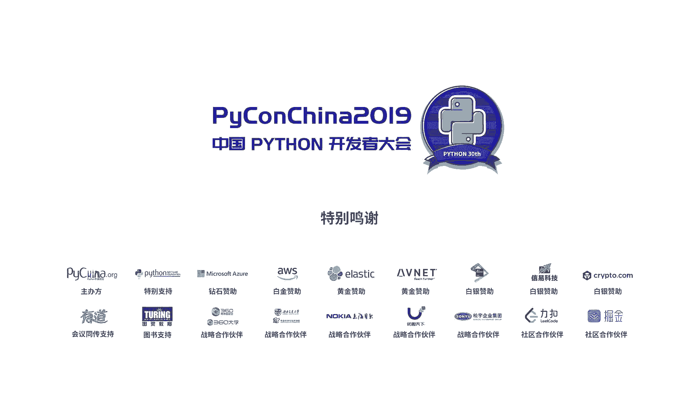

# PyCon China 2019 成都分会场 - P5：5. 静态类型的 Python - PyConChina - BV1mE411v7t8

大家好，我是刘志航。咱今天给大家带来的这个呃演讲是主题是那个静态类型的拍y。

呃，在开始之前，我想跟呃我先说各个部分的呃各个部分讲的内容。第一第一部分就是有关类型的概念，主要讲一些那个讲一些类型的类型系统相关的概念，以及呃介绍哪些类型系统的分类。呃。

第二第二部分就是比较偏向实际运用，讲那个怎么用mad对python的源码进行静态分析，就是进行类型检查，以及怎么给怎么给那个怎么给python添加添加那个。添加类型标记。

然后呃以还有就是还有那个以及拍摄标准的支持。然后第三部分呢就是mad的。呃，就是wiad的一个理论支撑，算是理论支撑嘛，就是代动数据类型。就是为什么要这样设计。最后一部分是拓展知识。

这部分是这部分是oncept的，就是呃没有鉴别能力，就最好当那个最好就当笑话听，就就差不多这样，就鹦鹉我这部分第四部分我自己也自己也不能保证安全性。所以就是呃请大家谨慎使用。在第一个呃。

类型的基本概念就是。有类型不能有类型系统动态以及动以及动态语言类型化的呃，就是为什么他为什么类型化。在这部分开始前，我跟大家分享一个案例，就是在那个3天前我们群里边有人问我就是智能代码。

就他为什么当我们猜当我们在猜是什么情况。我们猜那个猜那个I的型出问题。就就是因为他没截全嘛。我们就猜那个型出问题。我们就是跟跟着他那个之前提供的那个提供的那个调用电长，就是就很很麻烦。

结果后面结果后面我们发现啊他那个filter那个ter函数filter函数回的不是不是是个那个是一个那个filter对象就说 filterter是的就是他是惰性的。

然后然后就是我们让他打印出这个2L打印出这个2L的那个结果，我们才发现原来是这个问题，就是在那个son的时候son不支持那个。呃，对象说呃才发现这个问题。然后当时我就在想。当时我在想。

如果就是如果就是他在写写这个写代码的时候，他用上那个用上卖pa之类的，就是静态分析器的话，那也不能说这样的，就是呃。如果python它默认是带类型的话，至少在一定程度的那类型检查的话。

那这种问题就很好找。就是他会直接在直接在那个2L等于那个等于filter嗯那个地方给绍错。然后这里我这呃以前我跟别人说那个python是没有类型系统的，然后那个人就是。就一本正经的回答我吧。

python有类型，python有类型，我当然知道python有类型，但是python没有类型系统，类型和类型系统就是经常被人搞混。呃，所以我我这里先讲一下类型和类型系统的区别。呃。

首先python里面类型的概念，这里的python指的是CPthon呃，它的类型就是由那个由那个那个在那个CPthon里边那个object的呃头文件里边。

它定义了一个叫那个拍 objectject的对象，这个是那个python的对象头，就是任意一个C结构。只要它的头部被塞入了那个被塞入的这个结构，它就可以被当做合法的python对象使用呃。

那这跟类型有啥关系呢？python在运行时，它的那个他的一个那个。类运行时的类型信息就存在这个对象头里边了，就是这个第三个元素呃，第三个元素是。就是那个叫什么着，就是他的那个对象指。

就是那个类型对象的指针，它指向类型对象呃，python的类型是这个它它的类型是运行时的一个类型。Cpython的类型是一个运行时的类型对象。但是python没有类型系统。

这就是python里边就是很多很多一些就是写的时一些坑的问题，就是由来。那么说到类型系统。我这样这里要向大家介介绍类型系统的类型系统的概念，就是类型系统到底是什么。呃。

类型系统是一种编译期的一一种呃一种检查规一种检查规则。它是由某种规则来保证代码的安全性。类型系统的基本目的是防止程序在运行时发生错误。呃，这里应该这里严格来说应该是发生错发生执行错误。

而而不仅仅是类型错误。只不过我们在目前工业界普遍使用的语言里边，它它的那个它的那个类型系统仅能保就是仅能保证或者是还不一定能保证它的那个它的类型安全。呃，如果当那个语言在运行时不存在任何形式。

注意是任何形式的类型错误，那么它就是建状了。建状性就是类型系统研究的一个重要目标。然后呃类型系统应该应该是属于形式化方法的一种，它是呃就是就形式化方法呢让就是数学像其他工程学科，比如说土木工程。

比如说呃就是。嗯，其他一些工程学学科的呃方式一样，他是用数学来就是通过数学分析，呃，然后来提高设计的可靠性和建造性。呃。类型系统算是其中一种比较轻量级的方法。呃。

他们就是不需要程序员有太高的那个呃就是太高的理论知识和专业就专业知识。呃，仅仅能够使仅仅通过使用就能就能够达到达到提高安全性能目的。然后这里轻量级机机轻量级技术里边还包括模型检测运行式验证呃等等。

然后但是类型系统是里边最流行发展最完善的一个，也就是也就是前面红姐讲那个啊讲，就是类型系统是那个PL就是PLT就是编程语言理论里边一个很重要的东西。呃，类型系统的作用是啥？

类型系统刚刚讲的类型系统是什什么东西，但没讲类型系统的作用。类型系统作用是啥？类型系统它嗯总体来说大概有三个作用。第一个就是最基本的错误检查，呃，然后就是提高程序的安全性。然还有一个是程序验证。

这个东西呃怎么说呢？这个东西是比较偏向专业性的，他们就是通常使用那个就是用一些呃用一些比如说依赖类型系统啊，用一些呃形式化验证方法啊来。呃，来对程序进行验证。第二个作用呢就是作为文档的类型。

就是有标了类型的文文档。我们呃不标了类型的那个代码。我们我们在阅读它的，我们在阅读它的时候，我们会比如说函数函数签名，我们在阅读它的时候。

会本身通过本身通过一个本身通过一个它的那个类型签名来猜测它的作用。比如说你看到一个函数，它的那个签名是签名是呃list呃，不签名是一个呃list和一个和一个in，然后返回一个返回一个一个T呃。

返回一个any，这个是就是返回任意的对象。呃，这个时候我们应该能猜出来它就是那个比如说猜出来有索引或者类似于索引的作用。然后甚至呢就是举个极端的例子。就是说呃前面那个红姐讲过一个叫sco编程语言。

甚就是sco个程序员嘛，他们会在一个叫gogo的网站。他们怎么他们能够通过甚至能够通过。函数的类型签名来搜成想要的函数，这个是一个这是一个极端的例子。然后第三个作用呢就是。呃，类型系统呃不利于编译优化。

这个呃，不是说说动态类型不易利于编译优化。这个是为什么？我这里呃粗略的说一下，就是动态类型，它不能保证它的那个呃它的那个叫什么来着？他的那个。呃，变量的类型也不能保证他那个就是在某些动态语言里边。

它也不能保证呃某个对象它的内存布局它是固定的。比如说拍on有些黑魔法，我就特别讨厌那黑魔法，就是它可以在那个。叫什么来着？他可以通过一些魔方方法来修改呃。来修改这个就是增减破坏性的增改那个对象的元素。

这这个东西它是那个ID就是IDE想对这个东西做分析，做提示，那是很难的。呃，这个东西，然后我们为了达到这种这种程度，这种程度的动态动态性，我们就需要在运行时通过通过反射，通过查哈希表呃。

来对那个来对呃结构的元素进行访问。比如说那个python的那个python字节码里边就能看出来那个load simple，就是呃不是load name，就是那个呃加载名字。

他们就是这个字典码就是直接直接加载名字，直接查哈希表。就这一部分的这一部分的损失的效率其实还是蛮大的。然后还有一部分损失的效率就是就是object check呃，就是对象的类型检查这个在。

理论就是理论上来说，在那个每一个那个nive每一个python的那个呃letive接口呃letive接口里边调鱼它是有一个那个他都都是要做一次做一次那个内型检查的。呃。那渐进式类型系统呢？就是怎么说？

这这是一个接下来就介绍那个类型系统分类。我们这里介绍一个叫渐定式类型系统的东西啊，它它就是相对于就是怎么说，它更是以传统的静态的类型系统更适合动态语言。因为它是渐进式的嘛，字面义就渐定式。它。呃。

就是说我们再写一个比如说我们考虑到J javascript和tscript的关系呃，那个我们的那个呃我们对我们的对那个以往的遗留代码进行那个进行包装或者是添加那个类型检查。这个过程是逐步的。

我们可以把我们那个完全动态类型的代码逐渐逐渐替换成那个静态类型的。这一部分就是说我们这个类型系统，它是同时允许静态类型动态动态类型的存在。所以说它就是它它同时存在动态语义和静态语义。

这就呃相比于就是直接一下子全全呃全部弄成静态，更适合动态语。嗯，这里要介绍一下那个类型系统的另外两个分类，就是一个是声明是类型系统，一个是结构化类型系统。呃，这两个东西可能呃怎么说。

这两个东西可能我用词不是很准确，它应该应该差不多就是。呃，声明是类型系统，它的类型检查，它是通过那个呃它是通过类型的名字来检查的。这个他通过类型的名字，我们通过检查类型的名字，推导和检查出类型的名字。

我们来呃我们来检检查那个类型的就是它是不是正确的。然后然后结构是结构类型系统是什么呢？结构类型系统，要讲这个要讲这个我们首先要讲鸭子类型，就是在我们看某个对象，我们看来讲的像鸭子，行为像鸭子。

那它就是鸭子。那就是说结构类型系统，它是通过检查对象的形状，比如来检查类型的。比如说tscript就是它的类型系统，就是结构类型系统，结构化的类型系统。呃，但是我们的那个我们今天要讲的mad。

它是用的那个。他说的声明是而非结构式。呃，接下来这一部分我要讲那个wiad和。和python的标准支持。比如说呃4843107的标准，就是myad是如何利用这些标准的？呃。

首先介绍是那个呃PEP3107，就是函数注释。呃，就是由于pyython2里边缺少那个呃缺少函数注释和返回值的标准，所以这方面的那个标准就很混乱，就是就是各种库有各种自己不同的做法。所以。

所以就是一些工具会解析文档字符串，然后一些会采用另外的方法，甚至甚至装饰器啊呃来那个来寻找函数的注释。呃，这个PEP就是为了清定一种标准的，就是清定一种标准来统一这些混乱的混乱的那个原信息呃。

原信息占取方呃方法。呃，这个这个PP是就是就是一个很重要的那个time hints呃，这个东西他用它是参考了myad，它这个标准在那个在那个python的那个呃官方页里边。

对那个PP484里边他有说过他那个参考了mad呃。PP1307增加了对函数各部分定义上任意就是任意注释的支持。但是他没有提供，就是没有规定。但是他但是他没有规定这个东西是拿来干嘛的？呃。

但是它始终存在一个就是隐性的，就是隐性的目标，就是让让这些函数的注释函数的云性源信息能让他们用于类型提示。呃，这个PEP就是为那个就是他是为类型的注释，函数类型注呃，不。

他就是为那个类型注释提供标准语法开放呃。呃，就是怎么说，就是能让能让我们在呃我们我们在开始代码中能能让我们拿到那个拿到这个注释的信息呃。呃，在这些目标里边，静态分析就是一个首要的目标。

这包括就是这包括对一些类型检查器的支持，以及以及就是IDE对python代码做分析的一些就是一些操作。呃，由于这些注释呃，虽然这些注释在运行时可以通过那个那个属性拿到。

但是运行时它默认是不会进行任何类型检查的。因为是为了安全呃，不因为为了兼容性嘛，它就不不会做任何类型检查。因为on始始终是一个动态类型的编程语言。然后但是在该题案中。

它假设存在一个单独的第三方的呃类型检查器。比如说我们的mad。然后呃用户就可以自由的通过这种类型检查器来检查源代码，呃本质上来说，这种类型检查器可以充当非常强大的呃类型提那个提示器。但是呃。就是他可以。

用户可以在运行时也也采用类似的检查器来检查，或者通过这些原信息来做GIT优化。呃，呃，比如说那个。就是针对这种。这个先跳过，这个这个不好说的。在但是在那个截止PP484484天提出的时候。

这些工具还没有成熟。呃，PP526呢是它是什么？它是那个它是变量注释的语法，就是呃尽管类型注释很有用，但是通过这个就是这里的类型注释不是指之前的类型注释。这里类型注释是指那个在我们那儿就是看到没？

就是通过注释来做那个来做类型注释的方法。这个类型注释呢它是。一种非官方的方法。因为就是。通过类型来做，本身就是减少就是避免对语法造成破坏性的破坏性的那个。一个特性就是避免做那个破坏性的。一个检查。呃。

但是。但是在分支条件里边，这种这种。就是这种类型注释就很难读。然后由于类型注释本质上就是在那个在这个提案提出前并不是类型的一一部分。所以如果thon脚本想要解析这些类型信息，他们需要自己实现ST模块。

自己实现，而不是用官方的T模块。比如说在ad里边就是以前代码的兼容里边有有引用到那个的T那个库。然后这这个时候同时这个时候呃这种这种用注释来做类型提示的方法并不是很好的嗯能与普通注释区分开来。

有些IDE对类型对那个type那个type加了那个加了高亮，有些没有就很难受。所以因此因此为了让那个类型注释成为专有的语法，就就能缓解以上大部分的问题，所以这个提案就被提出来。

然后接下来讲的就是就是纯粹的那个mad怎么用了。呃，我们通过那个标准的一个那个PIP安装包的方式来安装，然后通过那个mad，它mad本身也是一个也是一个程序嘛，它通过它来检查这个你的程序。

我们同时我们也可以通过那个呃指定参数PP2来那个来对python2的呃代码进行分析。但是但是那个mad它必须用在python2。5及以上的版本。呃，这个字是不是有点小？

在那个我们要对普通的一个呃一个函数，一个代码，一个函数来做那个添加类型添加类型提示呃添加类型检查的话，我们不只是不只是使用那个直接是命令函数Mad program那个那个不行，那个不行。

我们需要对那个函数，我们需要对函数加上类型注释。就是我们比如说我们在那个那个第一个是里是普通的一个那个一个呃函数，它就是实现一个那个hello hello加那个类的功能。

然后这个时候如果我们传递我们如果传递那个三传递那个数值类型，传递比特数组。然后这个时候我们就会在运行时放呃，就是我们就会在运行时报错。

然后这个东西其实它它就是可以在那个编译器避免了这个东西慢开就能检查出来。那就是就和往常一样，就是any。就是我们如果要想它那个添加上类型注释，但是我们要也要让它不呃也要让它像那个原本的mad。

就是像原本的Cpython代码一样，呃，就是可以传入任意的类型。那我们这里可以用an进行标注。然后。呃。但是他这个其实是一种过渡的方法，它有点像脱裤，有点像脱裤子放屁。

这个呃它是就是在我们那个对工程代码进行重构的时候，我们还没有那个。诶。进行重构的时候，还呃有些有些问题我们就可以暂时用这个东西来呃来暂时作为一个临时的解决方案。

然后这里要注意的是object跟那个any它不是一个东西，在mad里面它不是一个东西object它就是就是有那个pa定义的单纯的object的它它那个他的那个能访问多少能访问多少方方法，能访问多少属性。

那它就只能访问多少方法，而是多少属性，而any不一样。any就是真正的那个真正的任意类型。然后这个时候我们这个时候我们会那个就是想，就是如果我们加了类型注释，我们函数的默认参数它哪放。

其实就是加在那个类型注释的后边。就可以了。然后检查容器的参数类型，就是这个部分它就是。这个部分他是讲讲那个。这个部分它就是呃一个对那个它其实这个listTR它是个那个范型，它是一个范型。

一个就是STR作为list这个这个范型的一个一个类型参数。呃，然后我们通过呃这里我们可以通过那个对容器类型，就是python自己定义了一些容器类型。比如说sets集合，比如说t就是那个元组。

比如说呃d就是字典，它可以可以对它那个对它进行那个。呃，可以使用他们对对容器类型复杂的容器类型进行标注。呃，然后但是但是我们这个list呃，我们在我们如果一个那个一个函数，它能传入一个list。

它能传入一个那个tple。但是但是如果我们加入了一个那个就是可迭代的对象。但是我们可如果加入了一个那个。一个。就是list的类型注释。那我们如果传入t的话，他这个类型检查还是很严格，他会直接报错。

那这个时候我们就用一个那个用一个。用一个呃相当于更加抽象的类型，就是可迭代类型。这里有一个叫可迭代类型的东西，它可以就是支持传入任意的可以迭代的对象。然后部分类型部分类型是什么呢？

部分类型就是其实就是只有一半的，只有那个只有容庆名的，只有那个名字的一个呃一个范型的使用。呃，它会mad，我们的mad会对它默认推导为就是把它的类型参数默认推导为艾里，就是呃用这种方式来。

可以用这种方式来简化书记。嗯，这里要介绍一种强于安y的约束。强于安利的约束，就是这里是介绍的是unionunion是如其名，它能允许就是呃类型A或者类型B或者类型C呃，这个是就相当于是放宽约束。

它能够同时允许那个。呃，同时允许就是他的那个呃它的那个泛行参数里边的那个类型，可空。这里要介绍一种概念就是呃myad它默认推导的那个变量，它是不可空的。

就是我们比如说我们有一个我们有一个那个类型有一个变量A，我们把复制为呃我们在做呃做类型提示变成就是将它类型标为int，然后复制为一，但那这个时候它就不能复制为no。因为呃no它不是in类型。

所以说呃myad这里提供了一个叫op的东西，它可以同时允许变量复制为它本身或者是no，就是这就是可控类型，这就是可控类型。那局部类型推断又是什么呢？局部类型推断。

我们这里可以看到它的参数有一个那个可迭代的f可迭代的可迭代的对象，Yeah。还和一个那个和另外一个f的参数，然后它的那个结果是返回一个呃类型参数为f的呃list。然后这里我们。

可以看到他们那个首先我们来模拟一下这个类型推断的过程。呃，myad把这个东西把那个ot old foot它推导为那个呃list，然后它的翻译参数是any。然后对于那个对于迭代过程中。

我们就是number是可迭代的f，那那那么就是那么就会被推到为floid，然后呃。通过那个通过那个n的模方方法，我们可以把那个limit做。

就是这里已经有通过模方方法把第二个参数就提呃把第二个参数推导为f。然后这里就做了一次检查，就相当于做了一次检查。嗯。这里如果flowow如果那个limit它不是foor的话，那他就会报错。然后。

然后我们在那个对那个output进行append的时候，就是他它加入一个那个n，就是nf的，就是加入一个flo类型的呃一个一个元素的时候，那这个output它就补齐了，它就会补齐完了。

它的类型就是就是它类型就是list。然后它的泛译参数是flo。然后这个时候再返回的时候，我们呃麦ad会对它对这个默认的返回值呃，不对这个标注的返回类型和它的那个返回值推导成功推导出来的类型进行比较。

这里也要做一次检，这里也要做一次检查。呃，这里要注意的是，返回值为no和返回值为no return类型，它是不一样的。如果返回值为no的话，它是拒绝它是。返位置维落，他再可以复职的话，他是拒绝了。

因为我们从常理上来说，我们的那个。我们的变量啊，不对我们的函数返回呃，返回诺，它是不能被接受的。然后。no no return呢，它是re，它是它是可以被复制为任意类型，就是被复制为任意类型的变量。

这个具体为什么，我们等会会讲。呃，可调动类型可调动类型一般来说就是函数或者B包。当然我呃。呃，对函数进行呃进行传递的时候，就是这呃对函数或者P包进行传递的时候。

我们可以用那个ca对那个函数的类型进行标记。呃，它有两个类型参数。第一个是函数的呃函数的那个参数类型，这个东西有一个有一个那个有一个更是是生意层的一个。一个list来对他做那个做表达。

然后另外一个就是它的返回类型。这里我们复值的时候会对这个F做检做一次检查呃。但是但是我们如果是X，它没有标记为那个没有标记类型，直接做那个莱姆da，直接做莱mb打，就是它把复制为莱姆打的时候，它它是。

他是不成功的，因为因为我们这里连档它是推导不出来类型的。连打他推导不出来了一些。关于常量呃，麦派充提供了常量，一个叫一个常量检查。这个常量如字面意思，他就说被他标注的那被他标注的呃，被他标注的名字。

它不能再复制，被他标注的边量不能再被复制。类型别名，这里要讲的叫类型别名的概念。呃，在其他编程语言里边应该。应该是肯定有吧。这就是说我们遇到会有些时候会遇到过强的类型比，比如说特别是C加加啊。

这些重点提C加加我们会用到那个就是我们会用到tt deep呃，或者using来对它做类型别名。这里python也提供了一种方法。它通过那个直接通过复值对那个把那个类型嗯把那个。你叫什么来着？呃。

把那个类型。类型进行复制，就是这就是拍s的类型别面。然后内层圆注释呢，这个内层圆柱释就是如往常一样，就是它是那个它是唉这里排版有点乱，它对每个属性进行标注，然后需要助意的是这里的那个这里标注的类型。

它是一个常量值，它是个长值，这里是个坑。我们如果要对类的变量类变量标注的话，它它需要加一个需要在那个str或者是在硬的上面，它需要加一个它需要包一层包一层这样那个呃class one的东西。嗯。

这才是累了，就是遇个类型。呃，那的一个类型检查类类成员的一个类型检查。然后特别要特别要注意的是在那个对于音呃在对于初始化方法的时候，它的那个类型标注的时候，它的一个返回值是no，这个是强制的。

它是一个约定俗成的。呃，就是别问问题是约定俗成。呃，其他的他跟那个普通的函数注释，它的它的用法其实都是一样的。呃，到这到这这一部分结束过后，呃，我们的怎么用Mad就结束了，就呃暂时讲到这里了。

因为我们就我就暂时点一下，就这部分相当于是安利ipad。然后呢。袋数数据类型，这一部分是讲mad的评估。mad的类型系统为什么要这样设计？就是袋数数据类型是啥呢？袋数数据类型就是怎么像研究袋鼠一样。

对就是去研究类型之间的关系。呃，我们在研究在计算类型的大小的时候，我们再算什么。比如说我们C语言里边有个叫那个size of好好像好多语言里边都有那个size of这个计算类型的大小的时候。

我们在算什么。我们本质上是在算那个类型和表达和表达的范围。就是我们把类型当做一个集合。那类型的大小就是这个集合可能有了元素的大小元素元素的多少。比如说比如说bo偶类型它只有两个两个值数和 false。

因此bo偶的类型的大小为2。呃，如果那是否有一个尺寸为一的类型，就是尺寸为一就是它只能有一个值呃on里边的空元组和n它都是只有一个子，只有一个值，所以。所以这个呃那现在有没有一个就是尺寸为零的类型。

在python里在Cpython里边没有尺寸为零的类型。就是说就算那个你什么都不返回的一个函数，它也会它在那个原那个原层和实现层，它都会返回个no。但是tping包里面有个它定义了一个类型叫no。

刚填一填补了这个空白，就是说。那么我们现来来试一下计算复合类型的大奖就是。就是t不不，它这个类型，它有它的那个一个类型那类型的可能性有这4种，所以它就是一个就是它的大小就为4。这里我们在算它的是候。

我们是呃我们是将它作为积来算的，将它那个类型大小作为就是对它作积，呃积类型的大小，就是一个类型里边是所有能包含的组件，类型大小的乘积。

和类型这里我们讲的和类型讲的就是unionunion这个关于这个东西，我们在那个我们要先提一下C语言里边的unionC语言里边的union它其实并不是一个真正的核类型。

虽然他允许那个可能虽然他允许那个就是他那个成员那个可能性是相加。但是它并不是真正的一个并不是真正的一个核类型，因为它没有标记，它没法在运行是拿到那个类型拿到类型，所以说他那个。

所以说他并不是真正的合类型，那真正的核类型是啥呢？真正的核类型是那个他给的union这个东西在在不少函数是语言里面都有支持。呃，包括rat里边rat的那个呃那个枚曲。

它也是其实上其实其实也是一个那个一个合类型。呃。那么这里计算规则就是和类型的大小是所有组件类型大小的和。呃，python里边他这里并没有并没有写并没有定义那个定义那个tag，并没有定义类型。

就是定义标签。那python里边为什么这个可以被称之为和类型呢？前面我说呢pyCpython里边有个那个Cpython的对象头里边有一个指针指向印指向那个类型签名，不指向那个类型对象。

只是那个东西就可以拿来做那个做t。然后这里我们讲到那个集合，有集合，那肯定就就是我们讲那个讲那个类型的大小。我们通过集合来讲了它。那集合里边有个东西叫做子集是吧？有个东西叫做子集，呃。

有有个东西叫做零集是吧嗯。这好没呃，对，空极呃，这里那个。呃，一个那同样这里一个类型的子类型被称作为被称作为这个类型的子，就一个类型的子级，被称作为这个类型的子类型。但是对于recode就是记录来说。

就是在拍on里边这个在拍on里边这个recode它其实就是一个那个一个classrecode是啥？recode呃。re后其实就是一个呃记录嘛，就是一个名字到类型的一个映射。呃。

就是python的那个类成员，他就是一个就是python一个类，它就是recordrecod的定义。对于这个东西来说，这个这个这个规则不成立，因为更小的类型，它却包含更多的字段。呃。

子类型具有自反性和传递性，这啥意思呢？比如说我们A是呃B是A的子类型，C是B的子类型，那CC同时就也是A的子类型，这就是传递性，自反性，就是一个类型，同时也是另一它自己的一个子类型。呃。

对于to类型来说，就是有没有就是有没有一个所有类型的呃，就是他所有的。所有类型的全部的可能性的共同的一个集合。这这个东西就是一个top类型。对于这个东西来说，所有其他所有的类型都是它的子类型。

这个即为T是top的子类型。那么是否有存在一个类型，它是其他所有他它是其他所有类型的子类型呢，就是我们刚刚说到。5分钟。刚我们刚刚说到那个呃就是有个叫那个 return的一个类型。

它就是我们这里说的boom类型。boom类型不能存在实力，但能够通过通过约定好，但是在不同的上下文中被提升为不同的类型。这啥意思呢？就是说这理解起来可能会有点抽象。但其实就是说他由由于它不返回的嘛。

所以他它可以被复制为任何类型，它不返回的，它复制为任何类型都没问题。呃，这里要提一句noown的问题，就是说我们在Cpython里边的那个noown，就是我们会用它的时候，会。

就是我们经常会被对会对某些某些。怎么说某些传入的类型做那个呃判断是否为noone这个noone它Con的类型no它其实它其实是存在问题的。它这个问题就是。就是他其实是在类型系统上开工。呃。

对于比如说我们这举例，就是举个类型转换的例子，我们对int到str的映射，我们总是能成功。为什么呢？因为int因为str它的大小是N，对它的大小是运行时确定的。它这样是N呃，所所以str，它大于int。

但对于str像int类型的映射的时候，我们不一定能成功。因为inter的大小它是始终是比str小的。呃，如果非要将死菌一定射到阴的那我们必须要我们必须要加加上一个，我们必须要空出一个多余的值来来对那个。

呃，来对那个这个这个映射的结果做表示，我们这里就用那个用union呃，就是这里我们就用之前提到的union来做，就是它同时包含同时包含那个int和no这个东西可以被简性为op ofin呃。呃。

换一个就是我们需要一个inter加一大小的类型。那么这个东西它就是。它就是我们想要的东西。那为什么说Cpython里边的那个n它是有问题的呢？这么看来的话。

Cpython里边所所有的对象它都是opionalT这个T表示就是当某个类型。就是呃他就是允许某个某个那个某个。某个变量为诺，这里我们就是呃在那个对那个不需要弄的情况下，我们就是。

我们在不需要弄的情况下，这里就出现了问题。go long的问题，就是我们再用这个这里多提一句go line就是go long的问题。我们在用go line的时候，就很多人吐槽他多返回值错误处理。

它这个东西其实其实那个多返回值，它是一个模式匹配，它把那个这个函数调用返回的东西，它把解构成了一个元组，元组的第一个元素就是它的结果。第二个元素的就是它的就是它的错误类型，这个有啥问题呢？

这个就是它其实上是在那个它其实上是拿那个基类型，就是我们前面提到元组是一个G类型。唉，元组是一个基类型。他是拿元组做那个union做那个opal的事，就是拿积类型当合类型用。

所以这是一个所以做所以这是一个有问题的这是有问题的。最后最后这一部分他是。它是一个放飞自我的一个那个就是我随便说的一个呃拓展拓展思维用的这个这个部分它是onent，它是不安全的，就是你们。看着玩就行了。

就呃不能保证正确性，不要把这个当真。首首先我们这里讲一下更激进的类型推导。就是在那个就是我们如果想要把那个python把它变为全静态的静态语言来做。

我们可以采用采用一个叫全呃采用全局类型推导的方式嗯来做。然后在face shop里边有个那个有个就有这种全局类型推导。比如说我们这里举例嘛。我们这里举例一个定一个负的函数。

它可以那个它可以从就是传入两个传入两个变量，返回他们加起来的结果，这里在那个。这里在非项里面可以被推导为范型参数A呃，范型两个范型参数A，然后返回一个范型参数呃，那呃返回一个范型，它的参数呃。

它也是参数A。然后这里其实严格来说应该被推导为那个被推导为就是。诶。就是可就是他可以继承就是继承至可以加就可加类型。呃，但是由于这种python和飞er里面它都没有那个tab class。

就是类似于一种类似于呃接口那种概念，所以他就。所以他就。只能被推导为这种很繁琐的方式。好啊，到这里我们这个。我们这个我这次演讲就结束了，我感谢对这次演讲做出贡献的呃红红季别。然后卡呃。

然后百万姓扩散甜面包，这是一个他是一个开他是一个开源贡献者为nodeGS和vi提供过代码。然后大嘴IC他为我的那个呃他他建议我将第二个朋。第三部分调换调换了。然后是行为更流畅。然后以及灵檬幻手。

还有我姐刘子婉，他是我的第一个听种。好，谢谢大家。口味时间我几口味时间，这个你需要哪还些吗？嗯，嗯，好，你先先放这吧，好好，口味是吧。거时间 거의 ocean。首先我讲一下我的那个想法。

就是那个it之所以没有返回值，我觉得可能是因为在thon里面真正的构造函数是new嘛newturn的给始一下，可能在那就没有返回值不知道对，应该是这。

实际上是一就是一个全程带副作用函数相当于只有一个就是大大体来说只有个作用就是为那个为那个为类就是对它进行初始所以说是是真正的构造函，所以没返回值吧？理解第个的话我是为我在这里面没，我也没法查一下。

我得函的返回值是有一个提示就你在里面就冒号前面一个箭头，类型提示？就说返回那话就会有一个提示。然后我之前在网上。会有那种插件，就是可以自动检测返回的时候，是不是那种函数返回值。

就是嗯就是你你这边就是ipad的话就弱一些嘛，就只能检测函数返回值。我的意思就是假装了那个之这个会不会有冲突，个有考虑过其他人做这种类类似，不是你刚说的那个监测函数返回值是啥是这样的就3。

6还是我先这样说吧，就比说我写一。那你是说返回的东西它会自动推返回的类型里面我我在提示那写了一个我是。但是我际上一个那这样话就给我说提示我可能错了，但是我依旧没运行对？但是我知道有一个插件。

因为我记录住名字是在运行的过程中强制检测果这个类型不对会报错假如跟您这同时安会不会这里我说一下，就是我提下就是时间不够的一个东西。就是说你先别看，我就说就是说在那个以免影响思路啊。

就是说在那个这个mad它是纯编译期的，就是说它就是一个单纯的检查器。你可以就是相当于是你可以不用运行单元测试，你就可以对它进行一定程度的检查。啊，是，然后然后你说的这个估西跟这个有点像。

他就是说在那个在运行时开一个现场来对那个就是对那个就是收集类型信息。然后我们假设单元测试过后，我们就不会再增加新的类型了。那我们就对那个就能对就就能对每一个就是函数，它每一个可能的类型，它收集到的类型。

做dipatch就那个红点那上午讲过的那个dispatch，然后就用这个来做GIT然后有个隐患就是单元测试并不能存在所有的可能性。有些in特，有些分支不一定能被执行到。对，那那还有最后一个问题啊。

就是问一下在python2里面，就是我们知道有一个有一个规规则嘛，就是numb是最小的。就是如果做类型比较的话，那会小于所有的int，而所有的int会小于screenring。

但是这个在py三里面已经被禁止嘛。我我想问一下，就是像您刚才就是说的是有一个类似于被包含的关系嘛。实际上是因为这个机类大于另一个，就是这个是没没有被包含的关系。

没有被包含它仅仅是用集仅仅是用集合来那个来比较大小，它包含关系什么？包含的关系是G上。它的子类包含父类，这个是继承。所以说我想表达的就是。就是现在pa克3里面已经不能这样比较了。

所以他们是隐藏着还是有那种那么时最小的这种这种这种此类的那种呃呃运行时层运行时层面应该应该是没有的。这个这个我不太清楚，我不敢随便说啊好。然后重生啊一个人是一个问题啊，犯规了啊。

等一下等一下自己出来没磨啊。好。好。我想问一下，就是正常的话，一般类型是放在函数声明的，比如参数和返回值的地方的。但是的话就是函数里面比如定一个变量一个A等这时候有没有必要就是用因为我之。

他们很多都是只是在函数层面参数返值做了一个。我刚可能没讲清楚，就是如果对如果对函数层面做那个做那个类型标记的话，它是那个局部类型它是会自动对该函数的那个body进行局部类型推导的。当然有一些特殊情况。

它是不能被不能被推导出来的，需要这个需要手动加标注。比如说我们对一个那个op类型做那个就是把它直接复制为no，那它就会被推到为no，不是这个是需要手动加那个op这个标记的。

比如说如果自己写的时候有没有必要在。函里面定一个的时加呃这个现在我觉得你应该足够智能了。只要你引用的库里边它都有标记的话，它就能推导出来。因为因为比如很多源码应该没有写，而且我自己加上的话。

感觉就看起来有点别扭，像其他语比如发一个A就直接A等于一这种就是说他能推导的规则都是能推导出来的。就是他能能够尽量推导。有什么情况下推导不出来呢？比如说你调用一个很就是没有加没有加类型标记的库。

它就不能不能推导出来。就说你调用一个裸的库，它就不能推导出来。它推导就是推他推导出来的东西就是艾。谢谢ok看还有其他人有问题吗？就人你啲。OK好，啊掌声再次谢。

