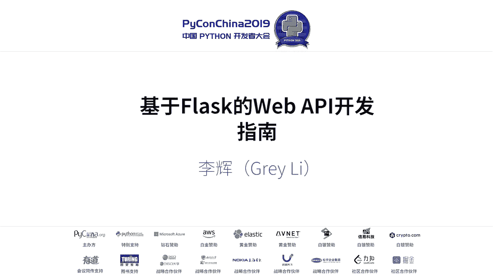
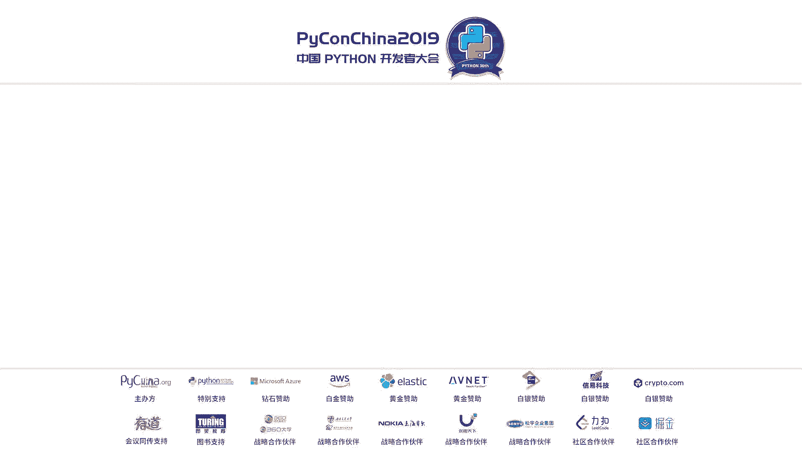
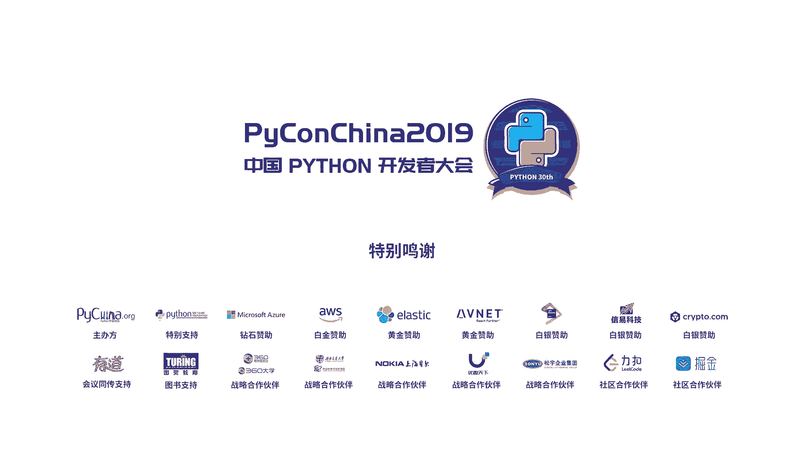

# PyCon China 2019 成都分会场 - P6：6. 基于 Flask 的 REST API 开发指南 - PyConChina - BV1mE411v7t8

的谢谢大家。大家好，啊，我来听个11点演讲，放三一下。这个演讲的主要内容会是介绍使用plus开发外PI的一些实践和思考。这个演讲上个月在他们在上台场讲过一遍。这次带来的是2。0版本，嗯。

一个更严肃的版本，我从来没。虽然花了更多的时间，但是因为经验有限，我还是没法确保所有内容都是把非法正确的。所以这个影响可能是一个指南，也可能是一个指北。如果你发现有什么地方不对劲。

你可以随时举手站起来纠正我。不要考虑我的感受。呃，先自我介绍一下，我叫李辉，我是我我不是一个专业的程序员，目前还没有工作，学面调也主要是当做兴趣。然，目前主要研究的就是怎么把编些概念解释的更通富易懂。

怎么让变程学习更轻松？我是flash的项目的维护者之一，但不是李志说的核心开发者，我是一个。可以帮我处理一些简单的预期的一个这样的一个维度这。我写过一本关于f的书，也写过一些f的扩展。

还有一些其他的什么东西，这些都可以在hellof docom上面找到。如果你想了解关于我的更多信息，你可以把我的个人网站个人点com。因为成都没有分会场。所以在座各位有人对这个主题不感兴趣。

也没有地方可以去。所以我先调查一下。呃，没有用过plus的同学，请举手。没有用过。那么没有写过外来API的同学，请举手。O。呃，那那么很遗憾，对于刚才举手的同学，这个演讲可能只有4分钟是为你准备的。

我们就4分钟来介绍一些通俗的基础概念。第一分钟我们来认识一下f。什么事不拉。这是端的定义。这是查了第。这是没有数据的定义。自己自己看一下就行吗？这是用列表来解释。然后首先是一个微放站。

它的logo里面有一句话很多人经常忽略掉，就是外Y一照看他看。也就是说，你在使用fus开发外程序或者外部II的时候，是一个从小变大的过程。你需要什么功能就引入对应的扩展或者工具。一次一滴按需增加。

而不是一开始你把你的杯子倒满。所以不拉这个非常灵活。很适合用来快速开发一个产品原型，或者是用来写外卖PI。그 하나 너。第二分钟，我们来入门flash开发。首先用这个安装上，就这身认令就可以了。

然后把这段代码打到一个编辑器里面。蒋海航创建了一个程序实力，他表示你的程序。然后名称的一个拍lo函数。给他叔随便打回一行自传，可以加SPML在里面。只要给他添加一个app rule装示器。

就可以让它变成一个请求处理。然我一般会叫他试图函数。传入了跟地址作为参数。那么当用户在浏览器里保问跟地址的时候，plus就会为触发这个函数，把这一段返回的东西返回给用户的浏览器里面显示出来。

把这个程序保存到拍到拍里面，然后进行f run来运行它。现在打开览师你会看到这样的一个画面。好神奇。그。虽然看起来很简陋，但除了页面内容之外，这个程序和你平时。在网站使用的各种网站没有太大区别。

这个程序我们一般可以叫做惯程序。第三分钟我们来学习一下外部II。这是短定义。这是长电影。这是没有处理的电义。就是列用列表来定义。도는。与其用图片来解释外卖PI，我觉得把它放放放在和外盘区进行对比。

这样会让你更容易理解。所以我其实是做了一张图片的，不过在下一页。单从片视据里面的尺寸就可以看出来这两者区别，一个很胖，一个很瘦。在功能上，外b程序直接和用户进行交互，就是这个小男孩。

订单返返回的响应包含一个交互界，也就是一个非常丰富的HTML页面。用户可以通过点击按钮链接填写表单来进行交互。但是外观IR不一样，它是面向机器的，或者说面向其他程序，其他系统的，它只返回传数据。

这些数据被另些程序获取，比如说we前端程序、安卓、IOS或者是windows这些程序，它过去以后会自己用一些数据来加工一个另一个用界面。然后用户会和这些。尝时进行交互。最后一分钟，我们来入门外I开发。

这是一个使用plus被实现的最简单的外fiPR。你会发现他跟前面的外程序很接近，唯一的不同就是。石头还数个返回值。前一个1拉就返回的是1个HTML字符串，但是这这个返回的是一个字典。

我们像前面一样使用flash round来运行他。然后打开一个新的终端货盘进行测试。这里使用了IDD派来发起一个get请求。你会看到。返回响应的cont type时候不算是LV先jael。

就说明这个响应是一个jasonjason响应。下面响应主体也是一个标准的真项数据。好了，这些就是对基础内容的介绍。如果你是一个不熟悉我YPI和flux的thon用户。

那很大概率你感兴趣的部分就到此为止了。い顔。不过你也不是完全没有收获。经过这4分钟的学习，你就可以回去更新你的简历了。边系。如果你还没有解决的话，那现在就有限决了。如果你有有简历。

那么简历现在就增加两行了。好，下面下面我们进入更题。我先来排一下数据的问题。术语有时候是一个非常头疼的东西，尤其是经过英文和中文的转换之后，很多东西会变得非常难理解。要理清楚一个术语的来源。

它在不同语句下的含义以及它和其他相关术语之间的关联和区别，需要投入很多的时间。但我认为这是非常值得去做的事情，要不然你很容易产生理解混乱。试这你能不能理解这段话？有人能理解吗？可去不说。Yeah。好。

就有一个人能理解，然后还加上我两个人。是不是非常混乱？C这个单词。还有很多在不同的旅行下，有很多种意思。它的常规影响就是绘画用户绘画的意思。但是在实现用户认证的时候。

session就会用来表示一种实现方式。但last里面，你会知道它是一个全局变量的名字。这个全局变量在实现用户认证的时候，会把用户规划信息存储到不K。存储的时候使用的键就是session。

当你理清楚session sessionession的这几个不同的含义之后，你才能快速的去理解这段话。这就是术语术语的价值。所以我的建议是当你接触到一个新的编程术语的时候。

你要尝试做下面这件事情来进行数语梳理。先在对这个演讲最关键的一个概念进行一个梳理梳理。使用HTB协议通过网络调用的API到底应该叫什么？当经过前面的介绍，你知道这就是外部API的定义。

但是除了外部IPI还有哪些相关的名字？IPIII接口。右边接口一般会是用来指软件框架和库的接口。比如说一个库包含哪些模块，一模块包含哪些类，哪些方法？方法接受什么样的参数，返馈什么样的数据。

这些我们会会叫做II接II或者II接口。所以除非上交滤境是外API开发相关，要不然使这个词会带来一些混淆和误解。啊，微服务是一种程序开发架构，它把程序分解成更小的完全独立的组件。

这些组件之间也许会是用YYPI进行通信，但它本身并不是YYPI。re APII或者说ris for APII。也就是遵循res架构的API。凭这两词勉强正确。因为目前re这个词已经被被误用的很厉害。

它的外延已经被扩散，就是使用XML或者jason作为数据格式。基于IT传输的API都被都可以叫做re APII。但是如果严格来说的话。大部分外白PI都没有完全实现wes APII的风格约束。

res的架构的作者也写过相关的文章来报名这件事情。所以这个词也是包含争议的。要系外服。外部服务叫外服务问题不大，因为外卖P安就是外部服务的一种。但是外部服务的定义很混乱，云为服务这词太宽泛了。

广义的外部服务就是就是指通过网络传输给机器。使用的数据的这样一些东西。比如说re APII外卖I或者IDX这些都可以叫外服务。但是还有一个狭义的管服务定义，它是指WV3C制定了一个软件架构标准。

是机送通过HTB传输XML的这样一个标准。水以我了避免混淆，也不建议使用它。这合适唯一不包含歧异的。思域就是YYPI。我们应该尽可能使用正确的术语，这样可以降低理减负担，避免定义混乱。不过如果是为了。

沟通效率你也可以使用错误的用法，或者不不是不是那么正确的用法。但是你要知道这些词语有时候都是在指同一件东西。这是第二个需要梳理的术语。资源也就是需要开放的数据，大多数情况下，你可以和资源交替使用。

端点可以替换为UL或者UI。UI是UL和UM的负极。而网址通常就是URL的更通俗的用法。超链接一样是另外一种东西，是是可以在超本里点击访问另一个资源的这样一个东西。这常1个SDTP手部。

通常后面叫做手部或者头部。首部里会包含很多信息，比如说首部字段URL请求的方法。不过有有些人在表达的时候会把首部字段简略成首部。比如我在说acect首部字段的时候，会直接说accept首部。

就是请求我详应处理相关属于。第一个就是序列化和反序列化。举一个简单的例子，假如想通过时空隧道穿越到2045年，你要怎么做呢？把自己先序好。对。因因为时空隧道只允许量子态的物质通过。

所以你必须要在进入施工隧道之前。使用一个转换器，把自己的身体转换成调姿态。当你通过时工时工隧道到达2045年的时候，也要再把靓不在的自己转换成人体。这两个过程就分别被叫做序列化和反序列化。另足接近的。

但是更高一层的术语是封装和反封装。他大多数情况下可以和请求解析相应格式化。저에 통일동 곳이이란 이제。换一个更宽泛的术语，就是请求处理和详应处理。这两个过这两个术语包含很多过程。这是担保的过程。

比如说会做一些数据的验证，然后生成字典或者是转换回son。因为数据员很头疼，我者理解可能也会有偏差。所以欢迎大家补充和纠正。有人要补充和纠正吗？Okay。不。继续。好，既然没有，那就继续。好。

那既然前面提到并不是所有的外II都可以叫做rice APII那么什么样的II才能算是rice APII呢？没错，只有做到了这些复杂的东西，才能算是res一样。瑞的架构是HTTP协议1。01。

1的主要作者若恩托马斯威ing在他的博士能力提出来的。其中在第五章有30页描述了这些东西。很复杂，我也没有看过，所以我也不打算介绍他们，我只让大家感受一下他们到底有多复杂。

而且现实情况是很少有完全符合瑞斯架构的API。根据leson提出的re成数的模型，大多数II其实就是第二个登级的II。当你写外卖片的时候，总会有人来告诉你，这样做不对。这 on b re。

不符合win斯的架构。的确，rest的风格包含很多优秀的设计，但是因为res并不是一个标准，只是一个架构风格。包含一些约束和建议。所以我们可以尽可能的参考这些规范。但是我们不一定要完全遵守。这是个例子。

根据rest风格的要求，每一个端点代表一个资源，而资源呢应该使用名词来进行描述。动作应该使用不同的HTTP方法来表示。大部分情况下使用名词来形容资源很合理，我们也应该尽量遵守这个约定。

但是也有一些特殊情况。比如按照res要求实现身份认证，你会创建一个token端点，或者说C端点。对这个端点这个pos的方法来获取，用来认证身份的acces talkingken。

这用deele的方法来删除淘们来销补套汰。但是也有人会用login和loging up。来实现登录和登出。分别调用Po来表示登和内侧的操作。

虽然是一种方式使用了log and log down这样的动词，但是如果你觉得这样更容易理解，那也没有什么。张东性。不过面试的时候就不要这样做了。虽然我从来没有面试过。说这样的话可能不够资格。

但是我我能够猜得到，当你用了后一种方法的时候，HR肯定会说这个人缺乏对瑞API架构设计的深入理解。另外还有个搜索。search这个词也是动词，但是对于实现搜索锻炼来说，这个词很容易理解。

所以大部分流行的IDI都会使用搜搜索，多使用search。再看下电影片版本。按照ra的架构要求，也就是对于超媒体的要求，版本的变化实际上是同一个资源，它的不能表现形式。所以对于同一个资源。

URL应该是保持不变。所以要使用acet和con types字段来处理版本问题。今他就是这样做的。如果你不担心建容问题，你也可以添加一个自定义收复字段的描述版本。

另一种定义版本的方式是直接把版本号嵌入到URL里。比如放到路径或者是自有部分。这两种方式都会有优缺点，但是使用URL版本会更加直观，这也是更简单也更流行的版本定义方式。但是无论如何都不要这样做。

不要第一个版本使用API，第二个版本使用newAPI第三个版本是latet APII这到第四个版本的时候，你就没有这个单词可以用了。你肯定不能用re latest idea。结合结合这些例子。

我的想法是。不管你的IPI是60%recycl还是80%re都是可以的。如果你要我选择是更符合标准还是更符合需求，第一是现的理解。那我一定会选择后者。我们应该从编写的API的自身特点来进行设计。

而不是照发某些风格约束和标准。那在实践换II的时候，有哪些f扩展可以使用呢？有这些扩展。这些是目前流行的一个一些flatask wordII扩展。可以看到情况非常惨。有的是核心部分不推荐使用了。

有的是作者离开了，有的是被抛弃了。所以所以所以我的结论是这些扩展都不推荐。唯一比较看好的是最后这个漂流次球的这个。他他集成了三三个非常优秀的工具，而且都是同一个开发团队开发出来的。

也就是marshmallow web X和I spec。但是目前这个扩这这个扩展还是处于备增的状态。虽然都贴。让我们回到最开始最开始的选择。当你选择了fask，而不是jagle的时候。

其实已经你已经选择了一种开发程序的方式，或者说偏好。你选择了放弃方便，换来了更高的灵活度和更大的可控制权。所以当你面对PB这样的选项的时候，你也许更喜欢自己去搭配一套工具来使用。

那么在使用plus开发或II的时候，我们可以有同样的选择。既然没有一个像jugo rest framework，能要大而全，而且维护稳定的东西。但我们到时候去去选择一组优秀的外部II工具。

每一个工具专注于独立的小功能，就是吸引度很小的一个功能。还可于资源端点错误处理这些基础功能，我们可以尝试直接使用原生plus来实现。只有少量不太方便手动实现的工作，在尝试使用某些扩展。

所以下面我会简单介绍一下，我在使用fask原生实现YPI的一些实践。但其实代码代码介绍都是比较无聊的，我就简单的过一下。这里我们要开放的是一个关于说各种你好的IPI使用这个单价字典来模拟要开放的数据。

招分方案这个函数可以把传入的字典转换成jason格式，然后正确设置content time首付字段。而从fus1。1版本开始，你可以直接返回一次频。它的效果和调研决测方案查入字典的效果相同。

在实现资源端点的时候，你可以使用普通的视图函数。也就是平时我们。说普通话排序的时候他使用的。你可以使用类似图。类似核的好处是可以python类为单位来设计资源。类方发生ge post。

delete patch这些来命名fllash可以自动匹配对应的HTP方法到这些方法上。그거두도 여기도가 막야 돼。对于管理来加版本，你可以使用蓝本。把蓝本注册到实据实力上的时候。

你可以使用DLpreface这个参数来定义IPR版本。也可以使三高满三数来是个词语。在处理错误处理的时候，创建了1个II报。函数。plus有一个bo，这个这里的IPR报效果差不多。

只不过会返回宣传模式的项内。聊控处的消息如果没有指定的话，会从Z里面去获取他定义的所有的ICDB。异常类的描述，也就是错误响应的原音短语。这些是IDR报函数的使用使用事例。

你你可以直接把它用在错误处理还处理。在定义数据模式的时候，因为你不会把一个表表里面所有的字段都返回给客户端，所以你不能去直接生成一个字典。你可以写一个函数来定义输出的输出哪些数据。

除了一些内部的一些数据，你还可以定一些描述性的字段。比如说self。它会生成一个代表自身的1个URL。然后kind呢会表示类。这是调用这个模式函数的示例。这是返回多个笔记的4干8函数。

其中的几个关键链接会接受参数传入。唯一在函数内生成的就是上页下页，还有总技数。这里仅用了last cyclearch提供的分页对象。这是调用多个字典和scama的实例。对于请求解析款手动处理比较麻烦。

当然一般不会用FLA这些来验证数据，这里就是都是事例。在处理异常的时候，当你验证出错的时候，因为这个验证函数不是那需要在视图函数里调用，但是你又没法直接使用IR报来生成作响应。

所以会另外写一个reation error异常类。然后写一个错误处理函数来捕捉这个vientvalation error异常。然后使用IRbo去返回一个错误项目。这里是调正的验证还是实例。

最后来看一下身份认证。是比较常用的认证标准。在选择al认证模式的时候，你要考虑到内向的用户群。如果你你II只是面向公司内部人员开发的API那在实现all的时候，那个密码的是就足够。一个密码模式。用户。

直接在客户端输入密码，密码，这种敏感的数据不应不应该让非官方客户端去拿到。但是如果你要开发的IR是面向第三方大规模公开的IR，你就要考虑使用授权码模式，类似gitub或者QQ使用的这种模式。

下面是一个使用原生plus实现的bos密码认证的一个实现。这个token端点它会返回I says token。然后接受接受一个pos请求。这些都是根据OS标准在处理数据就不我展开介绍了。

这是生成和验证token的两个函数。这个装饰器基本上就是fask login提供的login required函数的翻版，用来验证请求是否来自认证的客户端。

在不同外程序里会从book里面获取用户用户认证信息。但在怪MI里一般会通过asauization字段来附加认证请求。

所以这里的get talking函数会从这个时候来获取talking的类型和topking的值。最后是两个在适度函数里直接调用的错误函数，分别对应逃ken无效和丢失的情况。好，代码部分重一讲啊。

其实代码部分并不重要，你可以你可以全都忘掉，但你可以记住是一个学习路径。你首先要了解怪VPI有哪些设计原则，不一定非要去了解re的架构，而是一个普通的怪PI应该怎么设计。然后尝试用fask去延声实现它。

当你遇到了有一些不好处理的事情的时候，再去尝试其他一些优秀的工具。除了使用fask编写外YPI还有很多选择，这个列表可以列的很长。那我为什么没有像我在演讲简介里说的那样去介绍这些东西呢？

当然不是害怕你发现这些东西非常好用，然后就放弃了fask克。只是因为我暂时没有时间来第一研究和对比这些方架。如果你需要更好的性能或者是更方便的功能，可以去尝试一下这些框架。

如果你对不同的II框架或者II扩展实现的YYPR感兴趣，可以关注这个nAPI项目。虽然没能在这个演讲里介绍所有的框架和扩展实现，但是我会在这里用这些框架和扩展来写同1个IPR项目。

所以的前面的示计程序也会放到这里面。不过需要注意的是啊，它不是一个为什么项目，它是一个还不存在的项目，因为我还没有来得及创建。Yeah。我会把我会在最近几天把前面的事计程序放上去。

然后在下半年哈已经快门了。下面两个月以及明年上半年去完成这些所有的扩展，去实现同1个IPR。好了，这就是全部内容了。我一般是不加这样的QI环节的。因为因为按照以前的演讲经验。

大部分人的提问我都是回答不上来的。但是老是躲着也没有用啊。所以想我就问吧，除了除了提问，你也可以补充或者纠正我之前评家里描述的内容。呃，我们看一下分布啊啊，这个哥们呢。你的时嗯，就李薇你好，呃。

我就一个问题，你肯定会更的。就是我关注你的就是博客嘛，然后你说你要写一份新书什么时候能够出来？你好，确实很关注，很期待啊，我的计划是明年的4月1号会出来。2月3。因为pl是在是一个愚人节诞生的那个项目。

所以明年是他的十周年，我会我会尽量把那个事情写出来。아 잘 막 몸后面同 찍。你们前面的太积极了，给后面那个机会吧。哎，你好，就是我想问一下，就说因为你啊前面说的就是不是转个转业的程序员嘛，或者还不是。

那我想问的是你那么成为这个flus的就是。maintainer的一个识过程。我觉得这就是开源的魅力所在。他他不在乎你是什么学历，你是住在城市里还是住在一个山村里？只要你有电脑有线网。

你就可以参与到这些这些开源项目去建设里面。所以我之所以成为一个plus的买天呢，也就是做了一些很多plask相关贡献。包括在stargo上回答问题，包括去体很多的PR和，包括去维护其他相关的一些扩展。

这就是我进入plus开发团队的一个原因吧。哦。Yeah。I last question。呃，这个你还挑一个吧，我我选择看看证，你挑一个吧，这三333个他。哎嗨呃李辉你好。

那个其实我们之前在群里面有一些简短的交流，然后我也买了你的书，然后我也是看了你的书，然后自学的那个pl。因为我自己本身是完全是一个文科生嘛，然后就是一年半之前才给慢慢自学的。然后刚才听你演讲的时候。

提到你好像也是自学的编程啊。呃我不要理解，对不对？就是可能你也不是就读，比如说计算机或编程相关专业的，能不能更具体的分享一些自学编程的一些经验嘛。呃啊，你好，我我不能说太多。

因为因为这些内容我的确是想介绍的，但是我安排在了11月2号在中国KV年会上的一个演讲，演讲标题是一个野生程序员的开学故事。啊就是介绍我怎么从一个野生程序员成为一个K源贡献者，包括这中间发生一些故事。

所以等一种吧。那那我们等声也谢回答先。好，谢谢大家。啊，这些是我的联系方式和相关链接，还有话通面和视力程序，我会在这几天放到ge他上。如果你有什么其他问题可以。和我及续交流，谢谢大家。

