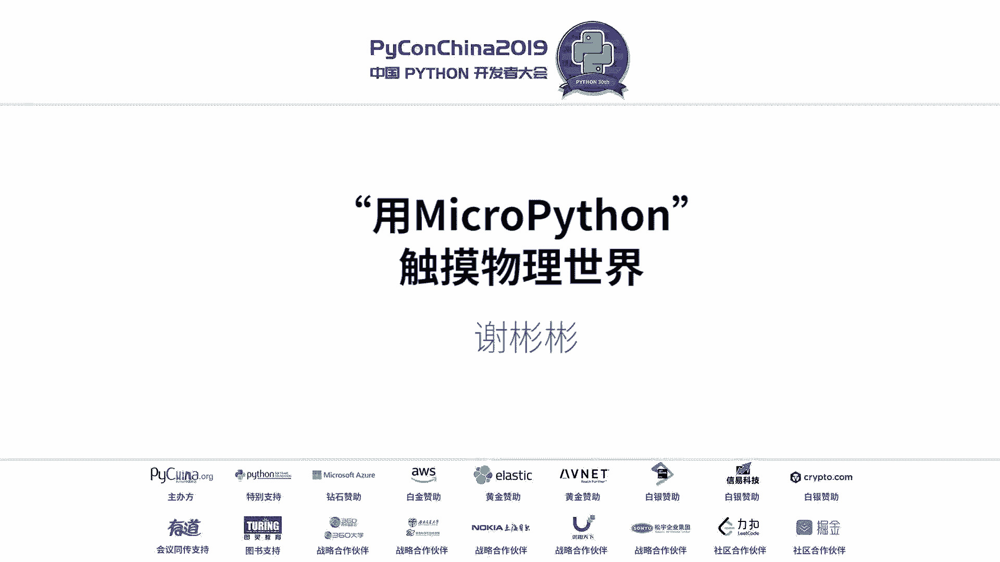
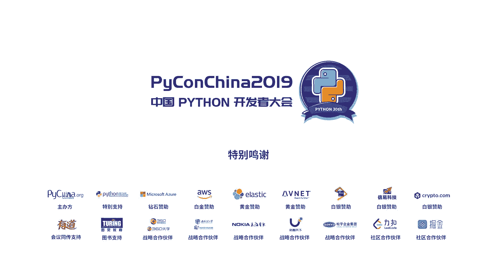

# PyCon China 2019 成都分会场 - P7：7. 用 MicroPython 触摸物理世界 - PyConChina - BV1mE411v7t8

嗯，好，谢谢。然后谢谢大家，然后谢谢那个就是社区能给到这一次机会参加这次分享。哦啦。嗯，可能还是有点紧张，大概。会。有一点稍微有一点有一点紧张。然后我还想的是，就是我为什么会用这个东西啊？

就是不是因为工作，可是因为平常因为我的娱乐项目特别少，我一般放假的话，在家可能就不会去玩游戏，或者是做种东西，然们就看看一下文档啊或者其他技术类的。嗯，动手能力我小的时候动手能力也是相当强的。

可能就会开家里的东西。然后也是由于这个关系吧，可能对硬件的就情有独钟。然后果互联网的话，就是我觉得就是特别奇，就是以前没有没有接触过硬件。然后不知道的是可编成的。

然后后面接触的时候发现居然可以去控制他还是很很那我就开始我的演讲了。可能。不太好，但是也请理解一下。我先讲了，然后我要讲的就是大概内容呢就是包括我怎么样去认识，然后怎么样去用，然后怎能去理解他。

然后包括这些也重要的一些东西出来，可能很简单，但是都希望能把我的快乐分享给你们，也希望你们在目聊的时候也能够去搞，可以玩一点东西。然后要讲的话，主要就是给大家介绍一下一些可编程的硬件。

就是我们一般常用的家电里面啊，包括一些就是换灯喷机啊，或者是灯里面或者是一些空调。嗯，洗衣机里面都是可能就会有一些就是像8051这样的单控机在里面。但是它相对于呃它很便宜。但是相对于开放来说的话。

就是你想要去入门的话，它可能门槛很高。就是它调试手段和它的一些库的支持，就是可能对你来说的话，可能会更高一点。然后还有一个就是嗯就是STM32的一一些系列的芯片的一些开发版。它虽然性能很强劲。

也可能有一些支持。但是我对我来说的话，还是调试还是如果你去当一个玩具来说的话，他可能会更难一点。就是放弃了。然后后面的话也接触到了，在开源一营也是有开源营地的。像阿杜龙和苏联泰。

他们的话其实对于一些新手来说非常的友好，就是你要很快的去把硬见平台整个搭建起来。并且你可以让你的嗯去控制你周围的一切，包括你家里面的开关电灯，还有你的洗衣机，所有的一切，你都可以去控制它的。

然后这个我没有选择这个原因，就是因为它的其实阿的话，相对于开发版还是很贵的。然后数北他更不用说了。他现在我我我预估的话，我都看了，就数泰4B的话，它现在是大概是在呃4GB版本的话。

包括全套的应该在500多块钱。所以对于呃一个自由职业的来说的话，这个东西确实有点昂贵。所以呢。我还是发烧。对，然后我的选择是这款的，他是嗯。6新出的一个模组。

然后国内有人把它做成到SCU他最开始的话有有他最开始的芯片是EP866单核的。他处理能力不是很好，就是但是也很便宜，可能不到10块钱就能买一个开发版，他也能跑买thon，但是性能可能就不如他了。

就不如ES32。我现在我的选择，他是原生就是ESP8266和ESP32，它是原声支持蓝牙和wifi就是你在做硬件的时候，你就可以直接通过HT就像李辉老师刚刚讲的一样。

你可以用V APII跟你能件进行交互。就直接可以进行交互。然后他蓝牙的话也可以根你手机在不没有in特网的时候，也可以用蓝牙去跟他进行交互一些东西。也就是说我上面也写了不到10杯奶茶的钱。

你就可以拥有一个自己的电子玩具。然后他重点是他支持很多生态，重点是今天讲的主语ython，它是支持固件的，就是这个板子很便宜，并且支持python。然后我选择on也是因为呃想要统一自己。

因为我是做独立开发的嘛，可能会涉及到很多端，我想统一自己开发的语言方便熟悉，所以选择pyon去做，也很感谢就今天的一些其他同同学就是他们做你的开发的其实很很不错的，就是因为有他的支持。

我们才能去做一些应用。然后今天的主角他的logo是这样子的，可能pyython的它很小嘛，所以他几个小时了可能有点不一样。我简单的讲一下mypyython是什么东西啊。

它是基于嗯python经济优化的一个子集。他的运行在32位的微处理器上面。能够运行一些简单的，比如说像一些嵌字式的操作系统。所以说也是基于他来做的。然后我想问一下，现场有谁接触过软件开发？哦，还是很多。

那边呢那边人少人做的比较少。然后有没有就是从小或者是现在对硬件特别感兴趣呢？有喜欢。对硬件感兴趣的，这次你要控制么？对，商品。对，超值什么超频超频哦，也算好也算害好，你可以超超评也可以。

说明就是我现在来简单介绍一下整个就是怎么样去。把你的代码能跑到哪些东西上面，就简单的介绍一下。就是支持的一些开发版，它主要有1个PY word，还有一个VPI。然后老CU就是我之前讲的过的。

还有个EP32。然后会在后面的一一对这些开发版做一些简单的介绍。然后PIbo的话，它是基于那个ST32MM4的芯片模组做的一个，它很简单，就是起动很简单。它是因为是社区支持嘛。

就thon社区好像是支持的，所以你可以把你代码写到SD卡上面，你只需要按他规定去写，放进去，你写完之后传到你的SD卡登mod录下面，它就是放进去开机它就会执行你的python脚本。然后VPY的话。

他也是使用的乐心的ESP32的芯片组去做的，同样跟ESP32具备了同样的能力。但是他有人会。嗯14826的话其实也可以。如果你只是做简单的话，其实可以选择这这个牌发来拿。这种开发板其实相对来讲。

它支持接口都有响斜在上面，就是进行硬件交互的一些东西。但是它主要麻烦的一点，就是你可能它的一些开发工具可能对呃初学者可能不太友好，就是可能稍写部件的时候可能会有些麻烦。

因为我自己在呃做的过程当中碰到过这些问题。如如果有如果你有感兴趣的话，思想可以过来问我。然后ET32的话，其实跟那个VPY的模组使用是一样的。他们都支持的相对开发表支持HC总线和和一些串口。

还有GPL口的一些标准的一些接口。然后同样也是之前强调过的，它支持wifi和蓝牙，这样是一个很棒的一个特点，就是你可以。不像以前都是像一听32一样，你没法去你写了之后没法跟外界交互的。

然后我还专门去分析了一下整个就是他的一个就是。如果想要一起玩的同学啊，我分析有有一份采购谈就是价格的分析。因为对于一个呃我还是存调讲独立开发来说话，呃，性价比是很重要的一个问题。然后这个可以看一下。

我我如果感兴趣话，我会把PP也分享给你们。就是那些他这只是主要开发版。然后他可以做什么呢？就是有的这些开发呗，但是你还是没法去跟物理直接交互，对吧？就你怎么样去知大温度，怎么样去读取。呃，就是你的一些。

比如说他可以做气体传感，啊，还有去做灯光的检测，这些是没法的那怎么办呢？肯定还是得需要一些外围硬件的支持。我简单的列了一些常用的比较，就是我在呃开发的过程当中用到的一些东西。

它常见的可能就是一些温度传感器的主DHT的，它支持一些高冷的HC的接口，然后还有陀螺仪之类的。然后然后传感器之类的，就是OLED。比如说你要把你的数据显示出来。

它是它其实这个这些板子是一个单独的一个微处理器，微型计算器的。包括一些就是我今天我这几天在做的一个东西啊，就是一个心率传感器。就是我之前买了。然后OAAPP的话，因为昨天很不幸，它烧坏了。对。

然后还有这件事这件事的话，它的功能都很大的，就是几乎你家里面只要是跟开关相关的东西啊，都可以用它来控制。都是可以用它来控制的。嗯，他大概可以。

之前这块开发版就可以利用白phonepython去控制这些硬件。就是我的主题，就是相当于与micro用物理与物理事接触摸。然后后面的话就是。我自己在做的一些东西，就是知道了什么东西呢。但是呢。

其实也是一个很取得的过程，就是不可能一下子我就知道买出pyon。其实我自己买买了很多开发来的，就是买了很多东西在家里面，但是很多东西都没有用上。你看到一只猫对了，这是亲几年收养。是不자。啊，就是。

在呃左这边这张图，他这天这是我今天早上拍的，他早上过来找我。等一下我就给他拍了。很调皮的一个吗可以讲一下他就前几天他在我牛道里面。他过来之后呢，就拿他这样了，很乖的个吗，很粘人，所以他就个进入镜的。

不是故意的啊，是我真的在拍的时候，他过来很粘人，照进去了。然后就阶段性的调整，就是就之前的事情呢，就是你尝试去把固件刷写进去，然后去跟。你所购买的或者是外围设备去打通。

就是可以去用它的GPIO口跟继电器交互去控制开关。然后呢，就是后面的东西就是主要是实践的，就是拿这个东西能做什么东西出来，就是需要的东西。其就是读取清率的一个实践。

就是我之前在嗯报我们这个mpart的时候。我写进去的，其实我之前没有做过，也是自己为了演讲有题材，然后去买了这个这个传感器，我来做了一下。然后还是很有很多插水的时候我讲一讲。之前我报名的时候呢。

可能那个水哥说的是因为商标的原因，可能这个题材不会入去，我就没有抱太大希望。那后面的话隔了一段时间，他说可以，我就抽匆了忙就开始准备。然后读呃如果读去新率的话，它是需要这些设备，一个是OLED。

一个是心率传感器max30102，还有E32，我的选择。欧阳ED的作用呢是把心率测试的心率实时的显示进来。然后麦ax300102这个芯片的这个模块呢。

它是通过光电传感器去读取你的血血液的血血氧浓度和你的心率。来他们之间是通过ITC总线去通信的。整个这两个模块都是通过ITC总线去跟它通信的。感兴趣的同学可去收下总线，其实它接容很多硬件。

就是只要支持这个协议的ESP3都可以与它进行交互。然后就是成品，成品呢就是昨天晚上他还在搞，然后因为他不幸的这个欧阳已D不幸的遇难了，就是因为我。电烙铁没烧好，就是反复的去为了想把它烧好看一点。

就是烧反了，结果拆掉来之后，它不亮了。然后所以说他现在只能通过一个就串口输道的第二方学啊测出来的。然后其实这个的话，我还跟我之前的有个上海的同事。他呢就是我之前有一个工作嘛，也是有前段时间也给他工作。

然后他们他们家里面有一个，问他买的是以前的老小区，所以他有个问题什么？就是他的楼下。门禁很难的。就是他希望做一个可以联网的东西，就是互联网的东西，就是可去控制他们家的楼下的老师老小区的门禁。

这是他的其他的图片我没就找不到，因为已经过期了，所以只放了一个他们家的这个门禁的触摸的一个电话的一个图片。然需要的东西很简单的，它其实就需要接电器和1个E320卡拉0。然后不主专业很简单，这只是原型。

它成品我没看到，因为他没有拍给我，所以我只能去因为我也有个几企业，所以我模拟了一下，别人发个东西嘛，对不对？然后呢，这个就是。基本上讲完了。其实我东西很很少，我不太涉及平层。因为我主要是做应用。

然后昨天的话就是没有做过的东西嘛，我突然也想到，就这个东西可以干很多地方去用，包括在小孩子的一些教育方面去用这东西。为么成本很低，可以让很多小朋友可以拥有一些可以。电子玩具可以让他很。

接触这些东西可的也很厉，很方便能在。让他现在是去推开。我做这个语音最开始不是也可能是为了玩，后面发现他不可以做这个的，所以说还是很不错的，还是很感谢。呃，社区能给到我这个灵感，能够去做这样的一事情。

如果没有的话，可能也会想到他能够去做教育方面的东西。然后还是很感谢大家能够。听我的。嗯。第一次的分享。谢谢。😊，然后后面的一些资料的话，就是需要资料的话，可以我资料没有整理。但是他都是官方文档支持的过。

如果有遇到什么问题，可以来问我。因为我在这方面这期间还是碰到过很多问题的。就开发做这个开发的时候，纯粹的就是瞎搞这些。很感兴趣的话可以加我。其实我在就是写这个PPT的时候啊。

我就发现其实你你遇见一个东西跟弹力行量是一样的。对吧。你要看你们就对了。谢谢大家，我的分享完毕，希望能给你们带来一点开心。好，好则 a time，然后大家有问题的举手。哎。

我们记得你们不要我们这边好不容易有个同学。对吧裤子技术上的问题可以问我。不要是那个男生吗啊。你想做做什么？不是男生。问一下你讲这个系统版，它是基于开定的是吗？他是支持拍y的固件。

因为我是为了方便统一开发嘛，他其实用和么固件都是一样的接口，那就为了方便统一。之前这次也是从51开始出出门的，也接触了，到后面接过了父母债，但是感觉用开给。要用1面的话写服务拍用数务态调用引脚。

总是感觉没有用C写那么方便。嗯没有发现感觉不是很熟悉。嗯不是很给力是什么原因？就是嗯你们是工作的哇。还是，因为我我现在也是上门，上门是做那个配合性嘛。因出些。嗯，是呃是用是是因为性能的问题还是么问题？

记了，因为我用那个因为当时记录的K60也是和他一次还在那个是这，因为。过。人脸识别的那。然后老同学这样。嗯，嗯，你确实这个必须得用手面看，因为你要在本地计算嘛。但是你用ESC3的话。

它是支持那个摄像头模组的。你可以把图片还为云端做处理。就是如果你因为你把你你终端的一些电源计算，你性能不需要多想的，你全部传过云端去处理的可，只要他能获取到数据。好的然好。我们考虑下部能同。

你前面的相对。那你看我们今天的提问机会，我们说机划就是前面同学老板了啊。Yeah。呃，你好呃，你好，我也是那个。呃，接是micro max有一段时间，然后我用的也是DS3。呃。

那么我用ES翻法的时候存在一个问题，就是说因为那个RTC时时钟的时钟的原因，就是说它这个震荡就是在一定的时间内。

就比如说我们就比如说我们从早上开始开始用时钟去计算一个东西就比如说我们在就是的话时候他可能会牵扯到一些时间的问题。因用RTC的话，就是说他跑到一定的时间以后，这个时钟。因为精正或之类的原因，它会变慢。

就是说时间可能会不同步，就想请教请教下因这个关于时间准确性的这块问题，你是怎么解决的。我目前没有涉及到关于时践的开发，但是我们是下一个教育。好的，谢谢，我们私下可以去交流一下。那你其实可以这样。

就是你是你看一下他店面原因，或者是你定时去跟那个呃时间图务去同步一下，做一下定时。因为他本来把这的性能在那也没法避免的。哦，对，因为他那个就属于精正的一些原因，从物理方面我们没有办法去解决它。

呃目前目前我的解决方法，我的解决方案只能说就是说隔一段时间我们跟他去跟比如说跟执行就是看re一下。然后我们再用 time再去把时间去同知一下，只能说这样，就是说有没有其他的办法。

等你你们是用这个这种什东，就为什么把时间放到你的这个今天可要做。呃。也是自由啊也是自由啊，自由自己玩。行，那下来交流，谢谢。好。哦好，最后啊就是三个人，那希要只选一个，最后拉块选选一个这个啊。请那个。

前面的啊写好，再见。Okay。嗯，老师你好，其实我对开其实不太了解出来了我才看到。但是其实我一直对于物联网，就比如做物联网嘛，就对家里面其实我想控制一下我家里面一些呃一些东西。

其实跟这个我觉得应该有很大的就是联系。所以我就想的话，老师就是能不能有一些呃背过一样的东西，我们怎么像。比如说你刚刚说搜不件，或者说你在里面怎么样去执行一些代码。然后有没有这样的一些方式。

或者说我通过什么样的途径来了解这个东西来去做，我想做。嗯，这个是带了的，但是这边不好掩示。因为我的开发文序是戴了帽子上面的。但是我可以呃，就是我的打算我那会也想的是就是可以抽一个人啊，把这个硬件送出去。

对这个送出去的，你要添彩头吗？啊，可以可以，因为我讲第一次讲的太好，所以送点东西嘛。啊，行吧，可看吧，我们结束之后，我们来个微信抽奖怎么啊啊，可以可以对我们去抽席于明星观众好，可以。

但是他个板子的线发的不是太好啊。嗯这个问题就是我们呃可以通过什么途径来学习这方面的知识来呃是你自己的一个兴趣。完成进去的话，其实我也是看他官方文档，mic是有官方文档的。如果你嗯你可以加我微信也可以。

其中我有很多东西可以聊的。因为我不只是做技术。对，可以加我微信也可以。嗯，好。好，O好，让我们掌声感谢谢老师的谢。

