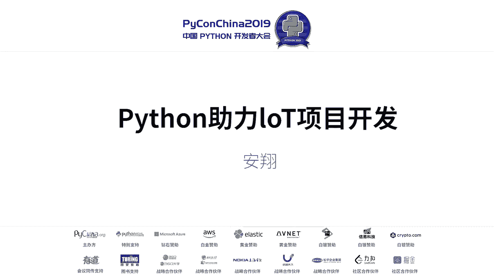
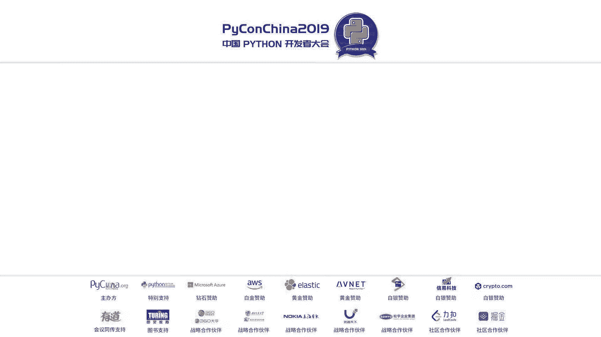
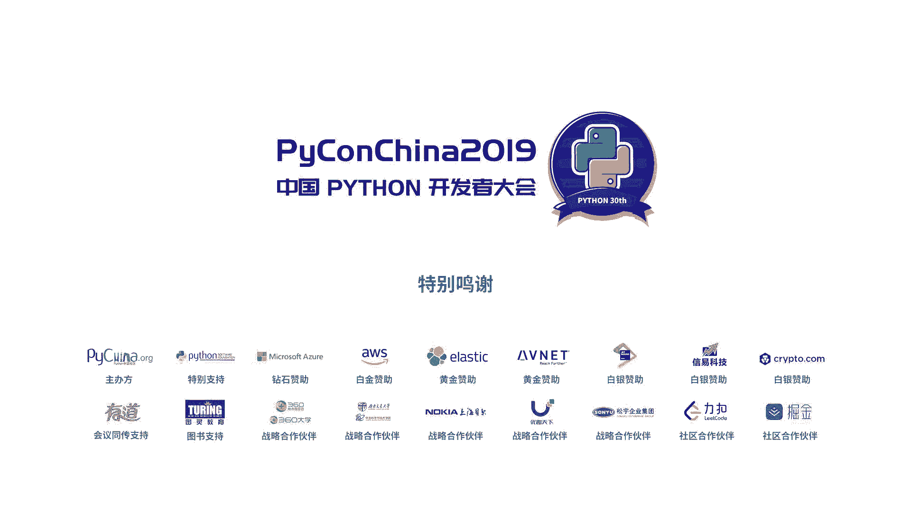

# PyCon China 2019 成都分会场 - P8：8. Python 助力 IoT 项目开发 - PyConChina - BV1mE411v7t8

大家下午好。呃，我目前是在带EMC做存储软件相关的研发工作。呃，但是在过去几年里面，我主要的工作经历都是从物联网呃以及智能家居系统，就是整个大的物联网呃研发相关的。

诶。我自己也是从单片机啊，然后呃ar比较强一点的，就性能比较强的arM这种系统呃，以直到现在。完全是叉86的平台。呃，完全ser级别的硬件。所以说我的整个工作经历，他是从初级的硬件再到中级。

然后再到高级都是有经历的。呃，然后在过去几年中。我作为一个传统的。物联网开发的受害者。然后探索出了一个呃。让我们生活过得更美好的一个开发的模式，就是把python和物联网的开发相结合。啊，然后在过去的。

呃，就是这个总结的过程中，我也把它呃整理成了一本书，也出版了。呃，出版一年多，然后卖的挺好的，现在已经是第七次印刷了。呃，然后我今天分享的主题就是python助力物联网项目的开发。

就是用python来帮助我们物联网的项目。开发的更快，效率更高。我分享内容主要是四个模块。首先我要简单的讲一下这个物联网的一个一个完整的物联网项目。他是有哪些模块？

组成的以及他这个模块里面一些软件层面的架构。呃，是怎样的一个细节？因为在座的可能对python语言已经比较熟悉了，但是可能对物联网的这个背景可能就欠缺一点。所以我第一点是要把物联网先简单的讲一下。

然后接下来我会分析一些市面上就是比较典型的物联网的项目。这里我有个问题，就是大家。接触到的认为是物联网项目的有哪些？可以简单的分享一下吗？小爱小爱音箱。那个自的一些小，还有就是长期性对全对全对。还厉呢。

是个什么东西？华为也是在搞物联网的一个一个平台要开哦，它是一个平云平台级别，对吧？哦，它也属于这种物联网的范畴。呃，还有我们比较常见的智能单车。哦，共享单车。Yeah。共享单车。然后接下来我会剖析一下。

就是呃物联网这种项目里面的技术站，就是从开发的层面，它涉及到呃怎样的一些技术。最后我会分享一个。呃，实实在在的物联网和pyython进行结合的一个。呃开发的一个项目。大家可看一下右右侧这个图啊。

就是一个完整的物联网项目的一个结构。总体来讲就是一个完整的互联网项目，它主要分为三个层面，云端、管道。以及终端设备。我们从从下往上看。首先是他的终端设备。比如我们的共享单车，它终端设备是什么？就是单车。

然后在共享单车的这个。系统里面。呃，它的管道就是他通信的网络，比如他用到的2G网络或者是NBLT这种呃低功耗广域网。云端就是他的服务端程序。终端的话它包包含各种各样的硬件以及机械设备。因为终端设备它是。

嗯。我们整个的软件层面和现实世界进行交互的一个接口。比方说互联网。他终端是人对吧？就是人和人的交互。比如我呃微信聊天，我是一个人和一个人进行聊天。而物联网它更多的是人和物的交互。

比如共享单车就是人掏出手机。扫码。把车骑起来，就是人和单车的一个交付。人和物的交付。然后物联网除了人与物的交互以外，他还有一个应用场品是物与物的交互。他有时候是不需要人介入的。

他自动的把环境的数据读上来。然后我们的这个。智能的一个系统，他就把一些指令下发下去。然后他就自动的执行一些东西，所以就是物与物的交互。所以我们物联网的终端是非常依赖各种硬件的。

它包含一些物联网所特有的处理器存储呃，用来通信的芯片以及物联网的操作系统。啊，还有各种各样的传感器。啊，这个的执行细指的就是。就是我们软件层面和硬和真实世界进行结合的一个一个接口。

比如我们共享单车上面的锁。智能厕锁。他就是我们通过我们手机点开锁。然后锁就打开了，它是一个电子与机械的结合。就是这个层面的执行性。但是物联网它某些呃产品里面，它是有什么屏幕啊之类的。

所以他就是还是有一些人机交互的接口，比如像屏幕。然后在终端以上就是物联网。也就是物联网的网吧，管道也就是网。在广管道层面，它可以分为两个层面。首先初级的是呃整个物联网的基本的通信的。

方案就实实实实在在的他来构建这个硬件环境的方案。比如我们在互联网时代，我们手机通信是需要基站的。是需要运营商来铺设这个基站的。那么在互联网领域，类似于基站，类似于通讯芯片这种东西，就是它的。呃。

硬件层面的就是看得见看得见摸得着的。物联网的通新方案有很多种类，比如我们传统的有线网络。比方说我们拿一个开发板直接接上网口，插入网线，通过有线网络也是可以接入呃整个的云端的。其次，我们传统的移动网络。

比如2G4G。也是可以为物联网所用的。他直接在他的应物联网终端上面搭载一个类似于手机的。鸡蛋模块吧，算是。然后插入一个信用卡。同样的可以用传统的互联网的接入方式来接入。物联网自己的云端。

其次它还有物联网所特有的一些通信协议，比如lora。NBLG这种低功耗广域网，就是它对终端功耗的要求很低，低功耗。然后它的通讯范围比传统的2G4G要。长度它的范围要高很多。

然后另因为物联网的应用场景是比较复杂的。有些时候可能是在很偏远的地方，他是没有。就是没有那种网络可以直接接入云端的。比如我们手机是没有信号的，我们是没有网线提供的。那么它可能需要一些局域网的东西。

先组建一个局域网，比如我们的G个B呃BRE这种东西组建一个局域网，然后我们把只需要把它的网关放在一个。更远的地方，这个地方可以接入有线网络或者是移动网络就可以了。所以互联网的网络主要分为呃。

这个B这类的局域网以及传统的有线网络、移动网络以及物联网所特有的低功耗网域网，也就是NBLT。然后在物联网的硬件。网络之上，因为我们编写软件的时是需要一些协议的支撑的。呃。

像传统的HTP的这种互联网协议一样可以为物联网所用。但是因为物联网它对流量的要求很敏感，它很多时候是走移动运营商的网络，而一移动运营商是通过流量收费的。那么我们需要一些带宽更低，呃。

消息的质量更高的一些协议。比如MQTTCOAP。在物联网的管道之上，就是它最终的一个核心的，就是它的云端。云端也可以分为两个层面，一个是基础基础层面。比如我们用来接入设备的接入云呃。

管理数据的数据云运算云，以及保保障整个系统的安全云。在基础的云云服务之上。就是我们呃。各种各样的实实在在的应用程序，比如共享单车、智能家具系统以及智慧农业系统各种各样的。大家针对这个图有疑问吗？没有。

然后我们接下来看一下一些典型的物联网的项目。我这个地方介绍两个，一个是共享单车的系统，另外一个是智能家具的系统。大家需要注意的是，我这个地方说所说的智能家居系统，它是一个系统，而不是一个单品。

比如像我们的小A音箱，它就是一个单品，对吧？就一个。我这个地方指的是系统。啊，我们剖析这个物联网的项目，我们先从网络的透步来看。左侧这一个大家可以看到它整个的网络就只有一个，就红框里面的。

因为他是直接通过终端接入云端的。就只接一个网络。比如我们通过2G4G或者是NBOT直接接入云端。大家可能对NBLT可能了解不是特别多啊，我可以简单的介绍一下，它是和2G4G很类似的一种网络结构。只是说。

呃，功耗更低呃，范围更长。但是他也是需要运营商去搭建整个。网络系统的，比如我们的基站。是需要运运营商出面来构建这个网络结构的。呃，针对这种网络结构共享单车这种应用就是最为典型的。

因为他是直接通过一个单车。就接入了网络。中间没有什么其他的环节。从我们软件开发的角度来看，共享单车的技术站主要就两个。一个就是终端设备的开发。另外一个就是服务端程序开发。

当然手机它作为一个可以把你理解成1个UI吧，我们就不在我们这个讨论范围内，属于前端的事情。其实手机可以理解成一个大的前端了。第二种网络结构就相对复杂一点。他有一个局域网和一个外网。

局域网就是通过我们的网关的管理。来维护。比如我们常见的lora。这个边。蓝牙蓝牙虽然是点对点，但是我们也可以是。把网关作为一个中转节点来看。终端是直接和网关通信的。他他只能和网关通信。

他是无法进入我们真正的云端的。然后网关再搭载一些。可以接入云端的网络方案，比如2G或者是NBLT。所以云端和网关之间的这个网络是一个外网，而网关和终端之间是一个内网，也就是局域网。在这种网络结构下。

最典型的一个系统就是智能家具系统。后面我会详细介绍，从软件开发的角度来看，智能家具系统就有三个层面，一个是终端的开发，一个是网关的开发，另外是服务端的开发。哦。呃，我们可以简单的看一下，从。

硬件构造层面。呃，智能家居系统它涉及到哪些东西？大家看这个纵向的这个线有两条，把它分成了三个模块，最左侧的是终端，中间是网关，最右侧是云端。终端和网关组成了一个GDB的局域网，就是红色的这个框。

他如何组建的？他是通过这个B的协议来构建的。大家看网关的左侧有一个G个B的协调器。然后。终端的最右侧有一个这个B的roer。他们通过这个B的这两种不同的硬件组建成一个这个B的局域网。然后终端。

他会控制各种各样的实实在在的硬件模块，比如传感器。灯泡。呃，人体红外的传感器或者是门磁窗齿。以及我们家庭环境里面的一些电器设备，比如电视、空调。

网关和云端之间就通过一个在网关上面IOQ上面搭载一个硬件模块，通信模块。当然它的空信模块种类很多。呃，刚才提到的2G4GNBLT都可以。然后最右侧是我们的云端。所以从技术站的角度来讲。

一个完整的智能家居系统。它涉及到技术上就终端开发、网关开发以及云端程序的开发。终端的话，它包括单片机程序的开发。为什么终端是一个单片机？因为终端它主要负责数据的一些采集或者是指令的下发。

它的数据量是非常低的。它的计算。强度是很弱的。一般的单面积都可以满足这种需求。因为终端是需要去控制各种各样的硬件，因此它是需要用到自己的IO口一各种各样的硬件接口。比如。

通过IphoneC接口去读取传感器的数传感器的数据，以及通过GPIO接口控制继电器，从而打开和关闭灯泡。再或者通过PWM接口。呃，驱动一个载波来控制我们红外发射头。从而控制家庭环境里面的电器设备。

比如冰箱呃空调、电视这种。所以从终端的角度来讲，他首先是需要开发一个单配机的核心程序，然后利用。单天接硬件接口。来驱动各种各样的外设。在网关层面，我们可能在软件层面来讲，就是一个。

嵌入式linux软件开发，因为网关它需要组建整个的局域网，它的运算也是相对复杂一些，它的业务业务方案也会也会相对复杂一些。所以他会选取一些性能更为强的呃处理器，比如呃ar9以上吧。

因为他的软件开发相对复杂一些，所以说。尽量是要需要需要操作系统的来开发软件，可能效率更会高一些。就不会像单电机，直接就是裸机开发。同样的，因为他需要和一些通信模块以及。传感模块或者其他种类的模块。

进行对接，因此他同样也是需要去驱动硬件接口的。呃，网关他是整个局域网的。构建局域网中心。同样在某些业务场景下，它也可能是一个。策略制定的中心以及数据存储的中心。因此他有时候是需要跑一个本地的数据库的。

啊，除此之外，他还有一个很重要的工作，就是和云端进行通信。因此在他软件编程的层面，是需要强有力的支持网络通信方案。最后是互联网的云端程序。首先我们可以把它简单理解成一个。呃，为了程序开发。

在体质上肯定还是需要一些数据的存储。已及处理。再者，因为物联网它很多时候它的数据采集起来是原始数据。我们用户是对用户来说是没有太大价值的。因此，我们数据可视化在物联网的领域里面是非常重要的一点。

更为直观的呈现给用户，用户才知道整个数据的一个规律。以上就是呃智能家具系统下终端网关以及云端的主要的技术站。接下来我们看一下我们python如何来破解。以及加快这种技术站的开发节奏。啊。

之前刘冰冰已讲到了micropyon。他其实就是物联网终端非常常用，非常有用的一种东西。长度我们敢说，因为目前可能他的普及程度我还不敢确定啊。呃。

其次是用python来开发互联网的网关以及物联网的服务端程序。呃，麦克拍刘丽冰已经做了有详细的介绍了。我想说的是，他首先一个编编程语言或者是一种框架能够为我们所用，他肯定是需要支持。

尽可能多的种类以及尽可能多的数量。而目前我觉得比较欣慰的是，mpaon整个生态，它支持已经有好几十种单面机了。我觉得在我们的物联网产品的选择范围内。啊，已经基本上可以涵盖我们可能会用到的种类。其次。

他对硬件接口，像GPIICSPI串口以及PRPWM都有很好的支持。他的编写软件的方法和传统的C语言去开发一个单面积的程序是区别很大的。我刚才也听说大家好多都是做三联机程序开发的。

我想问一下大家有没有一些。同理。好，理讲就是。No I come out。3点嘛，然后SSM32也都在用，然后我就对比两种开发方式，SM32也更专业一些它的整套debu体系。

然后它的就是硬件资源的各种不用啊方式，它都比较灵活。像嗯PI他也是基于SM3R。但但是他感觉的就是说他帮你把资源给配置好。他写在他的路件里面。呃，SM方案如果是你感觉就对我来讲，我刚开始用完的时候。

就感觉就很恐怖，需要配置很多很多东西。而且有些东西你一旦配置错了，你就完全不知道从从哪开始。而miccro pass来就可以完全直接就上手去进行开发。好，谢谢谢谢各位同学的分享。因为从网个人来讲。

我自己在做单分辑程序的时候。每天早上去公司到离开之间可能有七八个小时，很多时候可能有五六个小时。都是在问为什么我的扫写器有问题。大家有没有同感？有为什么我的烧写器连不上？为什么到天局没有反应？

我现在可以告诉大家，用miccropython是不需要扫写器的，但是他还是接卡有。对，因为这种概率的话，可能比烧写期的概率小很多，对吧？所以你一天可能就会节约很多的时间。把你的精力放到真正程序开发上面。

所以就是我提到的开发的便捷性。它直接通过文件系统，你的USB映射过去，就可以把文件拷过去，或者是直接。甚至是直接在他的终端里面。REPL里面编程序，而不需要我去适应不同厂家的IDE。

大家有没有遇到另外一个问题，就是。呃，我我我们现在进了一个项目，我们要开发一个什么项目，老板给我买了。A厂家的一个单链机，我开始做。好，这种差不多了。最终准备上市的时候或者什么是吧？老板说A厂家太贵了。

我换个B厂家了。这个时候可能会面临两个问题。第一。你之前写的代码基本上白费了，你要重写。另外。可能B厂家用的什么IDE啊，和之前A厂家完全不一样。你要你要实行他的软件工具，所以这个效率是非常低的。

而micropaon呃在一定的程度上可以减少这种。减少这个问题。所以就是我第四点提到的，它和传统的单定机开发模式相比，它减少对IC厂家资源的依赖。比如你的自计算器信息，你的d塔ship，你的IDE。

接下来是拍摄和网关物联网网端的结合。因为我之前提到物联网的网关，它相对终端设备来说，它的软件层面是要复杂一些的。所以很多时候物联网网关的开发，实际上就是应用程序的开发。

然后在物在在在在软件应用程序的开发领域里面，声语也是非常底层的一种东西，基本上只能只能用来做操作系统写驱动完了。更高级的语言，比如说javapyon。C加加这种才是做真正的应用程序的。编程语言。因此。

为什么我们不把python引入到我们的网关层面来开发应用手序？那么如果我们想要用python来开发网关应用程序，第一次第一点最基本的肯定是有一个python的环境，对吧？而目前市面上的大部分IC厂商。

它的BSP就是他的操作系统以及他的各种基本的软件资识源里面都是包括了已经包含了这个pyon的版本。那假如没有怎么办？可能你会用老板让让你用一个。特别小厂家的。特别显特有嫌意。没有派人怎么办？

这个是可以移职的，并且移职的代价并不高。网上有一些资源，但是我在我的书里面有很详细的介绍。然后接下来网关他除了。大部分的工作都是在做应在做应用程序开发以外，它还会和硬件有一些结合。比如我们刚才看到的。

他需要和嗯这个B的协调器。对接以及和我们的通信模块对接。所以他这个时候也需要硬件接口的。比如我们的FMC或者是SPI串口等等。而我们目前的这个python生态里面已经有了一些硬件接口相关的驱动。

像常规的窗口啊，这种SPI都有，所以你直接可以拿过来用。那另外一个问题是，假如没有怎么办？假如没有自己写嘛。你自己可以写一个驱动嘛，因为大家都是做嵌入式出身的，那么对这个硬件的驱动根本就不在话下了。

并且你只需要写一次。写完以后，你把其他大部分的精力都可以投入到应用程序开发了。然后另外的话，我刚才也提到它网关它是一个局网的组建的构建中心，同时也可能是一个本地数据的存储的中心。

因为有的时候他数据可能是不需要和云端进行交互的，他就通过他本地存的一些数据。就可以制定一些策略了。然后大家也知道，py送对这个数据库的各种支持。

包括小型的数据库SQ light就是我们手机上用的也是有很好的支持的。除此之外，网关还需要和云端进行网络通信。像我们常规的STP协议的request等等，都可以拿着用。

然后另外我们物联网所推有的MQTT协议，他上也有各种各样的库来支持他。比如呃HBNGTT等等。他是主要用来开发网关上的应用程序。那么大家可能就会问啊，这个有高级语言，可能性能不是很强啊。可能是个担忧嘛。

不知道大家对自己程序的性能有没有真正的关心过。其实一个程序的性能，它可能只是在某些很小的模块上。是很敏感的，并不是你的每一行代码都会影响你程序性的。那么我们完全可以通过。执行效率更高的语言。

比如C2加来编写你这一段性能比较敏感的。代码把它封成一个库，然后被我们的python用程序调就可以了。接下来是开审和物联网云端，也也就是服务端程序开发的结合。

不知道早上大家有没有听那个什么AAWS的那个。演讲啊就是目前互联网的云云平台，市面上呃各大科技公司都有很好的支持。比如我们常见的亚马逊AWS。以及中国移动，中国移动作为运营商嘛。

它的onenet平台也是有很大的终端接入的。然后以及阿里云、百度。呃，甚至微软都有很好的支持。他们提供这个云平台之后，会有各种各样的编程接口。而pyython是他们基本上都支持的一个接口。

大家如果呃使用python的编写物联网程序的话，那么我们可以很方便的通过我们的python技能调用第三方云平台厂家的接口，就可以很很快的实现一个物联网的云端程序。拿另外一个问器又来了。

如果你不想用这个第三方的怎么办？自己写吧。首先你是需要搭建一个微博平台的。而前面李辉也讲过了，像faskk这种以及将gle。用python来开发都是很快的，很快的可以搭建一个python的服务端。

然后python在数据可视化领域也是有各种各样库的。所以对物联网是非常有帮助的。互联网和互联网相比，它的终端设备。可能是一个字数型的增长。数量非常大，我们的人口是有限的，也就十几亿人嘛。

而物联网的终端设备。所有的万物互联，所有的各种各样的终端可能都会接入进来。如此多的终端接入的情况下，而数数据量也有可能会有一个爆发性的增长。因此，我们的物联网的云端程序和大数据以及机器学习AI的结合。

对我们能够开发出。更好的物联网应用程序是非常有帮助的。而这些目前市面上AI的各种框架，基本上都是支持python接客。所以我们只需要一种几乎使用python一种编程语言，就可以打通整个物联网的云管端。

哦。最后我会介绍一个我自己做的一个物联网。和python结合的一个开发的实际项目。他是一个智慧农业项目。为什么我会选择这个项目？首先。因为我之前也提到过物联网的网络拓扑结构是有各种种类的。

而物联网的而而农业项目的这个top结构可能是相对比较复杂的一个东西一一个场景。因此我就想用一个相对复杂的场景。来尽可能的呈现。就是更大范围呈现一个物联网的项目，它的开发细节。最下面橙色的这一块。

是我们整个的终端。呃，涉及到硬件模块。他的核心是一个。人星三日。的面积。然后左侧会接入很多的传感器，右侧。会接入一些控制器，比如我们来控制水泵。控制灯泡。

最下面是通过SPI接口接一个显示屏来显示我们的一些。呃，设备运行的状态或者数据。在单面机的上面，它会通过一个多尔通信模块。来和网关的多少通信模块进行通信。网关除了通信以外，它还有各种各样的应用。比如。

呃，数据相关的整个业务处理。网关是一个承上启下的作用，它往下适合终端通信，网上适合云云端通信。他网上和云端通信还是两个层面，一个是通信的硬实力或呃硬实力层面就是我们常规的一些通信芯片，比如两期芯片。

那另外是一个软实力的层面，就是我们的通用协议。比如HHTPMQDT等等。最上面是我们的服务端程序。我用的是一个江构框架来做的，没有用那个fask，不好意思，你会再拍。

它的功能主要有首先有环境监测来监测整个环境的数据。的状态。其次，我们通过嗯环境的一些数据，我们可以更私人的来浇灌我们的农作物。比如我们通过土壤湿度传感器检测到土壤的湿度已经低于我们的预值了。

这个时候我们就自动打开我们的。水报。抽水，然后把水喷出去。然后我们的安防系统，比如我们的呃农农场可能是在很偏远地方。有可能会受到一些野生动物的侵袭。我们可以通过传染器去检测这个野生动物。检测以后。

我们通过鸣笛或者是报警等等。驱改。其次我们的照明系统，因为农作物的种类可能是非常多的。有些时候有可能是什么。我们的隆重对光照的强度。要求是比较高的，比如我们的包日时候等等。

所以我们也可以通过更为智能的手段来自动的给他们补光，增加光照强度。如果我们这个农作农呃农场是在一个大棚里面，那么我们也可以控制他们的灯光系统。最后一个是一个辅助功能，就是设备管理。因为我们的。

农场可能是在比在比较偏远的地方，并且面积很大，再加上我们的终端设备特别多。那么我们需要更为智能的来管理我们的终端设备的。呃，健康状况。比如我们终端设备的电量。电池是不是快没电了？

然后你现在是不是被什么雨水打湿了，坏掉。我们都需要。不断的呈现终端设备的一个运行状态。假如我们检测他电量过低，那么我们可以派工作人员尽快的去维修。更换电池。哦，这个是我们物联网终端的一个软件结构哦。

也不是软件结构，软硬件结构吧。刚才已经详细讲过了。呃，大家看一下左侧传感器，它的种类是比较丰富的。我们会通过各种各样的硬件接口。和他们进行对接。比如iphoneCADC等等。同样他会用一个串口。

和罗兰统一模块进结合。这是我们整个系统里面用到的硬件的模块，真正的实物。大家可以看一下。嗯。终端的功能主要有数据采集、电量检测。水泵的控制。接入LR通信的网络以及灯光控制、路侵检测、数据显示等等。

这个图展示网关的一个结构。刚才已经在那个图中提到了，这是网关所涉及到硬件。它最核心的是左侧这个。送媒派3B加。对可能同学都认识，右上角是他的。罗ra通信模块是通过窗口连接的。右下角是2G通信模块。

其实和我们手机里的功的特别类似。大家可以把手机摔坏，打开看一下，对比一下。网关的功能主要就是承上启下的通信。以及通过我们的2G的模块来报警。比如我们检测到有什么入侵信号的时候。

我们直接可以通过这2G模块给我们保安人员打电话。以及他本地数据的存储和备份。这个是服务端的一个主页的。界面。服务端主要呃用来做设备的接入控制。人和物之间指令的转发以及数据可视化文件管理。

以及策略质地就是什么时候浇水，土壤有多干的时候再浇水。以及我们的设备管理。不。以上就是我分享内容。喂，然后因为我们时间可能有点紧，然后的话再加上我们小品可能也不够出复我们家各位的机会是分两个，所以说。

啊。好的。哦。Oh。哎，你好，就是说我其实我我不配你这个物联网啊，就是这东西我不太了解。现在对于我们那个我是道互联网，就是我们一个大型的互联网项目，呢现在是微服务化。就是说每一个项目都是个模块。

其实我可以理解这个模块就相当于每一个那个硬件设备嘛，想一件设备。就比如说我们的服务当中挂挂了的时候，我们的监控是相当的完善的，可以告警邮件之类的完善的一个告点。就说假如说你的某个硬件挂了。

是有什么样的一个反馈机制呢。呃，因为比如我刚才讲到有一个设备管理的功能嘛，嗯我们可以给终端设备设置一个心跳。在互联网里域也是很常见的对吧？定期的把你的健康状况，你在不在线，你的电量还电量的电压是多少。

你甚至你有什么CPU的温度等等。定期的传上去，传到我们的云端。我们通过一个未口。把你的每一个社会ID相关的。信息都展示出来。然后我们会记录他在线或者离线的时间。比如啊你经三天失联了，对吧？

就通过这样的方式就可以展示他的一个运营的状况。如果我们查料的有问题，就可以拍就可执行相关的呃维修的工作。不知道这样回答，你觉得满意吗？答辩意见好，谢谢。还有我没有我问题好。啊，老师。

我想问的是技速派的3B加。因为我我们我做3B加开发嘛。然后我那边在它电池，因为是电池独立的，不是那种连续的电池蓄电池，大多只能运用两三小时。但在它电池没有断电之前，我是能掌握它信息的。

但是如果它电池突然针断电的，我是不可能掌握到它信息的。这这种方式我就是有没有比较能够接触速能派，3B加的那种独自于电池的模块呢，就是比较便宜，还有就是呃比较容易接接进去的。嗯。

首先你可通过AC接口能检测电压。如果电压过低，很有可能就是快没电了。这是第一种方法。第二种方法是你可以分析它这个电池的一个生命曲线。这个可能需要厂家来介入，他可能有这样的资源。你可以身自带这功能没有。

这个是其他的对对硬件里面的一个常用的方法。他们就是额外去购买一个可以连接家的那个电池，然后这个电池它是一个声命曲线的。你可以知道5个时间节点大概还是改分多少就挂掉了。但是我们电池。

那你就用第一种ABC对。あしす。好的好的，让我们掌声感谢杨老师的精彩分享啊。

