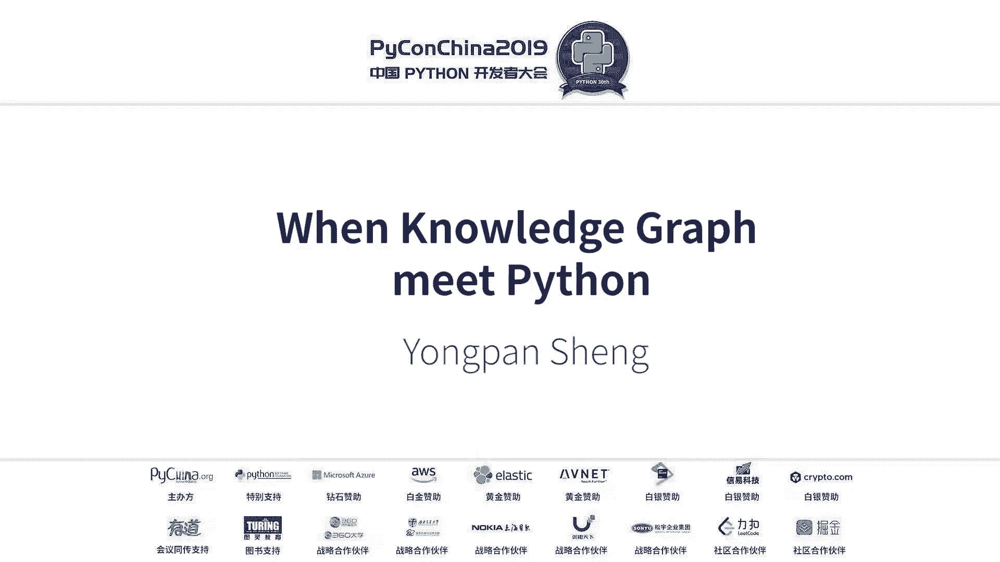
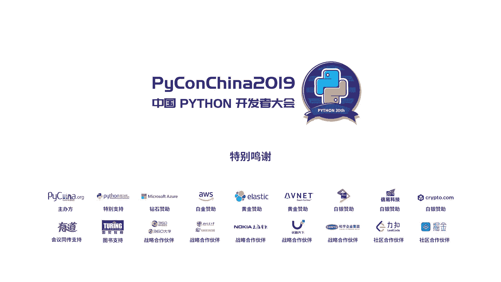

# PyCon China 2019 成都分会场 - P9：9. When Knowledge Graph meet Python - PyConChina - BV1mE411v7t8

谢谢主办方，那谢谢各位同学老师朋友们能够坚持到现在这个时候。呃，刚才那主办方告诉我嗯，我这个toplk只有30分钟。嗯，我的PPT呢大概做了有60多页。呃，这个这个意味着呢我可能就是一分钟要讲两页。

所以说我也尝试这来做一下。所以说讲的可能速度有点快，请大家这个给予谅解知持。呃，我叫永潘是那个来自电子科技大学。呃，在我博士期间呢主要就是围绕着这个knowge graph展开研究。

具体来说呢主要是围绕着开放域的关系抽取。然后tex的 learningning以及这个领域知识的构建。呃，这三大块展开研究里面有若干个小的这个topic呃。

其中呢我就选取了这样的一个领域知识构建的这样一些些有意思的一些东西，然后结合thon语言为大家做一些分享。呃，我的这个呃ina呢包括几个部分。

第一个呢就是一些前沿的部分给大家主要展嗯说明嗯这个这是图谱出现的历史必然性。第二个呢就是讲如果我们通过这个自动化数据驱动方式来构建这样一套这个整个这个图谱的拍line，就是它的这叫做什么呀？

整套的这个这个技术站，或者说这样的一个构建的整个的过程。第三个呢就是说在基于这个python的生态，或者说python已有的工具里面有哪些做这个图数据管理以及分析的相关的这个工具包，或者说一些组件。

最后呢就是结合一个新闻概念知识图谱的案例，来把这些东西串起来，来告诉大家如何来构建这样一套nge graph。第一个呢就是说从这个公式开始讲起我们现在身处在一个这个AI的时代，一个伟大的时代。然后呢。

有一种这个观点是说AI的这个系统等于这个知识加作，叫知识加推理。嗯，举个例子，比如说嗯我们告诉，比如说这个机器，我问他一兆有多少B，然后我们机器告诉我们等于1024。比如说呢我们问这个机器嗯。

这个叫做呃。大类的这个出生地在哪里。然后我们继器告诉他是这个地方，我也不知道怎么读。那我们再看这个过程。首先呢我们告诉机器呃，我们问机器这个依照等于多少B机器能够直接给出我们的答案。

比如说1024那机器可能的潜台词是我已经有这个储备了，这个这个很简单。第二个呢我们告诉我们来问这个机器，就就说我们的嗯这个的这个出生地在哪里。可能我们机器是这么来做的。

先把这个呃通过depending或者说一些这个parting的技术，将这个呃进行解析解析成的东西，然后基于后台的知识库。比如说我们解析完以后会有这种单组的结构。比如说看这个带的名字。

它叫做这个它的这个出生地是这个然后我们根据这个三组的结构进行检索，最后来得到这个答案。那机器的潜单词可能就是说我会推理。那在基于这样的两个简单的这个例子，我们可以可以说明回到这个我们的这个公式。

我们从这个知识工程的领域来说，我们嗯在这个AI时代，我们更希望我们的系统，或者说我们的什么叫做一个smart的一个 machine。就是希望它能够有知识，并且有一定的推理能力对应到我之前说的。

换句话说呢，我们就从感知和认识的角度来说，我们希望这个属机器，或者说我们我们的算法模型能够去感知这个。数据的分布，并且能够从认知的角度来说，从认知解能够去理解这个数据本身的意义。

我我们希望一个这个这个智能的系统应该是这样的。而这个呢和我们传统的这个就是知识工程领域，这个的核心是一致的。而我们这个知识工程领域的核心。

这个来大家看我这个PPT上来自于这个不大需要华老师他们的这个这这个这个报告。因为rese，我们需要严谨一些，就引用别人的东西呢，我们需要写清楚啊。这这个呢来源于就是知识工程对于符号主义。

因为知识工程本身最开始的就是来源于符号主义的一些观点。我刚才提到了一个smart或者说一个智能的AI系统需要有领域的知识，再加上它有一定的推理能力。那这个呢和符号主义的认知是完全一致的。

就说认知及计算知识是一种形式构成智能的基础。而我们智能的这个核心呢是需要我们有知识的表示认知推理和运用的能力。这这个我再举个例子，比如说我现在如果我拿我人类专家的来举例，呃，假设呃我问你我们现在在哪里。

你会告诉我，我们在这个西南交大的这个呃这个就是嗯图书馆。对，这个就是你已经有这个知识储备的。换句话说来，你在在你的这个知识体系里面已经有这种背景知识，常识知识的信息。那为我们同样希望机器是有这种能力。

所以说。哪个门走到这里有多远？你通过你的这个。这个一段时针，你通过自己的这个理解和推理，也能够得出结论。那我们希望机器具有这种能力，这就是。呃，所谓的这种推的一个实力。但这呢在。

传统的知识工程领域受到了严重的这个。制约为什么呢？就是因为我们传统的这个知识工程领域认为。呃，我们的知识严重取决于严重依赖于专家和用户的干预。就是说我们大概我资的背景知识。

或者说我们已有的这样的一些业务逻辑的一些规理，主要依赖于专家系统。而这个呢以以存在什么样的问题。第一个呢就是说知识和获取非常困难。比如说一些领域的知识。比如说一些常识的知识，它往往是隐性的。

往往是过程的。这个对于嗯。如何去定义，如何去表示这个非常困难。第二个呢来说呢，知识应用也存在困难。比如说我们在开放式的应用之中，我们往往很难去确定知识的边界。有些这个需要常识的支撑。

而这些东西我很难去表达表征。但是来说呢，第三点是我们很难去处理这种异常情况。比如说我们定一个规则，就是说我们的鸟不会飞，对吧？那可能会大家想唉，鸵鸟也也可能会鸟，但是它不会飞。那肯定想唉。

我们企鹅很幼是啊？哎，它也不。当然这个当然里面有很多这个悖论啊，就是就不是有很多博弈的东西。我的我所表达的意思就是说在传统的这个知识工程领域，我们依赖于专家，依赖于专家系统的这些东西。

往往会受到一些现实情况的制约。所以说导致。我们这个传统的知识工程领域。又催生了这个知识工程，就是nledge engineering的飞速的前进和发展啊。首先呢我们现在是一个大数据，我们有了大数据。

第二个来说呢，我们有了很好的model。有了我们机器学习的一些算法，我们可以去去buil非常牛的一些model。比如说深度学习了很多这个计算非常牛的。然后第三个呢是我们有了强大的计算能力。我们有了数据。

我们有了强大的机器，我们有了算力。那这样子呢我们就可以为我们的新时代的知识工程奠定很好的基础。这个怎么说呢？从两个方面来说，在我们大数据的时代，被大规模的知识获取提供了这个有益的支撑。就说原来我们。

在这个呃旧的这个知识工程领域，我往往需要专家系统的一些去干预很多这个定义的规则，或者说专家的一些领域的知识，这个是非常有限的，并且是很难去适用于开放域的一些场景。但是我们有了大规模的数据。

有了准确的这种。有了很多非常优质的这个算呃优质的这个算法和强大的算力。我们就能够从我们的数据中通过自动化的方式，通过学习的方法去得到高质量的这个知识。同样的。

我们这个和传统的就是说从嗯从通过专家领域的这种知识，就是从自上而下的，就是因为你先有领域的东西，再往底下到数据实力的。而我们现在的意义上是从下往上。就说我们是通过学习算法。

从大数据异构动态碎片化的里面去学习有益的知识。所以说这个为自动化的知识获取提供了。这个支持正因为有了现在我们继续学习的算法，有了算例，并且有了大数据。所以说大数据时代的道理。

到来使得知识库技术突破了长久以来制约其发展的规模和质量瓶颈，而知识图谱那这正是在这个背景下应运而生。这这个就是我嗯借鉴肖华老师他们的这这一套东西来给大家阐述了在现在这个背景下。

我们催生了我们知识图谱这样的呃知识图其实是一种它里面东西非常多。其实我们可以把它理解成就是就那后面我来慢慢来去讲。那我们来看知识图谱是什么呢？知识图谱呢本质上是一种大规模的语义网络matic体 web。

它来原来的matic体 web，它呢主要是由这个实体所构成。里面呢我大的来说就是实体个概念所构成。它的编呢就表示实几个概念。间的这种关系啊，实体之间的这种关系。但是现在来说，嗯，在这个发展到现在。

制度部里面的这个节点已经不仅是实体，包括实体概念属性，包括19年这个呃18年19年ACR或者是EM2RP的一些文章。他把这个节点甚至是做成事件，或者做成句子 sentenceences一些东西。

那我们看嗯自1984年到2014年呃，谷歌的nb是2012年提出的，我们已经有了大规模的这个知识库，包括这个有名的鸭狗DBP点，就是facenetkiP点我们这个嗯使用的。大规模的这个就是知识库。

其实我们。其实我们可以看他的这个应用场景。应用场景里面，第一个就是智慧的搜索。当我们在可能在10年前或者说5年前，我们搜在我们的搜索引擎，比如说百度搜索引擎，我们搜，比如说搜刘德华的老婆是谁。

我们搜出来可能是一大堆关键字所包含的一些这个网页的这个信息。那你现在在搜刘德华的老婆是谁，可能搜的直接就是他的答案，他老婆是谁，然正也反正就是他吧，就是那个他的一些辩论。

那个他的老婆就说这个后台是有知识图谱的支撑，而我们谷歌提出ngraph的初衷就是说能让我们这个搜索直接智能能够直接精确到我们搜索的这个结果。本身他的够初衷就是说我们通过搜索能够直接获取到我们所要的答案。

我之前第一个讲的那个例子，就是说那个大卫背up的那个它的出生地在哪里，那也是一个很简单的例子，就是通过depend party，我们先解析本身的这个嗯就是要问题本身它的语义是怎么样的。

然后再通过后台的知识库去做匹配。然后最后我们得出的结果。当我说的是一个大致过程，其实远比几个复杂很多。第二个呢知识图谱还有就是说精确的感知与任务的这个呃与任务的这个推荐。比如说在推荐系统里面。

比如说我们现在经常在淘宝上去买一些东西。我们看A不定期的就有相关的东西给推送出来。我们会觉得非常神奇。这这个甚甚至说我们嗯在一些冷启动的情况下，就说我们没有他可能没有我们过多的信息的情况下。

他也能够为我们精准的去推送一些我们想要的东西。这个后台也需要大规模领域知识以及知识组合的支撑。第三个呢就是智能问答。像原来呢我们问答可能就是嗯比如说嗯我去我问一个问题，可能就是一个答案。

现在呃普遍的这个聊天机器人，包括我们现在去问的一些，就说呃一些问答的程序，后台都是机器人。而这个机器人的后台都需要大规模支识部分支撑。就说而且现在已经实现了这种多模态的问答。

比如说我问你呃今天你长得好看吗？他可能发一张你的今天的你的过去的一个照片，可能又组合成一个这个其他的这种形式，就说我们。发展到今天，我们的这些领域，包括推荐、智能问答、智能搜索。

这些都离不开大规模后台大规模知识库的支撑。而正有了这些技术的支撑，使得我们的东西才更加智能。我们这些服务才更加智能。而智能的定义呢，我们如果从知识工程的领域来说。

我们就是可以把它理解成我们有了这个背景知识，加上我们推理的能力。好，那我提到的这个知识图谱，我们来看知识图谱有哪一些这个构建的方式。第一个呢来说就是手动构建这个handcraft和这个数据构建的方式。

手动构建的这个知识图谱呢，比如说现在的刚才我说的这个over和这个el知库。这个是大家听这个名字手动构建，那你肯定需要很多规则很多专家的东西，那相对来说我们的这个规模就较小。

但是正因为有了这些领域呃领域的这些这些支撑。所以说我们的这个呃我们所说的这个ms它会更加好。而自动化的构知识构建是我们现在的趋势。呃，包括现在有一些就是呃prob和这个呃on。

包括微软的conceptgraph，这些都是通过自动化的方式来构建的。这些规模可以很大，然后质量呢也足够精良。呃，但但是呢正因为是我们完全采用这个自动化抽取的方式。来构建，所以说难免会有更多的错误。

然后呢，这里给出了一个制度构建的一个框架。其实这里面的技术非常多，其实每一点拎出来都至少写几本书啊，有有很多的paper。然后大体来说呢可以分成几个阶段。第一个呢就是说知识抽取，第二个知识融合。

三个知识加工知识更新。我们以此来看。知识抽取呢，我们往往来自于因为是数据驱动的。我们要从数据里面去抽取知识，进而形成图谱的结构。那我们数据呢普遍有三种形式，结构化半结构化、非结构化。

工业界呢常喜欢用这个结构化或者说半结构化的这个数据作为这个支撑，然后去抽取这种知识。而因为因为这种规化相对简单，这方面面比较少。而作为学术界来说，我们基本上都关注于非结构化的数据，再准确点来说。

就是关注自由化自由的文本。从文本里面如何去抽取知识。这个这的难度较大，并且又依赖于更多的这个嗯这个就是NLRP和这个深度学习的技术。那我们看知识抽取呢主要分为两个学派，一个是限定域的关系抽取。

第二个是开放语的关系抽取。所谓限定域，就是说给你给个句子，然后里面在实际尺寸中标注的情况下，我们来把这个语句存行分类。这个呢我们在研究里面常把它做成一个分类的问题。

就是一个嗯一个 label的一个这个这个这个问题。而开放域的关系抽取呢，我们往往是就说我们的smer是不固定的。比如说在这个句子里面，姚明出生在上海。

我们抽取出的结果可能就是姚明出生于上海这个出生于就是它的关系的smer，这个scamer往往是和限定语来比这个scamer是不固定的，它往往来自于这个语句。

通过这个语句的上下文理一些词语来描述这个scamer，这个就是开放语和限定的区别。而限定域的开放抽取里面呢，又包括基于模板的方法，基于某 learning方法。在模板的方法里面呢。

我们往往就基于这个模模板的结构。比如说我们这种收购的关系，比如说X acquired byY我们通过这种模式的结构去非结构化的文本里面去做匹配去抽取。而机器学习的方法呢，我们最开始的从这个特征工程。

那我们和方法再到基。于new networkwork的现在这些深度学历的方法，这个也有相当长的发发展。但现在主流的呢基于弱监督学习的方法，我们主要关注于远程监督的思路。

远程监督的思路主要是说如果这两个实体之间存在某个关系。那么描述它的这个三里面也同样存在这样的关系，这个以下举一些这个例子，我就不展开来说明了。而在开放运动关系抽取方里面呢。

我刚才讲的是现定域现定域的这个里面方法，主要讲的有模板的机器学习的，然后有现在主流的是基于弱监督学习里面的远程监督的一些方法。然后在我们开放域的抽取里面。

我再说一遍开放域是指我们的这个关系的smer是来源于这个 sentenceences里面的上下文里面词语所组成的。它并不是预先定义的。所以说才叫开放域。

而开放域呢里面最由华盛顿大学的AI小组提出了openE的这个想法。后续呢test runnerWOE呀LLIE啊这系统相的研发。

然后有有了这样的一些我这里写了一个大概的t的一个思路来如何来挖掘这个论源如何来通过这个dependent来找这个论源之间的关系。如何来训练分联器，如何来做这个关系抽取和可信度的计算。

这个open iE方法呢里面存在两类的问题。第一类就是三一组识别的错误。这个往往就是说你在一个ences里面你去抽取的时候，往往把这个知识的这个边界给区分错误。比如说这个边界区分大了。

小了第二个呢就是说我们的这个。无信息量的错误抽取了。嗯，然后第二个，我们当我们抽取了从这个里这个非结构化的文本，或者说我们从这个半结构化文本，或者说我们结构化的文本里面抽取一些知识。

以三个组的形式进行表示以后我们还要做什么要做知识融合。知识融合呢主要分成两个大方向，一个是垂直方向的融合，第二个是水平方向的融合。

垂直方向的融合主要指的是高层的这个领域的本体和低层的这个就是本体或实力之间的这个融合。因为我们有了比如说我们有了这个音乐方面的知识库。我们有了音乐家音乐，有音乐加人物这样的知识库。

我们想把两个呢是 graph给默认到一起，那这里就存在知识融合的东西，里面比如说有相应的有匹配匹配的框架。比如说元素级结构级的这个匹配。比如说是有实体对齐，比如说人价关系的合并。

这个在我后面的这个那个案例里面都会讲到。第三个呢就是说我们那个冲突检测。比如说这个刘德华在百度百科里面的刘德华和VPVP data里面的刘德华指的是同一个人那部如何把这两个都链接到同一个知识库。

这个就指的是这个知识融合里面的这个技术。当然有一些这个典型的应用的系统。而我刚才提到的这个主要是水平方向的融合。就比如说两个百科里面它有共同的这个事体。如果我们来解决冲突。

如何把这同样的东西能够link到同呃link到同步的知识库上。而垂直方向呢指的是比如说高层我们高层这个知识库上面呢，比如说领域的文体啊poliology的东西，就是模式层的东西。

我们如果从模式层的东西到低层的这个数据层的东西做一个默认。呃，知识加通呢又包括这个知识推理质量评估和本体构建。知识推理呢又包括比如说符号级的演算这种推理，包括数值计算的推理。数据计算的推理呢。

我们从这个本身的穿CE的模型到现在的基于呃就是一些这个数值计算的，比如说张量分解的模型。比如说举证分解的这些模型。呃，再者来说呢，还有符号演算和数值计算融合的这些模型，比如说常识知识推理的模型。

这个就有相当多的工作。这里我只是就说把这个大的框架给大家给出。因为这个展开说有太多的东西。然后质量评估呢，为什么要做质量评估。因为我们把这些知识加工以后，嗯这个加工以后，我们要对它本身的可信度进行。

量化我们舍弃低质性这种东西，从而保证整个知识库的质量。最后呢我们讲知识更新。由于你构建的这个知识库，本身我们是需要随着时间和空是时间的这个推演演进和发展，我们需要不断去更新。

比如说今天刘恺威和杨幂上离婚了，不是很简单的，前面离婚了，原来我们他们俩之间肯定是marry的这个关系。那通过这个时间以后，他们俩就可能不是marry的这个关系。

所以说这个知识库本身也是一个不断更新的过程。呃，总嗯总的来说呢，就是通过逻辑结构和这个内容方面又分为从概念从数据层的更新以及数据的全局更新和增量式的更新。这个和这个数据库里面的很多东西是类似的。

然后第二部分呢嗯嗯我们回顾一下，这个就是从。本身的这个知识图构建的思路，我给出了一个大体的框架，然后大概解释了其中一些关键的一些一些一些过程。然后以及一些现在主流的一些模型吧，只是很少的一部分。

然后第二个部分呢，我就在讲python工具如何来服务于这个知识图的构建。第一个就讲的是斯坦福的康NRP这个工具呢，如果你做NRP，你就一定会用到这这个这个是。这个东西呢就是在在这在这里。

它其中不仅java，然后python，还有一些这个ru比各种这个语言的接口。他所做的事情其实很丰富。比如说拿第一个命运实体来识别来说。

他可以识别出这个 sentenceence里面的这个比如说person它的location，然后它的d它的他的music，它的这个实体。比如说第二个共制消解，时代消解。

它能够将第二个case去消解成实际它指的是前面那个中国的那个总统。然后第三个呢做depend party能够分析剧里面这个不同成分之间的这种依赖的关系。这个都是coRP里面能做的。

后面我讲那个例子的时候，也呃也会用了这些东西。所以说把这些拎出来。第二个工具呢讲的是就是华盛顿大学的 out这个系统。

这个是专门用于目前为止就说在做开放域关系抽取里面为什么这么关心开放语第一个是我在这方面有一定的研究工作。第二个就是后面例子也是用开放域抽取来做的。

所以说我提到了开放关系抽取进而又提到了在thon里面可以通过呃就是on这个组件来调用这个 out这个接口，这个本身是有java，但是th是以调用的这个这个来进行这个直接的这个开放域的抽取。

比如说拿这个句子为例呃这个是美国总统给 a给 speech后在这个时间它抽取出的三元组就是这个的这个信息比如说他抽取出了3个这个然后第二个呢他抽取出来的这个三元组呢每个都会有一个信度知信度高的就说明这个事实性知识。

这个是有效的这个也对应我刚才之说的，我们在那个。知识融合里面，我们来看这个我们这个融入的这个知识可信度是否足够高。

第三个工具呢就是说做我们这个图谱展示或者说图网络分析的这个一个是叫做nextwork X，这是可以画一些权重的图，可以画多层感知机的图，可以通过这个去计算一些最短的路径，包括一些图数据的一些算法。

然后第二呢就是这这个叫做JP版，这也是一个工具。这个里面呢可以直接支持复杂网络的分析，包括你把一些这个呃CSV文件，包括一些J层的文件直接导入。然后就生成这个结构，这个是我本来前面想讲的一个例子。

这个但是时间有限你就不讲了。这个就是我分析的那个专家学者的这个关系。然后最后讲一个例子，呃，前面讲到了就是说如何构建这一整套这个知识图谱。第二个我讲到python的这个生态里面有哪些基于图数据管理。

图数据分析和一些可视化展现的一些工具。内容来看，如何把这些东西结合起来来构建一套知识图图。这个是我们的动机，为什么会有一个这样的一个动机呢？首先我们嗯是来源于这样的一些背景背景的一些想法。

当我们有了一堆这个相关的这个领域或者说新闻的文档时，比如说我给你看让你看十0篇的新闻文档，正常的人是怎么来看的呢？比如说我可能会圈圈点点。我看到这个，比如说我告诉你，这都是美国总统选举的。

你可能会看到奥巴马，你哦sorry，你可能会到看到特朗普，你可能会画一个横线，再看到另外的这个相关的信息，你可能又会标记又会标记。但是当你看到5篇以后，你还能记住前面多少呢？比如说这是100篇文档呢。

你还能记住多少信息呢？按照我们人类的成立方式，这种用圈圈点点的这种方式，然后不断的去组织信息划重点。我们再根据我们人类的认知和感知的思维，将这些信息连接起来，这个是非常困难的。所以说基于这些考虑呢。

基于上述考虑。呃，这是我的动机。呃，首首先呢我们有哪些问题，就是如何挖掘和组织这些有意义的实体和概念。在在在这样相关的这些文档，同一个主题相关的文档里面。第二个呢是就是传统的这个关系抽取方法。

刚我讲了就是限定的开放限定的这个关系抽取方法，我们这mer是有限的。而我们无法去组织这样的。比如说我在这篇里面讲的是奥巴马。

我们讲的是他的这个呃他他的是现在是这个美国总统的这个信经是美国总统那篇讲的是它可能出生地是什么？如果我们在限定里面，我们这次camer是有限的。我们根本就无法去组织这种多样的这种关系的类型。

所以说呢这这是满足不了需求，所以说必须要用到开放域的一些思路。第三个呢就是对于人类来说，我给你给十0篇文档，我不如给你给一个图。

你通过一个图更能够反映出这个主题下核心的内容和它的要表达的主旨和语义的信息，而不是说我给你给十0篇文档，你一篇篇读。再通过标记，再通过这个人类思维组织的这些方式，把这些文档串联起来。

这个就是我做这个的思路。嗯，这样的我题嗯嗯这样就提出了一套系统，它能够去抽取这样一系列相关文档里面显著的实几个概念，并且通过呃这个概念知识图谱的形式进行展现。比如说这个图里面，这个就是里面抽取出来的。

通过我给你给1天美国总统选举的这个文档。我可以看出这里面有哪些东西。首先可以看出来特朗普他嗯参加了2016年美国总统大选，同时呢有60%的这个支持者。同时呢他的有一竞竞争者是这个呃希拉里。

而希拉里呢会受到邮件文的影响。而邮件文呢又首先曝光于这个时间，而这个呢有可能会影响他60%的支持率。通过我给你给这个图，你就很能够去了解。通过知识图谱就能够很好去了解的。在这个主题下。

众多篇文档里面所表示的核心的寓义。好，然后我们来看如何来构建这样一套知识突谱。呃，我把它反成三个任务。第一个任务叫做候选的事实的抽取。第二个叫做知识过滤。第三个叫做概念知识突谱的构建。

这个形式化的表述就略过了。就为这个片量大家现来看这个图。首先呢我们这个数据源示非结构化的这个文本的比较库。我们首先通过就是下面的这个这是抽取的呃这个openIE的思路来抽取出这个三元素。

但是说这些三元组抽取了大量海量三元素，比如说1天一篇文章里面，比如说是100个这个比如说10个三素，我们可能就抽取出100个三元素。那我们100篇来抽取出这么多三元素。这么多三元组来说。

和我们领域相关的和我们真正总统选举这些相关的有多少呢。所以说我们提出的第二套就是知识过滤的算法。然后第三套呢，我们就是通过把这些过滤的能够去link到一起。刚才之前讲的这个知识加工方法。

然后我们能把这个统一的等价的概念给链接到一起，最后形成突破的结构。我们先看这个数据源，数据源我们用的是这个就是一个这个领域的这个数据集，然后和我们爬虫爬到的一些这个数据，包括这样的一些topic。

这些topic又属于5个不同的这个t。一共这个都是用30篇文档，文档的这个token大概是token就是它的这个这重文叫做什么这个。叫做单词的这个数量就是有这么多个来源主要来源于新闻和这个模客。

然我们来看知识抽取。知识抽取呢，我们首先用三部分。第一部分呢我给这个文档做ranking呃做raking。就是说我们把这个本身的这个文档进行排序，把有意的这个和这个主题最相关的这些文档给挑选出来。

第二个做控制消解，共制消解就是说把里面的这个呃支词比如说K这样的东西进行有意的替换。第三部分呢就是用t给里面的语句再进行排序。然后呢。

我们用到了刚才我提到的在工序里面有个华盛顿大学的 out这个系统直接抽取出这种三的结构。比如说在这三组里面，我们提抽取出来的rap这个信息就是华盛顿是呃这个乔治华盛顿是美国第一任总统。

然后第二个知行度是0。88就比较低。那我们可能信任第一个事实。然后呢，我们通过质代消解以后，比如说这个底下的例子，比如说hi我们通过控制消解，我之前讲的计换成华盛顿以后。

那我们的这个抽取的准确率能够得到显著的提升。在上面来看，我们本来用hi来说，这个就是不确定的质代。那我们这个信度只为0。45，抽取完了以后有0。质代后的有0。90。第二部分知识过滤，知识过滤呢。

我们的目标是把它嗯就说把我刚才提到的就是说我们抽取出的这些三元组里面，我们要找和这个主题真正相关的。所以我们把它把它这个叫做形式化的定义为一个整数规划的问题。然后这这个就是规划的一些问题。

然后有一些这个求解的方法。最后这是这是一些这个参数的东西。然后第三部分呢就是说这个知识图谱的构建。那我们从这个从这个文档里面抽取出呃大量三元左右通过知识过滤得到的领域的一些三元组以后，如果把它链接起来。

第一个呢，我们就合并等价概念。等价概念呢，比如说这个特朗普，然后唐纳德。这些都指的是同一个人。那我们根据字符的一些特征进行合并。第二个是呢对于NER就是命名实体。我们通过这个这搜索引擎。

比如说你搜索这个呃特朗普和特纳德特纳德特朗普在这个知识引擎里面，在这我们的搜索引擎里面都会指向同一个人，这个就是利用了知识引搜索引擎的一些这个ITlink的这些一些东西。

第三个呢就是说我们人人为的去就是通过专家的方式再去定义一些这个呃就是他的这个标签的结果呢把它连成一个图。呃，最后呢我们就形成了这样一套知识图谱。然后呢我们进行一些实验的验证。比如说实验的验证里面。

我们通过句子级别的抽取验证和这个这个叫做user study方式进行验证。验证呢我们这些平台结果通过我们的方法，我们呃抽取的这个这I指0。58就说我们的抽取我们的方法证明我们方法的有效性。

然后第二个呢就是我们对质量的对这个突破的质量进行分析。我们通过主机概念的覆盖率和它的执行度和它的概念的这个就是说f的这个兼容性。我们看出我们的这个我们能够百分之百的覆盖主机的概念。第二个呢。

它的这个呃就是执行度能达到87%平均来说，但我们的这个兼容性比较差，68%。所以说这个值得进一步的探索。嗯，这个一些结论就说我们通过这样的一个例子讲述了我们如何来这个抽从非结构化文本里面抽取知识。

然后形成一套这个新闻的概念突破。呃，然后未来的呢我刚才提到了我们的这个知识的兼容性比较差。我们有一些改需要进一步的来改进。然后我们的代码和这个数据集已经放到这个上面了。

这篇文章已经被2018年的ECPKTD接收。然后这个嗯就说已经这个发表。然后基于这个工作呢又有两个新的这个文章，然后分别发表于今年的AP web和3W勾。

然后这两篇文章大家做的东西在网上都可以看到这个下面的文章可以得到这个详情，这个就是我今天分享的所有的内容，感谢大家。十は。啊，你请说，不好意思。哎，盛博士你好啊，呃，我想请问您一个问题，是这样的。

你刚才提到因为知识图谱的这个他的这个强大性对吧？包括他对这种知识融合呀，知识工程的这些东西。但是我作为一个用户，我发现我现在在京东也好，天猫也好，我做这种比如说我购物的时候，我想跟智能客服聊天。

我发现他很智当。就是您是觉得呃就是我想让您分析下，就是从学术和工程的角度来分享，是因为他本身数据量有限，或者说还是因为他在技术上比如说本体的构建，包括RDF3股的这种构建。

包括这种呃就是说从技术上的这种呃就是说缺陷导致他呃无法达到我们很想要的那种效果。能不能分析下，就是现在感觉他的并不是那么智能啊的原因是什么？谢好感谢。

嗯那个吉他品ID开组说明你还是对这块有相当的这个关注，也也懂得不少。就是那个就是呃因为我不是做QA的。呃，但是呢就是说QA这块呢，我理解有两个方面。第一个方面呢，目前QA的发展，就是说京东这些。

你如果提一些非常非常就说因为第一个是。你大量的这个就说嗯人类造的一些这个问题，使得这些东西确实和领域都无关。你比你比如说你你你问就说你比如说问我吃饭的吧，你不你不好好问。

你问一个这个我你就问一个很怪的一个问题。像这些问题，其实。人类都很难去回答，你何况让机器那么智能呢？这这个是你们很喜欢验证，对吧？你们你们验证的一些问题其实都是很变态的，真的，我现见过很很多人的。然后。

然后然后第二个问题，就本身你说这个它的这个交互性良好性还不够。这个这这个我认为呢它是存在一个就是说技术瓶颈的问题。这个你你如果嗯就说因为因为我们最后我们的目标是让它能够去适配所有的领域。

但是你想你在购物领域，你是这么来问你在其他领域又是这么来问你不同领域的这个人和不同领域所了解的这些内容其实都是不一样的。而我们作为我们不我们做research。

往往是在某一个董命底下去做research，我们不能去做的，我们的泛化能力也不能做的这么的这么这么的泛化。这这这个我认为是它存在一些技术的制约。

如果我们同一个如果我们同一个model能够在100个东品以下都跑的很好。那那我觉得太难了。就比如说让你同一时间，你我是学那个计算机的，比如说我水利工程的，比如说学化学的都来问你问题。

你让都得到他们满这答案，你觉得可能吗？哦。然后算是您就用这个这OKOK。嗯。我是做应用开发的人是然后呃我没有我知道这个知识领域，但是我没有亲自实践过。所以我我比较关心的，比如说呃就两个小问题吧。

是你在准备一些料的时候你的爬虫是一个完全的独立部署爬虫？还是这爬可依赖比gle的I或者说然后第二个小问题比说在跟他们有没有那种这个知识入门的一些比如这样的像项目啊，或者说比如我们作为为这个领域的小白。

比说有有哪几个最经典的我们可以使用一尝试O首先那个领域数据的问题数据的。刚才您提到您做应用方面的那您可能更多用的是就说需要去扒写数据。

而我们来说我们有一些专业的数据集是我刚才提到的就是我们现在目前为止我们今有太多的领域的这个知识库。比如说音乐领域的。比如说这个比如说比说狗P这些都是可以去用的。比如说我们百科的也有大量东西。

包括你从那个P里你可以当下来我们百科的整个这个这里你觉得还不够大吗？几亿的这个数据然后然后第二个就是那个您提到就说入门方面的，大家可能都喜欢看书，目前的这个书一共有上一共有三本一本是那个中科院赵军老师。

他们这个编写的第二本是有那个东大学会王浩奋和那个他们编写的一本书。然后第三本呢是由南大学华老师，就是我刚提到的他们编写的一本书。目前还有第四个，就是我要写一本书我已经。

我我们的那个书已经那那个不是写的那个那本书，就是已经这个就是在翻译过程中，是一个老外写的，在我在我博士后阶段会写一吧那就那那那本书，现在目前就是市面上这三本书，然后相应的资源来说。

这个呃你可以这个那个就是因为有太多，因为我也整理了一个这个体系结构，你可以给我邮件，然后我发给你。那个那个您刚才说的就有很多语料库嘛，就是对呃而且确实呃比如说抽本体的话，可以直接用那个文PDR。

但是呃比如说一些很新的东西，假如说比如说明星八卦，那那这些都是很快更新的东西，他可能比如说在百度百科或者明星百科上面都还不具备。那这这些东西，比如说要新的东西，一般怎么抽取？那你怎么知道他更新了呢？

对啊，就是就我非常也想请教您，就是这些比较新的一些东西，我想比较快的去去抓取它，然后再去分析它。首先这些承载这些的载体是什么？是文本文件还是说视频还是说图片这些东西。他可能是很多各种新闻啊。

乱七八糟的就各种网盘的那那种那那我觉得可能就是只能是你自己手动去写他什么去抽，而现在主流的思路都是后台要依赖于一个已有的这个知识库。比如说很多都是说你你刚才提到的八八卦这些东西。

比如说这个啊这个这个就太复杂了。这些人这个这些人。这人的关系真的太复杂。这些人就一般上来说，就今年他们有有做一个这个就是娱乐圈的那个支识度，我去看了一下，真的是大家感兴趣说不个鬼微信。

我把这个相应的资源给你真的是太复杂了，他会从这个各种这个领域的知识里面去抽。但是他们绝大多数都是依依赖于VKP点，就是我们大部分的这个优质的这个资源，而而这个人就比如说前段时间里程送那个石头，对吧？

几秒钟他就会更新了，这个也没有你想象的那么慢，很快他就会更新。因为因为现在后台更新的这个算法也很快。而你说的就说有些比如说你你说呃现在现实发生的这些事情，一秒钟两呃，不是就说在很短暂的时间发生。

他可能会不会更新。那这些你可能自己去写爬生抽，但大部分都是依赖于后台的一个优质的知识资源，大部分就使用我们这个VKP点中文的VKP点去获取知识。打开。

